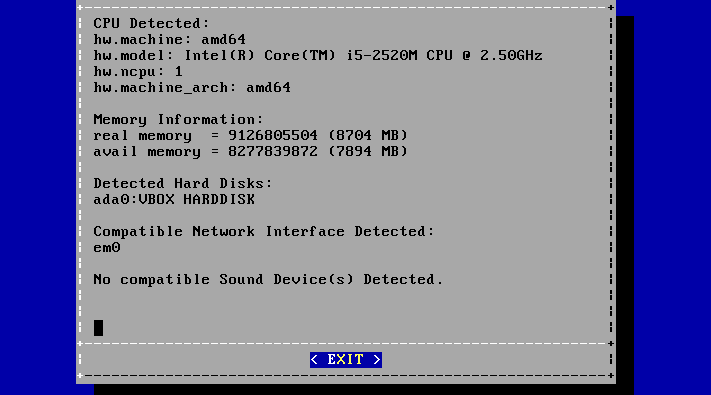
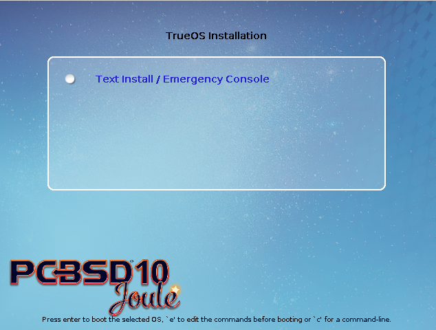

.. index:: install
.. _Advanced Installation Topics:

Advanced Installation Topics
****************************

The previous section discussed a default installation of PC-BSD®. This section covers the following advanced installation topics: 

* :ref:`Using the Text Installer`

* :ref:`Install a Server`

* :ref:`Using the TrueOS® CD`

* :ref:`Convert a FreeBSD System to PC-BSD®`

* :ref:`Dual Booting`

* :ref:`Creating an Automated Installation with pc-sysinstall`

.. index:: install
.. _Using the Text Installer:

Using the Text Installer
========================

If you prefer to perform an installation using an ncurses menu rather than a full graphical installer, select the option "Text Install/Emergency Console" from
the PC-BSD® installer boot menu shown in Figure 3a. Once the installer finishes loading, you will see the screen shown in Figure 5.1a.

**Figure 5.1a: Text Installation Menu** 

.. image:: images/text1.png

This initial menu provides the following options: 

* **install:** continues the installation using the text-based installer.

* **xorg:** launches the graphical installer described in :ref:`Installing PC-BSD®`. 

* **vesa:** launches the graphical installer in VESA mode.

* **utility:** launches the menu described in :ref:`Using the System Utilities Menu`. 

* **reboot:** exits the installer and reboots the system.

Use the up/down arrows to highlight a menu item then press the :kbd:`spacebar` to select the highlighted item. When finished, press :kbd:`Enter` to save the
selection and move on to the next screen.

.. index:: install
.. _Installing a Desktop:

Installing a Desktop
--------------------

If you keep the default selection of "install", the next screen will prompt to install a desktop or a server, as seen in Figure 5.1b. 

**Figure 5.1b: Select Desktop or Server**

.. image:: images/text2.png

If you choose to install a desktop, the KDE and Fluxbox window managers will be installed and configured for you. After the installation is complete, the
system will boot into the usual post-installation configuration screens.

This section provides an overview of the screens which are common to both desktop and server installs. The next section describes the additional screens found
in a server install.

After making a selection and pressing enter, the next screen will display the available disks on the system. In the example shown in Figure 5.1c, one disk is
available.

**Figure 5.1c: Select Installation Disk** 

.. image:: images/text3.png

Select the disk to install into and press :kbd:`Enter`. In the next screen, the installer will display all available primary or GPT partitions. In the example
shown in Figure 5.1d, there is only one partition and the installer has selected the default of installing to the entire disk.
**If you have multiple partitions and disks, carefully select the disk and partition to install to.**

**Figure 5.1d: Select Partition** 

.. image:: images/text4.png

The next screen, shown in Figure 5.1e, is used to select the type of disk format. If the installation disk or partition is larger than 2 TB, *GPT* **must** be
selected. Otherwise, selecting *GPT* should work for most hardware. When installing on older hardware, or if the newly installed system will not boot after
selecting *GPT*, select *MBR* instead.

**Figure 5.1e: Select Disk Format**

.. image:: images/text5.png

The next screen, shown in Figure 5.1f, is used to select whether or not to use the GRUB boot manager.

**Figure 5.1f: Select Boot Manager** 

.. image:: images/text6.png

The default is to use *GRUB* as it is required to support boot environments. If you select *none*, no boot manager will be installed and boot environments
will not be available.

The next screen is shown in Figure 5.1g.

**Figure 5.1g: Full Disk Encryption**

.. image:: images/text7.png

This screen provides the option to encrypt the selected disk(s) with the FreeBSD `GELI <https://www.freebsd.org/cgi/man.cgi?query=geli/qgit/>`_ framework. If
you keep the default of *Yes* and press enter, you will be prompted to enter and confirm a passphrase. You will be prompted to enter this passphrase whenever
you boot into PC-BSD®. This means that if someone else boots your computer, they will not be able to boot into PC-BSD® if they do not know your passphrase.
**However, if you forget your passphrase, you will not be able to access PC-BSD® either.** For these reasons, it is important to choose a good passphrase
that other users will not guess and which you will not forget. Passphrases are case-sensitive and can contain spaces. The passphrase should be memorable to
you, such as a line from a song or piece of literature, but hard to guess in that people who know you should not be able to guess your favorite line from a
song or piece of literature.

.. warning:: be careful if you have changed your keyboard variant and layout. At this time, the GELI encryption framework only supports QWERTY passphrases, so
   do not use any characters not found on a QWERTY keyboard in your passphrase. **DO NOT** set a passphrase with accents or special characters which are not
   found on a US keyboard. This is a limitation in FreeBSD as the keymap is not loaded until after the passphrase is entered, meaning that such a passphrase
   will render that partition as inaccessible.

The next screen is shown in Figure 5.1h.

**Figure 5.1h: Configure Remote Access to AppCafe**

.. image:: images/text8.png

If you would like to manage installed software or jails from your phone or a remote system, press enter to select the default option of *Yes*. If you only
plan to use :ref:`AppCafe®` from the system you are installing, arrow over to *No* instead.

The next screen, shown in Figure 5.1i, provides the following options: 

* **install:** to start the installation, select this option and press enter.

* **wizard:** select this option to re-run the text installer and re-input your selections.

* **edit:** used to review, and possibly change any of the installation parameters.

* **hardware:** selecting this option will display a summary of the system's hardware. The example shown in Figure 5.1j is from a system with a disabled sound
  card and no wireless card.

* **quit:** select this option to return to the screen shown in Figure 5.1a. 

**Figure 5.1i: Review Installation Options** 

.. image:: images/text9.png

**Figure 5.1j: Hardware Summary**

If you select "edit", the menu shown in Figure 5.1k will open.

**Figure 5.1k: Edit Menu** 

.. image:: images/text11.png

This screen contains the following options: 

* **disk:** used to change the disk to install into. Selecting this option will re-open the screens shown in Figures 5.1c through 5.1g, and then return you
  back to this menu.

* **zpool:** select this option if the system contains multiple disks and you wish to change the disk layout to a mirror or RAIDZ. The allowable layouts for
  the number of disks will be displayed so that you can select the desired layout.

* **zfs:** used to modify the default ZFS layout. Selecting this option will open the screen shown in Figure 5.1l. To edit the properties of an existing
  dataset, highlight the dataset's name and press enter. This will show the list of available ZFS properties for that dataset, as seen in the example shown in
  Figure 5.1m. To change the value of a ZFS property, highlight it and press enter. The available values will vary, depending upon the selected property. If
  you wish to add additional datasets, select *add*. This will prompt for the full path of the mountpoint to create. For example, you could create a dataset
  named :file:`/usr/shares`. The dataset you create will be added to the bottom of the list. If you select the dataset and press enter, you can set its ZFS
  properties. Once you are finished customizing the ZFS layout, select *done*.

.. note:: while you can delete a dataset, the default datasets are needed for boot environments. For this reason,
   **it is not recommended to delete any default datasets.** ZFS options are described in  and you should not change any options unless you are familiar
   with the ramifications of doing so.

* **network:** used to configure networking. Selecting this option will prompt to enter a hostname, to select either automatic DHCP configuration on all
  interfaces or to specify the interface to configure, and whether or not to enable SSH.

* **packages:** used to install additional packages. The following package roles are available: "Devel", "FreeNAS", "Office", and "Server". 

* **view:** if you select this option, a read-only copy of the ASCII text file containing the configuration script will be displayed.

* **edit:** if you select this option, the configuration script will open in the :command:`ee` editor, allowing you to make changes. The parameters supported
  by the installation script are described in . 

* **back:** select this option to return you to the menu shown in Figure 5.1i.

**Figure 5.1l: ZFS Layout** 

.. image:: images/text12.png

**Figure 5.1m: ZFS Properties for a Dataset** 

.. image:: images/text13.png

.. index:: install
.. _Installing a Server:

Installing a Server
-------------------

If you choose to install a server in the screen shown in Figure 5.1b, neither X nor a window manager will be installed, resulting in a command-line only . Selecting this option will display the screens shown in Figures 5.1c - 5.1g. After the disk encryption screen, the installer will prompt for the following information: 

- enter the *root* password 

- confirm the *root* password (enter the same value) 

- enter the username to use when logging into the server (as *root* logins are discouraged) 

- enter the password to use when logging into the server 

- confirm the password to use when logging into the server 

- enter the real name for the user who logs into the server (can contain spaces) 

- select the default shell for the user's login 

- enter the hostname for the server 

Next, the installer will ask whether or not you wish to enable networking.
If you press “Yes”, you can either select “auto” to enable DHCP on all interfaces or select an interface to statically configure.
If you select an interface, you will be prompted to enter the IP address, subnet mask, IP address of the DNS server, and the IP address of the default gateway.

The next screen will ask if you want to enable SSH access to the server.
It will then proceed to Figure 5.1h and the rest of the installation screens described in the previous section.

Once the server installation is complete, the system will boot into a command prompt where you can enter the username and password that was created.

.. index:: install
.. _Using the System Utilities Menu:

Using the System Utilities Menu
-------------------------------

The text installer contains some handy tools for troubleshooting and fixing an existing PC-BSD® or TrueOS® installation.

If you click the *utility* option in the main menu of the text based installer shown in Figure 5.1a, it will open the screen shown in Figure 5.1n. 

Figure 5.1n: System Utilities Menu

.. image:: images/picture_74.png

This screen provides the following options: 

- **shell:** this option is useful if you are troubleshooting a PC-BSD® system that no longer boots.
  It will open a shell with administrative access that includes the base FreeBSD utilities.
  You can use this shell to try to determine what the problem is and, if necessary, to create a backup or copy essential files to another system.
  When you are finished using the shell, type **exit** to return to the screen shown in Figure 5.1n. 

- **z****import: **this option will prompt for the name of a ZFS pool and then import and mount it.
  The pool will be mounted to */mnt* so you can chroot or manipulate files as needed in order to do some maintenance on the pool.
  

- fixgrub: this option can be used to restamp the GRUB boot loader should the installed system no longer boot.
  When this option is selected, it will first show the available ZFS pools and prompt you to input the name of the pool to import.

- **exit:** this option will return you to the main menu seen in Figure 5.1a. 

.. index:: install
.. _Install a Server:

Install a Server 
=================

The  screen of the PC-BSD® installer can be used to install TrueOS®, a FreeBSD-based server operating system, rather than a PC-BSD® desktop operating system.

TrueOS® adds the following to a vanilla installation of FreeBSD: , the command line version of** ****, **and the command line versions of most of the  utilities.
You will find those utilities in */usr/local/bin/pc-**.
It also installs this  of additional shells and utilities.

For a server installation, using the PC-BSD® installer rather than the FreeBSD installer offers several benefits: 

- the ability to easily  during installation 

- the ability to configure ZFS  

- a wizard (described in this section) is provided during installation to configure the server for first use.
  

**NOTE:** this section describes how to install a command-line only server using the PC-BSD® graphical installer.
Alternately, you can also install a server using the TrueOS® CD, using the instructions in .

To perform a server installation,  as usual.
When you get to the  screen of the installer, select “Server (TrueOS)”, as shown in Figure 5.2a.

Click “Next” to start the “Server Setup Wizard” then click “Next” again to see the screen shown in Figure 5.2b.

Figure 5.2a: Selecting to Install TrueOS®

.. image:: images/picture_65.png

**Figure 5.2****b****: Set the Root Password**

.. image:: images/picture_220.png

Input and confirm the root password then click “Next” to proceed to the screen shown in Figure 5.2c. 

**Figure 5.2****c****: Create the Primary User Account** 

.. image:: images/picture_232.png

For security reasons, you should not login as the *root* user.
For this reason, the wizard requires you to create a primary user account that will be used to login to the FreeBSD system.
This account will automatically be added to the *wheel* group, allowing that user to **su** to the root account when administrative access is required.

This screen contains the following fields: 

- **Name:** can contain capital letters and spaces.
  

- **Username:** the name used when logging in.
  Can not contain spaces and is case sensitive (e.g. *Kris* is a different username than *kris*).
  

- **Password:** the password used when logging in.
  You must type it twice in order to confirm it.
  

- **Default shell:** use the drop-down menu to select the **csh**, **tcsh**, or **sh** login shell.
  

When finished, click “Next” to proceed to the screen shown in Figure 5.2d. 

Input the system's hostname.
If you will be using **ssh** to administer the system, check the box “Enable remote SSH login”. Click Next to proceed to the network configuration screen shown in Figure 5.2e. 

**Figure 5.2****d****: Set the Hostname** 

.. image:: images/picture_119.png

**Figure 5.2****e****: Configure the Network** 

.. image:: images/picture_198.png

Use the “Network Interface” drop-down menu to select from the following: 

- **AUTO-DHCP-SLAAC:** (default) will configure every active interface for DHCP and for both IPv4 and IPv6 

- **AUTO-DHCP:** will configure every active interface for DHCP and for IPv4 

- **IPv6-SLAAC:** will configure every active interface for DHCP and for IPv6 

Alternately, select the device name for the interface that you wish to manually configure and input the IPv4 and/or IPv6 addressing information.
When finished, click “Next” to proceed to the screen shown in Figure 5.2f. 

Figure 5.2f: Configure Remote Access to AppCafe

.. image:: images/picture_86.png

If you would like to manage installed software or jails from your phone or a remote system, check the box “Enable AppCafe Remote*”*.
If you only plan to use  from the system you are installing, click “Next” to instead continue to the next screen.

If you check the box to configure remote access, input a username and password and select the port number to use when accessing AppCafe**®** from another device.
When finished, click “Next” to access the screen shown in Figure 5.2g.

**Figure 5.2****g****: Install Ports** 

.. image:: images/picture_6.png

If you wish to install the FreeBSD ports collection, check the “Install ports tree” box then click “Finish” to exit the wizard and access the summary screen shown in Figure 5.2h. 

Click “Customize” if you wish to proceed to the  screen in order to configure the system's disk(s).

If you wish to save the finished configuration to re-use it at a later time, insert a FAT-formatted USB stick and click “Save Config to USB”. 

Once you are ready to start the installation, click “Next”. A pop-up menu will ask if you would like to start the installation now.

**Figure 5.2****h****: Review Installation Summary**

.. image:: images/picture_102.png

Once the system is installed, it will boot to a command-line login prompt.
Login using the primary user account that was configured during installation.
You can now configure and use the server as you would any other FreeBSD server installation.
The  is an excellent reference for performing common FreeBSD server tasks.

.. index:: install
.. _Using the TrueOS® CD:

Using the TrueOS® CD
=====================

Beginning with 10.1, PC-BSD® provides a CD-sized TrueOS® ISO which provides an ncurses installer for installing a command-line version of TrueOS®. If your intent is to only install servers and you do not need a graphical installer, this ISO is convenient to use and quick to download.

**NOTE:** the benefits of installing TrueOS® instead of vanilla FreeBSD are described in . 

To start a server installation using the TrueOS® ISO, insert the prepared boot media.
The initial boot menu, shown in Figure 5.3a, indicates that this is a TrueOS® installation.

Figure 5.3a: TrueOS® Boot Menu

The installer will finish booting and display the installation menu shown in Figure 5.3b. 

To begin the installation, press enter.
The installation will proceed through the screens shown in Figure 5.1c through 5.1g. Next, additional menu screens will prompt you to set and confirm the *root* password, create a login user and set and confirm that user's password, select the user's shell, set the system's hostname, setup networking, and enable SSH.
It will then proceed to the screens shown in Figure 5.1h and 5.1i. If desired, the installation parameters can be reviewed or edited, as described in .

The TrueOS® boot media can also be used to repair an existing installation, using the instructions in . 

Figure 5.3b: TrueOS® Installation Menu

.. image:: images/picture_228.png

.. index:: FreeBSD
.. _Convert a FreeBSD System to PC-BSD®:

Convert a FreeBSD System to PC-BSD®
====================================

An existing FreeBSD 10.x installation can be easily converted to either a PC-BSD® desktop or server through the installation of a package which is available from the PC-BSD® package repository.
The converted desktop will contain all of the graphical utilities that come with PC-BSD® and the converted server will contain all of their command line equivalents.

**NOTE:** while not required, ZFS is recommended as most of the PC-BSD® utilities rely on ZFS.
Beginning with 10.1, the FreeBSD installer provides an option to create a ZFS pool during installation.

.. index:: FreeBSD
.. _Switching to the PC-BSD® pkgng Repository:

Switching to the PC-BSD® pkgng Repository
------------------------------------------

This section demonstrates how to configure a FreeBSD 10.x system to use the PC-BSD® pkgng repository.
Once this configuration is complete, you can then convert that FreeBSD system to either a PC-BSD® desktop or a TrueOS® 

**Before switching to the PC-BSD® repository, make sure that pkg is installed on the FreeBSD system!**** **If it is not yet installed, you will see the following when you type **pkg**.
Type in **y** to install it.

**pkg** 

The package management tool is not yet installed on your system.

Do you want to fetch and install it now? [y/N]: **y**

If **pkg** is already installed, you will instead get the error message “not enough arguments” if you just type **pkg**.

Next, make sure that pkgng is bootstrapped: 

pkg upgrade

Then, disable the FreeBSD package repository: 

mv /etc/pkg/FreeBSD.conf /root/FreeBSD.conf-old

Now create this directory: 

mkdir -p /usr/local/etc/pkg/repos

Then, create the file */usr/local/etc/pkg/repos/pcbsd.conf* with the following contents.
When the repository is used, it will automatically grab the correct package set to match the operating system version.

pcbsd: {

url: “http://pkg.cdn.pcbsd.org/10.0-RELEASE/amd64”, 

signature_type: “fingerprints”, 

fingerprints: “/usr/local/etc/pkg/fingerprints/pcbsd”, 

enabled: true 

}

Next, create the following directories: 

mkdir -p /usr/local/etc/pkg/fingerprints/pcbsd/revoked

mkdir -p /usr/local/etc/pkg/fingerprints/pcbsd/trusted

Then, download the repository's fingerprint file (note that this is one long command): 

fetch --no-verify-peer https://raw.githubusercontent.com/pcbsd/pcbsd/master/src-sh/pcbsd-utils/pc-extractoverlay/ports-overlay/usr/local/etc/pkg/fingerprints/pcbsd/trusted/pkg.cdn.pcbsd.org.20131209

mv pkg.cdn.pcbsd.org.20131209 /usr/local/etc/pkg/fingerprints/pcbsd/trusted/

Finally, update the package database and any installed packages using the following command: 

pkg upgrade -fy

Depending upon what is already installed, you may have to resolve some error messages in order to successfully upgrade all packages.
To install and delete packages, use the **pkg** command as described in . 

.. index:: FreeBSD
.. _Converting FreeBSD to a PC-BSD® Desktop:

Converting FreeBSD to a PC-BSD® Desktop
----------------------------------------

Once the repository configuration is complete, it is now easy to convert a FreeBSD system into a PC-BSD® desktop using the following commands as the superuser: 

fetch --no-verify-peer -o /etc/freebsd-update.conf \ 'https://github.com/pcbsd/freebsd/raw/master/etc/freebsd-update.conf'

freebsd-update fetch 

freebsd-update install

pkg install -fy pcbsd-base

rehash 

pbreg set /PC-BSD/SysType PCBSD 

pc-extractoverlay ports

pc-extractoverlay desktop

Next, reboot the system and the PC-BSD® login manager will start, allowing you to login to the desktop.
If you want the  to run first, run these commands before rebooting: 

touch /var/.runxsetup

touch /var/.pcbsd-firstboot 

touch /var/.pcbsd-firstgui

**NOTE: **if you are using NVIDIA video hardware, load the driver before rebooting into the display wizard by running the command **p****kg install pcbsd-meta-nvidia**.

.. index:: FreeBSD
.. _Converting FreeBSD to a TrueOS® Server:

Converting FreeBSD to a TrueOS® Server
---------------------------------------

If you wish to convert a FreeBSD server to TrueOS®, install the server package instead, then extract the installed utilities:

pkg install -fy pcbsd-utils

rehash 

pbreg set /PC-BSD/SysType TRUEOS 

pc-extractoverlay ports 

pc-extractoverlay server

These steps will install the following: , the command line version of , and the command line versions of most of the  utilities.
You will find those utilities in */usr/local/bin/pc-**.

.. index:: dualboot
.. _Dual Booting:

Dual Booting
============

A PC-BSD® installation assumes that you have an existing primary partition to install into.
If your computer has only one disk and PC-BSD® will be the only operating system, it is fine to accept the default partitioning scheme.
However, if you will be sharing PC-BSD® with other operating systems, care has to be taken that PC-BSD® is installed into the correct partition; otherwise, you may inadvertently overwrite an existing operating system.

If you wish to install multiple operating systems on your computer, you will need the following: 

- a partition for each operating system.
  Many operating systems, including PC-BSD®, can only be installed into a primary or GPT partition.
  This means that you will need to use partitioning software as described in . 

- a backup of any existing data.
  This backup should not be stored on your computer's hard drive but on another computer or on a removable media such as a USB drive or burnt onto a DVD media.
  If you are careful in your installation, everything should go fine.
  However, you will be glad that you made a backup should something go wrong.
  
.. index:: partition
.. _Choosing the Installation Partition:

Choosing the Installation Partition
-----------------------------------

When installing PC-BSD® onto a computer that is to contain multiple operating systems, care must be taken to **select the correct partition**** **in the  screen of the installation.
On a system containing multiple partitions, each partition will be listed.
Highlight the partition that you wish to install into and **make sure that you do not select a partition that already contains an operating system or data that you wish to keep.**** **

**DANGER!** **make sure that you click the “Customize” button while in the “Disk Selection” screen.**** ****If you just click Next without customizing the disk layout, the installer will overwrite the contents of the primary disk.
**

.. index:: GRUB
.. _GRUB Boot Loader:

GRUB Boot Loader
----------------

PC-BSD® uses the GRUB boot-loader to provide ZFS boot environment support, which is used as part of the system updating mechanism.
**Using another boot-loader will break this critical functionality, and is strongly discouraged.**** **

The GRUB boot-loader is capable of dual-booting most other systems, including Windows and Linux.
In order to dual-boot PC-BSD with other operating systems, you can add entries to the */usr/local/etc/grub.d/40_custom* file, which will be preserved across upgrades.
For more information on the syntax used, refer to the . 

PC-BSD® will attempt to identify other installed operating systems to add to the GRUB menu automatically.
If you have an operating system which is not detected, please open a new bug report on  with the following information: 

- name of the operating system 

- output of the **gpart show** and **glabel list** commands 

- any entries you added to */usr/local/etc/grub.d/40_custom* 

.. index:: install
.. _Creating an Automated Installation with pc-sysinstall:

Creating an Automated Installation with pc-sysinstall
=====================================================

PC-BSD® provides a set of Bourne shell scripts that allow advanced users to create automatic or customized PC-BSD® installations.
**pc-sysinstall** is the name of the master script; it reads a customizable configuration file and uses dozens of backend scripts to perform the installation.
You can read more about this utility by typing **man pc-sysinstall**.

Here is a quick overview of the components used by **pc-sysinstall**: 

- **/usr/local/share/pc-sysinstall/backend/** contains the scripts used by the PC-BSD® installer.
  Scripts have been divided by function, such as *functions-bsdlabel.sh* and *functions-installcomponents.sh*.
  If you have ever wondered how the PC-BSD® installer works, read through these scripts.
  This directory also contains the *parseconfig.sh* and *startautoinstall.sh* scripts which **pc-sysinstall** uses to parse the configuration file and begin the installation.
  

- **/usr/local/share/pc-sysinstall/backend-query/** contains the scripts which are used by the installer to detect and configure hardware.
  

- **/usr/local/share/pc-sysinstall/conf/** contains the configuration file *pc-sysinstall.conf*.
  It also contains a file indicating which localizations are available (*avail-langs*), and a *licenses/* subdirectory containing text files of applicable licenses.
  

- **/usr/local/share/pc-sysinstall/doc/** contains the help text that is seen if you run **pc-sysinstall** without any arguments.
  

- **/usr/local/share/pc-sysinstall/examples/** contains several example configuration files for different scenarios (e.g. *upgrade*, *fbsd-netinstall*).
  The *README* file in this directory should be considered as mandatory reading before using **pc-sysinstall**.
  

- **/usr/sbin/pc-sysinstall** this is the script that is used to perform a customized installation.
  

To create a custom installation, perform the following steps: 

1. Determine which variables you wish to customize.
   

2. Create a customized configuration.
   

3. Create a custom installation media or installation server.
   

These steps are discussed in more detail below.

.. index:: install
.. _Determine Which Variables you Wish to Customize:

Determine Which Variables you Wish to Customize
-----------------------------------------------

A list of possible variables can be found in */usr/local/share/pc-sysinstall/examples/README* and in Table 5.6a. Note that the Table is meant as a quick reference to determine which variables are available.
The *README* file contains more complete descriptions for each variable.

Table 5.6a: Available Variables for Customizing a PC-BSD® Installation

+----------------------------+--------------------------------------------------------------------------------+---------------------------------------------------------------------------------------------------------------------------------------------------------------------------------------------------------+
| Variable                   | Options                                                                        | Description                                                                                                                                                                                             |
+============================+================================================================================+=========================================================================================================================================================================================================+
| hostname=                  | should be unique for the network                                               | optional as installer will auto\-generate a hostname if empty                                                                                                                                           |
+----------------------------+--------------------------------------------------------------------------------+---------------------------------------------------------------------------------------------------------------------------------------------------------------------------------------------------------+
| installMode=               | fresh, upgrade, extract, or zfsrestore                                         | sets the installation type                                                                                                                                                                              |
+----------------------------+--------------------------------------------------------------------------------+---------------------------------------------------------------------------------------------------------------------------------------------------------------------------------------------------------+
| installLocation=           | /path/to/location                                                              | used only when *installMode* is extract and should point to an already mounted location                                                                                                                 |
+----------------------------+--------------------------------------------------------------------------------+---------------------------------------------------------------------------------------------------------------------------------------------------------------------------------------------------------+
| installInteractive=        | yes or no                                                                      | set to no for automated installs without user input                                                                                                                                                     |
+----------------------------+--------------------------------------------------------------------------------+---------------------------------------------------------------------------------------------------------------------------------------------------------------------------------------------------------+
| netDev=                    | AUTO\-DHCP or FreeBSD interface name                                           | type of network connection to use during the installation                                                                                                                                               |
+----------------------------+--------------------------------------------------------------------------------+---------------------------------------------------------------------------------------------------------------------------------------------------------------------------------------------------------+
| netIP=                     | IP address of interface used during installation                               | only use if *netDev* is set to an interface name                                                                                                                                                        |
+----------------------------+--------------------------------------------------------------------------------+---------------------------------------------------------------------------------------------------------------------------------------------------------------------------------------------------------+
| netMask=                   | subnet mask of interface                                                       | only use if *netDev* is set to an interface name                                                                                                                                                        |
+----------------------------+--------------------------------------------------------------------------------+---------------------------------------------------------------------------------------------------------------------------------------------------------------------------------------------------------+
| netNameServer=             | IP address of DNS server                                                       | only use if *netDev* is set to an interface name                                                                                                                                                        |
+----------------------------+--------------------------------------------------------------------------------+---------------------------------------------------------------------------------------------------------------------------------------------------------------------------------------------------------+
| netDefaultRouter=          | IP address of default gateway                                                  | only use if *netDev* is set to an interface name                                                                                                                                                        |
+----------------------------+--------------------------------------------------------------------------------+---------------------------------------------------------------------------------------------------------------------------------------------------------------------------------------------------------+
| netSaveDev=                | AUTO\-DHCP or FreeBSD interface name(s) (multiple allowed separated by spaces) | type of network configuration to enable on the installed system; can set multiple interfaces                                                                                                            |
+----------------------------+--------------------------------------------------------------------------------+---------------------------------------------------------------------------------------------------------------------------------------------------------------------------------------------------------+
| netSaveIP=                 | IP address of interface *<interface_name>* or DHCP                             | only use if *netSaveDev* is set to an interface name or a list of interface names (repeat for each interface)                                                                                           |
+----------------------------+--------------------------------------------------------------------------------+---------------------------------------------------------------------------------------------------------------------------------------------------------------------------------------------------------+
| netSaveMask=               | subnet mask of interface *<interface_name>*                                    | only use if *netSaveDev* is set to an interface name or a list of interface names (repeat for each interface)                                                                                           |
+----------------------------+--------------------------------------------------------------------------------+---------------------------------------------------------------------------------------------------------------------------------------------------------------------------------------------------------+
| netSaveNameServer=         | IP address of DNS server (multiple allowed separated by spaces)                | only use if *netSaveDev* is set to an interface name or a list of interface names (do not repeat for each interface)                                                                                    |
+----------------------------+--------------------------------------------------------------------------------+---------------------------------------------------------------------------------------------------------------------------------------------------------------------------------------------------------+
| netSaveDefaultRouter=      | IP address of default gateway                                                  | only use if *netSaveDev* is set to an interface name or a list of interface names (do not repeat for each interface)                                                                                    |
+----------------------------+--------------------------------------------------------------------------------+---------------------------------------------------------------------------------------------------------------------------------------------------------------------------------------------------------+
| disk0=                     | FreeBSD disk device Name, (e.g. *ad0*)                                         | see *README* for examples                                                                                                                                                                               |
+----------------------------+--------------------------------------------------------------------------------+---------------------------------------------------------------------------------------------------------------------------------------------------------------------------------------------------------+
| partition=                 | all, free, s1, s2, s3, s4, image                                               | see *README* for examples                                                                                                                                                                               |
+----------------------------+--------------------------------------------------------------------------------+---------------------------------------------------------------------------------------------------------------------------------------------------------------------------------------------------------+
| partscheme=                | MBR or GPT                                                                     | partition scheme type                                                                                                                                                                                   |
+----------------------------+--------------------------------------------------------------------------------+---------------------------------------------------------------------------------------------------------------------------------------------------------------------------------------------------------+
| mirror=                    | FreeBSD disk device name (e.g. *ad1*)                                          | sets the target disk for the mirror (i.e. the second disk)                                                                                                                                              |
+----------------------------+--------------------------------------------------------------------------------+---------------------------------------------------------------------------------------------------------------------------------------------------------------------------------------------------------+
| mirrorbal=                 | load, prefer, round\-robin, split                                              | defaults to round\-robin if the *mirrorbal* method is not specified                                                                                                                                     |
+----------------------------+--------------------------------------------------------------------------------+---------------------------------------------------------------------------------------------------------------------------------------------------------------------------------------------------------+
| bootManager=               | none, bsd, GRUB                                                                | when using GRUB, include its package in *installPackages=*                                                                                                                                              |
+----------------------------+--------------------------------------------------------------------------------+---------------------------------------------------------------------------------------------------------------------------------------------------------------------------------------------------------+
| image=                     | /path/to/image                                                                 | will write specified image file                                                                                                                                                                         |
+----------------------------+--------------------------------------------------------------------------------+---------------------------------------------------------------------------------------------------------------------------------------------------------------------------------------------------------+
| commitDiskPart             |                                                                                | this variable is mandatory and must be placed at the end of each *diskX* section; create a *diskX* section for each disk you wish to configure.                                                         |
+----------------------------+--------------------------------------------------------------------------------+---------------------------------------------------------------------------------------------------------------------------------------------------------------------------------------------------------+
| encpass=                   | password value                                                                 | at boot time, system will prompt for this password in order to mount the associated GELI encrypted partition                                                                                            |
+----------------------------+--------------------------------------------------------------------------------+---------------------------------------------------------------------------------------------------------------------------------------------------------------------------------------------------------+
| commitDiskLabel            |                                                                                | this variable is mandatory and must be placed at the end of disk's partitioning settings; see the *README* for examples on how to set the <File System Type> <Size> <Mountpoint> entries for each disk  |
+----------------------------+--------------------------------------------------------------------------------+---------------------------------------------------------------------------------------------------------------------------------------------------------------------------------------------------------+
| installMedium=             | dvd, usb, ftp, rsync, image                                                    | source to be used for installation                                                                                                                                                                      |
+----------------------------+--------------------------------------------------------------------------------+---------------------------------------------------------------------------------------------------------------------------------------------------------------------------------------------------------+
| localPath=                 | /path/to/files                                                                 | location of directory containing installation files                                                                                                                                                     |
+----------------------------+--------------------------------------------------------------------------------+---------------------------------------------------------------------------------------------------------------------------------------------------------------------------------------------------------+
| installType=               | PCBSD, FreeBSD                                                                 | determines whether this is a desktop or a server install                                                                                                                                                |
+----------------------------+--------------------------------------------------------------------------------+---------------------------------------------------------------------------------------------------------------------------------------------------------------------------------------------------------+
| installFile=               | e.g. fbsd\-release.tbz                                                         | only set if using a customized installer archive                                                                                                                                                        |
+----------------------------+--------------------------------------------------------------------------------+---------------------------------------------------------------------------------------------------------------------------------------------------------------------------------------------------------+
| packageType=               | tar, uzip, split, dist                                                         | the archive type on the installation media                                                                                                                                                              |
+----------------------------+--------------------------------------------------------------------------------+---------------------------------------------------------------------------------------------------------------------------------------------------------------------------------------------------------+
| distFiles=                 | base src kernel                                                                | list of FreeBSD distribution files to install when using *packageType=dist*                                                                                                                             |
+----------------------------+--------------------------------------------------------------------------------+---------------------------------------------------------------------------------------------------------------------------------------------------------------------------------------------------------+
| ftpPath=                   | e.g. ftp://iso.cdn.pcbsd.org/9.1/amd64/netinstall/                             | location of the installer archive when using *installMedium=ftp*                                                                                                                                        |
+----------------------------+--------------------------------------------------------------------------------+---------------------------------------------------------------------------------------------------------------------------------------------------------------------------------------------------------+
| rsyncPath=                 | e.g. life\-preserver/back\-2011\-09\-12T14_53_14                               | location of the rsync data on the remote server when using *installMedium=rsync*                                                                                                                        |
+----------------------------+--------------------------------------------------------------------------------+---------------------------------------------------------------------------------------------------------------------------------------------------------------------------------------------------------+
| rsyncUser=                 | username                                                                       | set when using *installMedium=rsync*                                                                                                                                                                    |
+----------------------------+--------------------------------------------------------------------------------+---------------------------------------------------------------------------------------------------------------------------------------------------------------------------------------------------------+
| rsyncHost=                 | IP address of rsync server                                                     | set when using *installMedium=rsync*                                                                                                                                                                    |
+----------------------------+--------------------------------------------------------------------------------+---------------------------------------------------------------------------------------------------------------------------------------------------------------------------------------------------------+
| rsyncPort=                 | port number                                                                    | set when using *installMedium=rsync*                                                                                                                                                                    |
+----------------------------+--------------------------------------------------------------------------------+---------------------------------------------------------------------------------------------------------------------------------------------------------------------------------------------------------+
| installComponents=         | e.g. amarok,firefox,ports                                                      | components must exist in */PCBSD/pc\-sysinstall/components/; *typically, *installPackages=* is used instead                                                                                             |
+----------------------------+--------------------------------------------------------------------------------+---------------------------------------------------------------------------------------------------------------------------------------------------------------------------------------------------------+
| installPackages=           | e.g. Xorg cabextract                                                           | list of traditional or pkgng packages to install; requires *pkgExt=*                                                                                                                                    |
+----------------------------+--------------------------------------------------------------------------------+---------------------------------------------------------------------------------------------------------------------------------------------------------------------------------------------------------+
| pkgExt=                    | txz, tbz                                                                       | specify the extension used by the type of package to be installed                                                                                                                                       |
+----------------------------+--------------------------------------------------------------------------------+---------------------------------------------------------------------------------------------------------------------------------------------------------------------------------------------------------+
| upgradeKeepDesktopProfile= | yes or no                                                                      | specify if you wish to keep your existing user's desktop profile data during an upgrade                                                                                                                 |
+----------------------------+--------------------------------------------------------------------------------+---------------------------------------------------------------------------------------------------------------------------------------------------------------------------------------------------------+
| rootPass=                  | password                                                                       | set the root password of the installed system to the specified string                                                                                                                                   |
+----------------------------+--------------------------------------------------------------------------------+---------------------------------------------------------------------------------------------------------------------------------------------------------------------------------------------------------+
| rootEncPass=               | encrypted string                                                               | set root password to specified encrypted string                                                                                                                                                         |
+----------------------------+--------------------------------------------------------------------------------+---------------------------------------------------------------------------------------------------------------------------------------------------------------------------------------------------------+
| userName=                  | case sensitive value                                                           | create a separate block of user values for each user you wish to create                                                                                                                                 |
+----------------------------+--------------------------------------------------------------------------------+---------------------------------------------------------------------------------------------------------------------------------------------------------------------------------------------------------+
| userComment=               | description                                                                    | description text can include spaces                                                                                                                                                                     |
+----------------------------+--------------------------------------------------------------------------------+---------------------------------------------------------------------------------------------------------------------------------------------------------------------------------------------------------+
| userPass=                  | password of user                                                               |                                                                                                                                                                                                         |
+----------------------------+--------------------------------------------------------------------------------+---------------------------------------------------------------------------------------------------------------------------------------------------------------------------------------------------------+
| userEncPass                | encrypted string                                                               | set user password to specified encrypted string                                                                                                                                                         |
+----------------------------+--------------------------------------------------------------------------------+---------------------------------------------------------------------------------------------------------------------------------------------------------------------------------------------------------+
| userShell=                 | e.g. */bin/csh*                                                                | path to default shell                                                                                                                                                                                   |
+----------------------------+--------------------------------------------------------------------------------+---------------------------------------------------------------------------------------------------------------------------------------------------------------------------------------------------------+
| userHome=                  | e.g. */home/username*                                                          | path to home directory                                                                                                                                                                                  |
+----------------------------+--------------------------------------------------------------------------------+---------------------------------------------------------------------------------------------------------------------------------------------------------------------------------------------------------+
| defaultGroup=              | e.g. *wheel*                                                                   | default group                                                                                                                                                                                           |
+----------------------------+--------------------------------------------------------------------------------+---------------------------------------------------------------------------------------------------------------------------------------------------------------------------------------------------------+
| userGroups=                | e.g. wheel,operator                                                            | comma separated (no spaces) list of additional groups                                                                                                                                                   |
+----------------------------+--------------------------------------------------------------------------------+---------------------------------------------------------------------------------------------------------------------------------------------------------------------------------------------------------+
| commitUser                 |                                                                                | mandatory, must be last line in each user block                                                                                                                                                         |
+----------------------------+--------------------------------------------------------------------------------+---------------------------------------------------------------------------------------------------------------------------------------------------------------------------------------------------------+
| runCommand=                | path to command                                                                | run the specified command within chroot of the installed system, after the installation is complete                                                                                                     |
+----------------------------+--------------------------------------------------------------------------------+---------------------------------------------------------------------------------------------------------------------------------------------------------------------------------------------------------+
| runScript=                 | path to script                                                                 | runs specified script within chroot of the installed system, after the installation is complete                                                                                                         |
+----------------------------+--------------------------------------------------------------------------------+---------------------------------------------------------------------------------------------------------------------------------------------------------------------------------------------------------+
| runExtCommand=             | path to command                                                                | runs a command outside the chroot                                                                                                                                                                       |
+----------------------------+--------------------------------------------------------------------------------+---------------------------------------------------------------------------------------------------------------------------------------------------------------------------------------------------------+
| timeZone=                  | e.g. America/New_York                                                          | location must exist in */usr/share/zoneinfo/*                                                                                                                                                           |
+----------------------------+--------------------------------------------------------------------------------+---------------------------------------------------------------------------------------------------------------------------------------------------------------------------------------------------------+
| enableNTP=                 | yes or no                                                                      | enable/disable NTP                                                                                                                                                                                      |
+----------------------------+--------------------------------------------------------------------------------+---------------------------------------------------------------------------------------------------------------------------------------------------------------------------------------------------------+
| localizeLang=              | e.g. en                                                                        | sets the system console and Desktop to the target language                                                                                                                                              |
+----------------------------+--------------------------------------------------------------------------------+---------------------------------------------------------------------------------------------------------------------------------------------------------------------------------------------------------+
| localizeKeyLayout=         | e.g. en                                                                        | updates the system's Xorg config to set the keyboard layout                                                                                                                                             |
+----------------------------+--------------------------------------------------------------------------------+---------------------------------------------------------------------------------------------------------------------------------------------------------------------------------------------------------+
| localizeKeyModel=          | e.g. pc104                                                                     | updates the system's Xorg config to set the keyboard model                                                                                                                                              |
+----------------------------+--------------------------------------------------------------------------------+---------------------------------------------------------------------------------------------------------------------------------------------------------------------------------------------------------+
| localizeKeyVariant=        | e.g. intl                                                                      | updates the Xorg config to set the keyboard variant                                                                                                                                                     |
+----------------------------+--------------------------------------------------------------------------------+---------------------------------------------------------------------------------------------------------------------------------------------------------------------------------------------------------+
| autoLoginUser=             | username                                                                       | user will be logged in automatically without entering a password                                                                                                                                        |
+----------------------------+--------------------------------------------------------------------------------+---------------------------------------------------------------------------------------------------------------------------------------------------------------------------------------------------------+
| sshHost=                   | hostname or IP address                                                         | the address of the remote server when using *installMode=zfsrestore*                                                                                                                                    |
+----------------------------+--------------------------------------------------------------------------------+---------------------------------------------------------------------------------------------------------------------------------------------------------------------------------------------------------+
| sshPort=                   | e.g 22                                                                         | the SSH port number of the remote server when using *installMode=zfsrestore*                                                                                                                            |
+----------------------------+--------------------------------------------------------------------------------+---------------------------------------------------------------------------------------------------------------------------------------------------------------------------------------------------------+
| sshUser=                   | string                                                                         | the username on the remote server when using *installMode=zfsrestore*                                                                                                                                   |
+----------------------------+--------------------------------------------------------------------------------+---------------------------------------------------------------------------------------------------------------------------------------------------------------------------------------------------------+
| sshKey=                    | e.g. /root/id_rsa                                                              | path to the SSH key file on the remote server when using *installMode=zfsrestore*                                                                                                                       |
+----------------------------+--------------------------------------------------------------------------------+---------------------------------------------------------------------------------------------------------------------------------------------------------------------------------------------------------+
| zfsProps=                  | e.g. .lp\-props\-tank#backups#mybackup                                         | location of dataset properties file created by Life Preserver during replication when using *installMode=zfsrestore*                                                                                    |
+----------------------------+--------------------------------------------------------------------------------+---------------------------------------------------------------------------------------------------------------------------------------------------------------------------------------------------------+
| zfsRemoteDataset=          | e.g. tank/backups/mybackup                                                     | location of remote dataset to restore from when using *installMode=zfsrestore*                                                                                                                          |
+----------------------------+--------------------------------------------------------------------------------+---------------------------------------------------------------------------------------------------------------------------------------------------------------------------------------------------------+

.. index:: install
.. _Create a Customized Configuration:

Create a Customized Configuration
---------------------------------

One way to create a customized configuration file is to read through the configuration examples in */usr/local/share/pc-sysinstall/examples/* to find the one that most closely matches your needs.
Copy that file to any location and customize it so that it includes the variables and values you would like to use in your installation.

An alternate way to create this file is to start an installation, configure the system as desired, and save the configuration to a USB stick (with or without actually performing the installation).
You can use that saved configuration file as-is or customize it to meet an installation's needs.
This method may prove easier to use if you are performing complex disk layouts.

If you wish to perform a fully-automated installation that does not prompt for any user input, you will also need to review */usr/local/share/pc-sysinstall/examples/pc-autoinstall.conf* and place a customized copy of that file into */boot/pc-autoinstall.conf* on your installation media.

Table 5.6b summarizes the additional variables that are available for fully automatic installations.
More detailed descriptions can be found in the */usr/local/share/pc-sysinstall/examples/pc-autoinstall.conf* file.
Note that the variables in this file use a different syntax than those in Table 5.6a in that the values follow a colon and a space rather than the equals sign.

**Table 5.****6****b: Additional Variables for Automated Installations** 

+-----------------+----------------------------------------------------------+-------------------------------------------------------------------------------------------------------------------+
| Variable        | Options                                                  | Description                                                                                                       |
+=================+==========================================================+===================================================================================================================+
| pc_config       | URL or /path/to/file                                     | location of customized *pc\-sysinstall.conf*                                                                      |
+-----------------+----------------------------------------------------------+-------------------------------------------------------------------------------------------------------------------+
| confirm_install | yes or no                                                | should be set to yes, otherwise booting the wrong disk will result in a system wipe                               |
+-----------------+----------------------------------------------------------+-------------------------------------------------------------------------------------------------------------------+
| shutdown_cmd    | e.g. **shutdown \-p now**                                | good idea to run a shutdown, but can be any command/script you wish to execute post\-install                      |
+-----------------+----------------------------------------------------------+-------------------------------------------------------------------------------------------------------------------+
| nic_config      | dhcp\-all or <interface name> <IP address> <subnet mask> | will attempt dhcp on all found NICs until the installation file can be fetched or will setup specified interface  |
+-----------------+----------------------------------------------------------+-------------------------------------------------------------------------------------------------------------------+
| nic_dns         | DNS server to use                                        |                                                                                                                   |
+-----------------+----------------------------------------------------------+-------------------------------------------------------------------------------------------------------------------+
| nic_gateway     | IP address                                               | default gateway to use                                                                                            |
+-----------------+----------------------------------------------------------+-------------------------------------------------------------------------------------------------------------------+

.. index:: install
.. _Create a Custom Installation Media or Installation Server:

Create a Custom Installation Media or Installation Server
---------------------------------------------------------

**pc-sysinstall** supports the following installation methods: 

- from a CD, DVD, or USB media 

- from an installation directory on an HTTP, FTP, SSH+rsync, or a  server

The easiest way to create a custom installation media is to modify an existing installation image.
For example, if you have downloaded an ISO for the PC-BSD® version that you wish to customize, the superuser can access the contents of the ISO as follows: 

mdconfig -a -t vnode -f PCBSD10.1.1-RELEASE-x64-DVD-USB.iso -u 1

mount -t cd9660 /dev/md1 /mnt

Make sure you have **cd** 'd into a directory where you would like to copy the contents of the ISO.
In the following examples, */tmp/custominstall/* was created for this purpose: 

cd /tmp/custominstall

tar -C /mnt -cf - . | tar -xvf -

umount /mnt

Alternately, if you have inserted an installation CD or DVD, you can mount the media and copy its contents to your desired directory: 

mount -t cd9660 /dev/cd0 /mnt

cp -R /mnt/* /tmp/custominstall/

umount /mnt

If you are creating an automated installation, copy your customized *pc-autoinstall.conf* to */tmp/custominstall/boot/*.

Copy your customized configuration file to */tmp/custominstall/*.
Double-check that the “installMedium=” variable in your customized configuration file is set to the type of media that you will be installing from.

You may also need to add some extra files if you set the following variables in your custom configuration file: 

- **installComponents=** make sure that any extra components you wish to install exist in *extras/PBI/* (if they end in the *.pbi* extension) or *extras/components/* (if they end in *.tbz*) 

- **runCommand=** make sure the command exists in the specified path 

- **runScript=** make sure the script exists in the specified path 

- **runExtCommand=** make sure the command exists in the specified path 

If the installation media is a CD or DVD, you will need to create a bootable media that contains the files in your directory.
To create a bootable ISO: 

cd /tmp/custominstall

mkisofs -V mycustominstall -J -R -b boot/cdboot -no-emul-boot -o myinstall.iso

You can then use your favorite burning utility to burn the ISO to the media.

To begin an installation that requires user interaction: 

**pc-sysinstall -c /path_to_your_config_file** 

To begin a fully automated installation, insert the installation media and reboot.

If you are using an HTTP, FTP, or SSH server as the installation media, untar or copy the required files to a directory on the server that is accessible to users.
Be sure to configure the server so that the installation files are accessible to the systems that you wish to install.
If you are using a PXE Boot Install server, follow the instructions at . 