.. index:: desktop
.. _Desktops:

Desktops
********

Once you have installed PC-BSD®, you will want to become familiar with your desktop environment. This section discusses the desktops which can be selected
during the installation of PC-BSD® or installed afterwards using :ref:`AppCafe®`.

.. note:: Fluxbox is always installed and available in the login menu of a PC-BSD® system.

The following desktops, when installed, will appear in the list of available desktops when a user logs in: 

* :ref:`Awesome`

* :ref:`Cinnamon`

* :ref:`Fluxbox`

* :ref:`FVWM`

* :ref:`GNOME`

* :ref:`i3`

* :ref:`IceWM`

* :ref:`KDE4`

* :ref:`Lumina`

* :ref:`LXDE`

* :ref:`Mate`

* :ref:`Openbox`

* :ref:`Ratpoison`

* :ref:`spectrwm`

* :ref:`XFCE4`

* :ref:`WindowLab`

* :ref:`Window Maker`

The rest of this chapter provides an overview of each of these desktops.

For the desktops that support desktop icons, three PC-BSD® icons will appear on the desktop: 

**AppCafe®:** graphical utility used to install, uninstall, and upgrade software. See the section on :ref:`AppCafe®` for more details. 

**PC-BSD® Control Panel:** contains applications for administering the computer. See the section on :ref:`Control Panel` for more details.

.. image:: images/acrobat.png
**PC-BSD® Handbook:** a PDF version of the PC-BSD® 10.1.1 Users Handbook (this document).

Even more desktops are available for installation from :ref:`AppCafe®`. These can be browsed in the "X11 - Window Managers" category. Note that if the
desktop is not listed above, it will not automatically be added to the login menu.

.. index:: Awesome
.. _Awesome:

Awesome
=======

`Awesome <http://awesome.naquadah.org/>`_ is a highly configurable and fast window manager that is primarily targeted at power users who prefer to use the
command line within their graphical environment.

Figure 6.1a shows a screenshot of Awesome running on PC-BSD® 10.1.1. The user has right-clicked the desktop in order to launch the awesome application
manager.

**Figure 6.1a: Awesome Window Manager on PC-BSD®** 

.. image:: images/awesome.png

If you click :menuselection:`awesome --> manual`, the man page for awesome will open in a terminal. If you click :menuselection:`awesome --> edit config`, the
awesome configuration file will open in the :command:`nano` text editor. The numbers in the upper left corner represent virtual desktops. For example, you can
have different terminals open in each virtual desktop.

:ref:`Update Manager`, Wireless Configuration Manager (if your wireless card is detected), and :ref:`Life Preserver` are located in the system tray near the
clock in the upper right corner. If you wish to access :ref:`Control Panel` type :command:`pc-controlpanel` in a terminal. To launch :ref:`AppCafe®`, type
:command:`pc-su appcafe` in a terminal.

.. index:: Cinnamon
.. _Cinnamon:

Cinnamon
========

.. note:: Cinnamon requires 3D acceleration. If your video driver does not support this, you should not install Cinnamon.

`Cinnamon <http://cinnamon.linuxmint.com/>`_ is a desktop environment developed by the Linux Mint project. Figure 6.2a shows a screenshot of Cinnamon on a
PC-BSD® 10.1.1 system with the applications "Menu" open.

**Figure 6.2a: Cinnamon Desktop on a PC-BSD® System**

.. image:: images/cinnamon.png

Hover over a category in the menu to see its available applications. Alternately, use the search bar to find a specific application.

Click the wrench icon in the upper left corner to access the "Cinnamon Settings" menu, where you can configure backgrounds, desktop effects, themes, applets,
desklets, extensions, menu items, the screensaver, and so on. Additional themes, applets, desklets, and extensions can be downloaded from the
`Cinnamon website <http://cinnamon.linuxmint.com/>`_.

.. index:: Fluxbox
.. _Fluxbox:

Fluxbox
=======

`Fluxbox <http://fluxbox.org/>`_ is a light-weight and fast window manager. Regardless of the window managers that you have selected to install, Fluxbox is
always available as an option in the login menu.

Figure 6.3a shows a screenshot of Fluxbox running on PC-BSD®. In this example, the user has launched the "Application" menu by right-clicking on the desktop.

**Figure 6.3a: Fluxbox on PC-BSD®** 

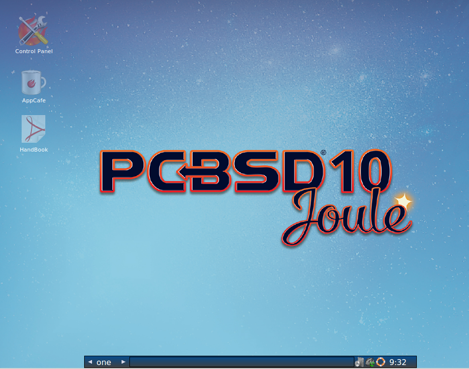

Fluxbox provides many configuration files which can be edited in order to customize the desktop. The `Features <http://www.fluxbox.org/features/>`_ page of
the Fluxbox website lists the available configuration files and links to instructions for getting the most out of Fluxbox.

The following resources are useful when customizing Fluxbox:

* `Creating the Perfect Fluxbox Desktop on Linux <https://www.linux.com/learn/tutorials/467792-creating-the-perfect-fluxbox-desktop-on-linux>`_

* `Fluxconf How-To at Tux Magazine <http://www.tuxmagazine.com/node/1000191>`_

* `Fluxbox wiki <http://fluxbox-wiki.org/>`_

* `FAQ <http://fluxbox-wiki.org/FAQ_en.html>`_

.. index:: FVWM
.. _FVWM:

FVWM
====

`FVWM <http://fvwm.org/>`_ is a powerful and highly configurable desktop window manager for the X Window system. It supports any number of virtual desktops,
each divided into multiple pages. It also supports side title bars, including vertical text.

When you install FVWM on PC-BSD®, it also installs `FVWM-Crystal <http://gna.org/projects/fvwm-crystal/>`_. Both window managers will be added to the login
menu.

Figure 6.4a shows the default PC-BSD® desktop if you select FVWM from the login menu. The application menu was opened by clicking the mouse anywhere on the
desktop.

**Figure 6.4a: FVWM Running on PC-BSD®** 

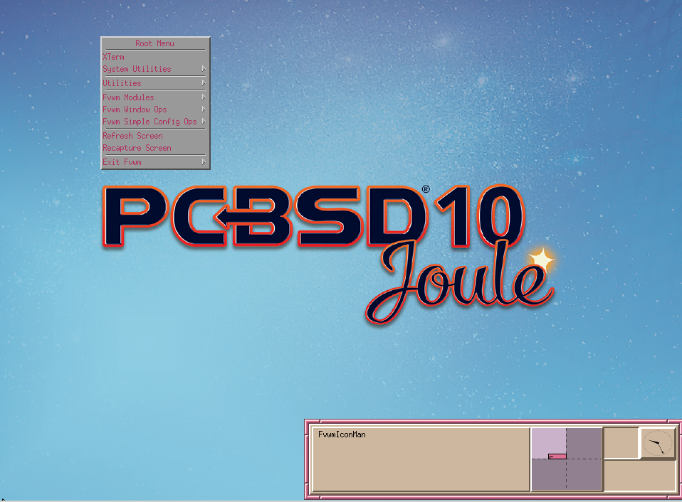

Figure 6.4b shows the default PC-BSD® desktop if you select FVWM-Crystal from the login menu. To open an xterm in FVWM-Crystal, right-click any area of the
desktop.

**Figure 6.4b: FVWM-Crystal Running on PC-BSD®**

.. image:: images/fvwm2.png

The `FVWM Documentation <http://fvwm.org/doc/unstable/index.html>`_ provides information about configuring FVWM.

.. index:: GNOME
.. _GNOME:

GNOME
=====

When you install GNOME on PC-BSD®, it installs both GNOME2 and GNOME3. GNOME2 will appear in the login menu as "GNOME Classic" and GNOME3 will be listed in
the login menu as "GNOME". 

.. note:: GNOME3 requires 3D acceleration. If your video driver does not support this, you should use GNOME2 instead.

`GNOME3 <http://www.gnome.org/>`_ is a popular desktop environment that provides many built-in utilities. Figure 6.5a shows a screenshot of GNOME3 on a
PC-BSD® 10.1.1 system. To access the icons shown in this screen, click "Activities" then the 9-dot icon at the bottom of the left-hand panel. Alternately, if
you know the name of an application to open, click "Activities" and type the application's name into the search bar.

**Figure 6.5a: GNOME3 Desktop on a PC-BSD® System**

.. image:: images/gnome1.png

Figure 6.5b shows a screenshot of GNOME2 on a PC-BSD® 10.1.1 system with the "Applications" menu open.

**Figure 6.5b: GNOME2 Desktop on a PC-BSD® System**

.. image:: images/gnome2.png

If you are new to GNOME, take some time to discover which applications best suit your needs. Some of the applications which are provided by GNOME include: 

* `Image Viewer <http://projects.gnome.org/eog/>`_: Eye of GNOME image viewer.
  

* `Web <https://wiki.gnome.org/Apps/Web>`_: web browser.
  

* `Brasero <http://projects.gnome.org/brasero/>`_: CD/DVD burning software.
  

* `Videos <https://wiki.gnome.org/Apps/Videos>`_: movie player.
  

* `Evolution <http://projects.gnome.org/evolution/>`_: email client with address book and calendar.
  

* `Files <:http://live.gnome.org/Nautilus>`_ Nautilus file manager.

.. note:: some games, such as Lights Off, Quadrapassel, and Swell Foop, require 3D acceleration. If your video driver does not support this, you will not be
   able to launch those games.

You can find additional themes and wallpapers at `gnome-look.org <http://gnome-look.org/>`_.

.. index:: i3
.. _i3:

i3
==

`i3 <http://gnome-look.org/>`_ is a lightweight, tiling window manager. Keyboard shortcuts are provided to open xterms in order to start applications from the
command line.

i3 provides a panel and on PC-BSD® that panel will contain icons for :ref:`Update Manager`, Wireless Configuration Manager (if your wireless card is
detected), and :ref:`Life Preserver`.

Figure 6.6a shows a screenshot of i3 running on PC-BSD® 10.1.1. 

**Figure 6.6a: i3 Window Manager on PC-BSD®** 

.. image:: images/i3.png

To open an xterm, use :kbd:`Alt` :kbd:`Enter`. Windows do not provide minimize, maximize, or close buttons, so type :command:`exit` when you are finished
using an xterm. To leave the window manager and return to the login screen, type :command:`killall i3` from within an xterm.

The `i3 Users Guide <http://i3wm.org/docs/userguide.html>`_ contains the default key bindings and instructions for customizing i3.

.. index:: IceWM
.. _IceWM:

IceWM
=====

`IceWM <http://www.icewm.org/>`_ is a light-weight window manager. Figure 6.7a shows a screenshot of IceWM running on PC-BSD®. In this example, the user has
launched the "Application" menu by clicking on the "IceWM" button in the lower left corner. This menu can also be launched by right-clicking anywhere on the
desktop.

**Figure 6.7a: IceWM on PC-BSD®**

.. image:: images/icewm.png

If you are new to IceWM, see the `IceWM FAQ and Howto <http://www.sosst.sk/doc/icewm/FAQ/>`_ for more information about configuration, customization, and
keyboard shortcuts.

.. index:: KDE
.. _KDE4:

KDE4
====

The  desktop environment provides many features and applications.
However, it is hardware intensive and may run slowly on a computer with an older processor or a small amount of RAM.
Figure 6.8a shows a screenshot of KDE4 running on PC-BSD® 10.1.1 with the “Applications” menu open.

Figure 6.8a: Applications Menu of KDE4

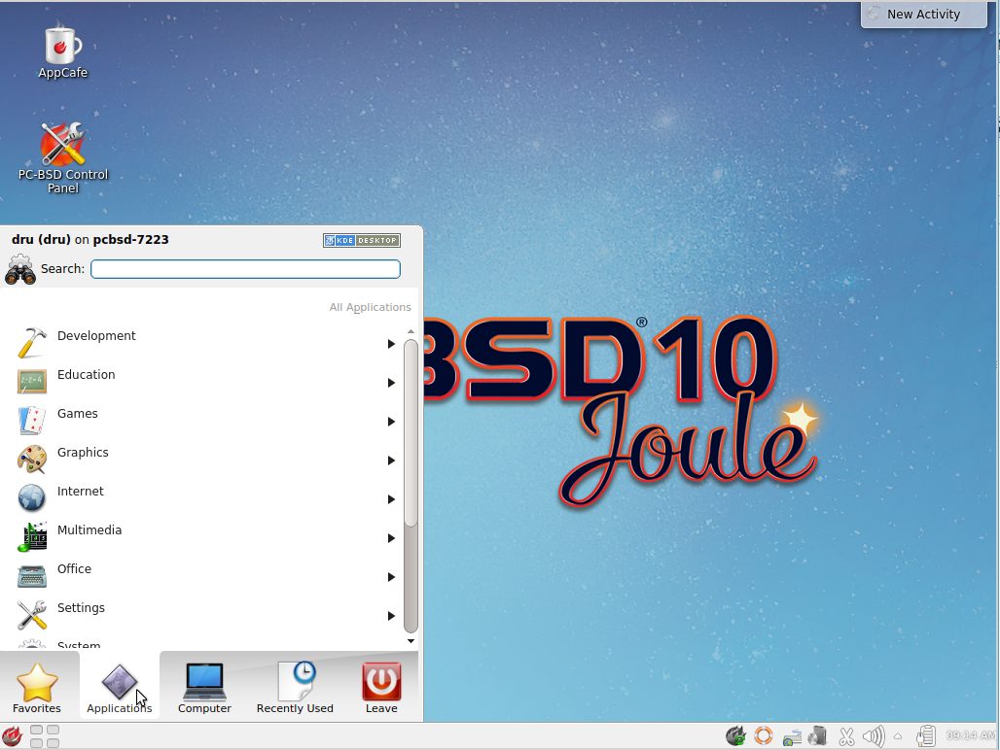

Each category in the “Applications” menu contains many applications and the “Settings” and “System” categories contain many utilities for configuring your system.
If you are new to KDE4, take some time to discover which applications best suit your needs.
Some of the applications which are provided by KDE4 include: 

- : file manager, web browser, and SSH client found in Internet ➜ Web Browser.
  

- : document viewer and annotator found in Office - Document Viewer.
  Supports PDF, OpenOffice, and Postscript files.
  

- : file manager found in System ➜ File Manager.
  Dolphin provides many features for manipulating files such as comments, tags, search, encryption, and archival (zip/unzip) functions.
  

By default, desktop effects are disabled as not all video cards support them.
If your video card supports 3D effects and you would like to enable them in KDE, go to System Settings ➜ Desktop Effects ➜ General and check the box “Enable desktop effects at startup”. 

Some of KDE's games require 3D support.
If your video card does not support 3D, these games will fail to start.

If you have KDE installed and are currently logged into a different window manager, you can still run any KDE application by specifying its name.
For example, type **konqueror** to run the Konqueror web browser or **dolphin** to access the Dolphin File Manager.

 includes descriptions and screenshots of all of KDE's applications as well as links to their handbooks.

 contains additional themes and wallpapers.

.. index:: Lumina
.. _Lumina:

Lumina
======

The Lumina Desktop Environment (Lumina for short) is a lightweight, XDG-compliant, BSD-licensed desktop environment that focuses specifically on streamlining the ability to get work done while minimizing system overhead.
It is specifically designed for PC-BSD® and FreeBSD, but has also been ported to many other BSD and Linux operating systems.
It is based on the Qt graphical toolkit and the Fluxbox window manager, and uses a small number of X utilities for various tasks, such as numlockx and xscreensaver.

Lumina's features include: 

- Very little system overhead.
  

- Intelligent “favorites” system for creating quick shortcuts to applications, files, and directories.
  

- ZFS file restore functionality through the “Insight” file manager.
  

- Desktop system is plugin-based, which is similar to Android or other modern operating systems.
  

- Simple access to operating system-specific functionality such as screen brightness, audio volume, and battery status.
  

Figure 6.9a shows a screenshot of Lumina on a PC-BSD® 10.0.3 system with the “User” button clicked.

Figure 6.9a: Lumina Desktop

.. image:: images/picture_109.png

**.. note::** while the PCDM login manager will automatically display Lumina in the desktop menu on a PC-BSD® system, users of other operating systems can add “Lumina-DE” as the name of the binary in their *.startx*, *.xinitrc*, or similar startup file.

The “User” button provides quick access for user interaction with the system.
The left frame of this menu contains the following 4 tabs: 

- **Favorites: **the yellow star icon allows the user to quickly launch anything that was setup as a “favorite”. Favorites can be applications, files, or directories, and are separated into those three categories.
  Favorites can be removed by clicking the small button on the right side of the entry.
  If the button icon is a red minus sign, removing the favorite does not actually delete the file as just its link is removed.
  If the button icon is a trash can, the file will actually get deleted permanently.
  Note that anything that exists in the users Desktop folder (*~/Desktop*) is automatically treated as a favorite.
  

- **System Applications: **the white and blue gear icon lets the user browse all the applications currently registered on the system.
  By default, applications are listed alphabetically, but the list can be narrowed down by category using the drop-down list at the top of the tab.
  If you are running PC-BSD® or another operating system that has a pre-defined application “store”, you will also have a shortcut at the top of the tab which will open up that application store.
  On a PC-BSD® system, the shortcut is to AppCafe®. Each application has a little “star” button on the right side of the entry.
  This allows you to mark an application as a favorite and have it appear on your personal list of quick shortcuts.
  

- **Home Directory: **the blue folder icon lets the user quickly browse through all the directories in their home and open any of them in the Insight file manager by clicking the “Browse” button.
  You also have the same little “star” on directories that can be clicked to mark that directory as a favorite if you want quick access to it later.
  

- **Desktop Preferences: **the yellow tool icon provides quick shortcuts to system and desktop configuration utilities.
  If you are on PC-BSD®, or a supported operating system, you should have links to the operating system's control panel, the desktop configuration utility (**lumina-config**), **qt-config** (if it is installed), and the screensaver configuration utility.
  

Any open windows or applications will have a button appear in the section of the panel near the “User” button.
If the application provides an icon, the button will appear as that icon and if you mouse over it, the tooltip will show the name of the application.
If you have multiple copies of an application running, it will combine all those entries into a single button and list the number of windows after the icon.
If you click on a button, it will automatically make that window active.
If there are multiple windows, you can select the particular window you want from a drop-down menu.
The color of the button will change depending on the state of the window: grey for a hidden or minimized window, white for a visible but inactive window, yellow for the active window, and orange for a window that needs attention.

The system tray is located in the right portion of the panel.
Any applications that register a tray icon will appear in this area.
Clicking an icon to interact with that application directly.
The current system time shown by the clock is in the default format for the current locale.

.. index:: Lumina
.. _System Dashboard:

System Dashboard
----------------

The “System Dashboard” button is located at the far right of the panel and shown in Figure 6.9b. 

Figure 6.9b: System Dashboard Menu

.. image:: images/picture_13.png

This button provides quick access to hardware-specific information or operations, as supported by your operating system.
The possible menu entries are: 

- A slider for changing the audio volume for the system from 0% to 100%. If the operating system provides a mixer utility, an icon will also appear.
  Click the icon to launch that mixer utility for advanced control of the audio system.
  

- A slider for changing the screen brightness from 0% to 100%. 

- The current status of the battery, if your system has one, and the estimated time remaining if that battery is discharging.
  

- A listing of the number of virtual workspaces that are in use, with buttons to switch between the different workspaces.
  

- The log out button for ending the desktop session.
  When the log out button is clicked, a window of choices will be displayed in the middle of the screen.
  The choices include: Log Out, Restart (if the user has permission), Shutdown (if the user has permission), Cancel (to exit the choice menu), and Lock Screen.
  
.. index:: Lumina
.. _Right-Click Menu:

Right-Click Menu
----------------

If the user right-clicks on the desktop, a menu of quick shortcuts will appear for instant access and the title of the menu will indicate the name of the workspace.
While this menu can be customized, here is a quick summary of the default items on the menu.

- **Terminal:** used to launch a system terminal.
  The default is **xterm**, but this can be customized.
  

- **Browse System:** launches the file manager.
  The default file manager, Insight, recommended, but this can be customized.
  

- **Unlock/Lock Desktop:** used to lock or unlock the desktop plugins.
  When unlocked, desktop plugins become “active” and can be moved, resized, or removed from the desktop.
  It is recommended to leave the desktop locked during normal operations.
  

- **Snap Plugins to Grid:** this option only appears when the desktop is unlocked.
  Used to align and resize all the desktop plugins on an invisible 32x32 pixel grid, with special adjustments to align on the bottom and right screen edges if necessary, in order to provide a uniform appearance.
  

- **Log Out:** opens the system log out window, with options to shutdown/restart the system (if the user has permission), log out of the desktop session, lock the system, or cancel the log out window.
  
.. index:: Lumina
.. _Lumina Configuration Utility:

Lumina Configuration Utility
----------------------------

The Lumina Configuration utility, shown in Figure 6.9c, allows the user to configure every aspect of the desktop and is the recommended way to make changes.
To launch this utility, click the Desktop Preferences icon → Desktop Appearance/Plugins or type **lumina-config** from an xterm.

Figure 6.9c: Lumina Desktop Configuration

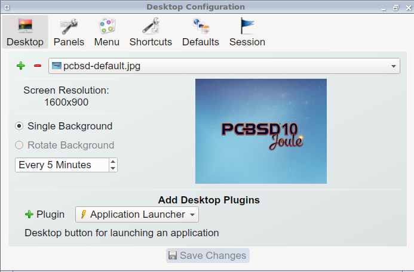

Each of the tabs at the top configures a different area of the system, with the most frequently changed options on the left side.
Once changes have been made, the “Save Changes” button at the bottom of the window will become active.
This allows the user to setup multiple changes in any tabs and apply them all at the same time.

**.. note::** if you make any changes in any of the tabs, click “Save Changes” before exiting this utility in order to save them.

The following tabs are available: 

**Desktop:** this tab is used to change the visual appearance and functionality of the desktop on a per-screen basis.
It can be used to add or remove the image(s) to use for the desktop's wallpaper.
If multiple images are selected, the “Rotate Background” button can be selected as well as a specified time interval in minutes to rotate to the next image.

New plugins can be added using the bottom of this tab.
Select the type of plugin from the drop-down menu then click the “+” button to immediately add it to the desktop.

**Panels:** the “Panels” tab, shown in Figure 6.9d, allows the user to add, remove, and configure the desktop panel.
Panels must be aligned along a screen edge, opposite screen edges in the case of two panels, and may have any width, color, or transparency.
Use the “Location” drop-down menu to set the location of the panel and the “Size” and “Color” options to set the panel width and color.
If you would like the panel to be hidden unless the mouse is hovered over it, check the box “Auto-hide Panel”. 

Figure 6.9d: Lumina Panels Configuration

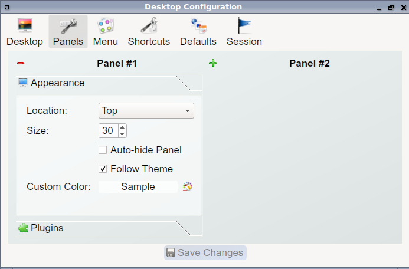

Once a panel's appearance has been configured, plugins can be added by clicking the “+” button and selecting a plugin from the list that appears.
Similarly, clicking the “-” button will remove the selected plugin, and the arrow buttons can be used to move the location of the plugin on the panel.
The top of the list corresponds to either the top of a vertical panel or the left side of a horizontal panel.

**Menu:** the “Menu” tab, shown in Figure 6.9e, allows the user to configure the right-click desktop menu.
Click the “+” or “-” buttons to add or remove a plugin and the arrow buttons to change the selected plugin's order in the right-click menu.

Figure 6.9e: Lumina Menu Configuration

.. image:: images/picture_126.png

**Shortcuts:** the “Shortcuts” tab, shown in Figure 6.9f, allows the user to configure various keyboard shortcuts for system or window tasks.
Most of these options relate to window and workspace management, such as moving windows between workspaces, but there are also options for changing the system audio volume or screen brightness.
Note that a shortcut that is already in use can **not** be assigned to another action.
First, that shortcut needs to be cleared and saved, before that key press will be detectable when creating or changing a shortcut.

Figure 6.9f: Lumina Shortcuts Configuration

.. image:: images/picture_153.png

**Defaults:** the “Defaults” tab, shown in Figure 6.9g, allows the user to configure the default web browser, email client, file manager, and virtual terminal.
It can also be used to set the default application for several categories of file types.
To add an application, select the file type and either click “Set App”, which will open a drop-down menu of common applications, or “Set Binary”, which will open a file browser so that you can browse to the path of the application.

Figure 6.9g: Lumina Defaults Configuration

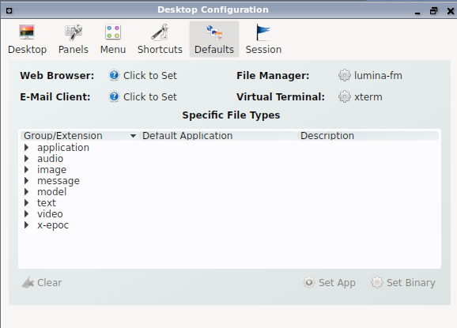

**TIP:** some applications, such as web browsers, keep their own internal lists of default applications for opening particular types of files.
If you set that application to use the **lumina-open** or **xdg-open** utilities, it will use the default applications that are set here instead so that there is only a single list of default applications for the system.

**Session:** the “Session” tab, shown in Figure 6.9h, governs the general settings for the desktop session.
These settings are usually not changed on a frequent basis.

Figure 6.9h: Lumina Session Configuration

.. image:: images/picture_158.png

This section is further subdivided into tabs that are used for various areas of the system: 

- **Theme:** this tab allows the user to change the default font, font size, theme template, color scheme, and icon pack.
  It is possible to create your own theme template or color scheme by clicking the buttons next to those options and changing the settings as necessary.
  Note that the theme templates are written as Qt stylesheets, so some scripting experience may be helpful when configuring a theme.
  

- **General Options:** this tab contains the following options: “Enable numlock on startup”, “Play chimes on startup”, and “Play chimes on exit”. It can also be used to change the user's icon which appears in the login menu and to reset the desktop settings to either system defaults or Lumina defaults.

- **Startup Routine:** this tab is used to configure applications, files, or binaries to automatically run when the desktop session is started.
  This is useful if you always open a particular application or file every time you log in to the system and can streamline the workflow of the user.
  

- **Window System:** this tab allows the user to setup various configuration options for the window manager.
  These options include the number of workspaces, where new windows are placed on the screen, when windows receive focus, and the appearance of the frame around application windows.
  
.. index:: Lumina
.. _Lumina Screenshot:

Lumina Screenshot
-----------------

This utility can be used to take screenshots of the desktop or applications and save them as PNG image files.
To launch this utility, click the icon for “System Applications → Lumina Screenshot or type **lumina-screenshot** from an xterm.

To take a screenshot, click the “Snap” button in the upper-right corner of the screen shown in Figure 6.9i. 

Figure 6.9i: Lumina Screenshot

.. image:: images/picture_239.png

The settings at the bottom of the window can be used to select the “Entire Screen” or to “Select Window”. The delay, in number of seconds, can also be configured in order to give time to setup the screenshot.
If you like the look of the taken screenshot, as shown in the preview, click the “Save” button to open a window where you can specify the name and location of the saved screenshot.

**.. note::** the “Print Screen” keyboard shortcut is set to run this utility by default.

.. index:: Lumina
.. _Insight File Manager:

Insight File Manager
--------------------

The Insight file manager, shown in Figure 6.9j, allows the user to easily browse and modify files on the local system on a per-directory basis.
To open Insight, right-click the desktop and select “Browse System” or type **lumina-fm** from an xterm.

Figure 6.9j: Insight File Manager

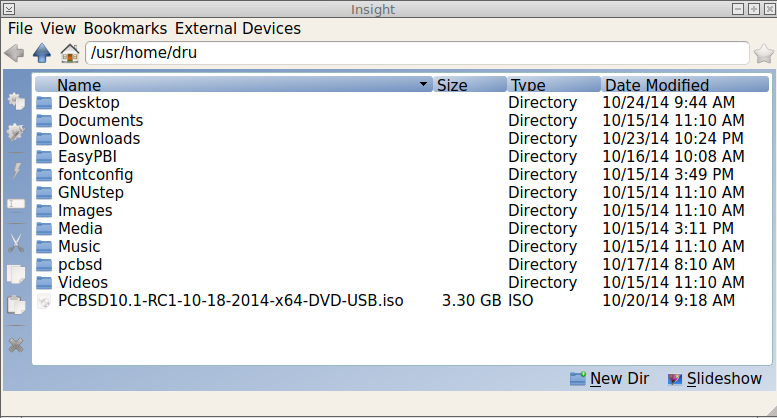

It is possible to open up additional directories through the tab system (use “Ctrl-T” or click File → New Tab), allowing the user to easily manage multiple locations on the system.
Insight also features the ability to “bookmark” locations on the system for instant access via the “star” button.
Once a location has been bookmarked, it will be available via the “Bookmarks” menu at the top of the window.
Any removable devices that are available on the system will show up in the “External Devices” menu, if supported by the operating system.
When an item is selected, the options on the left side of the screen will show the possible actions that may be taken with regards to that item.
Possible actions include: open, open with (will prompt for the application to use), add to favorites, rename, cut, copy, paste, and delete.
By default, the actions buttons are visible.
They can be made invisible by clicking View → Show Action Buttons.

A few additional options may be available at the bottom of the window, depending on the directory being viewed and the types of files that are in it: 

- **New Dir:** the ability to create a new directory will become available if the user has permission to modify the contents of the current directory.
  

- **Slideshow:** if there are image files in the directory, there is an option to view those image files as a slideshow.
  

- **Play:** will appear if there are supported multimedia files in the directory.
  The types of files that are supported depends on what multimedia plugins are installed on the system.
  If a particular file is not recognized as a multimedia file, install the associated multimedia codec using the operating system's application management software and restart the file manager.
  

- **Backups:** if the system is formatted with ZFS and snapshots of the current directory are available, this button will appear.
  Snapshots are organized from oldest to newest, with the most recent snapshot selected by default, and the contents of the directory at the time of that snapshot are displayed.
  To restore a file or multiple files, select them from the list and click the “Restore Selection” button.
  If those files still exist and you want to overwrite them, make sure the “Overwrite Existing Files” option is checked first.
  Otherwise, if a file with that name exists, the restore will append a number to the end of the filename.
  For example, the first restored version of *testfile.txt* will become *testfile-1.txt*.
  
.. index:: Lumina
.. _Lumina Open:

Lumina Open
-----------

To open a file, directory, or URL from the command line, use **lumina-open** followed by the full path to the file or the URL.
This utility will look for an appropriate application to use to open the specified file or URL.
If there is no default application registered for the input type, a small dialog will prompt the user to select which application to use, and optionally set it as the default application for this file type.
As seen in Figure 6.9k, this dialog organizes the available applications into three types: 

- **Preferred:** these applications have registered their Mime type with the system and can open that type of file.
  Also included are any applications that have been used to open this type of file before as it keeps track of the last three applications used for that file type.
  

- **Available:** displays all the applications installed on the system, organized by category and name.
  

- **Custom:** lets the user manually type in the binary name or path of the application to use.
  It also provides a small button to let the user graphically search the system for the binary.
  Whenever text is entered, a check is performed to determine whether that is a valid binary and the icon will change between a green checkmark or a red X as appropriate.
  

Figure 6.9j: Lumina Open

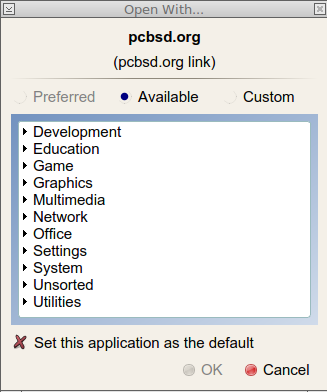

.. index:: LXDE
.. _LXDE:

LXDE
====

 is the Lightweight X11 Desktop Environment.
It is an excellent choice for older hardware or for users who want a complete desktop environment without all of the overhead required by KDE or GNOME.
Since it is XDG-compliant, the PC-BSD® Control Panel, AppCafe®, and Life Preserver are available on the desktop and integrated into LXDE's menus.

Figure 6.10a shows a screenshot of the default LXDE installation with the LXPanel open.

**Figure 6.****10****a: LXDE Desktop on a PC-BSD® System** 

.. image:: images/picture_118.png

In addition to the PC-BSD® utilities, LXDE provides the following utilities: 

- : desktop panel which is launched by clicking on the PC-BSD® icon in the lower right corner of the desktop.
  To configure the panel, right-click the PC-BSD® icon and select “Panel Settings” or “Add/Remove Panel Items” from the right-click menu.
  

- : found in System Tools ➜ File Manager PCManFM.
  A file manager with features like drag and drop, tabbed browsing, built-in file search, file association with default application, thumbnails for images, bookmarks, and support for non-UTF-8 encoded filenames.
  

- : fast image viewer found in Accessories ➜ Image Viewer.
  

- : a light-weight graphical text editor found in Accessories ➜ Leafpad.
  

- : terminal emulator found in Accessories ➜ LXTerminal 

- : archiver utility that supports the 7z, ARJ, bzip2, gzip, lzma, RAR, RPM, DEB, tar, and ZIP file formats.
  Found in Accessories ➜ Xarchiver.
  

- **epdfview**: a PDF viewer with printing support found in Office ➜ Document Viewer.
  

- : task manager and system monitor found in System Tools ➜ Task Manager.
  

- : a theme switcher for customizing the widgets, colors, icons, mouse cursors, and sound effects used by applications.
  Found in Preferences ➜ Customize Look and Feel.
  

- **LXInput:** a tool to configure your keyboard and mouse found in Preferences ➜ Keyboard and Mouse.
  

- : the window manager used by LXDE.
  You can configure settings such as themes, appearance, mouse, and margins by going to Preferences ➜ Openbox Configuration Manager.
  

This  describes how to configure an application to autostart when you login to LXDE.

.. index:: Mate
.. _Mate:

Mate
====

 is a fork of the popular, but now unmaintained, GNOME2 desktop environment.
MATE is under active development to add support for new technologies while preserving the traditional GNOME desktop experience and its many built-in utilities.
Figure 6.11a shows a screenshot of MATE on a PC-BSD® 10.1.1 system with the “Applications” menu open.

Each category in the “Applications” menu contains many applications and the System → Preferences category contains many utilities for configuring your system.
If you are new to MATE, take some time to discover which applications best suit your needs.
Some of the applications which are provided by MATE include: 

- **Engrampa:** archive manager found in Accessories → Engrampa Archive Manager.
  

- **Pluma:** text editor found in Accessories → pluma Text Editor.

- **Atril:** PDF document viewer found in Office → Atril Document Viewer.
  

- **Caja:** file manager found in System Tools → Caja.
  It is a fork of Nautilus.
  

You can find additional themes and wallpapers at . 

Figure 6.11a: MATE Desktop on a PC-BSD® System

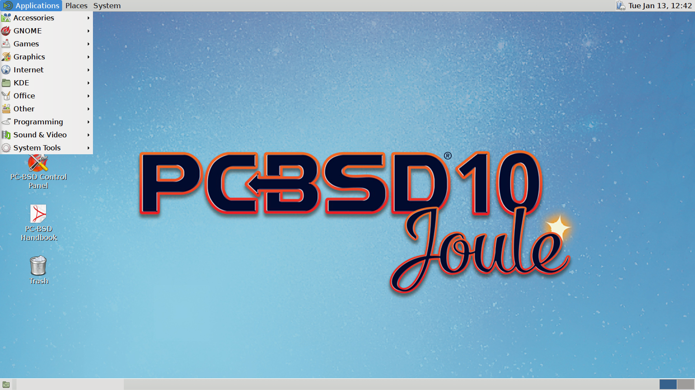

.. index:: Openbox
.. _Openbox:

Openbox
=======

 is a highly configurable, minimalist window manager.
It is the window manager used by LXDE but can also be run separately from LXDE.

Figure 6.12a provides a screenshot of Openbox running on a PC-BSD® system.
The application menu was launched by right-clicking on an area of the desktop.

The application menu contains an entry for the Openbox Configuration Manager which can be used to customize settings such as themes, appearance, mouse, and margins.
A screenshot of this configuration utility is shown in Figure 6.12b. 

A list of websites containing additional themes is available from the .

Figure 6.12a: Openbox on a PC-BSD® System

.. image:: images/picture_78.png

Figure 6.12b: Openbox Configuration Manager

.. image:: images/picture_54.png

.. index:: Ratpoison
.. _Ratpoison:

Ratpoison
=========

 is a simple window manager with no fat library dependencies, no fancy graphics, or window decorations.

Figure 6.13a provides a screenshot of Ratpoison running on a PC-BSD® system: 

Ratpoison uses keyboard shortcuts.
To view the shortcuts, press Ctrl-t then ?. To leave this help screen, press enter.

To open an xterm, press Ctrl-t then c. Type **exit** to close the xterm.
Type **killall ratpoison** with an xterm to leave Ratpoison and return to the login screen.

The  contains an FAQ and tips for setting keyboard shortcuts.

**Figure 6.13a: Ratpoison on a PC-BSD® System** 

.. image:: images/picture_223.png

.. index:: spectrwm
.. _spectrwm:

spectrwm
========

, formerly known as scrotwm, is a minimalist window manager written by OpenBSD hackers.
It provides keyboard shortcuts, a configuration file, and assumes that the user prefers to use the command line.
If you have not used spectrwm before, spend some time reading through its  first.

To launch applications within spectrwm, start an xterm by pressing Alt+Shift+Return.
Once you have an xterm, you can start any program you wish.
For example, to start Control Panel type **pc-controlpanel**.
spectrwm does not provide minimize, maximize, or close buttons within its windows.
To close a GUI application, use CTRL-c within the xterm you used to launch the application.
To leave this desktop, type **killall spectrwm** from an xterm.

.. index:: Windowlab
.. _Windowlab:

WindowLab
=========

 is a small and simple window manager.
It uses a window resizing mechanism that allows one or many edges of a window to be changed in one action, and an innovative menubar that shares the same part of the screen as the taskbar.
It follows a click-to-focus but not raise-on-focus policy.
This means that when a window is clicked it gets focus, but it is not redrawn to obscure other windows.
This allows one, for example, to switch to a terminal to enter commands while keeping documentation visible in a web browser.

Use the right mouse button to display the top menu panel.
Use the left mouse button or hover over a taskbar entry to open that application.

To add the applications you use most often to the menubar, select “Edit menu” while holding the right mouse button.

To leave the WindowLab session, select “Quit” from the menubar.

.. index:: Window Maker
.. _Window Maker:

Window Maker
============

 is a light-weight window manager that was designed to reproduce the elegant look and feel of the  user interface.

Figure 6.16a shows a screenshot of Window Maker running on PC-BSD®. In this example, the user launched the Application menu by right-clicking an area of the desktop.

In addition to the PC-BSD® utilities, Window Maker provides the following applications: 

- **WPrefs**: located in Appearance ➜ Preferences Utility.
  Allows you to configure window focus, window placement, menu alignment, icons, keyboard actions, mouse, fonts, and various other window manager settings.

- : found in Utils ➜ wmakerconf.
  Allows you to fine-tune your menu entries as well as your desktop's appearance, themes, background, mouse, and special effects.
  Figure 6.16b shows wmakerconf with the “Menu” button selected.
  

Figure 6.16a: Window Maker on PC-BSD®

.. image:: images/picture_7.png

**Figure 6.16b: Editing the Application Menu Using wmakerconf** 

.. image:: images/picture_259.png

.. index:: Window Maker
.. _Working with the Dock:

Working with the Dock 
----------------------

Window Maker uses a dock to store application shortcuts.
The dock appears as a series of icons in the upper right corner of the desktop.
Docked applications always show on the desktop, even after you close an application or close and restart your Window Maker session.

Whenever you start an application, an icon will appear in the lower left corner of the screen.
You can move that icon elsewhere on the desktop with your mouse.
If you right-click the icon, you have the option to hide/unhide the icon, set icon (change its picture), or kill the application.
If you drag the icon onto the dock, it will remain on the desktop.

Once an icon is docked, a settings menu is added to the icon's right-click menu.
Figure 6.16c demonstrates how to configure an icon for AppCafe®. 

You will find the icons for AppCafe® and Control Panel in */usr/local/share/pcbsd/pc-controlpanel/icons*.
Choose the 64x64 versions as this is the size that Window Maker users.
The application name for AppCafe® is appcafe and for Control Panel it is **pc-controlpanel**.

Figure 6.16c: Configuring an Icon

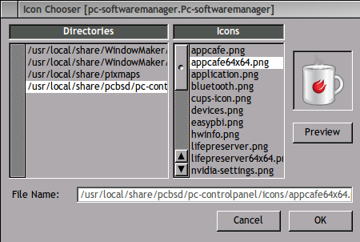

.. index:: Window Maker
.. _DeockApps:

DockApps 
---------

Window Maker supports dockapps which are applications that were designed to work with Window Maker but which are separate from the Window Maker project.
Dockapps tend to be small and designed to perform a particular function.
For example, there are clocks, weather applications, and CPU monitors.
Most dockapps have been ported to FreeBSD and the port always begins with “wm”. You can search for these at  by entering a “Short Description” containing “dockapp”. 

If your favorite dockapp has not been ported to FreeBSD, you can request that a port be created on the Ports Requests forum using these . 

.. index:: XFCE
.. _XFCE4:

XFCE4
=====

 is a lightweight desktop environment that aims to be low on system resources and fast, while still being visually appealing and user friendly.
More information about XFCE, including usage tips, can be found at the .

The first time you start XFCE4, you will see the message shown in Figure 6.17a.

**Figure 6.****17****a: Panel Welcome Message** 

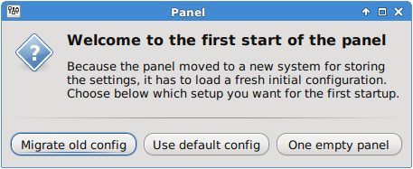

In XFCE, a  is a bar which can hold many items such as application launchers, window lists, a clock, a notification area, and application menus.
Your initial panel setup options are: 

- **Migrate old config:** select this option if you wish to have a single panel with an application launcher and other icons as shown in Figure 6.17b. The application launcher menu may be accessed by the fireball icon in the lower left, or by right-clicking the desktop.
  

- **Use default config:** this option will install a small, minimal panel centered on the bottom.
  The application launcher menu may be accessed by the fireball icon in the lower left, or by a right-click on the desktop.
  

- **One empty panel:** this option will install a panel with no icons.
  The application menu is available by right-clicking the desktop as shown in Figures 6.17b. 

If you wish to change your configuration choice at a later time, reset the panel using Applications ➜ Settings ➜ Settings Editor, shown in Figure 6.17d. Right-click the entry for “xfce4-panel” and click “Reset Channel”. 

**Figure 6.****17****b: XFCE with Complete Panel Migrated From Old Config** 

.. image:: images/picture_245.png

**Figure 6.****17****c: XFCE with Minimal Panel Using Default Config** 

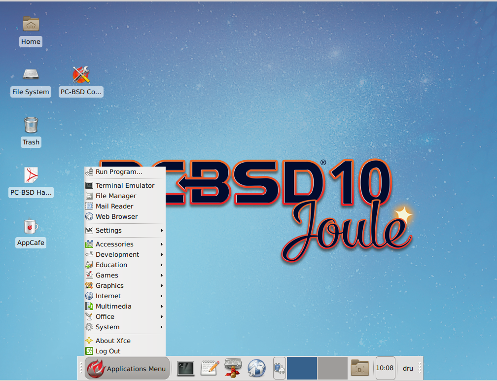

**Figure 6.****17****d: Using Settings Editor to Reset Panel** 

.. image:: images/picture_111.png

In addition to the PC-BSD® utilities, XFCE provides the following utilities: 

- : desktop manager found in Settings ➜ Desktop.
  Sets the background image, provides a right-click menu to launch applications, and can show files (including application launchers) or iconified windows.
  

- : window manager found in Settings ➜ Window Manager.
  It provides window decorations, virtual desktops, multiscreen mode, transparency and a keyboard shortcuts editor.
  

- : fast and light-weight picture viewer found in Graphics ➜ Ristretto Image Viewer.
  

- : light-weight graphical browser found in Internet ➜ Midori.
  

- : CD/DVD burning tool found in Multimedia ➜ Xfburn.
  

- : calendar and reminder daemon found in Office ➜ Orage Calendar.
  

- : file manager found in System ➜ Thunar File Manager.
  

A list of recommended applications for XFCE can be found on the . 

.. index:: XFCE
.. _XFCE Plugins:

XFCE Plugins 
-------------

XFCE supports many plugins which provide additional applications that are separate from the official XFCE distribution.
You can browse for plugins and read descriptions for each at the XFCE . If you find a plugin that is not available within AppCafe®, this  explains how to determine if a FreeBSD port is available, how to request a PBI if a port is available, and how to request a port if one does not already exist.

After installing a plugin, go to Settings ➜ Panel ➜ Items and click the + button in the right column to see the “Add New Items” screen shown in Figure 6.17e. 

**Figure 6.****17****e****: Adding a Plugin to the Panel** 

.. image:: images/picture_208.png

Select your new plugin from the list, and click the “+Add” button.
It will immediately be added as an icon in the panel.