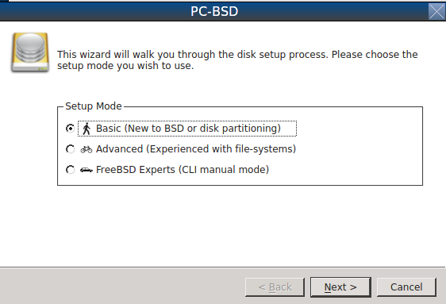
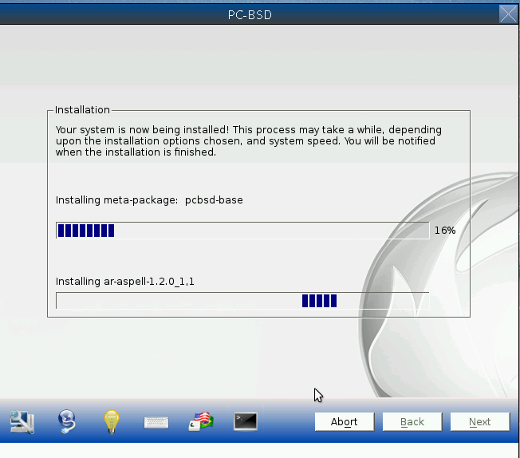
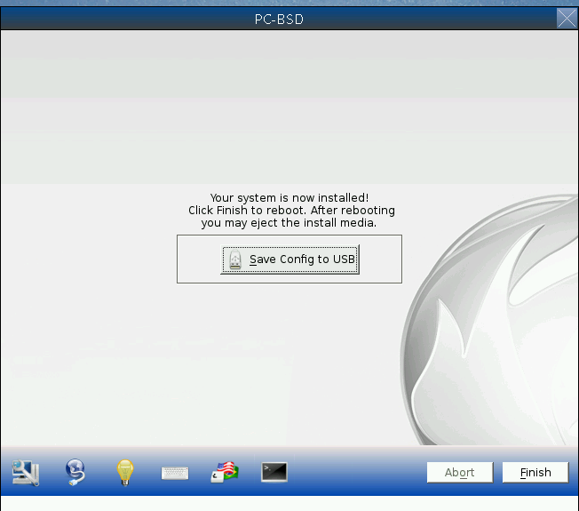

.. index:: installation
.. _Installing PC-BSD®:

Installing PC-BSD®
*******************

This chapter describes how to install a graphical desktop using the graphical installer. If you have downloaded the CD version of TrueOS® or prefer to use a
text based installer, refer to :ref:`Using the Text Installer`.

PC-BSD® can be installed from the installation media directly onto a hard drive or into a virtual machine using virtualization software such as
`VirtualBox <http://www.virtualbox.org/>`_.

To begin the PC-BSD® installation, insert the boot media and boot the system. If the computer boots into an existing operating system instead of the
installer, reboot and check your computer's BIOS program to ensure that the drive containing the installation media is listed first in the boot order. Save
your BIOS changes and reboot.

The initial boot screen, shown in Figure 3a, offers a choice of using either the graphical or the text based installer. Unless you select otherwise, the
graphical installer will load. To instead use the text based installer, use the arrow keys to select that option. If the graphical installer hangs when
loading the graphics driver, try selecting the VESA mode option of the graphical installer.

**Figure 3a: PC-BSD® Installer Boot Menu**

.. image:: images/install1.png

This chapter describes the following screens of the graphical installer: 

* :ref:`Language Selection Screen`

* :ref:`System Selection Screen`

* :ref:`Disk Selection Screen`

* :ref:`Installation Progress Screen`

* :ref:`Installation Finished Screen`

.. index:: installation
.. _Language Selection Screen:

Language Selection Screen
=========================

The first graphical installer screen, seen in Figure 3.1a, indicates that the installer successfully loaded and is ready to present you with its options.

**Figure 3.1a: Welcome and Language Selection Screen** 

.. image:: images/install2.png

Starting on the left-hand side, the icons in the bottom navigation area allow you to: 

* access :ref:`Hardware Compatibility` information 

* manage :ref:`Network Configuration` for a system restore

* read that screen's Help text 

* use the onscreen keyboard 

* switch between the US keyboard layout and a user selected layout

* access the emergency shell described in :ref:`Using the System Utilities Menu`

* abort the installation

* navigate to a previous or upcoming screen 

Hover over an icon to view its description in the tip bar at the bottom of the screen.

.. note:: the default keyboard layout can be changed now, during the post-installation :ref:`Language Screen`, or when :ref:`Logging In`.

A button is also provided to "Load config from USB". If you have saved the configuration from a previous installation, it can be loaded at this time from a
FAT-formatted USB stick.

This initial screen allows you to select your language. The menus in PC-BSD® have been translated to several different languages and you can see the status
of your native language at the `PC-BSD® Translation Site <http://translate.pcbsd.org/>`_. If your language does not show 100% translation at this website, it
means that not all of the menus have been translated yet and that the untranslated menus will instead display in English. You are welcome to join the
`PC-BSD® translators mailing list <http://lists.pcbsd.org/mailman/listinfo/translations>`_ if you would like to assist in translating menus to your native
language.

By default, PC-BSD® menus will display in English, unless you select another language in the drop-down menu in this screen.

.. note:: small screens may not display the entire installer window, which means that the buttons at the bottom of the window are hidden and inaccessible.
   There are two solutions for this situation: press :kbd:`Alt` while dragging the window with the mouse, or press :kbd:`Alt+N` to select the next button of
   the window. 

When you are finished, click the "Next" button to go to the next installation screen.

.. index:: installation
.. _System Selection Screen:

System Selection Screen
=======================

The "System Selection" screen, shown in Figure 3.2a, allows you to install a desktop (PC-BSD®) or a server (TrueOS®) operating system. It also can be used
for :ref:`Restoring the Operating System From a Life Preserver Backup`. The rest of this chapter concentrates on a desktop installation. Refer to
:ref:`Install a Server` for instructions on how to install a command-line only server.

**Figure 3.2a: System Selection Screen** 

.. image:: images/install3.png

By default, PC-BSD® will be selected and the default window manager will depend upon the amount of RAM on the system. Systems containing more than 2GB of RAM
will default to the KDE desktop and all other systems will default to the LXDE desktop. To change the default window manager or to browse for additional
desktops and components to install, click the "Customize" button to open the screen shown in Figure 3.2b. 

**Figure 3.2b: Browsing Additional System Components** 

.. image:: images/install4.png

Check the ► next to a component in order to expand it so that you can check or uncheck its sub-components. All components that are checked will be
installed. If you highlight then right-click a component and select "View Packages", a pop-up menu will list the name of the package that is installed with
that component.

The following components are available for installation.

* **Desktops:** the following desktops are available:
  :ref:`Awesome`, :ref:`Cinnamon`, :ref:`FVWM`, :ref:`GNOME`, :ref:`i3`, :ref:`IceWM`, :ref:`KDE4`,
  :ref:`Lumina`, :ref:`LXDE`, :ref:`MATE`, :ref:`Openbox`, :ref:`Ratpoison`, :ref:`spectrwm`, :ref:`WindowLab`, :ref:`Window Maker`, and
  :ref:`XFCE4`. Each desktop that is selected will be installed and will appear in the login menu of the installed PC-BSD® system.

.. note:: :ref:`Fluxbox` is always installed and available in the login menu of a PC-BSD® system.

* **Devel:** check the + to install `QGit <http://sourceforge.net/projects/qgit/>`_.

* **Drivers:** if you have an NVIDIA video card, the correct driver should already be checked for you.

* **Editors:** check the + to install `LibreOffice <http://www.libreoffice.org/>`_. 

* **Emulators:** if you expand the ► you can select to install `VirtualBox <http://www.virtualbox.org/>`_ and `Wine <https://www.winehq.org/>`_. 

* **i18n:** if you expand the ► you can select to install localization for for the KDE desktop and for the operating system.

* **IRC:** check the + to install `HexChat <http://hexchat.github.io/>`_. 

* **Java:** if you expand the ► you can select to install `IcedTea <http://icedtea.classpath.org/wiki/IcedTea-Web>`_ and
  `OpenJDK <http://openjdk.java.net/>`_ versions 7 and 8. 

* **Mail:** check this box to install the `Thunderbird <https://www.mozilla.org/en-US/thunderbird/>`_ email client.

* **MediaCenter:** if you expand the ► you can select to install `KODI <http://kodi.tv/>`_ and `PlexHome Theater <https://plex.tv/>`_.

* **Net:** check this box to install the `KRDC <http://kde.org/applications/internet/krdc/>`_ remote desktop client.

* **Net-IM:** check this box to install the `Pidgin <http://www.pidgin.im/>`_ IRC client.

* **Roles:** if you expand the ► you can select to install the following installation roles. Click the hyperlink for each role to see the software installed
  with it: 
  `Development <https://github.com/pcbsd/pcbsd/blob/master/build-files/ports-overlay/misc/pcbsd-role-devel/Makefile>`_,
  `FreeNAS-Builder <https://github.com/pcbsd/pcbsd/blob/master/build-files/ports-overlay/misc/pcbsd-role-freenasbuild/Makefile>`_,
  `Internet <https://github.com/pcbsd/pcbsd/blob/master/build-files/ports-overlay/misc/pcbsd-role-internet/Makefile>`_, and
  `Media <https://github.com/pcbsd/pcbsd/blob/master/build-files/ports-overlay/misc/pcbsd-role-media/Makefile>`_.

* **Security:** check this box to install the `OpenVPN <http://openvpn.net/index.php/open-source.html>`_ VPN client.

* **SysUtils:** check this box to install the `PySalt <http://www.saltstack.com/community/>`_ distributed remote execution and configuration management
  system.

* **Virtualization:** if you expand the ► you can install `VirtualBox Guest Additions <https://www.virtualbox.org/>`_
  and `VMwareGuest <http://open-vm-tools.sourceforge.net/about.php>`_. 

* **Web:** if you expand the ► you can select to install the `Chromium <http://www.chromium.org/>`_ and `Firefox <http://www.mozilla.org/en-US/firefox/new>`_
  web browsers.

Once you have made your selection(s), click the "Save" button to save your selections. The "PC-BSD Package Selection" box will list the components that you
selected for installation. You can now click the "Next" button to proceed to the next screen.

.. note:: if you are installing a desktop, the installer will display a pop-up message if it cannot find a physical or virtual disk that does not meet the
   recommended minimum size of 50GB. It will let you continue an installation on a smaller disk, but you may run into disk space issues on smaller disks.

.. index:: installation
.. _Disk Selection Screen:

Disk Selection Screen
=====================

The "Disk Selection" screen, seen in Figure 3.3a, summarizes the default disk configuration.

**Figure 3.3a: Disk Selection Screen**

.. image:: images/install5.png

By default, PC-BSD® will assume that you wish to install on the entire first disk.

.. warning:: If you are installing PC-BSD® as the only operating system on your computer, simply click "Next" to start the installation. However, if this is
   not your intent, review the rest of this section to determine how to layout your disk. If you plan on booting PC-BSD® with another operating system, you
   should also review the section on :ref:`Dual Booting`.

If you wish to select which disk or partition to install PC-BSD® into, click the "Customize" button to start the Disk Setup Wizard, shown in Figure 3.3b. 

**Figure 3.3b: Disk Setup Wizard** 

The wizard provides three modes of operation. The rest of this section describes these modes in detail.

* **Basic:** (default) select this mode if you wish to specify which partition or disk to install to.

* **Advanced:** select this mode if you wish to specify the installation partition or disk, use GPT partitioning, force the block size, change the boot
  manager, change the default ZFS pool name, specify the filesystem layout, add a log or cache device, or encrypt the disk.

* **FreeBSD Expert:** select this mode if you prefer to drop down to a shell to manually enter the commands to setup your disk.

.. warning:: regardless of the mode that you select, once the disk wizard completes and you click "Next" at the disk "Summary" screen, a pop-up window will
   ask if you would like to start the installation. Be sure to review the disk summary before clicking "Yes" and starting the installation. the disk "Summary"
   screen is your **very last chance** to make sure that you are ready. Once you click "Yes", the selected hard drive or partition will be formatted and any
   data it contains will be lost.

Once you have finished configuring your disks, you can save the finished configuration to re-use it at a later time. Insert a FAT-formatted USB stick and
click "Save Config to USB".

.. index:: installation
.. _Basic Mode:

Basic Mode 
-----------

If you select "Basic" mode, the wizard will display the screen shown in Figure 3.3c. 

**Figure 3.3c: Select a Disk or Partition**

.. image:: images/install7.png

By default, the first hard disk will be selected. If you wish to install on a different disk, use the "Selected Disk" drop-down menu to select the disk to
install into.

By default, the entire selected disk will be formatted. If the disk has been divided into partitions and you wish to install into a specific partition, use
the "Selected Partition" drop-down menu to select the desired primary partition.

.. note:: PC-BSD® will only install into a primary or GPT partition. That is, you can not install PC-BSD® into a secondary or an extended partition. If you
   wish to create a new primary partition to install into, see :ref:`Partitioning the Hard Drive` for instructions on how to do this.

Once you have selected the disk and partition, click "Next" to return to the disk "Summary" screen so that you can review your selections. If you wish to
change anything, use the "Back" button to return to a previous screen. Otherwise, click "Finish" to leave the wizard. Click "Next" then "Yes" to start the
installation.

.. index:: installation
.. _Advanced Mode:

Advanced Mode 
--------------

If you select advanced mode, the wizard will display the screen shown in Figure 3.3d. 

**Figure 3.3d: Advanced Mode Options** 

.. image:: images/install8.png

This screen provides the following options: 

* **Partition Scheme:**  the default of "GPT (Best for new hardware)" is a partition table layout that supports larger partition sizes than the traditional "MBR (Legacy)" layout.
  **If your installation disk/partition is larger than 2 TB, this option must be selectedd**. Some older motherboards do
  not support this option. If the installation fails, try again with "MBR (Legacy)" selected. When in doubt, try the default selection first.

* **Target Installation:** when installing to non-UEFI systems, keep the default selection of "BIOS (Legacy motherboards)". If the hardware supports UEFI, change the
  selection to "UEFI (Modern motherboards)".

* **Force ZFS 4k block size:** this option should only be checked if you know for sure that the disk supports 4k, even though it lies and reports its size as
  512b. Use with caution as it may cause the installation to fail.

* **ZFS pool name:** if you wish to use a pool name other than the default of *tank*, check this box and input the name of the pool.

After making your selections click "Next" to access the ZFS configuration screens. The rest of this section provides a ZFS overview and demonstrates how to
customize the ZFS layout. Note that *root* is a reserved term and can not be used as a pool name.

.. index:: ZFS
.. _ZFS Overview:

ZFS Overview 
^^^^^^^^^^^^^

ZFS is an enterprise grade file-system, which provides many features including: support for high storage capacities, high reliability, the ability to quickly
take snapshots, boot environments, continuous integrity checking and automatic repair, RAIDZ which was designed to overcome the limitations of hardware RAID,
and native NFSv4 ACLs.

If you are new to ZFS, the `Wikipedia entry on ZFS <http://en.wikipedia.org/wiki/ZFS>`_ provides an excellent starting point to learn about its features.
These resources are also useful to bookmark and refer to as needed: 

* `ZFS Evil Tuning Guide <http://www.solarisinternals.com/wiki/index.php/ZFS_Evil_Tuning_Guide>`_

* `FreeBSD ZFS Tuning Guide <http://wiki.freebsd.org/ZFSTuningGuide>`_

* `ZFS Best Practices Guide <http://www.solarisinternals.com/wiki/index.php/ZFS_Best_Practices_Guide>`_

* `ZFS Administration Guide <http://download.oracle.com/docs/cd/E19253-01/819-5461/index.html>`_

* `Becoming a ZFS Ninja (video) <http://blogs.oracle.com/video/entry/becoming_a_zfs_ninja>`_

* `blog post explaining how ZFS simplifies the storage stack <https://blogs.oracle.com/bonwick/entry/rampant_layering_violation>`_

The following is a glossary of terms used by ZFS: 

**Pool:** a collection of devices that provides physical storage and data replication managed by ZFS. This pooled storage model eliminates the concept of
volumes and the associated problems of partitions, provisioning, wasted bandwidth and stranded storage. Thousands of filesystems can draw from a common
storage pool, each one consuming only as much space as it actually needs. The combined I/O bandwidth of all devices in the pool is available to all
filesystems at all times. The
`Storage Pools Recommendations <http://www.solarisinternals.com/wiki/index.php/ZFS_Best_Practices_Guide#ZFS_Storage_Pools_Recommendations>`_ of the ZFS Best
Practices Guide provides detailed recommendations for creating the storage pool.

**Mirror:** a form of RAID where all data is mirrored onto two or more disks, creating a redundant copy should a disk fail.

**RAIDZ:** ZFS software solution that is equivalent to RAID5 in that it allows one disk to fail without losing data. Requires a minimum of 3 disks.

**RAIDZ2:** double-parity ZFS software solution that is similar to RAID6 in that it allows two disks to fail without losing data. Requires a minimum of 4
disks.

**RAIDZ3:** triple-parity ZFS software solution. RAIDZ3 offers three parity drives and can operate in degraded mode if up to three drives fail with no
restrictions on which drives can fail.

**Dataset:** once a pool is created, it can be divided into datasets. A dataset is similar to a folder in that it supports permissions. A dataset is also
similar to a filesystem in that you can set properties such as quotas and compression.

**Snapshot:** a read-only point-in-time copy of a filesystem. Snapshots can be created quickly and, if little data changes, new snapshots take up very little
space. For example, a snapshot where no files have changed takes 0MB of storage, but if you change a 10GB file it will keep a copy of both the old and the new
10GB version. Snapshots provide a clever way of keeping a history of files, should you need to recover an older copy or even a deleted file. For this reason,
many administrators take snapshots often (e.g. every 15 minutes), store them for a period of time (e.g. for a month), and store them on another system. Such a
strategy allows the administrator to roll the system back to a specific time or, if there is a catastrophic loss, an off-site snapshot can restore the system
up to the last snapshot interval (e.g. within 15 minutes of the data loss). Snapshots can be cloned or rolled back, but the files on the snapshot can not be
accessed independently.

**Clone:** a writable copy of a snapshot which can only be created on the same ZFS volume. Clones provide an extremely space-efficient way to store many
copies of mostly-shared data such as workspaces, software installations, and diskless clients. Clones do not inherit the properties of the parent dataset, but
rather inherit the properties based on where the clone is created in the ZFS pool. Because a clone initially shares all its disk space with the original
snapshot, its used property is initially zero. As changes are made to the clone, it uses more space.

**ZIL:** () is effectively a filesystem journal that manages writes. The ZIL is a temporary storage area for sync writes until they are written asynchronously
to the ZFS pool. If the system has many sync writes, such as from a database server, performance can be increased by adding a dedicated log device known as a
SLOG (Secondary LOG). If the system has few sync writes, a SLOG will not speed up writes. When creating a dedicated log device, it is recommended to use a
fast SSD with a supercapacitor or a bank of capacitors that can handle writing the contents of the SSD's RAM to the SSD. If you decide to create a dedicated
log device, the SSD should be half the size of system RAM as anything larger than that is unused capacity. Note that a dedicated log device can not be shared
between ZFS pools and that the same device cannot hold both a log and a cache device.

**L2ARC:** ZFS uses a RAM cache to reduce read latency. If an SSD is dedicated as a cache device, it is known as an L2ARC and ZFS uses it to store more reads which
can increase random read performance. However, adding a cache device will not improve a system with too little RAM and will actually decrease performance as
ZFS uses RAM to track the contents of L2ARC. RAM is always faster than disks, so always add as much RAM as possible before determining if the system would
benefit from a L2ARC device. If you have a lot of applications that do large amounts of random reads, on a dataset small enough to fit into the L2ARC, read
performance may be increased by adding a dedicated cache device. SSD cache devices only help if your working set is larger than system RAM, but small enough
that a significant percentage of it will fit on the SSD. Note that a dedicated L2ARC device can not be shared between ZFS pools.

.. index:: ZFS
.. _ZFS Layout:

ZFS Layout 
^^^^^^^^^^^

In "Advanced Mode", the disk setup wizard allows you to configure your ZFS layout. The initial ZFS configuration screen is seen in Figure 3.3e. 

**Figure 3.3e: ZFS Configuration** 

.. image:: images/install9.png

If your system contains multiple drives and you would like to use them to create a ZFS mirror or RAIDZ, check the box "Enable ZFS mirror/raidz mode" which
will enable the rest of the options in this screen. In the example shown in Figure 3.3e, the system has 7 disks, all of which are the same size. The first
disk, :file:`ada0`, was pre-selected in Figure 3.3d and the remaining 6 disks (:file:`ada1` to :file:`ada6`) are available to be added to the ZFS pool.

.. note:: the PC-BSD® installer requires you to use entire disks (not partitions) when creating a ZFS mirror or RAIDZ. 

While ZFS will let you use disks of different sizes, this is discouraged as it will decrease decrease storage capacity and performance of the ZFS system.

The PC-BSD® installer supports the following ZFS configurations: 

* **mirror:** requires a minimum of 2 disks.

* **RAIDZ1:** requires a minimum of 3 disks. For best performance, a maximum of 9 disks is recommended.

* **RAIDZ2:** requires a minimum of 4 disks. For best performance, a maximum of 10 disks is recommended.

* **RAIDZ3:** requires a minimum of 5 disks. For best performance, a maximum of 11 disks is recommended.

The installer will not let you save a configuration if your system does not meet the minimum number of disks required by that configuration. As you select a
configuration, a message will indicate how many more disks you need to select.

To use multiple disks, select the type of configuration from the "ZFS Virtual Device Mode" drop-down menu, then check the box for each disk that you would
like to add to that configuration. When finished, click the "Next" button to see the screen shown in Figure 3.3f. 

**Figure 3.3f: Add L2ARC or ZIL**

.. image:: images/install10.png

This screen can be used to specify an SSD to use as an L2ARC or a secondary log device. Note that a separate SSD is needed for each type of device. Refer to
the descriptions for ZIL and L2ARC in the :ref:`ZFS Overview` to determine if your system would benefit from any of these devices before adding them in this
screen. When finished, click "Next" to see the screen shown in Figure 3.3g.

**Figure 3.3g: Configure Encryption**

.. image:: images/install11.png

This screen can be used to configure full-disk encryption which is meant to protect the data on the disks should the system itself be lost or stolen. This
type of encryption prevents the data on the disks from being available during bootup, unless the correct passphrase is typed at the bootup screen. Once the
passphrase is accepted, the data is unencrypted and can easily be read from disk.

To configure full disk encryption, check the box "Encrypt disk with GELI". This option will be greyed out if "GPT (Best for new hardware)" is not selected as GELI
does not support MBR partitioning at this time. If needed, use the "Back" button to go back to the :ref:`Advanced Mode` screen and select the option "GPT (Best for
new hardware)". Once the "Encrypt disk with GELI" box is checked, input a good passphrase twice into the "Password" fields. This password should be long and something that you will
not forget, but hard for other users, especially those who know you, to guess.

.. warning:: if you ever forget this passphrase, you will be unable to decrypt the disks and will lose access to their data!

When finished, click "Next" to move on the screen shown in Figure 3.3h.

**Figure 3.3h: Default ZFS Layout** 

.. image:: images/install12.png

Regardless of how many disks you selected for your ZFS configuration, the default layout will be the same. ZFS does not require separate partitions for
:file:`/usr`, :file:`/tmp`, or :file:`/var`. Instead, you create one ZFS partition (pool) and specify a mount for each dataset. A :file:`/boot` partition is
not mandatory with ZFS as the PC-BSD® installer puts a 64k partition at the beginning of the drive.

.. note:: **do not remove any of the default mount points** as they are used by PC-BSD®.

You can use the "Add" button to add additional mount points. You will only be prompted for the name of the mount point as size is not limited at creation
time. Instead, the data on any mount point can continue to grow as long as space remains within the ZFS pool.

If you wish to set the swap size, click the "Swap Size" button. This will prompt you to enter a size in MB. If you have created a RAIDZ or mirror, a swap
partition of the specified size will be created on each disk and mirrored between the drives. For example, if you specify a 2048MB swap size, a 2GB swap
partition will be created on all of the specified disks, yet the total swap size will be 2GB, due to redundancy.

If you right-click any mount point, you can toggle between enabling or disabling any of the following ZFS properties.

* **atime:** when set to "on", controls whether the access time for files is updated when they are read. When set to "off", this property avoids producing
  write traffic when reading files and can result in significant performance gains, though it might confuse mailers and some other utilities.

* **canmount:** if set to "off", the filesystem can not be mounted.

* **checksum:** automatically verifies the integrity of the data stored on disks.
  **Setting this property to "off" is highly discouraged.**

* **compression:** if set to "on", automatically compresses stored data to conserve disk space.

* **exec:** if set to "off", processes can not be executed from within this filesystem.

* **setuid:** if set to "on", the set-UID bit is respected.

Once you click "Next", the wizard will show a summary of your selections. If you wish to change anything, use the “Back” button to return to a previous
screen. Otherwise, click "Finish" to leave the wizard and return to the "Disk Selection" screen.

.. index:: install
.. _FreeBSD Exper Mode:

FreeBSD Expert Mode
-------------------

If you select FreeBSD expert mode, you will be prompted to launch a terminal where you can use command line utilities such as :command:`bsdinstall` to
manually configure the partitions. When you are finished, type :command:`exit` to leave the terminal, then click "Next" to review the disk summary. If you
wish to change anything, use the "Back" button to return to a previous screen. Otherwise, click "Finish" to leave the wizard and return to the "Disk
Selection" screen.

.. index:: installation
.. _Installation Progress Screen:

Installation Progress Screen
============================

Once you select "Yes" to start the installation, a progress screen, seen in Figure 3.4a, provides a progress bar and messages so that you can watch the
installation's progress.

**Figure 3.4a: Installation Progress Screen**

How long the installation takes depends upon the speed of your hardware, the installation type you selected, and the number of components to be installed.
A typical installation takes between 15 and 30 minutes.

.. index:: installation
.. _Installation Finished Screen:

Installation Finished Screen
============================

The screen shown in Figure 3.5a appears once the installation is complete.

**Figure 3.5a: PC-BSD® Installation is Now Complete** 

Click the "Finish" button to reboot into your PC-BSD® installation. Wait until the installer exits before removing the installation media.