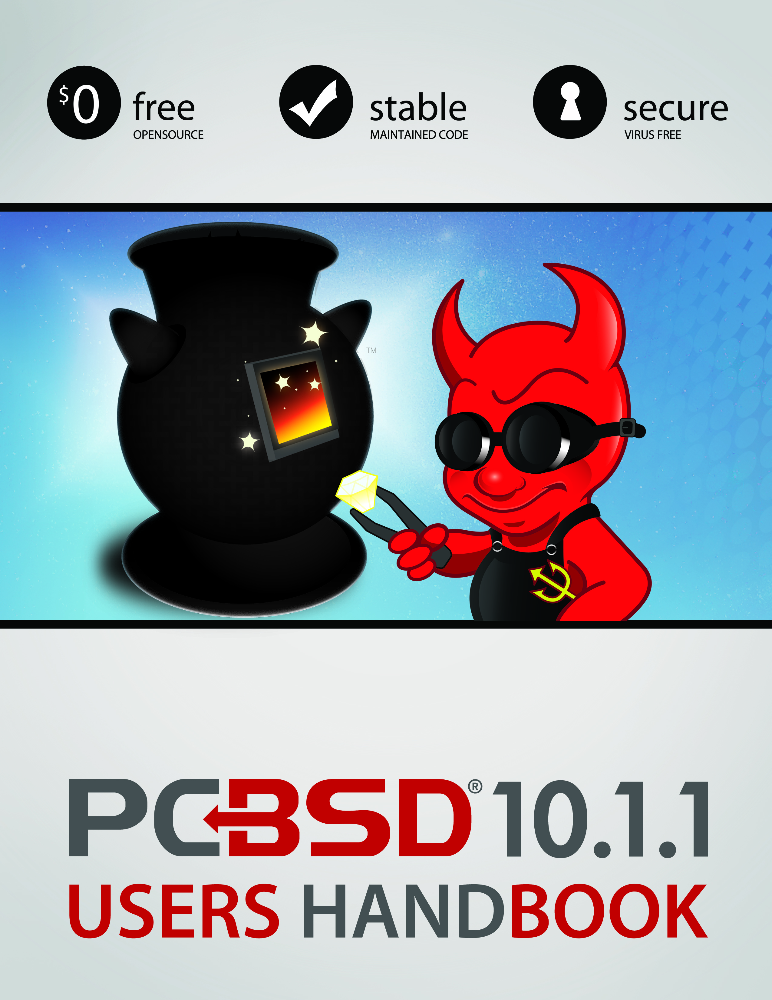
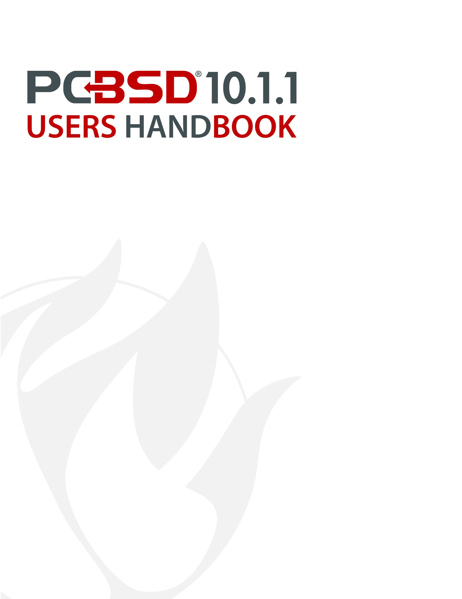

**Preface** 

Written by users of the PC-BSD® operating system.

Version 10.1.1

Published February 2, 2015

Copyright © 2005 - 2015 The PC-BSD® Project.

Welcome to PC-BSD®! This Handbook covers the installation and use of PC-BSD® 10.1.1. This Handbook is a work in progress and relies on the contributions of many individuals.
If you are interested in assisting with the Handbook, visit the  and create a login account for yourself.
If you use IRC Freenode, you are welcome to join the #pcbsd channel where you will find other PC-BSD® users.

Previous versions of the Handbook in various formats and languages are available from . 

The PC-BSD® Users Handbook is freely available for sharing and redistribution under the terms of the . This means that you have permission to copy, distribute, translate, and adapt the work as long as you attribute the PC-BSD® Project as the original source of the Handbook.

PC-BSD® and the PC-BSD® logo are registered trademarks of . If you wish to use the PC-BSD® logo in your own works, ask for permission first from marketing@ixsystems.com.

AMD is a trademark of Advanced Micro Devices, Inc.

Apache is a trademark of The Apache Software Foundation.

AppCafe® is a registered trademark of iXsystems.

Asus® and Eee PC® are registered trademarks of ASUSTeK® Computer Inc.

Facebook® is a registered trademark of Facebook Inc.

Flash® is a registered trademark of Adobe Systems Incorporated in the United States and/or other countries.

FreeBSD® is a registered trademark of the . 

FreeNAS® is a registered trademark of iXsystems.

IBM® is a registered trademark of International Business Machines Corporation.

Intel, the Intel logo, Pentium Inside, and Pentium are trademarks of Intel Corporation in the U.S. and/or other countries.

Java™ is a trademark of Oracle America and/or its affiliates in the United States and other countries.

Lenovo® is a registered trademark of Lenovo.

LinkedIn® is a registered trademark of LinkedIn Corporation.

Linux® is a registered trademark of Linus Torvalds.

Mac and Mac OS are trademarks of Apple Inc., registered in the U.S. and other countries.

MacBook® is a registered trademark of Apple Inc.

MySQL is a trademark of Oracle.

NVIDIA® is a trademark and/or registered trademark of NVIDIA Corporation in the U.S. and other countries.

PostgreSQL® is a registered trademark of the PostgreSQL Global Development Group.

ThinkPad® is a registered trademark of Lenovo.

TrueOS® is a registered trademark of iXsystems.

Twitter is a trademark of Twitter, Inc.
in the United States and other countries.

UNIX® is a registered trademark of The Open Group.

VirtualBox® is a registered trademark of Oracle.

VMWare® is a registered trademark of VMWare, Inc.

Warden® is a registered trademark of iXsystems.

Windows® is a registered trademark of Microsoft Corporation in the United States and other countries.

**Typographic Conventions** 

The PC-BSD® 10.1.1 Handbook uses the following typographic conventions: 

**bold text:** represents a command written at the command line.
In usage examples, the font is changed to Courier 10 with any command output displayed in unbolded text.

*italic text:* used to represent device names or file name paths.

**bold italic text:**** **used to emphasize an important point.

Introduction
************

Welcome to PC-BSD®! 

 began in 2005 when Kris Moore presented the first beta version of a  operating system pre-configured for desktop use.
Since then, PC-BSD® has matured into a polished, feature-rich, free-of-charge, open source operating system that meets the desktop needs of the beginner to the advanced user alike.

PC-BSD® is essentially a customized installation of FreeBSD, not a forked derivative.
Since the underlying FreeBSD system has been kept intact, you have a fully functional FreeBSD system under the hood.
PC-BSD® provides a graphical installer which can be used to easily install a desktop or a server version of FreeBSD known as TrueOS®. Other differences include: 

- PC-BSD® pre-configures at least one desktop environment during a desktop installation.
  Installed desktops appear in the login menu, allowing the user to select which desktop environment to log into.

- The PC-BSD® graphical installer supports additional features such as configuring ZFS and encryption during installation.
  

- PC-BSD® provides a graphical software management system for the desktop and a command line equivalent for the server.
  

- PC-BSD® provides a  of utilities for configuring the system.
  The graphical versions of these utilities are available on the desktop and the command line versions are available on both the desktop and server.
  

- PC-BSD® comes pre-configured with a number of automatic scripts to perform tasks such as connecting digital cameras or USB memory sticks.
  

- The PC-BSD® boot menu supports boot environments, or snapshots of the operating system, and the PC-BSD® Update Manager automatically adds a new boot environment to the boot menu before updating the operating system or software.
  This means that if an update fails, you can reboot into the previous version of the operating system, before the update occurred.
  

PC-BSD® started off as an independent project, but since October, 2006 PC-BSD® is financially backed and supported by the enterprise-class hardware solutions provider . 

The rest of this section discusses: 

-  

-  

-  

Goals and Features
==================

PC-BSD® provides the following features: 

- **Easy installation:** to install either a graphical desktop or command-line server version of PC-BSD®, simply insert the installation media, reboot the system to start the installer, and answer a few questions in the installation menus.
  

- **Automatically configured hardware:** video, sound, network, and other devices are automatically configured for you.
  

- **Intuitive desktop interface:** PC-BSD® comes with a choice of  to support your day-to-day computing needs.
  

- **Easy software management:** with , installing, upgrading, and uninstalling software is safe and easy.
  

- **Lots of software available:** in addition to its own software, PC-BSD® can install software that has been ported to FreeBSD (currently over 24,400 applications).
  

- **Easy to update:** PC-BSD® provides a built-in that will notify you of available updates and allow you to apply operating system security fixes, bug fixes and system enhancements as well as upgrade to newer versions of the operating system or installed software.
  

- **Virus-free:** PC-BSD® is not affected by viruses, spyware, or other malware.
  

- **No defragmentation:** PC-BSD® hard drives do not need to be defragmented and do not slow down over time.
  PC-BSD® uses  which is a self-healing filesystem.
  

- **Laptop support:** provides power saving and swap space encryption and automatically switches between wired and wifi network connections.
  

- **Secure environment:** PC-BSD® provides a pre-configured  and a built-in Host-based Intrusion Detection System with 

- **Easy system administration:** PC-BSD® provides a  containing many graphical tools for performing system administration tasks.
  

- **Localization:** PC-BSD® supports a number of  and locales.
  

- **Vibrant community:** PC-BSD® has a friendly and helpful . 

- **Professional support:** professional email and phone support is available from 

What's New in 10.1.1
====================

The following features or enhancements were introduced for PC-BSD® 10.1.1: 

- Support for Intel Centrino Advanced-N 6235 adapters has been added.
  

- The graphical utilities and installer have been converted to Qt5. 

- Support for  has been added to the installer and GRUB.
  A fresh install is needed to take advantage of this feature.
  

- The PC-BSD® installer now supports installation to a specified GPT partition, rather than an entire GPT disk, thus supporting dual-boot GPT configurations.
  For now, this type of installation disables swap, but swap can be added after installation.
  

- The ability to select installation roles has been added to the graphical and text installers.
  Installation roles allows the quick deployment of PC-BSD® or TrueOS® for specific workflows, such as art and photography, AV production, development, building FreeNAS®, using the Internet, playing multimedia, and office productivity.
  

- Several pre-installed editions are available for virtual environments.
  The “consumer-desktop” edition is an installed version of PC-BSD® with the KDE and Fluxbox desktop environments.
  The “freenas-builder” edition can be used by developers and testers to build an alpha copy of FreeNAS 10. The “trueos-server” edition provides a pre-installed server that is command-line only.
  Each edition is available in four formats: *.vdi* and *.ova* for VirtualBox, *.vmdk* for VMware, and *.raw* for Qemu and conversion to other formats.
  

- Open Virtual Appliance files, ending in an .ova extension, are now available for the consumer-desktop, freenas-builder, and trueos-server editions.
  See  for instructions on how to use these files within VirtualBox.
  

- Lumina has been updated to . 

- The server option of the  now lets you configure networking and SSH access during the installation.
  

- The ability to configure an auto-hidden panel has been added to the . 

- The ability to play chimes on Lumina startup and/or exit has been added to the Lumina Configuration Utility.
  

-  has been redesigned to make both system and software updates more risk-free.
  Updates now occur automatically and the system can be configured to automatically apply only system updates, only package updates, both types of updates, or to disable automatic updates.
  Updates now occur in a separate, mounted snapshot so that the update does not affect the currently running system.
  Once the update is complete, the user is notified so that they can reboot into the updated version of the system.
  

- The **fbsdupdate**, **fbsdupdatepkgs**, and **cron** flags have been added and the **-j** flag has been removed from **pc-updatemanager**.
  

- The **--licagree** option has been added to **pbi_add**.
  

-  now supports several modes for determining which applications appear.
  

- Bluetooth Manager has been removed from . 

-  has been added to Control Panel.
  

-  has been redesigned with a new, command line backend named **pc-sysconfig**.
  

- The Sound Configuration utility has been removed from Control Panel as it is now integrated into the **pc-mixer** utility.
  

- The  installation script for Debian has been updated to *debian-7-wheezy*.
  

- The **fbsdupdate**, **fbsdupgrade**, and **pkgupdate** options have been added to the command line version of **warden**.
  

PC-BSD® for Linux Users
=======================

PC-BSD® is based on , meaning that it is not a Linux distribution.
If you have used Linux before, you will find that some features that you are used to have different names on a BSD system and that some commands are different.
This section covers some of these differences.

Filesystems 
------------

BSD and Linux use different filesystems during installation.
Many Linux distros use EXT2, EXT3, EXT4, or ReiserFS, while PC-BSD® uses UFS or ZFS.
This means that if you wish to dual-boot with Linux or access data on an external drive that has been formatted with another filesystem, you will want to do a bit of research first to see if the data will be accessible to both operating systems.

Table 1.3a summarizes the various filesystems commonly used by desktop systems.
Most of the desktop managers available from PC-BSD® should automatically mount the following filesystems: FAT16, FAT32, EXT2, EXT3 (without journaling), EXT4 (read-only), NTFS5, NTFS6, and XFS.
See the  for more information about available file manager utilities.

Table 1.3a: Filesystem Support on PC-BSD®

+------------+-------------------+-----------------------------------------------------------------------------------------+---------------------------------------------------------------------------------------------------------------------------------------------------------------------------+
| Filesystem | Native to         | Type of non\-native support                                                             | **Usage notes**                                                                                                                                                           |
+============+===================+=========================================================================================+===========================================================================================================================================================================+
| Btrfs      | Linux             | none                                                                                    |                                                                                                                                                                           |
+------------+-------------------+-----------------------------------------------------------------------------------------+---------------------------------------------------------------------------------------------------------------------------------------------------------------------------+
| exFAT      | Windows           | none                                                                                    | requires a license from Microsoft                                                                                                                                         |
+------------+-------------------+-----------------------------------------------------------------------------------------+---------------------------------------------------------------------------------------------------------------------------------------------------------------------------+
| EXT2       | Linux             | r/w support loaded by default                                                           |                                                                                                                                                                           |
+------------+-------------------+-----------------------------------------------------------------------------------------+---------------------------------------------------------------------------------------------------------------------------------------------------------------------------+
| EXT3       | Linux             | r/w support loaded by default                                                           | since EXT3 journaling is not supported, you will not be able to mount a filesystem requiring a journal replay unless you **fsck** it using an external utility such as .  |
+------------+-------------------+-----------------------------------------------------------------------------------------+---------------------------------------------------------------------------------------------------------------------------------------------------------------------------+
| EXT4       | Linux             | r/o support loaded by default                                                           | EXT3 journaling, extended attributes, and inodes greater than 128\-bytes are not supported; EXT3 filesystems converted to EXT4 may have better performance                |
+------------+-------------------+-----------------------------------------------------------------------------------------+---------------------------------------------------------------------------------------------------------------------------------------------------------------------------+
| FAT16      | Windows           | r/w support loaded by default                                                           |                                                                                                                                                                           |
+------------+-------------------+-----------------------------------------------------------------------------------------+---------------------------------------------------------------------------------------------------------------------------------------------------------------------------+
| FAT32      | Windows           | r/w support loaded by default                                                           |                                                                                                                                                                           |
+------------+-------------------+-----------------------------------------------------------------------------------------+---------------------------------------------------------------------------------------------------------------------------------------------------------------------------+
| JFS        | Linux             | none                                                                                    |                                                                                                                                                                           |
+------------+-------------------+-----------------------------------------------------------------------------------------+---------------------------------------------------------------------------------------------------------------------------------------------------------------------------+
| NTFS5      | Windows           | full r/w support loaded by default                                                      |                                                                                                                                                                           |
+------------+-------------------+-----------------------------------------------------------------------------------------+---------------------------------------------------------------------------------------------------------------------------------------------------------------------------+
| NTFS6      | Windows           | r/w support loaded by default                                                           |                                                                                                                                                                           |
+------------+-------------------+-----------------------------------------------------------------------------------------+---------------------------------------------------------------------------------------------------------------------------------------------------------------------------+
| ReiserFS   | Linux             | r/o support is loaded by default                                                        |                                                                                                                                                                           |
+------------+-------------------+-----------------------------------------------------------------------------------------+---------------------------------------------------------------------------------------------------------------------------------------------------------------------------+
| UFS2       | PC\-BSD®FreeBSD   | check if your Linux distro provides ufsutils;r/w support on Mac; can be used on Windows | changed to r/o support in Mac Lion                                                                                                                                        |
+------------+-------------------+-----------------------------------------------------------------------------------------+---------------------------------------------------------------------------------------------------------------------------------------------------------------------------+
| ZFS        | PC\-BSD®, FreeBSD |                                                                                         |                                                                                                                                                                           |
+------------+-------------------+-----------------------------------------------------------------------------------------+---------------------------------------------------------------------------------------------------------------------------------------------------------------------------+

Device Names 
-------------

Linux and BSD use different naming conventions for devices.
For example: 

- in Linux, Ethernet interfaces begin with *eth*; in BSD, interface names indicate the name of the driver.
  For example, an Ethernet interface may be listed as *re0*, indicating that it uses the Realtek *re* driver.
  The advantage of this convention is that you can read the **man 4** page for the driver (e.g. type **man 4 re**) to see which models and features are provided by that driver.
  

- BSD disk names differ from Linux.
  IDE drives begin with *ad* and SCSI and USB drives begin with *da*.
  

Feature Names 
--------------

Some of the features used by BSD have similar counterparts to Linux, but the name of the feature is different.
Table 1.3b provides some common examples: 

Table 1.3b: Names for BSD and Linux Features

+-------------------------------------------------------------------------------+---------------------------+--------------------------------------------------------------------------------------------------------------------------------------------------------------------------------------------+
| PC\-BSD®                                                                      | Linux                     | **Description**                                                                                                                                                                            |
+===============================================================================+===========================+============================================================================================================================================================================================+
| PF                                                                            | iptables                  | default firewall                                                                                                                                                                           |
+-------------------------------------------------------------------------------+---------------------------+--------------------------------------------------------------------------------------------------------------------------------------------------------------------------------------------+
| */etc/rc.d/* for operating system and */usr/local/etc/rc.d/* for applications | *rc0.d/*, *rc1.d/*, etc.  | in PC\-BSD® the directories containing the startup scripts do not link to runlevels as there are no runlevels; system startup scripts are separated from third\-party application scripts  |
+-------------------------------------------------------------------------------+---------------------------+--------------------------------------------------------------------------------------------------------------------------------------------------------------------------------------------+
| */etc/ttys* and */etc/rc.conf*                                                | **telinit** and *init.d/* | terminals are configured in *ttys* and *rc.conf* indicates which services will start at boot time                                                                                          |
+-------------------------------------------------------------------------------+---------------------------+--------------------------------------------------------------------------------------------------------------------------------------------------------------------------------------------+

Commands 
---------

If you are comfortable with the command line, you may find that some of the commands that you are used to have different names on BSD.
Table 1.3c lists some common commands and what they are used for.

Table 1.3c: Common BSD and Linux Commands

+------------------------+------------------------------------------------------------+
| Command                | **Used to:**                                               |
+------------------------+------------------------------------------------------------+
| dmesg                  | discover what hardware was detected by the kernel          |
+------------------------+------------------------------------------------------------+
| sysctl dev             | display configured devices                                 |
+------------------------+------------------------------------------------------------+
| pciconf \-l \-cv       | show PCI devices                                           |
+------------------------+------------------------------------------------------------+
| dmesg \| grep usb      | show USB devices                                           |
+------------------------+------------------------------------------------------------+
| kldstat                | list all modules loaded in the kernel                      |
+------------------------+------------------------------------------------------------+
| kldload <module>       | load a kernel module for the current session               |
+------------------------+------------------------------------------------------------+
| pbi_add \-r <pbiname>  | install software from the command line                     |
+------------------------+------------------------------------------------------------+
| sysctl hw.realmem      | display hardware memory                                    |
+------------------------+------------------------------------------------------------+
| sysctl hw.model        | display CPU model                                          |
+------------------------+------------------------------------------------------------+
| sysctl hw.machine_arch | display CPU Architecture                                   |
+------------------------+------------------------------------------------------------+
| sysctl hw.ncpu         | display number of CPUs                                     |
+------------------------+------------------------------------------------------------+
| uname \-vm             | get release version information                            |
+------------------------+------------------------------------------------------------+
| gpart show             | show device partition information                          |
+------------------------+------------------------------------------------------------+
| fuser                  | list IDs of all processes that have one or more files open |
+------------------------+------------------------------------------------------------+

Additional Resources 
---------------------

The following articles and videos provide additional information about some of the differences between BSD and Linux: 

