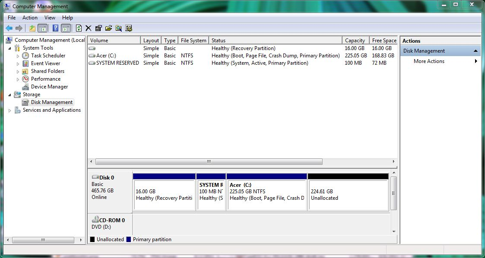
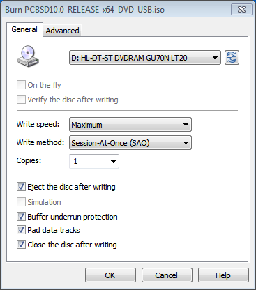
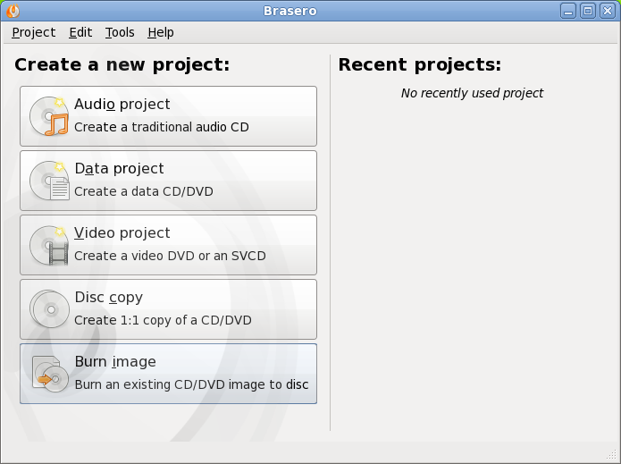
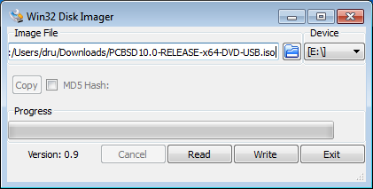
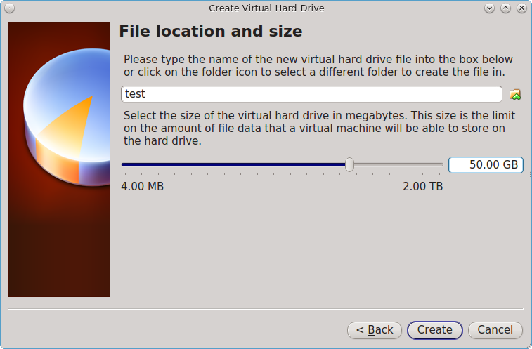

Pre-Installation Tasks
**********************

While the PC-BSD® installer is very easy to use, installing a brand new operating system can sometimes be a daunting task.

Before you begin, there are a few things you should check to ensure that your system is ready to install PC-BSD®. 

- **Are you dual-booting or installing over the entire drive?** If you are dual-booting you will need to ensure that you have a primary partition available.
  Refer to the section on .

- **Have you backed up your important data?** Any irreplaceable data, such as emails, bookmarks, or important files and documents should **always** be backed up to an external media, such as a removable drive or another system, **before**** **installing or upgrading any operating system.
  

If you wish to determine if your hardware is detected by PC-BSD®, start an installation and click the  button in the . 

Should you run into an issue with your installation there are many different . 

This section discusses the following topics: 

-  

-  

-  

-  

-  

Hardware Requirements
=====================

PC-BSD® has moderate hardware requirements and commonly uses less resources than its commercial counterparts.
Before installing PC-BSD®, make sure that your hardware or virtual machine at least meets the minimum requirements.
To get the most out of your PC-BSD® experience, refer to the recommended system requirements.

Minimum System Requirements 
----------------------------

At a bare minimum, you need to meet these requirements in order to install PC-BSD®: 

- 64-bit processor

- 1 GB RAM 

- 20GB of free hard drive space on a primary partition for a TrueOS® server installation 

- Network card 

Recommended System Requirements 
--------------------------------

The following are the minimum recommended requirements.
The more RAM and available disk space, the better your computing experience: 

- 64-bit processor 

- 4 GB of RAM 

- 50GB of free hard drive space on a primary partition for a desktop installation 

- Network card 

- Sound card 

- NVIDIA 3D accelerated video card 

The PC-BSD® installer's hardware check will display a warning message if the selected partition contains less than 20GB for a server installation or less than 50GB for a desktop installation.
The installation itself does not require this much disk space.
Instead the minimum recommendation is to provide sufficient room for the installation of multiple desktops, applications, and to store local ZFS snapshots.

You can never have too much RAM, so install as much as you can afford.
To play modern video games, you should use a fast CPU.
If you want to create a collection of tunes and movies on your computer, you will want a large hard disk drive which can be internal or external.

Supported Processors 
---------------------

PC-BSD® should install on any system containing a 64-bit (also called amd64) processor.
Despite the amd64 name, a 64-bit processor does **not need*** *to be manufactured by AMD in order to be supported.
The  lists the amd64 processors known to work.

Supported Video Cards 
----------------------

Like most open source operating systems, PC-BSD® uses X.org drivers for graphics support.
PC-BSD® will automatically detect the optimal video settings for supported video drivers.
You can verify that your graphics hardware is supported by clicking the  icon within the installer.

Support for the major graphic vendors is as follows: 

**NVIDIA:** if you want to use 3D acceleration, NVIDIA is currently the best supported as there is a native driver for PC-BSD®. If an NVIDIA video card is detected, an “nVidia settings” icon will be added to the Control Panel for managing NVIDIA settings.

**Intel:** 3D acceleration on most Intel graphics is supported.
Due to the current KMS support, you will not be able to switch between the graphical console and a virtual console using Crtl+Alt+F#. 

**ATI/Radeon:** 3D acceleration on most ATI and Radeon cards is supported.

**Optimus:** at this time  has not been ported to FreeBSD, meaning that there is no switching support between the two graphics adapters provided by Optimus.
Optimus implementations vary, so PC-BSD® may or may not be able to successfully load a graphics driver on your hardware.
If you get a blank screen after installation, check your BIOS to see if it has an option to disable one of the graphics adapters or to set “discrete” mode.
If the BIOS does not provide a discrete mode, PC-BSD® will default to the 3D Intel driver and disable NVIDIA.
This will change in the future when the NVIDIA driver supports Optimus.

Wireless Cards 
---------------

PC-BSD® has built-in support for dozens of wireless networking cards.
You can check if your card has . If it does, it should “just work”. A list of supported Atheros devices and known limitations can be found on the . 

PC-BSD® will automatically detect available wireless networks for supported wireless devices.
You can verify that your device is supported by clicking the  icon within the installer.
If it an external wireless device, insert it before running the Hardware Compatibility utility.

Certain Broadcom devices, typically found in cheap laptops, are quite buggy and can have lockups when in DMA mode.
If the device freezes, try switching to PIO mode in the BIOS.
Alternately, add the line *hw.bwn.usedma=0* to */boot/loader.conf* and reboot to see if that makes a difference.

Checking Hardware Compatibility 
--------------------------------

If you wish to check your hardware before installing PC-BSD®, a good place to start is the . Another good resource is to start the installer and click the  icon.

While most hardware “just works” with PC-BSD®, it is possible that you will run across a piece of hardware that does not.
It should be remembered that PC-BSD® is really FreeBSD, meaning that any hardware that works on FreeBSD will work on PC-BSD®. If you are experiencing problems with a device, start with a web search for the term “FreeBSD” plus the type and model of the hardware.
This will let you know if there is a known issue with the device.
If there are many search results, concentrate on the most recent ones as often hardware that used to be problematic has since been fixed or the missing driver will be available in an upcoming release of FreeBSD.
If you experience problems with a device that should work but does not or you can not find any existing problem reports for your hardware, you can help improve hardware support for all PC-BSD® users by  so that it can be addressed by the developers.

Laptops
=======

Many PC-BSD® users successfully run PC-BSD® on their laptops.
However, depending upon the model of laptop, you may run across some issues.
These typically deal with: 

- **Sleep/suspend:** unfortunately,  is not an exact science, meaning that you may have to experiment with various **sysctl** variables in order to achieve successful sleep and suspend states on your particular laptop model.
  If your laptop is a ThinkPad,  is an excellent source.
  For other types of laptops, try reading the SYSCTL VARIABLES section of **man 4 acpi** and check to see if there is an ACPI man page specific to your vendor by typing **apropos acpi.** The  section of the FreeBSD Handbook demonstrates how to determine your current **sysctl** values, modify a value, and make a modified value persist after a reboot.
  If the battery reading is incorrect, try the workaround in this  

- **Internal wireless:** some chipsets do not have a FreeBSD driver yet.
  

- **Synaptics:** depending upon the hardware, you may or may not be able to disable the system's touchpad.
  This  describes how to enable Synaptics and some of the **sysctl** options that this feature provides.
  

- **Optimus graphics:** the current workaround is to disable Optimus in the BIOS, set the onboard Intel video to be dominant, or to change the graphics mode to discrete.
  

If you wish to test your laptop's hardware, use the Hardware Compatibility icon  before continuing with the installation.

If you would like to install PC-BSD® onto an Asus Eee, read the  first.

The  has some tips for reducing power consumption.

ThinkPads with Known Bugs 
--------------------------

The ThinkPad T420 may panic during install.
If it does, go into the BIOS and set the video mode to “discrete” which should allow you to complete an installation.

Some Thinkpads have a BIOS bug that prevents them from booting from GPT labelled disks.
If you are unable to boot into a new installation, restart the installer and go into Advanced Mode in the . Make sure that the “Partition disk with GPT” box is unchecked.
If it was checked previously, redo the installation with the box unchecked.

Touch Screens 
--------------

PC-BSD® should automatically detect USB-based touch screen devices.
If your display is USB and is not auto-detected, send the output of **usbconfig** and your */etc/X11/xorg.conf* file using the .

Partitioning the Hard Drive
===========================

PC-BSD® does not come with a built-in partition manager.
The installer assumes that the drive is already prepared for an installation.
If you are not planning to install PC-BSD® onto the entire hard drive, you will need to use a third-party application in order to prepare a primary partition to use as the destination for your PC-BSD® install.

**NOTE:** PC-BSD® will not install into a secondary or logical partition, it must be a *primary* or a *GPT* partition.

*Before creating or editing your hard drive's partitions, make sure that you first back up your valuable data to an external media such as a removable USB drive!* 

This section demonstrates how to create free space within Windows 7 and how to use Parted Magic to create a primary partition from the free space.

Shrinking a Drive in Windows 7 
-------------------------------

If you are currently running Windows 7, it is using the entire hard drive.
This means that you will need to first shrink the drive in order to make room to create a new partition.
Shrinking is an operation that retains the current data on the partition, while reducing the size of the partition.

To shrink the drive, go to Start menu ➜ right-click Computer ➜ Manage ➜ Storage ➜ Disk Management.
Figure 2.3a shows an example of a system running Windows 7. In this example, Windows has created three partitions: a 16GB recovery partition, a 100MB system partition, and a 450GB data partition.

**Figure 2.3a: Viewing Disk Layout in Disk Management** 

.. image:: images/picture_20.jpg

**NOTE:** **if you plan to dual-boot with Windows, it is important that you do not choose to install PC-BSD® into any of these three partitions when you get to the **** of the installer.**** **It is a good idea to write down the sizes of the partitions so that you will recognize them when the PC-BSD® installer displays your current partitions.

Since the three Windows partitions are using the entire disk, the data partition needs to be shrunk in order to create space to install PC-BSD® into.
To shrink the data partition, right-click the partition, in this example it is called *Acer (C:)*, and select “Shrink Volume”. Wait a moment as it queries the volume for available shrink space; the results will be displayed as seen in the example in Figure 2.3b. 

**Figure 2.3b: Available Shrink Space** 

.. image:: images/picture_129.jpg

In this example, 321089MB of space is available.
To divide the partition between Windows and PC-BSD®, change that number to 230000 and click the “Shrink” button.
When finished, the newly created free space will be displayed, as seen in Figure 2.3c. 

You can now format the newly created free space using a utility such as Parted Magic, as described in the next section.

**NOTE:** while the Disk Management utility in Windows 7 indicates that it will let you format a primary partition, in reality it will only create an extended partition which will not allow you to install PC-BSD®. This means that you still need another utility such as Parted Magic.

**Figure 2.3c: Disk Now Has Free Space** 

Using Parted Magic to Create a Primary Partition 
-------------------------------------------------

 is a graphical, easy-to-use partition editor that is packaged on a live CD.
It can be used to shrink an existing partition and to create a primary partition from existing free space.

To use Parted Magic, download the latest *.iso.zip* file, unzip it, and burn it to CD.
Boot the system with the CD and let it boot into “Default settings (Runs from RAM)”. Wait for it to boot into the graphical screen, then select the “Partition Editor” desktop icon.

Figure 2.3d shows the same Windows 7 system in Partition Editor.
The 225.05GB partition is the Windows data partition (which was displayed as drive C within Windows 7) and the 224.61GB of unallocated space was created using the Windows Disk Management utility.
The “Create new Partition” screen was opened by right-clicking on the unallocated space and selecting “New” from the menu.

When creating your partition from unallocated space, make sure that “Primary Partition” is selected.
The filesystem type does not matter as the PC-BSD® installer will reformat it.
It is a good idea to write down the size and filesystem type so that you will recognize the partition that you will be installing PC-BSD® into.
Once you have made your selections, click the “Add” button.
Note that the partition will not actually be created until you click the “Apply” button to apply your changes.
A popup menu will prompt you to make sure that you have selected the correct partition as formatting a partition destroys all data on that portion of the disk.
Once the operation is complete, you can reboot and start the PC-BSD® installation.

**Figure 2.3d: Formatting the Unallocated Space into a Primary Partition** 

.. image:: images/picture_180.png

Obtaining PC-BSD®
=================

PC-BSD® version numbers are similar to those used by FreeBSD.
In addition, PC-BSD® provides two branches.
The branch that you choose to install or upgrade determines whether or not you will receive updates as new features and drivers are added to the operating system.
Image names will include the version number, where 10.1.1 is the most recent version, and either the word *RELEASE* or *STABLE*, where: 

- **RELEASE:** indicates that new drivers and features will not be added to the operating system until the next RELEASE version becomes available and the user upgrades to that new version.
  If reliability is more important to you than new features or drivers, use the RELEASE version.
  

- **STABLE:** around the 1st of each month,  will provide a patch which will update the operating system to include all of the new features and drivers.
  If you wish to have or test the latest features and drivers as they become available and can tolerate possible breakage caused by new features being available before the next RELEASE, use the STABLE version.
  

The installation file for the current RELEASE can be downloaded from the . Earlier versions and STABLE versions can be downloaded from the . 

Several types of files are available for download.
Before downloading a file, review the following descriptions to see which one best suits your needs: 

- files beginning with *PCBSD* and ending in *DVD-USB.iso* contain all of the information needed to install a graphical desktop or command-line server as well as several applications during installation.
  This type of file can either be burned to a DVD media or a USB thumb drive.
  There will also be associated files with the same name but ending in a *.md5* or *.sha256* extension.
  Depending upon your current operating system and its tools, you can use the value in either one of those files to determine the integrity of the download, as described in the next section.
  If a torrent is available, there will also be a file with the same name and a *.torrent* extension.
  

- files beginning with *TrueOS* contain a command-line installer and are used to install a command-line version of a server.
  This type of file can either be burned to a CD media or a USB thumb drive.
  There will also be associated files with the same name but ending in a *.md5* or *.sha256* extension.
  Depending upon your current operating system and its tools, you can use the value in either one of those files to determine the integrity of the download, as described in the next section.
  If a torrent is available, there will also be a file with the same name and a *.torrent* extension.
  

If you plan to install a graphical desktop, download the file with *PCBSD* in its name and either burn it to a DVD media or write it to a removable USB device.
If you prefer to install a command-line only server, you can either download the same ISO or download the ISO with *TRUEOS* in the name.
The *TRUEOS* download is smaller and can be burned to a CD or written to a removable USB device.

Pre-installed virtual images are also available, making it easy to use or try out PC-BSD® in a virtual environment.
In 10.1.1, four types of images are available: 

- Files ending in *.ova* can be used in VirtualBox, as described in .

- Files ending in *.vdi.xz* can be used in Virtualbox, as described in . 

- Files ending in *.vmdk.xz* can be used in VMware, as described in . 

- Files ending in *.raw.xz* can be used in Qemu and can also be converted to other virtual image formats.
  

When selecting a virtual image file, choose a format that matches your virtualization technology, and an edition that matches what you would like to use.
The following editions are available: 

- *consumer-desktop*: provides an installed version of PC-BSD® with the KDE and Fluxbox desktop environments.
  

- *freenas-builder*: can be used by developers and testers to build an alpha version of FreeNAS 10. 

- *trueos-server*: provides a pre-installed TrueOS® server that is command-line only.
  

After downloading the desired file, confirm the integrity of the download using the instructions in the next section.

If you downloaded an installation file, instead of a virtual image, refer to  for instructions on how to burn the file to bootable media.

If you have a slow download connection or wish to support the PC-BSD® project financially, you can purchase PC-BSD® DVDs from the . 

Members of the PC-BSD® project attend many IT conferences across the globe and give out PC-BSD® DVDs at conference booths.
Visiting a PC-BSD® booth is an excellent way to meet other PC-BSD® users and to get your questions answered.
Check the  to see if any events are happening near you.
If you are organizing a PC-BSD® booth,  to arrange for DVDs.

Data Integrity Check 
---------------------

After downloading the desired file, it is a good idea to check that the file is exactly the same as the one on the PC-BSD® server.
While downloading, a portion of the file may get damaged or lost, making the installation file unusable.
Each PC-BSD® installation file has an associated MD5 and SHA256 checksum.
If a checksum of the file you downloaded matches, your download was successful.
If a checksum does not match, try downloading the file again.
In order to verify a checksum, you will need to use a checksum verification utility.

**NOTE:** you only need to verify one of the checksums.
The  only lists the SHA256 while the  lists both the *.md5* and the *.sha256* checksum files.
This section demonstrates how to verify an MD5 checksum.

If you are currently using a Windows system, you can download and install the  utility in order to verify the MD5 checksum.
Once installed, launch the program and click the “Files” button, shown in Figure 2.4a, to browse to the location of your downloaded file.

Once the file is selected, click the green arrow to calculate the checksum.
Once calculated, it will be listed in the “Checksum\State” column, though FastSum will capitalize the letters.

On Linux and BSD systems you can use the built-in **md5** (or **md5sum**) command line tool to check the MD5 checksum.
In this example, the file is located in the *Downloads* subdirectory directory.
You should substitute the name and location of the file that you downloaded: 

md5 Downloads/PCBSD10.1.1-RELEASE-x64-DVD-USB.iso 

Figure 2.4a: Verifying a Checksum Using FastSum

.. image:: images/picture_178.png

Burning the Installation Media
==============================

If you downloaded an *.iso* file, it can be burned to either a DVD (or a CD, if it is the “TrueOS” ISO) or to a removable USB device.
This section demonstrates how to do so using several different applications and operating systems.

Burning to DVD on Windows 
--------------------------

Several burning applications are available for Windows.
This section will demonstrate how to use Windows 7's Disc Image Burner and InfraRecorder.

Windows 7 Disc Image Burner 
^^^^^^^^^^^^^^^^^^^^^^^^^^^^

Windows 7 has built-in support for writing ISO images to disc.
Right-click on the *.iso* file in Windows Explorer and select “Burn disk image”. Select the DVD device in the “Disk Burner” drop-down menu and then click “Burn” to write the disc.
See the Microsoft article  for more detailed instructions.

InfraRecorder 
^^^^^^^^^^^^^^

 is an open source burning application for both CDs and DVDs.
Once installed, open InfraRecorder and click on the “Write Image” button shown in Figure 2.5a.

InfraRecorder will display a screen where you can browse to the location of the *.iso* file.
Once selected, you will be presented with an options screen shown in Figure 2.5b. You can accept the defaults and click OK to start the burn.
When finished, the burner tray will open and a dialog box will appear indicating that the burning process has finished.

**Figure 2.5****a****: Initial InfraRecorder Screen** 

.. image:: images/picture_29.png

**Figure 2.5****b****: Burn Options in InfraRecorder** 

Burning to DVD on a BSD or Linux System 
----------------------------------------

This section demonstrates how to burn the installation ISO on a Linux or BSD system using the following tools: K3B, Brasero, and **growisofs**.

K3B 
^^^^

 is an easy-to-use graphical burning application for Linux and BSD systems.
If KDE is installed, it can be run from any desktop by typing **k3b**.

To burn your ISO, launch K3B, browse to the location of the *.iso* file in the screen shown in Figure 2.5c and click Tools ➜ Burn Image... to see the screen in Figure 2.5d. 

Click the “Start” button to burn the file.
K3B will automatically eject the media once the burn is complete.

**Figure 2.5****c****: Selecting the Burn Image Tool Within K3B** 

.. image:: images/picture_66.png

**Figure 2.5****d****: K3B's Burn Image Screen** 

.. image:: images/picture_33.png

Brasero 
^^^^^^^^

 is an easy to use burning application included with the  desktop.
A PBI is also available within AppCafe®. Once installed, Brasero can be launched by typing **brasero** from within any window manager.
Figure 2.5e shows the initial Brasero screen.

Click Burn image to open the screen seen in Figure 2.5f. Use the “Click here to select a disk image” button to select your .iso file.

The name and size of your *.iso* file should appear and Brasero will indicate the size of the media.
The lower portion of Figure 2.5f shows the menu that appears if you click on the “Properties” button.
You can change these options if you wish, but it is fine to keep the default settings.
When you are ready, click the “Burn” button and Brasero will burn your ISO.

**Figure 2.5****e****: Brasero's Initial Screen** 

**Figure 2.5****f****: Brasero** **Image Burning Setup**

.. image:: images/picture_38.png

growisofs 
^^^^^^^^^^

If you are familiar with using the command line on a FreeBSD or PC-BSD® system, you can use the **growisofs** command line utility to burn the DVD.
This utility is included with the dvd+rw-tools FreeBSD port which is installed by default on a PC-BSD® system.
If that software is not yet installed on a FreeBSD system, issue this command as the superuser: 

pkg install dvd+rw-tools

Depending upon the type of DVD burner hardware, you may have to configure the system to use it.
If the device is ATAPI (i.e. not USB or SCSI), the ATAPI driver must be loaded.
The superuser can issue this command: 

kldload atapicam

If you just get your prompt back, the driver successfully loaded.
If you get the message “kldload: can't load atapicam: File exists”, this means that the driver was already loaded.
If the device is USB or SCSI, no additional drivers need to be loaded if you are running the generic FreeBSD kernel.
After inserting the DVD media into the device, you can start the burn using this command: 

growisofs -Z /dev/cd0=PCBSD10.1.1-RELEASE-x64-DVD-USB.iso

If your device is not the first CD device, change the number 0 accordingly.
If your ISO has a different name, substitute the correct name in the command shown above.

Burning to DVD on a Mac OS X System 
------------------------------------

To burn the ISO on a Mac OS X system, go to Finder ➜ Applications ➜ Utilities ➜ Disk Utility.
With a blank media inserted into the burner, highlight the device representing the DVD writer and click the “Burn” button.
This will open up a browser where you can select the ISO to burn.

Once the ISO is highlighted, click the “Burn” button.
A pop-up message will indicate that the device is ready to burn.
Click burn once more and Disk Utility will write the ISO to the DVD media.

Writing to a USB Device
-----------------------

To write to a USB device, you will need the following: 

- a utility that can write the image to a USB media; the utility that you use will depend upon your operating system 

- a USB thumb drive or hard drive large enough to hold the image 

Once the image is written, boot from the removable device and proceed with the PC-BSD® installation.

**NOTE:** if there is a card reader on the system or used via USB dongle, the device enumeration may be affected.
For example, with the USB card reader dongle as the destination for the image burn below, the device name would be */dev/da1* instead of */dev/da0*.

Writing to USB on a Linux or BSD System 
^^^^^^^^^^^^^^^^^^^^^^^^^^^^^^^^^^^^^^^^

Io write the *.iso* file to a flash card or removable USB drive on a BSD or Linux system, use the **dd** command line utility.
On a FreeBSD system, the superuser can use this command to write the file to the first plugged in USB device: 

dd if=PCBSD10.1.1-RELEASE-x64-DVD-USB.iso of=/dev/da0 bs=1m

3658+1 records in

3658+1 records out 

3836317696 bytes transferred in 670.278574 secs (5723468 bytes/sec)

When using the **dd** command: 

- **if=** refers to the input file to be written

- **of=** refers to the output file (the device name of the flash card or removable USB drive); increment the number in the name if it is not the first USB device 

- **bs=** refers to the block size 

**NOTE for Linux users:** if you type **mount** with the USB stick inserted, you will see two or more device nodes corresponding to the USB stick.
For example, */dev/sdc* and */dev/sdc1*, where */dev/sdc1* corresponds to the primary partition of the USB stick.
Before using the **dd** command, ensure that the usb stick is first unmounted.
When using the **dd** command, remember to use */dev/sdc* (device node without the number) as the option for the output file **of=**.
Once the **dd** completes, you might not be able to mount the USB stick on Linux as Linux has very limited support for UFS, the BSD filesystem that gets created on the USB stick.

Writing to USB on a Windows System 
^^^^^^^^^^^^^^^^^^^^^^^^^^^^^^^^^^^

To burn the image file on a Windows system, you can use . When downloading win32-image-writer, download the latest version that ends in *-binary.zip* and use a utility such as Windows Explorer or 7zip to unzip the executable.

If you launch **win32-image-writer.exe**, it will start the Win32 Disk Imager utility, shown in Figure 2.5g. Use the “browse” button to browse to the location of the .iso file.
Insert a USB thumb drive and select its drive letter (in this example, drive D).
Click the “Write” button and the image will be written to the USB thumb drive.

**Figure 2.5****g****: Using Win32 Disk Imager to Write the Image** 

Writing to USB on a Mac OS X System 
^^^^^^^^^^^^^^^^^^^^^^^^^^^^^^^^^^^^

To burn the *.iso* file on Mac OS X, insert a USB stick and open Terminal.
Run the **diskutil list** command to find out the device name of the USB disk, unmount the USB disk, then use **dd** to write the image to the raw disk (*rdisk*).
In the following example, an 8GB USB stick has a device name of */dev/disk1* and a raw device name of */dev/rdisk1*.

**diskutil list** 

/dev/disk0

#: TYPE NAME SIZE IDENTIFIER

0: GUID_partition_scheme *500.1 GB disk0

1: EFI 209.7 MB disk0s1

2: Apple_HFS Macintosh HD 499.2 GB disk0s2

3: Apple_Boot Recovery HD 650.0 MB disk0s3 

/dev/disk1

#: TYPE NAME SIZE IDENTIFIER

0: FDisk_partition_scheme *8.0 GB disk1

1: DOS_FAT_32 UNTITLED 8.0 GB disk1s1

diskutil unmountDisk /dev/disk1

Unmount of all volumes on disk1 was successful

sudo dd if=/Users/dru/Downloads/ PCBSD10.1.1-RELEASE-x64-DVD-USB.iso of=/dev/rdisk1 bs=4m

Password:

3658+1 records in

3658+1 records out 

3836317696 bytes transferred in 670.278574 secs (5723468 bytes/sec)

Using VirtualBox
================

A virtualized environment allows you to test drive an operating system without overwriting your current operating system.
This is an excellent way to practice installation, determine whether all of your hardware is supported, or to try multiple versions of different operating systems.
Virtualization software effectively creates windows (known as virtual machines) into which you can install and use an operating system.
The only limitation to virtualization is your hardware as each virtual machine uses CPU and RAM.
Depending upon the amount of CPU and RAM in your computer, you may find that the operating system you install using virtualization software runs slowly.
If your computer slows down greatly, try closing other applications running on your computer to free up some RAM.

PC-BSD® automatically installs the  open source virtualization program and the  with the operating system.
The guest additions add mouse pointer integration, shared folders between the host and guest, better video support, and a shared clipboard.

If your computer is running another operating system, download the binary for your operating system from the . VirtualBox runs on Windows, Linux, Macintosh, and OpenSolaris and supports a large number of operating systems that can be installed into a virtual machine.

This section describes how to prepare VirtualBox for an installation of PC-BSD® using an *.iso* file as well as how to use the downloadable *.vmdk*, *.vdi*, and *.ova* images with VirtualBox.

Creating a Virtual Machine for an ISO File
------------------------------------------

In order to use PC-BSD® within VirtualBox, you will need to download the PC-BSD® ISO, install VirtualBox if  create a virtual machine, and use the ISO to install PC-BSD® into the virtual machine.
The virtual machine you create must meet the following minimum requirements: 

- 1024 MB base memory size 

- a virtual disk **at least 20 GB in size**** **for a TrueOS® installation or **at least 50 GB in size**** **for a PC-BSD® installation 

- a bridged adapter 

To create the virtual machine, start VirtualBox to see the screen shown in Figure 2.6a. 

**Figure 2.6a: Initial VirtualBox Screen** 

.. image:: images/picture_69.png

To create the virtual machine, click the “New” button to start the new virtual machine wizard.
Click the “Next” button to see the screen in Figure 2.6b.

**Figure 2.6b: Type in a Name and Select the Operating System for the New Virtual Machine** 

.. image:: images/picture_83.png

Enter a name for your virtual machine, which can be anything that makes sense to you.
Click the “Operating System” drop-down menu and select “BSD”. In the “Version” drop-down menu, select “FreeBSD (64 bit).
Click Next to see the screen in Figure 2.6c.

**Figure 2.6c: Select the Amount of Memory Reserved for the Virtual Machine** 

.. image:: images/picture_41.png

The base memory size must be changed to **at least 1024 MB.**** **If your system has a lot of RAM, use more.** **Any number within the green area is considered a safe value by VirtualBox, meaning it should not slow down your computer too much.
When finished, click Next to see the screen in Figure 2.6d.

This screen is used to create the virtual hard drive--in other words, the amount of disk space that will be available to the virtual machine.
If this is your first virtual machine, keep the default of “Create a virtual hard drive now” and click “Create” to go to the screen shown in Figure 2.6e. If you have created a virtual machine in the past and wish to reuse its disk space, select “Use an existing virtual hard drive file” from the drop-down menu.
You can create as many virtual machines as you wish.
However, if your computer is getting low on disk space, you should consider reusing existing virtual hard drives to prevent your physical hard drive from being used up by old virtual machines.

Select “VDI” and click the “Next” button to see the screen in Figure 2.6f.

Figure 2.6d: Select Whether to Use an Existing or Create a New Virtual Hard Drive

.. image:: images/picture_47.png

Figure 2.6e: Select the Hard Drive Type

.. image:: images/picture_163.png

Figure 2.6f: Select the Storage Type

.. image:: images/picture_168.png

You can now choose whether you want “Dynamically allocated” or “Fixed size” storage.
The first option uses disk space as needed until it reaches the maximum size that you will set in the next screen.
The second option creates a disk the same size as that specified amount of disk space, whether it is used or not.
Choose the first option if you are worried about disk space; otherwise choose the second option as it allows VirtualBox to run slightly faster.
Once you select Next, you will see the screen in Figure 2.6g.

This screen is used to set the size (or upper limit) of the virtual machine.
If you plan to install PC-BSD® into the virtual machine, **increase the size to at least 20 GB**** **or you will receive an error during the PC-BSD® installation.
If you plan to install KDE, GNOME, multiple desktop managers, or applications within the virtual machine, you will probably want to choose at least 50GB.
Whatever size you set, make sure that your computer has enough free disk space to support it.
Use the folder icon to browse to a directory on disk with sufficient space to hold your virtual machine.

Once you make your selection and press “Next”, you will see a summary of your choices.
You can use the “Back” button to return to a previous screen if you wish to change any values.
Otherwise, click “Create” to finish using the wizard.
Your virtual machine should now show up in the left box, as seen in the example in Figure 2.6h.

**Figure 2.6g: Select the File Name and Size of the Virtual Disk** 

**Figure 2.6h: The New Virtual Machine** 

.. image:: images/picture_207.png

Configuring the Network Adapter 
^^^^^^^^^^^^^^^^^^^^^^^^^^^^^^^^

If you wish to use your network card, you will need to configure bridging on your virtual machine.
To do this, go to Settings ➜ Network.
In the “Attached to” drop-down menu select “Bridged Adapter” then select the name of the physical interface from the “Name” drop-down menu.
In the example shown in Figure 2.6i, the Intel Pro/1000 Ethernet card is attached to the network and has a device name of *re0*.

**Figure 2.6i: Configuring a Bridged Adapter in VirtualBox** 

.. image:: images/picture_58.png

Configuring the Storage Device 
^^^^^^^^^^^^^^^^^^^^^^^^^^^^^^^

Before starting your virtual machine, you will want to configure it to use your installation media.
Click the Storage hyperlink in the right frame to access the storage screen seen in Figure 2.6j.

Double-click the word Empty, which represents your DVD reader.
If you wish to access the PC-BSD® installer from your DVD reader, double-check that the Slot is pointing to the correct location (e.g. IDE Secondary Master) and use the drop-down menu to change it if the location is incorrect.
Click the “CD/DVD Device” drop-down menu to change it from empty to the Host Drive value.

If you prefer to use an ISO that is stored on your hard disk, click the DVD icon ➜ “Choose a virtual CD/DVD disk file” to open a browser menu where you can navigate to the location of the ISO.
Highlight the desired ISO and click Open.
The name of the ISO will now appear in the Storage Tree section.

**Figure 2.6j: The Storage Settings of the Virtual Machine** 

.. image:: images/picture_263.png

You are now ready to install PC-BSD® into your virtual machine.
Simply highlight the virtual machine and click on the green Start icon.
A window will open indicating that the virtual machine is starting.
If you have a DVD inserted, you should hear it spin and it should start to boot into the installation program.
If it does not or if you are using an ISO stored on the hard disk, press F12 to select the boot device when you see the message to do so, then press “c” to boot from CD-ROM.
You can then proceed through the installation as described in the next section.

Using the Downloadable VirtualBox or VMWare Disk
------------------------------------------------

PC-BSD® provides pre-built VirtualBox and VMWare disks which create a a pre-made virtual machine with PC-BSD® already installed.
The VirtualBox file ends in a *.vdi.xz* extension and the VMWare disk file ends in a *.vmdk.xz* extension.
The *.xz* means that the file needs to be unzipped first so that it just ends with a *.vdi* or *.vmdk* extension.

On a Linux or BSD system, use the **xz** command by giving it the name of the file which you downloaded: 

xz -d PCBSD10.1.1-RELEASE-x64-consumer-desktop.vmdk.xz

Since this is a large file, the command will take a few minutes to extract the image.
You will receive the prompt back when it has finished.

On a Windows system, you can use a utility such as . On a Mac OS X system, simply double-click the file in “Finder” to extract it.

Once the file is unzipped, open VirtualBox.
When you get to Figure 2.6d, select “Use an existing virtual hard drive file”. 

Use the browse icon to browse to the location of the *.vdi* or *.vmdk* file then press “Next”. A message will indicate that the virtual machine will be created; click the “Create” button to finish the wizard.
You can then configure the network adapter and start the virtual machine.

The “consumer-desktop” virtual machine will boot into the post installation configuration screens so that the system can be configured.
Once the display wizard is finished and the login menu appears, input the username and password that you configured at the . 

When using the “trueos-server” edition, the virtual machine will boot into a password prompt.
Enter *root* as the username and *pcbsd* as the password.
It is recommended to immediately change the *root* password by typing **passwd** and following the prompts.
It is also recommended to create a user account to login with.
You can do so by typing **adduser** and following the prompts.

When using the “freenas-builder” edition, the virtual machine will boot into a password prompt.
Enter *root* as the username.
It is recommended to immediately change the root password by typing **passwd** and following the prompts.
This virtual machine can be used by developers and testers to build a copy of FreeNAS 10, which is currently in pre-alpha development.
This means that the code is changing quickly and it is quite possible that the build may fail, depending upon the recent source changes.
To attempt a build, follow the instructions in the  section of the FreeNAS README, but change the **git** command to **git clone --depth=1 -b freenas10/master https://github.com/freenas/freenas.git**.
Note that you do not need to install the “Requirements” listed in that README as the virtual machine already has these installed.
Also note that you cannot build FreeNAS 9.x using the “freenas-builder” virtual machine.

Using the Downloadable .ova File
--------------------------------

A file that ends in a *.ova* extension is a tarball of a virtual machine that follows the Open Virtualization Format (OVF).
This file can be used in any virtualization technology that supports OVF, such as VirtualBox or VMware.

If you double-click the *.ova* file on a Windows or Mac system, it will automatically open the image for you in the default virtualization application.

The first time you open an *.ova* file on a PC-BSD® system, right-click the file, select “Open With”, browse to the application to open it with, and check the box “Remember application association for this type of file”. The following example assumes the user has selected System → Oracle VM VirtualBox as the application.

The first time a PC-BSD® *.ova* file is opened, a screen will open so that you can review the virtual machine's settings that came with the file.
An example is shown in Figure 2.6k. To edit a setting, double-click its name.
Depending upon the setting, you can either type in the desired value or select it from a drop-down menu.
Once you are finished, click the “Import” button.
It will take a few minutes for the import to complete and a status bar will indicate the status of the import.
Once imported, the virtual machine will show in the left frame of VirtualBox.
Highlight the virtual machine and click “Start” to boot into the image.

When using the “consumer-desktop” edition, the virtual machine will boot into Figure 4.2a so that you can perform the post-installation configuration for the desktop.

When using the “trueos-server” edition, the virtual machine will boot into a password prompt.
Enter *root* as the username and *pcbsd* as the password.
It is recommended to immediately change the *root* password by typing **passwd** and following the prompts.
It is also recommended to create a user account to login with.
You can do so by typing **adduser** and following the prompts.

Figure 2.6k: Appliance Settings Screen

.. image:: images/picture_201.png

When using the “freenas-builder” edition, the virtual machine will boot into a password prompt.
Enter *root* as the username.
It is recommended to immediately change the root password by typing **passwd** and following the prompts.
This virtual machine can be used by developers and testers to build a copy of FreeNAS 10, which is currently in pre-alpha development.
This means that the code is changing quickly and it is quite possible that the build may fail, depending upon the recent source changes.
To attempt a build, follow the instructions in the  section of the FreeNAS README, but change the **git** command to **git clone --depth=1 -b freenas10/master https://github.com/freenas/freenas.git**.
Note that you do not need to install the “Requirements” listed in that README as the virtual machine already has these installed.
Also note that you cannot build FreeNAS 9.x using the “freenas-builder” virtual machine.
