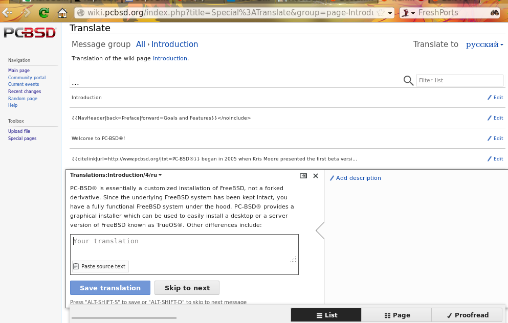

.. index:: advocacy
.. _Supporting PC-BSD®:

Supporting PC-BSD®
*******************

PC-BSD® is a community project and relies on involvement from its users and supporters. This section lists some ideas for becoming involved.

* :ref:`Become a Beta Tester`

* :ref:`Become a Translator`

* :ref:`Become a Developer`

* :ref:`Make Minor Modifications to a PBI Module`

* :ref:`Purchase PC-BSD® Swag`

* :ref:`Become an Advocate`

.. index:: testing
.. _Become a Beta Tester:

Become a Beta Tester
====================

If you like playing around with operating systems and have a bit of spare time, one of the most effective ways you can assist the PC-BSD® community is by
reporting problems you encounter while using PC-BSD®. 

If you have a spare system or virtual machine, you can also download and try out the latest release candidate snapshots. These versions are still in testing
and have not been officially released yet. Having as many people as possible using PC-BSD® on many different hardware configurations assists the project in
finding and fixing bugs. This makes using PC-BSD® better for everyone. Subscribing to the `PC-BSD® blog <http://blog.pcbsd.org/>`_ is a good way to keep
up-to-date on the availability of testing snapshots and any major bugs that are found within a snapshot.

If becoming a tester interests you, subscribe to the `testing mailing list <http://lists.pcbsd.org/mailman/listinfo/testing>`_. As new testing versions become
available they will be announced on this list. You will also be able to see what problems other testers are finding and can check to see if the problem exists
on your hardware as well. You can also subscribe to `these RSS feeds <http://dir.gmane.org/gmane.os.pcbsd.testing>`_ if you want a quick way to keep up with
the subjects being discussed on the testing mailing list.

Anyone can become a beta tester. Follow these tips so that you can accurately describe your findings so they can be fixed as soon as possible: 

* Before you :ref:`Report a bug`, search the testing mailing list to see if anyone else has reported a similar problem.

* When reporting a new issue, use a descriptive subject that includes the error and the version of PC-BSD®. Ideally, the subject is short (8 words or less)
  and contains key words about the error. An example would be "Warden on 10-STABLE-p4 fails to export jail". 

* Ensure that the body of the bug report includes the PC-BSD® version.

* Give a short (2-3 sentences) description of how to recreate the error (e.g. when I right click a jail in warden and select Export jail to a .wdn file, it
  lets me select a file name, but then it freezes). If there is an error message, include its complete text.

* Include any other info that may be useful (e.g. this used to work on 10.0).

* If the problem appears to be hardware related, include a copy of :file:`/var/run/dmesg.boot` as this file shows the hardware that was probed the last time
  the PC-BSD® system booted.
  
.. index:: translations
.. _Become a Translator:

Become a Translator
===================

If you are interested in translating PC-BSD® into your native language, there are three translation areas that you can choose to become involved in: 

1. Translate the graphical menus within the PC-BSD® operating system.

2. Translate the documentation that is published with PC-BSD®. 

3. Translate the PC-BSD® website.

This section describes each of these translation areas in more detail and how to get started as a translator.

Regardless of the type of translation you are interested in, you should first join the
`translations mailing list <http://lists.pcbsd.org/mailman/listinfo/translations>`_. When you join, send an email to introduce yourself and indicate which
language(s) and which type(s) of translations you can assist with. This will allow you to meet other volunteers as well as keep abreast of any notices or
updates that may affect translators.

.. index:: translations
.. _Interface Translation:

Interface Translation
---------------------

PC-BSD® uses `Pootle <http://en.wikipedia.org/wiki/Pootle>`_ for managing localization of the menu screens used by the installer and the PC-BSD® utilities.
Pootle makes it possible to find out if your native language has been fully localized for PC-BSD®. Pootle also makes it easy for users to check and submit
translated text as it provides a web editor and commenting system. This means that translators can spend their time making and reviewing translations rather
than learning how to use a translation tool.

To see the status of a localization, open up the `translation website <http://translate.pcbsd.org/>`_ in a web browser, as seen in Figure 11.2a. 

**Figure 11.2a: The PC-BSD® Pootle Translation System** 

.. image:: images/translate1.png

The localizations PC-BSD® users have requested are listed alphabetically on the left. If your language is missing and you would like to help in its
translation, send an email to the `translations mailing list <http://lists.pcbsd.org/mailman/listinfo/translations>`_ so it can be added.

The green bar in the "Progress" column indicates the percentage of PC-BSD® menus that have been localized. If a language is not at 100%, it means that the
menus that currently are not translated will appear in English instead of in that language.

If you click on a language name then click on the "PC-BSD" hyperlink under the "Name" column, you will see each menu item that is available for translation.
The example shown in Figure 11.2b is for the Greek localization. In this example, the menu for "ethernetconfig" is complete, but the one for "LifePreserver"
is not.

**Figure 11.2b: Viewing a Language's Available Menus** 

.. image:: images/translate2.png

In order to edit a translation, you need to first create a Pootle login account. Once you are logged in to Pootle, navigate to the menu item that you wish to
translate. In Figure 11.2c, the translator has clicked on "LifePreserver.ts" then clicked the "Translate" tab.

**Figure 11.2c: Using the Pootle Interface to Edit a Translation String**

.. image:: images/translate3.png

In this example, the first string, the phrase "Classic Home-Dir Backup" has not yet been translated. To add the translation, type the translated text into the
white text field and click the "Submit" button. To translate another text field, click on the hyperlink associated with its name, or use the "Next" and
"Previous" links to navigate between text fields. Sometimes, a text field exists in another screen and already has a translation. Figure 11.2d provides an
example where the translator clicked the hyperlink for "Filename" which displays three previous translations. The translator then clicked the first suggestion
and it was automatically added to the white text field.

**Figure 11.2d: Selecting a Suggested Translation**

.. image:: images/translate4.png

If you need help with a translation or using the Pootle system, you can ask for help on the translations mailing list or in the
`translations forum <http://forums.pcbsd.org/forumdisplay.php?f=19>`_. 

.. index:: translations
.. _Documentation Translation:

Documentation Translation
-------------------------

The PC-BSD® Users Handbook is published with each version of PC-BSD®. The PC-BSD® wiki is used to create the next version of the Handbook. As new features
are added to the upcoming version of PC-BSD®, they are documented on the wiki.

The wiki has been configured with the `MediaWiki translate extension <http://www.mediawiki.org/wiki/Help:Extension:Translate>`_. Wiki pages that are to appear
in the published version of the Handbook has been marked with the translate tag so that they can be translated by translators.

In order to translate a wiki page, you must first create a wiki account and log in.

To translate a page, click the "Translate this page" link at the top of the page. This will open the translation editor. In the upper right corner, click the
"Translate to English" drop-down menu to select the language you wish to translate into. Once the language is selected, click the "Edit" link next to the
string to be translated. This will open an editor where you can type in the translation. You can then either click the "Save translation" button to return to
the previous page or click the "Skip to next" button to go to the next string to be translated. In the example shown in Figure 11.2e, the user selected the
Introduction page, clicked to translate to Russian, and has selected a paragraph to translate.

**Figure 11.2e: Translating a Wiki Page**

You can review the status of the translation by clicking the "Page" button at the bottom of the screen. This will display the English and the translated
versions side by side.

When translating, make sure to adhere to the following rules. This is important as it ensures that the formatting of the published document is consistent
across all translations.

* Do not translate any text between formatting tags which are enclosed within "< >" brackets.

* Do not translate the names of a command (such as :command:`pc-updatemanager`) or application (such as "AppCafe®").

* Do not translate the output of a command unless it appears differently in a localized version of PC-BSD®. 

* Do not translate or remove any text contained between comment tags "<!-- and -->". 

.. index:: translations
.. _Website Translation:

Website Translation
-------------------

If you are interested in translating the PC-BSD® website, send an email to the
`translations mailing list <http://lists.pcbsd.org/mailman/listinfo/translations>`_. Someone will introduce you to the webmaster who will get you started on
website translation.

Currently, the following translated websites are available: 

* `French <http://www.pcbsd.org/fr/>`_

* `Spanish <http://www.pcbsd.org/es/>`_

.. index:: development
.. _Become a Developer:

Become a Developer
==================

If you like programming, and especially coding on FreeBSD, we would love to see you join the as a PC-BSD® committer. Developers who want to help improve the
PC-BSD® codebase are always welcome! If you would like to participate in core development, subscribe to the
`developers mailing list <http://lists.pcbsd.org/mailman/listinfo/dev>`_. Once you have signed up, feel free to browse the active tickets in the PC-BSD®
`bug tracker <https://bugs.pcbsd.org/projects/pcbsd/>`_. If you see something that you want to work on, or have a proposal for a project you wish to add to
PC-BSD®, please let us know via the developers list and we will be happy to help get you started.

Most of the PC-BSD® specific GUI tools are developed in C++ using the Qt Libraries, and other non-GUI development is done using standard Bourne shell
scripts. There may be cases where other languages or libraries are needed, but those will be evaluated on a case-by-case basis, so feel free to let us know
your proposals on the developers mailing list.

.. index:: development
.. _Getting the Source Code:

Getting the Source Code
-----------------------

The PC-BSD® source code is available from github and :command:`git` needs to be installed in order to download the source code. When using PC-BSD®,
:command:`git` is included in the base install.

To download the source code, :command:`cd` to the directory to store the source and type::

 git clone git://github.com/pcbsd/pcbsd.git

This will create a directory named :file:`pcbsd/` which contains the local copy of the repository. To keep the local copy in sync with the official
repository, run :command:`git pull` within the :file:`pcbsd` directory.

PC-BSD® graphical applications use Qt version 5 and their source is located in :file:`pcbsd/src-qt5/`. In order to compile the applications in this
directory, install the "PC-BSD Build ToolChain" PBI using :ref:`AppCafe®`. To instead install this PBI from the command line, type
:command:`pbi add devel/pcbsd-toolchain`.

Most of the PC-BSD® source code is divided into two sub-categories: 

* :file:`src-sh/` contains shell and C programs which do not include GUIs. These are the command line utilities used in TrueOS® and PC-BSD® and which are
  installed by the FreeBSD sysutils/pcbsd-utils port.

* :file:`src-qt5/` contains the Qt5-based GUIs seen in PC-BSD® and which are installed by the FreeBSD sysutils/pcbsd-utils-qt5 port 

To compile the command line utilities::

 cd src-sh

 make

To compile the graphical utilities::

 cd src-qt4

 /usr/local/lib/qt5/bin/qmake

 make

Several Qt IDEs are available in :ref:`AppCafe®`. The `QtCreator <http://qt-project.org/wiki/Category:Tools::QtCreator>`_ PBI is a full featured IDE designed
to help new Qt users get up and running faster while boosting the productivity of experienced Qt developers.
`Qt Designer <http://qt-project.org/doc/qt-4.8/designer-manual.html>`_ is lighter weight as it is only a :file:`.ui` file editor and does not provide any
other IDE functionality. To install this package, check the "Search all available PBI and packages" in the "App Search" tab of AppCafe® and search for "qt5-designer".
Alternately, install it using :command:`pkg install qt5-designer`.

If you plan to submit changes so that they can be included in PC-BSD®, fork the repository using the instructions at
`fork a repo <https://help.github.com/articles/fork-a-repo>`_. Make your changes to the fork, then submit them by issuing a
`git pull request <https://help.github.com/articles/using-pull-requests>`_. Once your changes have been reviewed, they will be committed or sent back with
suggestions.

.. index:: development
.. _Design Guidelines:

Design Guidelines
-----------------

PC-BSD® is a community driven project that relies on the support of developers in the community to help in the design and implementation of new utilities and
tools for PC-BSD®. Going forward, we aim to present a unified design so that programs feel familiar to users. As an example, while programs could have
"File", "Main", or "System" as their first entry on the "File" menu, "File" is used as the accepted norm for the first category on the menu bar.

This section describes a small list of guidelines to menu and program design in PC-BSD®. Since most programs designed for the last couple of decades have
followed this structure, it makes sense for us to follow the same standard.

Any graphical program that is a full-featured utility, such as :ref:`Warden®` or :ref:`AppCafe®`, should have a "File" menu. However, file menus are not
necessary for small widget programs or dialogue boxes. When making a file menu, a good rule of thumb is keep it simple. Most PC-BSD® utilities do not need
more than two or three items on the file menu. An example of a well laid out "File" menu is :ref:`AppCafe®`, shown in Figure 11.3a. 

**Figure 11.3a: AppCafe® File Menu**

.. image:: images/dev1.png

"Configure" is our adopted standard for the category that contains settings or configuration-related settings. If additional categories are needed, check to
see what other PC-BSD® utilities are using.

File menu icons are taken from the KDE Oxygen theme located in :file:`/usr/local/share/icons/oxygen`. Use these file menu icons so we do not have a bunch of
different icons used for the same function. Table 11.3a lists the commonly used icons and their default file names.

**Table 11.3a: Commonly Used File Menu Icons** 

+-----------+-----------------+--------------------+
| Function  | File Menu Icon  | File Name          |
+===========+=================+====================+
| Quit      | row 1, cell 2   | window-close.png   |
+-----------+-----------------+--------------------+
| Settings  | row 2, cell 2   | configure.png      |
+-----------+-----------------+--------------------+

PC-BSD® utilities use these buttons as follows: 

* **Apply:** applies settings and leaves the window open.

* **Close:** closes program without applying settings.

* **OK:** closes dialogue window and saves settings.

* **Cancel:** closes dialogue window without applying settings.

* **Save:** saves settings and closes window.

Fully functional programs like :ref:`AppCafe®` and :ref:`Warden®` do not use close buttons on the front of the application. Basically, whenever there is a
"File" menu, that and an "x" in the top right corner of the application are used instead. Dialogues and widget programs are exceptions to this rule. A good
example of a widget program would be :ref:`Update Manager`. 

Many users benefit from keyboard shortcuts and we aim to make them available in every PC-BSD® utility. Qt makes it easy to assign keyboard shortcuts. For
instance, to configure keyboard shortcuts that browse the "File" menu, put *&File* in the text slot for the menu entry when making the application.
Whichever letter has the *&* symbol in front of it will become the hot key. You can also make a shortcut key by clicking the menu or submenu entry and
assigning a shortcut key. Be careful not to duplicate hot keys or shortcut keys. Every key in a menu and submenu should have a key assigned for ease of use
and accessibility. Tables 11.3b and 11.3c summarize the commonly used shortcut and hot keys.

**Table 11.3b: Shortcut Keys** 

+---------------+---------+
| Shortcut Key  | Action  |
+===============+=========+
| CTRL + Q      | Quit    |
+---------------+---------+
| F1            | Help    |
+---------------+---------+

**Table 11.3c: Hot Keys** 

+-----------+-----------------+
| Hot Key   | Action          |
+===========+=================+
| Alt + Q   | Quit            |
+-----------+-----------------+
| Alt + S   | Settings        |
+-----------+-----------------+
| Alt + I   | Import          |
+-----------+-----------------+
| Alt + E   | Export          |
+-----------+-----------------+
| ALT + F   | File Menu       |
+-----------+-----------------+
| ALT + C   | Configure Menu  |
+-----------+-----------------+
| ALT + H   | Help Menu       |
+-----------+-----------------+

When saving an application's settings, the QSettings class should be used if possible. There are two different "organizations", depending on whether the
application is running with *root* permissions or user permissions. Use "PCBSD" for the organization for applications that run with user permissions and
"PCBSD-root" for applications that are started with root permissions via :command:`sudo`. Proper use prevents the directory where settings files are saved
from being locked down by *root* applications, allowing user applications to save and load their settings. Examples 11.3a and 11.3b demonstrate how to use the
QSettings class for each type of permission.

**Example 11.3a: User Permission Settings**::

 (user application - C++ code): 
 QSettings settings("PCBSD", "myapplication");

**Example 11.3b: Root Permission Settings**::

 (root application - C++ code):
 QSettings settings("PCBSD-root", "myapplication");

Developers will also find the following resources helpful: 

* `Commits Mailing List <http://lists.pcbsd.org/mailman/listinfo/commits>`_

* `Qt 5.4 Documenation <http://doc.qt.io/qt-5/index.html>`_

* `C++ Tutorials <http://www.cplusplus.com/doc/tutorial/>`_

.. index:: development
.. _Make Minor Modifications to a PBI Module:

Make Minor Modifications to a PBI Module
========================================

If you have a GitHub account and are logged in, you can contribute minor PBI changes to the
`pbi-modules repository <https://github.com/pcbsd/pcbsd/tree/master/pbi-modules>`_ using a web browser. If you do not have a GitHub account,
`create one <https://github.com/>`_ and use a valid email address as you will need to confirm your email address.

For example, to add a screenshot for an application, upload the screenshot file to a publicly accessible site, then add the URL to the screenshot in between
the quotes of the *PBI_SCREENSHOTS=""* line in the :file:`pbi.conf` file for that module. Or, to add a similar application, put the package category and
package name in between the *PBI_PLUGINS=""* line in the :file:`pbi.conf` file for that module. As an example, refer to the
`pbi.conf for the www/firefox PBI module <https://github.com/pcbsd/pcbsd/blob/master/pbi-modules/www/firefox/pbi.conf>`_. More information about the the
available :file:`pbi.conf` variables can be found in Table 8.1a. 

To make the edit, click on the :file:`pbi.conf` file for the module, click the "Edit" button, make the change, then click the "Commit changes" button. This
will issue a "git pull" request which will be reviewed by a developer who will either approve it or contact you if more information about the edit is needed.
Once the request is approved, you will receive an email about the approval and the change will appear in :ref:`AppCafe®` when the next package set becomes
available. How long that takes depends upon whether the system is set to use the PRODUCTION or EDGE package set.

.. index:: advocacy
.. _Purchase PC-BSD® Swag:

Purchase PC-BSD® Swag
======================

While PC-BSD® is free, some users may wish to purchase media or other items to show their support for the PC-BSD® Project. PC-BSD® items are available from
the following websites: 

* `FreeBSD Mall <http://www.freebsdmall.com/cgi-bin/fm/scan/fi=prod_bsd/tf=list_order/sf=sku/sf=title/sf=category/se=pc-bsd?id=B3TkJm7G&mv_pc=5>`_: sells
  PC-BSD® DVDs and subscriptions, stickers, The Definitive Guide to PC-BSD®, and apparel. 

* Amazon: sells The Definitive Guide to PC-BSD® (hard copy and Kindle formats) as well as the Kindle versions of the PC-BSD® Handbook. Items available for
  purchase in your country may vary. 

* `The PC-BSD® Corporate Storefront <http://pcbsd.qbstores.com/>`_: sells high-quality apparel and accessories. 

.. index:: advocacy
.. _Become an Advocate:

Become an Advocate
==================

So you love PC-BSD®? Why not tell your family, friends, fellow students and colleagues about it? You will not be the only one that likes a virus-free,
feature-rich, no-cost operating system. Here are some suggestions to get you started: 

* Burn a couple of DVDs and pass them out. If your school or user group has an upcoming event where you can promote PC-BSD®, you can request additional DVDs
  from sales@pcbsd.com.

* Consider giving a presentation about PC-BSD® at a local community event or conference. Let us know about it and we will help you spread the word.

* Write a personal blog detailing your journey from your first PC-BSD® install experience to your most recent accomplishment. The blog could also be used to
  teach or explain how to perform tasks on PC-BSD®. A regional language blog may help build the community in your area and to find others with similar
  interests.