.. index:: install
.. _Advanced Installation Topics:

Advanced Installation Topics
****************************

The previous section discussed a default installation of PC-BSD®. This section covers the following advanced installation topics: 

* :ref:`Using the Text Installer`

* :ref:`Install a Server`

* :ref:`Using the TrueOS® CD`

* :ref:`Dual Booting`

* :ref:`Creating an Automated Installation`

.. index:: install
.. _Using the Text Installer:

Using the Text Installer
========================

If you prefer to perform an installation using an ncurses menu rather than a full graphical installer, start the installation as usual and select the option "install" from
the :numref:`Figure %s: PC-BSD® Installation Menu <install1c>`. 

.. _install1c:

.. figure:: images/install1c.png

The next screen will prompt to install a desktop or a server, as seen in :numref:`Figure %s: Select Desktop or Server <text2>`. 

.. _text2:

.. figure:: images/text2.png

If you choose to install a desktop, the :ref:`Lumina Desktop` will be installed and configured for you. After the installation is complete, the
system will boot into the usual post-installation configuration screens.

If you choose to install a server, neither X nor a window manager will be installed, resulting in a command-line only TrueOS® installation. Once the server installation
is complete, the system will boot into a command prompt where you can enter the username and password that was created during the installation.

After making a selection and pressing enter, the next screen will display the available disks on the system. In the example shown in :numref:`Figure %s: Select Installation Disk <text3>`,
one disk is available.

.. _text3:

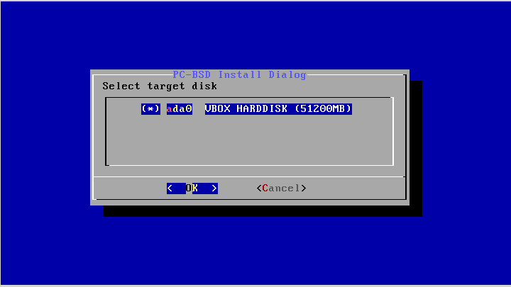

Select the disk to install into and press :kbd:`Enter`. In the next screen, the installer will display all available primary or GPT partitions. In the example
shown in :numref:`Figure %s: Select Partition <text4>`, there is only one partition and the installer has selected the default of installing to the entire disk.
**If you have multiple partitions and disks, carefully select the disk and partition to install to.**

.. _text4:

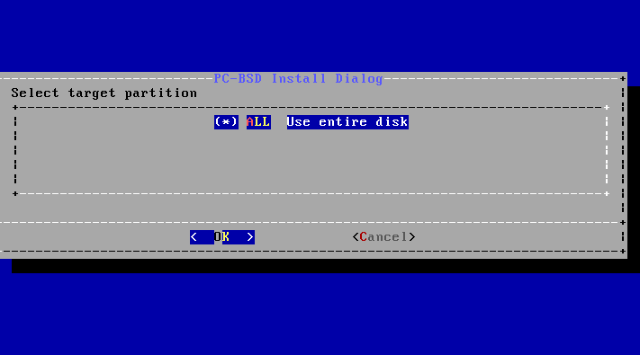

The next screen, shown in :numref:`Figure %s: Select Disk Format <text5>`, is used to select the type of disk format. If the installation disk or partition is larger than 2 TB, *GPT*
**must** be selected. Otherwise, selecting 
*GPT* should work for most modern hardware. When installing on older hardware, or if the newly installed system will not boot after selecting
*GPT*, select
*MBR* instead.

.. _text5:

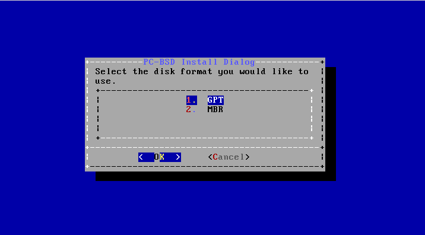

The next screen, shown in :numref:`Figure %s: Select Boot Manager <text6>`, is used to select the boot manager.

.. _text6:

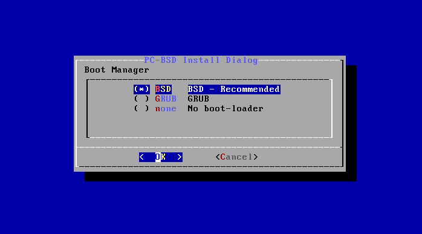

The default is to use *BSD* as it provides native support for boot environments. While 
*GRUB* provides some boot environment support, it may not be as up-to-date as the BSD support. It is recommended to only select this option if you are dual booting and the BSD boot manager
does not find your other operating systems. If you select  *none*, no boot manager will be installed and boot environments will not be available.

If you choose to install a server in the screen shown in :numref:`Figure %s: Select Desktop or Server <text2>`, the installer will next prompt for the following information: 

* the *root* password 

* confirm the *root* password (enter the same value) 

* the username to use when logging into the server (as *root* logins are discouraged) 

* the password to use when logging into the server 

* confirm the password to use when logging into the server 

* the real name for the user who logs into the server (can contain spaces) 

* the default shell for the user's login 

* the hostname for the server 

* whether or not you wish to enable networking. If you press "Yes", you can either select "auto" to enable DHCP on all interfaces or select an interface to
  statically configure. If you select an interface, you will be prompted to enter the IP address, subnet mask, IP address of the DNS server, and the IP
  address of the default gateway.

* whether or not you want to enable SSH access to the server.

The next screen, shown in :numref:`Figure %s: Review Installation Options <text9>`, provides the following options: 

* **install:** to start the installation, select this option and press enter.

* **wizard:** select this option to re-run the text installer and re-input your selections.

* **edit:** used to review, and possibly change any of the installation parameters.

* **hardware:** selecting this option will display a summary of the system's hardware. The example shown in :numref:`Figure %s: Hardware Summary <text10>` is from a system with a disabled
  sound card and no wireless card.

* **quit:** select this option to return to the screen shown in :numref:`Figure %s: Text Installation Menu <text1>`. 

.. _text9: 

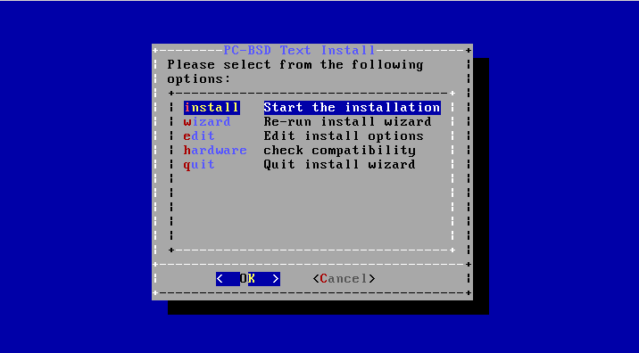

.. _text10:

.. figure:: images/text10.png

If you select "edit", the menu shown in :numref:`Figure %s: Edit Menu <text11>` will open.

.. _text11:

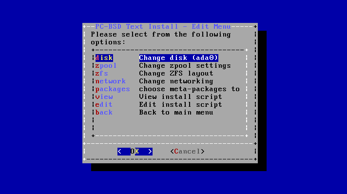

This screen contains the following options: 

* **disk:** used to change the disk to install into. Selecting this option will re-open the screens shown in :numref:`Figure %s: Select Installation Disk <text3>` through
  :numref:`Figure %s: Full Disk Encryption <text7>`, and then return you back to this menu.

* **zpool:** select this option if the system contains multiple disks and you wish to change the disk layout to a mirror or RAIDZ. The allowable layouts for
  the number of available disks will be displayed so that you can select the desired layout.

* **zfs:** used to modify the default ZFS layout. Selecting this option will open the screen shown in :numref:`Figure %s: ZFS Layout <text12>`. To edit the properties of an existing
  dataset, highlight the dataset's name and press enter. This will show the list of available ZFS properties for that dataset, as seen in the example shown in
  :numref:`Figure %s: ZFS Properties for a Dataset <text13>`. To change the value of a ZFS property, highlight it and press enter. The available values will vary, depending upon the selected property. If
  you wish to add additional datasets, select *add*. This will prompt for the full path of the mountpoint to create. For example, you could create a dataset
  named :file:`/usr/shares`. The dataset you create will be added to the bottom of the list. If you select the dataset and press enter, you can set its ZFS
  properties. Once you are finished customizing the ZFS layout, select *done*.

.. note:: while you can delete a dataset, the default datasets are needed for boot environments. For this reason,
   **it is not recommended to delete any default datasets.** ZFS options are described in `zfs(8) <http://www.freebsd.org/cgi/man.cgi?query=zfs>`_ and you should not
   change any options unless you are familiar with the ramifications of doing so.

* **network:** used to configure networking. Selecting this option will prompt to enter a hostname, to select either automatic DHCP configuration on all
  interfaces or to specify the interface to configure, and whether or not to enable SSH.

* **packages:** used to install additional packages. The following package roles are available: "Devel", "FreeNAS", "Office", and "Server". 

* **view:** if you select this option, a read-only copy of the ASCII text file containing the configuration script will be displayed.

* **edit:** if you select this option, the configuration script will open in the :command:`ee` editor, allowing you to make changes. The parameters supported
  by the installation script are described in . 

* **back:** select this option to return you to the menu shown in :numref:`Figure %s: Review Installation Options <text9>`.

.. _text12:

.. figure:: images/text12.png

.. _text13:

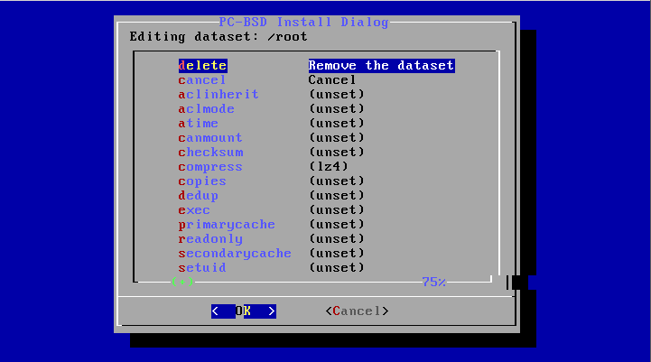

.. index:: install
.. _Using the System Utilities Menu:

Using the System Utilities Menu
-------------------------------

The text installer contains some handy tools for troubleshooting and fixing an existing PC-BSD® or TrueOS® installation.

If you click the *utility* option in the main menu of the text based installer shown in :numref:`Figure %s: PC-BSD® Installation Menu <install1c>`, it will open the screen shown in
:numref:`Figure %s: System Utilities Menu <util1>`. 

.. _util1:

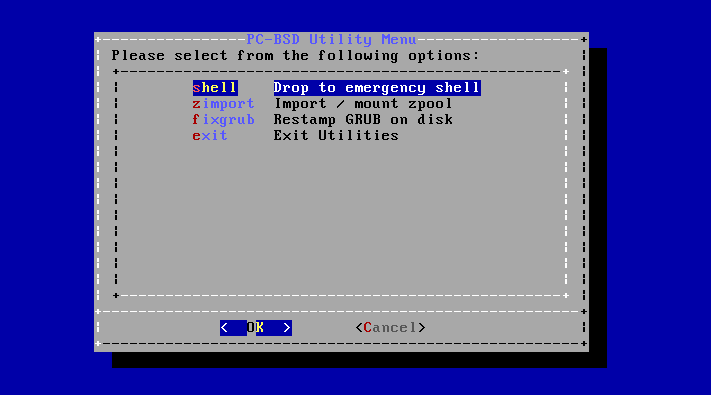

This screen provides the following options: 

* **shell:** this option is useful if you are troubleshooting a PC-BSD® system that no longer boots. It will open a shell with administrative access that
  includes the base FreeBSD utilities. Advanced users can use this shell to try to determine what the problem is, to create a backup or copy essential
  files to another system, or edit configuration files with an editor such as `ee <https://www.freebsd.org/cgi/man.cgi?query=ee>`_ or :command:`vi`. When you are finished using the shell,
  type :command:`exit` to return to the screen shown in :numref:`Figure %s: System Utilities Menu <util1>`.  

* **zimport** this option will display the names of available ZFS pools. Type the name of an available pool and it will import it then display the available boot environments (BEs).
  Type the name of the desired BE and this option will mount it then offer to open a chroot shell so that you can view its contents and manipulate files as
  needed in order to perform maintenance on that boot environment. When you are finished, type :command:`exit` to leave the boot environment and return to the screen
  shown in :numref:`Figure %s: System Utilities Menu <util1>`.

* **fixgrub:** this option can be used to restamp the GRUB boot loader should the installed system no longer boot. When this option is selected, it will first
  show the available ZFS pools and prompt you to input the name of the pool to import.

* **exit:** this option will return you to the main menu seen in :numref:`Figure %s: PC-BSD® Installation Menu <install1c>`. 

.. index:: install
.. _Install a Server:

Install a Server 
=================

The :ref:`System Selection Screen` of the PC-BSD® installer can be used to install TrueOS®, a FreeBSD-based server operating system, rather than a PC-BSD®
desktop operating system.

TrueOS® adds the following to a vanilla installation of FreeBSD: :command:`iocage` for jail management and the command line
versions of most of the :ref:`Control Panel` utilities. You will find those utilities in :file:`/usr/local/bin/pc-*`. It also installs the software mentioned in
`the RUN_DEPENDS= section of this file <https://github.com/pcbsd/freebsd-ports/blob/master/misc/trueos-base/Makefile>`_.

For a server installation, using the PC-BSD® installer rather than the FreeBSD installer offers several benefits: 

* the ability to easily configure ZFS during installation 

* the ability to configure multiple boot environments

* a wizard (described in this section) is provided during installation to configure the server for first use

.. note:: this section describes how to install a command-line only server using the PC-BSD® graphical installer. Alternately, you can also install a server
   :ref:`Using the TrueOS® CD` or :ref:`Using the Text Installer`.

To perform a graphical server installation, start the PC-BSD® installation as usual. When you get to the :ref:`System Selection Screen` of the installer, select "TrueOS
(Console based server)".

Click "Next" to start the "Server Setup Wizard" then click "Next" again to see the screen shown in :numref:`Figure %s: Set the Root Password <server2>`.

.. _server2:

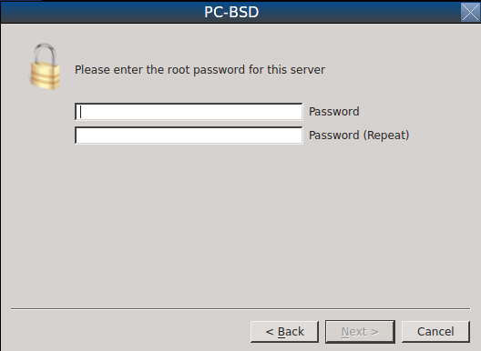

Input and confirm the root password then click "Next" to proceed to the screen shown in :numref:`Figure %s: Create the Primary User Account <server3>`. 

.. _server3:

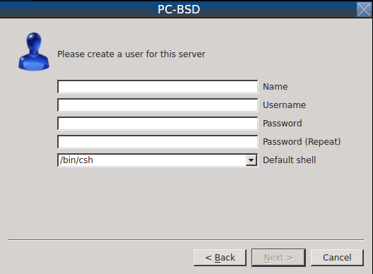

For security reasons, you should not login as the *root* user. For this reason, the wizard requires you to create a primary user account that will be used to
login to the server. This account will automatically be added to the *wheel* group, allowing that user to :command:`su` to the root account when
administrative access is required.

This screen contains the following fields: 

* **Name:** can contain capital letters and spaces.

* **Username:** the name used when logging in. Can not contain spaces and is case sensitive (e.g. *Kris* is a different username than *kris*).

* **Password:** the password used when logging in. You must type it twice in order to confirm it.

* **Default shell:** use the drop-down menu to select the **csh**, **tcsh**, **sh**, or **bash** login shell.

When finished, click "Next" to proceed to the screen shown in :numref:`Figure %s: Set the Hostname <server4>`. 

.. _server4:

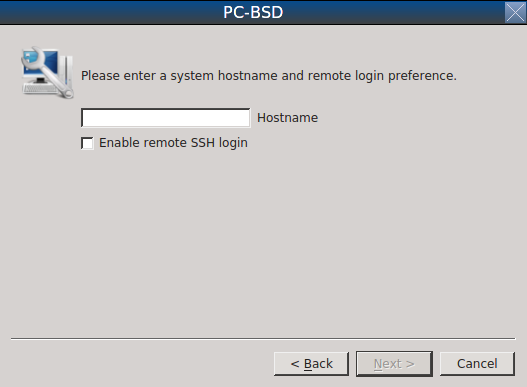

Input the system's hostname. If you will be using :command:`ssh` to connect to the system, check the box "Enable remote SSH login". Click "Next" to proceed to
the network configuration screen shown in :numref:`Figure %s: Configure the Network <server5>`. 

.. _server5:

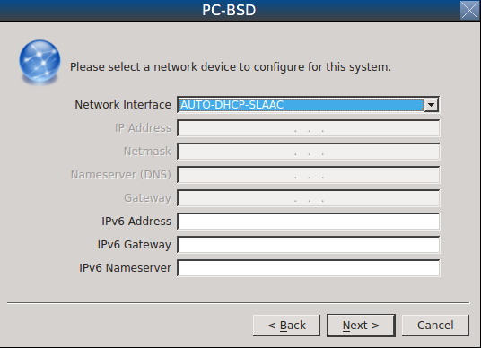

Use the "Network Interface" drop-down menu to select from the following: 

* **AUTO-DHCP-SLAAC:** (default) will configure every active interface for DHCP and for both IPv4 and IPv6 

* **AUTO-DHCP:** will configure every active interface for DHCP and for IPv4 

* **IPv6-SLAAC:** will configure every active interface for DHCP and for IPv6 

Alternately, select the device name for the interface that you wish to manually configure and input the IPv4 and/or IPv6 addressing information. When finished, click "Next" to access the
screen shown in :numref:`Figure %s: Install Ports <server7>`.

.. _server7:

.. figure:: images/server7.png

If you wish to install the FreeBSD ports collection, check the "Install ports tree" box then click "Finish" to exit the wizard and access the summary screen
shown in :numref:`Figure %s: Disk Selection Screen <install5a>`.

Click "Customize" if you wish to proceed to the  screen in order to configure the system's disk(s).

If you wish to save the finished configuration to re-use it at a later time, insert a FAT-formatted USB stick and click "Save Config to USB". 

Once you are ready to start the installation, click "Next". A pop-up menu will ask if you would like to start the installation now.

Once the system is installed, it will boot to a command-line login prompt. Login using the primary user account that was configured during installation. You
can now configure and use the server as you would any other FreeBSD server installation. The
`FreeBSD Handbook <http://www.freebsd.org/doc/en_US.ISO8859-1/books/handbook/>`_ is an excellent reference for performing common FreeBSD server tasks.

.. index:: install
.. _Using the TrueOS® CD:

Using the TrueOS® CD
=====================

PC-BSD® provides a CD-sized TrueOS® ISO which provides an ncurses installer for installing a command-line version of TrueOS®. If your
intent is to only install servers and you do not need a graphical installer, this ISO is convenient to use and quick to download.

To start a server installation using the TrueOS® ISO, insert the prepared boot media. The initial boot menu will be similar to the :numref:`Figure %s: Initial Boot Menu <install1b>`, but
the logo will be for TrueOS instead of PC-BSD.

Once the system has finished booting into the installer, it will display the installation menu shown in :numref:`Figure %s: TrueOS® Installation Menu <cd2>`. 

.. _cd2:

.. figure:: images/cd2.png

To begin the installation, press :kbd:`Enter`. The server installation will proceed as described in :ref:`Using the Text Installer`.

The TrueOS® boot media can also be used to repair an existing installation, using the instructions in :ref:`Using the System Utilities Menu`. 

.. index:: dualboot
.. _Dual Booting:

Dual Booting
============

A PC-BSD® installation assumes that you have an existing primary partition to install into. If your computer has only one disk and PC-BSD® will be the only
operating system, it is fine to accept the default partitioning scheme. However, if you will be sharing PC-BSD® with other operating systems, be
careful that PC-BSD® is installed into the correct partition or you may inadvertently overwrite an existing operating system.

If you wish to install multiple operating systems on your computer, you will need the following: 

* a partition for each operating system. Many operating systems, including PC-BSD®, can only be installed into a primary or GPT partition. This means that
  you will need to use partitioning software as described in :ref:`Creating Free Space`. 

* a backup of any existing data. This backup should not be stored on your computer's hard drive but on another computer or on a removable media such as a USB
  drive or burnt onto a DVD media. If you are careful in your installation, everything should go fine. However, you will be glad that you made a backup should
  something go wrong.

When installing PC-BSD® onto a computer that is to contain multiple operating systems, care must be taken to **select the correct partition** in the
:ref:`Disk Selection Screen` of the installation. On a system containing multiple partitions, each partition will be listed. Highlight the partition that you
wish to install into and **make sure that you do not select a partition that already contains an operating system or data that you wish to keep.**

.. warning:: **make sure that you click the "Customize" button while in the "Disk Selection" screen.** If you just click "Next" without customizing the disk
   layout, the installer will overwrite the contents of the primary disk.

.. index:: GRUB
.. _GRUB Boot Loader:

GRUB Boot Loader
----------------

PC-BSD® uses a customized version of the GRUB boot-loader to provide ZFS boot environment support, which is used as part of the system updating mechanism.
PC-BSD® requires that its version of GRUB be installed as the primary boot-loader on the disk.
**Using another boot-loader will break this critical functionality, and is strongly discouraged.**

The GRUB boot-loader is capable of dual-booting most other systems, including Windows and Linux. In order to dual-boot PC-BSD® with other operating systems,
you can add entries to the :file:`/usr/local/etc/grub.d/40_custom.dist` file, which will be preserved across upgrades. For more information on the syntax used,
refer to the `GRUB Manual <http://www.gnu.org/software/grub/manual/grub.html>`_. 

PC-BSD® will attempt to identify other installed operating systems to add to the GRUB menu automatically. If you have an operating system which is not
detected, please open a new bug report on `bugs.pcbsd.org <https://bugs.pcbsd.org/>`_ with the following information: 

* name of the operating system 

* output of the :command:`gpart show` and :command:`glabel list` commands 

* any entries you added to :file:`/usr/local/etc/grub.d/40_custom`

.. index:: install
.. _Creating an Automated Installation:

Creating an Automated Installation
==================================

PC-BSD® provides a set of Bourne shell scripts that allow advanced users to create automatic or customized PC-BSD® installations. :command:`pc-sysinstall`
is the name of the master script; it reads a customizable configuration file and uses dozens of backend scripts to perform the installation. You can read more
about this utility by typing **man pc-sysinstall**.

Here is a quick overview of the components used by :command:`pc-sysinstall`: 

* :file:`/usr/local/share/pc-sysinstall/backend/` contains the scripts used by the PC-BSD® installer. Scripts have been divided by function, such as
  :file:`functions-bsdlabel.sh` and :file:`functions-installcomponents.sh`. If you have ever wondered how the PC-BSD® installer works, read through these
  scripts. This directory also contains the :file:`parseconfig.sh` and :file:`startautoinstall.sh` scripts which :command:`pc-sysinstall` uses to parse the
  configuration file and begin the installation.

* :file:`/usr/local/share/pc-sysinstall/backend-query/` contains the scripts which are used by the installer to detect and configure hardware.

* :file:`/usr/local/share/pc-sysinstall/conf/` contains the configuration file :file:`pc-sysinstall.conf`. It also contains a file indicating which
  localizations are available (:file:`avail-langs`), an :file:`exclude-from-upgrade` file, and a :file:`licenses/` subdirectory containing text files of applicable licenses.

* :file:`/usr/local/share/pc-sysinstall/doc/` contains the help text that is seen if you run :command:`pc-sysinstall` without any arguments.

* :file:`/usr/local/share/pc-sysinstall/examples/` contains several example configuration files for different scenarios (e.g. :file:`upgrade`,
  :file:`fbsd-netinstall`). The :file:`README` file in this directory should be considered as mandatory reading before using :command:`pc-sysinstall`.

* :file:`/usr/sbin/pc-sysinstall` this is the script that is used to perform a customized installation.

This section discusses the steps needed to create a custom installation.

First, determine which variables you wish to customize. A list of possible variables can be found in :file:`/usr/local/share/pc-sysinstall/examples/README` and
are summarized in Table 5.5a. Note that the Table is meant as a quick reference to determine which variables are available. The :file:`README` file contains more
complete descriptions for each variable.

**Table 5.5a: Available Variables for Customizing a PC-BSD® Installation**

+----------------------------+--------------------------------------------------------------------------------+---------------------------------------------------------------------------------------------------------------------------------------------------------------------------------------------------------+
| Variable                   | Options                                                                        | Description                                                                                                                                                                                             |
+============================+================================================================================+=========================================================================================================================================================================================================+
| hostname=                  | should be unique for the network                                               | optional as installer will auto\-generate a hostname if empty                                                                                                                                           |
+----------------------------+--------------------------------------------------------------------------------+---------------------------------------------------------------------------------------------------------------------------------------------------------------------------------------------------------+
| installMode=               | "fresh", "upgrade", "extract", or "zfsrestore"                                 | sets the installation type                                                                                                                                                                              |
+----------------------------+--------------------------------------------------------------------------------+---------------------------------------------------------------------------------------------------------------------------------------------------------------------------------------------------------+
| installLocation=           | /path/to/location                                                              | used only when *installMode* is extract and should point to an already mounted location                                                                                                                 |
+----------------------------+--------------------------------------------------------------------------------+---------------------------------------------------------------------------------------------------------------------------------------------------------------------------------------------------------+
| installInteractive=        | "yes" or "no"                                                                  | set to "no" for automated installs without user input                                                                                                                                                   |
+----------------------------+--------------------------------------------------------------------------------+---------------------------------------------------------------------------------------------------------------------------------------------------------------------------------------------------------+
| netDev=                    | "AUTO-DHCP" or FreeBSD interface name                                          | type of network connection to use during the installation                                                                                                                                               |
+----------------------------+--------------------------------------------------------------------------------+---------------------------------------------------------------------------------------------------------------------------------------------------------------------------------------------------------+
| netIP=                     | IP address of interface used during installation                               | only use if *netDev* is set to an interface name                                                                                                                                                        |
+----------------------------+--------------------------------------------------------------------------------+---------------------------------------------------------------------------------------------------------------------------------------------------------------------------------------------------------+
| netMask=                   | subnet mask of interface                                                       | only use if *netDev* is set to an interface name                                                                                                                                                        |
+----------------------------+--------------------------------------------------------------------------------+---------------------------------------------------------------------------------------------------------------------------------------------------------------------------------------------------------+
| netNameServer=             | IP address of DNS server                                                       | only use if *netDev* is set to an interface name                                                                                                                                                        |
+----------------------------+--------------------------------------------------------------------------------+---------------------------------------------------------------------------------------------------------------------------------------------------------------------------------------------------------+
| netDefaultRouter=          | IP address of default gateway                                                  | only use if *netDev* is set to an interface name                                                                                                                                                        |
+----------------------------+--------------------------------------------------------------------------------+---------------------------------------------------------------------------------------------------------------------------------------------------------------------------------------------------------+
| netSaveDev=                | AUTO-DHCP or FreeBSD interface name(s) (multiple allowed separated by spaces)  | type of network configuration to enable on the installed system; can set multiple interfaces                                                                                                            |
+----------------------------+--------------------------------------------------------------------------------+---------------------------------------------------------------------------------------------------------------------------------------------------------------------------------------------------------+
| netSaveIP=                 | IP address of interface or "DHCP"                                              | only use if *netSaveDev* is set to an interface name or a list of interface names (repeat for each interface)                                                                                           |
+----------------------------+--------------------------------------------------------------------------------+---------------------------------------------------------------------------------------------------------------------------------------------------------------------------------------------------------+
| netSaveMask=               | subnet mask of interface                                                       | only use if *netSaveDev* is set to an interface name or a list of interface names (repeat for each interface)                                                                                           |
+----------------------------+--------------------------------------------------------------------------------+---------------------------------------------------------------------------------------------------------------------------------------------------------------------------------------------------------+
| netSaveNameServer=         | IP address of DNS server (multiple allowed separated by spaces)                | only use if *netSaveDev* is set to an interface name or a list of interface names (do not repeat for each interface)                                                                                    |
+----------------------------+--------------------------------------------------------------------------------+---------------------------------------------------------------------------------------------------------------------------------------------------------------------------------------------------------+
| netSaveDefaultRouter=      | IP address of default gateway                                                  | only use if *netSaveDev* is set to an interface name or a list of interface names (do not repeat for each interface)                                                                                    |
+----------------------------+--------------------------------------------------------------------------------+---------------------------------------------------------------------------------------------------------------------------------------------------------------------------------------------------------+
| disk0=                     | FreeBSD disk device name, (e.g. *ad0*)                                         | see *README* for examples                                                                                                                                                                               |
+----------------------------+--------------------------------------------------------------------------------+---------------------------------------------------------------------------------------------------------------------------------------------------------------------------------------------------------+
| partition=                 | "all", "free", "s1", "s2", "s3", "s4", or "image"                              | see *README* for examples                                                                                                                                                                               |
+----------------------------+--------------------------------------------------------------------------------+---------------------------------------------------------------------------------------------------------------------------------------------------------------------------------------------------------+
| partscheme=                | "MBR" or "GPT"                                                                 | partition scheme type                                                                                                                                                                                   |
+----------------------------+--------------------------------------------------------------------------------+---------------------------------------------------------------------------------------------------------------------------------------------------------------------------------------------------------+
| mirror=                    | FreeBSD disk device name (e.g. *ad1*)                                          | sets the target disk for the mirror (i.e. the second disk)                                                                                                                                              |
+----------------------------+--------------------------------------------------------------------------------+---------------------------------------------------------------------------------------------------------------------------------------------------------------------------------------------------------+
| mirrorbal=                 | "load", "prefer", "round-robin", or "split"                                    | defaults to "round-robin" if the *mirrorbal* method is not specified                                                                                                                                    |
+----------------------------+--------------------------------------------------------------------------------+---------------------------------------------------------------------------------------------------------------------------------------------------------------------------------------------------------+
| bootManager=               | "none", "bsd", or "GRUB"                                                       | when using "GRUB", include its package in *installPackages=*                                                                                                                                            |
+----------------------------+--------------------------------------------------------------------------------+---------------------------------------------------------------------------------------------------------------------------------------------------------------------------------------------------------+
| image=                     | /path/to/image /mountpoint                                                     | will write specified image file                                                                                                                                                                         |
+----------------------------+--------------------------------------------------------------------------------+---------------------------------------------------------------------------------------------------------------------------------------------------------------------------------------------------------+
| commitDiskPart             |                                                                                | this variable is mandatory and must be placed at the end of each *diskX* section; create a *diskX* section for each disk you wish to configure.                                                         |
+----------------------------+--------------------------------------------------------------------------------+---------------------------------------------------------------------------------------------------------------------------------------------------------------------------------------------------------+
| encpass=                   | password value                                                                 | at boot time, system will prompt for this password in order to mount the associated GELI encrypted partition                                                                                            |
+----------------------------+--------------------------------------------------------------------------------+---------------------------------------------------------------------------------------------------------------------------------------------------------------------------------------------------------+
| commitDiskLabel            |                                                                                | this variable is mandatory and must be placed at the end of disk's partitioning settings; see the *README* for examples on how to set the <File System Type> <Size> <Mountpoint> entries for each disk  |
+----------------------------+--------------------------------------------------------------------------------+---------------------------------------------------------------------------------------------------------------------------------------------------------------------------------------------------------+
| installMedium=             | "dvd", "usb", "ftp", "rsync", or "image"                                       | source to be used for installation                                                                                                                                                                      |
+----------------------------+--------------------------------------------------------------------------------+---------------------------------------------------------------------------------------------------------------------------------------------------------------------------------------------------------+
| localPath=                 | /path/to/files                                                                 | location of directory containing installation files                                                                                                                                                     |
+----------------------------+--------------------------------------------------------------------------------+---------------------------------------------------------------------------------------------------------------------------------------------------------------------------------------------------------+
| installType=               | "PCBSD" or "FreeBSD"                                                           | determines whether this is a desktop or a server install                                                                                                                                                |
+----------------------------+--------------------------------------------------------------------------------+---------------------------------------------------------------------------------------------------------------------------------------------------------------------------------------------------------+
| installFile=               | e.g. "fbsd-release.tbz"                                                        | only set if using a customized installer archive                                                                                                                                                        |
+----------------------------+--------------------------------------------------------------------------------+---------------------------------------------------------------------------------------------------------------------------------------------------------------------------------------------------------+
| packageType=               | "tar", "uzip", "split", or "dist"                                              | the archive type on the installation media                                                                                                                                                              |
+----------------------------+--------------------------------------------------------------------------------+---------------------------------------------------------------------------------------------------------------------------------------------------------------------------------------------------------+
| distFiles=                 | e.g. "base src kernel"                                                         | list of FreeBSD distribution files to install when using *packageType=dist*                                                                                                                             |
+----------------------------+--------------------------------------------------------------------------------+---------------------------------------------------------------------------------------------------------------------------------------------------------------------------------------------------------+
| ftpPath=                   | ftp://ftp_path                                                                 | location of the installer archive when using *installMedium=ftp*                                                                                                                                        |
+----------------------------+--------------------------------------------------------------------------------+---------------------------------------------------------------------------------------------------------------------------------------------------------------------------------------------------------+
| rsyncPath=                 | e.g. "life-preserver/back-2011-09-12T14_53_14"                                 | location of the rsync data on the remote server when using *installMedium=rsync*                                                                                                                        |
+----------------------------+--------------------------------------------------------------------------------+---------------------------------------------------------------------------------------------------------------------------------------------------------------------------------------------------------+
| rsyncUser=                 | username                                                                       | set when using *installMedium=rsync*                                                                                                                                                                    |
+----------------------------+--------------------------------------------------------------------------------+---------------------------------------------------------------------------------------------------------------------------------------------------------------------------------------------------------+
| rsyncHost=                 | IP address of rsync server                                                     | set when using *installMedium=rsync*                                                                                                                                                                    |
+----------------------------+--------------------------------------------------------------------------------+---------------------------------------------------------------------------------------------------------------------------------------------------------------------------------------------------------+
| rsyncPort=                 | port number                                                                    | set when using *installMedium=rsync*                                                                                                                                                                    |
+----------------------------+--------------------------------------------------------------------------------+---------------------------------------------------------------------------------------------------------------------------------------------------------------------------------------------------------+
| installComponents=         | e.g. "amarok,firefox,ports"                                                    | components must exist in */PCBSD/pc-sysinstall/components/*; typically, *installPackages=* is used instead                                                                                              |
+----------------------------+--------------------------------------------------------------------------------+---------------------------------------------------------------------------------------------------------------------------------------------------------------------------------------------------------+
| installPackages=           | e.g. "Xorg cabextract                                                          | list of traditional or pkg packages to install; requires *pkgExt=*                                                                                                                                      |
+----------------------------+--------------------------------------------------------------------------------+---------------------------------------------------------------------------------------------------------------------------------------------------------------------------------------------------------+
| pkgExt=                    | ".txz" or ".tbz"                                                               | specify the extension used by the type of package to be installed                                                                                                                                       |
+----------------------------+--------------------------------------------------------------------------------+---------------------------------------------------------------------------------------------------------------------------------------------------------------------------------------------------------+
| upgradeKeepDesktopProfile= | "yes" or "no"                                                                  | specify if you wish to keep your existing user's desktop profile data during an upgrade                                                                                                                 |
+----------------------------+--------------------------------------------------------------------------------+---------------------------------------------------------------------------------------------------------------------------------------------------------------------------------------------------------+
| rootPass=                  | password                                                                       | set the root password of the installed system to the specified string                                                                                                                                   |
+----------------------------+--------------------------------------------------------------------------------+---------------------------------------------------------------------------------------------------------------------------------------------------------------------------------------------------------+
| rootEncPass=               | encrypted string                                                               | set root password to specified encrypted string                                                                                                                                                         |
+----------------------------+--------------------------------------------------------------------------------+---------------------------------------------------------------------------------------------------------------------------------------------------------------------------------------------------------+
| userName=                  | case sensitive value                                                           | create a separate block of user values for each user you wish to create                                                                                                                                 |
+----------------------------+--------------------------------------------------------------------------------+---------------------------------------------------------------------------------------------------------------------------------------------------------------------------------------------------------+
| userComment=               | description                                                                    | description text can include spaces                                                                                                                                                                     |
+----------------------------+--------------------------------------------------------------------------------+---------------------------------------------------------------------------------------------------------------------------------------------------------------------------------------------------------+
| userPass=                  | password of user                                                               |                                                                                                                                                                                                         |
+----------------------------+--------------------------------------------------------------------------------+---------------------------------------------------------------------------------------------------------------------------------------------------------------------------------------------------------+
| userEncPass                | encrypted string                                                               | set user password to specified encrypted string                                                                                                                                                         |
+----------------------------+--------------------------------------------------------------------------------+---------------------------------------------------------------------------------------------------------------------------------------------------------------------------------------------------------+
| userShell=                 | e.g. "/bin/csh"                                                                | path to default shell                                                                                                                                                                                   |
+----------------------------+--------------------------------------------------------------------------------+---------------------------------------------------------------------------------------------------------------------------------------------------------------------------------------------------------+
| userHome=                  | e.g. "/home/username"                                                          | path to home directory                                                                                                                                                                                  |
+----------------------------+--------------------------------------------------------------------------------+---------------------------------------------------------------------------------------------------------------------------------------------------------------------------------------------------------+
| defaultGroup=              | e.g. "wheel"                                                                   | default group                                                                                                                                                                                           |
+----------------------------+--------------------------------------------------------------------------------+---------------------------------------------------------------------------------------------------------------------------------------------------------------------------------------------------------+
| userGroups=                | e.g. "wheel,operator"                                                          | comma separated (no spaces) list of additional groups                                                                                                                                                   |
+----------------------------+--------------------------------------------------------------------------------+---------------------------------------------------------------------------------------------------------------------------------------------------------------------------------------------------------+
| commitUser                 |                                                                                | mandatory, must be last line in each user block                                                                                                                                                         |
+----------------------------+--------------------------------------------------------------------------------+---------------------------------------------------------------------------------------------------------------------------------------------------------------------------------------------------------+
| runCommand=                | full path to command                                                           | run the specified command within chroot of the installed system, after the installation is complete                                                                                                     |
+----------------------------+--------------------------------------------------------------------------------+---------------------------------------------------------------------------------------------------------------------------------------------------------------------------------------------------------+
| runScript=                 | full path to script                                                            | runs specified script within chroot of the installed system, after the installation is complete                                                                                                         |
+----------------------------+--------------------------------------------------------------------------------+---------------------------------------------------------------------------------------------------------------------------------------------------------------------------------------------------------+
| runExtCommand=             | full path to command                                                           | runs a command outside the chroot                                                                                                                                                                       |
+----------------------------+--------------------------------------------------------------------------------+---------------------------------------------------------------------------------------------------------------------------------------------------------------------------------------------------------+
| timeZone=                  | e.g. "America/New_York"                                                        | location must exist in :file:`/usr/share/zoneinfo/`                                                                                                                                                     |
+----------------------------+--------------------------------------------------------------------------------+---------------------------------------------------------------------------------------------------------------------------------------------------------------------------------------------------------+
| enableNTP=                 | "yes" or "no"                                                                  | enable/disable NTP                                                                                                                                                                                      |
+----------------------------+--------------------------------------------------------------------------------+---------------------------------------------------------------------------------------------------------------------------------------------------------------------------------------------------------+
| localizeLang=              | e.g. "en"                                                                      | sets the system console and Desktop to the target language                                                                                                                                              |
+----------------------------+--------------------------------------------------------------------------------+---------------------------------------------------------------------------------------------------------------------------------------------------------------------------------------------------------+
| localizeKeyLayout=         | e.g. "en"                                                                      | updates the system's Xorg config to set the keyboard layout                                                                                                                                             |
+----------------------------+--------------------------------------------------------------------------------+---------------------------------------------------------------------------------------------------------------------------------------------------------------------------------------------------------+
| localizeKeyModel=          | e.g. "pc104"                                                                   | updates the system's Xorg config to set the keyboard model                                                                                                                                              |
+----------------------------+--------------------------------------------------------------------------------+---------------------------------------------------------------------------------------------------------------------------------------------------------------------------------------------------------+
| localizeKeyVariant=        | e.g. "intl"                                                                    | updates the Xorg config to set the keyboard variant                                                                                                                                                     |
+----------------------------+--------------------------------------------------------------------------------+---------------------------------------------------------------------------------------------------------------------------------------------------------------------------------------------------------+
| autoLoginUser=             | username                                                                       | user will be logged in automatically without entering a password                                                                                                                                        |
+----------------------------+--------------------------------------------------------------------------------+---------------------------------------------------------------------------------------------------------------------------------------------------------------------------------------------------------+
| sshHost=                   | hostname or IP address                                                         | the address of the remote server when using *installMode=zfsrestore*                                                                                                                                    |
+----------------------------+--------------------------------------------------------------------------------+---------------------------------------------------------------------------------------------------------------------------------------------------------------------------------------------------------+
| sshPort=                   | e.g "22"                                                                       | the SSH port number of the remote server when using *installMode=zfsrestore*                                                                                                                            |
+----------------------------+--------------------------------------------------------------------------------+---------------------------------------------------------------------------------------------------------------------------------------------------------------------------------------------------------+
| sshUser=                   | username                                                                       | the username on the remote server when using *installMode=zfsrestore*                                                                                                                                   |
+----------------------------+--------------------------------------------------------------------------------+---------------------------------------------------------------------------------------------------------------------------------------------------------------------------------------------------------+
| sshKey=                    | e.g. "/root/id_rsa"                                                            | path to the SSH key file on the remote server when using *installMode=zfsrestore*                                                                                                                       |
+----------------------------+--------------------------------------------------------------------------------+---------------------------------------------------------------------------------------------------------------------------------------------------------------------------------------------------------+
| zfsProps=                  | e.g. ".lp-props-tank#backups#mybackup"                                         | location of dataset properties file created by Life Preserver during replication when using *installMode=zfsrestore*                                                                                    |
+----------------------------+--------------------------------------------------------------------------------+---------------------------------------------------------------------------------------------------------------------------------------------------------------------------------------------------------+
| zfsRemoteDataset=          | e.g. "tank/backups/mybackup"                                                   | location of remote dataset to restore from when using *installMode=zfsrestore*                                                                                                                          |
+----------------------------+--------------------------------------------------------------------------------+---------------------------------------------------------------------------------------------------------------------------------------------------------------------------------------------------------+

Next, create a customized configuration. One way to create a customized configuration file is to read through the configuration examples in
:file:`/usr/local/share/pc-sysinstall/examples/` to find the one that most closely matches your needs. Copy that file to any location and customize it so that
it includes the variables and values you would like to use in your installation.

An alternate way to create this file is to start an installation, configure the system as desired, and save the configuration to a USB stick (with or without
actually performing the installation). You can use that saved configuration file as-is or customize it to meet an installation's needs. This method may prove
easier when performing complex disk layouts.

If you wish to perform a fully-automated installation that does not prompt for any user input, you will also need to review
:file:`/usr/local/share/pc-sysinstall/examples/pc-autoinstall.conf` and place a customized copy of that file into :file:`/boot/pc-autoinstall.conf` on your
installation media.

Table 5.5b summarizes the additional variables that are available for fully automatic installations.
More detailed descriptions can be found in the :file:`/usr/local/share/pc-sysinstall/examples/pc-autoinstall.conf` file. Note that the variables in this file
use a different syntax than those in Table 5.6a in that the values follow a colon and a space rather than the equals sign.

**Table 5.5b: Additional Variables for Automated Installations** 

+-----------------+-----------------------------------------------------------+-------------------------------------------------------------------------------------------------------------------+
| Variable        | Options                                                   | Description                                                                                                       |
+=================+===========================================================+===================================================================================================================+
| pc_config       | URL or /path/to/file                                      | location of customized :file:`pc-sysinstall.conf`                                                                 |
+-----------------+-----------------------------------------------------------+-------------------------------------------------------------------------------------------------------------------+
| confirm_install | "yes" or "no"                                             | should be set to "yes", otherwise booting the wrong disk will result in a system wipe                             |
+-----------------+-----------------------------------------------------------+-------------------------------------------------------------------------------------------------------------------+
| shutdown_cmd    | e.g. :command:`shutdown -p now`                           | good idea to run a shutdown, but this can be any command/script you wish to execute post-install                  |
+-----------------+-----------------------------------------------------------+-------------------------------------------------------------------------------------------------------------------+
| nic_config      | "dhcp-all" or <interface name> <IP address> <subnet mask> | will attempt DHCP on all found NICs until the installation file can be fetched or will setup specified interface  |
+-----------------+-----------------------------------------------------------+-------------------------------------------------------------------------------------------------------------------+
| nic_dns         | IP address                                                | DNS server to use                                                                                                 |
+-----------------+-----------------------------------------------------------+-------------------------------------------------------------------------------------------------------------------+
| nic_gateway     | IP address                                                | default gateway to use                                                                                            |
+-----------------+-----------------------------------------------------------+-------------------------------------------------------------------------------------------------------------------+

Finally, create a custom installation media or installation server. :command:`pc-sysinstall` supports the following installation methods: 

* from a CD, DVD, or USB media 

* from an installation directory on an HTTP, FTP, SSH+rsync, or a :ref:`PXE Boot Install Server`

The easiest way to create a custom installation media is to modify an existing installation image. For example, if you have downloaded an ISO for the PC-BSD®
version that you wish to customize, the superuser can access the contents of the ISO as follows::

 mdconfig -a -t vnode -f PCBSD10.1.2-RELEASE-x64-DVD-USB.iso -u 1

 mount -t cd9660 /dev/md1 /mnt

Make sure to :command:`cd` into a directory where you would like to copy the contents of the ISO. In the following examples, :file:`/tmp/custominstall/` was
created for this purpose::

 cd /tmp/custominstall

 tar -C /mnt -cf - . | tar -xvf -

 umount /mnt

Alternately, if you have inserted an installation CD or DVD, you can mount the media and copy its contents to your desired directory::

 mount -t cd9660 /dev/cd0 /mnt

 cp -R /mnt/* /tmp/custominstall/

 umount /mnt

If you are creating an automated installation, copy your customized :file:`pc-autoinstall.conf` to :file:`/tmp/custominstall/boot/`.

Copy your customized configuration file to :file:`/tmp/custominstall/`. Double-check that the "installMedium=" variable in your customized configuration file
is set to the type of media that you will be installing from.

You may also need to add some extra files if you set the following variables in your custom configuration file: 

* **installComponents=** make sure that any extra components you wish to install exist in :file:`extras/components/`

* **runCommand=** make sure the command exists in the specified path 

* **runScript=** make sure the script exists in the specified path 

* **runExtCommand=** make sure the command exists in the specified path 

If the installation media is a CD or DVD, you will need to create a bootable media that contains the files in your directory. To create a bootable ISO::

 cd /tmp/custominstall

 mkisofs -V mycustominstall -J -R -b boot/cdboot -no-emul-boot -o myinstall.iso

You can then use your favorite burning utility to burn the ISO to the media.

To begin an installation that requires user interaction::

 pc-sysinstall -c /path_to_your_config_file

To begin a fully automated installation, insert the installation media and reboot.

If you are using an HTTP, FTP, or SSH server as the installation media, untar or copy the required files to a directory on the server that is accessible to
users. Be sure to configure the server so that the installation files are accessible to the systems that you wish to install. If you are using a PXE Boot
Install server, follow the instructions at :ref:`PXE Boot Install Server`. 