.. index:: configuration
.. _Control Panel:

Control Panel
*************

PC-BSD® provides a Control Panel which contains tools for managing your system. The Control Panel is available from any desktop, meaning it is available
regardless of which desktop you log into.

.. note:: if a desktop does not contain an icon or menu item for Control Panel, type :command:`pc-controlpanel` from a shell prompt to launch the Control
   Panel.

A screenshot of Control Panel started from the KDE desktop can be seen in :numref:`Figure %s: PC-BSD® Control Panel <control1a>`.

.. _control1a:

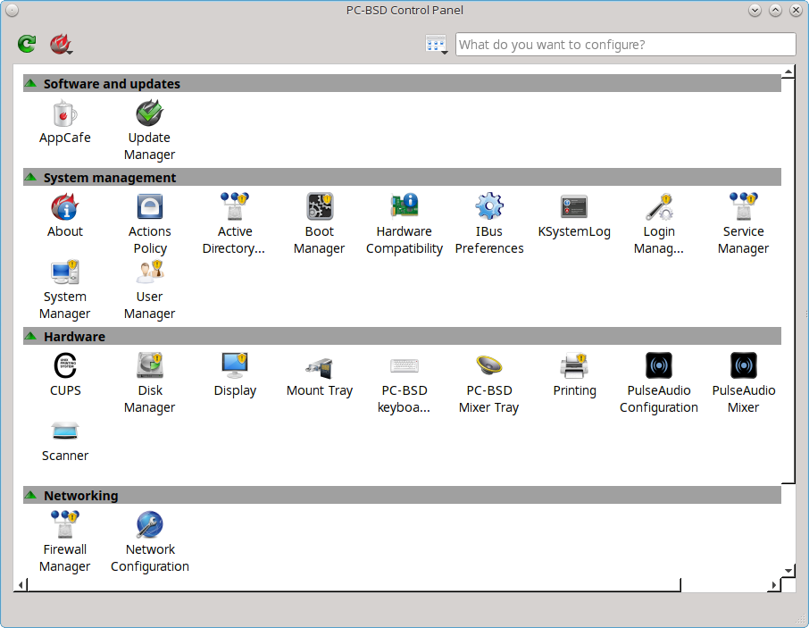

The available utilities are divided into sections. If you click a grey section bar, you can toggle between displaying (bar has up arrow) or hiding (bar has
down arrow) its icons. In this example, the display for the "Desktop environment" section is hidden.

The search box in the upper right can be used to find the proper control panel item if you know what you would like to configure but are uncertain which
utility to use. The icon next to the search box can be used to change the size of the icons, change the view from a grid to a list, and organize the icons
into a fixed layout.

If an icon includes a yellow exclamation mark, you will need to input your password in order to access that configuration utility.

.. note:: if your user account is not a member of the *wheel* group, you will not see the configuration utilities in Control Panel that require a password.
   By default, the first user account that you create is made a member of the *wheel* group. You can log in as that user and use :ref:`User Manager` to add
   other accounts to this group.

Control Panel includes a "desktop selector" menu which allows you to load the configuration utilities from just the operating system (as seen in the example in
:numref:`Figure %s: PC-BSD® Control Panel <control1a>`), all installed desktops, or one of these installed desktops: KDE, GNOME, Cinnamon, MATE, XFCE4, LXDE, or Lumina.
In the example shown in :numref:`Figure %s: Desktop Selector Menu <control2>`, the user is currently logged into the LXDE desktop but they have chosen to view the GNOME utilities.
The menu icon indicates the control panel view while "(current)" will be beside the desktop that is presently active.

.. _control2:

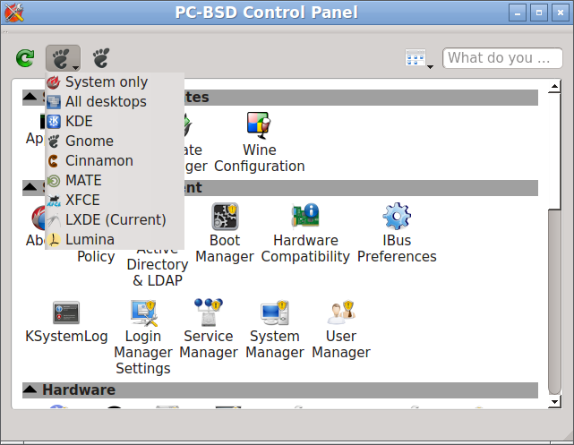

Switching between the icons in the selector changes the icons displayed within the control panel window to match those used in that desktop. If "All desktops"
is set by the desktop selector, you will see every utility that is available, depending upon which desktops are currently installed. You can change which
desktops are installed using :ref:`AppCafe®`.

The following utilities are found in the Control Panel of a PC-BSD® system, regardless of which desktops are installed: 

**Software and updates** 

* :ref:`AppCafe®`

* :ref:`Update Manager`

**System management** 

* :ref:`About`

* :ref:`Active Directory & LDAP`

* :ref:`Boot Manager`

* :ref:`Hardware Compatibility`

* :ref:`Login Manager`

* :ref:`Service Manager`

* :ref:`System Manager`

* :ref:`User Manager`

**Hardware** 

* :ref:`Disk Manager`

* :ref:`Display`

* :ref:`Mount Tray`

* :ref:`PC-BSD Keyboard Settings`

* :ref:`PC-BSD Mixer Tray`

* :ref:`Printing`

* :ref:`Scanner`

**Networking** 

* :ref:`Firewall Manager`

* :ref:`Network Configuration`

**Tools** 

* :ref:`Life Preserver`

* :ref:`Report a bug`

This chapter describes these utilities in more detail.

.. index:: configuration
.. _About:

About
=====

The "About" icon of Control Panel can be used to quickly find information about the PC-BSD® system. To start the application, double-click its icon in
Control Panel or type :command:`about-gui`. An example is seen in :numref:`Figure %s: About Information <about1a>`. 

.. _about1a:

.. figure:: images/about1a.png

The displayed information includes the version of PC-BSD® and the PC-BSD® utilities, whether the system is using the PRODUCTION or EDGE package set, the
hostname of the system, the underlying version of FreeBSD, the architecture, the name of the kernel (ident), the type of CPU, and the amount of installed
memory.

If you click the "System components" button, the X.org version and revision numbers of the PC-BSD command line and graphical utilities will be displayed, as
seen in the example shown in :numref:`Figure %s: System Components Screen <about2a>`. 

.. _about2a:

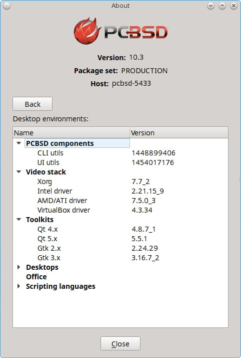

If you click "Back" and then the "Desktop environments" button, the currently installed desktops and their versions will be displayed, as seen in the example
in :numref:`Figure %s: Desktop Environments Screen <about3a>`.

.. _about3a:

.. figure:: images/about3a.png

.. index:: configuration
.. _Active Directory & LDAP:

Active Directory & LDAP
=======================

The "Active Directory & LDAP" icon is used for managing connections to an Active Directory or OpenLDAP domain. If your network contains an Active Directory or
OpenLDAP server, use this icon to input the settings needed to connect to your account information stored on the network.

This utility is to manage the settings of the client, not the Active Directory or OpenLDAP server itself. This application also needs more testing from users.
If you have trouble using this utility or find a bug, please post the details using the :ref:`Report a bug` tool.

To start the application, double-click its icon in Control Panel or type :command:`pc-su pc-adsldap`. You will be prompted to input your password.
:numref:`Figure %s: Initial Active Directory & LDAP Screen <ldap1>` shows the configuration utility with the Active Directory tab open.

.. _ldap1:

.. figure:: images/ldap1.png

.. note:: to prevent "DNS Update for localhost.pcbsd-3881 failed: ERROR_DNS_UPDATE_FAILED" errors, set the PC-BSD® hostname to include the realm name. For
   example, if the current hostname is "pcbsd-3881" and the realm name is "maloney.local", change the hostname to "pcbsd-3881.maloney.local" in
   :menuselection:`Control Panel --> Network Configuration (Advanced) -->  Misc`.

If you need to connect to a network running Active Directory, check the box "Enable Active Directory". This will change the greyed-out status of the rest of
the screen, allowing you to configure the following: 

* **Domain Name (DNS/Realm-Name):** input the name of the Active Directory domain (e.g. *example.com*) or child domain (e.g. *sales.example.com*). This
  setting is mandatory.

* **NetBIOS Name:** input the hostname of the PC-BSD® system as listed in the :ref:`About` icon.

* **Workgroup Name:** input the name of the Windows workgroup. Unless the administrator has changed it, the default workgroup name is *WORKGROUP*.

* **Allow Trusted Domains:** only check this box if the network has
  `active domain/forest trusts <https://technet.microsoft.com/en-us/library/cc757352(WS.10).aspx>`_. 

* **Administrator Name:** input the name of the Active Directory Administrator account.

* **Administrator Password:** input and confirm the password for the Active Directory Administrator account.

The values that you input using this GUI are saved to :file:`/usr/local/etc/pc-activedirectory.conf` and :file:`/usr/local/etc/smb4.conf`.

.. note:: once you enable AD, you can no longer configure auto login in :ref:`Login Manager` as users will now authenticate with the Active Directory server.

:numref:`Figure %s: Managing LDAP Client Settings <ldap2>` shows the configuration utility with the LDAP tab open.

.. _ldap2:

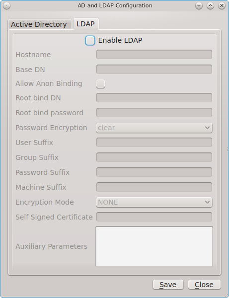

If you need to connect to a network which contains a configured LDAP server, check the box "Enable LDAP". This will change the greyed-out status of the rest
of the screen, allowing you to configure the following: 

* **Hostname:** input the hostname or IP address of the OpenLDAP server. This setting is mandatory.

* **Base DN:** input the top level of the LDAP directory tree to be used when searching for resources (e.g. *dc=test,dc=org*).

* **Allow Anon Binding:** only check this box if the LDAP server allows read and write access without requiring authentication.

* **Root bind DN:** input the name of the administrative account on the LDAP server (e.g. *cn=Manager,dc=test,dc=org*).

* **Root bind password:** input the password for the "Root bind DN".

* **Password Encryption:** select a type supported by the LDAP server, choices are: "clear" (unencrypted), "crypt", "md5", "nds", "racf", "ad", or "exop".

* **User Suffix:** this setting is optional and is usually a department or company name. The input value will be added to the name when a user account is
  added to the LDAP directory 

* **Group Suffix:** this setting is optional and is usually a department or company name. The input value will be added to the name when a group is added to
  the LDAP directory.

* **Password Suffix:** this setting is optional. The input value will be added to the password when a password is added to the LDAP directory.

* **Machine Suffix:** this setting is optional and usually represents a description such as server or accounting. The input value will be added to the name
  when a system is added to the LDAP directory.

* **Encryption Mode:** choices are "NONE", "SSL", or "TLS". The selected type must be supported by the LDAP server.

* **Self Signed Certificate:** used to verify the certificate of the LDAP server if SSL connections are used. Paste the output of the command 
  :command:`openssl s_client -connect server:port -showcerts`.

* **Auxiliary Parameters:** `ldap.conf(5) <http://www.openldap.org/software/man.cgi?query=ldap.conf>`_ options, one per line, not covered by other options in
  this screen.

The values that you input into this tab are saved to :file:`/usr/local/etc/pc-ldap.conf`.

If you are new to LDAP terminology, you may find it useful to skim through the
`OpenLDAP Software 2.4 Administrator's Guide <http://www.openldap.org/doc/admin24/>`_. 

.. index:: configuration
.. _Boot Manager:

Boot Manager
============

PC-BSD® supports a feature of ZFS known as multiple boot environments (BEs). With multiple boot environments, the process of updating software becomes a
low-risk operation as you can backup your current boot environment before upgrading or making software updates to your system. If needed, you also have the
option of booting into a backup boot environment. For example: 

* If you are making software changes to a boot environment, you can take a snapshot of that environment at any stage during the modifications.

* You can save multiple boot environments on your system and perform various updates on each of them as needed. You can install, test, and update different
  software packages on each.

* You can mount a boot environment in order to :command:`chroot` into the mount point and update specific packages on the mounted environment.

* You can move a boot environment to another machine, physical or virtual, in order to check hardware support.

.. note:: for boot environments to work properly, **do not delete the default ZFS mount points during installation.** The default ZFS layout ensures that when
   boot environments are created, the :file:`/usr/local/`, :file:`/usr/home/`, :file:`/usr/ports/`, :file:`/usr/src/` and
   :file:`/var/` directories remain untouched. This way, if you rollback to a previous boot environment, you will not lose data in your home directories, any
   installed applications, or downloaded src or ports. During installation, you can add additional mount points, just don't delete the default ones.

To create and manage boot environments using a graphical interface, go to :menuselection:`Control Panel --> Boot Manager` or type
:command:`pc-su pc-bootconfig`. You will be prompted to enter your password.

PC-BSD® automatically creates a boot environment whenever it updates the operating system or installed software. In the example shown in
:numref:`Figure %s: Managing Boot Environments <be1>`, there
is an entry named *default* that represents the original installation and an entry that was created when the operating system was updated to patch level 20.

.. _be1:

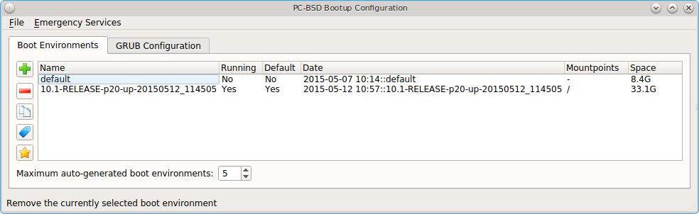

To ensure that the files that the operating system needs are included when the system boots, all boot environments include :file:`/usr`, :file:`/usr/local`,
and :file:`/var`. User-specific data is **not** included in the boot environment. This means that :file:`/usr/home`, :file:`/usr/jails`, :file:`/var/log`,
:file:`/var/tmp`, and :file:`/var/audit` will not change, regardless of which boot environment is selected at system boot.

From top to bottom, the icons on the far left are used to: 

**Create:** a new boot environment. You should do this before making any changes to the system that may impact on your current boot environment. You will be
prompted for a name which can only contain letters or numbers. Once you click "OK", the system will create the environment, then add it to the list of boot
environments.

**Remove:** will delete the highlighted boot environment. You can not delete the boot environment which has a "Running" status of *Yes* as that is the current
boot environment.

**Copy:** creates a copy of an existing boot environment.

**Rename:** used to rename the highlighted boot environment. The name is what appears in the boot menu when the system boots. You cannot rename the BE you are
currently booted into and an error message will occur if you try to do so.

**Activate:** tells the system to boot into the highlighted boot environment at next system boot. The "Default" will change to *Yes*, but the "Running" will
remain the same. In other words, "Running" refers to the boot environment the system last booted into (is currently running from) whereas "Default" indicates
which boot environment the system will boot into at next system boot.

This screen also lets you set the "Maximum auto-generated boot environments". The default is *5* and the range is from *1* to *10*. PC-BSD® automatically
creates a boot environment before updating any software and the operating system as well as before applying a system update. Once the configured maximum
number of boot environments is reached, PC-BSD® will automatically prune (delete) the oldest automatically created boot environment. However, it will not
delete any boot environments you create manually.

Whenever there are multiple boot environments, a boot menu similar to the one seen in :numref:`Figure %s: Boot Menu With Multiple Boot Environments <be4>` will appear for two seconds during
system boot. If you do not pause this screen, the system will automatically boot into either the last "Running" boot environment or, if you have activated another boot environment, the
environment that was set as the "Default". 

.. _be4:

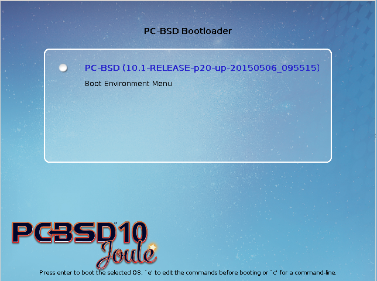

The "Boot Environment Menu" entry indicates that multiple boot environments are available. To browse the available boot environments, press the :kbd:`spacebar` to pause the screen,
arrow down to "Boot Environment Menu" and press :kbd:`Enter`. In the example shown in :numref:`Figure %s: Boot Menu Shows Created Boot Environments <be2>`, two boot environments are
available. The entry with "default" in the name indicates the date and time of the initial installation. The first boot entry indicates the operating system's current patch level and the
date the system was updated. It is first in the boot order and since it is highlighted in blue, it is the active boot environment, or the one the system will boot into unless another BE is
manually selected in this menu. Use the arrow keys to highlight the boot environment you would like to boot into, and press :kbd:`Enter` to continue booting into the selected boot
environment. 

.. _be2:

.. figure:: images/be2.png

To customize the appearance of the boot menu, click the "Grub Configuration" tab in Boot Manager to see the screen seen in :numref:`Figure %s: Managing GRUB Configuration <be3a>`. 

.. _be3a:

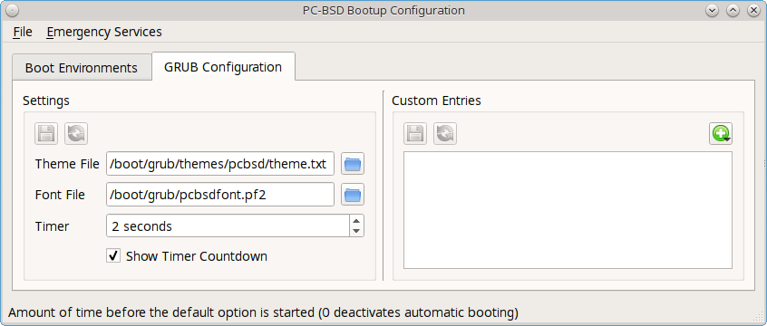

The fields in this screen are used to configure the:

* **Theme File:** used to customize the look of the GRUB menu. The theme file format is described in
  `this section of the GRUB Manual <http://www.gnu.org/software/grub/manual/html_node/Theme-file-format.html>`_. The
  `GRUB 2 Theme Reference <http://wiki.rosalab.ru/en/index.php/Grub2_theme_/_reference>`_ provides additional information.

* **Font File:** before a font can be used in the GRUB menu, it must first be converted to :file:`.pf2` format using the :command:`grub-mkfont(1)` command.

* **Timer:** sets the delay time for accessing the GRUB menu. By default it is 2 seconds, so if you find that the time to access the menu goes by too quickly,
  increase this timer.
  
* **Show Timer Countdown:** if this box is unchecked, the timer countdown will not display, though you can still interupt the boot process during the delay time.

* **Custom Entries:** if you have an existing GRUB configuration that you would like to add to the menu, cut and paste it into the box. Refer to the
  `GRUB Manual <http://www.gnu.org/software/grub/manual/grub.html>`_ for more information on creating a custom GRUB configuration.

If you make any changes in this tab, the two buttons below "Settings" or "Custom Entries" will be activated. Use them to save your changes or to re-load the
GRUB configuration. If you forget to do so, a pop-up message will remind you that you have unsaved changes when you exit Boot Manager. If you do not save the
changes using these buttons, the boot menu will remain the same.

.. note:: the "Emergency Services" menu can be used to "Rebuild GRUB Menu" or to "Restore GRUB Defaults". If you make any changes to
   :file:`/boot/loader.conf`, remember to use the "Rebuild GRUB Menu" so that GRUB is aware of the changes to this file.

.. index:: boot manager
.. _Managing Boot Environments from the Command Line:

Managing Boot Environments from the Command Line
------------------------------------------------

If you are running TrueOS® or prefer to use the command line, you can manage boot environments using the :command:`beadm` command as the superuser. For
example, this command creates a boot environment named *beforeupgrade*::

 beadm create beforeupgrade
 GRUB configuration updated successfully
 Created successfully

To view all boot environments, use the :command:`list` command::

 beadm list
 BE                                  Active Mountpoint  Space Created             Nickname
 default                             -      -            8.4G 2015-05-07 10:14    default
 10.1-RELEASE-p20-up-20150512_114505 NR     /           33.1G 2015-05-12 10:57    10.1-RELEASE-p20-up-20150512_114505
 beforeupgrade                       -      -            8.2M 2015-05-12 17:30    beforeupgrade

The possible flags in the "Active" field are as follows: 

* **R:** active on reboot 

* **N:** active now 

* **-:** inactive 

In this example, the current boot environment is called *10.1-RELEASE-p20-up-20150512_114505*, it is active now, will be used at next reboot, and it is mounted. The newly created
*beforeupgrade* boot environment exists, but is inactive and unmounted. To activate the new boot environment::

 beadm activate beforeupgrade
 GRUB configuration updated successfully
 Activated successfully

 beadm list
 BE                                  Active Mountpoint  Space Created             Nickname
 default                             -      -            8.4G 2015-05-07 10:14    default
 10.1-RELEASE-p20-up-20150512_114505 N      /           12.6M 2015-05-12 10:57    10.1-RELEASE-p20-up-20150512_114505
 beforeupgrade                       R      -           33.1G 2015-05-12 17:30    beforeupgrade

The flags now indicate that the system is currently booted into *10.1-RELEASE-p20-up-20150512_114505*, but at next boot the system will boot into *beforeupgrade*.

The boot menu configuration can be found in the ASCII text file :file:`/usr/local/etc/default/grub`::

 more /usr/local/etc/default/grub
 GRUB_THEME=/boot/grub/themes/pcbsd/theme.txt
 GRUB_FONT=/boot/grub/pcbsdfont.pf2
 GRUB_HIDDEN_TIMEOUT_QUIET=false
 GRUB_TIMEOUT=2
 
To modify the maximum number of boot environments, change the number of this variable in :file:`/usr/local/etc/pcbsd.conf`::

 MAXBE: 5
 
Note that valid values range from *1* to
*10*.

.. index:: configuration
.. _Hardware Compatibility:

Hardware Compatibility
======================

The PC-BSD® installer allows you to quickly determine if your system's video card, Ethernet card, wireless device, and sound card are compatible with
PC-BSD®. 

A "Hardware Compatibility" icon in Control Panel provides a quick overview of the system's detected hardware. To start the application, double-click its icon
in Control Panel or type :command:`pc-sysinstaller -checkhardware`.

In the example shown in :numref:`Figure %s: Sample Hardware Compatibility <hardware>`, this system has a detected NVIDIA video card with a configured resolution of 1600x900, one Ethernet
device using the `em(4) <http://www.freebsd.org/cgi/man.cgi?query=em&apropos=0&sektion=4>`_ driver, and one wireless device using the
`iwn(4) <http://www.freebsd.org/cgi/man.cgi?query=iwn&apropos=0&sektion=4>`_ driver. Currently no sound card is detected, meaning that the user should
configure and test their sound card using the instructions in :ref:`PC-BSD Mixer Tray`. 

Hardware that is currently incompatible may show with a green checkbox after a system upgrade or update. This indicates that the update added the driver for
the device.

.. _hardware:

.. figure:: images/hardware.png

.. index:: configuration
.. _Login Manager:

Login Manager
=============

A Login Manager utility is available in Control Panel. :numref:`Figure %s: Login Manager <login2>` shows the initial screen when you click on this icon in Control Panel or type
:command:`pc-su pc-dmconf` at the command line. Note that this utility will prompt you for your password.

.. _login2:

.. figure:: images/login2.png

For security reasons, PC-BSD® defaults to a login screen. This means that users are required to input their password before logging into the PC-BSD® system.
If you are the only user on the PC-BSD® computer, always use the same window manager, and do not consider it a security risk for the system to automatically
boot into that window manager, you can enable auto-login using the "Auto login" tab.

As seen in the example in :numref:`Figure %s: Login Manager <login2>`, the "Enable auto login" box is unchecked by default. If you check the box, the "Auto login user" drop-down menu will be
activated. Select the user account to automatically login as. If desired, the "Time Delay" can be changed to control how long the login manager will wait for
the user to cancel the automated login. Do not set this setting too low if there are times that you wish to login as a different user or to select a different
desktop. When finished, click "Apply" and you will be prompted to input the selected user's password.

.. note:: this change requires a reboot. Once the system is rebooted, a login screen will no longer appear unless the user interrupts the automatic boot or
   until this setting is changed again in Login Manager.

The "Remote login" tab, shown in :numref:`Figure %s: Configuring Remote Login <login3>`, is used to enable a remote user to connect to a desktop session using
:wikipedia:`Virtual Network Computing` (VNC). Check the "Enable Remote Desktop (VNC)" box to enable this service. When you click "Apply", you will
be prompted for your password as well as the remote login password to use for the VNC session. Reboot in order to activate the VNC service over port 5900. You will also
need to open TCP port 5900 using :ref:`Firewall Manager`. You can test the connection using the "vnc" option of KRDC (shown in :numref:`Figure %s: Creating a Connection Using KRDC <krdc1>`)
or from another VNC client.

.. _login3:

.. figure:: images/login3.png

.. warning:: use **extreme caution** when enabling this option as it makes your system available to anyone over the network. There is an additional risk when
   a user logs in over VNC as their password is sent in clear text. If you need someone to access your PC-BSD® system to assist with troubleshooting,
   consider using :ref:`Remote Desktop` instead, which allows you to send an invitation to connect. Always disable any type of remote login **immediately**
   after finishing your troubleshooting session. If you are instead using this option to login to your desktop from a remote location such as work or school,
   configure your network's firewall to only allow VNC connections from the specific IP address you will be using to make the connection.

The "Misc" tab is shown in :numref:`Figure %s: Miscellaneous Options <login4a>`.

.. _login4a:

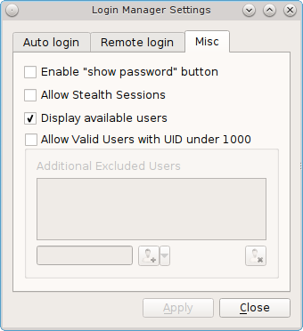

This screen provides the following options:

**Enable "show password" button:** by default, when a user types their password at the login prompt shown in :numref:`Figure %s: Optional Services <optional1a>`, "*" characters are displayed
as the password is typed in order to prevent another user from seeing the password as it is typed. When the  "Enable "show password" button" box is checked, and the user clicks the lock icon
next to the typed password in the login screen, the asterisks will change to reveal the password.

**Allow Stealth Sessions:** if this box is checked, a "Stealth Session" checkbox is added to the login menu, as seen in :numref:`Figure %s: Logging Into a Stealth Session <stealth>`.
When a user logs into a stealth session, meaning that they check the "Stealth Session" box in the login menu, a temporary, encrypted zvol is created, mounted, and used as a temporary
home directory. When the user logs out, the zvol is destroyed, along with the contents of that temporary home directory. This allows a user to temporarily use a PC-BSD® system without
leaving any data from their login session on the PC-BSD® system. This can be useful, for example, to allow a publicly accessible system to support multiple, transient users. It also
allows you to login and run applications as if on a fresh system each time. Should the system be rebooted before you logout of the stealth session, the one-time key is lost, rendering
the data useless. A stealth session is similar to a web browser's private mode, except for your entire desktop session.

.. warning:: if you log into a stealth session, do not save any data to your home directory as it will be destroyed at logout. If your intent is to safely interact with a
   PC-BSD® system while retaining the data in your home directory, use :ref:`PersonaCrypt` instead.

**Display available users:** by default, the list of available users is displayed in the login screen. To hide this list and force the user to input their username, uncheck
this box. For security reasons, the Login Manager will refuse logins from the *root* and *toor* accounts.

**Allow Valid Users with UID under 1000:** check this box if you have imported existing users with a UID under 1000, for example from a Solaris NIS server. Checking this box
will activate the "Additional Excluded Users" field. You can then use the "+" icon to add an existing user to the exclude list. To remove a user from the exclude list, highlight their
entry and click the "-" icon.

.. _stealth:

.. figure:: images/stealth.png

.. index:: configuration
.. _Service Manager:

Service Manager
===============

Service Manager, seen in :numref:`Figure %s: Managing Services Using Service Manager <service>`, provides a graphical utility for managing PC-BSD® services.

.. _service:

.. figure:: images/service.png

Buttons make it easy to start, stop, or restart services and to set the highlighted service to be enabled or disabled whenever the system boots. To access
this utility, go to PC-BSD® :menuselection:`Control Panel --> Service Manager` or type :command:`pc-su pc-servicemanager`. You will be prompted for your
password.

By default, services will be listed alphabetically. You can reorder the services by clicking on the "Service Name", "Running", or "Enabled" headers. Service
Manager is a graphical front-end to the rc scripts located in :file:`/etc/rc.d`.

If you do not know what a service does, do not change its settings in Service Manager. If you would like to learn more about a service, try seeing if there is
a man page for it. For example, type :command:`man apm` or :command:`man bootparamd`. If a man page does not exist, try seeing what man pages are associated
with that keyword. For example::

 apropos accounting
 ac(8) - connect time accounting
 acct(2) - enable or disable process accounting
 acct(5) - execution accounting file
 accton(8) - enable/disable system accounting
 ipfw(4) - IP packet filter and traffic accounting
 pac(8) - printer/plotter accounting information
 pam_lastlog(8) - login accounting PAM module
 sa(8) - print system accounting statistics

.. index:: configuration
.. _System Manager:

System Manager
==============

This section describes the various tasks that can be performed using the graphical System Manager utility. System Manager can be accessed from
:menuselection:`Control Panel --> System Manager` or by typing :command:`pc-su pc-sysmanager`. You will be prompted to input your password.

The "General" tab, shown in :numref:`Figure %s: General Tab of System Manager Utility <system1>`, displays the following system information: 

* the version numbers for the PC-BSD® base and its command-line and graphical utilities

* the version of the underlying FreeBSD base 

* the CPU type and speed 

* the amount of physical memory 

.. _system1:

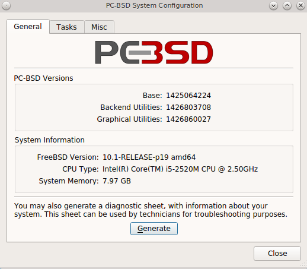

The "Generate" button can be used to create a report that includes the following items: 

* a listing of the installed components and their versions

* the output of the :command:`dmesg` command, which shows messages from the kernel 

* the last few lines of the :file:`/var/log/messages` log file 

* the output of the :command:`pciconf -lv` command, which lists all the devices that were found when the system booted 

* your X configuration file, which shows your display settings 

* your :file:`/etc/rc.conf` file, which shows your startup settings 

* your :file:`/boot/loader.conf` file, which shows which drivers are loaded at boot time 

* the output of the command :command:`df -m`, which shows your amount of free disk space 

* a listing from the :command:`top` command, which shows the currently running processes 

When you click the "Generate" button, you will be prompted to input the name and location of the text file that will be created. Since it is a text file, you
can view its contents in any text editor. When troubleshooting your system, this file is handy to include when you :ref:`Report a bug`.

During the installation of PC-BSD® you had an opportunity to install FreeBSD source and ports. If you did not and wish to do so after installation, use the
"Tasks" tab of System Manager, shown in :numref:`Figure %s: Tasks Tab of the System Manager Utility <system2>`.

.. _system2:

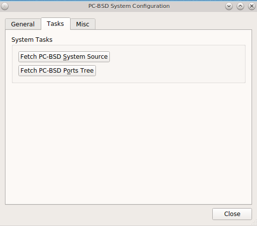

This tab provides a graphical interface for installing system source or the ports tree using :command:`git`.

If you click the "Fetch PC-BSD System Source" button, a pop-up menu will display the download process. The source will be saved to :file:`/usr/src/`. Once the
download is complete, a "Finished!" message will appear and you can click the "Close" button to exit this screen.

If you click the "Fetch PC-BSD Ports Tree" button, a message will indicate that ports are being fetched and will indicate when this is complete by adding a
"Finished!" message to the lower left corner of the message. Ports will be installed to :file:`/usr/ports/`.

The "Misc" tab of System Manager is seen in :numref:`Figure %s: Misc Tab of the System Manager Utility <system3>`.

.. _system3:

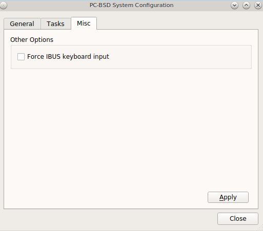

This tab contains a checkbox to "Force IBUS keyboard input". Check this box if you wish to to input Chinese, Japanese, Korean or Indic characters using a
Latin keyboard.

.. index:: configuration
.. _User Manager:

User Manager
============

The PC-BSD® User Manager utility allows you to easily add and delete users and groups, as well as change a user's or the administrative password. To access
this utility, go to :menuselection:`Control Panel --> User Manager` or type :command:`pc-su pc-usermanager`. You will need to input your password in order to
access this utility.

.. index:: users
.. _Managing User Accounts:

Managing User Accounts
----------------------

In the example shown in :numref:`Figure %s: Viewing User Accounts in User Manager <user1>`, the system has two user accounts. The *dru* account has the ability to become the superuser
as the "Can administrate system" checkbox is checked.

.. _user1:

.. figure:: images/user1.png

If you click the "Remove" button for a highlighted user, a pop-up menu will ask if you would like to also delete the user's home directory (along with all of
their files). If you click "No", the user will still be deleted but their home directory will remain. If you have only created one user account, the "Remove"
button will be greyed out as you need at least one user to be able to login to the PC-BSD® system.

.. note:: while a removed user will no longer be listed, the user account will not actually be deleted until you click the "Apply" button. A pop-up message
   will indicate that you have pending changes if you close User Manager without clicking "Apply". If you change your mind, click "No" and the user account
   will not be deleted; otherwise, click "Yes" and the user will be deleted and User Manager will close.

The password for any user can be changed by first highlighting the user name then clicking the "Change Password" button. You will not be prompted for the old
password in order to reset a user's password; this can be handy if a user has forgotten their password and can no longer log into the PC-BSD® system. If you
click the "Change Admin Password" button, you can change the root user's password.

If you click the "Advanced View" button, this screen will change to show all of the accounts on the system, not just the user accounts that you created. An
example is seen in :numref:`Figure %s: Viewing All Accounts and Their Details <user2>`. 

.. _user2:

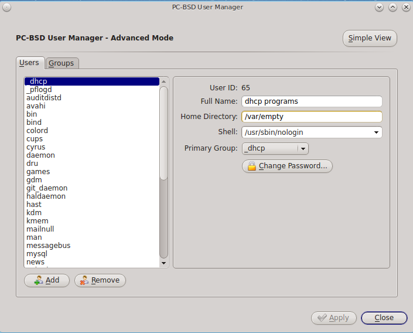

The accounts that you did not create are known as system accounts and are needed by the operating system or installed applications. Do **not** delete
any accounts that you did not create yourself as doing so may cause a previously working application to stop working. "Advanced View" provides additional
information associated with each account, such as the user ID number, full name (description), home directory, default shell, and primary group. System
accounts usually have a shell of *nologin* for security reasons, meaning that an attacker can not try to login to the system using that account name.

:numref:`Figure %s: Creating a New User Account <user3>` shows the add user account creation screen that opens when you click the "Add" button.

.. _user3:

.. figure:: images/user3.png

.. note:: if you click the "Add" button while in "Simple View", you will only be prompted to enter the username, full name, and password.

This screen is used to input the following information when adding a new user or system account: 

**Full Name:** this field provides a description of the account and can contain spaces. If it is a user account, use the person's first and last name. If it
is a system account, input a description to remind you which application uses the account.

**Username:** the name the user will use when they log in to the system; it is case sensitive and can not contain any spaces. If you are creating a system
account needed by an application, use the name provided by the application's installation instructions. If the name that you choose already exists as an
account, it will be highlighted in red and the utility will prompt you to use another name.

**Home Directory:** leave this field empty for a user account as the system will automatically create a ZFS dataset for the user's home directory under
:file:`/usr/home/username`. However, if you are creating a system account it is important to override this default by typing in :file:`/var/empty` or
:file:`/nonexistent` unless the application's installation instructions specify that the account needs a specific home directory.

**Shell:** this drop-down menu contains the shells that are available to users when they are at a command prompt. You can either keep the default or select a
shell which the user prefers.

**UID:** by default, the user will be assigned the next available User ID (UID). If you need to force a specific UID, you can set it here. Note that you
cannot set a UID lower than 1001 or specify a UID that is already in use by another user account.

**Primary Group:** if you leave the default button of "New Group" selected, a group will be created with the same name as the user. This is usually what you
want unless you are creating a system account and the installation instructions specify a different group name. Note that the drop-down menu for specifying a
group name will only show existing groups, but you can quickly create a group using the "Groups" tab.

**Password:** the password is case-sensitive and needs to be confirmed.

Once you have made your selections, press the "Save" button to create the account.

.. index:: users
.. _PersonaCrypt:

PersonaCrypt
------------

Beginning with 10.1.2, PC-BSD® provides support for PersonaCrypt. A PersonaCrypt device is a removable USB media, such as a USB stick, which has been formatted with ZFS
and encrypted with GELI. This device is used to hold a specific user's home directory, meaning that they can securely transport and access their personal files on any
PC-BSD® 10.1.2 or higher system. This can be used, for example, to securely access one's home directory from a laptop, home computer, and work computer. The device is
protected by an encryption key and a password which is, and should be, separate from the user's login password.

.. note:: when a user is configured to use a PersonaCrypt device, that user can not login using an unencrypted session on the same system. In other words, the PersonaCrypt username is
   reserved for PersonaCrypt use. If you need to login to both encrypted and unencrypted sessions on the same system, create two different user accounts, one for each type of session.

PersonaCrypt uses GELI's ability to split the key into two parts: one being your passphrase, and the other being a key stored on disk. Without both of these parts, the
media cannot be decrypted. This means that if somebody steals the key and manages to get your password, it is still worthless without the system it was paired with.

.. warning:: USB devices can and do eventually fail. Always backup any important files stored on the PersonaCrypt device to another device or system.

Advanced Mode can be used to initialize a PersonaCrypt device for any created user, **except** for the currently logged in user. In the example shown in
:numref:`Figure %s: Initialize PersonaCrypt Device <user5>`, a new user, named *dlavigne*, has been created and the entry for that user has been clicked.

.. _user5: 

.. figure:: images/user5.png

Before a user is configured to use PersonaCrypt on a PC-BSD® system, two buttons are available in the "PersonaCrypt" section of "Advanced Mode". Note that this section is hidden
if the currently logged in user is selected. Also, if you have just created a user and do not see these options, click "Apply" then re-highlight the user to display these options:

* **Import Key:** if the user has already created a PersonaCrypt device on another PC-BSD® system, click this button to import a previously saved copy of the key associated with
  the device. Once the key is imported, the user can now login to this computer using PersonaCrypt.

* **Initialize Device:** used to prepare the USB device that will be used as the user's home directory.

To prepare a PersonaCrypt device for this user, insert a USB stick and click "Initialize Device". A pop-up menu will indicate that the current contents of the device
will be wiped and that the device must be larger than the user's current home directory.

.. warning:: since the USB stick will hold the user's home directory and files, ensure that the stick is large enough to meet the anticipated storage needs of the home directory. Since
   the stick will be reformatted during the initialization process, make sure that any current data on the stick that you need has been copied elsewhere. Also, the faster the
   stick, the better the user experience while logged in.

Press "OK" in the pop-up menu. This will prompt you to input and confirm the password to associate with the device. Another message will ask if you are ready. Click "Yes" to
initialize the device. The User Manager screen will be greyed out while the device is prepared. Once the initialization is complete, the User Manager screen will change to
display the device's key options, as seen in :numref:`Figure %s: PersonaCrypt Key Options <user6>`.

.. _user6:

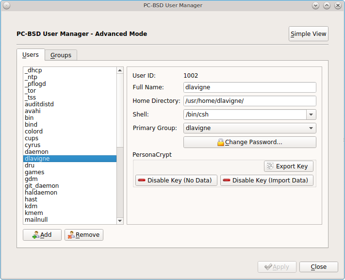

The following options are now available:

* **Export Key:** used to create a copy of the encryption key so that it can be imported for use on another PC-BSD® system.

* **Disable Key (No Data):** used to uninitialize the PersonaCrypt device on this system. Note that the device can still be used to login to other PC-BSD® systems.

* **Disable Key (Import Data):** in addition to uninitializing the PersonaCrypt device on this system, copy the contents of the user's home directory to this system.

Once a user has been initialized for PersonaCrypt on the system, their user account will no longer be displayed when :ref:`Logging In` **unless** their PersonaCrypt device is
inserted. Once the USB device is inserted, the login screen will add an extra field, as seen in the example shown in Figure 4.8b.

.. note:: if the "Allow Stealth Sessions" checkbox has been checked in :menuselection:`Control Panel --> Login Manager --> Misc`, PersonaCrypt users will still be displayed in the
   login menu, even if their USB device is not inserted. This is to allow those users the option to instead login using a stealth session. See :ref:`Login Manager` for more information
   about stealth sessions.

In the field with the yellow padlock icon, input the password for the user account. In the field with the grey USB stick icon, input the password associated with the
PersonaCrypt device.

.. warning:: To prevent data corruption and freezing the system **DO NOT** remove the PersonaCrypt device while logged in! Always log out of your session before physically
   removing the device.

.. index:: users
.. _Managing Groups:

Managing Groups
---------------

If you click the "Groups" tab, you can view all of the groups on the system, as seen in :numref:`Figure %s: Managing Groups Using User Manager <user4>`. 

.. _user4: 

.. figure:: images/user4.png

This screen has 3 columns: 

**Groups:** shows all of the groups on the system.

**Available:** shows all of the system and user accounts on the system in alphabetical order.

**Members:** indicates if the highlighted group contains any user accounts.

To add an account to a group, highlight the group name in the "Groups" column. Then, highlight the account name in the "Available" column. Click the right arrow
and the selected account will appear in the "Members" column. You should only add user accounts to groups that you create yourself or when an application's
installation instructions indicate that an account needs to be added to a group.

If you click the "Add" button, a pop-up menu will prompt you for the name of the new group. Once you press "OK", the group will be added to the "Groups"
column.

If you click the "Remove" button, the highlighted group will automatically be deleted after you press the "Apply" button, so be sure to do this with care.
Again, do **not** remove any groups that you did not create yourself or applications that used to work may stop working.

.. index:: configuration
.. _Disk Manager:

Disk Manager
============

The PC-BSD® Disk Manager can be used to manage ZFS pools and datasets as well as the disks attached to the system. To access this utility, use
:menuselection:`Control Panel --> Disk Manager` or type :command:`pc-su pc-zmanager` from within an xterm. You will need to input your password in order to
access this utility.

As seen in the example in :numref:`Figure %s: Viewing the System's ZFS Datasets <disk1>`, the utility will open in the "ZFS Filesystems" tab and will display the system's ZFS datasets
and their snapshots, the amount of space available to each dataset, and the amount of space each dataset is using.

.. _disk1:

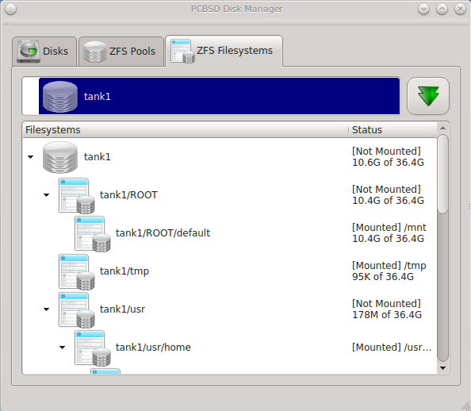

The name of the pool in this example is *tank1*. If the system has multiple pools, click the green arrow to select the desired pool.

If you right-click the pool name under "Filesystems", the following options are available: 

* **Mount:** whether or not the filesystem can be mounted depends upon the value of the "canmount" property of the dataset.

* **Create new dataset:** :numref:`Figure %s: Creating a New ZFS Dataset <disk2>` shows the options that are available when you create a new dataset.

* **Create a clone dataset:** creates a copy of the dataset.

* **Take a snapshot:** will prompt for the name of the snapshot. The field is pink to remind you to type the snapshot name in immediately after the pool name
  and *@* symbol. In this example, *tank1@* will be displayed in the name field. An example snapshot name could be *tan1k@snapshot1* or *tank1@201505181353* to
  denote the date and time the snapshot was created. The snapshot creation will be instantaneous and the new snapshot will be added to the list of datasets
  and will have a camera icon. Click the entry for the snapshot entry if you wish to rename it, clone it, destroy it, rollback the system to that point in
  time, or edit its properties. If you forget when you made the snapshot, pick "Edit properties" from the snapshot's right-click menu as it will show its
  "creation" property.

* **Edit properties:** allows you modify the ZFS properties for the pool, as seen in the example shown in Figure :numref:`Figure %s: Editing the Pool's ZFS Properties <disk3>`. The
  available options depend upon the property being modified. The options which are read-only will have a red minus sign icon next to them. ZFS options are described in
  :command:`man zfs` and  you should not change any options unless you are familiar with the ramifications of doing so.

.. _disk2:

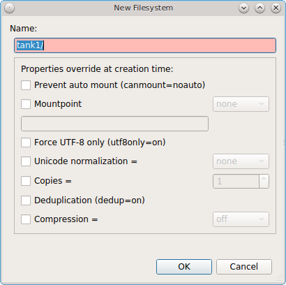

.. _disk3:

.. figure:: images/disk3.png

When creating a new dataset or clone, the following options are available. Again, these options are described in :command:`man zfs` and you should not change
any options unless you are familiar with the ramifications of doing so.

* **Name:** this field is pink as a reminder to type in the dataset name immediately after the trailing "/" of the displayed pool name.

* **Prevent auto mount:** if the box is checked, the dataset will not be mounted at boot time and must instead be manually mounted as needed.

* **Mountpoint:** choices are *none*, *legacy*, or *[path]*.

* **Force UTF-8 only:** if checked, you will not be able to save any filenames that are not in the UTF-8 character code set.

* **Unicode normalization:** if checked, indicate whether unicode normalization should occur when comparing filenames, and if so, which normalization
  algorithm to use. Choices are *none*, *formD*, or *formKCF*.

* **Copies:** if checked, indicates the number of copies (1 to 3) of data to store in the dataset. The copies are in addition to any redundancy and are stored
  on different disks when possible.

* **Deduplication:** enables deduplication.
  **Do not** enable this option if the system has less than the minimum recommended 5GB of RAM per TB of storage to be deduplicated.

* **Compression:** if checked and a compression algorithm is selected in the drop-down menu, data will automatically be compressed as it is written and
  uncompressed as it is read. The algorithm determines the amount and speed of compression, where typically increased compression results in decreased speed.
  The *lz4* algorithm is recommended as it provides very good compression at near real-time speed.

To view the status of the ZFS pools and the disk(s) in the pool, click the "ZFS Pools" tab. In the example, shown in
:numref:`Figure %s: Viewing the Status of the ZFS Pool <disk4>`, the ZFS pool named *tank1* was created from one disk. The state of "Online" indicates that the pool is healthy.

.. _disk4: 

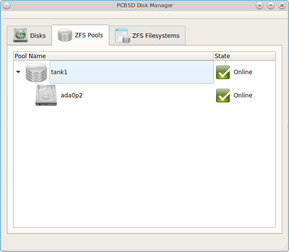

If you right-click the pool name, the following options are available: 

* **Create new pool:** use this option if additional disks are available and you would like to create another pool instead of adding them to the existing
  pool. This will open a screen that allows you to name the new pool, select which additional disks will go into it, and select how to configure the disks.

* **Rename pool:** will prompt you to input the new name for the pool.

* **Destroy pool:** **do not select this option unless your intent is to destroy all of the data on the disks!**

* **Add devices:** depending upon the type of disk configuration, you may be able to extend the size of the pool by adding an equal number of disks.

* **Add log devices:** used to add an SSD or disk as a secondary ZIL.

* **Add cache devices:** used to add an SSD or disk as an L2ARC.

* **Add spare devices:** at this time, FreeBSD does not support hot spares.

* **Scrub:** will start a ZFS scrub now. This option can be I/O intensive so it isn't recommended to do this while the system is in use.

* **Export pool:** this action should be performed if you will be physically moving the disks from one system to another.

* **Properties:** used to manage the default properties of the pool. Datasets inherit the default properties, unless a property is set to a different value on
  the dataset.

If you right-click a disk entry, such as *ada0p2* in this example, the following options are available: 

* **Attach (mirror) device:** if you wish to mirror additional disk(s), this option will open a screen which allows you to specify the disk(s) to add.

* **Take offline:** if you need to replace a bad disk, select this option before physically removing the disk.

An example of the "Disks" tab is seen in :numref:`Figure %s: Managing Disks <disk5>`.

.. _disk5:

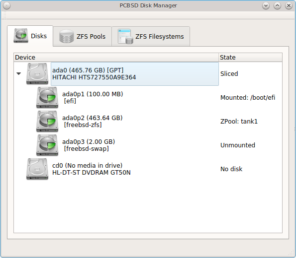

This screen shows the size of each disk as well as its partitioning scheme. If an unformatted disk or free disk space is available, right-click the device to
format it.

.. index:: configuration
.. _Display:

Display
=======

:menuselection:`Control Panel --> Display` can be used to configure the system to run the display wizard the next time the system boots. This allows you to
reconfigure your video driver and display settings.

.. note:: if you have an NVIDIA card, double-check that "pcbsd-meta-nvidia" is installed in :ref:`AppCafe®` and install it if it is not. To check for this
   driver, search for "nvidia" in the "App Search" tab of AppCafe®. 

If you click this icon in Control Panel, you will receive the message shown in :numref:`Figure %s: Display Wizard Will Run at Next Boot <display2>`. 

.. _display2:

.. figure:: images/display2.png

Select "Yes" which will prompt for your password. You should then save your work and reboot the system.

Alternately, you can use the boot menu to start the display wizard. As soon as the system starts to boot, press the left :kbd:`Shift` button to access the
GRUB boot menu. Unless you are dual booting or have configured boot environments, there will be one entry named "PC-BSD (default)" in the boot menu. Press
:kbd:`Enter` and select "Run the Display Wizard" from the menu.

Regardless of whether you started the Display Wizard from Control Panel or from the boot menu, it will finish booting the system and then prompt you to
confirm the resolution if it finds an optimal one. To configure a different resolution, click "No" to access the display wizard, shown in
:numref:`Figure %s:  Display Settings Wizard <display3>`. 

.. _display3: 

.. figure:: images/display3.png

This screen can be used to select the desired screen resolution, color depth, and video driver. If you select the "vesa" driver, it will always work but will
provide sub-optimal performance. Click on the drop-down menu to select the driver that most closely matches your video card name.

You can also use the drop-down menus to change the screen resolution and color depth values. If the value you desire is not listed, it may be that the
selected driver does not support that resolution or depth.

Advanced users can select their monitor's horizontal sync and vertical refresh rate in the "Advanced" tab, seen in :numref:`Figure %s: Advanced Tab of Display Settings <display4>`.

.. _display4:

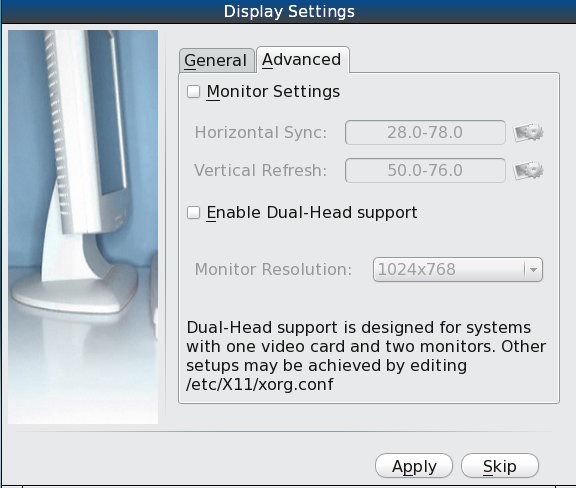

Use caution and refer to your monitor's documentation if you make any changes here. If you are not sure what you are doing, leave the default values as-is.

If your computer is connected to two monitors, check the box "Enable Dual-Head support". 

When you are finished, click the "Apply" button for your settings to be tested. If anything goes wrong during testing, you should be taken back to the
"Display Settings" screen so that you can try another setting. Once you are satisfied with the settings, click "Yes" when prompted to accept them.

.. index:: compositing
.. _Desktop Effects and Compositing:

Desktop Effects and Compositing 
--------------------------------

To prevent problems with video cards that do not support them, desktop effects (used by KDE) and display compositing (used by XFCE) are disabled by default.
You can change this default if your video card supports desktop effects.

To enable desktop effects while logged into KDE, click :menuselection:`Favorites --> System Settings --> Desktop Effects` to access the configuration screen shown in
:numref:`Figure %s: Enabling Desktop Effects in KDE <display5>`. Check the box "Enable desktop effects at startup". You can use the "All Effects" tab to get more information about each
possible effect and to enable the effects that interest you.

.. _display5:

.. figure:: images/display5.png

To enable display compositing while logged into XFCE, go to :menuselection:`Settings --> Window Manager Tweaks --> Compositor`. In the screen shown in
:numref:`Figure %s: Enabling Compositing in XFCE <display6>`, check the "Enable display compositing" box to enable the compositing options.

.. _display6: 

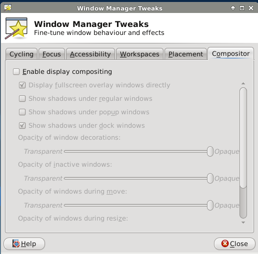

.. index:: troubleshooting
.. _Display Troubleshooting:

Display Troubleshooting 
-----------------------

If you are having problems with your display settings and would like to manually edit :file:`/etc/X11/xorg.conf` or run :command:`Xorg --config`, first tell
the PC-BSD® system to not automatically start X. To do so, add this temporary line to :file:`/etc/rc.conf`, then reboot the system::

 pcdm_enable="NO"

The system will reboot to a login prompt. After logging in, try the instructions in the
`FreeBSD Handbook <http://www.freebsd.org/doc/en_US.ISO8859-1/books/handbook/x-config.html>`_ to manually configure and test Xorg. Once you have a configuration that works
for you, save it to :file:`/etc/X11/xorg.conf`. Then, remove that temporary line from :file:`/etc/rc.conf` and start PCDM::

 service pcdm start

If your graphics white-out after a suspend or resume, try running this command as the superuser::

 sysctl hw.acpi.reset_video=1

If that fixes the problem, carefully add this line to :file:`/etc/sysctl.conf`::

 hw.acpi.reset_video=1

If the monitor goes blank and does not come back, try running this command as your regular user account::

 xset -dpms

If that fixes the problem, add that line to the :file:`.xprofile` file in your home directory.

.. index:: mount
.. _Mount Tray:

Mount Tray
==========

The Mount Tray graphical application is used to facilitate the mounting and unmounting of filesystems on internal disks, USB storage devices, and optical
media. It is included in the system tray, meaning that in can be used within any window manager that provides a system tray. If you remove the icon from the
system tray, you can re-add it using :menuselection:`Control Panel --> Mount Tray` or by typing :command:`pc-mounttray &`.

.. note:: if you prefer to mount devices from the command line, see the section on :ref:`pc-sysconfig`. 

In the example shown in :numref:`Figure %s: Mount Tray Example <mount1>`, a USB device and a music CD are currently inserted and the user has clicked "More Options" to view the
available options.

.. _mount1:

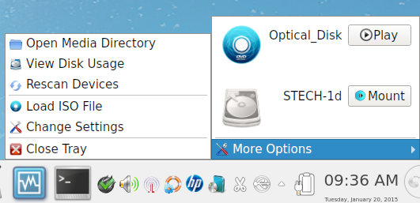

When you first insert a USB drive, a "New Device" message should appear in the system tray. If you click Mount Tray and the filesystem on the device is
recognized, it will automatically mount and the contents of the device will be displayed in the default file manager for the desktop. Alternately, right-click
Mount Tray and click the "Mount" button to mount the device and its contents. A list of available file managers can be found in
:ref:`Files and File Sharing` and Table 1.3a lists which filesystems are supported by Mount Tray. If the filesystem is not recognized, a
*?* will appear next to the device. When the device is mounted, its "Mount" button changes to "Eject". When you are finished using the device, press this
"Eject" button and wait for the message indicating that it is safe to remove the device before physically removing the device. Note that you will receive a
"Device Busy" message if the file manager is still open with the device's contents. If you receive this message, press "No" to close it, close the file
manager, then press "Eject" again. This will ensure that the device is cleanly unmounted.

.. note:: while Mount Tray will allow you to physically remove a USB device without unmounting it first, it is recommended to always "Eject" the drive first.

When you first insert an optical media, such as a music CD or DVD video, a message will indicate that an optical disk is available and, by default, the
`SMPlayer <http://smplayer.sourceforge.net/>`_ application will open so that you can play the contents of the disk. If you close the player, you can click
the "Play" button shown in :numref:`Figure %s: Mount Tray Example <mount1>` to restart it.

The following options are available in the "More Options" menu: 

* **Open Media Directory:** this will only appear if a filesystem has been mounted and can be used to open the default file manager if it does not automatically open.
  If the desktop does not provide a default file manager, Mount Tray will provide an "open with" dialogue so that you can select the utility to use to browse the
  contents of the USB device.

* **View Disk Usage:** in the example shown in :numref:`Figure %s: View Disk Usage Using Mount Tray <mount2>`, a UFS-formatted USB device is mounted at :file:`/Media/STECH-1d`. The
  amount of disk space used by the system hard drive and the USB drive is shown in both GB and as a percentage of available disk space. The Mount Tray will turn yellow if
  disk space is over 70% and red if disk space is over 90%. If the internal disk drives are partitioned with any other filesystems, these will also appear in Mount Tray.

* **Rescan Devices:** click this option if an entry for the USB device does not automatically appear.

* **Load ISO File:** used to mount an ISO to a memory disk. It will prompt for your password then open a browse menu so that you can browse to the location of
  the :file:`.iso` file. Once the file is selected and mounted, its contents will be displayed in the default file manager. When you are finished browsing the
  contents, close the file manager and click the "Eject" button for the memory device in Mount Tray and enter your password when prompted. As the ISO is
  unmounted, the memory disk is also detached from the system.

* **Change Settings:** as seen in :numref:`Figure %s: Configure Disk Space Check <mount3a>`, this screen allows you to configure whether or not optical disks automatically open using
  `SMPLayer <http://www.smplayer.eu/>`_, whether or not Mount Tray automatically rechecks the disk space used by mounted devices and how often to perform that check, and whether or not
  Mount Tray checks disk space when a disk is mounted.

* **Close Tray:** click this option to remove Mount Tray from the system tray.

.. _mount2:

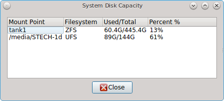

.. _mount3a:

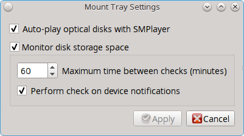

.. index:: mount
.. _pc-sysconfig:

pc-sysconfig
------------

The previous section described PC-BSD®'s graphical mount utility. This graphical utility has a command-line backend, :command:`pc-sysconfig`, which can be
used directly from the command line on TrueOS® systems, window managers without a system tray, or by users who prefer to use the command line.

For usage information, run the command without any options::

 pc-sysconfig
 pc-sysconfig: Simple system configuration utility
 Usage: "pc-sysconfig <command 1> <command 2> ..."
 Available Information Commands:
 "list-remdev": List all removable devices attached to the system.
 "list-mounteddev": List all removable devices that are currently mounted
 "list-audiodev": List all available audio devices
 "probe-netdrives": List all the available shared drives on the local network
 "list-mountednetdrives": List all the available shared drives which can currently be browsed (assuming the remote system is running properly)
 "supportedfilesystems": List all the filesystems that are currently detected/supported by pc-sysconfig
 "devinfo <device> [skiplabel]": Fetch device information (Filesystem, Label, Type)
 "devsize <device>": Fetch device space (must be mounted)
 "usingtormode": [TRUE/FALSE] Returns whether the system is routing all traffic through TOR
 "getscreenbrightness": Returns the brightness of the first controllable screen as a percentage (0-100) or "[ERROR]" otherwise
 "systemcansuspend": [TRUE/FALSE] Returns whether the system supports the S3 suspend state

 Available Action Commands:
  "mount <device> [<filesystem>] [<mountpoint>]":
   -- This will mount the removable device on the system (with user-accessible permissions if the mountpoint needs to be created)
   -- If there is no filesystem set (or "auto" is used), it will try to use the one that is auto-detected for the device
   -- If there is no mountpoint set, it will assign a new mountpoint within the "/media/" directory based on the device label
  "unmount <device or mountpoint> [force]":
   -- This will unmount the removable device from the system
   -- This may be forced by using the "force" flag as well (not recommended for all cases)
   -- If the input device is a memory disk (/dev/md*), then it will automatically remove the memory disk from the system as well
  "mountnet <IP of remote host> <Name of remote host>":
   -- This will setup the remote host to be browsable on the local system with the given name
   -- Note that the remote host is automatically mounted/unmounted based on local user activity
   -- To see where these network drives are mounted and can be browsed, see the output of "list-mountednetdrives"
  "unmountnet <IP of remote host>":
   -- This will remove the remote host from being browsable on the local system
  "load-iso <absolute path to the *.iso file>":
   -- This will load the ISO file as a memory disk on the system (making it available for mounting/browsing)
  "setdefaultaudiodevice <pcm device>":
   -- This will set the given pcm device (I.E. "pcm3") as the default audio output device
  "setscreenbrightness <percentage>":
   -- This will set the brightness of all the available screens to the given percentage
   -- It is also possible to adjust the current value by supplying a [+/-] before the number
   -- For example: using "+5" as the percentage will increase the brightness by 5% for each screen
   -- This returns "[ERROR]" or "[SUCCESS]" based on whether the change could be performed
  "suspendsystem": Puts the system into the suspended state (S3)

For example, to see a listed of the supported filesystems, use::

 pc-sysconfig supportedfilesystems
 FAT, NTFS, EXT, CD9660, UFS, REISERFS, XFS, UDF, ZFS

.. index:: keyboard
.. _PC-BSD Keyboard Settings:

PC-BSD Keyboard Settings
========================

The PC-BSD® control panel includes a graphical utility for managing the keyboard's layout settings. To start the application, double-click its
icon in Control Panel or type :command:`pc-syskeyboard` at the command line. A screenshot of this utility is seen in :numref:`Figure %s: Configuring Keyboard Settings <keyboard1>`. 

.. _keyboard1:

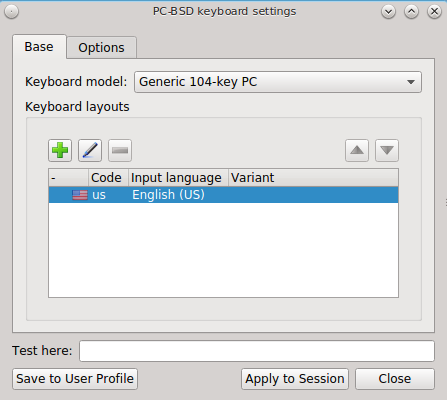

.. note:: any changes made using this utility can me saved as either for just this login session or permanently. To make the changes permanent, click the "Save to
   User Profile" button once you are finished making your changes. Otherwise, click the "Apply to Session" button. If you just click the "Close" button, your changes
   will not be saved.

Click the "Keyboard model" drop-down menu to select the type of keyboard. Note that the default model of "Generic 104-key PC" does **not** support special keys
such as multimedia or Windows keys. You will need to change this default to enable support for hot keys.

To add another keyboard layout, click the "+" button, which will open the screen shown in :numref:`Figure %s: Adding Another Layout <keyboard2>`. Highlight the desired layout. This will
activate the "Layout variant" drop-down menu where you can select to either use the "Typical" variant or a specific variant. Press "OK" to add the configured layout.

.. _keyboard2:

.. figure:: images/keyboard2.png

To edit an existing layout, highlight it then click the icon that looks like a pencil. You can then either change the "Layout variant" for that layout or
select a different layout entirely. Selecting a different layout will replace the current layout.

If there are multiple layout entries defined in the "Keyboard layouts" screen, you can delete a layout by highlighting it and clicking the "-" icon. Note
that this icon is greyed out when there is only one entry as at least one keyboard layout must be defined.

After creating or editing a layout, you can test it by typing some text into the "Test here" field.

To configure keyboard shortcuts, click the "Options" tab. As seen in :numref:`Figure %s: Configuring Layout Switch Keys <keyboard3>`, the default view is used to set the keyboard layout
switch keys.

.. _keyboard3:

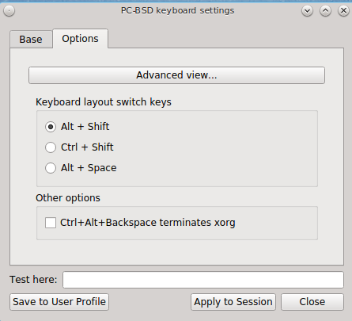

If you wish to set the keys for terminating the graphical session, check the box "Ctrl+Alt+Backspace terminates xorg". 

To configure many more keyboard shortcuts, click the "Advanced view" button which will open the screen shown in :numref:`Figure %s: Configuring Keyboard Shortcuts <keyboard4>`. In this
example, several categories have been expanded to show their options. To enable an option, check its box.

.. _keyboard4:

.. figure:: images/keyboard4.png

.. index:: sound
.. _PC-BSD Mixer Tray:

PC-BSD Mixer Tray
=================

PC-BSD® includes a graphical utility for managing the sound card's mixer settings. Desktops that include a system tray should have a speaker icon in the system tray
which can be used to access this utility. If this icon does not appear in the system tray, either double-click the "PC-BSD Mixer Tray" icon in Control Panel or
type :command:`pc-mixer &` to add it. Alternately, to open this application without adding it to the system tray, type :command:`pc-mixer -notray`.

:numref:`Figure %s: Mixer Icon <sound1>` shows an example of right-clicking the icon in the system tray on a system with multiple audio outputs. If the system only has one audio output,
the "Outputs" menu will not be displayed. To change the default output, click its entry in the "Output" menu.

.. _sound1:

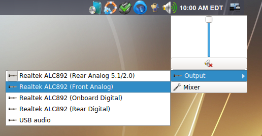

:numref:`Figure %s: Mixer Controls <sound2>` shows the mixer application which can be opened by either clicking the "Mixer" button shown in :numref:`Figure %s: Mixer Icon <sound1>` or by
typing :command:`pc-mixer -notray`.

.. _sound2:

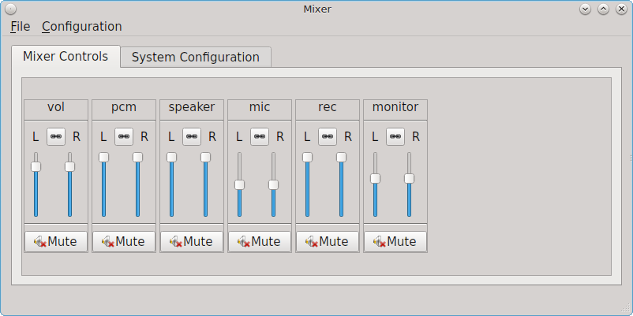

The "Mixer Controls" screen provides sliders to modify the left and right channels that control volume, pcm (the sound driver), the speaker, the microphone,
the recording level, and the sound provided by the monitor. Each control can be muted/unmuted individually by clicking its "Mute" or"Unmute" button, depending
upon its current mute state.

:numref:`Figure %s: System Sound Configuration <sound3>` shows the "System Configuration" tab.

.. _sound3:

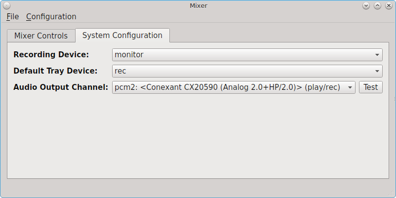

This tab contains the following options: 

* **Recording Device:** use the drop-down menu to select the device to use for recording sound.

* **Default Tray Device:** use the drop-down menu to set the default slider to display in the system tray.

* **Audio Output Channel:** use the drop-down menu to change the sound device and use the "Test" button to determine that sound is working. This is sometimes
  necessary when you change audio devices. For example, if you connect a USB headset, PC-BSD® will detect the new device and will automatically change the
  audio device to the USB input. However, if you insert a headset into an audio jack, the system may not detect the new input so you will have to manually
  change the default device.

The "File" menu can be used to quit this mixer screen or to close both this screen and remove the icon from the system tray.

The "Configuration" menu provides options for accessing the "PulseAudio Mixer" and "PulseAudio Settings" utilities as well as for restarting PulseAudio.
PC-BSD® provides full `PulseAudio <http://www.freedesktop.org/wiki/Software/PulseAudio/>`_ support and these utilities can be used to configure discoverable
network sound devices and mixer levels.

For command line only systems, type :command:`mixer` from the command line to see the current sound settings::

 mixer
 Mixer vol      is currently set to   0:0
 Mixer pcm      is currently set to 100:100
 Mixer speaker  is currently set to 100:100
 Mixer mic      is currently set to  50:50
 Mixer rec      is currently set to   1:1
 Mixer monitor  is currently set to  42:42
 Recording source: monitor

If any of these settings are set to *0*, set them to a higher value, by specifying the name of the mixer setting and a percentage value up to *100*::

 mixer vol 100
 Setting the mixer vol from 0:0 to 100:100.

You can make that change permanent by creating a file named :file:`.xprofile` in your home directory that contains the corrected mixer setting.

.. index:: troubleshooting
.. _Troubleshooting Sound:

Troubleshooting Sound 
----------------------

If you only get one or two mixer settings, you need to change the default mixer channel. As the superuser, try this command::

 sysctl -w hw.snd.default_unit=1

To see if that changed to the correct channel, type :command:`mixer` again. If you still only have one or two mixer settings, try setting the
:command:`sysctl` value to *2*, and if necessary, to *3*.

Once you have all of the mixer settings and none are set to *0*, your sound should work. If it still doesn't, these resources may help you to pinpoint the
problem: 

* `Sound Section of FreeBSD Handbook <http://www.freebsd.org/doc/en_US.ISO8859-1/books/handbook/sound-setup.html>`_

* `FreeBSD Sound Wiki <https://wiki.FreeBSD.org/Sound>`_

If you still have problems with sound, see the section on :ref:`Finding Help` to determine which help resources are available. When reporting your problem,
include your version of PC-BSD® and the name of your sound card.

.. index:: printing
.. _Printing:

Printing
========

Like many open source operating systems, PC-BSD® uses the Common Unix Printing System (`CUPS <http://cups.org/>`_) to manage printing. Control Panel provides
a graphical front-end for adding and managing printers.

While the graphical utility is easy to use, it may or may not automatically detect your printer depending upon how well your printer is supported by an open
source print driver. This section will walk you through a sample configuration for a HP Officejet 4500 printer. Your printer may "just work", allowing you to
breeze through the configuration screens. If your printer configuration does not work, read this section more closely for hints on how to locate the correct
driver for your printer.

.. index:: printing
.. _Researching Your Printer:

Researching your Printer 
-------------------------

Before configuring your printer, it is worth the time to see if a print driver exists for your particular model, and if so, which driver is recommended. If
you are planning to purchase a printer, this is definitely good information to know beforehand. You can look up the vendor and model of the printer in the
`Open Printing Database <http://www.openprinting.org/printers>`_ which will indicate if the model is supported and if there are any known caveats with the
print driver.

:numref:`Figure %s: Using Open Printing Database to Locate a Driver <print1>` shows a search for our example printer. There are two models in this series and this particular hardware
supports wireless.

.. _print1:

.. figure:: images/print1.png

Once the model is selected, click on the "Show this printer" button to see the results, as demonstrated in :numref:`Figure %s: Driver Recommendation from Open Printing Database <print2>`. 

.. _print2:

.. figure:: images/print2.png

For this model, the HPLIP driver is recommended. In PC-BSD®, the HPLIP driver is available as an optional system component called "pcbsd-meta-hplip". You can
see if the driver is installed, and install it if it is not, using :ref:`AppCafe®`.

.. index:: printing
.. _Adding a Printer:

Adding a Printer 
-----------------

Once you know that your printer is supported, make sure that the printer is plugged into your computer or, if the printer is a network printer, that both your
computer and the printer are connected to the network. Then, go to :menuselection:`Control Panel --> Printing` or type :command:`pc-su pc-cupscfg`. Input your
password to see a window similar to :numref:`Figure %s: Printer Configuration Utility <print4>`. 

.. _print4: 

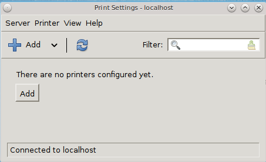

To add a new printer, click the "+Add" button. The printing utility will pause for a few seconds as as the wizard searches to see if any printers are
connected to your computer or network. When it is finished, you should see a screen similar to :numref:`Figure %s: Select a Print Device <print5>`. 

.. _print5: 

.. figure:: images/print5.png

In this example, the wizard has found this printer and highlighted the entry for the HP OfficeJet 4500. To also install the fax capability, instead select the
driver which includes "HP Fax". The wizard should find any supported printer that is attached to the computer or network and list it as the highlighted entry
in the "Devices" frame. Click "Forward" and the wizard will attempt to load the correct driver for the device. If it is successful, it will display the screen
shown in :numref:`Figure %s: Describe Printer Screen <print6>`. If it does not automatically find your printer, read the section on :ref:`Printer Troubleshooting`.

.. _print6:

.. figure:: images/print6.png

Since the configuration wizard found this printer, the "Describe Printer" screen automatically fills out the printer model series, a description, and the
hostname of your computer, if the printer is locally attached, or the hostname of the network printer. If you wish, you can change the printer's name or
description. Once you click the "Apply" button, the wizard will ask if you would like to print a test page. Ensure the printer has paper and click "Yes" to
print the test page. If you can not print a successful test page, see the :ref:`Printer Troubleshooting` section.

Once the printer is created, a screen will open where you can set the properties of the printer. Our sample printer's properties screen is shown in
:numref:`Figure %s: Viewing the Settings of the Newly Created Printer <print7>`.

.. _print7:

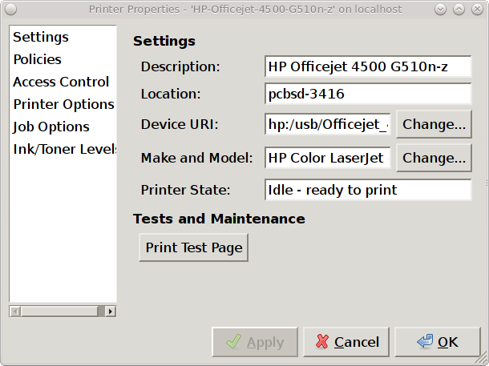

You may wish to take a few minutes to review the settings in the "Policies", "Access Control", "Printer Options", and "Job Options" tabs as these allow you to
configure options such as print banners, permissions, the default paper size, and double-sided printing. The available settings will vary, depending upon the
capabilities of the print driver.

.. index:: printing
.. _Manually Adding a Driver:

Manually Adding a Driver 
-------------------------

If the print configuration wizard fails, double-check that the printer is supported as described in :ref:`Researching your Printer` and that HPLIP is
installed if it is a HP printer. Also check that the printer is plugged in and powered on.

If the wizard is unable to even detect the device, try to manually add the print device. In the "Select Device" screen (:numref:`Figure %s: Select a Print Device <print5>`) you will need to
highlight and configure the type of connection to the printer: 

**USB:** this entry will only appear if a printer is plugged into a USB port and the number of entries will vary depending upon the number of USB ports on the
system. If there are multiple USB entries, highlight the one that represents the USB port your printer is plugged into.

**Enter URI:** this option allows you to manually type in the URI to the printer. A list of possible URIs is available on the
`cups site <http://www.cups.org/documentation.php/network.html>`_. 

**AppSocket/HP JetDirect:** select this option if you are connecting to an HP network printer. You will need to input the IP address of the printer in the
"Host" field. Only change the port number if the printer is using a port other than the default of 9100. 

**IPP:** select this option if you are connecting to a printer cabled to another computer (typically running a Microsoft operating system) that is sharing the
printer using IPP. You will need to input the IP address of the printer in the "Host" field and the name of the print queue. You can then click the "Verify"
button to ensure that you can connect to the print queue.

**LPD/LPR:** select this option if you are connecting to a printer which is cabled to a Unix computer that is using LPD to share the printer. You will need to
select the hostname and queue name from the drop-down menus.

Once you have input the information for the type of printer, press "Forward" for the wizard to continue.

If the wizard is able to find the printer but is unable to locate the correct driver for the printer, it will display the screen shown in
:numref:`Figure %s: Manually Select the Manufacturer <print8>` instead of the "Describe Printer" screen.

.. _print8:

.. figure:: images/print8.png

Select the manufacturer name and then click "Forward" to select the model, as seen in the example in :numref:`Figure %s: Manually Select the Driver <print9>`. 

.. _print9:

.. figure:: images/print9.png

Click "Forward" and the wizard should continue to the "Describe Printer" screen.

If the selected driver does not work, go back to the "Choose Driver" screen shown in :numref:`Figure %s: Manually Select the Manufacturer <print8>`. This screen provides two additional
options for installing the driver: 

1. **Provide PPD file:** a PostScript Printer Description (PPD) is a driver created by the manufacturer that ends in a :file:`.ppd` extension. Sometimes the
   file will end with a :file:`.ppd.gz` extension, indicating that it has been compressed with :command:`gzip`. If the driver you need was not automatically
   found, see if there is a PPD file on the driver CD that came with the printer or if one is available for download from the manufacturer's website. If you
   find a PPD, select this option and browse to the location of that file. Then, click "Forward" to continue with the printer configuration.

2. **Search for a printer driver to download:** if you know the name of the driver that you are looking for, try typing its name or number into the "Search"
   box. If found, it will display in the "Printer" model drop-down menu.

.. index:: printing
.. _Printer Troubleshooting:

Printer Troubleshooting
-----------------------

Here are some solutions to common printing problems: 

- **A test page prints but it is all garbled:** this typically means that you are using the wrong driver. If your specific model was not listed, click the
  "Change" button in the "Driver Details" section of the "Settings" tab of the printer and try choosing another driver model that is close to your model
  number. If trial and error does not fix the problem, see if there are any suggestions for your model in the
  `Open Printing database <http://www.openprinting.org/printers>`_. A web search for the word "freebsd" followed by the printer model name may also help you
  to find the correct driver to use.

- **Nothing happens when you try to print:** in this case, type :command:`tail -f /var/log/cups/error_log` in a console and then print a test page. The error
  messages should appear in the console. If the solution is not obvious from the error messages, try a web search for the error message. If you are still
  stuck, post the error, the model of your printer, and your version of PC-BSD® using the :ref:`Report a Bug` tool.

.. index:: scanner
.. _Scanner:

Scanner
=======

Control Panel provides an icon for accessing `XSane <http://www.xsane.org/>`_, a graphical utility for managing scanners.

To use your scanner, make sure the device is plugged into the PC-BSD® system and click the "Scanner" icon in Control Panel or type :command:`xsane` from the
command line. A pop-up message will indicate that XSane is detecting devices and will prompt you to accept the XSane license if a device is detected.
If a device is not detected, search for your device at the `list of supported scanners <http://www.sane-project.org/sane-backends.html>`_. 

.. note:: if the scanner is part of an HP All-in-One device, make sure that the "pcbsd-meta-hplip" package is installed. You can see if the driver is
   installed, and install it if it is not, using :ref:`AppCafe®`.

:numref:`Figure %s: XSane Interface <sane>` shows the XSane interface running on a PC-BSD® system attached to an HP OfficeJet.

.. _sane:

.. figure:: images/sane.png

The `XSane documentation <http://www.xsane.org/doc/sane-xsane-doc.html>`_ contains details on how to perform common tasks such as saving an image to a file,
photocopying an image, and creating a fax. It also describes all of the icons in the interface and how to use them.

By default, XSane uses the default browser when you click :kbd:`F1` to access its built-in documentation. How to configure the default browser varies by
window manager so you may need to do an Internet search if you need to set that configuration setting and can not find it.

.. index:: firewall
.. _Firewall Manager:

Firewall Manager
================

PC-BSD® uses the `IPFW firewall <http://www.freebsd.org/cgi/man.cgi?query=ipfw>`_ to protect your system. By default, the firewall is configured to allow all
outgoing connections, but to deny all incoming connection requests. The default rulebase is located in :file:`/etc/ipfw.rules`. Use the Firewall Manager GUI
utility to view and modify the existing firewall rules.

.. note:: typically it is not necessary to change the firewall rules. You should only add rules if you understand the security implications of doing so,
   as any custom rules will be used to allow connections to your computer.

To access the Firewall Manager, go to :menuselection:`Control Panel --> Firewall Manager` or type :command:`pc-su pc-fwmanager`. You will be prompted to input
your password. :numref:`Figure %s: Firewall Manager Utility <firewall1>` shows the initial screen when you launch this utility.

.. _firewall1:

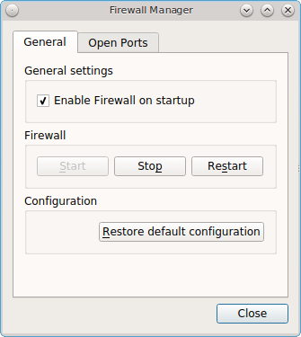

The "General" tab of this utility allows you to: 

* Determine whether or not the firewall starts when the system boots. Unless you have a reason to do so and understand the security implications, the
  "Enable Firewall on startup" box should be checked so that your system is protected by the firewall.

* "Start", "Stop", or "Restart" the firewall.

* The "Restore Default Configuration" button allows you to return to the original, working configuration.

To add or delete custom firewall rules, click the "Open Ports" tab to open the screen shown in :numref:`Figure %s: Adding a New Firewall Rule <firewall2>`. Note that your custom rules will
allow **incoming** connections on the specified protocol and port number.

.. _firewall2:

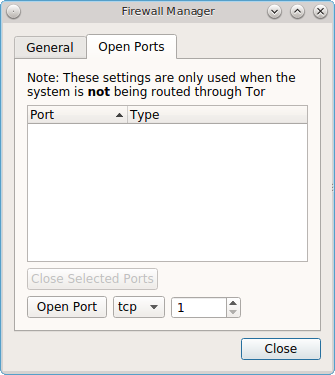

Any rules that you create will appear in this screen. To add a rule, input the port number to open. By default, "tcp" is selected. If the rule is for the
UDP protocol, click the "tcp" drop-down menu and select "udp". Once you have the protocol and port number selected, click the "Open Port" button to add the
new rule to your custom list.

If you have created any custom rules and wish to delete one, highlight the rule to delete and click the "Close Selected Ports" button to remove it from
the custom rules list.

.. note:: whenever you add or delete a custom rule, the rule will not be used until you click the "Restart" button shown in :numref:`Figure %s: Firewall Manager Utility <firewall1>`. Also,
   your custom rules are not used whenever the system is in :ref:`Tor Mode`.

Whenever you create a custom rule, test that your new rule works as expected. For example, if you create a rule to allow incoming SSH connections, try connecting
to your PC-BSD® system using :command:`ssh` to verify that the firewall is now allowing the connection.

.. index:: network
.. _Network Configuration:

Network Configuration
=====================

During installation, PC-BSD® configures your Ethernet interfaces to use DHCP and provides a screen to :ref:`Connect to a Wireless Network`. In most cases,
this means that your connected interfaces should "just work" whenever you use your PC-BSD® system.

For desktops that provide a system tray, a wireless configuration icon will appear if PC-BSD® detects a supported wireless card. If you hover over the wireless icon, shown in
:numref:`Figure %s: Wireless Information in System Tray <network1>`, it will indicate if the interface is associated and provide information regarding the IP address, IPv6 address, SSID,
connection strength, connection speed, MAC address, and type of wireless device.

.. _network1:

.. figure:: images/network1.png

If you right-click the wireless icon, you will see a list of detected wireless networks. Simply click the name of a network to associate with it. The
right-click menu also provides options to configure the wireless device, start the Network Manager, restart the network (useful if you need to renew your DHCP
address), and to close the Network Monitor so that the icon no longer shows in the system tray. If you have multiple wireless devices, each will have its own
icon in the system tray. If you do not use one of the devices, click its "Close the Network Monitor" to remove it from the tray.

To view or manually configure all of your network interfaces click :menuselection:`Control Panel --> Network Configuration` or type
:command:`pc-su pc-netmanager`. If a new device has been inserted (e.g. a USB wireless interface), a pop-up message will open when you start Network Configuration, indicate the name of the
new device, and ask if you would like to enable it. Click "Yes" and the new device will be displayed with the list of network interfaces that PC-BSD® recognizes. In the example seen in
:numref:`Figure %s: Network Configuration Utility <network2a>`, the system has one Intel Ethernet interface that uses the *em* driver and an Intel wireless interface that uses the
*wlan* driver.

.. _network2a:

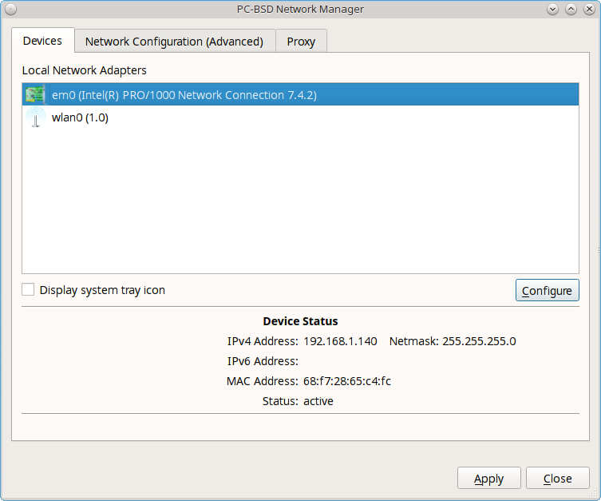

The rest of this section describes each tab of the Network Configuration utility and demonstrate how to view and configure the network settings for both
Ethernet and wireless devices. It will then present some common troubleshooting scenarios, known issues, and suggestions for when a device does not have a
built-in driver.

.. index:: network
.. _Ethernet Adapters:

Ethernet Adapters
-----------------

If you highlight an Ethernet interface in the "Devices" tab and either click the "Configure" button or double-click the interface name, you will see the
screen shown in :numref:`Figure %s: Network Settings for an Ethernet Interface <network3>`.

.. _network3:

.. figure:: images/network3.png

There are two ways to configure an Ethernet interface: 

1. **Use DHCP:** this method assumes that your Internet provider or network assigns your addressing information automatically using the DHCP protocol. Most
   networks are already setup to do this. This method is recommended as it should "just work". 

2. **Manually type in the IP addressing information:** this method requires you to understand the basics of TCP/IP addressing or to know which IP address you
   should be using on your network. If you do not know which IP address or subnet mask to use, you will have to ask your Internet provider or network
   administrator.

By default, PC-BSD® will attempt to obtain an address from a DHCP server. If you wish to manually type in your IP address, check the box "Assign static IP
address". Type in the IP address, using the right arrow key or the mouse to move between octets. Then, double-check that the subnet mask ("Netmask") is the
correct value and change it if it is not.

If the Ethernet network uses 802.1x authentication, check the box "Enable WPA authentication" which will enable the "Configure WPA" button. Click this button
to select the network and to input the authentication values required by the network.

By default, the "Disable this network device" box is unchecked. If you check this checkbox, PC-BSD® will immediately stop the interface from using the
network. The interface will remain inactive until this checkbox is unchecked.

The "Advanced" tab, seen in :numref:`Figure %s: Advanced Tab of an Ethernet Interface's Network Settings <network4>`, allows advanced users to change their
:wikipedia:`MAC address` or to automatically obtain an :wikipedia:`IPv6 address`. Both boxes should remain checked unless
you are an advanced user who has a reason to change the default MAC or IPv6 address and you understand how to input an appropriate replacement address.

.. _network4:

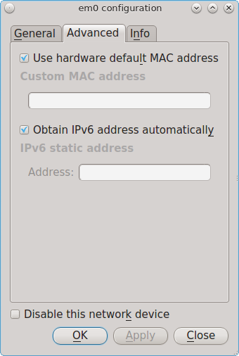

The "Info" tab, seen in :numref:`Figure %s: Info Tab of an Ethernet Interface's Network Settings <network5>`, will display the current network address settings and some traffic statistics.

.. _network5:

.. figure:: images/network5.png

If you make any changes within any of the tabs, click the "Apply" button to activate them. Click the "OK" button when you are finished to go back to the main
Network Configuration window.

You can repeat this procedure for each network interface that you wish to view or configure.

.. index:: network
.. _Wireless Adapters:

Wireless Adapters
-----------------

If your wireless interface does not automatically associate with a wireless network, you probably need to configure a wireless profile that contains the security settings required by the
wireless network. Double-click the wireless icon in the system tray or highlight the wireless interface displayed in the "Devices" tab of Network Configuration and click the "Configure"
button. :numref:`Figure %s: Wireless Configuration Window of Network Configuration Utility <network6>` demonstrates that this system's wireless interface is currently
associated with the wireless network listed in the "Configured Network Profiles" section.

.. _network6: 

.. figure:: images/network6.png

To associate with a wireless network, click the "Scan" button to receive the list of possible wireless networks to connect to. Highlight the network you wish
to associate with and click the "Add Selected" button. If the network requires authentication, a pop-up window will prompt you for the authentication details.
Input the values required by the network then click the "Close" button. PC-BSD® will add an entry for the network in the "Configured Network Profiles"
section.

If the network is hidden, click the "Add Hidden" button, input the name of the network in the pop-up window, and click "OK".

If you add multiple networks, use the arrow keys to place them in the desired connection order. PC-BSD® will try to connect to the first profile in the list
and will move down the list in order if it is unable to connect. When finished, click the "Apply" button. A pop-up message will indicate that PC-BSD® is
restarting the network. If all went well, there should be an IP address and status of "associated" when you hover over the wireless icon in the system tray.
If this is not the case, double-check for typos in your configuration values and read the section on :ref:`Troubleshooting Network Settings`. 

PC-BSD® supports the types of authentication shown in :numref:`Figure %s: Configuring Wireless Authentication Settings <network7>`. You can access this screen (and change your authentication
settings) by highlighting an entry in the "Configured Network Profiles" section and clicking the "Edit" button.

.. _network7: 

.. figure:: images/network7.png

This screen allows you to configure the following types of wireless security: 

* **Disabled:** if the network is open, no additional configuration is required.

* **WEP:** this type of network can be configured to use either a hex or a plaintext key and Network Manager will automatically select the type of key that it has detected.
  If you click "WEP" then the "Configure" button, you will see the screen shown in :numref:`Figure %s: WEP Security Settings <network8>`. Type the key into both network key boxes. If the key
  is complex, check the "Show Key" box to make sure that the passwords are correct and that they match. Uncheck this box when you are finished to replace the characters in the key with the
  "*" symbol. A wireless access point that uses WEP can store up to 4 keys and the number in the key index indicates which key you wish to use.

* **WPA Personal:** this type of network uses a plaintext key. If you click "WPA Personal" then the "Configure" button, you will see the screen shown in
  :numref:`Figure %s: WPA Personal Security Settings <network9>`. Type in the key twice to verify it. If the key is complex, you can check the "Show Key" box to make sure the passwords match.

* **WPA Enterprise:** if you click "WPA Enterprise" then the "Configure" button, you will see the screen shown in :numref:`Figure %s: WPA Enterprise Security Settings <network10>`. Select
  the authentication method ("EAP-TLS", "EAP-TTLS", or "EAP-PEAP"), input the EAP identity, browse for the CA certificate, client certificate and private key file, and input and
  verify the password.

.. note:: if you are unsure which type of encryption is being used, ask the person who setup the wireless router. They should also be able to give you the
   value of any of the settings seen in these configuration screens.

.. _network8: 

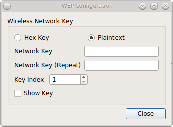

.. _network9: 

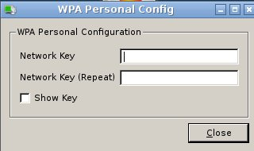

.. _network10:

.. figure:: images/network10.png

If you wish to disable this wireless interface, check the box "Disable this wireless device". This setting can be desirable if you want to temporarily prevent
the wireless interface from connecting to untrusted wireless networks.

The "Advanced" tab, seen in :numref:`Figure %s: Advanced Tab of a Wireless Interface <network11>`, allows you to configure the following: 

* a custom MAC address. This setting is for advanced users and requires the "Use hardware default MAC address" box to be unchecked.

* how the interface receives its IP address information. If the network contains a DHCP server, check the box "Obtain IP automatically (DHCP)". Otherwise,
  input the IP address and subnet mask to use on the network.

* the country code. This setting is not required if you are in North America. For other countries, check the "Set Country Code" box and select your country
  from the drop-down menu.

.. _network11:

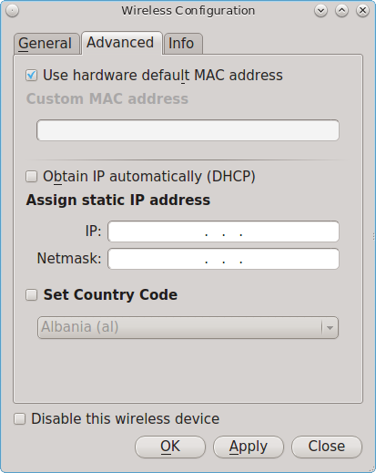

The "Info" tab, seen in :numref:`Figure %s: Info Tab of a Wireless Interface <network12>`, shows the current network status and statistics for the wireless interface.

.. _network12:

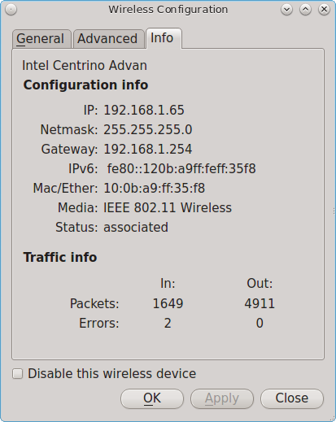

.. index:: network
.. _Network Configuration (Advanced):

Network Configuration (Advanced)
--------------------------------

The "Network Configuration (Advanced)" tab of the Network Configuration utility is seen in
:numref:`Figure %s: Network Configuration (Advanced) tab of the Network Configuration Utility <network13a>`. The displayed information is for the currently
highlighted interface. If you wish to edit these settings, make sure that the interface that you wish to configure is highlighted in the "Devices" tab.

.. _network13a: 

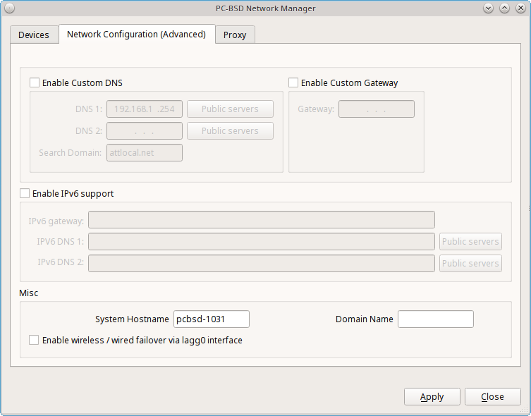

If the interface receives its IP address information from a DHCP server, this screen allows you to view the received DNS information. If you wish to override
the default DNS settings or set them manually, check the "Enable Custom DNS" box. You can then set the following: 

**DNS 1:** the IP address of the primary DNS server. If you do not know which IP address to use, click the "Public servers" button to select a public DNS
server.

**DNS 2:** the IP address of the secondary DNS server.

**Search Domain:** the name of the domain served by the DNS server.

If you wish to change or set the default gateway, check the "Enable Custom Gateway" box and input the IP address of the default gateway.

The following settings can be modified in the IPv6 section: 

**Enable IPv6 support:** if this box is checked, the specified interface can participate in IPv6 networks.

**IPv6 gateway:** the IPv6 address of the default gateway used on the IPv6 network.

**IPv6 DNS 1:** the IPv6 address of the primary DNS server used on the IPv6 network. If you do not know which IP address to use, click the "Public servers"
button to select a public DNS server.

**IPv6 DNS 2:** the IPv6 address of the secondary DNS server used on the IPv6 network.

The "Misc" section allows you to configure these options: 

**System Hostname:** the name of your computer. It must be unique on your network.

**Enable wireless/wired failover via lagg0 interface:** the  interface allows you to seamlessly switch between using an Ethernet interface and a wireless
interface. If you want this functionality, check this box.

.. note:: some users experience problems using lagg. If you have problems connecting to a network using an interface that previously worked, uncheck this box
   and remove any references to "lagg" in your :file:`/etc/rc.conf` file.

**Domain Name:** if the system is in a domain, you can specify it here.

If you make any changes within this window, click the "Apply" button to apply them.

.. index:: network
.. _Proxy Settings:

Proxy Settings 
---------------

The "Proxy" tab, shown in :numref:`Figure %s: Proxy Settings Configuration <network14>`, is used when your network requires you to go through a proxy server in order to access the Internet.

.. _network14: 

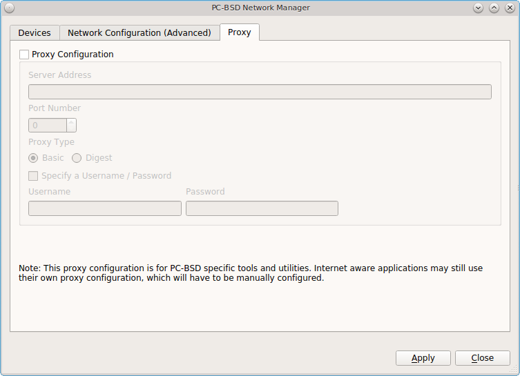

Check the "Proxy Configuration" check box to activate the settings. The follow settings can be configured in this screen: 

**Server Address:** enter the IP address or hostname of the proxy server.

**Port Number:** enter the port number used to connect to the proxy server.

**Proxy Type:** choices are "Basic" (sends the username and password unencrypted to the server) and "Digest" (never transfers the actual password across the
network, but instead uses it to encrypt a value sent from the server). Do not select "Digest" unless you know that the proxy server supports it.

**Specify a Username/Password:** check this box and input the username and password if they are required to connect to the proxy server.

Proxy settings are saved to the :file:`/etc/profile` and :file:`/etc/csh.cshrc` files so that they are available to the PC-BSD® utilities as well as any
application that uses :command:`fetch`.

Applications that did not come with the operating system, such as web browsers, may require you to configure proxy support using that application's
configuration utility.

If you apply any changes to this tab, a pop-up message will warn that you may have to logout and back in in order for the proxy settings to take effect.

.. index:: network
.. _Configuring a Wireless Access Point:

Configuring a Wireless Access Point
-----------------------------------

If you click the entry for a wireless device, as seen in :numref:`Figure %s: Setup Access Point Option <network15>`, the right-click menu has an option to "Setup Access Point". 

.. _network15:

.. figure:: images/network15.png

:numref:`Figure %s: Access Point Basic Setup <network16>` shows the configuration screen if you select "Setup Access Point". 

.. _network16:

.. figure:: images/network16.png

This screen contains two options: 

- **Visible Name:** this is the name that will appear when users scan for available access points.

- **Set Password:** setting a WPA password is optional, though recommended if you only want authorized devices to use the access point. If used, the password
  must be a minimum of 8 characters.

:numref:`Figure %s: Access Point Advanced Setup <network17>` shows the "Advanced Configuration (optional)" screen.

.. _network17:

.. figure:: images/network17.png

The settings in this screen are optional and allow you to fine-tune the access point's configuration: 

- **Base IP:** the IP address of the access point.

- **Netmask:** the associated subnet mask for the access point.

- **Mode:** available modes are *11g* (for 802.11g), *11ng* (for 802.11n on the 2.4-GHz band), or *11n* (for 802.11n).

- **Channel:** select the channel to use.

- **Country Code:** the two letter country code of operation.

.. index:: network
.. _Troubleshooting Network Settings:

Troubleshooting Network Settings 
---------------------------------

While Ethernet networking usually "just works" on a PC-BSD® system, users sometimes encounter problems, especially when connecting to wireless networks.
Sometimes the problem is due to a configuration error; sometimes a driver is buggy or is not yet available. This section is meant to help you pinpoint the
problem so that you can either fix it yourself or give the developers the information they need to fix or create the driver.

When troubleshooting your network configuration, use the following files and commands.

The :file:`/etc/rc.conf` file is read when the system boots up. In order for the system to configure an interface at boot time, an entry must exist for it in
this file. Entries are automatically created for you during installation for each interface that is active. An entry will be added (if it does not exist) or
modified (if it already exists) when you configure an interface using the Network Configuration utility.

Here is an example of the :file:`rc.conf` entries for an ethernet driver (*em0*) and a wireless driver (*run0*)::

 ifconfig_em0="DHCP"
 wlans_run0="wlan0"
 ifconfig_wlan0="WPA SYNCDHCP"

When reading through your own file, look for lines that begin with *ifconfig*. For a wireless interface, also look for lines containing *wlans*.

.. note:: unlike Linux interface driver names, FreeBSD/PC-BSD® interface driver names indicate the type of chipset. Each driver name has an associated man
   page where you can learn which devices use that chipset and if there are any configuration options or limitations for the driver. When reading the man
   page, do not include the interface number. For the above example, you could read :command:`man em` and :command:`man run`.

The :file:`/etc/wpa_supplicant.conf` file is used by wireless interfaces and contains the information needed to connect to a WPA network. If this file does
not already exist, it is created for you when you enter the "Configuration" screen of a wireless interface.

The :command:`ifconfig` command shows the current state of your interfaces. When reading through its output, check that your interface is listed, has a status
of "active", and has an IP address. Here is a sample :command:`ifconfig` output showing the entries for the *re0* Ethernet interface and the *run0* wireless
interface::

 re0: flags=8843<UP,BROADCAST,RUNNING,SIMPLEX,MULTICAST> metric 0 mtu 1500 options=389b<RXCSUM,TXCSUM,VLAN_MTU,VLAN_HWTAGGING,VLAN_HWCSUM,WOL_UCAST,WOL_MCAST,WOL_MAGIC>
 ether 60:eb:69:0b:dd:4d
 inet 192.168.1.3 netmask 0xffffff00 broadcast 192.168.1.255
 media: Ethernet autoselect (100baseTX <full-duplex>)
 status: active

 run0: flags=8843<UP,BROADCAST,RUNNING,SIMPLEX,MULTICAST> metric 0 mtu 2290
 ether 00:25:9c:9f:a2:30
 media: IEEE 802.11 Wireless Ethernet autoselect mode 11g
 status: associated

 wlan0: flags=8843<UP,BROADCAST,RUNNING,SIMPLEX,MULTICAST> metric 0 mtu 1500
 ether 00:25:9c:9f:a2:30
 media: IEEE 802.11 Wireless Ethernet autoselect (autoselect)
 status: no carrier
 ssid "" channel 10 (2457 MHz 11g)
 country US authmode WPA1+WPA2/802.11i privacy ON deftxkey UNDEF
 txpower 0 bmiss 7 scanvalid 60 protmode CTS wme roaming MANUAL bintval 0

In this example, the ethernet interface (*re0*) is active and has an IP address. However, the wireless interface (*run0*, which is associated with *wlan0*)
has a status of "no carrier" and does not have an IP address. In other words, it has not yet successfully connected to the wireless network.

The :command:`dmesg` command lists the hardware that was probed during boot time and will indicate if the associated driver was loaded. If you wish to search
the output of this command for specific information, pipe it to :command:`grep` as seen in the following examples::

 dmesg | grep Ethernet
 re0: <RealTek 8168/8111 B/C/CP/D/DP/E PCIe Gigabit Ethernet> port 0xc000-0xc0ff mem 0xd0204000-0xd0204fff,0xd0200000-0xd0203fff irq 17 at device 0.0 on pci8
 re0: Ethernet address: 60:eb:69:0b:dd:4d

 dmesg |grep re0
 re0: <RealTek 8168/8111 B/C/CP/D/DP/E PCIe Gigabit Ethernet> port 0xc000-0xc0ff mem 0xd0204000-0xd0204fff,0xd0200000-0xd0203fff irq 17 at device 0.0 on pci8
 re0: Using 1 MSI messages
 re0: Chip rev. 0x28000000
 re0: MAC rev. 0x00000000 miibus0: <MII bus> on re0
 re0: Ethernet address: 60:eb:69:0b:dd:4d
 re0: [FILTER]
 re0: link state changed to DOWN
 re0: link state changed to UP

 dmesg | grep run0
 run0: <1.0> on usbus3
 run0: MAC/BBP RT3070 (rev 0x0201), RF RT2020 (MIMO 1T1R), address 00:25:9c:9f:a2:30
 run0: firmware RT2870 loaded

If your interface does not show up in :command:`ifconfig` or :command:`dmesg`, it is possible that a driver for this card is not provided with the operating
system. If the interface is built into the motherboard of the computer, you can use the :command:`pciconf` command to find out the type of card::

 pciconf -lv | grep Ethernet
 device = 'Gigabit Ethernet NIC(NDIS 6.0) (RTL8168/8111/8111c)'

 pciconf -lv | grep wireless
 device = 'Realtek RTL8191SE wireless LAN 802.11N PCI-E NIC (RTL8191SE?)'

In this example, there is a built-in Ethernet device that uses a driver that supports the RTL8168/8111/8111c chipsets. As we saw earlier, that driver is
*re0*. The built-in wireless device was also found but the *?* indicates that a driver for the RTL8191SE chipset was not found. A web search for "FreeBSD
RTL8191SE" will give an indication of whether a driver exists (perhaps in a version of FreeBSD that has not been released yet) or if a driver is being
developed.

The FreeBSD Handbook chapter on `Wireless Networking <http://www.freebsd.org/doc/en_US.ISO8859-1/books/handbook/network-wireless.html>`_ provides a good overview of how
wireless works and offers some troubleshooting suggestions.

.. index:: backup
.. _Life Preserver:

Life Preserver
==============

The built-in Life Preserver utility was designed to take full advantage of the functionality provided by ZFS snapshots. This utility allows you to schedule snapshots of a
local ZFS pool and to optionally replicate those snapshots to another system over an encrypted connection. This design provides several benefits: 

* A snapshot provides a "point-in-time" image of the ZFS pool. In one way, this is similar to a full system backup as the snapshot contains the information
  for the entire filesystem. However, it has several advantages over a full backup. Snapshots occur instantaneously, meaning that the filesystem does not need
  to be unmounted and you can continue to use applications on your system as the snapshot is created. Since snapshots contain the meta-data ZFS uses to access
  files, the snapshots themselves are small and subsequent snapshots only contain the changes that occurred since the last snapshot was taken. This space
  efficiency means that you can take snapshots often. Snapshots also provide a convenient way to access previous versions of files as you can simply browse to
  the point-in-time for the version of the file that you need. Life Preserver makes it easy to configure when snapshots are taken and provides a built-in
  graphical browser for finding and restoring the files within a snapshot.

* Replication is an efficient way to keep the files on two systems in sync. In the case of Life Preserver, the snapshots taken on the PC-BSD® system will be
  synchronized with their versions stored on the backup server.

* Snapshots are sent to the backup server oven an encrypted connection and can optionally be stored in an encrypted format, which protects the contents of the snapshots.

* Having a copy of the snapshots on another system makes it possible to perform an operating system restore should the PC-BSD® system become unusable or to deploy an identical system
  to different hardware.

.. index:: backup
.. _Scheduling a Backup:

Scheduling a Backup
-------------------

An icon to the Life Preserver utility, seen in :numref:`Figure %s: Life Preserver Icon in System Tray <lpreserver1>`, can be found in the system tray.

.. _lpreserver1: 

.. figure:: images/lpreserver1.png

If you right-click this icon, the following options are available:

* **Open Life Preserver:** starts Life Preserver, which will prompt for your password. The first time this utility is run, it will display the screen shown in
  :numref:`Figure %s: Initial Life Preserver Screen <lpreserver2>`.

.. _lpreserver2:

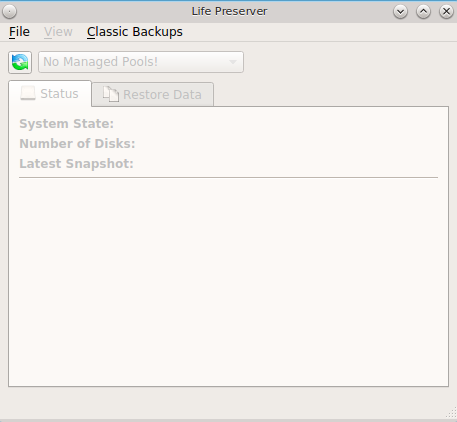

* **View Messages:** opens a pop-up menu to display information messages and the Life Preserver log file. There won't be any messages until after Life Preserver is
  configured and starts to create backups. If a configured Life Preserver task fails, such as replication, check the "Log Files" tab.

* **Popup Settings:** configures Life Preserver to display its notifications over the Life Preserver icon. Choices are "Show all", which includes
  notifications for when a backup/replication starts or finishes, "Warnings only", which only displays warning and error messages, and "None" which disables
  pop-up notification. The default setting is "Warnings only". This setting does not affect critical messages which will always open a window that requires
  attention.

* **Refresh Tray:** by default, Life Preserver checks the status of the pool and available disk space every 5 minutes. Click this option to check the current
  status of a scrub or to check the current disk space after removing a snapshot.

* **Close Tray:** will remove the icon from the system tray. To re-add it to the tray, go to :menuselection:`Control Panel --> Life Preserver` or type
  :command:`life-preserver-tray &` at the command line. If your desktop manager does not provide a system tray, you will need to instead refer to the section
  :ref:`Using the lpreserver CLI`. 

The status of this icon changes when a snapshot, scrub, or replication task is occurring. If you hover over the icon during this time, a tooltip will describe
the current status of the running task.

To create a backup schedule, click :menuselection:`File --> Manage Pool` and select the name of the pool to manage. The following examples are for a pool
named *tank*. This will launch the the "New Life Preserver Wizard", allowing you to configure the backup schedule. Click "Next" to see the screen in
:numref:`Figure %s: Snapshot Schedule Screen <lpreserver3>`. 

.. _lpreserver3:

.. figure:: images/lpreserver3.png

This screen is used to schedule how often a snapshot is taken of the system. The default of "Automatic" creates a snapshot every 5 minutes, which are kept for
an hour, then the hourly is kept for 24 hours, the daily is kept for a month, and the monthly is kept for a year. You can change this default to take one
daily snapshot at a specified time or to take a snapshot once every hour, 30 minutes, 10 minutes or 5 minutes.

If you change the default of "Automatic", the next screen, shown in :numref:`Figure %s: Snapshot Pruning Screen <lpreserver4>`, is used to configure how long to keep the snapshots.

.. _lpreserver4:

.. figure:: images/lpreserver4.png

Snapshots can be configured to be pruned after the specified number of days or after the specified number of snapshots. This screen will not appear for
"Automatic" as it has its own pruning schedule, as explained in the previous paragraph.

.. note:: auto-pruning only occurs on the snapshots generated by Life Preserver according to the configured schedule. Auto-pruning will not delete any
   snapshots you create manually using the "Snapshots" tab in Life Preserver.

After making your selection, press "Next" to see the screen shown in :numref:`Figure %s: Scrub Schedule Screen <lpreserver19a>`.

.. _lpreserver19a:

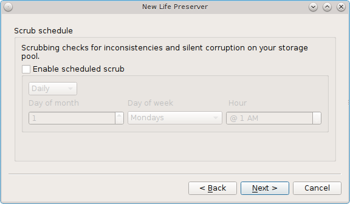

This screen is used to schedule when a ZFS scrub occurs. Scrubs are recommended as they can provide an early indication of a potential disk failure. To schedule the scrub,
check the box "Enable scheduled scrub" which will activate the configurable options in this screen. Use the drop-down menu to select a frequency of "Daily",
"Weekly", or "Monthly". If you select "Daily", you can configure the "Hour". If you select "Weekly", you can configure the "Day of week" and the "Hour". If you
select "Monthly", you can configure the "Day of month", "Day of week", and "Hour". Since a scrub can be disk I/O intensive, it is recommended to pick a time when
the system will not be in heavy use. When you are finished, click "Next" to see the screen shown in :numref:`Figure %s: Select Advanced Configuration Screen <lpreserver21>`.

.. _lpreserver21:

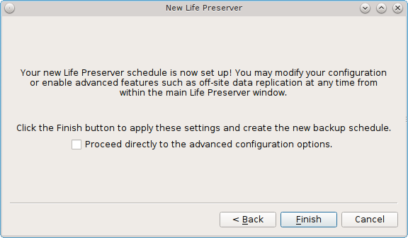

This screen provides the option to finish the configuration now or to continue on to the advanced options. If you only plan to store snapshots on this system or you have not
yet configured another system to back up to, click "Finish".  If you wish to replicate your backups to another system on the network which has already been prepared for this purpose, check
the box for "Proceed directly to the advanced configuration options" before clicking "Finish". Once you click "Finish", the wizard will save your configuration, exit the wizard, take a
system snapshot, and move on to the screen shown in :numref:`Figure %s: Life Preserver's Basic View <lpreserver6a>`.

.. index:: backup
.. _Life Preserver Options:

Life Preserver Options
----------------------

Once the snapshot schedule has been created, the "Status" tab shown in :numref:`Figure %s: Life Preserver's Basic View <lpreserver6a>` will become active and will show the name of the latest
snapshot. If you have scheduled a scrub or replication, it will also show the status of the last running scheduled task. In this example, the ZFS pool is active, is comprised of one disk,
and the date and time of the last snapshot indicates that it was created on June 23 at 1:55 in the afternoon. The most recent scheduled scrub occurred on June 3 at 10:52 in the evening and
the green status indicates that it completed without finding any disk errors.

.. _lpreserver6a:

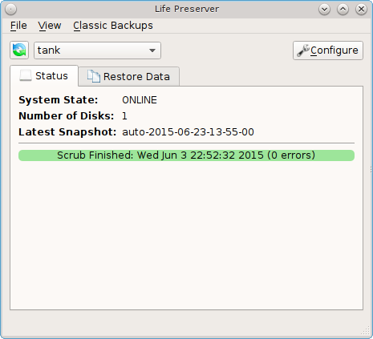

The "View" menu lets you select "Basic" or "Advanced" view. Clicking "Advanced" view will add the "Snapshots" and "Disks" tabs to the menu bar.

If you click the "Configure" button, or if you checked the box to "Proceed directly to the advanced configuration options" in the wizard, the screen shown in
:numref:`Figure %s: Modifying the Snapshot Schedule <lpreserver7a>` will open. 

.. _lpreserver7a:

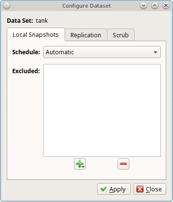

The "Local Snapshots" tab can be used to modify the schedule and pruning options on the local system. In other words, this is how often backups occur and how long
to keep them. To configure a list of datasets to exclude from the snapshot, click the "+" button which will display the list of available datasets. Select a dataset to
add it to the "Excluded" section. Repeat for any datasets that you do not wish to backup. To remove a dataset from the excluded list, so that it is added back to the
snapshot schedule, highlight its entry in the "Excluded" section and click the "-" button.

The "Replication" tab, is shown in :numref:`Figure %s: Configuring Replication <lpreserver22>`.

.. _lpreserver22:

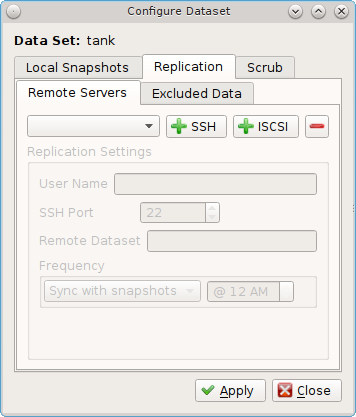

If you wish to keep a copy of the snapshots on another system, this screen is used to indicate which system to send the snapshots to. Life Preserver supports two replication schemes:

* Replication to another system which is running the same version of ZFS and has SSH enabled. When this method is used, the replicated data is sent over an encrypted connection but 
  is stored unencrypted on the other system. Refer to :ref:`Replication over SSH` for an example configuration.

* Replication to an iSCSI target. This method provides the most security as the replicated data is sent over an encrypted connection and the data is stored in an encrypted format.
  The remote system does not need to be formatted with ZFS but it must understand kernel iSCSI and stunnel must be installed. Refer to :ref:`Replicating Encrypted Backups` for an
  example configuration.

To exclude datasets from the snapshot from being replicated to the remote system, click the "Excluded Data" tab. This will let you create an exclude list as described in the
"Local Snapshots" tab.

.. note:: datasets which are excluded in the "Local Snapshots" tab are not backed up at all, and thus cannot be replicated. However, you do not have to replicate every dataset
          in the backup as you can use :menuselection:`Replication --> Excluded Data` to configure which datasets to exclude from the replication.

The "Scrub" tab, shown in :numref:`Figure %s: Modifying the Scrub Schedule <lpreserver23>`, can be used to modify the scrub schedule. It is a good idea to create a scrub schedule to verify
the integrity of the ZFS pool.
Typically, it is recommended to run a scrub once a week or before adding more disks to a pool. The status and results of a running scrub can be viewed from the command line by
typing :command:`zpool status`. When viewing the results of the scrub, check to see if there were any errors, as this is typically an early indication of a failing
disk. If you are getting errors, consider backing up your data and replacing the failing disk. Since a scrub is I/O intensive, it is recommended to schedule
the scrub when the system is not in use, such as the early morning hours. Depending upon the size of the pool, the scrub may take some time.

.. _lpreserver23:

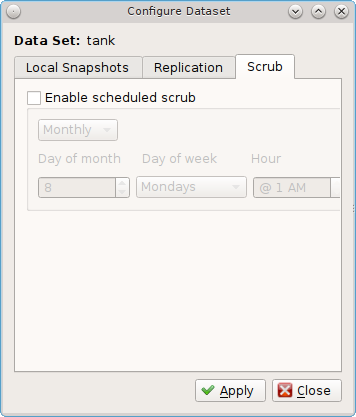

The "Restore Data" tab, seen in :numref:`Figure %s: Viewing the Contents of the Snapshots <lpreserver8>`, is used to view the contents of the local snapshots. This allows you to easily
restore any file which has been modified or deleted since a snapshot occurred.

.. _lpreserver8:

.. figure:: images/lpreserver8.png

In this example, the system has been configured to make a snapshot every 5 minutes. Since files have been modified on this system, the blue time slider bar
indicates that several snapshots are available as a snapshot only occurs if changes have been made within the scheduled time increment. Click the arrows to go
back or forward one snapshot at a time. Alternately, click the slider until you are viewing the desired time of the snapshot.

Once you have selected the desired date and time, use the drop-down menu to select the portion of the filesystem to view. In this example, the user has
selected :file:`/usr/home/dru` as that is the user's home directory. The user can now expand the directory names to view the files within each directory.

If your intent is to restore an earlier version of a file or a file that has been deleted, go back to the desired date and time, highlight the file, and click
the "Restore" button. A copy of that file as it appeared at that point in time will be created in the same directory, with :file:`-reversion#` added to the
filename. This way, any current version or restored version of the file will never be overwritten.

The "File" menu contains the following options: 

* **Manage Pool:** this will be greyed out if you have already configured your ZFS pool. If you have a second ZFS pool, you can select this option in order to
  start the Life Preserver Configuration Wizard for that pool.

* **Unmanage Pool:** if you wish to disable ZFS snapshots, select the ZFS pool name. Pop-up menus will ask if you are sure and then ask if you also want to
  delete the local snapshots from the system. If you choose to delete these snapshots, you will lose all of the older versions of the files contained in those
  backups. Once you have unmanaged a pool, you will need to use "Manage Pool" to rerun the Life Preserver Configuration Wizard for that pool.

* **Save Key to USB:** when you configure the replication of local snapshots to a remote system, you should immediately copy the automatically generated SSH
  key to a USB stick. Insert a FAT32 formatted USB stick and wait for :ref:`Mount Tray` to mount it. Then, click this option to copy the key.

* **Close Window:** closes the Life Preserver window. However, Life Preserver will continue to reside in the system tray.

The "Classic Backups" menu can be used to create an as-needed tarball of the user's home directory. This can be handy if you would like to make a backup of just your home
directory in order to restore it in another directory or on another system.

To make a tar backup, click :menuselection:`Classic Backups --> Compress Home Dir` and select the name of the user. This will open the screen shown in
:numref:`Figure %s: Backing Up a User's Home Directory <lpreserver9>`. 

.. _lpreserver9:

.. figure:: images/lpreserver9.png

If you want, you can change the filename of the archive to create. By default it will be in the format *username-YYYYMMDD-HHMM*. This screen also allows you to
define which files to exclude from the backup. By default, it will exclude PBI shortcuts and, if it exists, the :file:`/bin` directory in the user's home
directory. To exclude a specific file, click the white file icon to browse to the location of the file. To exclude a specific directory, click the blue
directory icon to browse to the location of the directory.

Press "Start" to start the backup. A progress bar will indicate the status and size of the backup. Once the backup is complete, click the "Finished" button to
exit this screen.

Use :menuselection:`Classic Backups --> Extract Home Dir` to restore a previously made home directory backup.
**Be sure this is what you want to do before using this option, as it will overwrite the current contents of the user's home directory.** If your goal is to
restore files without destroying the current versions, use the "Restore Data" tab instead.

The "Snapshots" menu allows you to manage snapshots and replication outside of their configured schedules. If this menu is not visible, click
:menuselection:`View -->Advanced` to enable it.

The "Snapshots" menu contains these options: 

* **New Snapshot:** click this button to create a snapshot now, instead of waiting for the schedule. For example, you can create a snapshot before making
  changes to a file, so that you can preserve a copy of the previous version of the file. Or, you can create a snapshot as you make modifications to the
  system configuration. When creating a snapshot, a pop-up message will prompt you to input a name for the snapshot, allowing you to choose a name that
  is useful in helping you remember why you took the snapshot.

* **Delete Snapshot:** selecting this option will display the list of locally stored snapshots, listed in order from the oldest to the newest. If you select a
  snapshot, a warning will remind you that this is a permanent change that can not be reversed. In other words, the versions of files at that point in time
  will be lost.

* **Start Replication:** this option will be greyed out if you have not yet configured replication to a remote server. To force a replication to a configured backup server,
  select the IP address of the remote system to start a replication now, rather than waiting for the scheduled time.

* **Re-Initialize Replications:** if a replication fails, it may prevent subsequent replications from completing successfully. In this case, select this option and
  select the IP address of the remote system in order to reset replication. After performing this re-initialization, click "Start Replication" to confirm that the
  replication issue has been resolved and snapshots are successfully replicating.

The "Disks" menu provides the same functionality of :ref:`Mirroring the System to a Local Disk`, but from the GUI rather than the command line. You should read that
section before attempting to use any of the disk options in this menu. It also lets you start and stop a ZFS scrub. If this menu is not visible, click
:menuselection:`View -->Advanced` to enable it.

The following options available in the "Disks" menu: 

* **Attach Disk:** if you wish to mirror another internal disk or an inserted external USB disk, select this option. The disk must be at least the same size
  as the PC-BSD® disk and you must be willing to have that disk be re-formatted.
  **Do not select this option if you have any data on the disk that you wish to keep.** This option is the GUI front-end to the
  :command:`lpreserver zpool attach` command.

* **Detach Disk:** if you wish to remove an attached disk from the mirror, use this option. This option is the GUI front-end to the
  :command:`lpreserver zpool detach` command.

* **Set Disk Online/Offline:** if you need to temporarily disconnect or reconnect an attached external USB drive, select the appropriate option. This is the
  GUI equivalent to running :command:`lpreserver zpool offline` or :command:`lpreserver zpool online`.

* **Start/Stop Scrub:** this option allows you to manually start a scrub now rather than waiting for the scrub schedule. If a scrub is currently running, you can
  stop it. Note that when you stop a scrub, it will need to start all over again the next time it is run.

.. index:: backup
.. _Replication over SSH:

Replication over SSH
--------------------

Life Preserver can be configured to replicate snapshots to another system over an encrypted SSH connection. For this configuration, the remote system to hold a copy of
the snapshots must meet the following requirements:

* The backup server **must be formatted with the latest version of ZFS,** also known as ZFS feature flags or ZFSv5000. Operating systems that support this
  version of ZFS include PC-BSD®, FreeBSD 9.2 or higher, and FreeNAS 9.1.x or higher.

* That system must have SSH installed and the SSH service must be running. If the backup server is running PC-BSD®, SSH is already installed and you can start
  SSH using :ref:`Service Manager`. If that system is running FreeNAS® or FreeBSD, SSH is already installed, but you will need to start SSH.

* If the backup server is running PC-BSD®, you will need to open TCP port 22 (SSH) using :ref:`Firewall Manager`. If the server is running FreeBSD and a
  firewall has been configured, add a rule to open this port in the firewall ruleset. FreeNAS® does not run a firewall by default. Also, if there is a
  network firewall between the PC-BSD® system and the backup system, make sure it has a rule to allow SSH.

.. note:: this configuration does not store the backup itself in an encrypted format. If you require that functionality, or prefer to backup to a system that is not
          formatted with ZFS, refer to :ref:`Replicating Encrypted Backups`.

The rest of this section demonstrates how to configure a FreeNAS® system as the remote backup server.

.. _Replication to a FreeNAS® System:

Replication to a FreeNAS® System
^^^^^^^^^^^^^^^^^^^^^^^^^^^^^^^^

`FreeNAS® <http://www.freenas.org/>`_ is an open source Networked Attached Storage (NAS) operating system based on FreeBSD. This operating system is designed
to be installed onto a USB stick so that it is kept separate from the storage disk(s) installed on the system. You can download the latest STABLE version of
FreeNAS® 9.3 from `download.freenas.org <http://download.freenas.org/9.3/STABLE/>`_ and read its documentation at 
`doc.freenas.org <http://doc.freenas.org/9.3/>`_. 

This section demonstrates how to configure FreeNAS® 9.3 as the backup server for Life Preserver to replicate to. It assumes that you have already installed
this version of FreeNAS® using the installation instructions in the
`FreeNAS® 9.3 Users Guide <http://doc.freenas.org/9.3/freenas_install.html>`_ and are able to access the FreeNAS® system from a web browser.

In order to prepare the FreeNAS® system to store the backups created by Life Preserver, you will need to create a ZFS pool, create and configure the
dataset to store the backups, create a user account that has permission to access that dataset, and enable the SSH service.

In the example shown in :numref:`Figure %s: Creating a ZFS Volume in FreeNAS® <lpreserver10>`, the user has clicked :menuselection:`Storage --> Volumes --> Volume Manager` in order to create
a ZFS pool to hold the backups.

.. _lpreserver10:

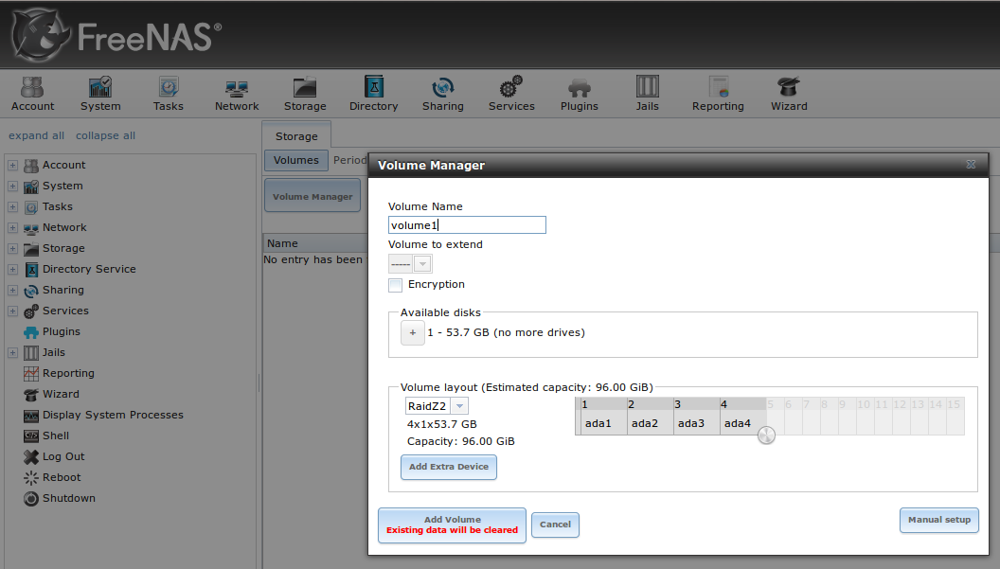

Input a "Volume Name", drag the slider to select the desired number of available disks, and click the "Add Volume" button. The Volume Manager will automatically
select the optimal layout for both storage capacity and redundancy. In this example, a RAIDZ2 named *volume1* will be created.

.. note:: make sure that the size of the pool is large enough to hold the replicated snapshots. To determine the size of the initial snapshot, run
   :command:`zpool list` on the PC-BSD® system and look at the value in the "ALLOC" field. Subsequent snapshots will be smaller and will be the size of the
   data that has changed.

To create the dataset to backup to, click the "+" next to the entry for the newly created volume, then click "Create ZFS Dataset". In the example shown in
:numref:`Figure %s: Creating a ZFS Dataset in FreeNAS® <lpreserver11>`, the "Dataset Name" is *backups*. Click the "Add Dataset" button to create the dataset.

.. _lpreserver11:

.. figure:: images/lpreserver11.png

To create the user account, go to :menuselection:`Account --> Users --> Add User`. In the screen shown in :numref:`Figure %s: Creating a User in FreeNAS® <lpreserver12>`, input a "Username"
that you will later configure Life Preserver to use. Under "Home Directory", use the browse button to browse to the location of the dataset that you made to store the
backups. Input a "Full Name", then input and confirm a "Password". When finished, click the "OK" button to create the user.

.. _lpreserver12:

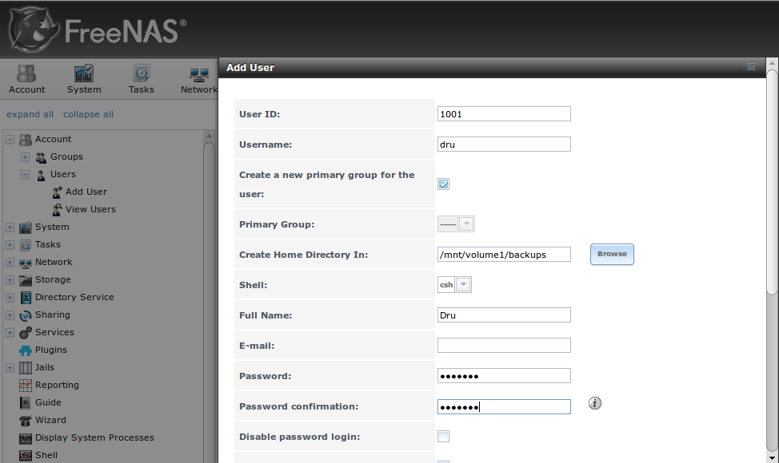

Next, give the user permissions to the dataset by going to :menuselection:`Storage --> Volumes`, click the + next to the name of the volume, click the "+"
next to the name of the dataset, then click "Change Permissions" for the expanded dataset. In the screen shown in :numref:`Figure %s: Setting Permissions in FreeNAS® <lpreserver13a>`, change
the "Owner (user)"and "Owner (group)" to the user that you created. Click "Change" to save the change.

.. _lpreserver13a:

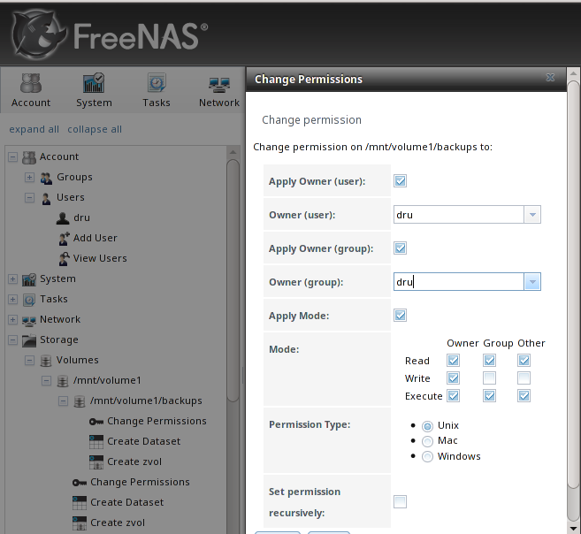

Next, click on "Shell" and type the following command, replacing *dru* and *volume1/backups* with the name of the user, volume, and dataset that you created::

 zfs allow -u dru atime,canmount,clone,compression,create,destroy,hold,mount,mountpoint,promote,receive,rename,send,userprop volume1/backups  

Click the "x" in the upper right corner to close "Shell". Then, to enable the SSH service, go to :menuselection:`Services --> Control Services`, shown in
:numref:`Figure %s: Start SSH in FreeNAS® <lpreserver14>`. 

.. _lpreserver14:

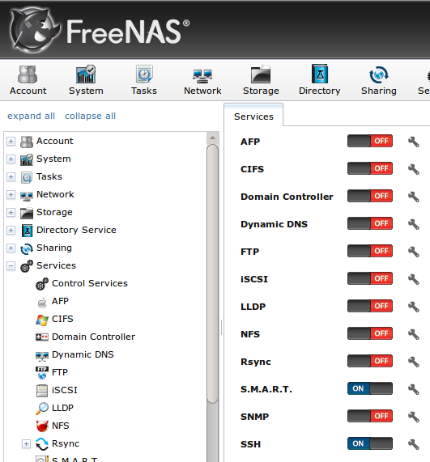

Click the red "OFF" button next to SSH to enable that service. Once it turns to a blue "ON", the FreeNAS® system is ready to be used as the backup server.

To finish the configuration, open Life Preserver on the PC-BSD® system and click :menuselection:`Configure --> Replication`. In the screen shown in
:numref:`Figure %s: Configuring Replication <lpreserver22>`, click the "+SSH" button. Life Preserver will scan the network for systems running SSHD and, if the scan is successful, a pop-up
menu will show the hostnames of the available systems. If multiple systems are running SSH, use the drop-down menu to select the desired system and click "OK". If you instead receive an
error message, check to see if there is a firewall between the PC-BSD® and the FreeNAS® system as this scan requires UDP port 5353 to be open on any firewalls running on or between the two
systems.

Once the system is selected, its IP address will be added to the drop-down menu to the left of the "+SSH" button, the port number SSH is listening on will display in the
"SSH Port" menu, and the rest of this screen will be activated. In the example shown in :numref:`Figure %s: Finishing the Configuration <lpreserver24>`, the IP address of the FreeNAS® system
is 192.168.1.73.

.. _lpreserver24:

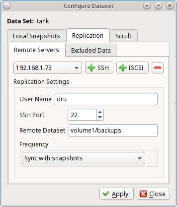

Input the name of the user and the name of the dataset you created on the FreeNAS® system. In this example, the "User Name" is *dru* and the "Remote Dataset" is
*volume1/backups*. If desired, click the "Frequency" drop-down menu to configure the snapshots to either be replicated at the same time that they are created ("Sync
with snapshots") or "Daily", "Hourly", every "30 Minutes", every "10 minutes", or only when you manually start the replication from
:menuselection:`Snapshots --> Start Replication` ("Manual").

When finished, click "Apply", Life Preserver will check that it can connect to the backup server and will prompt for the password of "User Name". A
second pop-up message will remind you to save the SSH key to a USB stick (as described in :ref:`Life Preserver Options`) as this key is required for
:ref:`Restoring the Operating System`.

.. note:: if you don't receive the pop-up message asking for the password, check that the firewall on the backup system, or a firewall within the network, is
   not preventing access to the port number listed in "SSH Port". Also, this pop-up only occurs once. If the password changes or you are not able to successfully login,
   use :menuselection:`Snapshots --> Reset Replication Password` to re-input the password.

Once the SSH login is successful, Life Preserver will begin to replicate snapshots to the remote system at the configured "Frequency". Note that the first replication can
take several hours to complete, depending upon the speed of the network. Subsequent replications will only contain changed data and will be much smaller. You can confirm
that the snapshots have been received by clicking :menuselection:`Storage --> Snapshots` on the FreeNAS® system. This should provide a listing of the replicated datasets,
allowing you to manage the replicated snapshots as described in `Snapshots <http://doc.freenas.org/9.3/freenas_storage.html#snapshots>`_.

Life Preserver uses backend checks so that it is safe to keep making snapshots while a replication is in process. It will not prune any existing snapshots
until the replication is finished and it will not start a second replication before the first replication finishes.

.. index:: backup
.. _Replicating Encrypted Backups:

Replicating Encrypted Backups
-----------------------------

The previous section demonstrated how to securely replicate snapshots to another system over SSH, which ensures that the data is encrypted while it is being transferred
over the network. Life Preserver provides an alternate replication method which provides an extra measure of security by adding support for fully-encrypted backups
using `stunnel <https://www.stunnel.org/index.html>`_ and GELI-backed iSCSI volumes. This means that the data stored on the remote side is encrypted and only accessible with
the key file stored on the PC-BSD® system. The remote backup server must understand kernel iSCSI, meaning that it must be running FreeBSD, PC-BSD®/TrueOS®, or
FreeNAS®. However, the remote system does not need to be formatted with ZFS.

The backup system must meet the following requirements:

* It must be running FreeBSD 9.1 or higher, PC-BSD® or TrueOS® 10.1.2 or higher, or FreeNAS® 9.3

* If it is a FreeBSD system, the "security/stunnel" package must be installed. This software is already installed on PC-BSD®/TrueOS® 10.1.2 and on FreeNAS® 9.3 systems that
  have been updated to at least SU201504100216.
  
* If it is a FreeBSD system, the `lpreserver-host-iscsi <https://raw.githubusercontent.com/pcbsd/pcbsd/master/src-sh/lpreserver/lpreserver-host-iscsi>`_ script must be
  downloaded. This file is already installed to :file:`/usr/local/bin/` on PC-BSD®/TrueOS® 10.1.2 systems. Refer to :ref:`Using FreeNAS® as the Backup System` for FreeNAS® instructions.

Before you can backup the PC-BSD® system using this replication method, you must first create a Life Preserver configuration file ending in the :file:`.lps` extension on the remote
system which will store the encrypted backups. To create this file on a FreeBSD 9.1 or higher system or on a PC-BSD®/TrueOS® 10.1.2 system, run the :command:`lpreserver-host-iscsi`
script as the *root* user. Input the information that the script asks for as seen in the following example. Table 8.19b summarizes the various options that this script prompts for.
::

 lpreserver-host-iscsi
 Enter the target host name (example.com or IP)
 >10.0.0.1
 Enter the CHAP username
 >mybackups
 Enter the CHAP password (12-16 chars)
 >pcbsdbackups
 Enter the ZVOL name (I.E. tank/myzvol)
 >tank/pcbsd-backup
 Enter the ZVOL size (I.E. 800M, 4G, 1T)
 >50G
 Does this look correct?
 Target host: 10.0.0.1
 Target name: target0
 Username: mybackups
 Password: pcbsdbackups
 ZVOL name: tank/pcbsd-backup
 ZVOL size: 50G
 (y/n)>y

Once you input *y*, the script will configure the necessary services for startup, generate an RSA key, and prompt you for information to go into the digital certificate, as seen in
this example::

 ctld_enable: NO -> YES
 stunnel_enable: -> YES
 Generating RSA private key, 2048 bit long modulus
 .............................+++
 ......................................+++
 e is 65537 (0x10001)
 You are about to be asked to enter information that will be incorporated
 into your certificate request.
 What you are about to enter is what is called a Distinguished Name or a DN.
 There are quite a few fields but you can leave some blank
 For some fields there will be a default value,
 If you enter '.', the field will be left blank.
 -----
 Country Name (2 letter code) [AU]: US
 State or Province Name (full name) [Some-State]: CA
 Locality Name (eg, city) []: San Jose
 Organization Name (eg, company) [Internet Widgits Pty Ltd]: My Backups
 Organizational Unit Name (eg, section) []:
 Common Name (e.g. server FQDN or YOUR name) []: Dru
 Email Address []:
 ctld not running? (check /var/run/ctld.pid).
 Starting ctld.
 stunnel not running? (check /var/run/stunnel.pid)
 Starting stunnel.
 Created mybackups.lps

**Table 8.19b: Configuration Options** 

+------------------+---------------------------------------------------------------------------------------------------------------------------+
| **Option**       | **Description**                                                                                                           |
+==================+===========================================================================================================================+
| target host name | the IP address of the server which will hold the encrypted backups                                                        |
|                  |                                                                                                                           |
+------------------+---------------------------------------------------------------------------------------------------------------------------+
| target name      | can be anything, as long as it is does not already exist in :file:`/etc/ctl.conf`                                         |
|                  |                                                                                                                           |
+------------------+---------------------------------------------------------------------------------------------------------------------------+
| CHAP username    | must be between 8 and 12 characters                                                                                       |
|                  |                                                                                                                           |
+------------------+---------------------------------------------------------------------------------------------------------------------------+
| CHAP password    | must be between 12 and 16 characters                                                                                      |
|                  |                                                                                                                           |
+------------------+---------------------------------------------------------------------------------------------------------------------------+
| ZVOL name        | in the format *poolname/something-useful*                                                                                 |
|                  |                                                                                                                           |
+------------------+---------------------------------------------------------------------------------------------------------------------------+
| ZVOL size        | **must be at least the same size as the pool to be backed up**                                                            |
|                  |                                                                                                                           |
+------------------+---------------------------------------------------------------------------------------------------------------------------+

Once you have successfully created the :file:`.lps` file, copy it to the PC-BSD® system to be backed up. You are now ready to configure the PC-BSD® system using the instructions in
:ref:`Configuring the System to Backup`.

.. _Using FreeNAS® as the Backup System:

Using FreeNAS® as the Backup System
^^^^^^^^^^^^^^^^^^^^^^^^^^^^^^^^^^^

To instead prepare a FreeNAS® 9.3 system to use as the backup target, first ensure that the system has been updated to the latest software update using
:menuselection:`System -> Update`. Then, perform the following configuration steps.

Create a service account for the stunnel service by going to :menuselection:`Account --> Users --> Add User`. In the screen shown in :numref:`Figure %s: Create the Service Account <iscsi4>`,
input the following values in these fields then press "OK" to create the account:

* **User ID:** 341

* **Username:** stunnel

* **Shell:** nologin

* **Full Name:** stunnel service (or something useful to you)

* **Disable password login:** check this box

.. _iscsi4: 

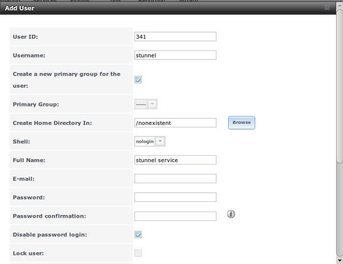

Next, create a zvol using the tree menu. Go to :menuselection:`Storage --> Volumes --> click the plus to expand name of volume --> Create zvol`. In the example
shown in :numref:`Figure %s: Create the zvol <iscsi5>`, a zvol of 50GB in size named "pcbsd-backup" is created on the volume named "volume1".

.. _iscsi5:

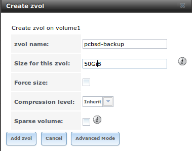

You are now ready to configure iSCSI. Go to :menuselection:`Sharing --> Block (iSCSI)`. In the "Target Global Configuration" screen shown in :numref:`Figure %s: Configure the IQN <iscsi6a>`,
change the default "Base Name" to *iqn.2012-06.com.lpreserver* and click "Save".

.. _iscsi6a:

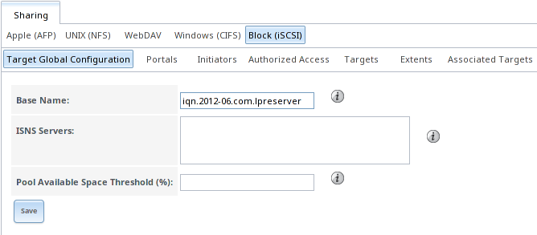

Click the "Portals" tab then the "Add Portal" button. Verify that the "IP Address" drop-down menu is set to *0.0.0.0* and that the "Port" field is set to
*3260*, add a "Comment" if it is useful to you, then click "OK" to add the entry to the "Portals" tab. In the example shown in :numref:`Figure %s: Configure the Portal <iscsi7a>`, this is
the first time iSCSI has been configured on this system, so it has a "Portal Group ID" of *1*. If you have already created other iSCSI targets, note the
"Portal Group ID" you just created.

.. _iscsi7a:

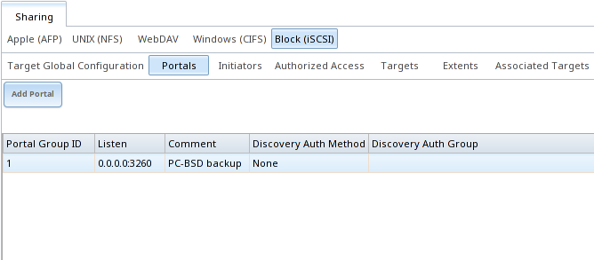

In the "Initiators" tab, click the "Add Initiator" button. Verify that both the "Initiators" and "Authorized network" fields are set to *ALL*, add a "Comment" if
it is useful to you, and press "OK" to add an entry to the "Initiators" tab. Make note of the "Group ID" that is created. In the example shown in
:numref:`Figure %s: Configure the Initiator <iscsi8>`, it is *1*.

.. _iscsi8:

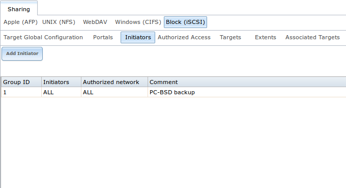

In the "Authorized Access" tab, click the "Add Authorized Access" button. Input a value for the "User" that is between 8 and 12 characters and a value in the "Secret" and
"Secret (Confirm)" fields that is between 12 and 16 characters, then press "OK". In the example shown in :numref:`Figure %s: Configure the Authorized Access <iscsi9>`, the "User" has a value
of *mybackups*, the secret is
*pcbsdbackups*, and the "Group ID" is
*1*. Make note of the "Group ID" that is created for you.

.. _iscsi9:

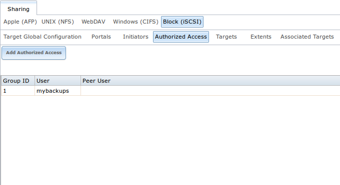

In the "Targets" tab, click the "Add Target" button. In the screen shown in :numref:`Figure %s: Configure the Target <iscsi10a>`, use the following values in these fields:

* **Target Name:** target0

* **Portal Group ID:** select the portal group ID you created in the drop-down menu

* **Initiator Group ID:** select the initiator group ID you created in the drop-down menu

* **Auth Method:** select CHAP from the drop-down menu

* **Authentication Group number:** select "1" from the drop-down menu

.. _iscsi10a: 

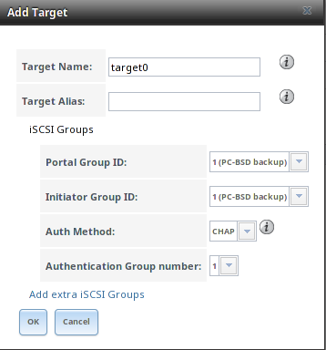

In the "Extents" tab, click the "Add Extent" button. In the screen shown in :numref:`Figure %s: Configure the Extent <iscsi11>`, input an "Extent Name", in this case it is *pcbsd-backup*,
and make sure that the zvol you created is selected in the "Device" drop-down menu. Click "OK" to create the extent.

.. _iscsi11:

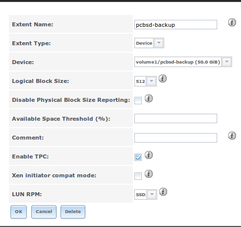

Finish the iSCSI configuration by clicking the "Associated Targets" tab, then the "Add Target / Extent" button. In the screen shown in
:numref:`Figure %s: Associate the Target With the Extent <iscsi12a>`, select the "Target" and the "Extent" that you created.

.. _iscsi12a: 

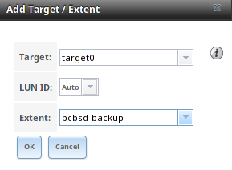

Next, go to :menuselection:`Services` and click the red "OFF" button next to the iSCSI service. Wait for it to turn to a blue "ON", indicating that the iSCSI service has started.

To configure the stunnel service, open :menuselection:`Shell` and type the following::

 openssl genrsa -out /usr/local/etc/stunnel/key.pem 2048
 openssl req -new -x509 -key /usr/local/etc/stunnel/key.pem -out /usr/local/etc/stunnel/cert.pem -days 1095
 cat /usr/local/etc/stunnel/key.pem /usr/local/etc/stunnel/cert.pem >> /usr/local/etc/stunnel/iscsi.pem

Next, create a file named :file:`/usr/local/etc/stunnel/stunnel.conf` with the following contents::

 setuid = stunnel
 setgid = nogroup
 options = NO_SSLv2
 client = no

 [iscsi]
 accept = 9555
 connect = 127.0.0.1:3260
 cert = /usr/local/etc/stunnel/iscsi.pem

Make sure that the stunnel service starts using this command::

 service stunnel onestart

.. note:: to ensure that the stunnel service also starts whenever the FreeNAS® system reboots, use :menuselection:`System --> Tunables --> Add Tunable` to create a tunable with
   a "Variable" of *stunnel_enable*, a "Value" of
   *YES*, and a "Type" of
   *rc.conf*.

Finally, create a :file:`*.lps` file on the PC-BSD® system using a text editor. Edit the following example so that the IP address of the FreeNAS® system is in the
"ihost" field, the "iuser" value matches the "User" in :menuselection:`Sharing --> Block (iSCSI) --> Authorized Access`, the "ipassword" value matches the "Secret" you
set when you created the "Authorized Access", and the "itarget" value matches the "Target Name" in :menuselection:`Sharing --> Block (iSCSI) --> Targets`::

 % more mybackups.lps
 [Life-Preserver LPS]
 ihost: 10.0.0.1
 iuser: mybackups
 ipassword: pcbsdbackups
 itarget: target0

You are now ready to configure the PC-BSD® system using the instructions in :ref:`Configuring the System to Backup`.

.. _Configuring the System to Backup:

Configuring the System to Backup
^^^^^^^^^^^^^^^^^^^^^^^^^^^^^^^^

Once you have configured the backup system and the PC-BSD® system has a copy of the :file:`*.lps` file, open Life Preserver, go to :menuselection:`Configure --> Replication`
and click the "iSCSI" button. This will start the "iSCSI Setup Wizard". Click "Next" to see the screen shown in Figure :numref:`Figure %s: Selecting the Configuration File <iscsi1>`.

.. _iscsi1: 

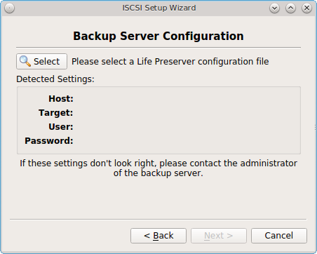

Click the "Select" button to browse to the location of your saved :file:`.lps` file. Once selected, the "Host", "Target", "User", and "Password" fields will
auto-populate with the settings from the configuration file. Click "Next" to see the screen shown in :numref:`Figure %s: Input the Encryption Key <iscsi2>`.

.. _iscsi2:

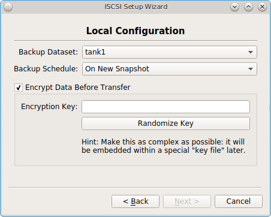

This screen lets you configure the following:

* **Backup Schedule:** choices are "On New Snapshot", "Manually Started", "Daily", "Hourly", "Every 30 Minutes", or "Every 10 Minutes". If you select "Daily",
  another field will appear so that you can set the time.

* **Re-use existing data on the host:** by default, this box is unchecked as the encryption key will be automatically generated for you and stored in
  :file:`/var/db/lpreserver/keys`. If you have previously configured an encrypted backup to this remote backup system and still have a copy of the encryption key for that
  system, check this box and use the browse button to add the key to the "GELI Encryption File" field.
  
When finished, click "Next". A pop-up menu will ask if you are ready to enable off-site data storage. Click "Yes" to complete the configuration. This may take a few minutes.
Once the connection to the remote system is established, you will see the screen shown in :numref:`Figure %s: Save the Key <iscsi3>`.

.. _iscsi3:

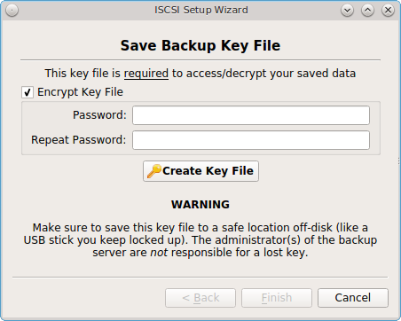

This screen creates the :file:`.lpiscsi` file that is needed when :ref:`Restoring the Operating System` from an encrypted backup.
**It is VERY important that you remember the password that you set on this file and that you save this file on ANOTHER system or removable media. Without this file and the correct password, you will NOT be able to restore the system should there ever be a catastrophic failure.**
This is an encrypted file which contains contains the :file:`.lps` file and a copy of the GELI key.

Input and confirm a password that you will be able to remember and that other users should not be able to guess, then click "Create Key File". A pop-up message
should indicate that the key file was successfully created in :file:`/usr/home`. You should **immediately** copy that file to another system or removable media, such
as a USB stick. Click "Finish" to exit the wizard.

.. _Restoring the Operating System:

Restoring the Operating System
------------------------------

If you have replicated the system's snapshots to a remote backup server, you can use a PC-BSD® installation media to perform an operating system restore or to clone
another system. Start the installation as usual until you get to the screen shown in :numref:`Figure %s: Selecting to Restore/Clone From Backup <lpreserver15>`. 

.. _lpreserver15: 

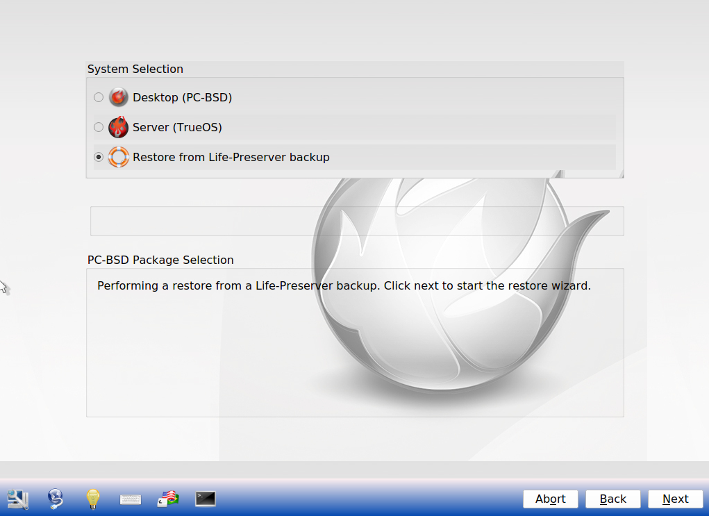

Before you can perform a restore, the network interface must be configured. Click the "network connectivity" icon (second from the left) in order to determine
if the network connection was automatically detected. If it was not, refer to the instructions in :ref:`Network Configuration` and make sure that networking is
working before continuing.

If you are restoring from an encrypted backup, you  will need to copy over the saved :file:`*.lpiscsi` file. If this file is stored on a USB stick, insert it now.
If it is saved on a remote system, click the black terminal icon and click "shell" from the menu. You can then use :command:`scp` or :command:`sftp` to copy the
file from the remote system. When finished, type :command:`exit` to exit the shell then use your arrow keys to select "exit" in the menu to exit the menu.

Once you are ready, click "Restore from Life-Preserver backup" and the "Next" button. This will start the Restore Wizard. Click "Next" to select the type of restore using the
screen shown in :numref:`Figure %s: Restoring From an Encrypted Backup <lpreserver16>`. 

.. _lpreserver16:

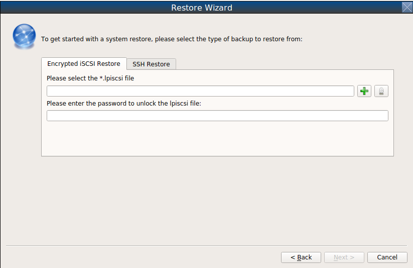

If you configured an encrypted backup using the instructions in :ref:`Replicating Encrypted Backups`, click the "+" button in the "Encrypted iSCSI Restore" tab to
browse to the location of the :file:`*.lpiscsi` file that you either copied over or which is on the inserted USB stick, enter the password to decrypt this file, and click "Next".
A "Restore Summary" screen will indicate the name of the :file:`*.lpiscsi` file that the system will be restored from. Click "Finish". The restore wizard will
provide a summary of which host it will restore from, the name of the user account associated with the replication, and the hostname of the target system. Click
"Finish" and the installer will proceed to the :ref:`Disk Selection Screen`. At this point, you can click the "Customize" button to customize the disk options.
However, in the screen shown in Figure 3.3h, the ZFS datasets will be greyed out as they will be recreated from the backup during the restore. Once you are finished
with any customizations, click "Next" to perform the restore.

If you instead configured backups to a replication server using the instructions in :ref:`Scheduling a Backup`, click the "SSH Restore" tab. In the screen shown in
:numref:`Figure %s: Input the Information for a SSH Restore <lpreserver20>`, input the IP address of the backup server and the name of the user account used to replicate the snapshots. If
the server is listening on a non-standard SSH port, change the "SSH port" number. Then, click "Next" to select an authentication method in the screen shown in
:numref:`Figure %s: Select the Authentication Method <lpreserver17>`.

.. _lpreserver20: 

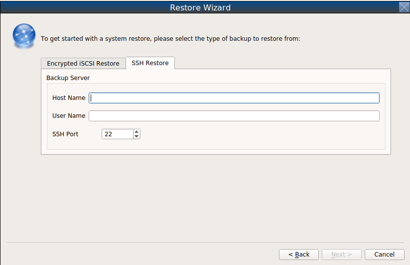

.. _lpreserver17: 

.. figure:: images/lpreserver17.png

If you previously saved the SSH key to a USB stick, insert the stick then press "Next". Otherwise, change the selection to "Use password authentication" and
press "Next". The next screen will either read the inserted USB key or prompt for the password, depending upon your selection. The wizard will then attempt a
connection to the server.

Once the connection to the backup server succeeds, you will be able to select which host to restore. In the example shown in :numref:`Figure %s: Select the Host to Restore <lpreserver18>`,
only one host has been backed up to the replication server.

.. _lpreserver18:

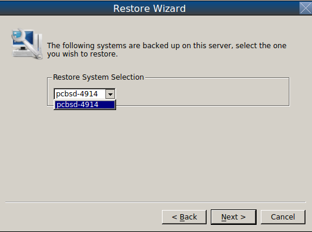

After making your selection, click "Next". The restore wizard will provide a summary of which host it will restore from, the name of the user account
associated with the replication, and the hostname of the target system. Click "Finish" and the installer will proceed to the :ref:`Disk Selection Screen`. At
this point, you can click the "Customize" button to customize the disk options. However, in the screen shown in Figure 3.3h, the ZFS datasets will be greyed
out as they will be recreated from the backup during the restore. Once you are finished with any customizations, click "Next" to perform the restore.

.. index:: backup
.. _Using the lpreserver CLI:

Using the lpreserver CLI
------------------------

The :command:`lpreserver` command line utility can be used to manage snapshots and replication from the command line of a PC-BSD® or TrueOS® system. This
command needs to be run as the superuser. To display its usage, type the command without any arguments::

 lpreserver
 Life-Preserver 
 --------------------------------- 
 Available commands 
 Type in help <command> for information and usage about that command
       help - This help file or the help for the specified command
   cronsnap - Schedule snapshot creation via cron
  cronscrub - Schedule scrub via cron
        get - Get list of lpreserver options
   listcron - Listing of scheduled snapshots
   listsnap - List snapshots of a zpool/dataset
     mksnap - Create a ZFS snapshot of a zpool/dataset
  replicate - Enable / Disable ZFS replication to a remote system
 revertsnap - Revert zpool/dataset to a snapshot
     rmsnap - Remove a snapshot
        set - Set lpreserver options
     status - List datasets, along with last snapshot / replication date 
      zpool - Manage a zpool by attaching / detaching disks

Each command has its own help text that describes its parameters and provides a usage example. For example, to receive help on how to use the
:command:`lpreserver cronsnap` command, type::

 lpreserver help cronsnap
 Life-Preserver
 ---------------------------------
 Help cronsnap
 Schedule a ZFS snapshot
 Usage:
 For a listing of all scheduled snapshots
 # lpreserver listcron
 or
 To start / stop snapshot scheduling
 # lpreserver cronsnap <dataset> <action> <frequency> <numToKeep>
 action = start / stop
 frequency = auto / daily@XX / hourly / 30min / 10min / 5min
                          ^^ Hour to execute

 numToKeep = Number of snapshots to keep total

 NOTE: When Frequency is set to auto the following will take place:
 * Snapshots will be created every 5 minutes and kept for an hour.
 * A hourly snapshot will be kept for a day.
 * A daily snapshot will be kept for a month.
 * A Monthly snapshot will be kept for a year.
 * The life-preserver daemon will also keep track of the zpool disk space,
   if the capacity falls below 75%, the oldest snapshot will be auto-pruned.

 Example:
 lpreserver cronsnap tank1/usr/home/kris start daily@22 10
 or
 lpreserver cronsnap tank1/usr/home/kris stop

Table 8.19a shows the command line equivalents to the graphical options provided by the Life Preserver GUI. Note that some options are only available from the
command line.

**Table 8.19a: Command Line and GUI Equivalents** 

+-------------------+-----------------------------------------------+----------------------------------------------------------------------------------------+
| **Command Line**  | **GUI**                                       | **Description**                                                                        |
+===================+===============================================+========================================================================================+
| **cronsnap**      | :menuselection:`Configure --> Local Snapshots`| schedule when snapshots occur and how long to keep them; the **stop** option can be    |
|                   |                                               | used to disable snapshot creation                                                      |
+-------------------+-----------------------------------------------+----------------------------------------------------------------------------------------+
| **cronscrub**     |                                               | schedule a ZFS scrub                                                                   |
+-------------------+-----------------------------------------------+----------------------------------------------------------------------------------------+
| **get**           |                                               | list Life Preserver options                                                            |
+-------------------+-----------------------------------------------+----------------------------------------------------------------------------------------+
| **listcron**      |                                               | list which ZFS pools have a scheduled snapshot                                         |
+-------------------+-----------------------------------------------+----------------------------------------------------------------------------------------+
| **listsnap**      | Restore Data                                  | list snapshots of specified dataset                                                    |
+-------------------+-----------------------------------------------+----------------------------------------------------------------------------------------+
| **mksnap**        | :menuselection:`Snapshots --> New Snapshot`   | create and replicate a new ZFS snapshot; by default, snapshots are recursive, meaning  |
|                   |                                               | that a snapshot is taken of every dataset within a pool                                |
+-------------------+-----------------------------------------------+----------------------------------------------------------------------------------------+
| **replicate**     | :menuselection:`Configure --> Replication`    | used to list, add, and remove backup server; read the **help** for this command for    |
|                   |                                               | examples                                                                               |
+-------------------+-----------------------------------------------+----------------------------------------------------------------------------------------+
| **revertsnap**    |                                               | revert dataset to the specified snapshot version                                       |
+-------------------+-----------------------------------------------+----------------------------------------------------------------------------------------+
| **rmsnap**        | :menuselection:`Snapshots --> Delete Snapshot`| deletes specified snapshot; by default, all datasets within the snapshot are deleted   |
+-------------------+-----------------------------------------------+----------------------------------------------------------------------------------------+
| **set**           |                                               | configures Life Preserver options; read **help** for the list of configurable options  |
+-------------------+-----------------------------------------------+----------------------------------------------------------------------------------------+
| **status**        | Status                                        | lists the last snapshot name and replication status                                    |
+-------------------+-----------------------------------------------+----------------------------------------------------------------------------------------+
| **zpool**         | :menuselection:`Disks --> Attach Disk` and    | used to attach/detach drives from the pool; read **help** for examples                 |
|                   | :menuselection:`Disks --> Detach Disk`        |                                                                                        |
+-------------------+-----------------------------------------------+----------------------------------------------------------------------------------------+

.. index:: backup
.. _Mirroring the System to a Local Disk:

Mirroring the System to a Local Disk 
^^^^^^^^^^^^^^^^^^^^^^^^^^^^^^^^^^^^^

In addition to replicating to a remote server, the :command:`lpreserver` command also provides a method for attaching a new disk drive to an existing ZFS
pool, and live-mirroring all data to that disk as data changes on the pool. The attached disk drive can be another internal disk or an external USB disk. When
the new disk is attached for the first time, it will be erased and used solely as a mirror of the existing system drive. In addition, it will be made
bootable, allowing you to boot from and use the new disk should the primary disk fail. In order to use this feature you will need the following: 

* an internal or external disk drive that is the same size or larger than the existing system disk.

* since the disk will be formatted, it must be either blank or not have any data that you wish to keep intact.

* in order to boot from the disk should the primary disk fail, the system must support booting from the new disk. For example, if you are using a USB disk,
  make sure that the BIOS is able to boot from a USB disk.

The superuser can setup the new disk using the following command. Replace *tank1* with the name of your ZFS pool and */dev/da0* with the name of the disk to
format. For example, the first USB disk will be */dev/da0* and the second internal hard disk will be */dev/ad1*::

 lpreserver zpool attach tank1 /dev/da0

When the disk is first attached, it will be formatted with ZFS and configured to mirror the size of the existing disk. GRUB will also be stamped on the new
disk, making it bootable should another drive in the array go bad. You can add multiple disks to the pool in this manner, giving any level of redundancy that
you require.

Once the disk is attached, it will begin to resilver. This process mirrors the data from the primary disk to the newly attached disk. This may take a while,
depending upon the speed of the disks and system load. Until this is finished you should not reboot the system, or detach the disk. You can monitor the
resilvering process by typing :command:`zpool status`.

To get a listing of the disks in your mirror, run this command, replacing *tank1* with the name of the pool::

 lpreserver zpool list tank1

If you are using an external drive, there may be occasions where you wish to disconnect the backup drive, such as when using a laptop and going on the road.
In order to so this safely, it is recommended that you first offline the external disk using the following command::

 lpreserver zpool offline tank1 /dev/da0

Then when you re-connect the drive, you can place it in online mode again using::

 lpreserver zpool online tank1 /dev/da0

Sometimes, the disk name will change as a result of being disconnected. The :command:`lpreserver zpool list tank1` command can be used to get the proper
device ID.

If you wish to permanently remove a disk from the mirror, run the following command. If you decide to re-attach this disk later, a full disk copy will again
have to be performed::

 lpreserver zpool detach tank1 /dev/da0

.. note:: in addition to working with mirrors, the :command:`lpreserver zpool` command can also be used to manage a RAIDZ configuration, although you will
   probably not want to use external disks in this case.

.. index:: bug
.. _Report a bug:

Report a bug
============

The bug reporting tool in Control Panel can be used to easily send a bug report to the development team responsible for the software which produced the bug.

To access this tool, go to :menuselection:`Control Panel --> Report a bug` or type :command:`pc-bugreport` from the command line.
The initial screen for this tool is shown in :numref:`Figure %s: PC-BSD® Bug Reporting Utility <report1>`. 

.. _report1:

.. figure:: images/report1.png

Select the software component that most closely matches where the bug occurs. For example, if the bug occurs when using a KDE utility, select "Desktop
environment", or if the bug occurs when using an application that was installed using AppCafe®, select "PC-BSD software (pbi)". When in doubt, select
"PC-BSD base system". 

In the example shown in :numref:`Figure %s: Reporting a Bug <report2a>`, the user has selected "PC-BSD base system" then "Next". 

.. note:: regardless of the selection, the resulting screen will be similar to :numref:`Figure %s: Reporting a Bug <report2a>`. The various screens only differ in which bug tracking system
   or mailing list is used by the development team for that component. If you select "Desktop environment" you will also be asked to indicate which desktop so that the
   correct information is displayed for that development team. Similarly, if you select "PBI software" you will be asked to select which PBI produces the
   error.

.. _report2a:

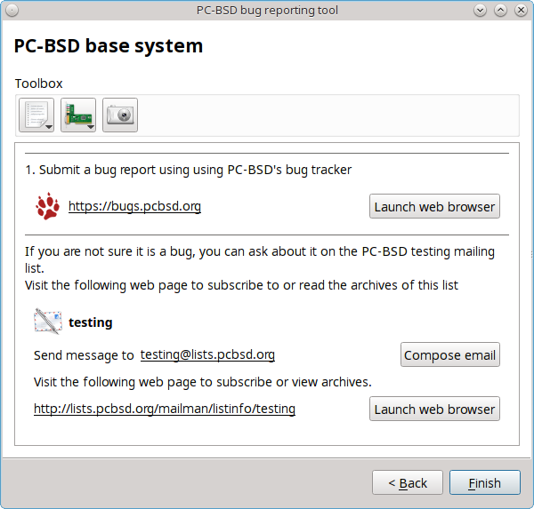

If the development team has a bug tracker, its URL will be displayed. If you click the "Launch web browser" button, that website will be opened in the default
web browser so that you can search for existing bugs and create a new bug if one does not already exist. Note that you will need to register first if this is
your first bug report on that project's bug tracker and that you must be logged in in order to create a new bug.

If the development team has a mailing list, its email address will be listed. The URL to the mailing list will also be displayed so that you can search its
archives and subscribe to the list. Note that you will need to be subscribed to a mailing list before you can report a bug using that list. To report the bug,
click the "Compose email" button to open the default mail application. To subscribe to or read the archives of the list, click the "Launch web browser"
button.

The three icons in the "Toolbox" section can be used to gather useful information to include in your bug report. If you click the first icon on the left, a
pop-up menu allows you to create any of the following: 

* Diagnostic report 

* FreeBSD version (:command:`uname -a`) 

* :command:`dmesg` output 

* Xorg version 

* Xorg log 

If you click an entry in the menu, the results will be displayed in a window so that you can copy the contents into your bug report.

If you click the second icon, it will generate a PCI devices list. This is useful information if your built-in wireless card is not working.

If you click the third icon, the default snapshot utility for the desktop will open so that you can include a screenshot in your bug report.

While this utility makes it easy to find the correct place to send a bug report, it is still up to you to make sure that your report includes the information
that developers need to recreate and eventually fix the bug. The following resources contain useful tips for the various development teams for the bugs you
may encounter when using PC-BSD®. Before reporting:

* a bug about the "FreeBSD base system" or "FreeBSD software (ports/packages)", read through 
  `the FreeBSD bug reports page <http://www.freebsd.org/support/bugreports.html>`_. 

* a bug about the "Xorg server", read through the `Xorg FAQ <http://www.x.org/wiki/FAQ/>`_. 

* a KDE bug, read through `General Troubleshooting <https://forum.kde.org/viewtopic.php?f=14&t=38828>`_. 

* a GNOME bug, read through `how to file a bug in GNOME's bugzilla <http://askubuntu.com/questions/43487/how-to-file-a-bug-on-gnomes-bugzilla>`_. 

* a LXDE bug, read through `read this first <http://forum.lxde.org/viewtopic.php?t=575>`_.

* a XFCE bug, read through `XFCE bug reporting <http://docs.xfce.org/contribute/bugs/start>`_. 

