.. index:: desktop
.. _Desktops:

Desktops
********

Once you have installed PC-BSD®, you will want to become familiar with your desktop environment. This chapter provides an overview of the desktops which can be selected during 
the installation of PC-BSD® or installed afterwards using :ref:`AppCafe®`. Desktops, when installed, will appear in the list of available desktops when a user logs in.

.. note:: Fluxbox is always installed and available in the login menu of a PC-BSD® system.

For the desktops that support desktop icons, three PC-BSD® icons will appear on the desktop: 

.. image:: images/appcafe_logo.png

**AppCafe®:** graphical utility used to install, uninstall, and upgrade software. See the section on :ref:`AppCafe®` for more details. 

.. image:: images/controlpanel_logo.png

**PC-BSD® Control Panel:** contains applications for administering the computer. See the section on :ref:`Control Panel` for more details.

**PC-BSD® Handbook:** the HTML version of the PC-BSD® |version| Users Handbook (this document).

Even more desktops are available for installation from :ref:`AppCafe®`. These can be browsed in the "X11 - Window Managers" category. Note that if the
desktop is not described in this chapter, it will not automatically be added to the login menu.

.. index:: Awesome
.. _Awesome:

Awesome
=======

The `awesome window manager <https://awesomewm.org/>`_ is highly configurable and primarily targeted at power users who prefer to use the command line
within their graphical environment.

:numref:`Figure %s: Awesome Window Manager on PC-BSD® <awesome1>` shows a screenshot of Awesome running on PC-BSD® |version|. The user has right-clicked the desktop in order to launch the
awesome application manager.

.. _awesome1:

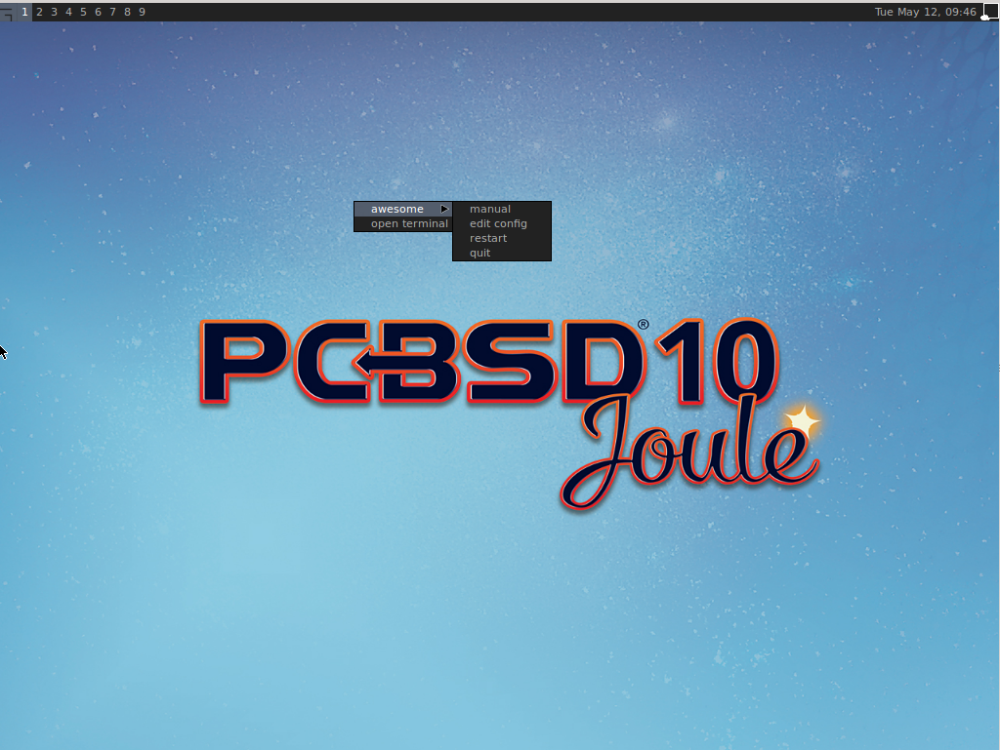

If you click :menuselection:`awesome --> manual`, the man page for awesome will open in a terminal. If you click :menuselection:`awesome --> edit config`, the
awesome configuration file will open in the :command:`nano` text editor. The numbers in the upper left corner represent virtual desktops. For example, you can
have different terminals open in each virtual desktop.

If you wish to access :ref:`Control Panel`, open a terminal and type :command:`pc-controlpanel`. To launch :ref:`AppCafe®`, type :command:`appcafe` in a terminal. To
exit this desktop and return to the login screen, use :menuselection:`awesome --> quit`.

.. index:: Cinnamon
.. _Cinnamon:

Cinnamon
========

.. note:: Cinnamon requires 3D acceleration. If your video driver does not support this, you should not install Cinnamon.

The `Cinnamon desktop environment <http://cinnamon.linuxmint.com/>`_ is developed by the Linux Mint project. :numref:`Figure %s: Cinnamon Desktop on a PC-BSD® System <cinnamon1>` shows a
screenshot of Cinnamon on a PC-BSD® |version| system with the applications "Menu" open.

.. _cinnamon1:

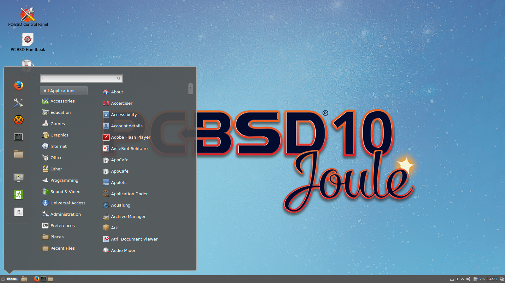

Hover over a category in the menu to see its available applications. Alternately, use the search bar to find a specific application.

Click the wrench icon in the upper left corner to access the "Cinnamon Settings" menu, where you can configure backgrounds, desktop effects, themes, applets,
desklets, extensions, menu items, the screensaver, and so on. Additional themes, applets, desklets, and extensions can be downloaded from the
`Cinnamon website <http://cinnamon.linuxmint.com/>`_.

.. index:: Fluxbox
.. _Fluxbox:

Fluxbox
=======

The `Fluxbox window manager <http://fluxbox.org/>`_ is light-weight and fast. Regardless of the window managers that you have selected to install, Fluxbox is
always available as an option in the login menu.

:numref:`Figure %s: Fluxbox on PC-BSD® <fluxbox1>` shows a screenshot of Fluxbox running on PC-BSD®. In this example, the user has launched the "Application" menu by right-clicking on the
desktop.

.. _fluxbox1:

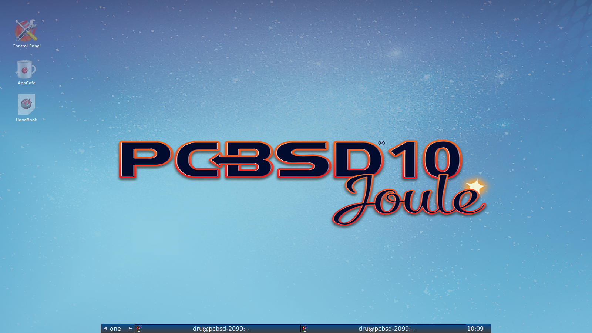

Fluxbox provides many configuration files which can be edited in order to customize the desktop. The `Features <http://www.fluxbox.org/features/>`_ page of
the Fluxbox website lists the available configuration files and links to instructions for getting the most out of Fluxbox.

The following resources are useful when customizing Fluxbox:

* `Creating the Perfect Fluxbox Desktop on Linux <https://www.linux.com/learn/tutorials/467792-creating-the-perfect-fluxbox-desktop-on-linux>`_

* `Fluxconf How-To at Tux Magazine <http://www.tuxmagazine.com/node/1000191>`_

* `Fluxbox wiki <http://fluxbox-wiki.org/>`_

* `Fluxbox FAQ <http://fluxbox-wiki.org/FAQ_en.html>`_

.. index:: FVWM
.. _FVWM:

FVWM
====

The `FVWM window manager <http://fvwm.org/>`_ is powerful and highly configurable. It supports any number of virtual desktops, each divided into multiple
pages. It also supports side title bars, including vertical text.

When you install FVWM on PC-BSD®, it also installs `FVWM-Crystal <http://gna.org/projects/fvwm-crystal/>`_. Both window managers will be added to the login
menu.

:numref:`Figure %s: FVWM Running on PC-BSD® <fvwm1>` shows the default PC-BSD® desktop if you select FVWM from the login menu. The application menu was opened by clicking the mouse anywhere
on the desktop.

.. _fvwm1: 

.. figure:: images/fvwm1.png

:numref:`Figure %s: FVWM-Crystal Running on PC-BSD® <fvwm2>` shows the default PC-BSD® desktop if you select FVWM-Crystal from the login menu. To open an xterm in FVWM-Crystal, right-click
any area of the desktop.

.. _fvwm2:

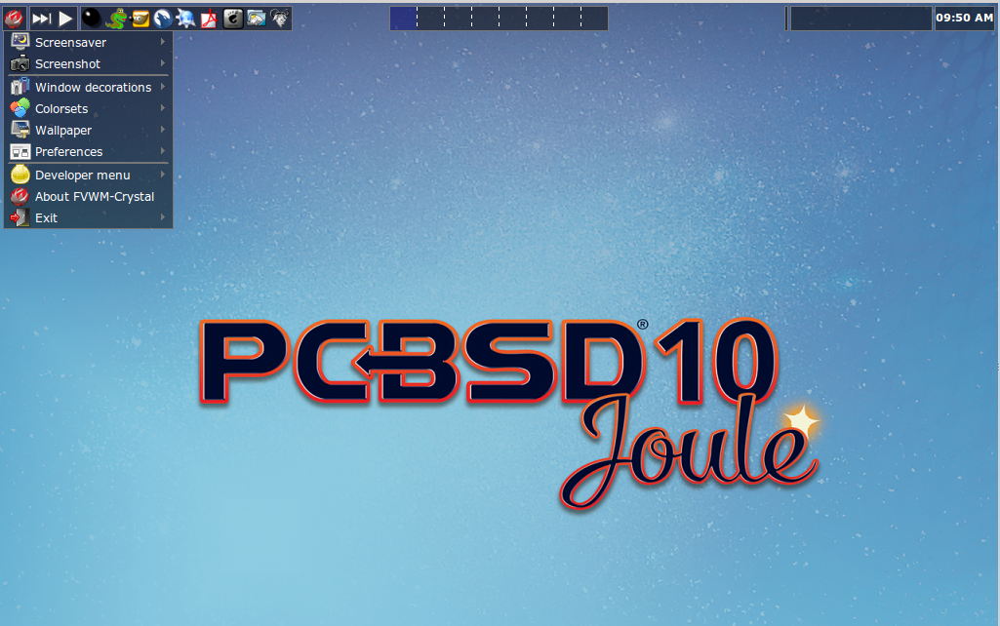

The `FVWM Documentation <http://fvwm.org/doc/unstable/index.html>`_ provides information about configuring FVWM.

.. index:: GNOME
.. _GNOME:

GNOME
=====

When you install GNOME on PC-BSD®, it installs both GNOME2 and GNOME3. GNOME2 will appear in the login menu as "GNOME Classic" and GNOME3 will be listed in
the login menu as "GNOME". 

.. note:: GNOME3 requires 3D acceleration. If your video driver does not support this, you should use GNOME2 instead.

`GNOME3 <https://www.gnome.org/>`_ is a popular desktop environment that provides many built-in utilities. :numref:`Figure %s: GNOME3 Desktop on a PC-BSD® System <gnome1>` shows a screenshot
of GNOME3 on a PC-BSD® |version| system. To access the icons shown in this screen, click "Activities" then the 9-dot icon at the bottom of the left-hand panel. Alternately, if
you know the name of an application to open, click "Activities" and type the application's name into the search bar.

.. _gnome1:

.. figure:: images/gnome1.png

:numref:`Figure %s: GNOME2 Desktop on a PC-BSD® System <gnome2>` shows a screenshot of GNOME2 on a PC-BSD® |version| system with the "Applications" menu open.

.. _gnome2:

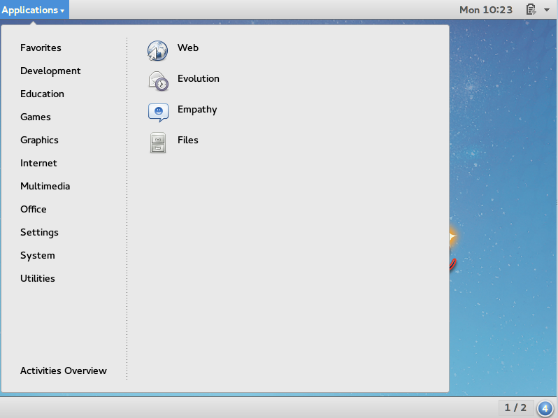

If you are new to GNOME, take some time to discover which applications best suit your needs. Some of the applications which are provided by GNOME include: 

* `Image Viewer <https://wiki.gnome.org/Apps/EyeOfGnome>`_: Eye of GNOME image viewer.
  
* `Web <https://wiki.gnome.org/Apps/Web>`_: web browser.
  
* `Brasero <https://wiki.gnome.org/Apps/Brasero>`_: CD/DVD burning software.
  
* `Videos <https://wiki.gnome.org/Apps/Videos>`_: movie player.
  
* `Evolution <https://wiki.gnome.org/Apps/Evolution>`_: email client with address book and calendar.
  
* `Files: <https://wiki.gnome.org/action/show/Apps/Nautilus?action=show&redirect=Nautilus>`_ Nautilus file manager.

.. note:: some games, such as Lights Off, Quadrapassel, and Swell Foop, require 3D acceleration. If your video driver does not support this, you will not be
   able to launch those games.

You can find additional themes and wallpapers at `gnome-look.org <http://gnome-look.org/>`_.

.. index:: i3
.. _i3:

i3
==

The `i3 tiling window manager <http://i3wm.org/>`_ is extremely lightweight and designed for users who prefer to work from the command line. Keyboard shortcuts are
provided to open xterms in order to start applications from the command line.

:numref:`Figure %s: i3 Window Manager on PC-BSD® <i3a>` shows a screenshot of i3 running on PC-BSD® |version|. 

.. _i3a:

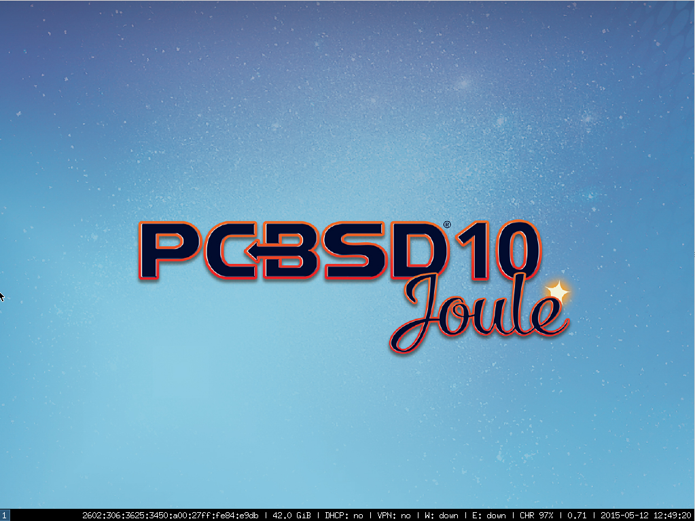

If you used :ref:`AppCafe®` to install i3, it automatically installed a default, system-wide configuration that is usually generated by :command:`i3-config-wizard`.  If you would like to
use :kbd:`Win` as a modifier key and the Dvorak layout, run :command:`pc-extractoverlay i3dvorak`.  If you instead installed using :command:`pkg` and do not want the Dvorak layout, run
:command:`pc-extractoverlay ports`.

To open an xterm, use :kbd:`Alt` :kbd:`Enter`. Windows do not provide minimize, maximize, or close buttons, so type :command:`exit` when you are finished
using an xterm. To leave the window manager and return to the login screen, type :command:`killall i3` from within an xterm.

The `i3 Users Guide <http://i3wm.org/docs/userguide.html>`_ contains the default key bindings and instructions for customizing i3.

.. index:: IceWM
.. _IceWM:

IceWM
=====

The `IceWM window manager <http://www.icewm.org>`_ is light-weight. :numref:`Figure %s: IceWM on PC-BSD® <icewm1>` shows a screenshot of IceWM running on PC-BSD®. In this example, the
user has launched the "Application" menu by clicking on the "BSD" button in the lower left corner. This menu can also be launched by right-clicking
anywhere on the desktop.

.. _icewm1:

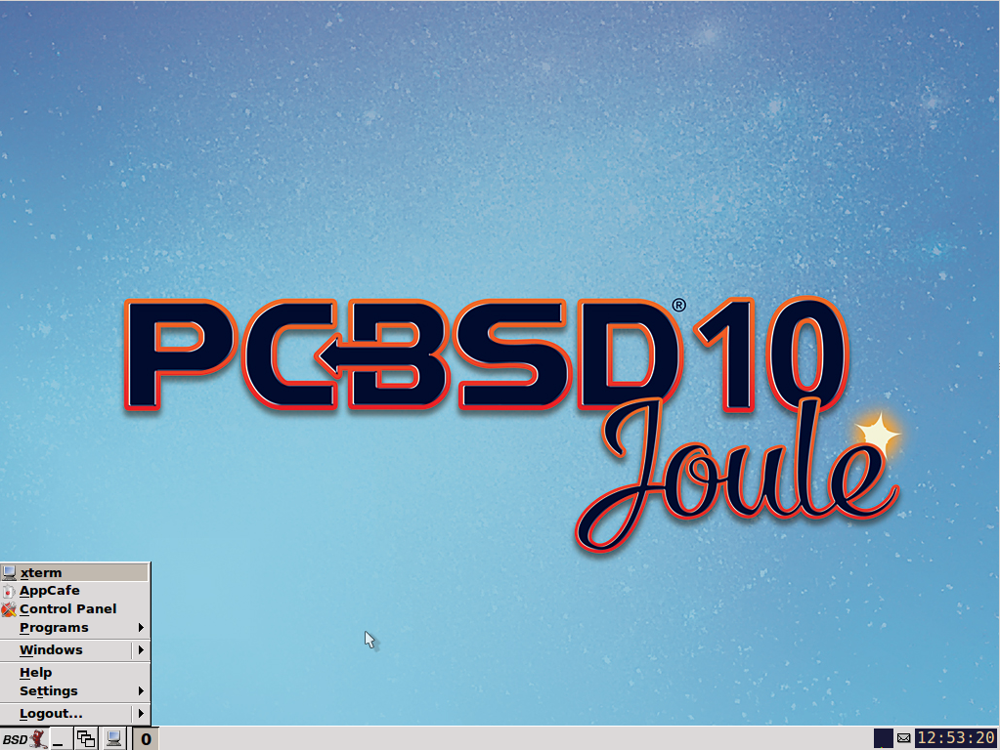

If you are new to IceWM, refer to the `IceWM FAQ and Howto <http://www.sosst.sk/doc/icewm/FAQ/>`_ for more information about configuration, customization, and
keyboard shortcuts.

.. index:: KDE
.. _KDE4:

KDE4
====

The `KDE <https://www.kde.org/>`_ desktop environment provides many features and applications. However, it is hardware intensive and may run slowly on a computer with an older processor or
a small amount of RAM. :numref:`Figure %s: Applications Menu of KDE4 <kde1>` shows a screenshot of KDE4 running on PC-BSD® |version| with the "Applications" menu open.

.. _kde1:

.. figure:: images/kde.png

Each category in the "Applications" menu contains many applications and the "Settings" and "System" categories contain many utilities for configuring your
system. If you are new to KDE4, take some time to discover which applications best suit your needs. Some of the applications which are provided by KDE4
include: 

* `Konqueror <https://docs.kde.org/stable4/en/applications/konqueror/index.html>`_: file manager, web browser, and SSH client found in
  :menuselection:`Internet --> Web Browser`.

* `Okular <https://docs.kde.org/stable4/en/kdegraphics/okular/index.html>`_: document viewer and annotator found in :menuselection:`Office --> Document Viewer`.
  Supports PDF, OpenOffice, and Postscript files.

* `Dolphin <https://docs.kde.org/trunk5/en/applications/dolphin/>`_: file manager found in :menuselection:`System --> File Manager`. Dolphin provides
  many features for manipulating files such as comments, tags, search, encryption, and archival (zip/unzip) functions.

By default, desktop effects are disabled as not all video cards support them. If your video card supports 3D effects and you would like to enable them in KDE,
go to :menuselection:`System Settings --> Desktop Effects --> General` and check the box "Enable desktop effects at startup". 

Some of KDE's games require 3D support. If your video card does not support 3D, these games will fail to start.

If you have KDE installed and are currently logged into a different window manager, you can still run any KDE application by specifying its name. For example,
type :command:`konqueror` to run the Konqueror web browser or :command:`dolphin` to access the Dolphin file manager.

`KDE Applications <https://www.kde.org/applications/>`_ includes descriptions and screenshots of all of KDE's applications as well as links to their handbooks.

`kde-look.org <http://KDE-Look.org/>`_ contains additional themes and wallpapers.

.. index:: Lumina
.. _Lumina:

Lumina
======

The `Lumina Desktop Environment <http://lumina-desktop.org/>`_ (Lumina for short) is a lightweight, XDG-compliant, BSD-licensed desktop environment that focuses specifically on streamlining
the ability to complete work while minimizing system overhead. It is specifically designed for PC-BSD® and FreeBSD, but has also been ported to many other
BSD and Linux operating systems. It is based on the Qt graphical toolkit and the Fluxbox window manager, and uses a small number of X utilities for various
tasks, such as :command:`numlockx` and :command:`xscreensaver`.

Lumina's features include: 

* Very little system overhead.

* Intelligent "favorites" system for creating quick shortcuts to applications, files, and directories.

* ZFS file restore functionality through the Insight File Manager.

* Desktop system is plugin-based, which is similar to Android or other modern operating systems.

* Simple access to operating system-specific functionality such as screen brightness, audio volume, and battery status.

:numref:`Figure %s: Lumina Desktop <lumina1>` shows a screenshot of Lumina on a PC-BSD® |version| system with the "User" button clicked.

.. _lumina1:

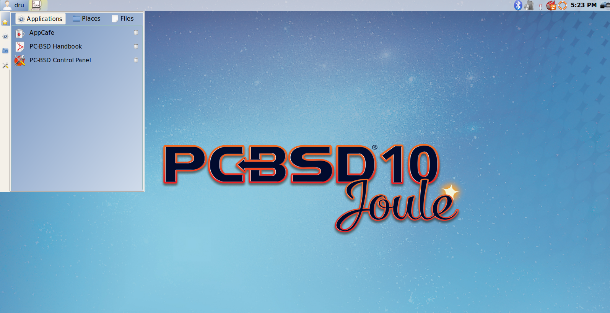

Lumina provides the following built-in utilities:

* **Lumina Configuration:** allows the user to configure every aspect of the desktop and is the recommended way to make changes. To launch this utility, click the "User" icon
  then :menuselection:`Desktop Preferences --> Desktop Appearance/Plugins` or right-click the desktop and click :menuselection:`Settings --> Desktop`, or type
  :command:`lumina-config` from an xterm.
  
* **Lumina Screenshot:** used to take screenshots of the desktop or applications and save them as PNG image files. To launch this utility, click the icon for
  :menuselection:`System Applications --> Lumina Screenshot` or type :command:`lumina-screenshot` from an xterm.
  
* **Insight File Manager:** allows the user to easily browse and modify files on the local system on a per-directory basis. To open
  Insight, right-click the desktop and select "Browse System" or type :command:`lumina-fm` from an xterm.
  
* **Lumina Search:** provides the ability to easily search for and launch applications or to quickly search for file and directories. Type :command:`lumina-search` to launch
  this utility.
  
* **Lumina Xconfig:** provides the ability to probe and manage any number of attached monitors. To start this utility, right-click the desktop and select
  :menuselection:`Settings --> Screen Configuration`, click the "User" icon then :menuselection:`Desktop Preferences --> Screen Configuration`, or type :command:`lumina-xconfig` from an
  xterm.

Refer to the `Lumina Handbook <http://lumina-desktop.org/handbook/>`_ for detailed instructions on how to configure and use Lumina and its applications.

.. index:: LXDE
.. _LXDE:

LXDE
====

The `Lightweight X11 Desktop Environment <http://lxde.org/>`_ is an excellent choice for older hardware or for users who want a complete desktop
environment without all of the overhead required by KDE or GNOME. Since it is XDG-compliant, the PC-BSD® :ref:`Control Panel`, :ref:`AppCafe®`, and
:ref:`Life Preserver` are available on the desktop and integrated into LXDE's menus.

:numref:`Figure %s: LXDE Desktop on a PC-BSD® System <lxde1>` shows a screenshot of the default LXDE installation with the LXPanel open.

.. _lxde1:

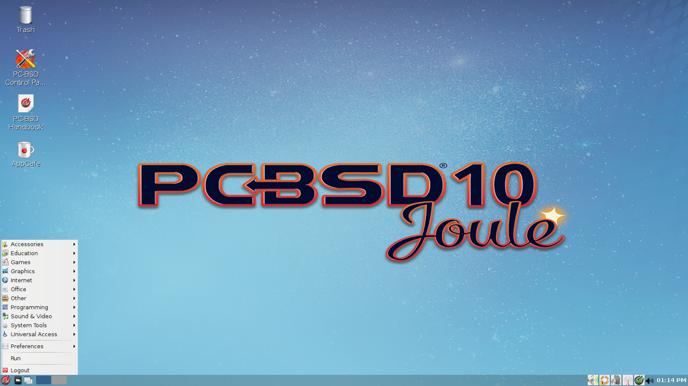

In addition to the PC-BSD® utilities, LXDE provides the following utilities: 

* `LXPanel <http://wiki.lxde.org/en/LXPanel>`_: desktop panel which is launched by clicking on the PC-BSD® icon in the lower right corner of the desktop. To
  configure the panel, right-click the PC-BSD® icon and select "Panel Settings" or "Add/Remove Panel Items" from the right-click menu.

* `PCManFM <http://wiki.lxde.org/en/PCManFM>`_: found in :menuselection:`System Tools --> File Manager PCManFM`. A file manager with features like drag and
  drop, tabbed browsing, built-in file search, file association with default application, thumbnails for images, bookmarks, and support for non-UTF-8 encoded
  filenames.

* `GPicView <http://wiki.lxde.org/en/GPicView>`_: fast image viewer found in :menuselection:`Accessories --> Image Viewer`.

* `Leafpad <http://tarot.freeshell.org/leafpad/>`_: a light-weight graphical text editor found in :menuselection:`Accessories --> Leafpad`.

* `LXTerminal <http://wiki.lxde.org/en/LXTerminal>`_: terminal emulator found in :menuselection:`Accessories --> LXTerminal` 

* `Xarchiver <http://xarchiver.sourceforge.net/>`_: archiver utility that supports the 7z, ARJ, bzip2, gzip, lzma, RAR, RPM, DEB, tar, and ZIP file formats.
  Found in :menuselection:`Accessories --> Xarchiver`.

* **epdfview**: a PDF viewer with printing support found in :menuselection:`Office --> Document Viewer`.

* `LXTask <http://wiki.lxde.org/en/LXTask>`_: task manager and system monitor found in :menuselection:`System Tools --> Task Manager`.

* `LXAppearance <http://wiki.lxde.org/en/LXAppearance>`_: a theme switcher for customizing the widgets, colors, icons, mouse cursors, and sound effects used
  by applications. Found in :menuselection:`Preferences --> Customize Look and Feel`.

* **LXInput:** a tool to configure your keyboard and mouse found in :menuselection:`Preferences --> Keyboard and Mouse`.

* :ref:`Openbox`: the window manager used by LXDE. You can configure settings such as themes, appearance, mouse, and margins by going to
  :menuselection:`Preferences --> Openbox Configuration Manager`.

.. index:: MATE
.. _MATE:

MATE
====

The `MATE desktop <http://mate-desktop.org/>`_ is a fork of the popular, but now unmaintained, GNOME2 desktop environment. MATE is under active development to
add support for new technologies while preserving the traditional GNOME desktop experience and its many built-in utilities. 
:numref:`Figure %s: MATE Desktop on a PC-BSD® System <mate1>` shows a screenshot of MATE on a PC-BSD® |version| system with the "Applications" menu open.

.. _mate1:

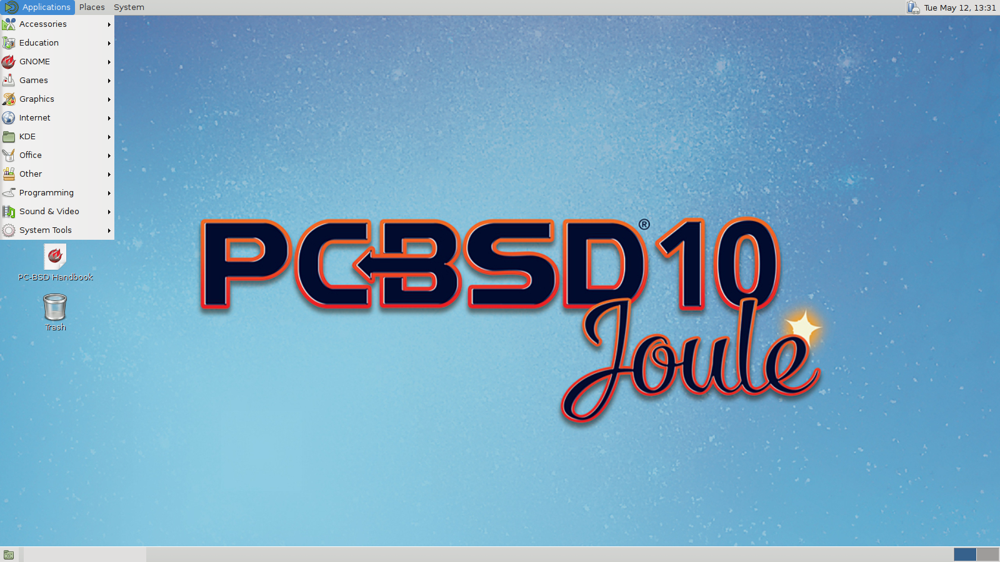

Each category in the "Applications" menu contains many applications and the :menuselection:`System --> Preferences` category contains many utilities for
configuring your system. If you are new to MATE, take some time to discover which applications best suit your needs. Some of the applications which are
provided by MATE include: 

- **Engrampa:** archive manager found in :menuselection:`Accessories --> Engrampa Archive Manager`.

- **Pluma:** text editor found in :menuselection:`Accessories --> pluma Text Editor`.

- **Atril:** PDF document viewer found in :menuselection:`Office --> Atril Document Viewer`.

- **Caja:** file manager found in :menuselection:`System Tools --> Caja`. It is a fork of Nautilus.

You can find additional themes and wallpapers at `gnome-look.org <http://gnome-look.org/>`_. 

.. index:: Openbox
.. _Openbox:

Openbox
=======

This `minimalist window manager <http://openbox.org/wiki/Main_Page>`_ is highly configurable. It is the window manager used by LXDE but can also be run separately
from LXDE.

:numref:`Figure %s: Openbox on a PC-BSD® System <openbox1>` provides a screenshot of Openbox running on a PC-BSD® system. The application menu was launched by right-clicking on an area of
the desktop.

.. _openbox1:

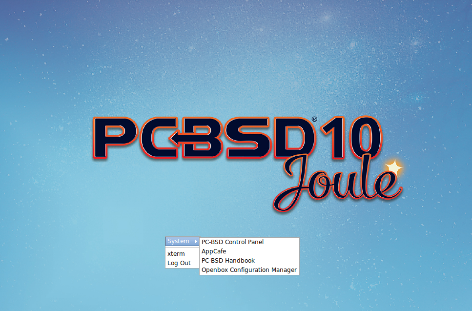

The application menu contains an entry for the Openbox Configuration Manager which can be used to customize settings such as themes, appearance, mouse, and
margins. A screenshot of this configuration utility is shown in :numref:`Figure %s: Openbox Configuration Manager <openbox2>`. 

.. _openbox2:

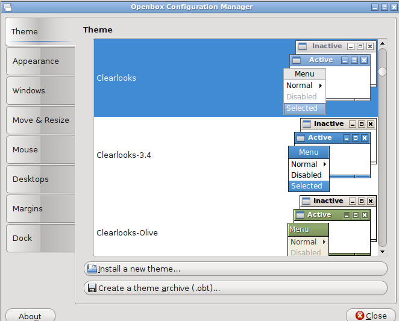

A list of websites containing additional themes is available from the `Openbox wiki <http://openbox.org/wiki/Openbox:Themes>`_.

.. index:: Ratpoison
.. _Ratpoison:

Ratpoison
=========

The `simple Ratpoison window manager <http://www.nongnu.org/ratpoison/>`_ has no fat library dependencies, fancy graphics, nor window decorations.

:numref:`Figure %s: Ratpoison on a PC-BSD® System <ratpoison1>` provides a screenshot of Ratpoison running on a PC-BSD® system:

.. _ratpoison1:

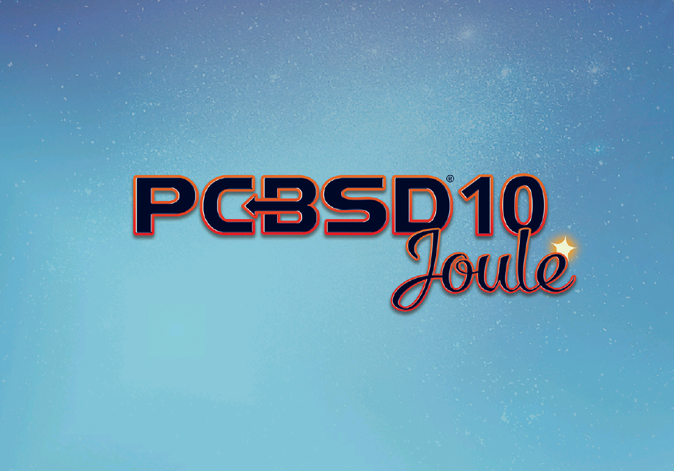

Ratpoison uses keyboard shortcuts. To view the shortcuts, press :kbd:`Ctrl-t` then :kbd:`?`. To leave this help screen, press :kbd:`Enter`.

To open an xterm, press :kbd:`Ctrl-t` then :kbd:`c`. Type :command:`exit` to close the xterm. Type :command:`killall ratpoison` within an xterm to leave
Ratpoison and return to the login screen.

The `Ratpoison wiki <https://wiki.archlinux.org/index.php/Ratpoison>`_ contains an FAQ and tips for setting keyboard shortcuts.

.. index:: spectrwm
.. _spectrwm:

spectrwm
========

The `spectrwm minimalist window manager <https://github.com/conformal/spectrwm/wiki>`_, formerly known as scrotwm, is written by OpenBSD hackers. It
provides keyboard shortcuts, a configuration file, and assumes that the user prefers to use the command line. If you have not used spectrwm before, spend some
time reading through its `man page <https://opensource.conformal.com/cgi-bin/man-cgi?spectrwm>`_ first.

To launch applications within spectrwm, start an xterm by pressing :kbd:`Alt+Shift+Enter`. Once you have an xterm, you can start any program you wish. For
example, to start :ref:`Control Panel` type :command:`pc-controlpanel`. spectrwm does not provide minimize, maximize, or close buttons within its windows. To
close a GUI application, use :kbd:`CTRL-c` within the xterm you used to launch the application. To leave this desktop, type :command:`killall spectrwm` from
an xterm.

.. index:: Windowlab
.. _Windowlab:

WindowLab
=========

The `WindowLab window manager <http://nickgravgaard.com/windowlab/>`_ is small and simple. It uses a window resizing mechanism that allows one or many edges
of a window to be changed in one action, and an innovative menubar that shares the same part of the screen as the taskbar. It follows a click-to-focus but not
raise-on-focus policy. This means that when a window is clicked it gets focus, but it is not redrawn to obscure other windows. This allows one, for example,
to switch to a terminal to enter commands while keeping documentation visible in a web browser.

Use the right mouse button to display the top menu panel. Use the left mouse button or hover over a taskbar entry to open that application.

To add the applications you use most often to the menubar, select "Edit menu" while holding the right mouse button.

To leave the WindowLab session, select "Quit" from the menubar.

.. index:: Window Maker
.. _Window Maker:

Window Maker
============

The `Window Maker window manager <https://windowmaker.org/>`_ is light-weight and designed to reproduce the look and feel of the :wikipedia:`NEXTSTEP` user interface.

:numref:`Figure %s: Window Maker on PC-BSD® <windowmaker1>` shows a screenshot of Window Maker running on PC-BSD®. In this example, the user launched the "Application" menu by right-clicking
an area of the desktop.

.. _windowmaker1:

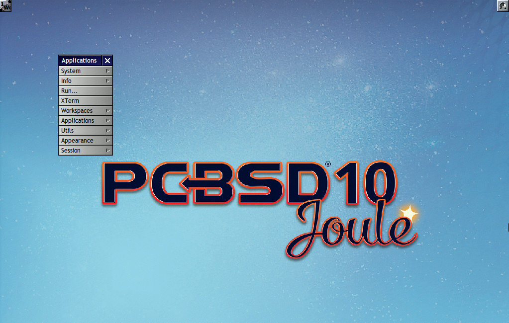

In addition to the PC-BSD® utilities, Window Maker provides the following applications: 

* **WPrefs**: located in :menuselection:`Appearance --> Preferences Utility`. Allows you to configure window focus, window placement, menu alignment, icons,
  keyboard actions, mouse, fonts, and various other window manager settings.

* `wmakerconf <http://wmakerconf.sourceforge.net/>`_: found in :menuselection:`Utils --> wmakerconf`. Allows you to fine-tune your menu entries as well as your desktop's appearance, themes,
  background, mouse, and special effects. :numref:`Figure %s: Editing the Application Menu Using wmakerconf <windowmaker2>` shows wmakerconf with the "Menu" button selected.

.. _windowmaker2:

.. figure:: images/windowmaker2.png

.. index:: Window Maker
.. _Working with the Dock:

Working with the Dock 
----------------------

Window Maker uses a dock to store application shortcuts. The dock appears as a series of icons in the upper right corner of the desktop. Docked applications
always show on the desktop, even after you close an application or close and restart your Window Maker session.

Whenever you start an application, an icon will appear in the lower left corner of the screen. You can move that icon elsewhere on the desktop with your
mouse. If you right-click the icon, you have the option to hide/unhide the icon, set icon (change its picture), or kill the application. If you drag the icon
onto the dock, it will remain on the desktop.

Once an icon is docked, a settings menu is added to the icon's right-click menu. :numref:`Figure %s: Configuring an Icon <windowmaker3>` demonstrates how to configure an icon for
:ref:`AppCafe®`.

.. _windowmaker3:

.. figure:: images/windowmaker3.png

You will find the icons for :ref:`AppCafe®` and :ref:`Control Panel` in :file:`/usr/local/share/pcbsd/pc-controlpanel/icons`. Choose the 64x64 versions as
this is the size that Window Maker users. The application name for :ref:`AppCafe®` is :command:`appcafe` and for :ref:`Control Panel` it is
:command:`pc-controlpanel`.

.. index:: Window Maker
.. _DockApps:

DockApps
--------

Window Maker supports dockapps which are applications that were designed to work with Window Maker but which are separate from the Window Maker project.
Dockapps tend to be small and designed to perform a particular function. For example, there are clocks, weather applications, and CPU monitors. Most dockapps
have been ported to FreeBSD and the port name always begins with "wm". You can search for these at `freshports.org <http://www.freshports.org/>`_ by entering a
"Short Description" containing "dockapp". 

If your favorite dockapp has not been ported to FreeBSD, you can request that a port be created on the Ports Requests forum using these
`instructions <https://forums.pcbsd.org/thread-12336.html>`_. 

.. index:: XFCE
.. _XFCE4:

XFCE4
=====

`XFCE <http://www.xfce.org/>`_ is a lightweight desktop environment that aims to be low on system resources and fast, while still being visually appealing and
user friendly. More information about XFCE, including usage tips, can be found at the `XFCE FAQ <http://wiki.xfce.org/faq>`_.

The first time you start XFCE4, you will see the message shown in :numref:`Figure %s: Panel Welcome Message <xfce1>`.

.. _xfce1:

.. figure:: images/xfce1.png

In XFCE, a `panel <http://docs.xfce.org/xfce/xfce4-panel/start>`_ is a bar which can hold many items such as application launchers, window lists, a clock, a
notification area, and application menus. Your initial panel setup options are: 

* **Migrate old config:** select this option if you wish to have a single panel with an application launcher and other icons as shown in 
  :numref:`Figure %s: XFCE with Complete Panel Migrated From Old Config <xfce2>`. The application launcher menu may be accessed by the fireball icon in the lower left, or by right-clicking
  the desktop.

* **Use default config:** this option will install a small, minimal panel centered on the bottom, as seen in :numref:`Figure %s: XFCE with Minimal Panel Using Default Config <xfce3>`. The
  application launcher menu may be accessed by the fireball icon in the top bar, or by a right-click on the desktop.

* **One empty panel:** this option will install a panel with no icons. The application menu is available by right-clicking the desktop.

If you wish to change your configuration choice at a later time, reset the panel using :menuselection:`Applications --> Settings --> Settings Editor`, shown
in :numref:`Figure %s: Using Settings Editor to Reset Panel <xfce4a>`. Right-click the entry for "xfce4-panel" and click "Reset Channel". 

.. _xfce2:

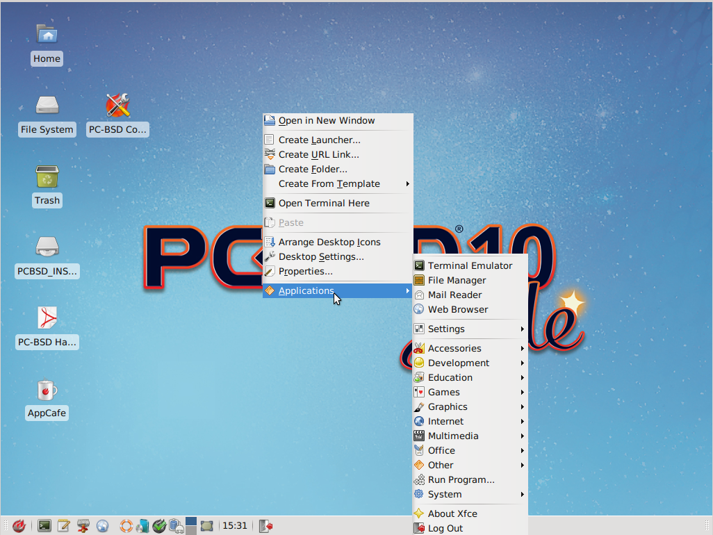

.. _xfce3:

.. figure:: images/xfce3.png

.. _xfce4a:

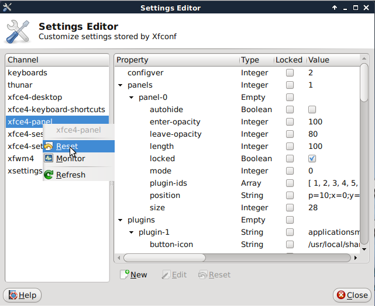

In addition to the PC-BSD® utilities, XFCE provides the following utilities: 

* `Xfdesktop <http://docs.xfce.org/xfce/xfdesktop/start>`_: desktop manager found in :menuselection:`Settings --> Desktop`. Sets the background image, provides a
  right-click menu to launch applications, and can show files (including application launchers) or iconified windows.

* `Xfwm4 <http://docs.xfce.org/xfce/xfwm4/start>`_: window manager found in :menuselection:`Settings --> Window Manager`. It provides window decorations, virtual
  desktops, multiscreen mode, transparency and a keyboard shortcuts editor.

* `Ristretto <http://goodies.xfce.org/projects/applications/ristretto>`_: fast and light-weight picture viewer found in
  :menuselection:`Graphics --> Ristretto Image Viewer`.

* `Midori <http://www.twotoasts.de/index.php/midori/>`_: light-weight graphical browser found in :menuselection:`Internet --> Midori`.

* `Xfburn <http://goodies.xfce.org/projects/applications/xfburn>`_: CD/DVD burning tool found in :menuselection:`Multimedia --> Xfburn`.

* `Orage <http://www.kolumbus.fi/~w408237/orage/>`_: calendar and reminder daemon found in :menuselection:`Office --> Orage Calendar`.

* `Thunar <http://docs.xfce.org/xfce/thunar/start>`_: file manager found in :menuselection:`System --> Thunar File Manager`.

A list of recommended applications for XFCE can be found on the `XFCE wiki <http://wiki.xfce.org/recommendedapps>`_. 

.. index:: XFCE
.. _XFCE Plugins:

XFCE Plugins 
-------------

XFCE supports many plugins which provide additional applications that are separate from the official XFCE distribution. You can browse for plugins and read
descriptions for each at the XFCE `goodies website <http://goodies.xfce.org/projects/start>`_.

After installing a plugin, go to :menuselection:`Settings --> Panel --> Items` and click the "+" button in the right column to see the "Add New Items" screen
shown in :numref:`Figure %s: Adding a Plugin to the Panel <xfce5>`. 

.. _xfce5:

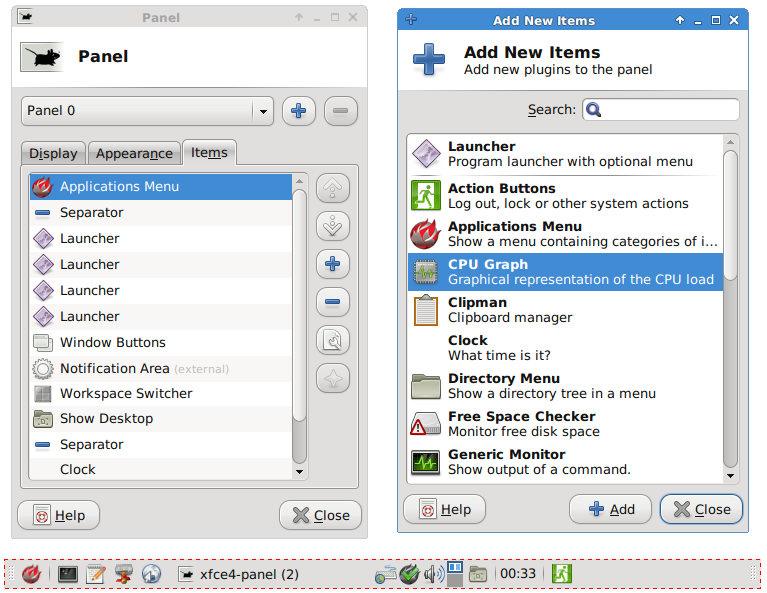

Select your new plugin from the list, and click the "+Add" button. It will immediately be added as an icon in the panel.
