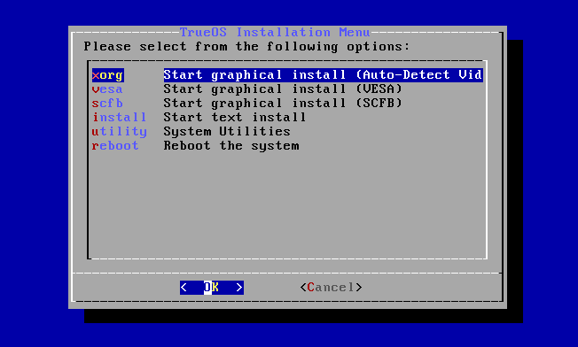
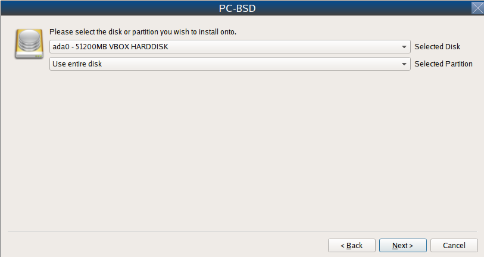
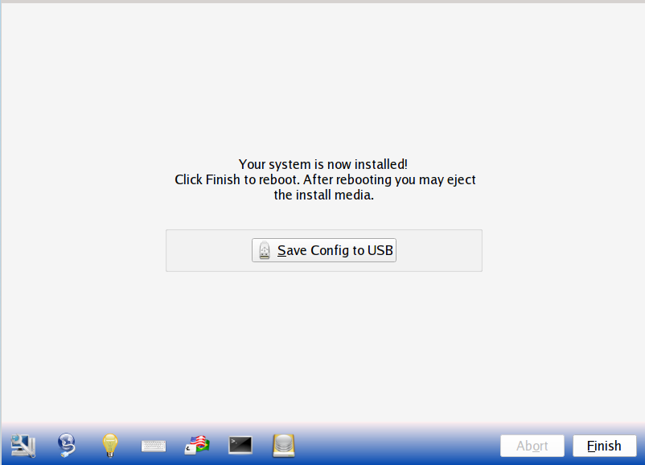

.. index:: installation
.. _Installing TrueOS®:

Installing TrueOS®
*******************

This chapter describes how to use the graphical installer to install a graphical desktop directly onto a hard drive or into a virtual machine using virtualization software such as
`VirtualBox <https://www.virtualbox.org/>`_. If you have downloaded the CD version of TrueOS® or prefer to use a text based installer, instead use the
instructions in :ref:`Using the Text Installer`.

To begin the TrueOS® installation, insert the prepared boot media and boot the system. If the computer boots into an existing operating system instead of the
installer, reboot and check your computer's BIOS program to ensure that the drive containing the installation media is listed first in the boot order. Save
your BIOS changes and reboot.

As the system boots it will display the menu shown in :numref:`Figure %s: Initial Boot Menu <install1b>`. Typically, you can just press :kbd:`Enter` or wait for this menu to go by and the
system will continue to boot. 

.. _install1b:

.. figure:: images/install1b.png

Next, the "TrueOS Installation Menu", shown in :numref:`Figure %s: TrueOS® Installer Boot Menu <install1d>`, will be displayed. If you press any key (other than :kbd:`Enter`) this
screen will pause so that you can review its options. If you do not pause this screen, it will automatically boot into the **xorg** option after a few seconds. This menu offers the
following options:

* **xorg:** starts a graphical installer that will auto-detect the driver required by the video hardware.

* **vesa:** starts the graphical installer with the VESA driver loaded. Select this option if the "xorg" option hangs when loading the graphics driver.

* **scfb:** starts the graphical installer with the SCFB driver loaded. Select this option if a UEFI system hangs when loading the graphics driver as it provides a
  nicer display than the "vesa" driver. Before selecting this option, double-check that CSM has been disabled in the BIOS.
  
* **install:** starts the text-based installer as described in :ref:`Using the Text Installer`.

* **utility:** starts the system utilities as described in :ref:`Using the System Utilities Menu`.

* **reboot:** exits the installer and reboots the system.

.. _install1d:

To select an option from this menu, use the arrow keys to highlight the option, then press :kbd:`Enter` to continue to boot into that option.

The rest of this chapter describes the screens of the graphical installer. If you have problems booting into the graphical installer, refer to :ref:`Installation Troubleshooting`. 

.. index:: installation
.. _Language Selection Screen:

Language Selection Screen
=========================

The first graphical installer screen, seen in :numref:`Figure %s: Welcome and Language Selection Screen <install2b>`, indicates that the installer successfully loaded and is ready to present
you with its options.

.. _install2b:

.. figure:: images/install2b.png

Starting on the left-hand side, the icons in the bottom navigation area allow you to: 

* access :ref:`Hardware Compatibility` information 

* manage :ref:`Network Configuration` for a network installation or system restore

* read that screen's Help text 

* use the onscreen keyboard 

* switch between the US keyboard layout and a user selected layout

* access the emergency shell described in :ref:`Using the System Utilities Menu`

* access the :ref:`Disk Manager` utility

* abort the installation

* navigate to a previous or upcoming screen 

Hover over an icon to view its description in the tip bar at the bottom of the screen.

.. note:: the default keyboard layout can be changed now, during the post-installation :ref:`Language Screen`, or when :ref:`Logging In`.

A button is also provided to "Load config from USB". If you have saved the configuration from a previous installation, it can be loaded at this time from a
FAT-formatted USB stick.

By default, TrueOS® menus will display in English, unless you select another language in the drop-down menu in this screen. The menus in TrueOS® have been
translated to several different languages and you can see the status of your native language at the `PC-BSD® Translation Site <http://translate.pcbsd.org/>`_.
If your language does not show 100% translation at this website, it means that not all of the menus have been translated yet and that the untranslated menus will
be displayed in English. Refer to :ref:`Become a Translator` if you would like to assist in translating the graphical menus to your native language.

.. note:: small screens may not display the entire installer window, which means that the buttons at the bottom of the window are hidden and inaccessible.
   There are two solutions for this situation: press :kbd:`Alt` while dragging the window with the mouse, or press :kbd:`Alt+N` to select the next button of
   the window. 

When you are finished reviewing this screen, click the "Next" button to go to the next installation screen.

.. index:: installation
.. _System Selection Screen:

System Selection Screen
=======================

The "System Selection" screen, shown in :numref:`Figure %s: System Selection Screen <install3c>`, allows you to install a desktop or a server operating system. It also
can be used for :ref:`Restoring the Operating System`. This chapter concentrates on a desktop installation. Refer to :ref:`Install a Server` for instructions on how to
install a command-line only server.

.. _install3c: 

.. figure:: images/install3c.png

By default, "PC-BSD (Graphical desktop)" will be selected and the :ref:`Lumina Desktop` will be installed. You can install additional software post-installation, using
:ref:`AppCafe®`.

To install the desktop, click the "Next" button to proceed to the next screen.

.. note:: when installing a desktop, the installer will display a pop-up message if it cannot find a physical or virtual disk that does not meet the
   recommended minimum size of 50GB. It will let you continue an installation on a smaller disk, but you may run into disk space issues on smaller disks.

.. index:: installation
.. _Disk Selection Screen:

Disk Selection Screen
=====================

The "Disk Selection" screen, seen in :numref:`Figure %s: Disk Selection Screen <install5b>`, summarizes the default disk configuration.

.. _install5b:

.. figure:: images/install5b.png

.. warning:: by default, TrueOS® will assume that you wish to install on the entire first disk. If you are installing TrueOS® as the only operating system
   on your computer, simply click "Next" to start the installation. However, if this is not your intent, review the rest of this section to determine how to
   layout your disk. If you plan on booting TrueOS® with another operating system, you should also review the section on :ref:`Dual Booting`.

If you wish to select which disk or partition to install TrueOS® into, click the "Customize" button to start the Disk Setup Wizard, shown in
:numref:`Figure %s: Disk Setup Wizard <install6b>`. 

.. _install6b: 

.. figure:: images/install6b.png

The wizard provides three modes of operation. The rest of this section describes these modes in detail.

* **Basic:** (default) select this mode if you wish to specify which partition or disk to install to.

* **Advanced:** select this mode if you wish to specify the installation partition or disk, use GPT partitioning, use a UEFI BIOS, force the block size,
  change the default ZFS pool name, specify the filesystem layout, add a log or cache device, or encrypt the disk.

* **FreeBSD Expert:** select this mode if you prefer to drop down to a shell to manually enter the commands to setup your disk.

.. warning:: regardless of the mode that you select, once the disk wizard completes and you click "Next" at the disk "Summary" screen, a pop-up window will
   ask if you would like to start the installation. Be sure to review the disk summary before clicking "Yes" and starting the installation. The disk "Summary"
   screen is your **very last chance** to make sure that you are ready. Once you click "Yes", the selected hard drive or partition will be formatted and any
   data it contains will be lost.

Once you have finished configuring your disks, you can save the finished configuration to re-use it at a later time. Insert a FAT-formatted USB stick and
click "Save Config to USB".

.. index:: installation
.. _Basic Mode:

Basic Mode 
-----------

If you select "Basic" mode, the wizard will display the screen shown in :numref:`Figure %s: Select a Disk or Partition <install7b>`. 

.. _install7b:

By default, the first hard disk will be selected. If you wish to install on a different disk, use the "Selected Disk" drop-down menu to select the disk to
install into.

By default, the entire selected disk will be formatted. If the disk has been divided into partitions or you have an area of free space, use
the "Selected Partition" drop-down menu to select the desired partition.

By default, the system will use the FreeBSD boot loader as it supports boot environments. If you will be dual-booting the system and prefer to use the GRUB bootloader, check the box
to "Use GRUB bootloader".

.. note:: TrueOS® will only install into a primary partition, a GPT partition, or an area of free space. That is, you can not install TrueOS® into a secondary or an extended partition.
   If you wish to create an area of free space to install into, refer to :ref:`Creating Free Space` for instructions.

Once you have selected the disk and partition, click "Next" to return to the disk "Summary" screen so that you can review your selections. If you wish to
change anything, use the "Back" button to return to a previous screen. Otherwise, click "Finish" to leave the wizard. Click "Next" then "Yes" to start the
installation.

.. index:: installation
.. _Advanced Mode:

Advanced Mode 
--------------

If you select advanced mode, the wizard will display the screen shown in :numref:`Figure %s: Advanced Mode Options <install8c>`. 

.. _install8c:

.. figure:: images/install8c.png

This screen provides the following options: 

* **Selected Disk:** select the disk to install into.

* **Selected Partition:** select the desired partition or area of free space.

.. note:: TrueOS® will only install into a primary partition, a GPT partition, or an area of free space. That is, you can not install TrueOS® into a secondary or an extended partition.
   If you wish to create an area of free space to install into, refer to :ref:`Creating Free Space` for instructions.

* **Partition Scheme:**  the default of "GPT (Best for new hardware)" is a partition table layout that supports larger partition sizes than the traditional "MBR (Legacy)" layout.
  **If your installation disk/partition is larger than 2 TB, the GPT option must be selected**. Since some older motherboards do
  not support GPT, if the installation fails, try again with "MBR (Legacy)" selected. When in doubt, try the default selection first. Note that this section will
  not appear if you specify a partition rather than "Use entire disk" in the "Selected Partition" drop-down menu.

* **Target Installation:** when installing to non-UEFI systems, keep the default selection of "BIOS (Legacy motherboards)". If the hardware supports UEFI, change the
  selection to "UEFI (Modern motherboards)". Note that this section will not appear if you specify a partition rather than "Use entire disk" in the "Selected Partition"
  drop-down menu.
  
* **ZFS pool name:** if you wish to use a pool name other than the default of *tank*, check this box and input the name of the pool. Note that *root* is a reserved term and can not be used
  as a pool name.

* **Force ZFS 4k block size:** this option should only be checked if you know for sure that the disk supports 4k, even though it lies and reports its size as
  512b. Use with caution as it may cause the installation to fail.

* **Use GRUB bootloader:** by default, the system will use the FreeBSD boot loader as it supports boot environments. Check this box if you will be dual-booting the system and prefer to use
  the GRUB bootloader.

After making your selections click "Next" to access the ZFS configuration screens. The rest of this section provides a ZFS overview and demonstrates how to customize the ZFS layout. 

.. index:: ZFS
.. _ZFS Overview:

ZFS Overview 
^^^^^^^^^^^^^

ZFS is an enterprise grade file-system, which provides many features including: support for high storage capacities, high reliability, the ability to quickly
take snapshots, boot environments, continuous integrity checking and automatic repair, RAIDZ which was designed to overcome the limitations of hardware RAID,
and native NFSv4 ACLs.

If you are new to ZFS, the Wikipedia entry on :wikipedia:`ZFS` provides an excellent starting point to learn about its features. Additionally,
`FreeBSD Mastery: ZFS <https://www.michaelwlucas.com/nonfiction/freebsd-mastery-zfs>`_  by Michael W Lucas and Allan Jude is a very helpful resource and is more specific to ZFS as it is
implemented in FreeBSD.

These resources are also useful to bookmark and refer to as needed: 

* `ZFS Evil Tuning Guide <http://www.solarisinternals.com/wiki/index.php/ZFS_Evil_Tuning_Guide>`_

* `FreeBSD ZFS Tuning Guide <https://wiki.FreeBSD.org/ZFSTuningGuide>`_

* `ZFS Best Practices Guide <http://www.solarisinternals.com/wiki/index.php/ZFS_Best_Practices_Guide>`_

* `ZFS Administration Guide <http://docs.oracle.com/cd/E19253-01/819-5461/index.html>`_

* `Becoming a ZFS Ninja (video) <https://blogs.oracle.com/video/entry/becoming_a_zfs_ninja>`_

* `blog post explaining how ZFS simplifies the storage stack <https://blogs.oracle.com/bonwick/entry/rampant_layering_violation>`_

The following is a glossary of terms used by ZFS: 

**Pool:** a collection of devices that provides physical storage and data replication managed by ZFS. This pooled storage model eliminates the concept of
volumes and the associated problems of partitions, provisioning, wasted bandwidth, and stranded storage. Thousands of filesystems can draw from a common
storage pool, each one consuming only as much space as it actually needs. The combined I/O bandwidth of all devices in the pool is available to all
filesystems at all times. The
`Storage Pools Recommendations <http://www.solarisinternals.com/wiki/index.php/ZFS_Best_Practices_Guide#ZFS_Storage_Pools_Recommendations>`_ of the ZFS Best
Practices Guide provides detailed recommendations for creating the storage pool.

**Mirror:** a form of RAID where all data is mirrored onto two or more disks, creating a redundant copy should a disk fail.

**RAIDZ:** ZFS software solution that is equivalent to RAID5 in that it allows one disk to fail without losing data. Requires a minimum of 3 disks.

**RAIDZ2:** double-parity ZFS software solution that is similar to RAID6 in that it allows two disks to fail without losing data. Requires a minimum of 4
disks.

**RAIDZ3:** triple-parity ZFS software solution. RAIDZ3 offers three parity drives and can operate in degraded mode if up to three drives fail with no
restrictions on which drives can fail.

**Dataset:** once a pool is created, it can be divided into datasets. A dataset is similar to a folder in that it supports permissions. A dataset is also
similar to a filesystem in that you can set properties such as quotas and compression.

**Snapshot:** a read-only point-in-time copy of a filesystem. Snapshots can be created quickly and, if little data changes, new snapshots take up very little
space. For example, a snapshot where no files have changed takes 0MB of storage, but if you change a 10GB file it will keep a copy of both the old and the new
10GB version. Snapshots provide a clever way of keeping a history of files, should you need to recover an older copy or even a deleted file. For this reason,
many administrators take snapshots often (e.g. every 15 minutes), store them for a period of time (e.g. for a month), and store them on another system. Such a
strategy allows the administrator to roll the system back to a specific time or, if there is a catastrophic loss, an off-site snapshot can restore the system
up to the last snapshot interval (e.g. within 15 minutes of the data loss). Snapshots can be cloned or rolled back, but the files on the snapshot can not be
accessed independently.

**Clone:** a writable copy of a snapshot which can only be created on the same ZFS volume. Clones provide an extremely space-efficient way to store many
copies of mostly-shared data such as workspaces, software installations, and diskless clients. Clones do not inherit the properties of the parent dataset, but
rather inherit the properties based on where the clone is created in the ZFS pool. Because a clone initially shares all its disk space with the original
snapshot, its used property is initially zero. As changes are made to the clone, it uses more space.

**ZIL:** is effectively a filesystem journal that manages writes. The ZIL is a temporary storage area for sync writes until they are written asynchronously
to the ZFS pool. If the system has many sync writes, such as from a database server, performance can be increased by adding a dedicated log device known as a
SLOG (Secondary LOG). If the system has few sync writes, a SLOG will not speed up writes. When creating a dedicated log device, it is recommended to use a
fast SSD with a supercapacitor or a bank of capacitors that can handle writing the contents of the SSD's RAM to the SSD. If you decide to create a dedicated
log device, the SSD should be half the size of system RAM as anything larger than that is unused capacity. Note that a dedicated log device can not be shared
between ZFS pools and that the same device cannot hold both a log and a cache device.

**L2ARC:** ZFS uses a RAM cache to reduce read latency. If an SSD is dedicated as a cache device, it is known as an L2ARC and ZFS uses it to store more reads which
can increase random read performance. However, adding a cache device will not improve a system with too little RAM and will actually decrease performance as
ZFS uses RAM to track the contents of L2ARC. RAM is always faster than disks, so always add as much RAM as possible before determining if the system would
benefit from a L2ARC device. If you have a lot of applications that do large amounts of random reads on a dataset small enough to fit into the L2ARC, read
performance may be increased by adding a dedicated cache device. SSD cache devices only help if your working set is larger than system RAM, but small enough
that a significant percentage of it will fit on the SSD. Note that a dedicated L2ARC device can not be shared between ZFS pools.

.. index:: ZFS
.. _ZFS Layout:

ZFS Layout 
^^^^^^^^^^^

In "Advanced Mode", the disk setup wizard allows you to configure your ZFS layout. The initial ZFS configuration screen is seen in :numref:`Figure %s: ZFS Configuration <install9b>`. 

.. _install9b:

.. figure:: images/install9b.png

If your system contains multiple drives and you would like to use them to create a ZFS mirror or RAIDZ*, check the box "Add additional disks to zpool" which
will enable this screen. Any available disks will be listed in the box below the "ZFS Virtual Device Mode" drop-down menu. Select the desired level of redundancy,
then the desired number of disks.

.. note:: the TrueOS® installer requires you to use entire disks (not partitions) when adding additional disks to the pool.

While ZFS will let you use disks of different sizes, this is discouraged as it will decrease storage capacity and ZFS performance.

The TrueOS® installer supports the following ZFS configurations: 

* **mirror:** requires a minimum of 2 disks.

* **RAIDZ1:** requires a minimum of 3 disks. For best performance, a maximum of 9 disks is recommended.

* **RAIDZ2:** requires a minimum of 4 disks. For best performance, a maximum of 10 disks is recommended.

* **RAIDZ3:** requires a minimum of 5 disks. For best performance, a maximum of 11 disks is recommended.

* **stripe:** requires a minimum of 2 disks.
  **Note that a stripe does NOT provide ANY redundancy. If any disk fails in a stripe, all data in the pool is lost!**

The installer will not let you save a configuration if your system does not meet the minimum number of disks required by that configuration. As you select a
configuration, a message will indicate how many more disks you need to select.

To use multiple disks, select the type of configuration from the "ZFS Virtual Device Mode" drop-down menu, then check the box for each disk that you would
like to add to that configuration. When finished, click the "Next" button to see the screen shown in :numref:`Figure %s: Add L2ARC or ZIL <install10b>`. 

.. _install10b:

.. figure:: images/install10b.png

This screen can be used to specify an SSD to use as an L2ARC or a secondary log device. Any available devices will be listed in the boxes in this screen.
Note that a separate SSD is needed for each type of device. Refer to the descriptions for ZIL and L2ARC in the :ref:`ZFS Overview` to determine if your system
would benefit from any of these devices before adding them in this screen. When finished, click "Next" to see the screen shown in :numref:`Figure %s: Configure Encryption <install11b>`.

.. _install11b:

.. figure:: images/install11b.png

This screen can be used to configure full-disk encryption which is meant to protect the data on the disks should the system itself be lost or stolen. This
type of encryption prevents the data on the disks from being available during bootup, unless the correct passphrase is typed at the bootup screen. Once the
passphrase is accepted, the data is unencrypted and can easily be read from disk.

To configure full disk encryption, check the box "Encrypt disk with GELI". This option will be greyed out if "GPT (Best for new hardware)" is not selected as GELI
does not support MBR partitioning at this time. If needed, use the "Back" button to go back to the :ref:`Advanced Mode` screen and select the option "GPT (Best for
new hardware)". Once the "Encrypt disk with GELI" box is checked, input a good passphrase twice into the "Password" fields. This password should be long and something that you will
not forget, but hard for other users, especially those who know you, to guess.

.. warning:: if you ever forget this passphrase, you will be unable to decrypt the disks and will lose access to their data!

When finished, click "Next" to move on the screen shown in :numref:`Figure %s: Default ZFS Layout <install12b>`.

.. _install12b: 

.. figure:: images/install12b.png

Regardless of how many disks you selected for your ZFS configuration, the default layout will be the same. ZFS does not require separate partitions for
:file:`/usr`, :file:`/tmp`, or :file:`/var`. Instead, you create one ZFS partition (pool) and specify a mount for each dataset. A :file:`/boot` partition is
not mandatory with ZFS as the TrueOS® installer puts a 64k partition at the beginning of the drive.

.. warning:: **do not remove any of the default mount points** as they are used by TrueOS®.

You can use the "Add" button to add additional mount points. You will only be prompted for the name of the mount point as size is not limited at creation
time. Instead, the data on any mount point can continue to grow as long as space remains within the ZFS pool.

If you wish to set the swap size, click the "Swap Size" button. This will prompt you to enter a size in MB. If you have created a RAIDZ or mirror, a swap
partition of the specified size will be created on each disk and mirrored between the drives. For example, if you specify a 2048MB swap size, a 2GB swap
partition will be created on all of the specified disks, yet the total swap size will be 2GB, due to redundancy.

If you right-click any mount point, you can toggle between enabling or disabling any of the following ZFS properties.

* **atime:** when set to "on", controls whether the access time for files is updated when they are read. When set to "off", this property avoids producing
  write traffic when reading files and can result in significant performance gains, though it might confuse mailers and some other utilities.

* **canmount:** if set to "off", the filesystem can not be mounted.

* **checksum:** automatically verifies the integrity of the data stored on disks.
  **Setting this property to "off" is highly discouraged.**

* **compression:** if set to "on", automatically compresses stored data to conserve disk space.

* **exec:** if set to "off", processes can not be executed from within this filesystem.

* **setuid:** if set to "on", the set-UID bit is respected.

Once you click "Next", the wizard will show a summary of your selections. If you wish to change anything, use the “Back” button to return to a previous
screen. Otherwise, click "Finish" to leave the wizard and return to the "Disk Selection" screen.

.. index:: install
.. _FreeBSD Expert Mode:

FreeBSD Expert Mode
-------------------

If you select FreeBSD expert mode, you will be prompted to launch a terminal where you can use command line utilities such as :command:`bsdinstall` to
manually configure the partitions. When you are finished, type :command:`exit` to leave the terminal, then click "Next" to review the disk summary. If you
wish to change anything, use the "Back" button to return to a previous screen. Otherwise, click "Finish" to leave the wizard and return to the "Disk
Selection" screen.

.. index:: installation
.. _Installation Progress Screen:

Installation Progress Screen
============================

Once you select "Yes" to start the installation, a progress screen, seen in :numref:`Figure %s: Installation Progress Screen <install13b>`, provides a progress bar and messages so that you
can watch the installation's progress.

.. _install13b:

.. figure:: images/install13b.png

How long the installation takes depends upon the speed of your hardware, the installation type you selected, and the number of components to be installed.
A typical installation takes between 15 and 30 minutes.

.. index:: installation
.. _Installation Finished Screen:

Installation Finished Screen
============================

The screen shown in :numref:`Figure %s: TrueOS® Installation is Now Complete <install14a>` appears once the installation is complete.

.. _install14a:

Click the "Finish" button to reboot into your TrueOS® installation. Wait until the installer exits before removing the installation media.
