.. _Lumina Desktop:

Lumina Desktop
**************

Beginning with |version|, the PC-BSD® installer installs the Lumina Desktop Environment (Lumina for short). Additional window managers can be installed using :ref:`AppCafe®`. This chapter
describes the Lumina Configuration utility and the various utilities which are built into Lumina. For instructions on how to install Lumina on other operating systems or how to contribute
to the Lumina Project, refer to the documentation at the `Lumina website <http://www.lumina-desktop.org>`_.

Lumina is a lightweight, XDG-compliant, BSD-licensed desktop environment that focuses specifically on streamlining the ability to get work done while minimizing system overhead. It is
specifically designed for PC-BSD® and FreeBSD, but has also been ported to many other BSD and Linux operating systems. It is based on the Qt graphical toolkit and the Fluxbox window manager,
and uses a small number of X utilities for various tasks, such as :command:`numlockx` and :command:`xscreensaver`.

Lumina's features include: 

* Very little system overhead.

* Does not require any of desktop implementation frameworks such as DBUS, policykit, consolekit, systemd, or HALD.

* Does not come bundled with any applications such as web browsers, email clients, multimedia software, or office suites. Instead, it provides utilities for configuring the desktop
  environment.

* Uses a simple, `text-based configuration file for setting system-wide defaults <https://github.com/pcbsd/lumina/blob/master/lumina-desktop/defaults/luminaDesktop.conf>`_. This allows
  Lumina distributors to easily pre-set the Lumina defaults and interface for their distribution.

* Provides a plugin-based interface design. This allows the user to make the desktop as light or heavy as desired by choosing which plugins to have running on their desktop and panels.
  This plugin-based system is similar to Android or other modern operating systems.
  
* Single, easy-to-use :ref:`Lumina Configuration` utility controls all the different configuration options for the desktop in one location.

* Intelligent "favorites" system for creating quick shortcuts to applications, files, and directories.

* ZFS file restore functionality through the :ref:`Insight File Manager`.

* Simple access to operating system-specific functionality such as screen brightness, audio volume, and battery status.

* Multi-monitor support includes the :ref:`Lumina Xconfig` graphical utility for adding or removing monitors from the Lumina session.

* Simple system controls through the system menu for configuring audio volume, screen brightness, battery status/notifications, and workspace switching.

* Total system search capabilities through :ref:`Lumina Search`, without a daemon eating memory in the background.

* Screenshot functionality through :ref:`Lumina Screenshot` which is also tied to the “Print Screen” key by default.

.. _Start Menu:

Start Menu
==========

:numref:`Figure %s: Lumina Desktop <lumina1c>` shows a screenshot of Lumina on a PC-BSD® system. The user has clicked the "fireball" icon in order to open the start menu.

.. _lumina1c:

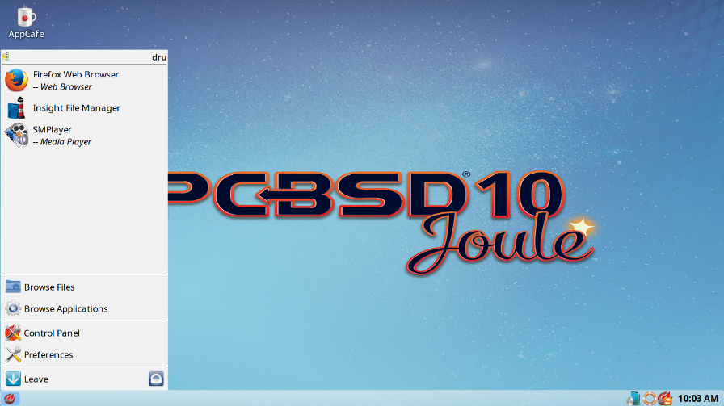

The start menu provides quick access for user interaction with the system. The top frame indicates which user is logged in. Hover over the battery icon to display the current status of
the battery, if your system has one, and the estimated time remaining if that battery is discharging.

The next frame contains a list of "Favorites". Click an entry to launch that application. Right-click an entry to "Remove from Favorites" or to "Add to Quicklaunch". In Lumina, "Favorites"
appear in this section of the start menu and "QuickLaunch" adds a button for the application to the panel that is next to the start menu button.

The remainder of the start menu contains the following:

**Browse Files:** used to browse for files and directories using the :ref:`Insight File Manager`. One of the actions available in this file manager is the ability to add a file or directory
to the list of Favorites. Simply select the file or directory and click the star icon in Insight.

**Browse Applications:** click this entry to browse all the applications currently registered on the system. Applications are listed alphabetically by category and the "Show Categories"
button has three modes. Click "Show Categories" to toggle between showing just the category names (black box icon), just the contents of the categories (white box icon), or the categories
and their contents (1/2 black 1/2 white icon). Click an application's name to start that application. If you right-click an application's name, you can "Pin to Desktop", "Add to Favorites",
or "Add to Quicklaunch". If you are running PC-BSD® or another operating system that has a pre-defined application store, click "Manage Applications" at the top of the list of applications
in order to open that application store. For example, on a PC-BSD® system, "Manage Applications" opens AppCafe®. Click the "Back" button to return to the start menu.

**Control Panel:** if you are on PC-BSD®, or an operating system which provides a control panel, click this entry to open that operating system's control panel.

**Preferences:** click this entry to access the following:

* **Configure Desktop:** click this entry to open the :ref:`Lumina Configuration` utility.

* **Lumina Desktop Information:** click the "?" icon to determine the installed version of Lumina.

* **System Volume:** use your mouse to move the volume control slider to change the system audio volume from 0% to 100%. Click the sound icon on the left to mute or unmute the speaker. If
  the operating system provides a mixer utility, click the speaker icon on the right to launch that mixer utility for advanced control of the audio system.

* **Screen Brightness:** use your mouse to move the brightness control slider from 10% to 100%.

* **Workspace:** the number of available virtual workspaces are listed. Click the right or left arrow to switch between workspaces.

* **Locale:** this will only appear if the lumina-i18n package is installed. The current locale will be displayed as the title of the drop-down menu. Click the drop-down menu to select
  another locale for this session. Refer to :ref:`Session` for more information on fine-tuning the locale settings.

* **Back:** click to return to the start menu.

**Leave:** click this entry in order to "Suspend System" (if the operating system supports it, press the system's power button to login and resume operation) "Restart System" (if the user
has permission), "Power Off system" (if the user has permission), "Sign Out User", or to go "Back" to the system menu. Alternately, click the "lock" icon next to "Leave" to lock the system
and return it to a login prompt.

.. note:: On a PC-BSD system which is in the middle of applying updates, the shutdown and restart options will be disabled until the updates are complete and a note will indicate that
   updates are in progress.

.. _Panel and System Tray:

Panel and System Tray
=====================

By default, Lumina provides a panel at the bottom of the screen with a system tray at the far right of the panel. This section describes the default layout. For instructions on how to
configure the panel to suit your needs, refer to the "Panels" tab :ref:`Interface` section.
  
As you open windows or applications, a button will be added to the section of the panel near the system menu. If the application provides an icon, the button
will appear as that icon and if you mouse over it, the tooltip will show the name of the application. If you have multiple copies of an application running,
it will combine all those entries into a single button and list the number of windows after the icon. If you click on a button, it will automatically make that window active and if you
click it again, it will automatically minimize it. If there are multiple windows, you can select the particular window you want to activate from a drop-down menu.

If you right-click the title of an open window, a menu of options will appear so that you can shade, stick, maximize, iconify, raise, lower, set the window
title, send the window to a workspace, layer/dock the window, set the window's transparency, remember a specified setting, or close the window.

The system tray is located in the right portion of the panel. Any applications that register a tray icon will appear in this area. For example, on a PC-BSD system, icons will appear for
Life Preserver, Mount Tray, and Update Manager. Click or right-click an icon to interact with that application directly. The current system time shown by the clock is in the default format
for the current locale. If you click the clock icon and then click "Time Zone", a menu will open where you can select to either "Use System Time" or click a country name in order to select a
city to change to that city's time zone.
  
.. index:: right-click menu
.. _Right-Click Menu:

Right-Click Menu
================

If you right-click the desktop, a menu of quick shortcuts will appear and the title of the menu will indicate the name of the current workspace. This section describes the default
menu items. For instructions on how to configure the right-click panel to suit your needs, refer to the "Desktop" tab :ref:`Interface` section.

By default, the right-click menu contains the following items:

* **Terminal:** used to launch a system terminal. The default is :command:`xterm`, but this can be customized.

* **Browse Files:** launches the default, and recommended, file manager, the :ref:`Insight File Manager`.

* **Applications:** provides shortcuts to the operating system's graphical software management utility (if available), the control panel (if the operating
  system provides one), and the applications currently registered on the system, arranged by system category.

* **Preferences:** contains shortcuts to the screensaver preferences, :ref:`Lumina Configuration` utility, display configuration (:ref:`Lumina Xconfig`), the operating
  system's control panel, and for determining the version of Lumina.

* **Leave:** opens the system log out window, with options to log out of the desktop session, restart the system (if the user has permission), shutdown the system (if the user has
  permission), cancel the log out window, lock the system, or suspend the system (if the operating system supports suspend mode).

.. index:: configuration
.. _Lumina Configuration:

Lumina Configuration
====================

The Lumina Configuration utility, shown in :numref:`Figure %s: Lumina Desktop Configuration <lumina3b>`, can be used to configure every aspect of the desktop and is the recommended way to
make changes. To launch this utility, click the start menu then :menuselection:`Preferences --> Configure Desktop`, right-click the desktop and click
:menuselection:`Preferences --> Desktop`, or type :command:`lumina-config` from an xterm.

.. _lumina3b:

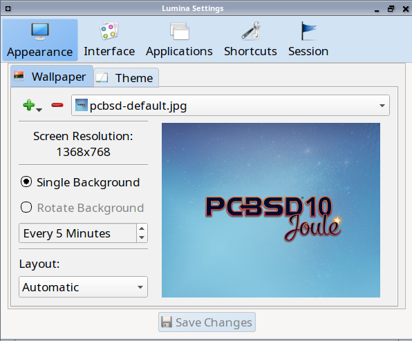

Each of the tabs at the top configures a different area of the system, with the most frequently changed options on the left side. As changes are made,
the "Save Changes" button at the bottom of the window becomes active. This allows the user to setup multiple changes in any tab and apply them all at the
same time.

.. note:: If you make any changes in any of the tabs, remember to click "Save Changes" before exiting this utility in order to save them.

The rest of this section describes the configurations that are available in each tab. 

.. index:: appearance, wallpaper
.. _Appearance:

Appearance
----------

This tab is used to change the visual appearance and functionality of the desktop on a per-screen basis. The "Wallpaper" tab, shown in
:numref:`Figure %s: Lumina Desktop Configuration <lumina3b>`, can be used to add a wallpaper ("+" button) or remove ("-" button) a wallpaper. When you click the "+" button, the drop-down
menu can be used to select the file(s), a single directory, a directory and all of its subdirectories, or a solid color to use as the wallpaper. If multiple images are selected, the "Rotate
Background" button can be selected as well as a specified time interval in minutes to rotate to the next image. 

Click the "Layout" drop-down menu to change the default layout of "Automatic" to one of the following options: "Tile", "Center", "Top Left", "Top Right", "Bottom Left", or "Bottom Right".

The options that are available when you click :menuselection:`+ --> Solid Color` are shown in :numref:`Figure %s: Modifying the Wallpaper <lumina16a>`. If you select a color and click "OK",
it will be added as a solid color background to the wallpaper selection drop-down menu.

.. _lumina16a:

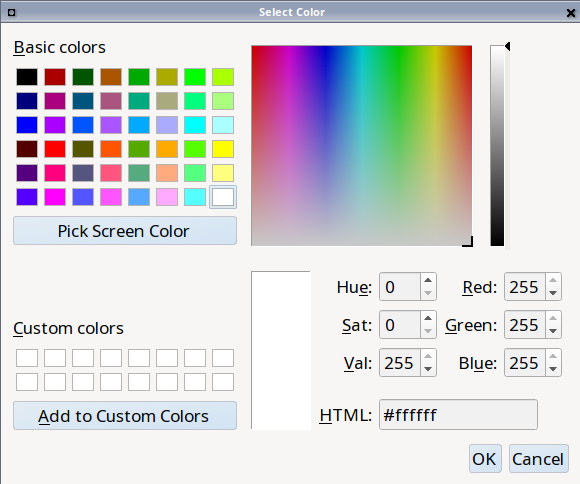

The "Theme" tab, shown in :numref:`Figure %s: Modifying the Theme <lumina17b>`, can be used to change the default font, font size, theme template, color scheme, icon pack, and mouse
cursors. 

.. _lumina17b:

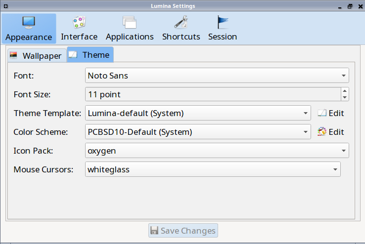

It is possible to create your own "Theme Template" or "Color Scheme" by clicking the "Edit" button next to those options and changing the settings as necessary.
:numref:`Figure %s: Using the Theme Editor <lumina18a>` shows an example of clicking the "Edit" button with the "Lumina-default (System)" theme template selected. This action opened the
"Theme Editor" and the user has clicked the color selector (dropper icon) in the upper right corner. After selecting an item in this menu, the template controlling that selection can be
edited by changing the values in the theme editor box. Note that the theme templates are written as `Qt stylesheets <http://doc.qt.io/qt-5/stylesheet.html>`_, so some scripting experience
may be helpful when configuring a theme. After making your changes, you can either click the "Save" button to save the theme without closing the editor, or click the "Apply" button which
will both save the theme and close the theme editor.

.. _lumina18a:

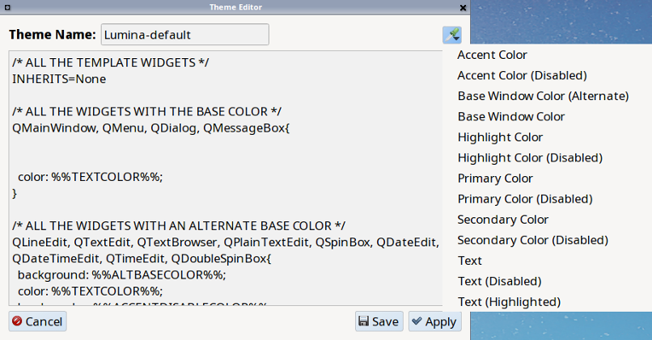

.. index:: menu, panel
.. _Interface:

Interface
---------

The "Interface" tab is used to configure the desktop right-click menu and panel. Its "Desktop" tab, shown in :numref:`Figure %s: Right-Click Menu Configuration <lumina4c>`, is used to
configure which items appear in the right-click menu and which items are embedded onto the desktop.

.. _lumina4c:

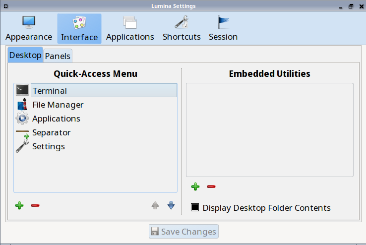

To add an item to the right-click menu, click the "+" button under the "Quick-Access Menu". This will open the "Select a Plugin" screen where you can add an application, custom app, an entry
for the :ref:`Insight File Manager`, a separator, a shortcut to Settings, a terminal, or a listing of currently open applications. To remove an item from the right-click menu, highlight it
and click the "-" button. Use the arrow buttons to change the order of the items in the right-click menu.

To embed a utility onto the desktop, click the "+" button under the "Embedded Utilities" frame. The following plugins can be added as an icon on the desktop: Application Launcher
(opens a menu that lists which applications can be launched), Audio Player, Calendar, Desktop Icons View, Note Pad, Sample (an example of a QtQuick/QML plugin), and System Monitor (displays
CPU temperature/usage, memory usage, and disk I/O). Once you click the "Save Changes" button, any utilities you added will appear on top of the desktop. To remove an embedded utility from
the desktop, highlight its entry under "Embedded Utilities", click the "-" button, and click "Save Changes". Alternately, right-click the icon for the utility and select "Remove Item" from
the right-click menu. 

The following options are also available when you right-click an icon on the desktop, allowing you to customize the location and appearance of desktop icons: "Start Moving Item" (click the
icon to lock it in place once you have moved it to the desired location), "Start Resizing Item" (use the mouse to increase/decrease size and click when you are finished), "Increase Desktop
Icon Sizes" (increases all desktop icons, repeat as necessary), and "Decrease Desktop Icon Sizes" (decreases all desktop icons, repeat as necessary).

The "Display Desktop Folder Contents" option is used to display each item stored in :file:`~/Desktop` as an icon on the desktop. By default, this option is selected as its box is black. If
you de-select this option and click "Save Changes", the icons for the contents of :file:`~/Desktop` will be removed from the desktop.
   
To configure the panel, click the "Panels" tab which will open the screen shown in :numref:`Figure %s: Panels Tab <lumina5d>`.

.. _lumina5d:

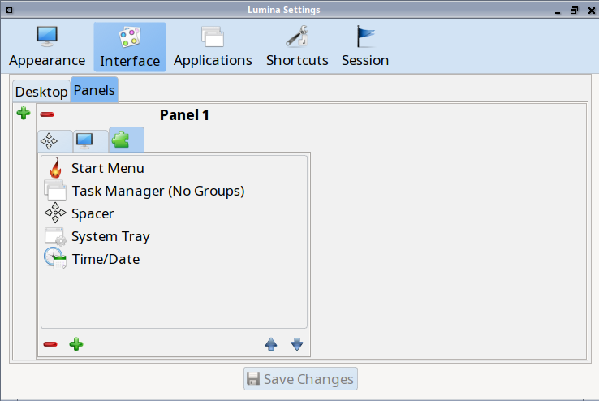

This screen can be used to customize the location, alignment, size, theme, and plugins for an existing panel. The "+" and "-" icons towards the top, next to "Panel 1" can be used to add
or remove additional panels. Panels must be aligned along a screen edge, opposite screen edges in the case of two panels, and may have any width, color, or transparency. 

.. note:: If you add additional panels, a frame, similar to "Panel 1", will be created for each panel, and will be labeled "Panel 2", "Panel 3", and so on. This allows you to configure
   each panel separately. The configuration tabs available for a panel are described below. Be sure to select the tab in the panel that you wish to customize.

The "Location" tab (4 arrow icon) contains the following items:

* **Edge:** this drop-down menu can be used to set the location of the panel which can be "Top", "Bottom", "Left", or "Right". 

* **Alignment:** this drop-down menu can be used to center the panel on the edge or pin it to one of the corners. 

* **Size:** can be used to specify the panel width in pixels and the panel length. 

The "Appearance" tab (monitor icon) is shown in :numref:`Figure %s: Panels Appearance Tab <lumina19b>`.

.. _lumina19b:

.. figure:: images/lumina19b.png

If you would like the panel to be hidden unless the mouse is hovered over it, check the "Auto-hide Panel" box. The "Custom Color" option can be used to fine-tune the
panel color. Click its box, then the paint icon to select the panel color.

The "Plugins" tab (puzzle icon) is shown in :numref:`Figure %s: Panels Plugins Tab <lumina20b>`.

.. _lumina20b:

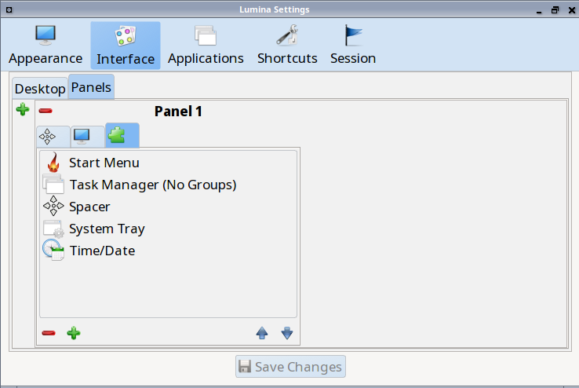

To add a plugin as an icon to the panel, click the "+" button below the listed plugins and select a plugin from the list that appears. The available plugins include:

* **Application Launcher:** when you select this plugin, it will prompt you to select the application to launch. This will add a shortcut for launching the selected application
  to the panel.
  
* **Application Menu:** adds an application menu that contains a shortcut to your home directory, a shortcut to the operating system's graphical software management utility (if there is one),
  a shortcut to the operating system's Control Panel (if it provides one), and a list of installed software sorted by categories.

* **Battery Monitor:** hover over this icon to view the current charge status of the battery. When the charge reaches 15% or below, the low battery icon will flash intermittently
  and will change to a low battery icon when there is less than 5% charge left.

* **Desktop Bar:** adds a "star" button for automatically displaying entries for anything in the :file:`~/Desktop` folder and alternately launching the selected entry.

* **Line:** adds a separator line to the panel.

* **Show Desktop:** this button will hide all open windows so that only the desktop is visible. This is useful for touch screens or small devices.

* **Spacer:** adds a blank area to the panel.

* **Start Menu:** adds a classic start menu as seen on other operating systems.

* **System Dashboard:** used to view/modify audio volume, screen brightness, battery life, and virtual desktops.

* **System Tray:** provides a display area for dockable applications.

* **Task Manager (No Groups):** ensures that every window gets its own button. This uses a lot more space on the panel since it needs to put part of the window title on
  each button.
  
* **Task Manager:** is added by default. Its behavior is to group windows by application.

* **Time/Date:** displays the current time and date.

* **User Button:** main button for accessing applications, directories, settings, and log out.

* **Workspace Switcher:** used to switch between virtual desktops.

To remove a plugin, highlight it and click the "-" button below the listed plugins. The arrow buttons can be used to move the location of the plugin on the panel. The top of an ordered list
corresponds to either the top of a vertical panel or the left side of a horizontal panel. 

.. index:: application startup
.. _Applications:

Applications
------------

The "Applications" tab, shown in :numref:`Figure %s: Lumina Applications Configuration <lumina6b>`, is used to configure which applications start when you login to Lumina as well as the
default applications and file types.

.. _lumina6b:

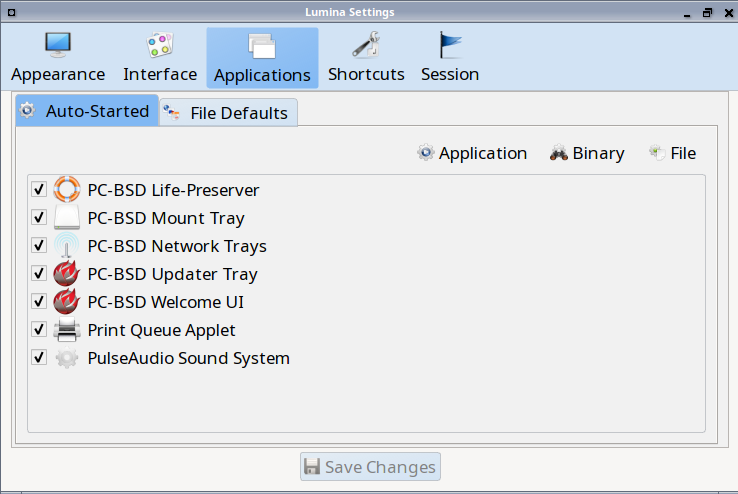

To prevent an application from starting automatically, uncheck its box.

To add an application to the auto-start configuration , click "Application" to select the application's name from a drop-down menu or click "Binary" or "File" to browse
to the location of  the application or file to open. If you select a file name, Lumina will automatically open it in an application that is capable of reading the file type.

To configure the default applications and file types, click the "File Defaults" tab. In the screen shown in :numref:`Figure %s: Lumina Defaults Configuration <lumina7c>`, you can configure
the default web browser, email client, file manager, and virtual terminal. 

.. _lumina7c:

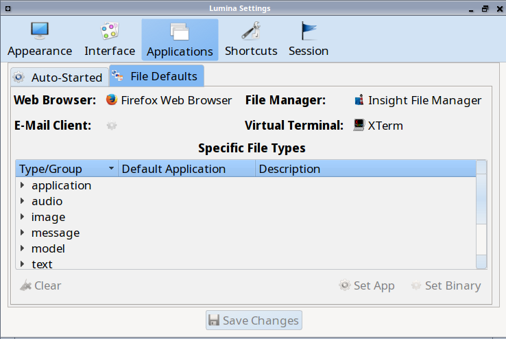

Click the gear icon or the name of the existing application to select the desired application from a menu of available applications.
If you wish to go back to the default application, click the current application's name, then click "Restore Defaults".

This screen can also be used to set the default application for several categories of file types. To add an application, select the file type and either
click "Set App", which will open a drop-down menu of common applications, or "Set Binary", which will open a file browser so that you can browse to the path
of the application.

.. note:: Some applications, such as web browsers, keep their own internal lists of default applications for opening particular types of files. If you set
   that application to use the :command:`lumina-open` or :command:`xdg-open` utilities, it will use the default applications that are set here so that
   there is only a single list of default applications for the system.

.. index:: shortcuts
.. _Shortcuts:

Shortcuts
---------
   
The "Shortcuts" tab, shown in :numref:`Figure %s: Lumina Shortcuts Configuration <lumina8a>`, is used to configure various keyboard shortcuts for system or window tasks. Most of these
options relate to window and workspace management, such as moving windows between workspaces, but there are also options for changing the system audio volume
or screen brightness. 

To create a shortcut, click the desired entry, then "Change Shortcut", then the key combination you wish to set. Note that any entry that already has a defined shortcut showing in the
"Keyboard Shortcut" column  can **not** be assigned to another action. First, highlight that shortcut, click "Clear Shortcut", then "Save Changes". You can now create a new shortcut.

.. _lumina8a:

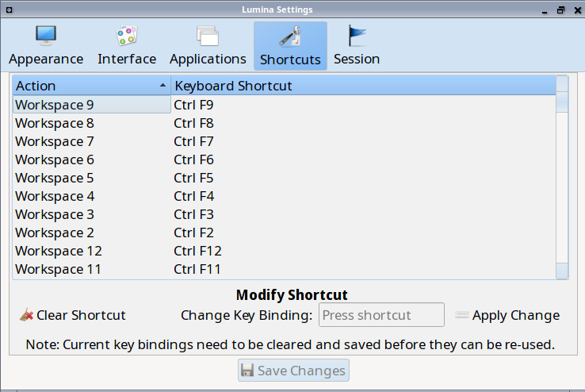

.. index:: session
.. _Session:

Session
-------

The "Session" tab, shown in :numref:`Figure %s: Session General Options Tab <lumina12d>`, governs the general settings for the desktop session. These settings are usually not changed on a
frequent basis.

.. _lumina12d:

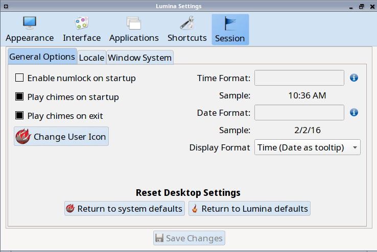

The "General Options" tab can be used to automatically enable numlock, to play chimes when Lumina starts or exits, and to change the icon that appears  in the login menu and the start
menu button. It also has options to set the time format, date format, and time display format. Buttons are available to reset these options to either the system defaults or Lumina defaults.

The "Locale" tab is shown in :numref:`Figure %s: Session Locale Tab <lumina21a>`.

.. _lumina21a:

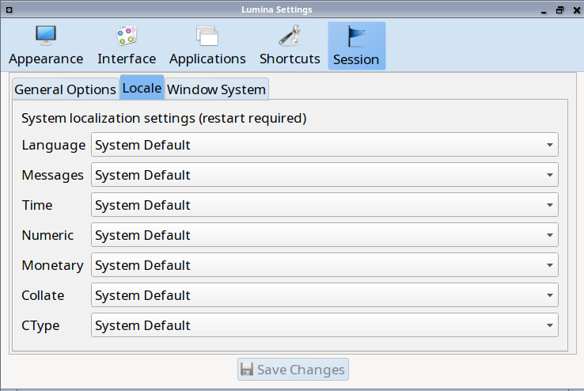

The lumina-i18n package provides localization files. Once installed, this allows you to customize which locale is used for the various items listed in
:numref:`Figure %s: Session Locale Tab <lumina21a>`. To install this package on a PC-BSD or FreeBSD system, use :command:`sudo pkg install lumina-i18n`. On other operating systems, use the
software management tool that comes with the operating system. If the Lumina Configuration utility was open before the installation, restart it so that the list of localizations can be
loaded into the drop-down menus of this screen. Since each setting has its own drop-down menu, you have the flexibility to select different locales for each item shown in this screen. Note
that if you make any changes in the "Locale" tab, click the "Save Changes" button and restart Lumina so that the configured locales can be loaded.

Installing the lumina-i18n package will also add a drop-down menu to the "Preferences" of the start menu, though you will need to restart Lumina after the package installation in order
for the locale menu to appear in "Preferences". This drop-down menu can be used to temporarily change the locale for this session only. This will immediately change the
localization of any translated menu items on the fly so that you do not have to log back into the Lumina session.

.. note:: Any menu items that continue to be displayed in English have not been translated to the selected language yet. You can assist the Lumina Project in translating menu items using the
   instructions in :ref:`Interface Translation`.

The "Window System" tab, shown in :numref:`Figure %s: Session Window System Tab <lumina22a>`, contains various configuration options for the window manager. 

.. _lumina22a:

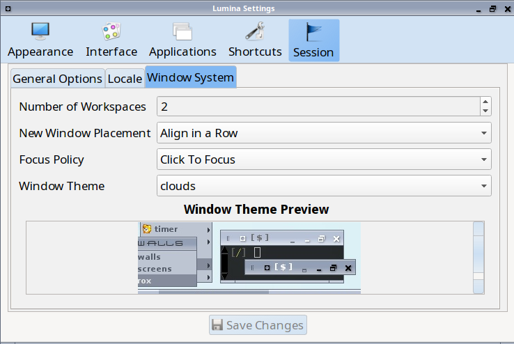

Drop-down menus are provided for configuring the following:

* **Number of Workspaces:** up to *10* workspaces can be defined, with a default of
  *2*.

* **New Window Placement:** indicates where new windows are placed on the screen. Choices are "Align in a Row", "Align in a Column", "Cascade", or "Underneath Mouse".

* **Focus Policy:** indicates when windows receive focus. Choices are "Click to Focus", "Active Mouse Focus", or "Strict Mouse Focus".

* **Window Theme:** controls the appearance of the frame around application windows. The "Window Theme Preview" screen can be used to preview the selected theme.

.. index:: Utilities
.. _Lumina Utilities:

Lumina Utilities
================

Lumina provides many built-in utilities, which are described in this chapter.

.. index:: screenshot
.. _Lumina Screenshot:

Lumina Screenshot
-----------------

This utility can be used to take screenshots of the desktop or selected window and save them as PNG image files. To launch this utility, click the start menu and select
:menuselection:`Browse Applications --> Utility --> Lumina Screenshot`, right-click the desktop and select :menuselection:`Applications --> Utility --> Lumina Screenshot`, type
:command:`lumina-screenshot` from a terminal window, or press the :kbd:`Print Screen` button.

.. _lumina9a:

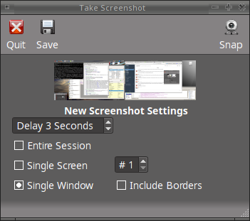

The following settings can be used to fine-tune the screenshot:

* **Delay:** in seconds. This can be used to give you time to setup the screenshot.

* **Entire Session:** will take a screenshot of the entire screen.

* **Single Screen:** in a multi-monitor setup, you can select which screen number to use for the screenshot.

* **Single Window:** will take a screenshot of the window which has focus. The "Include Borders" checkbox can be used to determine whether or not the screenshot of the window is
  surrounded by a black border.

To take a screenshot, click the "Snap" button in the upper-right corner of Lumina Screenshot. If you like the look of the screenshot, as shown in the preview, click the "Save" button to
open a window where you can specify the filename and location for saving the screenshot.

.. index:: file manager
.. _Insight File Manager:

Insight File Manager
--------------------

The Insight file manager, shown in :numref:`Figure %s: Insight File Manager <lumina10>`, allows the user to easily browse and modify files on the local system on a per-directory basis. To
open Insight, click the start menu and select "Browse Files", right-click the desktop and select "Browse Files", or type :command:`lumina-fm` from an xterm.

.. _lumina10:

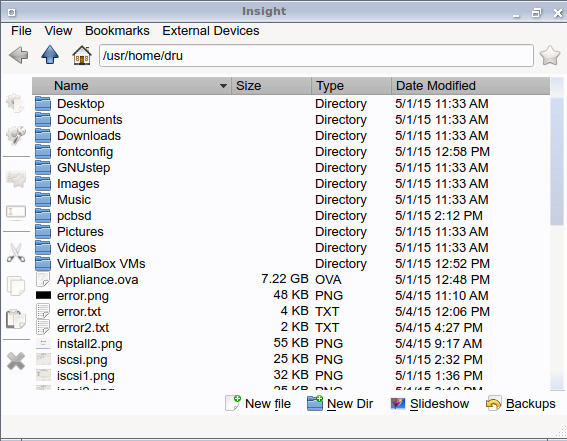

It is possible to open up additional directories through the tab system using :kbd:`Ctrl-T` or by clicking :menuselection:`File --> New Browser`, allowing the user to easily manage multiple
locations on the system. Insight also features the ability to "bookmark" locations on the system for instant access via the "star" button. Once a location has been bookmarked, it will be
available via the "Bookmarks" menu at the top of the window. Any removable devices that are available on the system will show up in the "External Devices" menu, if supported by the operating
system. When an item is selected, the icons on the left side of the screen provide the possible actions that may be taken with regards to that item. Possible actions include: "open item",
"open item" (will prompt to select the application to use), "add item to personal favorites", "rename item", "cut items (add to the clipboard)", "copy items to the clipboard", "paste items
from clipboard", and "delete items". By default, the action buttons are visible. They can be made invisible by clicking :menuselection:`View --> Show Action Buttons`. To disable thumbnails,
uncheck :menuselection:`View --> Load Thumbnails`. Note that this option does not remove thumbnails that have already been loaded, it only prevents loading thumbnails in new directories.
Hidden files are not shown by default; this can be changed by checking :menuselection:`View --> Show Hidden Files`.

If you select a file or directory and right-click it, the following options become available: "Open", "Open With" (where you select the application to use), "Rename",
"View Checksums" (shows the MD5 checksum), "Cut Selection", "Copy Selection", "Paste", "Delete Selection", "File Properties" (such as file type, size,
permissions, and creation date), or "Open Terminal here".

A few additional options may be available at the bottom of the window, depending on the directory being viewed and the types of files that are in it:

* **New file:** the ability to create a new file is available if the user has permission to modify the contents of the current directory.

* **New Dir:** the ability to create a new directory is available if the user has permission to modify the contents of the current directory.

* **Slideshow:** if there are image files in the directory, this option will display those image files as a slideshow and provide arrows for going forward or back by
  one file or to the very beginning or end of the file list. Buttons are also provided for deleting the currently displayed image or to rotate it, and save the
  rotation, clockwise or counter-clockwise.

* **Play:** will appear if there are supported multimedia files in the directory. The types of files that are supported depends on what multimedia plugins are
  installed on the system. If a particular file is not recognized as a multimedia file, install the associated multimedia codec using the operating system's
  application management software and restart the file manager.

* **Backups:** if the system is formatted with ZFS and snapshots of the current directory are available, this button will appear. Snapshots are organized from
  oldest to newest, with the most recent snapshot selected by default, and the contents of the directory at the time of that snapshot are displayed. To
  restore a file or multiple files, select them from the list and click the "Restore Selection" button. If those files still exist and you want to overwrite
  them, make sure the "Overwrite Existing Files" option is checked first. Otherwise, if a file with that name exists, the restore will append a number to the
  end of the filename. For example, the first restored version of :file:`testfile.txt` will become :file:`testfile-1.txt`.
  
.. index:: application launcher
.. _Lumina Open:

Lumina Open
-----------

To open a file, directory, or URL from the command line, use :command:`lumina-open` followed by the full path to the file or the URL. This utility will look
for an appropriate application to use to open the specified file or URL. If there is no default application registered for the input type, a small dialog will
prompt the user to select which application to use, and optionally set it as the default application for this file type. As seen in the example shown in
:numref:`Figure %s: Lumina Open <lumina11a>`, this dialog organizes the available applications into three types: 

* **Preferred:** these applications have registered their Mime type with the system and can open that type of file. Also included are any applications that
  have been used to open this type of file before as it keeps track of the last three applications used for that file type.

* **Available:** displays all the applications installed on the system, organized by category and name.

* **Custom:** lets the user manually type in the binary name or path of the application to use. It also provides a search button to let the user graphically
  search the system for the binary. Whenever text is entered, a check is performed to determine whether that is a valid binary and the icon will change
  between a green checkmark or a red X as appropriate.

.. _lumina11a:

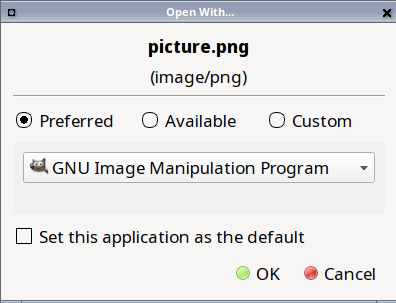

.. index:: search
.. _Lumina Search:

Lumina Search
-------------

Lumina Search provides the ability to easily search for and launch applications or to quickly search for file and directories. The "*" wildcard
can be used in the search terms and the search will include hidden files if the search term starts with a dot ("."). 

To start this utility, type :command:`lumina-search` or go to the start menu :menuselection:`Browse Applications --> Utility --> Lumina Search`.
:numref:`Figure %s: Search for Applications <lumina13a>` shows a screenshot of this utility.

.. _lumina13a:

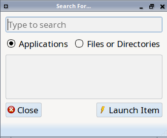

To open an application, begin to enter its name. The box below the selected "Applications" button will display any matching application names. Select the desired application and click
the "Launch Item" button to open it.

If you click the "Files or Directories" button, the screen changes slightly, as seen in :numref:`Figure %s: Search for Files <lumina13>`.

.. _lumina13:

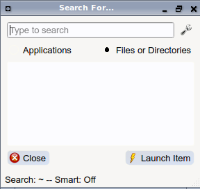

By default, a "Files or Directories" search is limited to the user's home directory, as indicated by the "Search: ~" at the bottom of the screen. The "Smart: Off" indicates
that every subdirectory is included in the search; in other words, there are no excluded directories. To add additional search directories or to exclude subdirectories, click 
the wrench icon to see the screen shown in :numref:`Figure %s: Configuring the Search Directories <lumina14>`.

.. _lumina14:

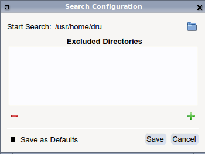

Click the blue folder icon to change the starting search directory. For example, you can select "Computer" then "/" from the "Select Search Directory" screen to search the entire
contents of the computer. You can also add directories to exclude from searches by clicking the "+" button. If you add any excludes, you can delete an exclude by highlighting it
and clicking the "-" button. By default, the "Save as Defaults" option is selected. Unselect this option if you only wish to temporarily modify your search settings.

.. index:: Lumina File Information
.. _Lumina File Information:

Lumina File Information
-----------------------

The :command:`lumina-fileinfo` utility can be used to open a graphical window summarizing the size, permissions and ownership, creation time, and last modification time of the specified
file or directory. In the example shown in in :numref:`Figure %s: Sample File Information <file1>`, the user has typed :command:`lumina-fileinfo Downloads` from a terminal window to view the
file information of their :file:`~/Downloads` directory.

.. _file1:

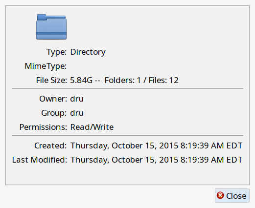

.. index:: Lumina Information
.. _Lumina Information:

Lumina Information
------------------

This utility provides information about the version of Lumina, as well as the license, acknowledgements, and Project links. To launch this utility, right-click the desktop and select
:menuselection:`Preferences --> About Lumina`, click the start menu then the question mark icon in "Preferences", or type :command:`lumina-info` in a terminal window. An example is shown
in :numref:`Figure %s: About Lumina <about1a>`.

.. _about1a:

.. figure:: images/about1a.png

The "General" tab contains the following information:

* **Desktop Version:** indicates the version of Lumina.

* **OS Build:** indicates the operating system that was used to build this version of Lumina.

* **Qt Version:** click the "View Information" button to display the QT version and its license.

* **Lumina Website:** click the "Open in web browser" link to open `<http://lumina-desktop.org/>`_ in the default web browser.

* **Source Repository:** click the "Open in web browser" link to open `<https://github.com/pcbsd/lumina>`_ in the default web browser.

* **Report a Bug:** click the "Open in web browser" link to open `<https://bugs.pcbsd.org/projects/pcbsd>`_ in the default web browser. Refer to :ref:`Report a Bug` for instructions on how
  to submit a bug report.
  
The "License" tab contains the license text for Lumina. Lumina is licensed under a `3-clause BSD license <http://opensource.org/licenses/BSD-3-Clause>`_.

The "Acknowledgements" tab contains the following:

* **Project Lead:** the name of the Project's lead developer. Click the name to open his profile on GitHub in the default web browser.

* **Contributors:** click the "Open in web browser" link to open `<https://github.com/pcbsd/lumina/graphs/contributors>`_.

* **Sponsors:** lists the project and corporate sponsors of the Lumina Project.

.. index:: Xconfig
.. _Lumina Xconfig:

Lumina Xconfig
--------------

The :command:`lumina-xconfig` utility is a graphical front-end to the :command:`xrandr` command line utility. It provides the ability to probe and manage any number of attached monitors. To
start this utility, right-click the desktop and select :menuselection:`Preferences --> Display` or type :command:`lumina-xconfig` from a terminal window. This will open a screen
similar to the one shown in :numref:`Figure %s: Configuring Monitors <lumina15a>`.

.. _lumina15a:

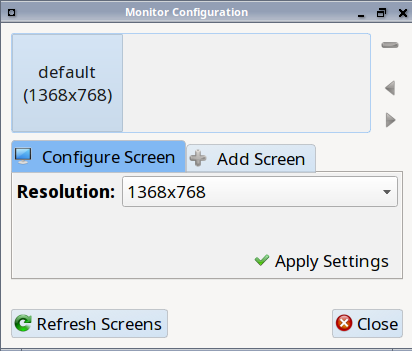

In this example, one display input is attached to the system and its current screen resolution is displayed. If the display input supports multiple resolutions, they will appear in the
"Resolution" drop-down menu so that you can select a different resolution. 

If you attach another display input, the "Add Screen" tab is activated so that you can configure the new input's resolution and whether or not it should be the default input.