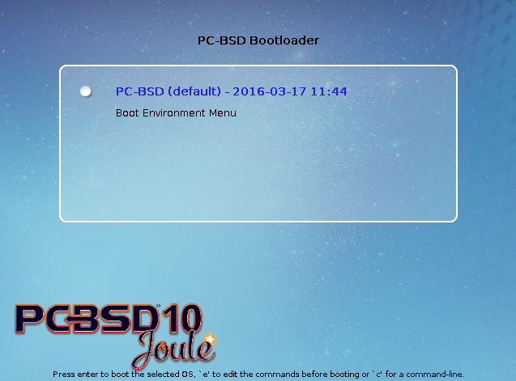
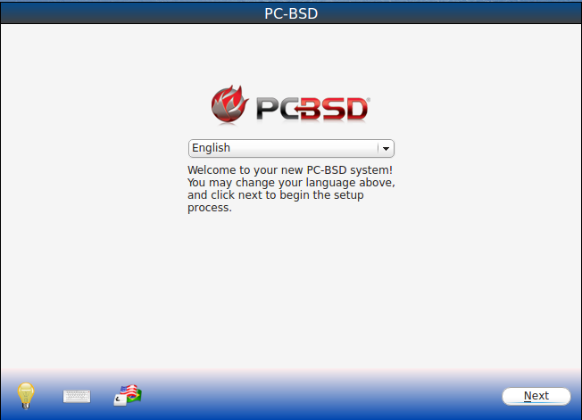
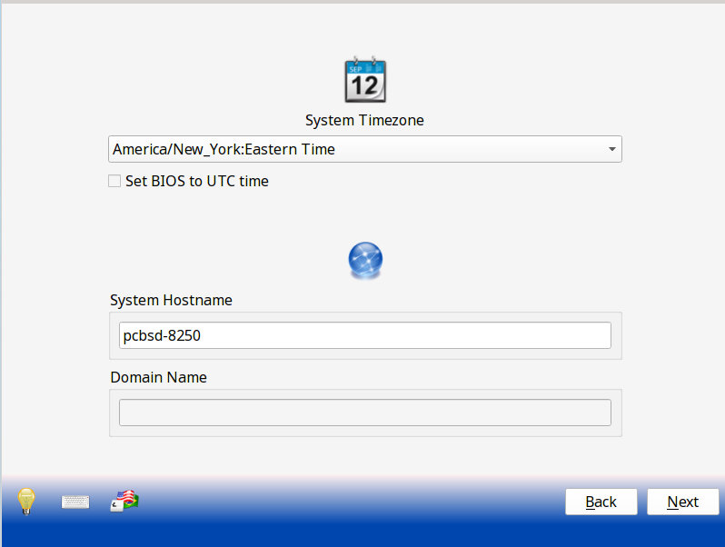
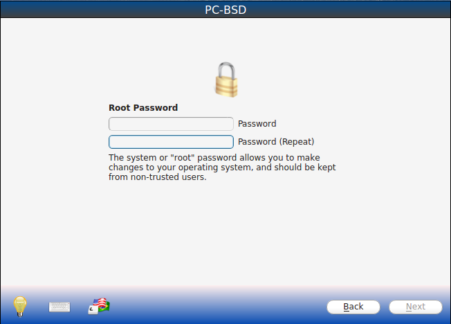
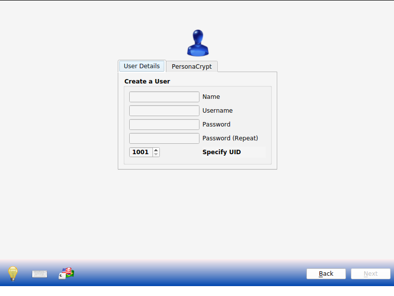
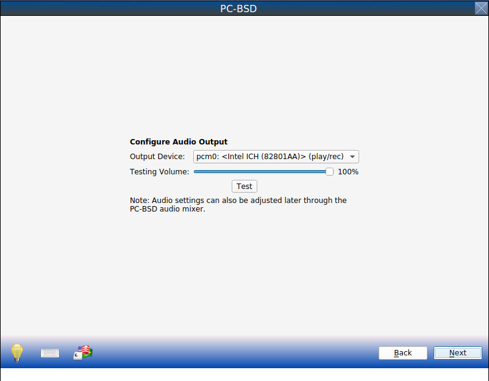
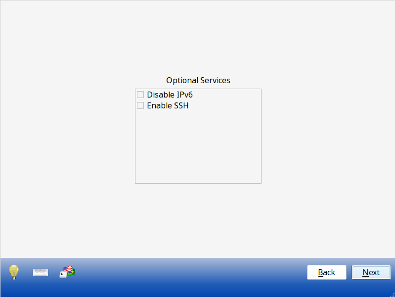
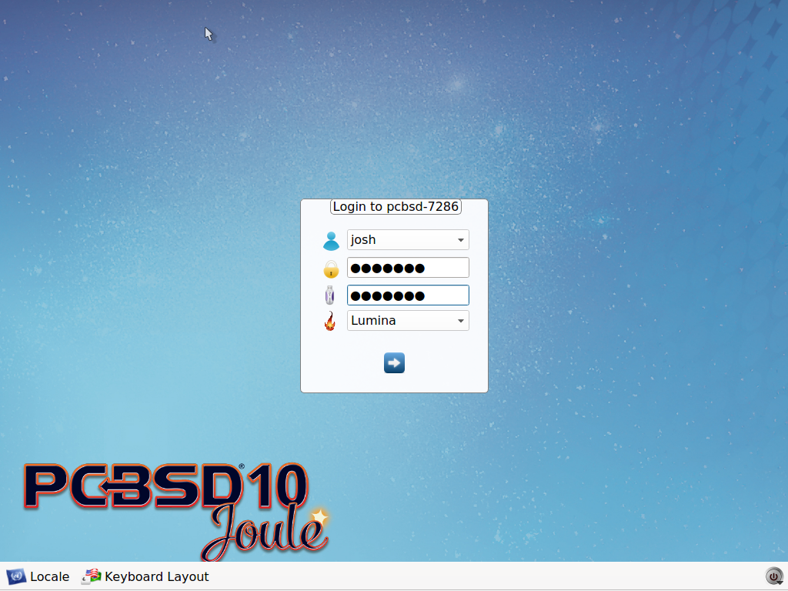
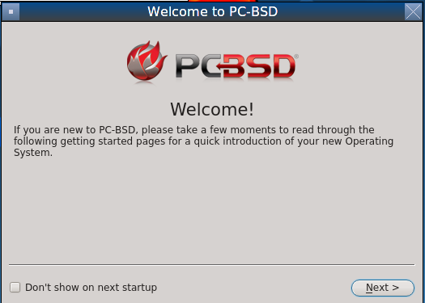
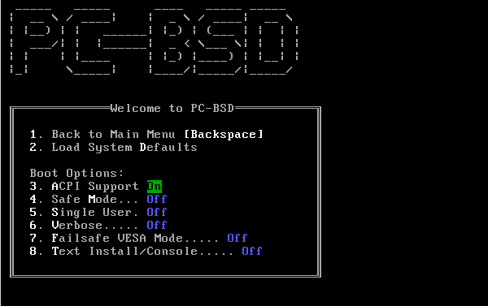

.. index:: configuration
.. _Post Installation Configuration and Installation Troubleshooting:

Post Installation Configuration and Installation Troubleshooting
****************************************************************

Once the PC-BSD® system has finished booting for the first time, the installer will present you with some additional screens so that you can configure your system.
This section describes the boot process, the post-installation configuration screens, and provides some troubleshooting tips for failed installations.

.. index:: boot
.. _Booting Into PC-BSD®:

Booting Into PC-BSD®
=====================

After installation, PC-BSD® will reboot and again display the boot menu shown in :numref:`Figure %s: Initial Boot Menu <install1b>`.

.. _install1b:

.. figure:: images/install1b.png

This menu provides the following options. To pause this menu, press any key except for :kbd:`Enter`. To select an option, press either the bolded number or key for that option. Once you
have finished making your selections, press :kbd:`Enter` to boot using the selected options.

* **1. Boot Multi User:** this is the default option for booting PC-BSD®. The system will automatically use this option after pausing for a few moments or if you press :kbd:`Enter` when this
  menu displays.

* **2. Boot Single User:** advanced users can select this option to fix critical system failures.

* **3. Escape to loader prompt:** advanced users can select this option to perform advanced operations, such as loading kernel modules.

* **4. Reboot:** reboots the system.

* **5. Kernel:** this option will indicate how many kernels are available. Press either :kbd:`5` or :kbd:`k` to toggle between available kernels.

* **6. Configure Boot Options:** if you press either :kbd:`6` or :kbd:`o`, the boot options screen shown in :numref:`Figure %s: Boot Options Menu <boot1a>` will open. To change an option,
  press either the bolded number or key for that option to toggle through its available settings. When finished, press either :kbd:`1` or :kbd:`Backspace` to return to the main boot menu.

* **7. Select Boot Environment:** in PC-BSD®, boot environments are automatically created when the system updates and can also be manually created using :ref:`Boot Environment Manager`. This
  allows you to boot the system to the point in time before an update occurred and can be used to recover from a failed update. Press either :kbd:`7` or :kbd:`e` to view the available boot
  environments. Note that the first time the system boots, no additional boot environments are available. Over time, this menu will populate as boot environments are created.

.. _boot1a:

The following boot options are available in the :numref:`Figure %s: Boot Options Menu <boot1a>`:

* **3. ACPI Support:** toggles  power  management support,  which may be useful for  certain BIOS's  and laptops. 

* **4. Safe Mode:** select this option if the  installation hangs when probing your hardware and option "3 ACPI Support" did not help. It will boot with a forced PIO mode (disabling the use
  of DMA), disable write caching for all IDE hard drives and CD ROM drives, and disable the probing of EISA slots (as very few systems have them). 

* **5. Single User:** advanced users can select this option to fix critical system failures.

* **6. Verbose:** select this option if you would like to see more detailed messages during the boot process. This can be useful if you are troubleshooting
  a piece of hardware.

* **7. Display Wizard:** if you are unable to access the GUI due to a display setting, enable this option to boot into the display settings wizard.

* **8. Disable X:** boots the system to a command prompt. This is useful if you want to manually configure and test the X configuration file.

The first time the boot completes, the post-installer configuration script will attempt to set the optimal display settings. A pop-up menu will ask if you would like to accept these
settings. If you click "Yes", PC-BSD® will then proceed to the :ref:`Language Screen` so that you can perform the initial configuration of the system. 

Read through the rest of this section if you have encrypted your disk(s) or if you have problems setting the display settings. If you are dual booting and your other operating system was not
automatically added to the graphical boot menu by the installer, refer to :ref:`Dual Booting`.

.. index:: encryption
.. _If you Encrypted Your Disks:

If you Encrypted Your Disks
---------------------------

If you selected the "Encrypt disk with GELI" checkbox during installation, you will need physical access to the PC-BSD® system when it boots. As the system
starts to boot, it will display a message similar to the one shown in :numref:`Figure %s:  Input Password to Decrypt Master Key <encrypt1>`.

.. _encrypt1:

.. figure:: images/encrypt1.png

The boot process will wait for you to successfully input the password that you created in the installation screen shown in :numref:`Figure %s: Configure Encryption <install11a>`. If the
correct password is typed in, the system will continue to boot.

.. index:: video
.. _If Your Display is Not Automatically Detected:

If Your Display is Not Automatically Detected 
----------------------------------------------

If the optimal display settings can not be determined during first boot, if you select "No"in the "Confirm Resolution" screen when asked to confirm the
display settings, or if you select "Run the Display Wizard" from the boot menu, the "Display Settings" screen shown in :numref:`Figure %s: Display Settings Wizard <display1>` will launch.

.. _display1:

.. figure:: images/display1.png

The settings in this screen are described in more detail in :ref:`Display`. If you wish to return to this display wizard at a later time, go to
:menuselection:`Control Panel --> Display`.

If you change any display settings, click the "Apply" button for the settings to be tested. If anything goes wrong during testing, you will be taken back to
the "Display Settings" screen so that you can try another setting. Once you are happy with the tested setting, click the "Yes" button to save the setting and
to proceed.

.. index:: language
.. _Language Screen:

Language Screen
===============

The language selection screen is seen in :numref:`Figure %s: Language Selection Screen <config1>`. 

.. _config1:

This allows you to select the language you will use to access the installed system.

Once you have made your selection from the drop-down menu, click "Next" to go to the next configuration screen.

.. index:: time
.. _Time Zone Selection Screen:

Time Zone Selection Screen
==========================

The next configuration screen, shown in :numref:`Figure %s: Select Time Zone <config2a>`, allows you to select your timezone.

.. _config2a:

Use the drop-down menu to select the city closest to your location. If the system is connected to the Internet, the installer will most likely have the
correct timezone already selected.

If the system is dual booting and the other operating system expects the BIOS to use UTC, also check the box "Set BIOS to UTC time".

A default system hostname will be created for you. If you wish to change the default, type in the desired hostname in the "System Hostname" field. If the computer is a
member of a DNS domain, you can also input the "Domain Name".

When finished, click "Next" to proceed to the next screen.

.. index:: password
.. _Set Root Password Screen:

Set Root Password Screen
========================

This configuration screen, seen in :numref:`Figure %s: Set Root Password <config3>`, requires you to set the root password.

.. _config3:

The password must be a minimum of 4 characters and you are required to type it in twice to confirm the password. Click the "Next" button when you are
finished.

.. index:: users
.. _Create a User Screen:

Create a User Screen
====================

This screen is used to create the primary user account that will be used to login to the system. Set a good value for the password as it is used whenever the
system indicates that administrative access is required.

:numref:`Figure %s: User Creation Screen <config4>` shows the configuration screen used to create the initial user account.

.. _config4:

The "User Details" tab is used to create a login user. This screen requires you to complete the following fields: 

* **Name:** this value will be displayed in the login screen. It can be your full name and can contain capital letters and spaces.

* **Username:** this is the name you will use when logging in. It can not contain spaces and is case sensitive (e.g. *Kris* is a different username than
  *kris*).

* **Password:** this is the password you will use when logging in. You must type it twice in order to confirm it.

* **Specify UID:** by default, the user will be assigned the next available User ID (UID). If you need to force a specific UID, you can set it here. Note that you
  cannot set a UID lower than 1001 or specify a UID that is already in use by another user account.
  
PC-BSD® provides the ability to use a removable device, such as a USB stick, as the user's encrypted home directory. This is useful in a multi-user
or multi-computer environment as it provides the user with secure access to their encrypted files.  When a user is configured to use :ref:`PersonaCrypt`, their username
will only appear in the login menu if the removable media associated with that PC-BSD® system is inserted and they must input the password associated with the
removable device in order to login.

The "PersonaCrypt" tab, shown in :numref:`Figure %s: Initializing PersonaCrypt for this User <persona1>`, is used to initialize PersonaCrypt for the user.

.. _persona1:

.. figure:: images/persona1.png

Check the box "Initialize PersonaCrypt Device", insert a removable media that is large enough to hold the files you plan to store in your home directory, and click
the "Select" button.

.. warning:: make sure you do not have any files that you wish to keep on the removable media. Initializing the media for PersonaCrypt will format the device with
   ZFS and encrypt it with GELI, meaning that any existing data will be destroyed.
   
Input and repeat the "Device Password" to associate with the device. A pop-up menu will indicate that the current contents of the device will be wiped.
Click "Yes" to initialize the device.

If you share your computer with other users, you will be able to create additional login and PersonaCrypt accounts once you are logged in using
:menuselection:`Control Panel --> User Manager`. After you have created at least one user, click "Next" to continue to the next screen.

.. index:: sound
.. _Configure Audio Output:

Configure Audio Output
======================

The next screen, seen in :numref:`Figure %s: Configure Audio Output <audio1>`, is used to configure the default audio output.

.. _audio1:

Click the "Output Device" drop-down menu to select the desired sound device. You can click the "Test" button to verify the setting as a working configuration will result in
a test sound. You can also use the "Testing Volume" slider to set the default volume level.

You can view and edit these settings at a later time using the instructions in :ref:`PC-BSD Mixer Tray`.

.. index:: wireless
.. _Connect to a Wireless Network:

Connect to a Wireless Network
=============================

If the system has an active wireless interface, a screen similar to :numref:`Figure %s: Connect to a Wireless Network <config5>` will indicate the wireless networks which were automatically
detected. Available networks will be ordered by signal strength.

.. _config5:

.. figure:: images/config5.png

If you would like to set the default wireless connection, highlight the network that you would like to connect to. If the network requires a password, it will prompt you
to input it and will indicate the type of security used on the network. If the network you wish to connect to does not appear, try clicking the "Rescan" button. If you are
unable to connect, or you wish to configure the connection at a later time, refer to the instructions in :ref:`Network Configuration`.

.. index:: SSH, IPv6
.. _Enable Optional Services:

Enable Optional Services
========================

The next screen is shown in :numref:`Figure %s: Optional Services <optional1a>`.

.. _optional1a:

If you check the "Disable IPV6" box, the system will be configured to only support IPv4 addresses. The default is to support both IPv4 and IPv6 and to prefer IPv6 over IPv4.

If you check the "Enable SSH" box, the SSH service will start and be configured to start whenever the system boots. It will also create the firewall rules needed to allow
incoming SSH connections to the PC-BSD® system. **DO NOT check this box if you do not want to allow SSH connections to the system.**

When finished, click the "Next" button. The screen in :numref:`Figure %s: Setup is Complete <config6>` indicates that the post-installation setup is complete. Click the "Finish" button to
access the login menu.

.. _config6:

.. figure:: images/config6.png

.. index:: login
.. _Logging In:

Logging In
==========

Once you have finished setting up your system, you will be presented with the PCDM (PC-BSD® Display Manager) graphical login screen. An example is seen in
:numref:`Figure %s: PC-BSD® Login Screen <login1>`.

.. _login1:

.. figure:: images/login1.png

The hostname of the system will be displayed at the top of the login window. In this example, it is *pcbsd-5320*. The login window lets you select or input
the following: 

* **user:** the first time you login, the "Username" that you created in the :ref:`Create a User Screen` will be the only available user to login as. Later,
  if you create additional users using :ref:`User Manager`, they will be added to the drop-down menu so you choose which user to login as. PCDM will not let
  you login as the *root* user. Instead, whenever you access a utility that requires administrative access, PC-BSD® will first ask you to input the
  password of your login account.

* **password:** input the password associated with the selected user.

* **desktop:** if you installed any additional desktops using :ref:`AppCafe®`, use the drop-down menu to select the desktop to log into.

.. note:: if you created a PersonaCrypt user, you will need to insert the PersonaCrypt device in order to login. As seen in the example in
   :numref:`Figure %s: PC-BSD® PersonaCrypt Login Screen <login5>`, this will add an extra field to the login screen so that you can input the password associated with the PersonaCrypt
   device.

.. _login5:

The toolbar at the bottom of the screen allows you to select the following options:

* **Locale:** if you did not set the localization during installation or wish to change it, click this icon to set the locale for the login session.

* **Keyboard Layout:** click this icon to change the keyboard layout for the login session.

* **Restart/Shut Down:** if you wish to restart or shutdown the system without logging in, click the icon in the lower, far right corner.

Once you have made your selections, input the password associated with the selected user and press enter or click the blue arrow icon to login.

.. index:: welcome

The first time you log in, the PC-BSD® "Getting Started" screen will load as seen in :numref:`Figure %s: PC-BSD® Getting Started Screen <welcome1>`. 

.. _welcome1:

If you click the "Next" button, you can read an overview of the utilities that are used to configure your network connection, install applications, configure
your system, make a backup, and keep the system updated, as well as how to get involved with the PC-BSD® community. Check the box "Don't show on next
startup" if you do not want to see this screen the next time you log in. To re-open the screen after checking that box, type :command:`pc-welcome`.

.. index:: troubleshooting
.. _Installation Troubleshooting:

Installation Troubleshooting
============================

Installing PC-BSD® is usually an easy process that "just works". However, sometimes you will run into a problem. This section will look at solutions to the
most common installation problems.

The PC-BSD® installer creates a log which keeps a record of all the steps that are completed as well as any errors. When an installation error occurs, the
PC-BSD® installer will ask if you would like to generate an error report. If you click "Yes", a pop-up message will ask if you would like to save the error
log to a USB stick. Type **y** and insert a FAT formatted USB thumb drive to copy the log.

While in the installer, you can read this log to see what went wrong. Click the black "Emergency Shell and Utilities" icon, then select "shell" from the "PC-BSD Utility Menu".
You can now read the log by typing this command::

 more /tmp/.SysInstall.log

If you can not figure out how to fix the error or believe that you have discovered an installation bug, send the log that was saved on the USB stick using the
instructions in :ref:`Report a Bug`.

If the installer does not make it to the initial GUI installer screen, try unplugging as many devices as possible, such as webcams, scanners, printers, USB
mice and keyboards. If this solves the problem, plug in one piece of hardware at a time, then reboot. This will help you pinpoint which device is causing the
problem.

If your computer freezes while probing hardware and unplugging extra devices does not fix the problem, it is possible that the installation media is corrupt.
If the :ref:`Data Integrity check` on the file you downloaded is correct, try burning the file again at a lower speed.

If the system freezes and you suspect the video card to be the cause, review your system's BIOS settings. If there is a setting for video memory, set it to
its highest value. Also check to see if the BIOS is set to prefer built-in graphics or a non-existent graphics card. On some systems this is determined by the
order of the devices listed; in this case, make sure that the preferred device is listed first. If you can not see your BIOS settings you may need to move a
jumper or remove a battery to make it revert to the default of built-in graphics; check your manual or contact your manufacturer for details.

If that change did not help, try rebooting and selecting "6. Configure Boot Options" from the boot menu shown in :numref:`Figure %s: Initial Boot Menu <install1b>`.
This will open the screen shown in :numref:`Figure %s: PC-BSD® Boot Options <menu1>`.

.. _menu1:

Press :kbd:`7` to toggle "Off" to "On, then press :kbd:`Enter`. This will boot the installer using the VESA graphics driver which is supported on all systems.

A not uncommon cause for problems is the LBA (Logical Block Addressing) setting in the BIOS. If your PC is not booting up before or after installation, check
your BIOS and turn LBA off (do not leave it on automatic).

If the SATA settings in your BIOS are set to "compatibility" mode, try changing this setting to "AHCI". If the system hangs with a BTX error, try turning off
AHCI in the BIOS.

If the USB keyboard is non-functional, check if there is an option in your BIOS for "legacy support" in relation to the keyboard or to USB, or both.
Enabling this feature in your BIOS may solve this issue.

If you boot the installer and receive a *mountroot>* command prompt, it may be due to a change in the location of the boot device. This can occur when the
if the enumeration of a card reader changes. The solution is to enter *ufs:/dev/da1* at the prompt. Depending on
the exact location of the boot media, it may be different than :file:`da1`. Type *?* at the prompt to display the available devices.

If none of the above has fixed your problem, search the `PC-BSD® forums <https://forums.pcbsd.org/>`_ to see if a solution exists, try a web search, or check
the section on :ref:`Finding Help`. 
