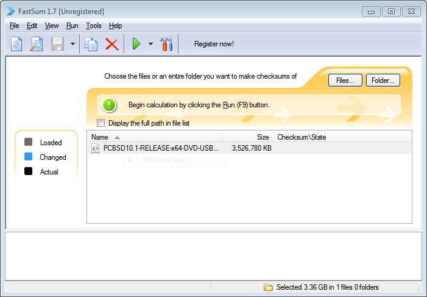
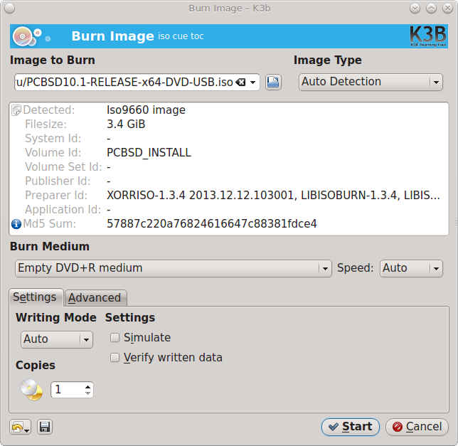
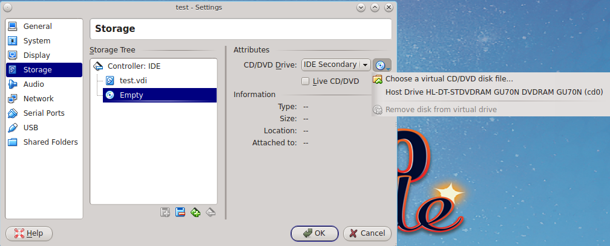

Pre-Installation Tasks
**********************

While the PC-BSD® installer is very easy to use, installing a brand new operating system can sometimes be a daunting task.

Before you begin, there are a few things you should check to ensure that your system is ready to install PC-BSD®. 

* **Are you dual-booting or installing over the entire drive?** If you are dual-booting you will need to ensure that you have a primary partition available.
  Refer to the section on :ref:`Dual Booting`.

* **Have you backed up your important data?** Any irreplaceable data, such as emails, bookmarks, or important files and documents should **always** be backed
  up to an external media, such as a removable drive or another system, **before** installing or upgrading any operating system.

If you wish to determine if your hardware is detected by PC-BSD®, start an installation and click the :ref:`Hardware Compatibility` button in the
:ref:`Language Selection Screen`.

Should you run into an issue with your installation, refer to :ref:`Finding Help`. 

This section discusses the PC-BSD® hardware requirements, how to prepare the system for installation, and how to obtain and prepare the installation media.

.. index:: hardware
.. _Minimum Requirements:

Minimum Requirements
====================

PC-BSD® has moderate hardware requirements and commonly uses less resources than its commercial counterparts. Before installing PC-BSD®, make sure that your
hardware or virtual machine at least meets the minimum requirements. To get the most out of your PC-BSD® experience, use a system that meets the recommended system
requirements.

At a **bare minimum** you need to meet these requirements in order to install PC-BSD®: 

* 64-bit processor

* 1 GB RAM 

* 20GB of free hard drive space on a primary partition for a TrueOS® server installation 

* Network card 

The following are the minimum **recommended** requirements. More RAM and available disk space will improve your computing experience: 

* 64-bit processor 

* 4 GB of RAM 

* 50GB of free hard drive space on a primary partition for a desktop installation 

* Network card 

* Sound card 

* NVIDIA 3D-accelerated video card 

The PC-BSD® installer's hardware check will display a warning message if the selected partition contains less than 20GB for a server installation or less
than 50GB for a desktop installation. The installation itself does not require this much disk space. Instead, the minimum recommendation is to provide
sufficient room for the installation of multiple desktops, applications, and to store local ZFS snapshots and boot environments.

You can never have too much RAM, so install as much as you can afford. To play modern video games, you should use a fast CPU. If you want to create a
collection of music and movies on your computer, you will want a large disk which can be internal or external.

.. index:: hardware
.. _Supported Hardware:

Supported Hardware 
==================

PC-BSD® should install on any system containing a 64-bit (also called amd64) processor. Despite the amd64 name, a 64-bit processor does **not need** to be
manufactured by AMD in order to be supported. The `FreeBSD Hardware Notes <http://www.freebsd.org/releases/11.0R/hardware.html#proc>`_ list the amd64
processors known to work.

Like most open source operating systems, PC-BSD® uses X.org drivers for graphics support. PC-BSD® will automatically detect the optimal video settings for
supported video drivers. You can verify that your graphics hardware is supported by clicking the :ref:`Hardware Compatibility` icon within the installer.

Support for the major graphic vendors is as follows: 

**NVIDIA:** if you want to use 3D acceleration, NVIDIA is currently the best supported as there is a native driver for PC-BSD®. If an NVIDIA video card is
detected, an "nVidia settings" icon will be added to the Control Panel for managing NVIDIA settings.

**Intel:** 3D acceleration on most Intel graphics is supported.

**ATI/Radeon:** 3D acceleration on most ATI and Radeon cards is supported.

**Optimus:** at this time there is no switching support between the two graphics adapters provided by Optimus. Optimus implementations vary, so PC-BSD® may
or may not be able to successfully load a graphics driver on your hardware. If you get a blank screen after installation, check your BIOS to see if it has an
option to disable one of the graphics adapters or to set "discrete" mode. If the BIOS does not provide a discrete mode, PC-BSD® will default to the 3D Intel
driver and disable NVIDIA. This will change in the future when the NVIDIA driver supports Optimus.

A list of usable graphics cards can be found on the `FreeBSD Graphics Wiki <https://wiki.freebsd.org/Graphics>`_.

PC-BSD® has built-in support for dozens of wireless networking cards. You can check if your card has a
`FreeBSD driver <http://www.freebsd.org/releases/11.0R/hardware.html#WLAN>`_. If it does, it should "just work". A list of
supported Atheros devices and known limitations can be found on the `Status of Atheros Wifi Hardware wiki page <https://wiki.freebsd.org/dev/ath_hal%284%29/HardwareSupport>`_.
A list of supported Intel devices and known limitations can be found on the `iwn(4) Intel 802.11n series NICs wiki page <https://wiki.freebsd.org/dev/iwn%284%29>`_.

PC-BSD® will automatically detect available wireless networks for supported wireless devices. You can verify that your device is supported by clicking the
:ref:`Hardware Compatibility` icon within the installer. If it an external wireless device, insert it before running the "Hardware Compatibility" utility.

Certain Broadcom devices, typically found in cheap laptops, are quite buggy and can have lockups when in DMA mode. If the device freezes, try switching to "PIO"
mode in the BIOS. Alternately, add the line *hw.bwn.usedma=0* to :file:`/boot/loader.conf` and reboot to see if that makes a difference. 

If you wish to check your hardware before installing PC-BSD®, a good place to start is the
`FreeBSD Hardware Notes <http://www.freebsd.org/releases/11.0R/hardware.html>`_. Another good resource is to start the installer and click the
:ref:`Hardware Compatibility` icon.

While most hardware "just works" with PC-BSD®, it is possible that you will run across a piece of hardware that does not. Remember that
PC-BSD® is really FreeBSD, meaning that any hardware that works on FreeBSD will work on PC-BSD®. If you are experiencing problems with a device, start with
a web search for the term "FreeBSD" plus the type and model of the hardware. This will let you know if there is a known issue with the device. If there are
many search results, concentrate on the most recent ones as often hardware that used to be problematic has since been fixed or the missing driver will be
available in an upcoming release of FreeBSD. If you experience problems with a device that should work but does not or you can not find any existing problem
reports for your hardware, you can help improve hardware support for all PC-BSD® users if you :ref:`Report a bug` so that it can be addressed by the
developers.

.. index:: laptops
.. _Laptops:

Laptops
-------

Many PC-BSD® users successfully run PC-BSD® on their laptops. However, depending upon the model of laptop, you may run across some issues. These typically
deal with: 

* **Sleep/suspend:** unfortunately, :wikipedia:`Advanced Configuration and Power Interface` (ACPI) is not an exact science, meaning that
  you may have to experiment with various :command:`sysctl` variables in order to achieve successful sleep and suspend states on your particular laptop model.
  If your laptop is a ThinkPad, `ThinkWiki <http://www.thinkwiki.org/wiki/ThinkWiki>`_ is an excellent source. For other types of laptops, try reading the "SYSCTL VARIABLES"
  section of :command:`man 4 acpi` and check to see if there is an ACPI man page specific to your vendor by typing :command:`apropos acpi.` The
  `Tuning with sysctl(8) <http://www.freebsd.org/doc/en/books/handbook/configtuning-sysctl.html>`_ section of the FreeBSD Handbook demonstrates how to
  determine your current :command:`sysctl` values, modify a value, and make a modified value persist after a reboot. If the battery reading is incorrect, try
  the workaround in this `PR <https://bugs.freebsd.org/bugzilla/show_bug.cgi?id=160838>`_.

* **Internal wireless:** some chipsets do not have a FreeBSD driver yet.

* **Synaptics:** depending upon the hardware, you may or may not be able to disable the system's touchpad. This
  `forum post <https://forums.freebsd.org/threads/17370/#post-100670>`_ describes how to enable Synaptics and some
  of the :command:`sysctl` options that this feature provides.

* **Optimus graphics:** the current workaround is to disable Optimus in the BIOS, set the onboard Intel video to be dominant, or to change the graphics mode
  to discrete.

If you wish to test your laptop's hardware, use the "Hardware Compatibility" icon in the :ref:`Language Selection Screen` before continuing with the
installation.

If you would like to install PC-BSD® onto an Asus Eee PC, read the `FreeBSD Eee page <https://wiki.FreeBSD.org/AsusEee>`_ first.

The `FreeBSD Tuning Power Consumption page <https://wiki.FreeBSD.org/TuningPowerConsumption>`_ has some tips for reducing power consumption.

.. index:: thinkpad

With regards to specific hardware, the ThinkPad T420 may panic during install. If it does, go into the BIOS and set the video mode to "discrete" which should allow you to complete an
installation. Some Thinkpads have a BIOS bug that prevents them from booting from GPT labeled disks. If you are unable to boot into a new installation, restart the
installer and go into "Advanced Mode" in the :ref:`Disk Selection Screen`. Make sure that the "Partition disk with GPT" box is unchecked. If it was checked
previously, redo the installation with the box unchecked.

.. index:: hardware
.. _Touch Screens:

Touch Screens 
--------------

PC-BSD® should automatically detect USB-based touch screen devices. If your display is USB and is not auto-detected, send the output of :command:`usbconfig`
and your :file:`/etc/X11/xorg.conf` file using the :ref:`Report a bug` tool.

.. index:: partition
.. _Creating Free Space:

Creating Free Space
===================

If you wish to dual-boot PC-BSD® with an existing operating system, you must first make sure that there is either a free partition or an area of free space to install into.
For example, if you are currently running a Windows operating system, it will be installed to the entire hard drive. You will need to first shrink the partition that contains
the current operating system in order to make room to install PC-BSD®. Shrinking is an operation that retains the current operating system, while reducing the size of its partition.
This section demonstrates how to create free space within Windows 7.

.. warning:: **before** shrinking a partition, make sure that you first back up your valuable data to an external media such as a removable USB drive!

To shrink the drive, open Computer Management and click :menuselection:`Storage --> Disk Management`. In the example shown in
:numref:`Figure %s: Viewing Disk Layout in Disk Management <partition1>`, the Windows system has three partitions: a 16GB recovery partition, a 100MB system partition, and a 450GB data
partition.

.. _partition1:

.. figure:: images/partition1.jpg

Since the three Windows partitions are using the entire disk, the data partition needs to be shrunk in order to create space to install PC-BSD® into. To
shrink the data partition, right-click the partition, which in this example is called *Acer (C:)*, and select "Shrink Volume". Wait a moment as it queries the
volume for available shrink space. The results will be displayed as seen in the example in :numref:`Figure %s: Available Shrink Space <shrink1>`. 

.. _shrink1:

.. figure:: images/shrink1.jpg

In this example, 321089MB of space is available. To divide the partition between Windows and PC-BSD®, change that number to *230000* and click the "Shrink"
button. When finished, the newly created free space will be displayed, as seen in :numref:`Figure %s: Disk Now Has Free Space <shrink2>`.

.. _shrink2: 

.. figure:: images/shrink2.jpg

.. warning:: it is important that you **do not** choose to install PC-BSD® into any of the three Windows partitions when you get
   to the :ref:`Disk Selection Screen` of the installer. It is a good idea to write down the sizes of all of the partitions so that you will recognize the free space when the
   PC-BSD® installer displays your current partitions.

.. _Obtaining PC-BSD®:

Obtaining PC-BSD®
==================

PC-BSD® version numbers are similar to those used by FreeBSD. In addition, PC-BSD® provides two branches. The branch that you choose to install or upgrade to
determines when you will receive updates as new features and drivers are added to the operating system. Downloadable image names include the version number,
where |version| is the most recent version, and either the word :file:`RELEASE` or :file:`STABLE`, where: 

* **RELEASE:** indicates that new drivers and features will not be added to the operating system until the next RELEASE version becomes available and the user
  upgrades to that new version. If reliability is more important to you than new features or drivers, use the RELEASE version.

* **STABLE:** around the 1st of each month, :ref:`Update Manager` will provide a patch which will update the operating system to include all of the new
  features and drivers. If you wish to have or test the latest features and drivers as they become available and can tolerate possible breakage caused by new
  features being available before the next RELEASE, use the STABLE version.

The image files for the current RELEASE can be downloaded from the `PC-BSD® website <http://www.pcbsd.org/download/>`_. Previous RELEASE versions and
STABLE versions can be downloaded from the `PC-BSD® CDN <http://iso.cdn.pcbsd.org/>`_. 

Several types of files are available for download. Before downloading a file, review the following descriptions to see which one best suits your needs: 

* Files beginning with :file:`PCBSD` and ending in :file:`DVD-USB.iso` contain all of the information needed to install a graphical desktop or command-line
  server as well as several applications during installation. This type of file can either be burned to a DVD media or a USB thumb drive. There will also be
  associated files with the same name but ending in a :file:`.md5` or :file:`.sha256` extension. Depending upon your current operating system and its tools,
  you can use the value in either one of those files to determine the integrity of the download, as described in :ref:`Data Integrity Check`. If a torrent is available,
  there will also be a file with the same name and a :file:`.torrent` extension.

* Files beginning with :file:`TrueOS` contain a command-line installer and are used to install a command-line version of a server. This type of file can
  either be burned to a CD media or a USB thumb drive. There will also be associated files with the same name but ending in a :file:`.md5` or
  :file:`.sha256` extension. Depending upon your current operating system and its tools, you can use the value in either one of those files to determine the
  integrity of the download, as described in :ref:`Data Integrity Check`. If a torrent is available, there will also be a file with the same name and a
  :file:`.torrent` extension.

* Files containing :file:`netinstall` in their name are used to perform a network install. These files can be burned to a CD, so are a smaller initial download size.
  However, they require an Internet connection during installation as the files needed by the installer will be downloaded from the Internet.

If you plan to install a graphical desktop, download the file with :file:`PCBSD` in its name and either burn it to a DVD media or write it to a removable USB
device.

If you prefer to install a command-line only server, you can either download the same ISO or download the ISO with :file:`TRUEOS` in the name. The
:file:`TRUEOS` download is smaller and can be burned to a CD or written to a removable USB device.

Pre-installed virtual images are also available, making it easy to use or try PC-BSD® in a virtual environment. Four types of images are
available: 

* Files ending in :file:`.ova` can be used in VirtualBox, as described in :ref:`Using the Downloadable .ova File`.

* Files ending in :file:`.vdi.xz` can be used in Virtualbox, as described in :ref:`Using the Downloadable VirtualBox or VMWare Disk`.

* Files ending in :file:`.vmdk.xz` can be used in VMware, as described in :ref:`Using the Downloadable VirtualBox or VMWare Disk`.

* Files ending in :file:`.raw.xz` can be used in Qemu and can also be converted to other virtual image formats.

When selecting a virtual image file, choose a format that matches your virtualization technology, and an edition that matches what you would like to use.
The following editions are available: 

* :file:`consumer-desktop`: provides an installed version of PC-BSD® with the KDE and Fluxbox desktop environments.

* :file:`trueos-server`: provides a pre-installed TrueOS® server that is command-line only.

If you downloaded an installation file, instead of a virtual image, refer to :ref:`Burning the Installation Media` for instructions on how to burn the file to
bootable media.

If you have a slow download connection or wish to support the PC-BSD® project financially, you can purchase PC-BSD® DVDs from the
`FreeBSD Mall <https://www.freebsdmall.com/cgi-bin/fm/scan/su=yes/fi=prod_bsd/sf=sku/sf=title/sf=category/se=pcbsd>`_.

Members of the PC-BSD® project attend many IT conferences across the globe and give out PC-BSD® DVDs at conference booths. Visiting a PC-BSD® booth is an
excellent way to meet other PC-BSD® users and to get your questions answered. Check the `PC-BSD® Blog <https://blog.pcbsd.org/>`_ to see if any events are
happening near you. If you are organizing a PC-BSD® booth, `contact us <http://www.pcbsd.org/support/>`_ to arrange for DVDs.

.. index:: checksum
.. _Data Integrity Check:

Data Integrity Check 
---------------------

After downloading the desired file, it is a good idea to check that the file is exactly the same as the one on the PC-BSD® server. While downloading, a
portion of the file may get damaged or lost, making the installation file unusable. Each PC-BSD® installation file has an associated MD5 and SHA256 checksum.
If a checksum of the file you downloaded matches, your download was successful. If a checksum does not match, try downloading the file again. In order to
verify a checksum, you will need to use a checksum verification utility.

.. note:: you only need to verify one of the checksums. The `PC-BSD® website <http://www.pcbsd.org/download/>`_  only lists the SHA256 while the
   `PC-BSD® CDN <http://iso.cdn.pcbsd.org/>`_ lists both the :file:`.md5` and the :file:`.sha256` checksum files. This section demonstrates how to verify an
   MD5 checksum.

If you are currently using a Windows system, you can download and install the `FastSum <http://www.fastsum.com/>`_ utility in order to verify the MD5 checksum. Once installed, launch the
program and click the "Files" button, shown in :numref:`Figure %s: Verifying a Checksum Using FastSum <fastsum1>`, to browse to the location of your downloaded file.

.. _fastsum1:

Once the file is selected, click the green arrow to calculate the checksum. Once calculated, it will be listed in the "Checksum\State" column, though FastSum
will capitalize the letters.

On Linux and BSD systems you can use the built-in :command:`md5` or :command:`md5sum` command line tool to check the MD5 checksum. In this example, the file
is located in the :file:`Downloads` subdirectory directory. You should substitute the name and location of the file that you downloaded::

 md5 Downloads/PCBSD11.0-RELEASE-x64-DVD-USB.iso 

.. index:: burn
.. _Burning the Installation Media:

Burning the Installation Media
==============================

If you downloaded an :file:`.iso` file, it can be burned to either a DVD (or a CD, if it is the TrueOS ISO) or to a removable USB device. This section
demonstrates how to do so using several different applications and operating systems.

.. index:: Windows
.. _Burning to DVD on Windows:

Burning to DVD on Windows 
--------------------------

Windows 7 has built-in support for writing ISO images to disc. Right-click on the :file:`.iso` file in Windows Explorer and select "Burn disk image". Select
the DVD device in the "Disk Burner" drop-down menu and then click "Burn" to write the disc. See the Microsoft article
`Burn a CD or DVD from an ISO file <http://windows.microsoft.com/en-US/windows7/Burn-a-CD-or-DVD-from-an-ISO-file>`_ for more detailed instructions.

Alternately, the `InfraRecorder utility <http://infrarecorder.org/>`_ is an open source burning application for both CDs and DVDs. Once installed, open InfraRecorder and
click on the "Write Image" button shown in :numref:`Figure %s: Initial InfraRecorder Screen <infra1>`.

.. _infra1:

.. figure:: images/infra1.png

InfraRecorder will display a screen where you can browse to the location of the :file:`.iso` file. Once selected, you will be presented with an options screen shown in
:numref:`Figure %s: Burn Options in InfraRecorder <infra2>`. You can accept the defaults and click "OK" to start the burn. When finished, the burner tray will open and a dialog box will
appear indicating that the burning process has finished.

.. _infra2:

.. figure:: images/infra2.png

.. index:: burn
.. _Burning to DVD on a BSD or Linux System:

Burning to DVD on a BSD or Linux System
---------------------------------------

`The K3B burner <https://www.kde.org/applications/multimedia/k3b/>`_ is an easy-to-use graphical burning application for Linux and BSD systems. This utility
can be installed using :ref:`AppCafe®`. Once installed, it can be run from any desktop by typing :command:`k3b`.

To burn your ISO, launch K3B, insert a blank DVD/CD media, browse to the location of the :file:`.iso` file in the screen shown in
:numref:`Figure %s: Selecting the Burn Image Tool Within K3B <k3b1>`, and click :menuselection:`Tools --> Burn Image...` to see the screen in
:numref:`Figure %s: K3B's Burn Image Screen <k3b2>`.

.. _k3b1:

.. figure:: images/k3b1.png

.. _k3b2:

Click the "Start" button to burn the file. K3B will automatically eject the media once the burn is complete.

`The Brasero burner <https://wiki.gnome.org/Apps/Brasero>`_ provides an alternative, easy-to-use burning application included with the :ref:`GNOME` desktop. A stand-alone application is also
available within :ref:`AppCafe®`. Once installed, Brasero can be launched by typing :command:`brasero` from within any window manager.
:numref:`Figure %s: Brasero's Initial Screen <brasero1>` shows the initial Brasero screen.

.. _brasero1:

.. figure:: images/brasero1.png

Click "Burn image" to open the screen seen in :numref:`Figure %s: Brasero Image Burning Setup <brasero2>`. Use the "Click here to select a disk image" button to select your
:file:`.iso` file.

.. _brasero2:

.. figure:: images/brasero2.png

The name and size of your :file:`.iso` file should appear and Brasero will indicate the size of the media. If you click on the "Properties" button, you can change some options, but it is
fine to keep the default settings. When you are ready, click the "Burn" button and Brasero will burn your ISO.

If you are familiar with using the command line on a FreeBSD or PC-BSD® system, you can use the :command:`growisofs` command line utility to burn the DVD.
This utility is included with the dvd+rw-tools FreeBSD port which is installed by default on a PC-BSD® system. If that software is not yet installed on a
FreeBSD system, issue this command as the superuser::

 pkg install dvd+rw-tools

Depending upon the type of DVD burner hardware, you may have to configure the system to use it. If the device is ATAPI (i.e. not USB or SCSI), the ATAPI
driver must be loaded. The superuser can issue this command::

 kldload atapicam

If you just get your prompt back, the driver successfully loaded. If you get the message "kldload: can't load atapicam: File exists", this means that the
driver was already loaded. If the device is USB or SCSI, no additional drivers need to be loaded if you are running the generic FreeBSD kernel. After
inserting the DVD media into the device, you can start the burn using this command::

 growisofs -Z /dev/cd0=PCBSD11.0-RELEASE-x64-DVD-USB.iso

If your device is not the first CD device, change the number *0* accordingly. If your ISO has a different name, substitute the correct name in the command
shown above.

.. index:: Mac
.. _Burning to DVD on a Mac OS X System:

Burning to DVD on a Mac OS X System
-----------------------------------

To burn the ISO on a Mac OS X system, go to :menuselection:`Finder --> Applications --> Utilities --> Disk Utility`. With a blank media inserted into the
burner, highlight the device representing the DVD writer and click the "Burn" button. This will open up a browser where you can select the ISO to burn.

Once the ISO is highlighted, click the "Burn" button. A pop-up message will indicate that the device is ready to burn. Click "Burn" once more and Disk Utility
will write the ISO to the DVD media.

.. index:: burn
.. _Writing to a USB Device:

Writing to a USB Device
-----------------------

To write to a USB device, you will need the following: 

* a utility that can write the image to a USB media; the utility that you use will depend upon your operating system 

* a USB thumb drive or hard drive large enough to hold the image 

Once the image is written, boot from the removable device and proceed with the PC-BSD® installation.

.. note:: if there is a card reader on the system or the USB drive is connected using a USB dongle, device enumeration may be affected. For example, with the USB card reader dongle
   as the destination, the device name could be :file:`/dev/da1` instead of :file:`/dev/da0`.

To write the :file:`.iso` file to a flash card or removable USB drive on a BSD or Linux system, use the :command:`dd` command line utility. On a FreeBSD
system, the superuser can use this command to write the file to the first plugged in USB device::

 dd if=PCBSD11.0-RELEASE-x64-DVD-USB.iso of=/dev/da0 bs=1M
 3658+1 records in
 3658+1 records out 
 3836317696 bytes transferred in 670.278574 secs (5723468 bytes/sec)

When using the :command:`dd` command: 

* **if=** refers to the input file to be written

* **of=** refers to the output file (the device name of the flash card or removable USB drive); increment the number in the name if it is not the first USB
  device 

* **bs=** refers to the block size 

.. note:: on Linux, if you type :command:`mount` with the USB stick inserted, you will see two or more device nodes corresponding to the USB stick. For
   example, :file:`/dev/sdc` and :file:`/dev/sdc1`, where :file:`/dev/sdc1` corresponds to the primary partition of the USB stick. Before using the
   :command:`dd` command, ensure that the usb stick is first unmounted. Then, remember to use :file:`/dev/sdc` (the device node
   without the number) as the option for the output file **of=**. Once the :command:`dd` completes, you might not be able to mount the USB stick on Linux as
   Linux has very limited support for UFS, the BSD filesystem that gets created on the USB stick.

To burn the image file on a Windows system, you can use `win32-image-writer <https://sourceforge.net/projects/win32diskimager/>`_. When downloading win32-image-writer,
download the latest version that ends in :file:`-binary.zip` and use a utility such as Windows Explorer or 7zip to unzip the executable.

If you launch :command:`win32-image-writer.exe`, it will start the Win32 Disk Imager utility, shown in :numref:`Figure %s: Using Win32 Disk Imager to Write the Image <writer1>`. Use the
"browse" button to browse to the location of the :file:`.iso` file. Insert a USB thumb drive and select its drive letter (in this example, drive D). Click the "Write" button and the image
will be written to the USB thumb drive.

.. _writer1:

.. figure:: images/writer1.png

To burn the :file:`.iso` file on Mac OS X, insert a USB stick and open Terminal. Run the :command:`diskutil list` command to find out the device name of the
USB disk, unmount the USB disk, then use :command:`dd` to write the image to the raw disk (:file:`rdisk`). In the following example, an 8GB USB stick has a
device name of :file:`/dev/disk1` and a raw device name of :file:`/dev/rdisk1`.::

 diskutil list 
 /dev/disk0
 #: TYPE NAME SIZE IDENTIFIER
 0: GUID_partition_scheme *500.1 GB disk0
 1: EFI 209.7 MB disk0s1
 2: Apple_HFS Macintosh HD 499.2 GB disk0s2
 3: Apple_Boot Recovery HD 650.0 MB disk0s3 
 /dev/disk1
 #: TYPE NAME SIZE IDENTIFIER
 0: FDisk_partition_scheme *8.0 GB disk1
 1: DOS_FAT_32 UNTITLED 8.0 GB disk1s1

 diskutil unmountDisk /dev/disk1
 Unmount of all volumes on disk1 was successful

 sudo dd if=/Users/dru/Downloads/ PCBSD11.0-RELEASE-x64-DVD-USB.iso of=/dev/rdisk1 bs=4m # 4M for older OS X
 Password:
 3658+1 records in
 3658+1 records out 
 3836317696 bytes transferred in 670.278574 secs (5723468 bytes/sec)

.. index:: virtualization
.. _Virtualization:

Virtualization
==============

A virtualized environment allows you to test drive an operating system without overwriting your current operating system. This is an excellent way to practice
installation, determine whether all of your hardware is supported, or to try multiple versions of different operating systems. Virtualization software
effectively creates windows (known as virtual machines) into which you can install and use an operating system. The only limitation to virtualization is your
hardware as each virtual machine uses CPU and RAM. Depending upon the amount of CPU and RAM in your computer, you may find that the operating system you
install using virtualization software runs slowly. If your computer slows down greatly, try closing other applications running on your computer to free up
some RAM.

During the installation of PC-BSD®, you can choose to install the `VirtualBox <https://www.virtualbox.org/>`_ open source virtualization program and the
`VirtualBox Guest Additions <http://www.virtualbox.org/manual/ch04.html>`_ with the operating system. The guest additions add mouse pointer integration,
shared folders between the host and guest, better video support, and a shared clipboard. To install these after installation, use :ref:`AppCafe®` and search
for "virtualbox".

.. note:: the first time you run VirtualBox on a PC-BSD® system, a background script will automatically give your user account the permissions required to run
   this application. Depending upon your desktop, this might break any existing shortcuts to VirtualBox. To fix the shortcut, logout and back in.

If your computer is running another operating system, download the binary for your operating system from the
`VirtualBox Downloads page <https://www.virtualbox.org/wiki/Downloads>`_. VirtualBox runs on Windows, Linux, Macintosh, and OpenSolaris and supports a large
number of operating systems that can be installed into a virtual machine.

This section describes how to prepare VirtualBox for an installation of PC-BSD® using an :file:`.iso` file as well as how to use the downloadable
:file:`.vmdk`, :file:`.vdi`, and :file:`.ova` images with VirtualBox.

.. index:: virtualization
.. _Creating a Virtual Machine for an ISO File:

Creating a Virtual Machine for an ISO File
------------------------------------------

Once you have downloaded the PC-BSD® ISO and installed VirtualBox on the current system, create a virtual machine and use the ISO to install PC-BSD® into
the virtual machine. The virtual machine must meet the following minimum requirements: 

* 1024 MB base memory size 

* a virtual disk **at least 20 GB in size** for a TrueOS® installation or **at least 50 GB in size** for a PC-BSD® installation 

* a bridged adapter 

To create the virtual machine, start VirtualBox to see the screen shown in :numref:`Figure %s: Initial VirtualBox Screen <vbox1>`. 

.. _vbox1:

.. figure:: images/vbox1.png

Click the "New" button to start the new virtual machine wizard. Click the "Next" button to see the screen in
:numref:`Figure %s: Type in a Name and Select the Operating System for the New Virtual Machine <vbox2>`.

.. _vbox2:

.. figure:: images/vbox2.png

Enter a name for your virtual machine, which can be anything that makes sense to you. Click the "Operating System" drop-down menu and select "BSD". In the
"Version" drop-down menu, select "FreeBSD (64 bit)". Click "Next" to see the screen in :numref:`Figure %s: Select the Amount of Memory Reserved for the Virtual Machine <vbox3>`.

.. _vbox3:

.. figure:: images/vbox3.png

The base memory size must be changed to **at least 1024 MB.** If your system has a lot of RAM, use more. Any number within the green area is considered a
safe value by VirtualBox, meaning it should not slow down your computer too much. When finished, click Next to see the screen in
:numref:`Figure %s: Select Whether to Use an Existing or Create a New Virtual Hard Drive <vbox4>`.

.. _vbox4:

.. figure:: images/vbox4.png

This screen is used to create the virtual hard drive, or the amount of disk space that will be available to the virtual machine. If this is your
first virtual machine, keep the default of "Create a virtual hard drive now" and click "Create" to go to the screen shown in :numref:`Figure %s: Select the Hard Drive Type <vbox5>`.
If you have created a virtual machine in the past and wish to reuse its disk space, select "Use an existing virtual hard drive file" from the drop-down menu.
You can create as many virtual machines as you wish. However, if your computer is getting low on disk space, you should consider reusing existing virtual hard
drives to prevent your physical hard drive from being used up by old virtual machines.

.. _vbox5:

.. figure:: images/vbox5.png

Select "VDI" and click the "Next" button to see the screen in :numref:`Figure %s: Select the Storage Type <vbox6>`.

.. _vbox6:

.. figure:: images/vbox6.png

You can now choose whether you want "Dynamically allocated" or "Fixed size" storage. The first option uses disk space as needed until it reaches the maximum
size that you will set in the next screen. The second option creates a disk the same size as that specified amount of disk space, whether it is used or not.
Choose the first option if you are worried about disk space; otherwise choose the second option as it allows VirtualBox to run slightly faster. Once you
select "Next", you will see the screen in :numref:`Figure %s: Select the File Name and Size of the Virtual Disk <vbox7>`.

.. _vbox7:

.. figure:: images/vbox7.png

This screen is used to set the size (or upper limit) of the virtual machine. If you plan to install PC-BSD® into the virtual machine,
**increase the size to at least 20 GB** or you will receive an error during the PC-BSD® installation. If you plan to install KDE, GNOME, multiple desktop
managers, or applications within the virtual machine, you will probably want to choose at least 50GB. Whatever size you set, make sure that your computer has
enough free disk space to support it. Use the folder icon to browse to a directory on disk with sufficient space to hold your virtual machine.

Once you make your selection and press "Next", you will see a summary of your choices. You can use the "Back" button to return to a previous screen if you
wish to change any values. Otherwise, click "Create" to finish using the wizard. Your virtual machine should now show up in the left box, as seen in the
example in :numref:`Figure %s: The New Virtual Machine <vbox8>`.

.. _vbox8:

.. figure:: images/vbox8.png

In order to use your network card, configure bridging on your virtual machine. To do this, go to :menuselection:`Settings --> Network`. In
the "Attached to" drop-down menu select "Bridged Adapter" then select the name of the physical interface from the "Name" drop-down menu. In the example shown
in :numref:`Figure %s: Configuring a Bridged Adapter in VirtualBox <vbox9>`, the Intel Pro/1000 Ethernet card is attached to the network and has a device name of :file:`re0`.

.. _vbox9:

.. figure:: images/vbox9.png

Before starting your virtual machine, configure it to use your installation media. Click the "Storage" hyperlink in the right frame to access
the storage screen seen in :numref:`Figure %s: The Storage Settings of the Virtual Machine <vbox10>`.

.. _vbox10:

Double-click the word "Empty", which represents your DVD reader. If you wish to access the PC-BSD® installer from your DVD reader, double-check that the
"Slot" is pointing to the correct location (e.g. "IDE Secondary Master") and use the drop-down menu to change it if the location is incorrect. Click the
"CD/DVD Device" drop-down menu to change it from empty to the "Host Drive" value.

If you prefer to use an ISO that is stored on your hard disk, click the DVD icon then "Choose a virtual CD/DVD disk file" to open a browser menu where you can
navigate to the location of the ISO. Highlight the desired ISO and click "Open". The name of the ISO will now appear in the "Storage Tree" section.

You are now ready to install PC-BSD® into your virtual machine. Simply highlight the virtual machine and click on the green "Start" icon. A window will open
indicating that the virtual machine is starting. If you have a DVD inserted, you should hear it spin and it should start to boot into the installation
program. If it does not or if you are using an ISO stored on the hard disk, press "F12" to select the boot device when you see the message to do so, then
press "c" to boot from CD-ROM. You can then proceed through the installation as described in :ref:`Installing PC-BSD®`.

.. index:: virtualization
.. _Using the Downloadable VirtualBox or VMWare Disk:

Using the Downloadable VirtualBox or VMWare Disk
------------------------------------------------

PC-BSD® provides pre-built VirtualBox and VMWare disks which create a a pre-made virtual machine with PC-BSD® already installed. The VirtualBox file ends in
a :file:`.vdi.xz` extension and the VMWare disk file ends in a :file:`.vmdk.xz` extension. The :file:`.xz` means that the file needs to be unzipped first so that it
just ends with a :file:`.vdi` or :file:`.vmdk` extension.

On a Linux or BSD system, use the :command:`xz` command by giving it the name of the file which you downloaded::

 xz -d PCBSD11.0-RELEASE-x64-consumer-desktop.vmdk.xz

Since this is a large file, the command will take a few minutes to extract the image. You will receive the prompt back when it has finished.

On a Windows system, you can use a utility such as `7-Zip <http://www.7-zip.org/>`_. On a Mac OS X system, simply double-click the file in "Finder" to extract
it.

Once the file is unzipped, open VirtualBox. When you get to :numref:`Figure %s: Select Whether to Use an Existing or Create a New Virtual Hard Drive <vbox4>`, select "Use an existing virtual
hard drive file". 

Use the browse icon to browse to the location of the :file:`.vdi` or :file:`.vmdk` file then press "Next". A message will indicate that the virtual machine
will be created. Click the "Create" button to finish the wizard. You can then configure the network adapter and start the virtual machine.

The "consumer-desktop" virtual machine will boot into the post-installation configuration screens so that the system can be configured. Once the display
wizard is finished and the login menu appears, input the username and password that you configured at the :ref:`Create a User Screen`.

When using the "trueos-server" edition, the virtual machine will boot into a password prompt. Enter *root* as the username and *pcbsd* as the password. It is
recommended to immediately change the *root* password by typing :command:`passwd` and following the prompts. It is also recommended to create a user account
to login with. You can do so by typing :command:`adduser` and following the prompts.

.. index:: virtualization
.. _Using the Downloadable .ova File:

Using the Downloadable .ova File
--------------------------------

A file that ends in a :file:`.ova` extension is a tarball of a virtual machine that follows the Open Virtualization Format (OVF). This file can be used in any
virtualization technology that supports OVF, such as VirtualBox or VMware.

If you double-click the :file:`.ova` file on a Windows or Mac system, it will automatically open the image for you in the default virtualization application.

The first time you open an :file:`.ova` file on a PC-BSD® system, right-click the file, select "Open With", browse to the application to open it with, and
check the box "Remember application association for this type of file". The following example assumes the user has selected
:menuselection:`System --> Oracle VM VirtualBox` as the application.

The first time a PC-BSD® :file:`.ova` file is opened, a screen will open so that you can review the virtual machine's settings that came with the file. An
example is shown in :numref:`Figure %s: Appliance Settings Screen <ova1>`. To edit a setting, double-click its name.

.. _ova1:

.. figure:: images/ova1.png

Depending upon the setting, you can either type in the desired value or select it from a drop-down menu. Once you are finished, click the "Import" button. It
will take a few minutes for the import to complete and a status bar will indicate the status of the import. Once imported, the virtual machine will show in
the left frame of VirtualBox. Highlight the virtual machine and click "Start" to boot into the image.

When using the "consumer-desktop" edition, the virtual machine will boot into Figure 4.2a so that you can perform the post-installation configuration for the
desktop.

When using the "trueos-server" edition, the virtual machine will boot into a password prompt. Enter *root* as the username and *pcbsd* as the password. It is
recommended to immediately change the *root* password by typing :command:`passwd` and following the prompts. It is also recommended to create a user account
to login with. You can do so by typing :command:`adduser` and following the prompts.
