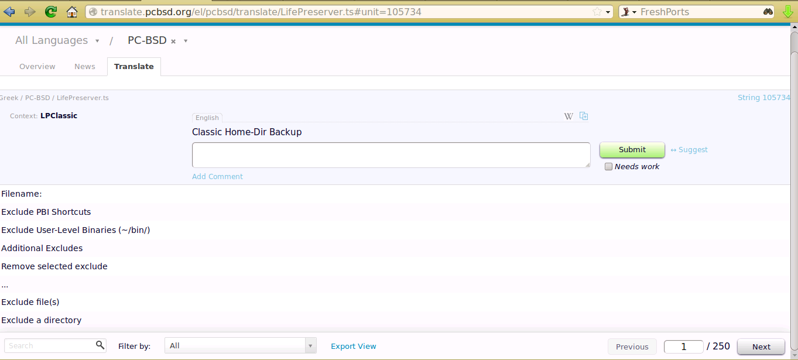
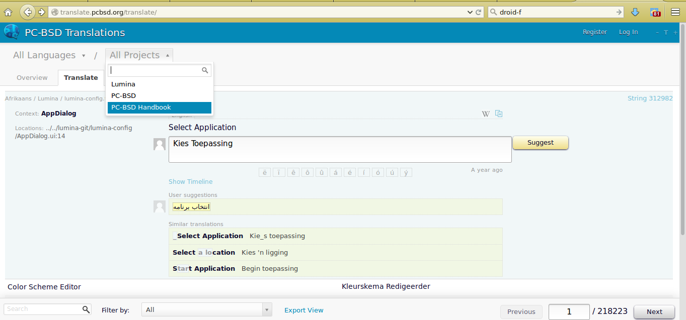
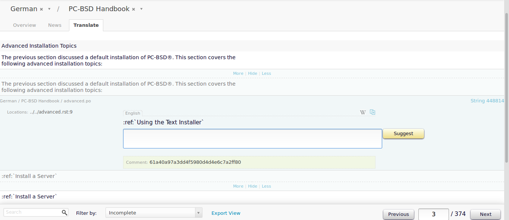
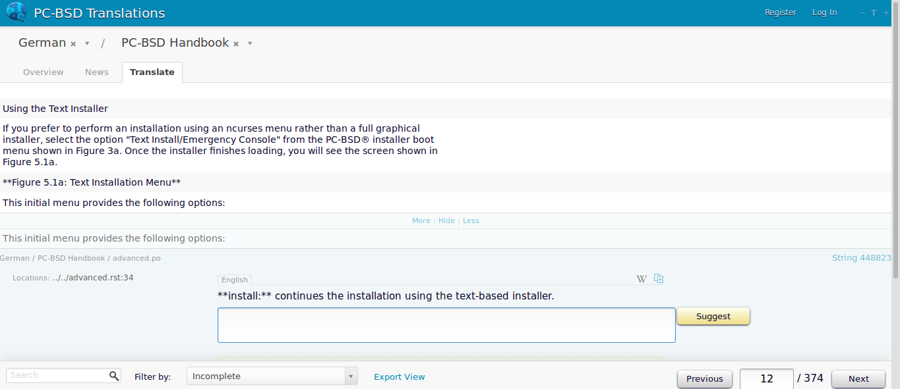

.. index:: advocacy
.. _Supporting TrueOS®:

Supporting TrueOS®
*******************

TrueOS® is a community project which relies on involvement from its users and supporters. This section lists some ideas for becoming involved.

.. index:: testing
.. _Become a Beta Tester:

Become a Beta Tester
====================

If you like playing around with operating systems and have a bit of spare time, one of the most effective ways you can assist the TrueOS® community is by
reporting problems you encounter while using TrueOS®. 

If you have a spare system or virtual machine, you can also download and try out the latest release candidate snapshots. These versions are still in testing
and have not been officially released yet. Having as many people as possible using TrueOS® on many different hardware configurations assists the Project in
finding and fixing bugs. This makes using TrueOS® better for everyone. Subscribing to the `PC-BSD® blog <https://blog.pcbsd.org/>`_ is a good way to keep
up-to-date on the availability of testing snapshots and any major bugs that affect users.

If becoming a tester interests you, subscribe to the `testing mailing list <http://lists.pcbsd.org/mailman/listinfo/testing>`_. As new testing versions become
available they will be announced on this list. You will also be able to see what problems other testers are finding and can check to see if the problem exists
on your hardware as well. You can also subscribe to `these RSS feeds <http://dir.gmane.org/gmane.os.pcbsd.testing>`_ if you want a quick way to keep up with
the subjects being discussed on the testing mailing list.

Anyone can become a beta tester. Follow these tips so that you can accurately describe your findings so they can be fixed as soon as possible: 

* Before you :ref:`Report a bug`, skim through the archives of the `testing mailing list <http://lists.pcbsd.org/mailman/listinfo/testing>`_ to see if anyone else has reported a similar
  problem.

* When reporting a new issue, use a descriptive subject that includes the error and the version of TrueOS®. Ideally, the subject is short (8 words or less)
  and contains key words about the error. An example would be "AppCafe on 10.2-RELEASE-p1 fails to create jail". 

* Ensure that the body of the bug report includes the TrueOS® version.

* Give a short (2-3 sentences) description of how to recreate the error. If there is an error message, include its complete text.

* Include any other info that may be useful (e.g. this used to work on 10.0).

* If the problem appears to be hardware related, include a copy of :file:`/var/run/dmesg.boot` as this file shows the hardware that was probed the last time
  the TrueOS® system booted.
  
.. index:: translations
.. _Become a Translator:

Become a Translator
===================

If you are interested in translating TrueOS® into your native language, there are three translation areas that you can choose to become involved in: 

1. Translate the graphical menus within the TrueOS® operating system.

2. Translate the documentation that is published with TrueOS®. 

3. Translate the TrueOS® website.

This section describes each of these translation areas in more detail and how to get started as a translator.

Regardless of the type of translation you are interested in, you should first join the
`translations mailing list <http://lists.pcbsd.org/mailman/listinfo/translations>`_. When you join, send an email to introduce yourself and indicate which
language(s) and which type(s) of translations you can assist with. This will allow you to meet other volunteers as well as keep abreast of any notices or
updates that affect translators.

.. index:: translations
.. _Interface Translation:

Interface Translation
---------------------

TrueOS® uses :wikipedia:`Pootle` for managing localization of the menu screens used by the installer and the TrueOS® utilities.
Pootle makes it possible to find out if your native language has been fully localized for TrueOS®. Pootle also makes it easy for users to check and submit
translated text as it provides a web editor and commenting system. This means that translators can spend their time making and reviewing translations rather
than learning how to use a translation tool.

To see the status of a localization, open up the `translation website <http://translate.pcbsd.org/>`_ in a web browser, as seen in
:numref:`Figure %s: The TrueOS® Pootle Translation System <translate1>`. 

.. _translate1:

.. figure:: images/translate1.png

The localizations TrueOS® users have requested are listed alphabetically on the left. If your language is missing and you would like to help in its
translation, send an email to the `translations mailing list <http://lists.pcbsd.org/mailman/listinfo/translations>`_ so it can be added.

The green bar in the "Progress" column indicates the percentage of TrueOS® menus that have been localized. If a language is not at 100%, it means that the
menus that currently are not translated will appear in English instead of in that language.

If you click on a language name then click on the "PC-BSD" hyperlink under the "Name" column, you will see each menu item that is available for translation. The example shown in
:numref:`Figure %s: Viewing a Language's Available Menus <translate2>` is for the Greek localization. In this example, the menu for "ethernetconfig" is complete, but the one for
"LifePreserver" is not.

.. _translate2:

.. figure:: images/translate2.png

In order to edit a translation, you need to first create a Pootle login account. Once you are logged in to Pootle, navigate to the menu item that you wish to
translate. In :numref:`Figure %s: Using the Pootle Interface to Edit a Translation String <translate3>`, the translator has clicked on "LifePreserver.ts" then clicked the "Translate" tab.

.. _translate3:

In this example, the first string, the phrase "Classic Home-Dir Backup" has not yet been translated. To add the translation, type the translated text into the
white text field and click the "Submit" button. To translate another text field, click on the hyperlink associated with its name, or use the "Next" and
"Previous" links to navigate between text fields. Sometimes, a text field exists in another screen and already has a translation.
:numref:`Figure %s: Selecting a Suggested Translation <translate4>` provides an example where the translator clicked the hyperlink for "Filename" which displays three previous translations.
The translator then clicked the first suggestion and it was automatically added to the white text field.

.. _translate4:

.. figure:: images/translate4.png

If you need help with a translation or using the Pootle system, you can ask for help on the translations mailing list or in the
`translations forum <https://forums.pcbsd.org/forum-40.html>`_. 

.. index:: translations
.. _Documentation Translation:

Documentation Translation
-------------------------

The source for the TrueOS® Users Handbook is stored in the
`PC-BSD® github repository <https://github.com/trueos/pcbsd/tree/master/src-qt5/docs>`_. This means that the documentation and any translations can be built
with the operating system and updates to this documentation can be automatically installed when the system is updated using :ref:`Update Manager`. This has the
added advantage of making sure that the installed version of the Handbook always matches the operating system version and that, as new features are added,
that they are documented and appear as a local copy on the user's system. The local copy is stored in :file:`/usr/local/share/pcbsd/doc/html` and a desktop shortcut
provides easy access to the documentation.

At this time, the TrueOS® build server has been configured to automatically build the HTML version of the TrueOS® Users Handbook. Over time, additional
:file:`Makefiles` will be tested and added to provide the documentation in other formats, such as single HTML, PDF, and EPUB. Instructions for building your own
HTML or PDF version can be found in this `README.md <https://github.com/trueos/pcbsd/blob/master/src-qt5/docs/README.md>`_.

The documentation source files have been integrated into the Pootle translation system so that the TrueOS® documentation can be translated using a web browser.
The process is similar to :ref:`Interface Translation` except that you must first select "PC-BSD Handbook" from the "Projects" drop-down menu shown in
:numref:`Figure %s: Selecting the Handbook Project <translate5>`.

.. _translate5:

You can then select the language to translate into from the available languages list. If the language that you want to translate is not listed, send an email to
the `translations mailing list <http://lists.pcbsd.org/mailman/listinfo/translations>`_ and request that it be added.

When translating the documentation, be aware of the following:

* At this time, some formatting tags are still displayed in raw text, as seen in the examples in :numref:`Figure %s: Do Not Remove Formatting Characters <translate6>`
  and :numref:`Figure %s: Another Formatting Characters Example <translate7>`.
  **It is IMPORTANT that you do not accidentally remove the formatting as this can break the documentation build for that language.** In the first example, it is OK to
  translate the phrase "Using the Text Installer" but care must be taken to not accidental remove any of the surrounding colons and backticks, or to change the text
  of the "ref" tag. In the second example, the asterisks are used to bold the word "install". It is OK to translate "install", but do not remove the asterisks.

.. _translate6:

.. _translate7:

If you would like to receive notifications of documentation changes that affect translations, subscribe to the
`Translation-notifications <http://lists.pcbsd.org/mailman/listinfo/translations-notifications>`_ mailing list.

If you would like to build a local HTML copy that includes the latest translations, either for your own use or to visualize the translated Guide, do the following from the command line.
These instructions are for a TrueOS® system::

 sudo pkg install pcbsd-toolchain
 rehash
 git clone git://github.com/trueos/pcbsd.git
 cd pcbsd/src-qt5/docs 
 sudo make i18n
 make html
 ls _build
 doctrees                html-es                 html-tr  		pcbsd-handbook-i18n.txz               
 html                    html-fr                 html-uk
 html-da		 html-id		 locale
 html-de                 html-pt_BR        	 locale-po     

 
This will make an HTML version of the Guide for each of the available translations. In this example, translations are available for English (in :file:`html`), Danish, German, Spanish,
French, Indonesian, Brazilian Portuguese, Turkish, and UK English. To update the HTML at a later time::

 cd ~/pcbsd
 git pull
 cd src-qt5/docs 
 sudo make i18n
 sudo make html

.. index:: translations
.. _Website Translation:

Website Translation
-------------------

If you are interested in translating the PC-BSD® website, send an email to the
`translations mailing list <http://lists.pcbsd.org/mailman/listinfo/translations>`_. Someone will introduce you to the webmaster who will get you started on
website translation.

Currently, the the website is being translated to several languages, including: Dutch, French, German, Polish, Spanish, Swedish, and Turkish.

.. index:: development
.. _Become a Developer:

Become a Developer
==================

If you like programming, and especially coding on FreeBSD, we would love to see you join the TrueOS® team as a TrueOS® committer. Developers who want to help improve the
TrueOS® codebase are always welcome! If you would like to participate in core development, subscribe to the
`developers mailing list <http://lists.pcbsd.org/mailman/listinfo/dev>`_. Once you have signed up, feel free to browse the active tickets in the PC-BSD®
`bug tracker <https://bugs.pcbsd.org/projects/pcbsd/>`_. If you see something that you want to work on, or have a proposal for a project you wish to add to
TrueOS®, please let us know via the developers list and we will be happy to help get you started.

Most of the TrueOS® specific GUI tools are developed in C++ using the Qt Libraries, and other non-GUI development is done using standard Bourne shell
scripts. There may be cases where other languages or libraries are needed, but those will be evaluated on a case-by-case basis, so feel free to let us know
your proposals on the developers mailing list.

.. index:: development
.. _Getting the Source Code:

Getting the Source Code
-----------------------

The TrueOS® source code is available from github and :command:`git` needs to be installed in order to download the source code. When using TrueOS®,
:command:`git` is included in the base install.

To download the source code, :command:`cd` to the directory to store the source and type::

 git clone git://github.com/trueos/pcbsd.git

This will create a directory named :file:`pcbsd/` which contains the local copy of the repository. To keep the local copy in sync with the official
repository, run :command:`git pull` within the :file:`pcbsd` directory.

TrueOS® graphical applications use Qt version 5 and their source is located in :file:`pcbsd/src-qt5/`. In order to compile the applications in this
directory, install the "PC-BSD Build Toolchain" package using :ref:`AppCafe®`. To instead install this software from the command line, type :command:`pkg install pcbsd-toolchain`.

Most of the TrueOS® source code is divided into two sub-categories: 

* :file:`src-sh/` contains shell and C programs which do not include GUIs. These are the command line utilities used in TrueOS®.

* :file:`src-qt5/` contains the desktop Qt5-based GUIs.

To compile the command line utilities::

 cd src-sh

 make

To compile the graphical utilities::

 cd src-qt5

 /usr/local/lib/qt5/bin/qmake

 make

Several Qt IDEs are available in :ref:`AppCafe®`. The `QtCreator <http://wiki.qt.io/Category:Tools::QtCreator>`_ application is a full-featured IDE designed
to help new Qt users get up and running faster while boosting the productivity of experienced Qt developers.
`Qt Designer <http://doc.qt.io/qt-4.8/designer-manual.html>`_ is lighter weight as it is only a :file:`.ui` file editor and does not provide any
other IDE functionality. To install this package, check the "Search all available software" in the "App Search" tab of AppCafe® and search for "qt5-designer".
Alternately, install it using :command:`pkg install qt5-designer`.

If you plan to submit changes so that they can be included in TrueOS®, fork the repository using the instructions in
`fork a repo <https://help.github.com/articles/fork-a-repo>`_. Make your changes to the fork, then submit them by issuing a
`git pull request <https://help.github.com/articles/using-pull-requests>`_. Once your changes have been reviewed, they will be committed or sent back with
suggestions.

.. index:: development
.. _Design Guidelines:

Design Guidelines
-----------------

TrueOS® is a community driven project that relies on the support of developers in the community to help in the design and implementation of new utilities and
tools for TrueOS®. The Project aims to present a unified design so that programs feel familiar to users. As an example, while programs could have
"File", "Main", or "System" as their first entry in a menu bar, "File" is used as the accepted norm for the first category on the menu bar.

This section describes a small list of guidelines for menu and program design in TrueOS®.

Any graphical program that is a full-featured utility, such as :ref:`Life Preserver`, should have a "File" menu. However, file menus are not
necessary for small widget programs or dialogue boxes. When making a file menu, a good rule of thumb is keep it simple. Most TrueOS® utilities do not need
more than two or three items on the file menu.

"Configure" is our adopted standard for the category that contains settings or configuration-related settings. If additional categories are needed, check to
see what other TrueOS® utilities are using.

File menu icons are taken from the KDE Oxygen theme located in :file:`/usr/local/share/icons/oxygen`. Use these file menu icons so we do not have a bunch of
different icons used for the same function. Table 11.3a lists the commonly used icons and their default file names.

**Table 11.3a: Commonly Used File Menu Icons** 

+-----------+-----------------+--------------------+
| Function  | File Menu Icon  | File Name          |
+===========+=================+====================+
| Quit      | row 1, cell 2   | window-close.png   |
+-----------+-----------------+--------------------+
| Settings  | row 2, cell 2   | configure.png      |
+-----------+-----------------+--------------------+

TrueOS® utilities use these buttons as follows: 

* **Apply:** applies settings and leaves the window open.

* **Close:** closes program without applying settings.

* **OK:** closes dialogue window and saves settings.

* **Cancel:** closes dialog window without applying settings.

* **Save:** saves settings and closes window.

Fully functional programs like :ref:`Life Preserver` do not use close buttons on the front of the application. Basically, whenever there is a
"File" menu, that and an "x" in the top right corner of the application are used instead. Dialogues and widget programs are exceptions to this rule. A good
example of a widget program would be :ref:`Update Manager`. 

Many users benefit from keyboard shortcuts and we aim to make them available in every TrueOS® utility. Qt makes it easy to assign keyboard shortcuts. For
instance, to configure keyboard shortcuts that browse the "File" menu, put *&File* in the text slot for the menu entry when making the application.
Whichever letter has the *&* symbol in front of it will become the hot key. You can also make a shortcut key by clicking the menu or submenu entry and
assigning a shortcut key. Be careful not to duplicate hot keys or shortcut keys. Every key in a menu and submenu should have a key assigned for ease of use
and accessibility. Tables 11.3b and 11.3c summarize the commonly used shortcut and hot keys.

**Table 11.3b: Shortcut Keys** 

+---------------+---------+
| Shortcut Key  | Action  |
+===============+=========+
| CTRL + Q      | Quit    |
+---------------+---------+
| F1            | Help    |
+---------------+---------+

**Table 11.3c: Hot Keys** 

+-----------+-----------------+
| Hot Key   | Action          |
+===========+=================+
| Alt + Q   | Quit            |
+-----------+-----------------+
| Alt + S   | Settings        |
+-----------+-----------------+
| Alt + I   | Import          |
+-----------+-----------------+
| Alt + E   | Export          |
+-----------+-----------------+
| ALT + F   | File Menu       |
+-----------+-----------------+
| ALT + C   | Configure Menu  |
+-----------+-----------------+
| ALT + H   | Help Menu       |
+-----------+-----------------+

When saving an application's settings, the QSettings class should be used if possible. There are two different "organizations", depending on whether the
application is running with *root* permissions or user permissions. Use "PCBSD" for the organization for applications that run with user permissions and
"PCBSD-root" for applications that are started with root permissions via :command:`sudo`. Proper use prevents the directory where settings files are saved
from being locked down by *root* applications, allowing user applications to save and load their settings. Examples 11.3a and 11.3b demonstrate how to use the
QSettings class for each type of permission.

**Example 11.3a: User Permission Settings**::

 (user application - C++ code): 
 QSettings settings("PCBSD", "myapplication");

**Example 11.3b: Root Permission Settings**::

 (root application - C++ code):
 QSettings settings("PCBSD-root", "myapplication");

Developers will also find the following resources helpful: 

* `Commits Mailing List <http://lists.pcbsd.org/mailman/listinfo/commits>`_

* `Qt 5.4 Documentation <http://doc.qt.io/qt-5/index.html>`_

* `C++ Tutorials <http://www.cplusplus.com/doc/tutorial/>`_

.. index:: advocacy
.. _Purchase TrueOS® Swag:

Purchase TrueOS® Swag
======================

While TrueOS® is free, some users may wish to purchase media or other items to show their support for the TrueOS® Project. TrueOS® items are available from
the following websites: 

* `FreeBSD Mall <https://www.freebsdmall.com/cgi-bin/fm/scan/fi=prod_bsd/tf=list_order/sf=sku/sf=title/sf=category/se=pc-bsd?id=B3TkJm7G&mv_pc=5>`_: sells
  PC-BSD® DVDs and subscriptions, stickers, and apparel. 

* Amazon: sells The Definitive Guide to PC-BSD® (hard copy and Kindle formats) as well as the Kindle versions of the PC-BSD® Handbook. Items available for
  purchase in your country may vary. 

* `The PC-BSD® Corporate Storefront <http://pcbsd.qbstores.com/>`_: sells high-quality apparel and accessories. 

.. index:: advocacy
.. _Become an Advocate:

Become an Advocate
==================

So you love TrueOS®? Why not tell your family, friends, fellow students and colleagues about it? You will not be the only one that likes a virus-free,
feature-rich, no-cost operating system. Here are some suggestions to get you started: 

* Burn a couple of DVDs and pass them out. If your school or user group has an upcoming event where you can promote TrueOS®, you can request additional DVDs
  from sales@pcbsd.com.

* Consider giving a presentation about TrueOS® at a local community event or conference. Let us know about it and we will help you spread the word.

* Write a personal blog detailing your journey from your first TrueOS® install experience to your most recent accomplishment. The blog could also be used to
  teach or explain how to perform tasks on TrueOS®. A regional language blog may help build the community in your area and to find others with similar
  interests.
