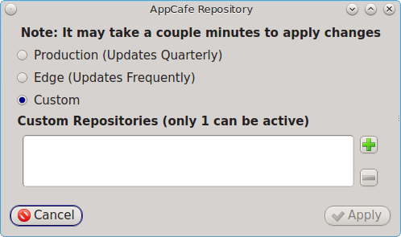

.. index:: configuration
.. _SysAdm™ Client:

SysAdm™ Client
**************

Beginning with TrueOS® 11, most of the system management utilities that
were previously available in the PC-BSD® :ref:`Control Panel` have been
rewritten to use the SysAdm™ API. This API is designed to make it easy
to manage any FreeBSD or TrueOS® desktop or server system over a secure
connection from any operating system that has the SysAdm™ application
installed. SysAdm™ is built into TrueOS® and downloadable packages for
other operating systems are available from the
`SysAdm Website <https://sysadm.us/>`_.

The following utilities have been removed from :ref:`Control Panel` as
they are now available in the SysAdm™ client:

**Application Management**

* :ref:`AppCafe®`

* :ref:`Update Manager`

**SysAdm Server Settings**

* :ref:`Manage SSL Keys`

**System Management**

* :ref:`Boot Environment Manager`

* :ref:`Task Manager`

**Utilities**

* :ref:`Life Preserver`

The rest of this chapter provides an overview of the SysAdm™
architecture, how to manage its secure connections, and how to use its
built-in utilities.

SysAdm™ Overview
================

Managing Connections
====================

Configuring SysAdm™
===================

.. index:: software, configuration, sysadm
.. _AppCafe®:

AppCafe®
=========

AppCafe® provides a graphical interface for installing and managing
FreeBSD packages, which are pre-built applications that have been tested
for FreeBSD-based operating systems. This interface displays extra
meta-data, such as application screenshots and lists of similar
applications.

The rest of this section describes how to manage software using AppCafe®.

.. index:: AppCafe®
.. _Software Management:

Finding Software
----------------

The "Browse" tab, shown in
:numref:`Figure %s: Browse Tab of AppCafe® <appcafe1>`, is used to find
available software. 

.. _appcafe1:

.. figure:: images/appcafe1.png

This screen contains the following options:

**Back:** click this button to leave a category or search result and
return to the previous screen.

**Search:** to see if an application is available, enter its name and
click the "binoculars" icon. Alternately, enter a description. For example, a search for "browser" will display
software with "browser" in the name as well as applications which provide browser functionality, such as Firefox. 

**pcbsd-major:** the name of this drop-down menu will vary, depending
upon the selection. This menu allows you to browse a specific pkg set.

**Browse Categories:** this drop-down menu lists the available software
categories. If you select a category, it will display all of the
available applications within that category.

**Popular Searches and Popular Categories:** the buttons in these
sections can be used to quickly find applications which are recommended
by other TrueOS® users. Click a button to get a curated list of
applications that match the button's description.

Displayed applications will be listed in alphabetical order.
Applications which are already installed and which are not required by
other applications have a trashcan icon which can be clicked to
uninstall that application. Applications which are not installed have a
down arrow icon which can be clicked to install that application. 
Applications which are required by other applications will not display an icon. If you click on that application, a yellow
"Required" triangle will be displayed and a "Related" tab will indicate the name of the application(s) which require it.

Click the name of an application to view more information about that
application. In the example shown in
:numref:`Figure %s: Viewing the Details of an Installed Application <appcafe2>`,
the user has clicked "Firefox" on a system that has Firefox installed.

.. _appcafe2:

.. figure:: images/appcafe2.png

The information for an application includes the following: 

* Icon, name, and description of the application. Click the
  application's name to open the website for the application in the
  default web browser.
  
* An uninstall button.  
  
* A description of the application.  

An example of the "?" tab is shown in 
:numref:`Figure %s: More Application Details <appcafe3>`

.. _appcafe3:

.. figure:: images/appcafe3.png

This tab displays following information:

* Software version.

* Email address for the maintainer of the FreeBSD port the package is
  built from.

* The application's architecture. This will indicate the FreeBSD version
  and whether or not the application is 32-bit or 64-bit. Note that
  TrueOS® can run both 32- and 64-bit applications.
  
* The application's license.  

* The application's installation size.

* The application's download size.

If the package includes screenshots of the application, you can click
the next tab, which has an image icon, to view and scroll through the
screenshots. An example is shown in
:numref:`Figure %s: Viewing the Application's Screenshots <appcafe4>`

.. _appcafe4:

.. figure:: images/appcafe4.png

An example of the last tab, which has a list icon, is shown in
:numref:`Figure %s: Viewing the Details of an Installed Application <appcafe5>`.

.. _appcafe5:

This tab contains the following information. Click the right arrow next
to an entry to expand its information and the down arrow to collapse the
information.

* **Build Options:** shows the values of the make options that the
  package was built with.

* **Dependencies:** lists the dependent packages that this
  application requires to be installed.

* **Required By:** indicates the names of any other packages that
  require this software to be installed.

* **Shared Libaries (Required):** lists the names of the libraries that
  this application requires.
  
Managing Installed Software
---------------------------

To view and manage the applications which are installed on the system,
click the "Installed" tab.  An example is seen in
:numref:`Figure %s: Installed Tab of AppCafe® <appcafe6>`. 

.. _appcafe6:

.. figure:: images/appcafe6.png

If you install or uninstall any software, a "Status" tab will be added. In the example shown in :numref:`Figure %s: Example Status Tab <remote6a>`, the firefox application was installed.
Click the hyperlink under the "Result" column to review the installation log.

.. _remote6a:

.. figure:: images/remote6a.png

.. index:: updates
.. _Update Manager:

Update Manager
==============

Update Manager provides a graphical interface for keeping the TrueOS®
operating system and its installed applications up-to-date.

The TrueOS® update mechanism provides several safeguards to ensure that
updating the operating system or its software is a low-risk operation.
The following steps occur automatically during an update:

* The update automatically creates a snapshot (copy) of the current
  operating system, known as a boot environment (BE), and mounts that
  snapshot in the background. All of the updates then occur in the
  snapshot. This means that you can safely continue to use your system
  while it is updating as no changes are being made to the running
  version of the operating system or any of the applications currently
  in use. Instead, all changes are being made to the mounted copy.

.. note:: if the system is getting low on disk space and there is not
   enough space to create a new BE, the update will fail with a message
   indicating that there is not enough space to perform the update.

* While the update is occurring, and until you reboot after the update,
  you will not be able to use AppCafe® to manage software. This is a
  safety measure to prevent package conflicts. Also, the system shutdown
  and restart buttons will be greyed out until the update is complete
  and the system is ready for reboot. Should a power failure occur in
  the middle of an update, the system will reboot into the current boot
  environment, returning the system to the point before the upgrade
  started. Simply restart the update to continue the update process.

* Once the update is complete, the new boot environment, or updated
  snapshot, is added as the first entry in the boot menu and activated
  so that the system will boot into it, unless you pause the boot menu
  and specify otherwise. A pop-up message, shown in
  :numref:`Figure %s: Managing the Reboot After Update <update1>`, will
  indicate that a reboot is required. You can either finish what you are
  doing and reboot now into the upgraded snapshot, or ask the system to
  remind you again at a later time. To configure the time of the next warning, click the "Next Reminder" drop-down menu where you can select 1, 5, 12, or 24 hours, 30 minutes, or never (for this login
  session). Note that the system will not apply any more updates or allow you to start another manual update or install additional software using AppCafe®
  until you reboot.
  
* The default ZFS layout used by TrueOS® ensures that when new boot
  environments are created, the :file:`/usr/local/`, :file:`/usr/home/`,
  :file:`/usr/ports/`, :file:`/usr/src/` and :file:`/var/` directories
  remain untouched. This way, if you decide to rollback to a previous
  boot environment, you will not lose data in your home directories, any
  installed applications, or downloaded src or ports. However, you will
  return the system to its previous state, before the update was
  applied.

.. _update1:

.. figure:: images/update1.png

Managing Updates
----------------

The "System Updates" tab of Update Manager can be used to determine if
any updates are available and to start the selected updates.

In the example shown in :numref:`Figure %s: Managing Updates <update2>`,
a security update is available. Click the "Start Updates" button to manually start the update. When prompted, reboot so that the system can
boot into the newly patched operating system.

When package updates are available a "View Package Updates" box can be clicked to see which packages will be upgraded.

.. note:: how often package updates are available depends upon the "Repository Settings" set in :menuselection:`AppCafe® --> Configure`. The default setting
   of "Production" will only provide package updates every 3 months whereas a setting of "Edge" will provide package updates as soon as a new version is
   available. If you need application stability, stay on "Production". If you can handle some application breakage in favor of having the latest software,
   change to "Edge". Also, if you select "Security" or "Nothing" in the "Configure Automatic Updates" tab of Update Manager, packages will only get updated
   with the next software release which happens every 3 months.

.. warning:: updates will update **all** installed software. If you have placed a lock on a package using :command:`pkg` or an older version of
   AppCafe®, Update Manager will fail and will generate a message in the log indicating that the failure is due to a locked package. If you prefer to lock certain applications
   against being updated, select "Security" or "Nothing" in the "Configure Automatic Updates" tab of Update Manager and manually update software as needed using
   :command:`pkg`.
   
The "Change Branches" tab of Update Manager provides a listing of available branches. In the example shown in
  :numref:`Figure %s: Switching Branches <update3>`, this system is currently running the 10.2 branch and the upcoming 11.0 branch is available for selection.

.. _update3:

.. figure:: images/update3.png   

.. index:: updates
.. _Upgrading from 10.x to |version|:

Upgrading from 10.x to |version|
--------------------------------

.. index:: sysadm, configuration
.. _Manage SSL Keys:

Manage SSL Keys
===============

.. index:: sysadm, boot environments, ZFS
.. _Boot Environment Manager:

Boot Environment Manager
========================

TrueOS® supports a feature of ZFS known as multiple boot environments
(BEs). With multiple boot environments, the process of updating software
becomes a low-risk operation as the updates are applied to a different
boot environment. If needed, you have the option of rebooting into a
backup boot environment. Other examples of using boot environments
include: 

* If you are making software changes, you can take a snapshot of that
  boot environment at any stage during the modifications.

* You can save multiple boot environments on your system and perform
  various updates on each of them as needed. You can install, test, and
  update different software packages on each.

* You can mount a boot environment in order to :command:`chroot` into
  the mount point and update specific packages on the mounted
  environment.

* You can move a boot environment to another machine, physical or
  virtual, in order to check hardware support.

.. note:: for boot environments to work properly, 
   **do not delete the default ZFS mount points during installation.** 
   The default ZFS layout ensures that when boot environments are
   created, the :file:`/usr/local/`, :file:`/usr/home/`,
   :file:`/usr/ports/`, :file:`/usr/src/` and :file:`/var/` directories
   remain untouched. This way, if you rollback to a previous boot
   environment, you will not lose data in your home directories, any
   installed applications, or downloaded src or ports. During
   installation, you can add additional mount points, just don't delete
   the default ones.

To ensure that the files that the operating system needs are included
when the system boots, all boot environments on a TrueOS® system include
:file:`/usr`, :file:`/usr/local`, and :file:`/var`. User-specific data
is **not** included in the boot environment. This means that
:file:`/usr/home`, :file:`/usr/jails`, :file:`/var/log`,
:file:`/var/tmp`, and :file:`/var/audit` will not change, regardless of
which boot environment is selected at system boot.
   
To view, manage, and create boot environments using the SysAdm™
graphical client, go to
:menuselection:`System Management --> Boot Environment Manager`. In the
example shown in :numref:`Figure %s: Managing Boot Environments <be1>`,
there is an entry named *initial* that represents the original TrueOS®
installation.

.. _be1:

.. figure:: images/be1.png

From left to right, the buttons on the top bar are used to: 

**Create BE:** creates a new boot environment. You should do this before
making any changes to the system that may impact on your current boot
environment. You will be prompted for a name which can only contain
letters or numbers. Once you click "OK", the system will create the
environment, then add it to the list of boot environments.

**Clone BE:** creates a copy of the highlighted boot environment.

**Delete BE:** deletes the highlighted boot environment. You can not delete the boot environment which has a "Running" status of *Yes* as that is the current
boot environment.

**Rename BE:** renames the highlighted boot environment. The name is
what appears in the boot menu when the system boots. You cannot rename the BE you are
currently booted into and an error message will occur if you try to do so.

**Mount BE:** mounts the highlighted BE in :file:`/tmp` so that its
contents are browseable. Note that this setting only applies to inactive
BEs.

**Unmount BE:** unmounts the previously mounted BE.

**Activate BE:** tells the system to boot into the highlighted boot
environment at next system boot. The "Default" will change to *Yes*, but the "Running" will
remain the same. In other words, "Running" refers to the boot environment the system last booted into (is currently running from) whereas "Default" indicates
which boot environment the system will boot into at next system boot.

Whenever there are multiple boot environments, a boot menu similar to the one seen in :numref:`Figure %s: Boot Menu With Multiple Boot Environments <be4>` will appear for two seconds during
system boot. If you do not pause this screen, the system will automatically boot into either the last "Running" boot environment or, if you have activated another boot environment, the
environment that was set as the "Default". 

.. _be4:

.. figure:: images/be4.png

The "Boot Environment Menu" entry indicates that multiple boot environments are available. To browse the available boot environments, press the :kbd:`spacebar` to pause the screen,
arrow down to "Boot Environment Menu" and press :kbd:`Enter`. In the example shown in :numref:`Figure %s: Boot Menu Shows Created Boot Environments <be2>`, two boot environments are
available. The entry with "default" in the name indicates the date and time of the initial installation. The first boot entry indicates the operating system's current patch level and the
date the system was updated. It is first in the boot order and since it is highlighted in blue, it is the active boot environment, or the one the system will boot into unless another BE is
manually selected in this menu. Use the arrow keys to highlight the boot environment you would like to boot into, and press :kbd:`Enter` to continue booting into the selected boot
environment. 

.. _be2:

.. figure:: images/be2.png

.. index:: sysadm, configuration
.. _Task Manager:

Task Manager
============

.. index:: sysadm, life preserver
.. _Life Preserver:

Life Preserver
==============

The Life Preserver utility is designed to take full advantage of the
functionality provided by ZFS snapshots. This utility allows you to
schedule snapshots of a ZFS pool and to optionally replicate those
snapshots to another system over an encrypted connection. This design
provides several benefits: 

* A snapshot provides a "point-in-time" image of the ZFS pool. In one
  way, this is similar to a full system backup as the snapshot contains
  the information for the entire filesystem. However, it has several
  advantages over a full backup. Snapshots occur instantaneously,
  meaning that the filesystem does not need to be unmounted and you can
  continue to use applications on your system as the snapshot is
  created. Since snapshots contain the meta-data ZFS uses to access
  files, the snapshots themselves are small and subsequent snapshots
  only contain the changes that occurred since the last snapshot was
  taken. This space efficiency means that you can take snapshots often.
  Snapshots also provide a convenient way to access previous versions of
  files as you can browse to the point-in-time for the version of the
  file that you need. Life Preserver makes it easy to configure when
  snapshots are taken and provides a built-in graphical browser for finding and restoring the files within a snapshot.

* Replication is an efficient way to keep the files on two systems in
  sync. With Life Preserver, the snapshots taken on the TrueOS® system
  will be synchronized with their versions stored on the specified
  backup server.

* Snapshots are sent to the backup server over an encrypted connection.

* Having a copy of the snapshots on another system makes it possible to
  perform an operating system restore should the TrueOS® system become
  unusable or to deploy an identical system to different hardware.
  
To manage snapshots and replication using the SysAdm™ graphical client,
go to :menuselection:`Utilities --> Life Preserver`. The rest of this
section describes where to find and how to use the features built into
Life Preserver.

.. index:: snapshots, life preserver
.. _Snapshots Tab:

Snapshots Tab
-------------

:numref:`Figure %s: Snapshot Tab <lpreserver1>` shows the initial Life Preserver screen on a system that has not yet been configured. It is opened to the "Snapshots" tab and the system has
a "ZFS Pool" named "tank". This screen will display any manually created snapshots and contains buttons to do the following:

.. _lpreserver1:

.. figure:: images/lpreserver1.png

**Remove:** used to delete the previously created and highlighted snapshot. This is a permanent change that can not be reversed. In other words, the versions of files at that point in time
will be lost.

**Create:** click this button to manually create a snapshot now. For example, you can create a snapshot before making changes to a file, so that you can preserve a copy of the previous
version of the file. Or, you can create a snapshot as you make modifications to the system configuration. When creating a snapshot, a pop-up message will prompt you to input a name for
the snapshot, allowing you to choose a name that is useful in helping you remember why you took the snapshot.

**Revert:**

.. index:: replication, life preserver
.. _Replication Tab:

Replication Tab
---------------

Life Preserver can be configured to replicate snapshots to another system over an encrypted SSH connection, though the backup itself is stored in an encrypted format. This ensures that you
have a backup copy of your snapshots on another system. 

In order to configure replication, the remote system to hold a copy of the snapshots must first meet the following requirements:

* The backup server **must be formatted with the latest version of ZFS,** also known as ZFS feature flags or ZFSv5000. Operating systems that support this
  version of ZFS include TrueOS®, FreeBSD 9.2 or higher, and FreeNAS 9.1.x or higher.

* That system must have SSH installed and the SSH service must be running. If the backup server is running TrueOS®, SSH is already installed and you can start
  SSH using :ref:`Service Manager`. If that system is running FreeNAS® or FreeBSD, SSH is already installed, but you will need to start SSH.

* If the backup server is running TrueOS®, you will need to open TCP port 22 (SSH) using :ref:`Firewall Manager`. If the server is running FreeBSD and a
  firewall has been configured, add a rule to open this port in the firewall ruleset. FreeNAS® does not run a firewall by default. Also, if there is a
  network firewall between the TrueOS® system and the backup system, make sure it has a rule to allow SSH.

:numref:`Figure %s: Replication Tab <lpreserver2>` shows the initial "Replication" tab on a system that has not yet been configured for replication. This screen is used to create, view,
remove, and configure the replication schedule.  

.. _lpreserver2:

.. figure:: images/lpreserver2.png

To schedule the replication, click the "+" button to display the "Setup Replication" screen shown in :numref:`Figure %s: Scheduling a Replication <lpreserver3>`.

.. _lpreserver3:

.. figure:: images/lpreserver3.png

Input the following information:

* **Host IP:** the IP address of the remote system to store the replicated snapshots.

* **SSH Port:** the port number, if the remote system is running SSH on a port other than the default of 22.

* **Dataset:** the name of the ZFS pool and optional dataset on the remote system. For example, "remotetank" will save the snapshots to a ZFS pool of that name and "remotetank/mybackups"
  will save the snapshots to an existing dataset named "mybackups" on the pool named "remotetank".

* **Frequency:** use the drop-down menu to select how often to initiate the replication. Available choices are "Sync with snapshot" (at the same time a snapshot is created), "Daily" (when
  selected, displays a time drop-down menu so you can select the time of day), "Hourly", every "30 minutes", every "10 minutes", or "Manual Only" (only occurs when you click the "Start"
  button) in this screen.

* **Username:** the username must already exist on the remote system, have write access to the specified "Dataset", and have permission to SSH into that system.

* **Password:** the password associated with the "Username".

* **Local DS:** use the drop-down menu to select the pool or dataset to replicate to the remote system.

The buttons at the top of the "Setup Replication" screen are used to:

**+ icon** add a replication schedule. Multiple schedules are supported, meaning that you can replicate to multiple systems or replicate different "Local DS" datasets at different times.

**- icon** remove an already created, and highlighted, replication schedule.

**gear icon:** modify the schedule for the highlighted replication.

**Start:** manually starts a replication to the system specified in the highlighted replication.

**Initialize:** deletes the existing replicated snapshots on the remote system and starts a new replication. This is useful if a replication gets stuck and will not complete.

.. index:: configuration, life preserver
.. _Schedules Tab:

Schedules Tab
-------------

This tab is used to manage when snapshots of the ZFS pool are created. Multiple snapshot schedules are supported if the system has multiple pools.

.. note:: snapshots are created on the entire pool as they are needed when :ref:`Restoring the Operating System`.

To create a snapshot schedule, click the "camera" icon in the lower left corner of this tab. This will activate the "Setup Snapshot Schedule" pane as seen in
:numref:`Figure %s: Scheduling a Snapshot <lpreserver4>`. 

.. _lpreserver4:

.. figure:: images/lpreserver4.png

This pane contains the following options:

**ZPool:** select the ZFS pool to snapshot.

**Snapshots to keep:** snapshots are automatically pruned after the specified number of snapshots to prevent snapshots from eventually using up all of your disk space. If you would like to
have multiple versions of files to choose from, select the number of snapshots to keep. Note that auto-pruning only occurs on the snapshots generated by Life Preserver according to the
configured schedule. Auto-pruning will not delete any snapshots you create manually in the "Snapshots" tab.

**Frequency:** use the drop-down menu to select how often snapshots occur. Options include "Daily" (which will allow you to select the time of day), "Hourly" every "30 Minutes", every "10
Minutes", or every "5 Minutes".

Once you have created a snapshot schedule, you can use the "gear" icon next to the "camera" icon to modify the highlighted schedule or the "X" icon to delete the highlighted schedule.

This screen can also be used to manage the ZFS scrub schedule. Scrubs are recommended as they can provide an early indication of a potential disk failure. Since scrubs can be scheduled on a
per-pool basis, if you have multiple pools, create a scrub schedule for each pool.

To schedule when the scrub occurs, click the third icon from the right which will activate the "Setup Scrub Schedule" screen shown in :numref:`Figure %s: Scheduling a Scrub <lpreserver5>`. 

.. _lpreserver5:

.. figure:: images/lpreserver5.png

Select the pool from the "ZPool" drop-down menu, then select the "Frequency". Supported frequencies are  "Daily", "Weekly", or "Monthly". If you select "Daily", you can configure the "Hour".
If you select "Weekly", you can configure the "Day of week" and the "Hour". If you select "Monthly", you can configure the "Date" and "Hour". Since a scrub can be disk I/O intensive, it is
recommended to pick a time when the system will not be in heavy use.

Once you have created a scrub schedule, you can use the "gear" icon next to the "schedule scrub" icon to modify the highlighted schedule or the "X" icon to delete the highlighted schedule.

.. index:: configuration, life preserver
.. _Settings Tab:

Settings Tab
-------------

**Disk Usage Warning:**

**Email:**

**Email Trigger:**

**Recursive Management:**

.. _Replication to a FreeNAS® System:

Replication to a FreeNAS® System
--------------------------------

`FreeNAS® <http://www.freenas.org/>`_ is an open source Networked Attached Storage (NAS) operating system based on FreeBSD. This operating system is designed
to be installed onto a USB stick so that it is kept separate from the storage disk(s) installed on the system. You can download the latest STABLE version of
FreeNAS® 9.10 from `download.freenas.org <http://download.freenas.org/9.10/STABLE/>`_ and read its documentation at 
`doc.freenas.org <http://doc.freenas.org/9.10/>`_. 

This section demonstrates how to configure FreeNAS® 9.10 as the backup server for Life Preserver to replicate to. It assumes that you have already installed
this version of FreeNAS® using the installation instructions in the
`FreeNAS® 9.10 Users Guide <http://doc.freenas.org/9.10/freenas_install.html>`_ and are able to access the FreeNAS® system from a web browser.

In order to prepare the FreeNAS® system to store the backups created by Life Preserver, you will need to create a ZFS pool, create and configure the
dataset to store the backups, create a user account that has permission to access that dataset, and enable the SSH service.

In the example shown in :numref:`Figure %s: Creating a ZFS Volume in FreeNAS® <lpreserver10>`, the user has clicked :menuselection:`Storage --> Volumes --> Volume Manager` in order to create
a ZFS pool to hold the backups.

.. _lpreserver10:

.. figure:: images/lpreserver10.png

Input a "Volume Name", drag the slider to select the desired number of available disks, and click the "Add Volume" button. The Volume Manager will automatically
select the optimal layout for both storage capacity and redundancy. In this example, a RAIDZ2 named *volume1* will be created.

.. note:: make sure that the size of the pool is large enough to hold the replicated snapshots. To determine the size of the initial snapshot, run
   :command:`zpool list` on the TrueOS® system and look at the value in the "ALLOC" field. Subsequent snapshots will be smaller and will be the size of the
   data that has changed.

To create the dataset to backup to, click the "+" next to the entry for the newly created volume, then click "Create ZFS Dataset". In the example shown in
:numref:`Figure %s: Creating a ZFS Dataset in FreeNAS® <lpreserver11>`, the "Dataset Name" is *backups*. Click the "Add Dataset" button to create the dataset.

.. _lpreserver11:

.. figure:: images/lpreserver11.png

To create the user account, go to :menuselection:`Account --> Users --> Add User`. In the screen shown in :numref:`Figure %s: Creating a User in FreeNAS® <lpreserver12>`, input a "Username"
that you will later configure Life Preserver to use. Under "Home Directory", use the browse button to browse to the location of the dataset that you made to store the
backups. Input a "Full Name", then input and confirm a "Password". When finished, click the "OK" button to create the user.

.. _lpreserver12:

.. figure:: images/lpreserver12.png

Next, give the user permissions to the dataset by going to :menuselection:`Storage --> Volumes`, click the + next to the name of the volume, click the "+"
next to the name of the dataset, then click "Change Permissions" for the expanded dataset. In the screen shown in :numref:`Figure %s: Setting Permissions in FreeNAS® <lpreserver13a>`, change
the "Owner (user)"and "Owner (group)" to the user that you created. Click "Change" to save the change.

.. _lpreserver13a:

.. figure:: images/lpreserver13a.png

Next, click on "Shell" and type the following command, replacing *dru* and *volume1/backups* with the name of the user, volume, and dataset that you created::

 zfs allow -u dru atime,canmount,clone,compression,create,destroy,hold,mount,mountpoint,promote,receive,rename,send,userprop volume1/backups  

Click the "x" in the upper right corner to close "Shell". Then, to enable the SSH service, go to :menuselection:`Services --> Control Services`, shown in
:numref:`Figure %s: Start SSH in FreeNAS® <lpreserver14>`. 

.. _lpreserver14:

.. figure:: images/lpreserver14.png

Click the red "OFF" button next to SSH to enable that service. Once it turns to a blue "ON", the FreeNAS® system is ready to be used as the backup server.

click the "+SSH" button. Life Preserver will scan the network for systems running SSHD and, if the scan is successful, a pop-up
menu will show the hostnames of the available systems. If multiple systems are running SSH, use the drop-down menu to select the desired system and click "OK". If you instead receive an
error message, check to see if there is a firewall between the TrueOS® and the FreeNAS® system as this scan requires UDP port 5353 to be open on any firewalls running on or between the two
systems.

Once the system is selected, its IP address will be added to the drop-down menu to the left of the "+SSH" button, the port number SSH is listening on will display in the
"SSH Port" menu, and the rest of this screen will be activated. In the example shown in :numref:`Figure %s: Finishing the Configuration <lpreserver24>`, the IP address of the FreeNAS® system
is 192.168.1.73.

.. _lpreserver24:

.. figure:: images/lpreserver24.png

Input the name of the user and the name of the dataset you created on the FreeNAS® system. In this example, the "User Name" is *dru* and the "Remote Dataset" is
*volume1/backups*.

When finished, click "Apply", Life Preserver will check that it can connect to the backup server and will prompt for the password of "User Name". A
second pop-up message will remind you to save the SSH key to a USB stick as this key is required for
:ref:`Restoring the Operating System`.

.. note:: if you don't receive the pop-up message asking for the password, check that the firewall on the backup system, or a firewall within the network, is
   not preventing access to the port number listed in "SSH Port". Also, this pop-up only occurs once. If the password changes or you are not able to successfully login,
   use :menuselection:`Snapshots --> Reset Replication Password` to re-input the password.

Once the SSH login is successful, Life Preserver will begin to replicate snapshots to the remote system at the configured "Frequency". Note that the first replication can
take several hours to complete, depending upon the speed of the network. Subsequent replications will only contain changed data and will be much smaller. You can confirm
that the snapshots have been received by clicking :menuselection:`Storage --> Snapshots` on the FreeNAS® system. This should provide a listing of the replicated datasets,
allowing you to manage the replicated snapshots as described in `Snapshots <http://doc.freenas.org/9.10/freenas_storage.html#snapshots>`_.

Life Preserver uses backend checks so that it is safe to keep making snapshots while a replication is in process. It will not prune any existing snapshots
until the replication is finished and it will not start a second replication before the first replication finishes. 

.. _Restoring the Operating System:

Restoring the Operating System
------------------------------

If you have replicated the system's snapshots to a remote backup server, you can use a TrueOS® installation media to perform an operating system restore or to clone
another system. Start the installation as usual until you get to the screen shown in :numref:`Figure %s: Selecting to Restore/Clone From Backup <restore1>`. 

.. _restore1: 

.. figure:: images/restore1.png

Before you can perform a restore, the network interface must be configured. Click the "network connectivity" icon (second from the left) in order to determine
if the network connection was automatically detected. If it was not, refer to the instructions in :ref:`Network Configuration` and make sure that networking is
working before continuing.

Once you are ready, click "Restore from Life-Preserver backup" and the "Next" button. This will start the Restore Wizard. In the screen shown in
:numref:`Figure %s: Input the Information for a SSH Restore <restore2>`, input the IP address of the backup server and the name of the user account used to replicate the snapshots. If
the server is listening on a non-standard SSH port, change the "SSH port" number. Then, click "Next" to select an authentication method in the screen shown in
:numref:`Figure %s: Select the Authentication Method <restore3>`.

.. _restore2: 

.. figure:: images/restore2.png

.. _restore3: 

.. figure:: images/restore3.png

If you previously saved the SSH key to a USB stick, insert the stick then press "Next". Otherwise, change the selection to "Use password authentication" and
press "Next". The next screen will either read the inserted USB key or prompt for the password, depending upon your selection. The wizard will then attempt a
connection to the server.

Once the connection to the backup server succeeds, you will be able to select which host to restore. In the example shown in :numref:`Figure %s: Select the Host to Restore <restore4>`,
only one host has been backed up to the replication server.

.. _restore4:

.. figure:: images/restore4.png

After making your selection, click "Next". The restore wizard will provide a summary of which host it will restore from, the name of the user account
associated with the replication, and the hostname of the target system. Click "Finish" and the installer will proceed to the :ref:`Disk Selection Screen`. At
this point, you can click the "Customize" button to customize the disk options. However, in the screen shown in Figure 3.3h, the ZFS datasets will be greyed
out as they will be recreated from the backup during the restore. Once you are finished with any customizations, click "Next" to perform the restore.