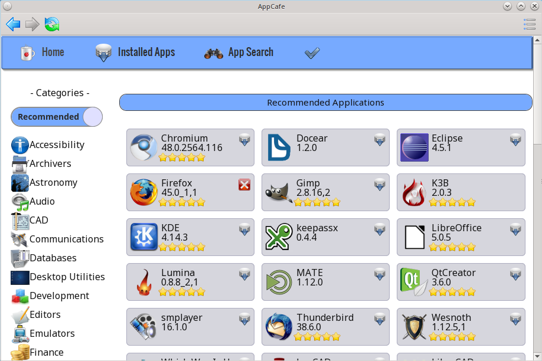
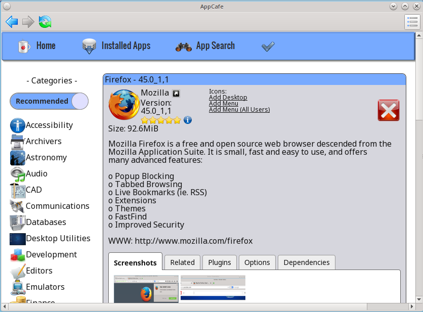
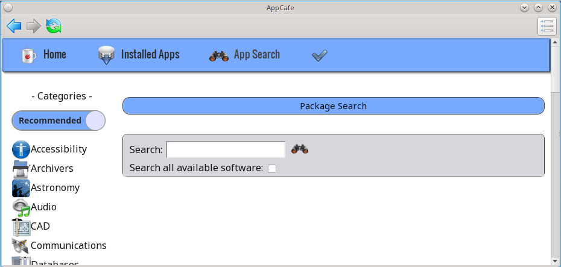
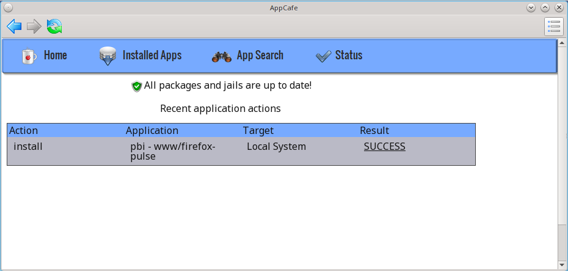
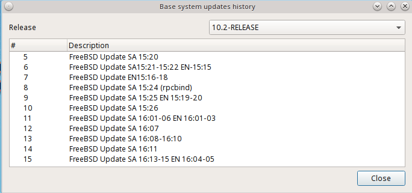
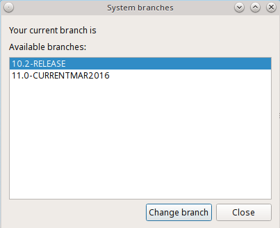

.. index:: configuration
.. _SysAdm™ Client:

SysAdm™ Client
**************

The following utilities are available in the SysAdm™ client:

**Application Management**

* :ref:`AppCafe®`

* :ref:`Update Manager`

**SysAdm Server Settings**

* :ref:`Manage SSL Keys`

**System Management**

* :ref:`Boot Environment Manager`

* :ref:`Task Manager`

**Utilities**

* :ref:`Life Preserver`

This chapter describes these utilities in more detail.

.. index:: software, configuration, sysadm
.. _AppCafe®:

AppCafe®
=========

Both PC-BSD® and TrueOS® provide tools to make it easy to manage software and to keep both the operating system and installed software up-to-date. PC-BSD®
provides the graphical :ref:`AppCafe®` and :ref:`Update Manager` utilities for managing and upgrading software from the local system or from a web browser or
mobile device. Since TrueOS® is a command-line only install and some users prefer to use command-line utilities, both PC-BSD® and TrueOS® provide the
:command:`pkg` command line utility to manage software, as well as :command:`pc-updatemanager` to manage updates. If you install
software using any of the tools described in this chapter, you will automatically be notified whenever a newer version of software is available.

The rest of this chapter demonstrates how to use the built-in graphical and command-line tools for managing software and upgrades. It also describes how to
:ref:`Create a Local Package Mirror`.

AppCafe® provides an intuitive, graphical method for installing and managing software. It provides a graphical front-end to FreeBSD packages, which are
pre-built applications tested for FreeBSD. It includes extra meta-data which is displayed in AppCafe®, such as screenshots and lists of similar applications.

AppCafe® does not require the *root* password to install software. This means that you do not have to give out the root password on multi-user systems.
However, it will prompt for the user's password and will fail if that user is not a member of the *wheel* group. This allows you to control which users are
able to manage software. 

If you prefer to manage software from the command line, refer to the section on :ref:`Using the CLI pkg Utilities`.

.. index:: software
.. _Configuring AppCafe®:

Configuring AppCafe®
---------------------

AppCafe® includes the ability to remotely manage software from another system or mobile device. During the installation
of a TrueOS® server, the installer provides the ability to configure the user, password, and port number for accessing AppCafe® from any device with
a web browser. On a desktop installation, AppCafe® can be run as a local application and optionally configured for remote access. To launch the
AppCafe® application on a PC-BSD® desktop, double-click its icon on the Desktop, go to :menuselection:`Control Panel --> AppCafe®`, or type  :command:`appcafe` from a command prompt. When
prompted, input your password. :numref:`Figure %s: Running AppCafe® from a Desktop <remote1d>` shows the initial AppCafe® screen when it is started from a desktop.

.. _remote1d:

.. note:: if updates are available for any of the installed applications, an "Updates available" link with a yellow triangle icon will appear.
   If you click this link it will provide another link that you can click to get details about the update. Note that :ref:`Update Manager` is used to
   perform the actual update and that you won't be able to add or delete any software while an update is in progress.

The top bar contains navigational arrows and a refresh icon. Click the icon at the far right of this bar to access the following options:

* **Configure:** used to configure the package repository and remote access to AppCafe®. 

* **Save Pkg List:** click this option to generate a list of the installed software packages. A pop-up message will indicate the path to the file containing the list.

* **Search for Text:** opens a search bar where you can input the name of an application. This is useful for quickly navigating to an application listed on the current screen.

* **Close AppCafe:** used to exit this application.

:numref:`Figure %s: Configuring the AppCafe® Repository <remote2a>` shows the menu that appears if you click the "Configure" option. 

.. _remote2a:

.. figure:: images/remote2a.png

The "Repository Configuration" tab is used to determine which package set to use, where:

* **Enterprise:** this package set is meant for enterprise users that wish to only receive software updates which fix known security vulnerabilities. 

* **Production:** is the default and recommended setting for most users. Software updates are provided every three months, which gives sufficient time for new software versions to be tested.

* **Edge:** is meant for users who wish to assist with software testing or who can tolerate the occasional breakage caused by installing new software versions. Software updates are provided
  approximately every two weeks. 
  
* **Custom:** assumes that you have followed the instructions to :ref:`Create a Local Package Mirror` and are ready to click the "+" button to browse to the location of the custom
  :file:`.rpo` file. To allow switching between custom repositories, multiple custom repositories can be listed, but only the one marked as active will be used.

To configure remote access, use the "Remote Access" tab shown in :numref:`Figure %s: Configuring Remote Access <remote3>`. 

.. _remote3:

.. figure:: images/remote3.png

Check the box to "Enable AppCafe Remote". Then, input a username and password to use for remote access and select a port number. If the system has a public IP
address, be sure to use a hard-to-guess username and password. If you change the port number, make sure it does not conflict with another application running
on the system. Click "Apply" to complete the configuration. You will be prompted to input your password to save the configuration.

When using AppCafe® to access a system from a public network, it is highly recommended to configure the local firewall to only allow connections over
the specified port number and from allowed IP address(es).

AppCafe® uses SSL by default and will automatically create a certificate to use for remote access. Once remote access is configured, use :file:`https://` and
specify the IP address of the system and configured port number in a web browser. You will then be prompted to input the configured username and password. The AppCafe® interface will load in
the web browser. It will be similar to the one shown in :numref:`Figure %s: Running AppCafe® from a Desktop <remote1d>`, except the top navigational buttons and configure
button will not be displayed and a "Logout" option will be added to the dark grey bar. Note that AppCafe® will automatically log you out after 60
minutes of inactivity.

The :file:`/usr/local/etc/appcafe.conf` file stores the configuration used by AppCafe® and can be edited in a text editor. By default, the "remote", "port", and "ssl" options are set using
the information you provided either during a server installation or using the screen shown in :numref:`Figure %s: Configuring Remote Access <remote3>`.
The "mode" option is not set by default, but can be configured by removing the comment symbol (";") from that option and setting its value to either
"desktop" or "server". Here are the descriptions of the available modes as listed in that file::

 ; Set the mode to run AppCafe in (default will pick between server/desktop if X is installed)
 ; desktop = Full access to local system packages and jails
 ; server = Full access to local system packages and jails, no Xorg packages listed
 ; mode = desktop

The rest of this section describes how to manage software using AppCafe®.

.. index:: AppCafe®
.. _Software Management:

Software Management
-------------------

The "Home" tab, seen in :numref:`Figure %s: Running AppCafe® from a Desktop <remote1d>`, is used to browse for available software. Applications which are already installed and which are not
required by other applications have a red "X". If you click a red "X", a pop-up message will ask if you would like to uninstall that application. Applications which are not installed have a
grey download icon. Click the icon to install that application. Applications which are required by other applications will not display an icon. If you click on that application, a yellow
"Required" triangle will be displayed and a "Related" tab will indicate the name of the application(s) which require it.

The "Recommended Applications" section displays applications which are recommended by other PC-BSD® users.

The "Categories" pane lists the available software categories. By default, only the recommended applications for each category are shown. Alternately, to view all of
the available applications for each category, click the "Recommended" button which will change to an "All Apps" button. Click the name of a category to view the available
software within that category.

To view all of the applications installed on the system, click the "Installed Apps" tab. The applications will be
listed in alphabetical order. Click the name of an application to view more information about the application.

In the example shown in :numref:`Figure %s: Viewing the Details of an Installed Application <remote4d>`, the user has clicked "Firefox" on a system that has Firefox installed.

.. _remote4d:

The information for an application includes the following: 

* Name, version, and icon of the application.

* A hyperlink to the application's website. In this example, clicking "Mozilla" will open the application's website in the user's default web browser.

* A hyperlink to the application's information at `freshports.org <http://www.freshports.org/>`_. Click the arrow icon next to "Mozilla" to open the FreshPorts website in the user's
  default web browser.

* A rating of up to five stars. Click the stars to open the PC-BSD® wiki page for the application. If you login to the wiki and hover the mouse over the
  number of stars to select, it will add your ranking and increment the vote number. If you make a mistake in your vote, refresh the browser, click the
  "remove" button, and re-select the desired number of stars. 

* User contributed tips and how-tos for the application. Click the blue circle icon to open this wiki page. If you login to the wiki, you can add
  your own usage tips for the application.

* The download size.

* Hyperlinks to add an icon for the application to the desktop (on window managers that support desktop icons), to add an entry for the application to the
  desktop menu for the logged on user only (on window managers that provide desktop menus), or to add an entry to the desktop menu of all users.

* An icon indicating whether or not the application is already installed, can be installed, or is required by another application.
  
* A description of the application.

The following tabs may also be displayed. If a tab is not displayed, it means that that information is not currently available for this particular application.

- **Screenshots:** click a screenshot to view a larger version of the screenshot.

- **Related:** provides an installable list of applications that provide similar functionality.

- **Plugins:** provides an installable list of associated plugins. For an example, search for "firefox" and open its "Plugins" tab.

- **Options:** shows the values of the make options that the package was built with.

- **Dependencies:** lists the packages that are dependencies of this application.

The "App Search" tab is shown in :numref:`Figure %s: Searching for Applications <remote5c>`. 

.. _remote5c:

To find an application, enter its name and click the "binoculars" icon. Alternately, enter a description. For example, a search for "browser" will display
software with "browser" in the name as well as applications which provide browser functionality, such as Firefox. 

By default, only recommended packages are searched. To search for all available software, including packages, check the "Search all available software" box.

If you install or uninstall any software, a "Status" tab will be added. In the example shown in :numref:`Figure %s: Example Status Tab <remote6a>`, the firefox application was installed.
Click the hyperlink under the "Result" column to review the installation log.

.. _remote6a:

.. index:: pkg
.. _Using the CLI pkg Utilities:

Using the CLI pkg Utilities
===========================

PC-BSD® uses :command:`pkg` to manage packages from the command line.

The `FreeBSD Handbook <http://www.freebsd.org/doc/en_US.ISO8859-1/books/handbook/pkgng-intro.html>`_ provides an introduction to using :command:`pkg`. Section 4.4.1 is not
needed on a PC-BSD® or TrueOS® system as the operating system installation does this for you. The various :command:`pkg` commands have associated man pages.
Type :command:`man pkg` for an overview of general usage; the names of the associated man pages will be found towards the bottom of this man page. Once you
know the name of a command, you can also use the built-in help system to get more information about that command. For example, to learn more about
:command:`pkg install`, type :command:`pkg help install`.

.. index:: AppCafe®, iocage
.. _Managing Jails from the CLI:

Managing Jails from the CLI
---------------------------

In PC-BSD®, `iocage <https://github.com/iocage/iocage>`_ can be used to install a pre-configured, isolated application into its own jail. A :wikipedia:`FreeBSD jail` provides a very
light-weight, operating system-level virtualization. A jail is similar to running an independent instance of FreeBSD on the same hardware, without all of the overhead usually associated
with virtualization. Jails are usually created for running applications or services. For example, you could host your own media server on your desktop system without affecting other
installed applications or your data. Each jail has its own IP address, running processes, and users. Whatever happens in that jail does not affect your operating system or other jails
running on the PC-BSD® system.

:command:`iocage` was specifically designed for jail management on systems formatted with the ZFS filesystem. It stores its configuration as a ZFS property rather than using a configuration
file.

The :command:`iocage` command line utility is a Bourne shell script. This script can be manually run from the command line on a PC-BSD® server or by users who prefer to manage jails using
the command line. Advanced users can also refer to the command line version in their own jail management scripts.

If you type :command:`iocage` at the command line, you will receive a summary of its usage::

 usage:
  iocage [-v] activate ZPOOL
  iocage [-v] cap UUID|TAG
  iocage [-v] clean [-f] [-a|-r|-j|-t]
  iocage [-v] clone UUID|TAG [UUID|TAG@snapshot] [property=value]
  iocage [-v] console [-f] UUID|TAG
  iocage [-v] create [-e] [base=[RELEASE|NAME]] [pkglist=file] [property=value] [count=value]
  iocage [-v] deactivate ZPOOL
  iocage [-v] defaults
  iocage [-v] destroy [-f] UUID|TAG
  iocage [-v] df
  iocage [-v] exec [-u username | -U username] UUID|TAG|ALL command [arg ...]
  iocage [-v] export UUID|TAG
  iocage [-v] fetch [-P|-p|--ports] [release=RELEASE | ftphost=ftp.hostname.org |
                    ftpdir=/dir/ | ftpfiles="base.txz doc.txz lib32.txz src.txz"]
                    [ ftplocaldir=/dir/ ] [ compression=ALGO ]
  iocage [-v] get [-r] property|all UUID|TAG
  iocage [-v] help
  iocage [-v] import UUID [property=value]
  iocage [-v] init-host IP ZPOOL
  iocage [-v] inuse UUID|TAG
  iocage [-v] limits [UUID|TAG]
  iocage [-v] list [-t|-r|-s jd|uuid|boot|state|tag|type|ip4]
  iocage [-v] promote UUID|TAG
  iocage [-v] rcboot
  iocage [-v] reboot|restart [-s] UUID|TAG
  iocage [-v] rcshutdown
  iocage [-v] reset UUID|TAG|ALL
  iocage [-v] restart UUID|TAG
  iocage [-v] rollback UUID|TAG@snapshotname
  iocage [-v] runtime UUID|TAG
  iocage [-v] send [-c|-i|-I|-h|-u|-m] POOL
  iocage [-v] set property=value [property=value] UUID|TAG
  iocage [-v] snaplist UUID|TAG
  iocage [-v] snapremove UUID|TAG@snapshotname|ALL
  iocage [-v] snapshot|snap [-f|-r] UUID|TAG [UUID|TAG@snapshotname]
  iocage [-v] start [-f] UUID|TAG
  iocage [-v] stop UUID|TAG|ALL
  iocage [-v] uncap UUID|TAG
  iocage [-v] update [-p|-P] UUID|TAG|RELEASE
  iocage [-v] upgrade UUID|TAG [release=RELEASE]
  iocage [-v] version | --version

Before creating a jail for the first time, specify the version of FreeBSD to install. To see which versions are available and to install the selection, run :command:`iocage fetch`. By
default, the currently installed version will be selected as seen in this example::

 sudo iocage fetch
 Password:
 Setting up zpool [tank] for iocage usage...
 If you wish to change zpool, use 'iocage activate'
   INFO: creating tank/iocage
   INFO: creating tank/icoage/.defaults
   INFO: creating tank/iocage/download
   INFO: creating tank/iocage/jails
   INFO: creating tank/iocage/releases
   INFO: creating tank/iocage/templates
 Supported releases are: 
   11.0-CURRENT
   10.3-RELEASE
   10.2-RELEASE
    9.3-RELEASE
 Please select a release [10.3-RELEASE]:
 base.txz                                      100% of   63 MB 1908 kBps 00m34s
 doc.txz                                       100% of 1395 kB 1301 kBps 00m01s
 lib32.txz                                     100% of   15 MB 1762 kBps 00m10s
 src.txz                                       100% of  109 MB 2116 kBps 00m53s
 Extracting: base.txz
 Extracting: doc.txz
 Extracting: lib32.txz
 Extracting: src.txz
 * Updating base jail template.
 Looking up update.FreeBSD.org mirrors... none found.
 Fetching public key from update.FreeBSD.org... done.
 Looking up update.FreeBSD.org mirrors... none found.
 Fetching public key from update.FreeBSD.org... done.
 Fetching metadata signature for 10.3-RELEASE from update.FreeBSD.org... done.
 Fetching metadata index... done.
 Fetching 2 metadata files... done.
 Inspecting system... done.
 Preparing to download files... done.
 Installing updates... done.
 Creating basejail ZFS datasets... please wait.

In this example, the user has specified to install the 10.3-RELEASE template. Once the template has been installed, you can create a jail. In this example, the template to use, the jail's
hostname, network interface, and IP address are specified::

 sudo iocage create release=10.3-RELEASE tag=jail1 ip4_addr="em0|192.168.1.7/24"
 Password:
 Successfully created: b00945a3-d028-11e5-8dc9-68f72865c4fc (jail1)
 
You can list the properties of the jail with this command::

 iocage get all jail1
 
To start the jail and check its status::

 sudo iocage start jail1
 Password:
 * Starting b00945a3-d028-11e5-8dc9-68f72865c4fc (jail1)
  + Started 
  + Configuring VNETifconfig: interface em0 does not exist	OK
  + Starting services        OK

 iocage list
 JID   UUID                                  BOOT  STATE  TAG   TYPE
 1     b00945a3-d028-11e5-8dc9-68f72865c4fc  off   up     jail1 basejail

To access the jail::

 sudo iocage console jail1
 Password:
 FreeBSD 10.3-RELEASE (GENERIC) #0: Mon Apr 11 15:54:50 UTC 2016

 Welcome to FreeBSD!

 Release Notes, Errata: https://www.FreeBSD.org/releases/
 Security Advisories:   https://www.FreeBSD.org/security/
 FreeBSD Handbook:      https://www.FreeBSD.org/handbook/
 FreeBSD FAQ:           https://www.FreeBSD.org/faq/
 Questions List: https://lists.FreeBSD.org/mailman/listinfo/freebsd-questions/
 FreeBSD Forums:        https://forums.FreeBSD.org/

 Documents installed with the system are in the /usr/local/share/doc/freebsd/
 directory, or can be installed later with:  pkg install en-freebsd-doc
 For other languages, replace "en" with a language code like de or fr.

 Show the version of FreeBSD installed:  freebsd-version ; uname -a
 Please include that output and any error messages when posting questions.
 Introduction to manual pages:  man man
 FreeBSD directory layout:      man hier

 Edit /etc/motd to change this login announcement.
 root@b00945a3-d028-11e5-8dc9-68f72865c4fc:~ # 

Once inside the jail, you can manage it just like any other FreeBSD system and install software using :command:`pkg`. To leave the jail, type :command:`exit`.

.. index:: updates
.. _Update Manager:

Update Manager
==============

Update Manager provides a graphical interface for keeping the PC-BSD® operating system and its installed applications up-to-date. Update Manager will automatically track
updates to software installed using either the graphical or command line equivalents of :ref:`AppCafe®`.

This utility can be started from :ref:`Control Panel` or by typing :command:`pc-updategui`. It can also be accessed from its icon in the system tray, if you are logged into a desktop
that provides a system tray.

The status of the icon lets you determine at a glance if any of your installed applications are out-of-date, if a system update is available, or if a new
version of the operating system is available. The possible statuses are as follows:

.. image:: images/update1.png 

Your system is up-to-date.

.. image:: images/update2.png 

The system is currently checking for updates and patches.

.. image:: images/update3.png 

Your operating system is out-of-date and system update(s) or patch(es) are available.

.. image:: images/update4.png 

Newer versions of installed applications are available.

.. image:: images/update5.png 

The system was unable to check for updates, meaning you should check your Internet connection.

.. image:: images/update6.png

The system is currently updating.

.. image:: images/update7.png 

The system needs to restart in order for the newly installed update to take effect.

If you right-click the icon, you will see the menu shown in :numref:`Figure %s: Right-click Menu for Update Manager <update8a>`. 

.. _update8a:

.. figure:: images/update8a.png

This menu contains the following options:

* **Start the Update Manager:** launches the Update Manager GUI which can be used as described in :ref:`Manual Updates (GUI Method)`.

* **Check for Updates:** by default, updates are checked every 24 hours or 20 minutes after booting the system. However, the system won't check for updates more than once per day
  should you reboot multiple times within a day. You can check for updates now by clicking this option.

* **Start the AppCafe:** launches AppCafe® which can be used to manage installed software as described in :ref:`AppCafe®`.

* **Run at Startup:** to disable the automatic update check after the system boots, uncheck this box.

* **Display Notifications:** to disable the pop-up message over the icon when an update becomes available, uncheck this box.

* **Check Jails:** to also be notified when updates are available to running jails, check this box.

* **Routing through Tor:** check this box to start browsing the Internet anonymously as described in :ref:`Tor Mode`.

* **Check Tor connection:** click this to determine if the system is currently routing all Internet traffic through the Tor network.

* **Quit:** to remove Update Manager from the system tray, click this entry. You can put the icon back into the tray by typing :command:`pc-systemupdatertray &`.

.. index:: updates
.. _How PC-BSD® Updating Works:

How PC-BSD® Updating Works
---------------------------

The PC-BSD® update mechanism provides several safeguards to ensure that updating the operating system or its software is a low-risk operation. The following steps occur automatically during
an update:

* The update automatically creates a copy of the current operating system, known as a snapshot or boot environment (BE), and mounts that snapshot in the
  background. All of the updates then occur in the snapshot. This means that you can safely continue to use your system while it is updating as no changes are
  being made to the operating system or any of the applications currently in use. Instead, all changes are being made to the mounted copy.

.. note:: if the system is getting low on disk space and there is not enough space to create a new BE, the update will fail with a message indicating that there is
   not enough space to perform the update.

* While the update is occurring, and until you reboot after the update, you won't be able to use AppCafe® to manage software. This is a safety measure to prevent
  package conflicts. Also, the system shutdown and restart buttons will be greyed out until the update is complete and the system is ready for reboot. Should a power
  failure occur in the middle of an update, the system will reboot into the current boot environment, returning the system to the point before the upgrade started.
  Simply restart the update to continue the update process.

* Once the update is complete, the new boot environment, or updated snapshot, is added as the first entry in the boot menu and activated so that the system will boot into it, unless you
  pause the boot menu and specify otherwise. A pop-up message, shown in :numref:`Figure %s: Managing the Reboot After Update <update9>`, will indicate that a reboot is required.
  You can either finish what you are doing and reboot now into the upgraded snapshot, or ask the system to remind you again at a later time. To configure the
  time of the next warning, click the "Next Reminder" drop-down menu where you can select 1, 5, 12, or 24 hours, 30 minutes, or never (for this login
  session). Note that the system will not apply any more updates or allow you to start another manual update or install additional software using AppCafe®
  until you reboot.
  
* The default ZFS layout used by PC-BSD® ensures that when new boot environments are created, the :file:`/usr/local/`, :file:`/usr/home/`, :file:`/usr/ports/`, :file:`/usr/src/` and
  :file:`/var/` directories remain untouched. This way, if you decide to rollback to a previous boot environment, you will not lose data in your home directories, any
  installed applications, or downloaded src or ports. However, you will return the system to its previous state, before the update was applied.

* As the update is running, a log is written to :file:`/var/log/pc-updatemanager.log` and this log is displayed in the "View Log" tab of the graphical Update Manager utility, shown in
  :numref:`Figure %s: Viewing the Update Log <update10a>`. This way you can see which software is being updated and if there are any updating errors. The next time an update occurs,
  the previous log is written to :file:`/var/log/pc-updatemanager.log.prev`, so that you also have a copy of the previous update's log.

* You no longer need to initiate updates manually. PC-BSD® now uses an automated updater that automatically checks for updates, no more than once per day, 20
  minutes after a reboot and then every 24 hours. You can configure what gets updated using the "Configure Automatic Updates" tab of Update Manager, shown in
  :numref:`Figure %s: Configuring What to Update <update11a>`. Choices are "Security & Packages" (all updates), "Security" (only security patches and operating system updates), "Packages"
  (only installed software), or "Nothing" (disables automatic updating).

.. _update9:

.. figure:: images/update9.png

.. _update10a:

.. figure:: images/update10a.png

.. _update11a:

.. figure:: images/update11a.png

The "View" menu of Update Manager provides the following information:

* **Vulnerabilities:** click this entry to determine if any of the installed software has a known, unpatched vulnerability. In the example shown in
  :numref:`Figure %s: Viewing Installed Software Vulnerability Information <update14>`, two installed packages have known vulnerabilities. If you highlight an entry and click the "More
  info..." button, the default web browser will open to a page that provides more details about the vulnerability.

* **Base updates history:** the "Version" field in :ref:`About` usually includes a patch number which indicates the level to which the operating system has been patched
  against known vulnerabilities. If you click this entry, it will provide an overview of which vulnerabilities were addressed at each patch level. In the example shown in
  :numref:`Figure %s: Viewing Operating System Patches <update15a>`, the system is running "10.2-RELEASE-p15, or patch level 15. Most patch levels have an associated Security Advisory (SA).
  More information about each advisory is available from the `FreeBSD Security Advisories page <https://www.freebsd.org/security/advisories.html>`_.

.. _update14:

.. figure:: images/update14.png

.. _update15a:

The "System" menu of Update Manager provides one option:

* **Branches:** users who wish to test upcoming versions can switch software branches and update to that software branch. In the example shown in
  :numref:`Figure %s: Switching Branches <branch1a>`, this system is currently running the 10.2 branch and the upcoming 11.0 branch is available for selection.

.. _branch1a:

Updates can still be initiated manually using either a GUI or a command-line application. The rest of this section demonstrates how to manually update using
either the GUI or the command-line method.

.. index:: updates
.. _Manual Updates (GUI Method):

Manual Updates (GUI Method)
---------------------------

The automatic updater will automatically keep your system up-to-date. You will know that an update has completed when the pop-up menu, shown in
:numref:`Figure %s: Managing the Reboot After Update <update9>`, indicates that a reboot is needed to complete the update process. The automatic updater will only update what it has been
configured to update. If you would like to double-check or change what gets updated, start Update Manager, enter your password, and use the drop-down menu in
the "Configure Automatic Updates" screen shown in :numref:`Figure %s: Configuring What to Update <update11a>`. 

Due to its schedule, the automatic updater will never check for new updates more than once in a 24 hour period. To manually check for updates, right-click the
Update Manager in system tray and click "Check for Updates". Alternatively, start Update Manager. If any updates are available, an "Updates Available" tab
will appear, as seen in the example in :numref:`Figure %s: Updates are Available <update12a>`. If no updates are available, of if the system is currently updating, this tab will not appear.

.. _update12a:

.. figure:: images/update12a.png

In this example, a security update is available. Click the "Start Updates" button to manually start the update. When prompted, reboot so that the system can
boot into the newly patched operating system.

When package updates are available a "View Package Updates" box can be clicked to see which packages will be upgraded.

.. note:: how often package updates are available depends upon the "Repository Settings" set in :menuselection:`AppCafe® --> Configure`. The default setting
   of "Production" will only provide package updates every 3 months whereas a setting of "Edge" will provide package updates as soon as a new version is
   available. If you need application stability, stay on "Production". If you can handle some application breakage in favor of having the latest software,
   change to "Edge". Also, if you select "Security" or "Nothing" in the "Configure Automatic Updates" tab of Update Manager, packages will only get updated
   with the next software release which happens every 3 months.

.. warning:: updates will update **all** installed software. If you have placed a lock on a package using :command:`pkg` or an older version of
   AppCafe®, Update Manager will fail and will generate a message in the log indicating that the failure is due to a locked package. If you prefer to lock certain applications
   against being updated, select "Security" or "Nothing" in the "Configure Automatic Updates" tab of Update Manager and manually update software as needed using
   :command:`pkg`.

.. index:: updates
.. _Manual Updates (CLI Method):

Manual Updates (CLI Method)
---------------------------

TrueOS® users, or those who prefer to use a command-line utility, can use :command:`pc-updatemanager` to manually apply updates. If you type
:command:`pc-updatemanager`, it will show its available options::

 pc-updatemanager
 pc-updatemanager - Usage
 ----
 branches             - List available system branches
 chbranch <tag>       - Change to new system branch
 check                - Check for system updates
 showeol	      - Show end of life (support) date for this release
 install <tag>,<tag2> - Install system updates
 pkgcheck             - Check for updates to packages
 pkgupdate [-f]       - Install packages updates 
 fbsdupdate           - Install freebsd-update patches
 fbsdupdatepkgs       - Install freebsd-update patches and any package updates
 syncconf             - Update PC-BSD pkg configuration 
 confcheck            - Check PC-BSD pkg configuration
 cron                 - Perform delayed check for system and pkg updates.

To determine if any system updates are available, type the following command::

 sudo pc-updatemanager check
 Checking for FreeBSD updates... 
 The following updates are available: 
 ------------------------------------
 NAME: FreeBSD security updates 
 TYPE: SECURITYUPDATE 

 To install: "pc-updatemanager fbsdupdate" 
 
 End of Life Notice
 ------------------------------------
 This version of PC-BSD / TrueOS has an EOL date of:
 Sat Dec 31 18:59:59 EST 2016
 ------------------------------------

If any updates are available, follow the instructions to install the update::

 sudo pc-updatemanager fbsdupdate
 Stopping syscache...
 Creating stage BE...
 Pruning old boot-environments...
 Mounting the stage BE...
 Mounted successfully on '/.updateStage'
 Fetching freebsd-update files...
 Installing freebsd-update files...
 Unmounting stage BE...
 Unmounted successfully
 GRUB configuration updated successfully
 Renamed successfully
 GRUB configuration updated successfully
 Renamed successfully
 GRUB configuration updated successfully
 Activated successfully
 Generating grub configuration file ...
 Found theme: /boot/grub/themes/pcbsd/theme.txt
 done
 Installing GRUB to ada0
 Starting syscache...
 Your update is finished! Please reboot to load into the new boot-environment

If no updates are available, the **check** command will indicate "Your system is up to date!". 

To determine if package updates are available, use this command::

 sudo pc-updatemanager pkgcheck
 Updating repository catalogue
 pcbsd-major repository is up-to-date.
 All repositories are up-to-date.
 Updating pcbsd-major repository catalogue...
 pcbsd-major repository is up-to-date.
 All repositories are up-to-date.
 Checking for upgrades (1471 candidates)... done
 Processing candidates (1471 candidates)... done
 The following 8 package(s) will be affected (of 0 checked):
     
  Installed packages to be UPGRADED:
          pcbsd-utils-qt5: 1430339597 -> 1430509574
          pcbsd-utils: 1430412291 -> 1430489128
          pcbsd-syscache: 1430342138 -> 1430496237
          pcbsd-i18n-qt5: 1430413188 -> 1430610765
          lumina: 0.8.4_1 -> 0.8.4_1,1
          life-preserver: 1430338357 -> 1430521060
          git: 2.3.6 -> 2.3.7
          curl: 7.42.0 -> 7.42.1
     
  The process will require 923 KiB more space.
  112 MiB to be downloaded.
  The following updates are available:
  ------------------------------------
  NAME: System package updates
  TYPE: PKGUPDATE
     
  To install: "pc-updatemanager pkgupdate"

In this example, newer versions are available. If no updates were available, the output would have instead said "All packages are up to date!". 

If updates are available, you can install them with this command::

 sudo pc-updatemanager pkgupdate
 Stopping syscache...
 Updating the package repo database...
 Cleaning old pkg upgrade cache...
 Verifying / fetching packages for ports-mgmt/pkg - pkg-1.5.1.txz
 The following packages will be fetched:
     
  New packages to be FETCHED:
         pkg-1.5.1 (100.00% of 2 MiB: 2 MiB)
     
  The process will require 2 MiB more space.
  2 MiB to be downloaded.
  Fetching pkg-1.5.1.txz... done
  Verifying / fetching packages for misc/pcbsd-base - pcbsd-base-1425064224.txz
  The following packages will be fetched:
     
  New packages to be FETCHED:
  <SNIP>
  The process will require 733 MiB more space.
  733 MiB to be downloaded.
  <SNIP>
  Creating stage BE...
  Pruning old boot-environments...
  Mounting the stage BE...
  Mounted successfully on '/.updateStage'
  Preparing the new boot-environment... (This may take a while)
  <SNIP>
  Deinstallation has been requested for the following 1590 packages (of 0 packages in the universe):
  <SNIP>
  The operation will free 11 GiB.
  [1/1590] Deinstalling pcbsd-meta-kde-1429798531...
  <SNIP>
  Extracting ports overlay...
  Pruning: /usr/local/share/applications/cups.desktop
  Pruning: /usr/local/share/kde4/services/kdm.desktop
  Pruning: /usr/local/share/applications/kde4/kuser.desktop
  Pruning: /usr/local/share/xsessions/[0-9a-zA-Z]*.desktop
  Extracting ports overlay data...DONE
  Updating pkgng config...
  Unmounting stage BE...
  Unmounted successfully
  GRUB configuration updated successfully
  Renamed successfully
  GRUB configuration updated successfully
  Renamed successfully
  GRUB configuration updated successfully
  Activated successfully
  Generating grub configuration file ...
  Found theme: /boot/grub/themes/pcbsd/theme.txt
  done
  Installing GRUB to ada0
  Starting syscache...
  Your update is finished! Please reboot to load into the new boot-environment

While the package output has been snipped from this example due to the amount of packages to be upgraded, the update process will download the latest versions
of the packages which need updating, displaying the download progress for each file. Once the downloads are complete, it will create a new boot environment and
display the installation process for each file within the boot environment. The last step of the update process is to extract the desktop (or server) overlay and
upgrade GRUB and then to return the prompt. Once the update is complete, reboot to boot into the updated version of the system.

.. index:: updates
.. _Upgrading from 9.x to 10.x:

Upgrading from 9.x to 10.x
--------------------------

PC-BSD® 10.x has switched to 64-bit and ZFS-only. This means that you can **not** upgrade a system that is either 32-bit or formatted with UFS. If the hardware supports
64-bit, you will need to backup your important data to another system or external drive and then perform a new installation. The new installation will perform
a format of the selected disk(s) with ZFS.

The boot loader and default ZFS layout has changed to support the :ref:`Boot Environment Manager` and ZFS snapshot management with :ref:`Life Preserver`. For this reason, 9.x
users should backup their important data to another system or external drive and then perform a new installation which will create the required ZFS layout.

.. index:: updates
.. _Upgrading from 10.x to |version|:

Upgrading from 10.x to |version|
--------------------------------

Upgrading from any 10.x version to |version| is the same as applying any system update. This means the update to |version| will either appear in Update
Manager as a package update, for both "Edge" and "Production" users, or in the listing of :command:`pc-updatemanager check`.

.. note:: a fresh install, rather than an update, is only required if you wish to take advantage of any of the following features: UEFI boot (on a current non-UEFI
   installation), full disk encryption, or the
   `improved encryption key generation provided by GELIv7 <https://github.com/freebsd/freebsd/commit/38de8ef1dd0e468ff1e3ec1c431f465e270beba3>`_. This means
   that you will have to backup your data to an external drive or another system, perform the new install, then restore your data from the backup.

.. index:: software
.. _Create a Local Package Mirror:

Create a Local Package Mirror
=============================

The official PC-BSD® package repository is hosted as a `ScaleEngine <http://www.scaleengine.com/>`_ CDN (Content Delivery Network). It is possible to
:command:`rsync` a copy of the package repository, which means you can have a locally hosted, complete package repository available for your own clients.

To create a local package mirror, first setup a directory which is served over HTTP. The web server can be a public URL on the Internet or a
private web server, as long as it is accessible to your target audience. Ensure this directory is browsable by a web browser from a client
system **before** moving on to the next step.

Once you have the HTTP directory ready for serving, use the following commands to sync with the official package repository::

 rsync -van --delete-delay --delay-updates pcbsd-rsync.scaleengine.net::pkg /my/path/to/httpd/directory/pkg

The complete package repository may be well over 200GB in size. If you do not need the entire repository, you can instead sync the specific version of PC-BSD®
packages to pull as shown in these examples::

 rsync -van --delete-delay --delay-updates pcbsd-rsync.scaleengine.net::pkg/10.0-RELEASE /my/path/to/httpd/directory/pkg

 rsync -van --delete-delay --delay-updates pcbsd-rsync.scaleengine.net::pkg/11.0-CURRENTMAR2015 /my/path/to/httpd/directory/pkg

Note that for major RELEASES, you will pull the *.0* version for the entire branch. In other words, both the 10.1 and 10.2 minor releases use the
*10.0-RELEASE* package directory.

Once the repository is downloaded, configure each client by editing their :file:`/usr/local/etc/pcbsd.conf` file with the following. Replace *<myhost>*
with the URL to the local repository::

 PACKAGE_SET: CUSTOM
 PACKAGE_URL: http://<myhost>/pkg/%VERSION%/edge/%ARCH%

After editing each client's file, run :command:`pc-updatemanager syncconf` on the client to apply the
changes. 

Alternately, on each client, configure :ref:`Appcafe®` to use the custom repository. Go to :menuselection:`Configure --> Repository Settings`. Click "Custom" in the screen
shown in :numref:`Figure %s: Add the Custom Repository to AppCafe® <repo1>`, then the "+" button. Input the URL to the repository and click "OK". 

.. _repo1:

.. figure:: images/repo1.png

It will take a few minutes for AppCafe® to read in the :file:`INDEX` for the custom repository.

Configured clients will now use your local mirror whenever they use :command:`pkg` or AppCafe®.

.. index:: sysadm, configuration
.. _Manage SSL Keys:

Manage SSL Keys
===============

.. index:: sysadm, configuration
.. _Boot Environment Manager:

Boot Environment Manager
========================

PC-BSD® supports a feature of ZFS known as multiple boot environments (BEs). With multiple boot environments, the process of updating software becomes a
low-risk operation as you can backup your current boot environment before upgrading or making software updates to your system. If needed, you also have the
option of booting into a backup boot environment. For example: 

* If you are making software changes to a boot environment, you can take a snapshot of that environment at any stage during the modifications.

* You can save multiple boot environments on your system and perform various updates on each of them as needed. You can install, test, and update different
  software packages on each.

* You can mount a boot environment in order to :command:`chroot` into the mount point and update specific packages on the mounted environment.

* You can move a boot environment to another machine, physical or virtual, in order to check hardware support.

.. note:: for boot environments to work properly, **do not delete the default ZFS mount points during installation.** The default ZFS layout ensures that when
   boot environments are created, the :file:`/usr/local/`, :file:`/usr/home/`, :file:`/usr/ports/`, :file:`/usr/src/` and
   :file:`/var/` directories remain untouched. This way, if you rollback to a previous boot environment, you will not lose data in your home directories, any
   installed applications, or downloaded src or ports. During installation, you can add additional mount points, just don't delete the default ones.

To create and manage boot environments using a graphical interface, go to :menuselection:`Control Panel --> Boot Manager` or type
:command:`pc-su pc-bootconfig`. You will be prompted to enter your password.

PC-BSD® automatically creates a boot environment whenever it updates the operating system or installed software. In the example shown in
:numref:`Figure %s: Managing Boot Environments <be1>`, there
is an entry named *initial* that represents the original installation and an entry that was created when the operating system was updated to patch level 20.

.. _be1:

.. figure:: images/be1.png

To ensure that the files that the operating system needs are included when the system boots, all boot environments include :file:`/usr`, :file:`/usr/local`,
and :file:`/var`. User-specific data is **not** included in the boot environment. This means that :file:`/usr/home`, :file:`/usr/jails`, :file:`/var/log`,
:file:`/var/tmp`, and :file:`/var/audit` will not change, regardless of which boot environment is selected at system boot.

From top to bottom, the icons on the far left are used to: 

**Create:** a new boot environment. You should do this before making any changes to the system that may impact on your current boot environment. You will be
prompted for a name which can only contain letters or numbers. Once you click "OK", the system will create the environment, then add it to the list of boot
environments.

**Remove:** will delete the highlighted boot environment. You can not delete the boot environment which has a "Running" status of *Yes* as that is the current
boot environment.

**Copy:** creates a copy of an existing boot environment.

**Rename:** used to rename the highlighted boot environment. The name is what appears in the boot menu when the system boots. You cannot rename the BE you are
currently booted into and an error message will occur if you try to do so.

**Activate:** tells the system to boot into the highlighted boot environment at next system boot. The "Default" will change to *Yes*, but the "Running" will
remain the same. In other words, "Running" refers to the boot environment the system last booted into (is currently running from) whereas "Default" indicates
which boot environment the system will boot into at next system boot.

This screen also lets you set the "Maximum auto-generated boot environments". The default is *5* and the range is from *1* to *10*. PC-BSD® automatically
creates a boot environment before updating any software and the operating system as well as before applying a system update. Once the configured maximum
number of boot environments is reached, PC-BSD® will automatically prune (delete) the oldest automatically created boot environment. However, it will not
delete any boot environments you create manually.

Whenever there are multiple boot environments, a boot menu similar to the one seen in :numref:`Figure %s: Boot Menu With Multiple Boot Environments <be4>` will appear for two seconds during
system boot. If you do not pause this screen, the system will automatically boot into either the last "Running" boot environment or, if you have activated another boot environment, the
environment that was set as the "Default". 

.. _be4:

.. figure:: images/be4.png

The "Boot Environment Menu" entry indicates that multiple boot environments are available. To browse the available boot environments, press the :kbd:`spacebar` to pause the screen,
arrow down to "Boot Environment Menu" and press :kbd:`Enter`. In the example shown in :numref:`Figure %s: Boot Menu Shows Created Boot Environments <be2>`, two boot environments are
available. The entry with "default" in the name indicates the date and time of the initial installation. The first boot entry indicates the operating system's current patch level and the
date the system was updated. It is first in the boot order and since it is highlighted in blue, it is the active boot environment, or the one the system will boot into unless another BE is
manually selected in this menu. Use the arrow keys to highlight the boot environment you would like to boot into, and press :kbd:`Enter` to continue booting into the selected boot
environment. 

.. _be2:

.. figure:: images/be2.png

To customize the appearance of the boot menu, click the "Grub Configuration" tab in Boot Manager to see the screen seen in :numref:`Figure %s: Managing GRUB Configuration <be3>`. 

.. _be3:

.. figure:: images/be3.png

The fields in this screen are used to configure the:

* **Theme File:** used to customize the look of the GRUB menu. The theme file format is described in
  `this section of the GRUB Manual <http://www.gnu.org/software/grub/manual/html_node/Theme-file-format.html>`_. The
  `GRUB 2 Theme Reference <http://wiki.rosalab.ru/en/index.php/Grub2_theme_/_reference>`_ provides additional information.

* **Font File:** before a font can be used in the GRUB menu, it must first be converted to :file:`.pf2` format using the :command:`grub-mkfont(1)` command.

* **Timer:** sets the delay time for accessing the GRUB menu. By default it is 2 seconds, so if you find that the time to access the menu goes by too quickly,
  increase this timer.
  
* **Show Timer Countdown:** if this box is unchecked, the timer countdown will not display, though you can still interrupt the boot process during the delay time.

* **Custom Entries:** if you have an existing GRUB configuration that you would like to add to the menu, cut and paste it into the box. Refer to the
  `GRUB Manual <http://www.gnu.org/software/grub/manual/grub.html>`_ for more information on creating a custom GRUB configuration.

If you make any changes in this tab, the two buttons below "Settings" or "Custom Entries" will be activated. Use them to save your changes or to re-load the
GRUB configuration. If you forget to do so, a pop-up message will remind you that you have unsaved changes when you exit Boot Manager. If you do not save the
changes using these buttons, the boot menu will remain the same.

.. note:: the "Emergency Services" menu can be used to "Rebuild GRUB Menu" or to "Restore GRUB Defaults". If you make any changes to
   :file:`/boot/loader.conf`, remember to use the "Rebuild GRUB Menu" so that GRUB is aware of the changes to this file.

.. index:: boot manager
.. _Managing Boot Environments from the Command Line:

Managing Boot Environments from the Command Line
------------------------------------------------

If you are running TrueOS® or prefer to use the command line, you can manage boot environments using the :command:`beadm` command as the superuser. For
example, this command creates a boot environment named *beforeupgrade*::

 beadm create beforeupgrade
 GRUB configuration updated successfully
 Created successfully

To view all boot environments, use the :command:`list` command::

 beadm list
 BE                                  Active Mountpoint  Space Created             Nickname
 initial                             -      -            8.4G 2015-05-07 10:14    intial
 10.1-RELEASE-p20-up-20150512_114505 NR     /           33.1G 2015-05-12 10:57    10.1-RELEASE-p20-up-20150512_114505
 beforeupgrade                       -      -            8.2M 2015-05-12 17:30    beforeupgrade

The possible flags in the "Active" field are as follows: 

* **R:** active on reboot 

* **N:** active now 

* **-:** inactive 

In this example, the current boot environment is called *10.1-RELEASE-p20-up-20150512_114505*, it is active now, will be used at next reboot, and it is mounted. The newly created
*beforeupgrade* boot environment exists, but is inactive and unmounted. To activate the new boot environment::

 beadm activate beforeupgrade
 GRUB configuration updated successfully
 Activated successfully

 beadm list
 BE                                  Active Mountpoint  Space Created             Nickname
 intial                             -      -            8.4G 2015-05-07 10:14     initial
 10.1-RELEASE-p20-up-20150512_114505 N      /           12.6M 2015-05-12 10:57    10.1-RELEASE-p20-up-20150512_114505
 beforeupgrade                       R      -           33.1G 2015-05-12 17:30    beforeupgrade

The flags now indicate that the system is currently booted into *10.1-RELEASE-p20-up-20150512_114505*, but at next boot the system will boot into *beforeupgrade*.

The boot menu configuration can be found in the ASCII text file :file:`/usr/local/etc/default/grub`::

 more /usr/local/etc/default/grub
 GRUB_THEME=/boot/grub/themes/pcbsd/theme.txt
 GRUB_FONT=/boot/grub/pcbsdfont.pf2
 GRUB_HIDDEN_TIMEOUT_QUIET=false
 GRUB_TIMEOUT=2
 
To modify the maximum number of boot environments, change the number of this variable in :file:`/usr/local/etc/pcbsd.conf`::

 MAXBE: 5
 
Note that valid values range from *1* to
*10*.

.. index:: sysadm, configuration
.. _Task Manager:

Task Manager
============

.. index:: sysadm, backup
.. _Life Preserver:

Life Preserver
==============

The built-in Life Preserver utility was designed to take full advantage of the functionality provided by ZFS snapshots. This utility allows you to schedule snapshots of a
local ZFS pool and to optionally replicate those snapshots to another system over an encrypted connection. This design provides several benefits: 

* A snapshot provides a "point-in-time" image of the ZFS pool. In one way, this is similar to a full system backup as the snapshot contains the information
  for the entire filesystem. However, it has several advantages over a full backup. Snapshots occur instantaneously, meaning that the filesystem does not need
  to be unmounted and you can continue to use applications on your system as the snapshot is created. Since snapshots contain the meta-data ZFS uses to access
  files, the snapshots themselves are small and subsequent snapshots only contain the changes that occurred since the last snapshot was taken. This space
  efficiency means that you can take snapshots often. Snapshots also provide a convenient way to access previous versions of files as you can simply browse to
  the point-in-time for the version of the file that you need. Life Preserver makes it easy to configure when snapshots are taken and provides a built-in
  graphical browser for finding and restoring the files within a snapshot.

* Replication is an efficient way to keep the files on two systems in sync. In the case of Life Preserver, the snapshots taken on the PC-BSD® system will be
  synchronized with their versions stored on the backup server.

* Snapshots are sent to the backup server oven an encrypted connection and can optionally be stored in an encrypted format, which protects the contents of the snapshots.

* Having a copy of the snapshots on another system makes it possible to perform an operating system restore should the PC-BSD® system become unusable or to deploy an identical system
  to different hardware.

.. index:: backup
.. _Scheduling a Backup:

Scheduling a Backup
-------------------

An icon to the Life Preserver utility, seen in :numref:`Figure %s: Life Preserver Icon in System Tray <lpreserver1>`, can be found in the system tray.

.. _lpreserver1: 

.. figure:: images/lpreserver1.png

If you right-click this icon, the following options are available:

* **Open Life Preserver:** starts Life Preserver, which will prompt for your password. The first time this utility is run, it will display the screen shown in
  :numref:`Figure %s: Initial Life Preserver Screen <lpreserver2>`.

.. _lpreserver2:

.. figure:: images/lpreserver2.png

* **View Messages:** opens a pop-up menu to display information messages and the Life Preserver log file. There won't be any messages until after Life Preserver is
  configured and starts to create backups. If a configured Life Preserver task fails, such as replication, check the "Log Files" tab.

* **Popup Settings:** configures Life Preserver to display its notifications over the Life Preserver icon. Choices are "Show all", which includes
  notifications for when a backup/replication starts or finishes, "Warnings only", which only displays warning and error messages, and "None" which disables
  pop-up notification. The default setting is "Warnings only". This setting does not affect critical messages which will always open a window that requires
  attention.

* **Refresh Tray:** by default, Life Preserver checks the status of the pool and available disk space every 5 minutes. Click this option to check the current
  status of a scrub or to check the current disk space after removing a snapshot.

* **Close Tray:** will remove the icon from the system tray. To re-add it to the tray, go to :menuselection:`Control Panel --> Life Preserver` or type
  :command:`life-preserver-tray &` at the command line. If your desktop manager does not provide a system tray, you will need to instead refer to the section
  :ref:`Using the lpreserver CLI`. 

The status of this icon changes when a snapshot, scrub, or replication task is occurring. If you hover over the icon during this time, a tooltip will describe
the current status of the running task.

To create a backup schedule, click :menuselection:`File --> Manage Pool` and select the name of the pool to manage. The following examples are for a pool
named *tank*. This will launch the the "New Life Preserver Wizard", allowing you to configure the backup schedule. Click "Next" to see the screen in
:numref:`Figure %s: Snapshot Schedule Screen <lpreserver3>`. 

.. _lpreserver3:

.. figure:: images/lpreserver3.png

This screen is used to schedule how often a snapshot is taken of the system. The default of "Automatic" creates a snapshot every 5 minutes, which are kept for
an hour, then the hourly is kept for 24 hours, the daily is kept for a month, and the monthly is kept for a year. You can change this default to take one
daily snapshot at a specified time or to take a snapshot once every hour, 30 minutes, 10 minutes or 5 minutes.

If you change the default of "Automatic", the next screen, shown in :numref:`Figure %s: Snapshot Pruning Screen <lpreserver4>`, is used to configure how long to keep the snapshots.

.. _lpreserver4:

.. figure:: images/lpreserver4.png

Snapshots can be configured to be pruned after the specified number of days or after the specified number of snapshots. This screen will not appear for
"Automatic" as it has its own pruning schedule, as explained in the previous paragraph.

.. note:: auto-pruning only occurs on the snapshots generated by Life Preserver according to the configured schedule. Auto-pruning will not delete any
   snapshots you create manually using the "Snapshots" tab in Life Preserver.

After making your selection, press "Next" to see the screen shown in :numref:`Figure %s: Scrub Schedule Screen <lpreserver19a>`.

.. _lpreserver19a:

.. figure:: images/lpreserver19a.png

This screen is used to schedule when a ZFS scrub occurs. Scrubs are recommended as they can provide an early indication of a potential disk failure. To schedule the scrub,
check the box "Enable scheduled scrub" which will activate the configurable options in this screen. Use the drop-down menu to select a frequency of "Daily",
"Weekly", or "Monthly". If you select "Daily", you can configure the "Hour". If you select "Weekly", you can configure the "Day of week" and the "Hour". If you
select "Monthly", you can configure the "Day of month", "Day of week", and "Hour". Since a scrub can be disk I/O intensive, it is recommended to pick a time when
the system will not be in heavy use. When you are finished, click "Next" to see the screen shown in :numref:`Figure %s: Select Advanced Configuration Screen <lpreserver21>`.

.. _lpreserver21:

.. figure:: images/lpreserver21.png

This screen provides the option to finish the configuration now or to continue on to the advanced options. If you only plan to store snapshots on this system or you have not
yet configured another system to back up to, click "Finish".  If you wish to replicate your backups to another system on the network which has already been prepared for this purpose, check
the box for "Proceed directly to the advanced configuration options" before clicking "Finish". Once you click "Finish", the wizard will save your configuration, exit the wizard, take a
system snapshot, and move on to the screen shown in :numref:`Figure %s: Life Preserver's Basic View <lpreserver6a>`.

.. index:: backup
.. _Life Preserver Options:

Life Preserver Options
----------------------

Once the snapshot schedule has been created, the "Status" tab shown in :numref:`Figure %s: Life Preserver's Basic View <lpreserver6a>` will become active and will show the name of the latest
snapshot. If you have scheduled a scrub or replication, it will also show the status of the last running scheduled task. In this example, the ZFS pool is active, is comprised of one disk,
and the date and time of the last snapshot indicates that it was created on June 23 at 1:55 in the afternoon. The most recent scheduled scrub occurred on June 3 at 10:52 in the evening and
the green status indicates that it completed without finding any disk errors.

.. _lpreserver6a:

.. figure:: images/lpreserver6a.png

The "View" menu lets you select "Basic" or "Advanced" view. Clicking "Advanced" view will add the "Snapshots" and "Disks" tabs to the menu bar.

If you click the "Configure" button, or if you checked the box to "Proceed directly to the advanced configuration options" in the wizard, the screen shown in
:numref:`Figure %s: Modifying the Snapshot Schedule <lpreserver7a>` will open. 

.. _lpreserver7a:

.. figure:: images/lpreserver7a.png

The "Local Snapshots" tab can be used to modify the schedule and pruning options on the local system. In other words, this is how often backups occur and how long
to keep them. To configure a list of datasets to exclude from the snapshot, click the "+" button which will display the list of available datasets. Select a dataset to
add it to the "Excluded" section. Repeat for any datasets that you do not wish to backup. To remove a dataset from the excluded list, so that it is added back to the
snapshot schedule, highlight its entry in the "Excluded" section and click the "-" button.

The "Replication" tab, is shown in :numref:`Figure %s: Configuring Replication <lpreserver22>`.

.. _lpreserver22:

.. figure:: images/lpreserver22.png

If you wish to keep a copy of the snapshots on another system, this screen is used to indicate which system to send the snapshots to. Life Preserver supports two replication schemes:

* Replication to another system which is running the same version of ZFS and has SSH enabled. When this method is used, the replicated data is sent over an encrypted connection but 
  is stored unencrypted on the other system. Refer to :ref:`Replication over SSH` for an example configuration.

* Replication to an iSCSI target. This method provides the most security as the replicated data is sent over an encrypted connection and the data is stored in an encrypted format.
  The remote system does not need to be formatted with ZFS but it must understand kernel iSCSI and stunnel must be installed. Refer to :ref:`Replicating Encrypted Backups` for an
  example configuration.

To exclude datasets from the snapshot from being replicated to the remote system, click the "Excluded Data" tab. This will let you create an exclude list as described in the
"Local Snapshots" tab.

.. note:: datasets which are excluded in the "Local Snapshots" tab are not backed up at all, and thus cannot be replicated. However, you do not have to replicate every dataset
          in the backup as you can use :menuselection:`Replication --> Excluded Data` to configure which datasets to exclude from the replication.

The "Scrub" tab, shown in :numref:`Figure %s: Modifying the Scrub Schedule <lpreserver23>`, can be used to modify the scrub schedule. It is a good idea to create a scrub schedule to verify
the integrity of the ZFS pool.
Typically, it is recommended to run a scrub once a week or before adding more disks to a pool. The status and results of a running scrub can be viewed from the command line by
typing :command:`zpool status`. When viewing the results of the scrub, check to see if there were any errors, as this is typically an early indication of a failing
disk. If you are getting errors, consider backing up your data and replacing the failing disk. Since a scrub is I/O intensive, it is recommended to schedule
the scrub when the system is not in use, such as the early morning hours. Depending upon the size of the pool, the scrub may take some time.

.. _lpreserver23:

.. figure:: images/lpreserver23.png

The "Restore Data" tab, seen in :numref:`Figure %s: Viewing the Contents of the Snapshots <lpreserver8>`, is used to view the contents of the local snapshots. This allows you to easily
restore any file which has been modified or deleted since a snapshot occurred.

.. _lpreserver8:

.. figure:: images/lpreserver8.png

In this example, the system has been configured to make a snapshot every 5 minutes. Since files have been modified on this system, the blue time slider bar
indicates that several snapshots are available as a snapshot only occurs if changes have been made within the scheduled time increment. Click the arrows to go
back or forward one snapshot at a time. Alternately, click the slider until you are viewing the desired time of the snapshot.

Once you have selected the desired date and time, use the drop-down menu to select the portion of the filesystem to view. In this example, the user has
selected :file:`/usr/home/dru` as that is the user's home directory. The user can now expand the directory names to view the files within each directory.

If your intent is to restore an earlier version of a file or a file that has been deleted, go back to the desired date and time, highlight the file, and click
the "Restore" button. A copy of that file as it appeared at that point in time will be created in the same directory, with :file:`-reversion#` added to the
filename. This way, any current version or restored version of the file will never be overwritten.

The "File" menu contains the following options: 

* **Manage Pool:** this will be greyed out if you have already configured your ZFS pool. If you have a second ZFS pool, you can select this option in order to
  start the Life Preserver Configuration Wizard for that pool.

* **Unmanage Pool:** if you wish to disable ZFS snapshots, select the ZFS pool name. Pop-up menus will ask if you are sure and then ask if you also want to
  delete the local snapshots from the system. If you choose to delete these snapshots, you will lose all of the older versions of the files contained in those
  backups. Once you have unmanaged a pool, you will need to use "Manage Pool" to rerun the Life Preserver Configuration Wizard for that pool.

* **Save Key to USB:** when you configure the replication of local snapshots to a remote system, you should immediately copy the automatically generated SSH
  key to a USB stick. Insert a FAT32 formatted USB stick and wait for :ref:`Mount Tray` to mount it. Then, click this option to copy the key.

* **Close Window:** closes the Life Preserver window. However, Life Preserver will continue to reside in the system tray.

The "Classic Backups" menu can be used to create an as-needed tarball of the user's home directory. This can be handy if you would like to make a backup of just your home
directory in order to restore it in another directory or on another system.

To make a tar backup, click :menuselection:`Classic Backups --> Compress Home Dir` and select the name of the user. This will open the screen shown in
:numref:`Figure %s: Backing Up a User's Home Directory <lpreserver9>`. 

.. _lpreserver9:

.. figure:: images/lpreserver9.png

If you want, you can change the filename of the archive to create. By default it will be in the format *username-YYYYMMDD-HHMM*. This screen also allows you to
define which files to exclude from the backup. By default, it will exclude the :file:`/bin` directory in the user's home
directory, if it exists. To exclude a specific file, click the white file icon to browse to the location of the file. To exclude a specific directory, click the blue
directory icon to browse to the location of the directory.

Press "Start" to start the backup. A progress bar will indicate the status and size of the backup. Once the backup is complete, click the "Finished" button to
exit this screen.

Use :menuselection:`Classic Backups --> Extract Home Dir` to restore a previously made home directory backup.
**Be sure this is what you want to do before using this option, as it will overwrite the current contents of the user's home directory.** If your goal is to
restore files without destroying the current versions, use the "Restore Data" tab instead.

The "Snapshots" menu allows you to manage snapshots and replication outside of their configured schedules. If this menu is not visible, click
:menuselection:`View -->Advanced` to enable it.

The "Snapshots" menu contains these options: 

* **New Snapshot:** click this button to create a snapshot now, instead of waiting for the schedule. For example, you can create a snapshot before making
  changes to a file, so that you can preserve a copy of the previous version of the file. Or, you can create a snapshot as you make modifications to the
  system configuration. When creating a snapshot, a pop-up message will prompt you to input a name for the snapshot, allowing you to choose a name that
  is useful in helping you remember why you took the snapshot.

* **Delete Snapshot:** selecting this option will display the list of locally stored snapshots, listed in order from the oldest to the newest. If you select a
  snapshot, a warning will remind you that this is a permanent change that can not be reversed. In other words, the versions of files at that point in time
  will be lost.

* **Start Replication:** this option will be greyed out if you have not yet configured replication to a remote server. To force a replication to a configured backup server,
  select the IP address of the remote system to start a replication now, rather than waiting for the scheduled time.

* **Re-Initialize Replications:** if a replication fails, it may prevent subsequent replications from completing successfully. In this case, select this option and
  select the IP address of the remote system in order to reset replication. After performing this re-initialization, click "Start Replication" to confirm that the
  replication issue has been resolved and snapshots are successfully replicating.

The "Disks" menu provides the same functionality of :ref:`Mirroring the System to a Local Disk`, but from the GUI rather than the command line. You should read that
section before attempting to use any of the disk options in this menu. It also lets you start and stop a ZFS scrub. If this menu is not visible, click
:menuselection:`View -->Advanced` to enable it.

The following options available in the "Disks" menu: 

* **Attach Disk:** if you wish to mirror another internal disk or an inserted external USB disk, select this option. The disk must be at least the same size
  as the PC-BSD® disk and you must be willing to have that disk be re-formatted.
  **Do not select this option if you have any data on the disk that you wish to keep.** This option is the GUI front-end to the
  :command:`lpreserver zpool attach` command.

* **Detach Disk:** if you wish to remove an attached disk from the mirror, use this option. This option is the GUI front-end to the
  :command:`lpreserver zpool detach` command.

* **Set Disk Online/Offline:** if you need to temporarily disconnect or reconnect an attached external USB drive, select the appropriate option. This is the
  GUI equivalent to running :command:`lpreserver zpool offline` or :command:`lpreserver zpool online`.

* **Start/Stop Scrub:** this option allows you to manually start a scrub now rather than waiting for the scrub schedule. If a scrub is currently running, you can
  stop it. Note that when you stop a scrub, it will need to start all over again the next time it is run.

.. index:: backup
.. _Replication over SSH:

Replication over SSH
--------------------

Life Preserver can be configured to replicate snapshots to another system over an encrypted SSH connection. For this configuration, the remote system to hold a copy of
the snapshots must meet the following requirements:

* The backup server **must be formatted with the latest version of ZFS,** also known as ZFS feature flags or ZFSv5000. Operating systems that support this
  version of ZFS include PC-BSD®, FreeBSD 9.2 or higher, and FreeNAS 9.1.x or higher.

* That system must have SSH installed and the SSH service must be running. If the backup server is running PC-BSD®, SSH is already installed and you can start
  SSH using :ref:`Service Manager`. If that system is running FreeNAS® or FreeBSD, SSH is already installed, but you will need to start SSH.

* If the backup server is running PC-BSD®, you will need to open TCP port 22 (SSH) using :ref:`Firewall Manager`. If the server is running FreeBSD and a
  firewall has been configured, add a rule to open this port in the firewall ruleset. FreeNAS® does not run a firewall by default. Also, if there is a
  network firewall between the PC-BSD® system and the backup system, make sure it has a rule to allow SSH.

.. note:: this configuration does not store the backup itself in an encrypted format. If you require that functionality, or prefer to backup to a system that is not
          formatted with ZFS, refer to :ref:`Replicating Encrypted Backups`.

The rest of this section demonstrates how to configure a FreeNAS® system as the remote backup server.

.. _Replication to a FreeNAS® System:

Replication to a FreeNAS® System
^^^^^^^^^^^^^^^^^^^^^^^^^^^^^^^^

`FreeNAS® <http://www.freenas.org/>`_ is an open source Networked Attached Storage (NAS) operating system based on FreeBSD. This operating system is designed
to be installed onto a USB stick so that it is kept separate from the storage disk(s) installed on the system. You can download the latest STABLE version of
FreeNAS® 9.3 from `download.freenas.org <http://download.freenas.org/9.3/STABLE/>`_ and read its documentation at 
`doc.freenas.org <http://doc.freenas.org/9.3/>`_. 

This section demonstrates how to configure FreeNAS® 9.3 as the backup server for Life Preserver to replicate to. It assumes that you have already installed
this version of FreeNAS® using the installation instructions in the
`FreeNAS® 9.3 Users Guide <http://doc.freenas.org/9.3/freenas_install.html>`_ and are able to access the FreeNAS® system from a web browser.

In order to prepare the FreeNAS® system to store the backups created by Life Preserver, you will need to create a ZFS pool, create and configure the
dataset to store the backups, create a user account that has permission to access that dataset, and enable the SSH service.

In the example shown in :numref:`Figure %s: Creating a ZFS Volume in FreeNAS® <lpreserver10>`, the user has clicked :menuselection:`Storage --> Volumes --> Volume Manager` in order to create
a ZFS pool to hold the backups.

.. _lpreserver10:

.. figure:: images/lpreserver10.png

Input a "Volume Name", drag the slider to select the desired number of available disks, and click the "Add Volume" button. The Volume Manager will automatically
select the optimal layout for both storage capacity and redundancy. In this example, a RAIDZ2 named *volume1* will be created.

.. note:: make sure that the size of the pool is large enough to hold the replicated snapshots. To determine the size of the initial snapshot, run
   :command:`zpool list` on the PC-BSD® system and look at the value in the "ALLOC" field. Subsequent snapshots will be smaller and will be the size of the
   data that has changed.

To create the dataset to backup to, click the "+" next to the entry for the newly created volume, then click "Create ZFS Dataset". In the example shown in
:numref:`Figure %s: Creating a ZFS Dataset in FreeNAS® <lpreserver11>`, the "Dataset Name" is *backups*. Click the "Add Dataset" button to create the dataset.

.. _lpreserver11:

.. figure:: images/lpreserver11.png

To create the user account, go to :menuselection:`Account --> Users --> Add User`. In the screen shown in :numref:`Figure %s: Creating a User in FreeNAS® <lpreserver12>`, input a "Username"
that you will later configure Life Preserver to use. Under "Home Directory", use the browse button to browse to the location of the dataset that you made to store the
backups. Input a "Full Name", then input and confirm a "Password". When finished, click the "OK" button to create the user.

.. _lpreserver12:

.. figure:: images/lpreserver12.png

Next, give the user permissions to the dataset by going to :menuselection:`Storage --> Volumes`, click the + next to the name of the volume, click the "+"
next to the name of the dataset, then click "Change Permissions" for the expanded dataset. In the screen shown in :numref:`Figure %s: Setting Permissions in FreeNAS® <lpreserver13a>`, change
the "Owner (user)"and "Owner (group)" to the user that you created. Click "Change" to save the change.

.. _lpreserver13a:

.. figure:: images/lpreserver13a.png

Next, click on "Shell" and type the following command, replacing *dru* and *volume1/backups* with the name of the user, volume, and dataset that you created::

 zfs allow -u dru atime,canmount,clone,compression,create,destroy,hold,mount,mountpoint,promote,receive,rename,send,userprop volume1/backups  

Click the "x" in the upper right corner to close "Shell". Then, to enable the SSH service, go to :menuselection:`Services --> Control Services`, shown in
:numref:`Figure %s: Start SSH in FreeNAS® <lpreserver14>`. 

.. _lpreserver14:

.. figure:: images/lpreserver14.png

Click the red "OFF" button next to SSH to enable that service. Once it turns to a blue "ON", the FreeNAS® system is ready to be used as the backup server.

To finish the configuration, open Life Preserver on the PC-BSD® system and click :menuselection:`Configure --> Replication`. In the screen shown in
:numref:`Figure %s: Configuring Replication <lpreserver22>`, click the "+SSH" button. Life Preserver will scan the network for systems running SSHD and, if the scan is successful, a pop-up
menu will show the hostnames of the available systems. If multiple systems are running SSH, use the drop-down menu to select the desired system and click "OK". If you instead receive an
error message, check to see if there is a firewall between the PC-BSD® and the FreeNAS® system as this scan requires UDP port 5353 to be open on any firewalls running on or between the two
systems.

Once the system is selected, its IP address will be added to the drop-down menu to the left of the "+SSH" button, the port number SSH is listening on will display in the
"SSH Port" menu, and the rest of this screen will be activated. In the example shown in :numref:`Figure %s: Finishing the Configuration <lpreserver24>`, the IP address of the FreeNAS® system
is 192.168.1.73.

.. _lpreserver24:

.. figure:: images/lpreserver24.png

Input the name of the user and the name of the dataset you created on the FreeNAS® system. In this example, the "User Name" is *dru* and the "Remote Dataset" is
*volume1/backups*. If desired, click the "Frequency" drop-down menu to configure the snapshots to either be replicated at the same time that they are created ("Sync
with snapshots") or "Daily", "Hourly", every "30 Minutes", every "10 minutes", or only when you manually start the replication from
:menuselection:`Snapshots --> Start Replication` ("Manual").

When finished, click "Apply", Life Preserver will check that it can connect to the backup server and will prompt for the password of "User Name". A
second pop-up message will remind you to save the SSH key to a USB stick (as described in :ref:`Life Preserver Options`) as this key is required for
:ref:`Restoring the Operating System`.

.. note:: if you don't receive the pop-up message asking for the password, check that the firewall on the backup system, or a firewall within the network, is
   not preventing access to the port number listed in "SSH Port". Also, this pop-up only occurs once. If the password changes or you are not able to successfully login,
   use :menuselection:`Snapshots --> Reset Replication Password` to re-input the password.

Once the SSH login is successful, Life Preserver will begin to replicate snapshots to the remote system at the configured "Frequency". Note that the first replication can
take several hours to complete, depending upon the speed of the network. Subsequent replications will only contain changed data and will be much smaller. You can confirm
that the snapshots have been received by clicking :menuselection:`Storage --> Snapshots` on the FreeNAS® system. This should provide a listing of the replicated datasets,
allowing you to manage the replicated snapshots as described in `Snapshots <http://doc.freenas.org/9.3/freenas_storage.html#snapshots>`_.

Life Preserver uses backend checks so that it is safe to keep making snapshots while a replication is in process. It will not prune any existing snapshots
until the replication is finished and it will not start a second replication before the first replication finishes.

.. index:: backup
.. _Replicating Encrypted Backups:

Replicating Encrypted Backups
-----------------------------

The previous section demonstrated how to securely replicate snapshots to another system over SSH, which ensures that the data is encrypted while it is being transferred
over the network. Life Preserver provides an alternate replication method which provides an extra measure of security by adding support for fully-encrypted backups
using `stunnel <https://www.stunnel.org/index.html>`_ and GELI-backed iSCSI volumes. This means that the data stored on the remote side is encrypted and only accessible with
the key file stored on the PC-BSD® system. The remote backup server must understand kernel iSCSI, meaning that it must be running FreeBSD, PC-BSD®/TrueOS®, or
FreeNAS®. However, the remote system does not need to be formatted with ZFS.

The backup system must meet the following requirements:

* It must be running FreeBSD 9.1 or higher, PC-BSD® or TrueOS® 10.1.2 or higher, or FreeNAS® 9.3

* If it is a FreeBSD system, the "security/stunnel" package must be installed. This software is already installed on PC-BSD®/TrueOS® 10.1.2 and on FreeNAS® 9.3 systems that
  have been updated to at least SU201504100216.
  
* If it is a FreeBSD system, the `lpreserver-host-iscsi <https://raw.githubusercontent.com/pcbsd/pcbsd/master/src-sh/lpreserver/lpreserver-host-iscsi>`_ script must be
  downloaded. This file is already installed to :file:`/usr/local/bin/` on PC-BSD®/TrueOS® 10.1.2 systems. Refer to :ref:`Using FreeNAS® as the Backup System` for FreeNAS® instructions.

Before you can backup the PC-BSD® system using this replication method, you must first create a Life Preserver configuration file ending in the :file:`.lps` extension on the remote
system which will store the encrypted backups. To create this file on a FreeBSD 9.1 or higher system or on a PC-BSD®/TrueOS® 10.1.2 system, run the :command:`lpreserver-host-iscsi`
script as the *root* user. Input the information that the script asks for as seen in the following example. Table 8.19b summarizes the various options that this script prompts for.
::

 lpreserver-host-iscsi
 Enter the target host name (example.com or IP)
 >10.0.0.1
 Enter the CHAP username
 >mybackups
 Enter the CHAP password (12-16 chars)
 >pcbsdbackups
 Enter the ZVOL name (I.E. tank/myzvol)
 >tank/pcbsd-backup
 Enter the ZVOL size (I.E. 800M, 4G, 1T)
 >50G
 Does this look correct?
 Target host: 10.0.0.1
 Target name: target0
 Username: mybackups
 Password: pcbsdbackups
 ZVOL name: tank/pcbsd-backup
 ZVOL size: 50G
 (y/n)>y

Once you input *y*, the script will configure the necessary services for startup, generate an RSA key, and prompt you for information to go into the digital certificate, as seen in
this example::

 ctld_enable: NO -> YES
 stunnel_enable: -> YES
 Generating RSA private key, 2048 bit long modulus
 .............................+++
 ......................................+++
 e is 65537 (0x10001)
 You are about to be asked to enter information that will be incorporated
 into your certificate request.
 What you are about to enter is what is called a Distinguished Name or a DN.
 There are quite a few fields but you can leave some blank
 For some fields there will be a default value,
 If you enter '.', the field will be left blank.
 -----
 Country Name (2 letter code) [AU]: US
 State or Province Name (full name) [Some-State]: CA
 Locality Name (eg, city) []: San Jose
 Organization Name (eg, company) [Internet Widgits Pty Ltd]: My Backups
 Organizational Unit Name (eg, section) []:
 Common Name (e.g. server FQDN or YOUR name) []: Dru
 Email Address []:
 ctld not running? (check /var/run/ctld.pid).
 Starting ctld.
 stunnel not running? (check /var/run/stunnel.pid)
 Starting stunnel.
 Created mybackups.lps

**Table 8.19b: Configuration Options** 

+------------------+---------------------------------------------------------------------------------------------------------------------------+
| **Option**       | **Description**                                                                                                           |
+==================+===========================================================================================================================+
| target host name | the IP address of the server which will hold the encrypted backups                                                        |
|                  |                                                                                                                           |
+------------------+---------------------------------------------------------------------------------------------------------------------------+
| target name      | can be anything, as long as it is does not already exist in :file:`/etc/ctl.conf`                                         |
|                  |                                                                                                                           |
+------------------+---------------------------------------------------------------------------------------------------------------------------+
| CHAP username    | must be between 8 and 12 characters                                                                                       |
|                  |                                                                                                                           |
+------------------+---------------------------------------------------------------------------------------------------------------------------+
| CHAP password    | must be between 12 and 16 characters                                                                                      |
|                  |                                                                                                                           |
+------------------+---------------------------------------------------------------------------------------------------------------------------+
| ZVOL name        | in the format *poolname/something-useful*                                                                                 |
|                  |                                                                                                                           |
+------------------+---------------------------------------------------------------------------------------------------------------------------+
| ZVOL size        | **must be at least the same size as the pool to be backed up**                                                            |
|                  |                                                                                                                           |
+------------------+---------------------------------------------------------------------------------------------------------------------------+

Once you have successfully created the :file:`.lps` file, copy it to the PC-BSD® system to be backed up. You are now ready to configure the PC-BSD® system using the instructions in
:ref:`Configuring the System to Backup`.

.. _Using FreeNAS® as the Backup System:

Using FreeNAS® as the Backup System
^^^^^^^^^^^^^^^^^^^^^^^^^^^^^^^^^^^

To instead prepare a FreeNAS® 9.3 system to use as the backup target, first ensure that the system has been updated to the latest software update using
:menuselection:`System -> Update`. Then, perform the following configuration steps.

Create a service account for the stunnel service by going to :menuselection:`Account --> Users --> Add User`. In the screen shown in :numref:`Figure %s: Create the Service Account <iscsi4>`,
input the following values in these fields then press "OK" to create the account:

* **User ID:** 341

* **Username:** stunnel

* **Shell:** nologin

* **Full Name:** stunnel service (or something useful to you)

* **Disable password login:** check this box

.. _iscsi4: 

.. figure:: images/iscsi4.png

Next, create a zvol using the tree menu. Go to :menuselection:`Storage --> Volumes --> click the plus to expand name of volume --> Create zvol`. In the example
shown in :numref:`Figure %s: Create the zvol <iscsi5>`, a zvol of 50GB in size named "pcbsd-backup" is created on the volume named "volume1".

.. _iscsi5:

.. figure:: images/iscsi5.png

You are now ready to configure iSCSI. Go to :menuselection:`Sharing --> Block (iSCSI)`. In the "Target Global Configuration" screen shown in :numref:`Figure %s: Configure the IQN <iscsi6a>`,
change the default "Base Name" to *iqn.2012-06.com.lpreserver* and click "Save".

.. _iscsi6a:

.. figure:: images/iscsi6a.png

Click the "Portals" tab then the "Add Portal" button. Verify that the "IP Address" drop-down menu is set to *0.0.0.0* and that the "Port" field is set to
*3260*, add a "Comment" if it is useful to you, then click "OK" to add the entry to the "Portals" tab. In the example shown in :numref:`Figure %s: Configure the Portal <iscsi7a>`, this is
the first time iSCSI has been configured on this system, so it has a "Portal Group ID" of *1*. If you have already created other iSCSI targets, note the
"Portal Group ID" you just created.

.. _iscsi7a:

.. figure:: images/iscsi7a.png

In the "Initiators" tab, click the "Add Initiator" button. Verify that both the "Initiators" and "Authorized network" fields are set to *ALL*, add a "Comment" if
it is useful to you, and press "OK" to add an entry to the "Initiators" tab. Make note of the "Group ID" that is created. In the example shown in
:numref:`Figure %s: Configure the Initiator <iscsi8>`, it is *1*.

.. _iscsi8:

.. figure:: images/iscsi8.png

In the "Authorized Access" tab, click the "Add Authorized Access" button. Input a value for the "User" that is between 8 and 12 characters and a value in the "Secret" and
"Secret (Confirm)" fields that is between 12 and 16 characters, then press "OK". In the example shown in :numref:`Figure %s: Configure the Authorized Access <iscsi9>`, the "User" has a value
of *mybackups*, the secret is
*pcbsdbackups*, and the "Group ID" is
*1*. Make note of the "Group ID" that is created for you.

.. _iscsi9:

.. figure:: images/iscsi9.png

In the "Targets" tab, click the "Add Target" button. In the screen shown in :numref:`Figure %s: Configure the Target <iscsi10a>`, use the following values in these fields:

* **Target Name:** target0

* **Portal Group ID:** select the portal group ID you created in the drop-down menu

* **Initiator Group ID:** select the initiator group ID you created in the drop-down menu

* **Auth Method:** select CHAP from the drop-down menu

* **Authentication Group number:** select "1" from the drop-down menu

.. _iscsi10a: 

.. figure:: images/iscsi10a.png

In the "Extents" tab, click the "Add Extent" button. In the screen shown in :numref:`Figure %s: Configure the Extent <iscsi11>`, input an "Extent Name", in this case it is *pcbsd-backup*,
and make sure that the zvol you created is selected in the "Device" drop-down menu. Click "OK" to create the extent.

.. _iscsi11:

.. figure:: images/iscsi11.png

Finish the iSCSI configuration by clicking the "Associated Targets" tab, then the "Add Target / Extent" button. In the screen shown in
:numref:`Figure %s: Associate the Target With the Extent <iscsi12a>`, select the "Target" and the "Extent" that you created.

.. _iscsi12a: 

.. figure:: images/iscsi12a.png

Next, go to :menuselection:`Services` and click the red "OFF" button next to the iSCSI service. Wait for it to turn to a blue "ON", indicating that the iSCSI service has started.

To configure the stunnel service, open :menuselection:`Shell` and type the following::

 openssl genrsa -out /usr/local/etc/stunnel/key.pem 2048
 openssl req -new -x509 -key /usr/local/etc/stunnel/key.pem -out /usr/local/etc/stunnel/cert.pem -days 1095
 cat /usr/local/etc/stunnel/key.pem /usr/local/etc/stunnel/cert.pem >> /usr/local/etc/stunnel/iscsi.pem

Next, create a file named :file:`/usr/local/etc/stunnel/stunnel.conf` with the following contents::

 setuid = stunnel
 setgid = nogroup
 options = NO_SSLv2
 client = no

 [iscsi]
 accept = 9555
 connect = 127.0.0.1:3260
 cert = /usr/local/etc/stunnel/iscsi.pem

Make sure that the stunnel service starts using this command::

 service stunnel onestart

.. note:: to ensure that the stunnel service also starts whenever the FreeNAS® system reboots, use :menuselection:`System --> Tunables --> Add Tunable` to create a tunable with
   a "Variable" of *stunnel_enable*, a "Value" of
   *YES*, and a "Type" of
   *rc.conf*.

Finally, create a :file:`*.lps` file on the PC-BSD® system using a text editor. Edit the following example so that the IP address of the FreeNAS® system is in the
"ihost" field, the "iuser" value matches the "User" in :menuselection:`Sharing --> Block (iSCSI) --> Authorized Access`, the "ipassword" value matches the "Secret" you
set when you created the "Authorized Access", and the "itarget" value matches the "Target Name" in :menuselection:`Sharing --> Block (iSCSI) --> Targets`::

 % more mybackups.lps
 [Life-Preserver LPS]
 ihost: 10.0.0.1
 iuser: mybackups
 ipassword: pcbsdbackups
 itarget: target0

You are now ready to configure the PC-BSD® system using the instructions in :ref:`Configuring the System to Backup`.

.. _Configuring the System to Backup:

Configuring the System to Backup
^^^^^^^^^^^^^^^^^^^^^^^^^^^^^^^^

Once you have configured the backup system and the PC-BSD® system has a copy of the :file:`*.lps` file, open Life Preserver, go to :menuselection:`Configure --> Replication`
and click the "iSCSI" button. This will start the "iSCSI Setup Wizard". Click "Next" to see the screen shown in Figure :numref:`Figure %s: Selecting the Configuration File <iscsi1>`.

.. _iscsi1: 

.. figure:: images/iscsi1.png

Click the "Select" button to browse to the location of your saved :file:`.lps` file. Once selected, the "Host", "Target", "User", and "Password" fields will
auto-populate with the settings from the configuration file. Click "Next" to see the screen shown in :numref:`Figure %s: Input the Encryption Key <iscsi2>`.

.. _iscsi2:

.. figure:: images/iscsi2.png

This screen lets you configure the following:

* **Backup Schedule:** choices are "On New Snapshot", "Manually Started", "Daily", "Hourly", "Every 30 Minutes", or "Every 10 Minutes". If you select "Daily",
  another field will appear so that you can set the time.

* **Re-use existing data on the host:** by default, this box is unchecked as the encryption key will be automatically generated for you and stored in
  :file:`/var/db/lpreserver/keys`. If you have previously configured an encrypted backup to this remote backup system and still have a copy of the encryption key for that
  system, check this box and use the browse button to add the key to the "GELI Encryption File" field.
  
When finished, click "Next". A pop-up menu will ask if you are ready to enable off-site data storage. Click "Yes" to complete the configuration. This may take a few minutes.
Once the connection to the remote system is established, you will see the screen shown in :numref:`Figure %s: Save the Key <iscsi3>`.

.. _iscsi3:

.. figure:: images/iscsi3.png

This screen creates the :file:`.lpiscsi` file that is needed when :ref:`Restoring the Operating System` from an encrypted backup.
**It is VERY important that you remember the password that you set on this file and that you save this file on ANOTHER system or removable media. Without this file and the correct password, you will NOT be able to restore the system should there ever be a catastrophic failure.**
This is an encrypted file which contains contains the :file:`.lps` file and a copy of the GELI key.

Input and confirm a password that you will be able to remember and that other users should not be able to guess, then click "Create Key File". A pop-up message
should indicate that the key file was successfully created in :file:`/usr/home`. You should **immediately** copy that file to another system or removable media, such
as a USB stick. Click "Finish" to exit the wizard.

.. _Restoring the Operating System:

Restoring the Operating System
------------------------------

If you have replicated the system's snapshots to a remote backup server, you can use a PC-BSD® installation media to perform an operating system restore or to clone
another system. Start the installation as usual until you get to the screen shown in :numref:`Figure %s: Selecting to Restore/Clone From Backup <lpreserver15>`. 

.. _lpreserver15: 

.. figure:: images/lpreserver15.png

Before you can perform a restore, the network interface must be configured. Click the "network connectivity" icon (second from the left) in order to determine
if the network connection was automatically detected. If it was not, refer to the instructions in :ref:`Network Configuration` and make sure that networking is
working before continuing.

If you are restoring from an encrypted backup, you  will need to copy over the saved :file:`*.lpiscsi` file. If this file is stored on a USB stick, insert it now.
If it is saved on a remote system, click the black terminal icon and click "shell" from the menu. You can then use :command:`scp` or :command:`sftp` to copy the
file from the remote system. When finished, type :command:`exit` to exit the shell then use your arrow keys to select "exit" in the menu to exit the menu.

Once you are ready, click "Restore from Life-Preserver backup" and the "Next" button. This will start the Restore Wizard. Click "Next" to select the type of restore using the
screen shown in :numref:`Figure %s: Restoring From an Encrypted Backup <lpreserver16>`. 

.. _lpreserver16:

.. figure:: images/lpreserver16.png

If you configured an encrypted backup using the instructions in :ref:`Replicating Encrypted Backups`, click the "+" button in the "Encrypted iSCSI Restore" tab to
browse to the location of the :file:`*.lpiscsi` file that you either copied over or which is on the inserted USB stick, enter the password to decrypt this file, and click "Next".
A "Restore Summary" screen will indicate the name of the :file:`*.lpiscsi` file that the system will be restored from. Click "Finish". The restore wizard will
provide a summary of which host it will restore from, the name of the user account associated with the replication, and the hostname of the target system. Click
"Finish" and the installer will proceed to the :ref:`Disk Selection Screen`. At this point, you can click the "Customize" button to customize the disk options.
However, in the screen shown in Figure 3.3h, the ZFS datasets will be greyed out as they will be recreated from the backup during the restore. Once you are finished
with any customizations, click "Next" to perform the restore.

If you instead configured backups to a replication server using the instructions in :ref:`Scheduling a Backup`, click the "SSH Restore" tab. In the screen shown in
:numref:`Figure %s: Input the Information for a SSH Restore <lpreserver20>`, input the IP address of the backup server and the name of the user account used to replicate the snapshots. If
the server is listening on a non-standard SSH port, change the "SSH port" number. Then, click "Next" to select an authentication method in the screen shown in
:numref:`Figure %s: Select the Authentication Method <lpreserver17>`.

.. _lpreserver20: 

.. figure:: images/lpreserver20.png

.. _lpreserver17: 

.. figure:: images/lpreserver17.png

If you previously saved the SSH key to a USB stick, insert the stick then press "Next". Otherwise, change the selection to "Use password authentication" and
press "Next". The next screen will either read the inserted USB key or prompt for the password, depending upon your selection. The wizard will then attempt a
connection to the server.

Once the connection to the backup server succeeds, you will be able to select which host to restore. In the example shown in :numref:`Figure %s: Select the Host to Restore <lpreserver18>`,
only one host has been backed up to the replication server.

.. _lpreserver18:

.. figure:: images/lpreserver18.png

After making your selection, click "Next". The restore wizard will provide a summary of which host it will restore from, the name of the user account
associated with the replication, and the hostname of the target system. Click "Finish" and the installer will proceed to the :ref:`Disk Selection Screen`. At
this point, you can click the "Customize" button to customize the disk options. However, in the screen shown in Figure 3.3h, the ZFS datasets will be greyed
out as they will be recreated from the backup during the restore. Once you are finished with any customizations, click "Next" to perform the restore.

.. index:: backup
.. _Using the lpreserver CLI:

Using the lpreserver CLI
------------------------

The :command:`lpreserver` command line utility can be used to manage snapshots and replication from the command line of a PC-BSD® or TrueOS® system. This
command needs to be run as the superuser. To display its usage, type the command without any arguments::

 lpreserver
 Life-Preserver 
 --------------------------------- 
 Available commands 
 Type in help <command> for information and usage about that command
       help - This help file or the help for the specified command
   cronsnap - Schedule snapshot creation via cron
  cronscrub - Schedule scrub via cron
        get - Get list of lpreserver options
   listcron - Listing of scheduled snapshots
   listsnap - List snapshots of a zpool/dataset
     mksnap - Create a ZFS snapshot of a zpool/dataset
  replicate - Enable / Disable ZFS replication to a remote system
 revertsnap - Revert zpool/dataset to a snapshot
     rmsnap - Remove a snapshot
        set - Set lpreserver options
     status - List datasets, along with last snapshot / replication date 
      zpool - Manage a zpool by attaching / detaching disks

Each command has its own help text that describes its parameters and provides a usage example. For example, to receive help on how to use the
:command:`lpreserver cronsnap` command, type::

 lpreserver help cronsnap
 Life-Preserver
 ---------------------------------
 Help cronsnap
 Schedule a ZFS snapshot
 Usage:
 For a listing of all scheduled snapshots
 # lpreserver listcron
 or
 To start / stop snapshot scheduling
 # lpreserver cronsnap <dataset> <action> <frequency> <numToKeep>
 action = start / stop
 frequency = auto / daily@XX / hourly / 30min / 10min / 5min
                          ^^ Hour to execute

 numToKeep = Number of snapshots to keep total

 NOTE: When Frequency is set to auto the following will take place:
 * Snapshots will be created every 5 minutes and kept for an hour.
 * A hourly snapshot will be kept for a day.
 * A daily snapshot will be kept for a month.
 * A Monthly snapshot will be kept for a year.
 * The life-preserver daemon will also keep track of the zpool disk space,
   if the capacity falls below 75%, the oldest snapshot will be auto-pruned.

 Example:
 lpreserver cronsnap tank1/usr/home/kris start daily@22 10
 or
 lpreserver cronsnap tank1/usr/home/kris stop

Table 8.19a shows the command line equivalents to the graphical options provided by the Life Preserver GUI. Note that some options are only available from the
command line.

**Table 8.19a: Command Line and GUI Equivalents** 

+-------------------+-----------------------------------------------+----------------------------------------------------------------------------------------+
| **Command Line**  | **GUI**                                       | **Description**                                                                        |
+===================+===============================================+========================================================================================+
| **cronsnap**      | :menuselection:`Configure --> Local Snapshots`| schedule when snapshots occur and how long to keep them; the **stop** option can be    |
|                   |                                               | used to disable snapshot creation                                                      |
+-------------------+-----------------------------------------------+----------------------------------------------------------------------------------------+
| **cronscrub**     |                                               | schedule a ZFS scrub                                                                   |
+-------------------+-----------------------------------------------+----------------------------------------------------------------------------------------+
| **get**           |                                               | list Life Preserver options                                                            |
+-------------------+-----------------------------------------------+----------------------------------------------------------------------------------------+
| **listcron**      |                                               | list which ZFS pools have a scheduled snapshot                                         |
+-------------------+-----------------------------------------------+----------------------------------------------------------------------------------------+
| **listsnap**      | Restore Data                                  | list snapshots of specified dataset                                                    |
+-------------------+-----------------------------------------------+----------------------------------------------------------------------------------------+
| **mksnap**        | :menuselection:`Snapshots --> New Snapshot`   | create and replicate a new ZFS snapshot; by default, snapshots are recursive, meaning  |
|                   |                                               | that a snapshot is taken of every dataset within a pool                                |
+-------------------+-----------------------------------------------+----------------------------------------------------------------------------------------+
| **replicate**     | :menuselection:`Configure --> Replication`    | used to list, add, and remove backup server; read the **help** for this command for    |
|                   |                                               | examples                                                                               |
+-------------------+-----------------------------------------------+----------------------------------------------------------------------------------------+
| **revertsnap**    |                                               | revert dataset to the specified snapshot version                                       |
+-------------------+-----------------------------------------------+----------------------------------------------------------------------------------------+
| **rmsnap**        | :menuselection:`Snapshots --> Delete Snapshot`| deletes specified snapshot; by default, all datasets within the snapshot are deleted   |
+-------------------+-----------------------------------------------+----------------------------------------------------------------------------------------+
| **set**           |                                               | configures Life Preserver options; read **help** for the list of configurable options  |
+-------------------+-----------------------------------------------+----------------------------------------------------------------------------------------+
| **status**        | Status                                        | lists the last snapshot name and replication status                                    |
+-------------------+-----------------------------------------------+----------------------------------------------------------------------------------------+
| **zpool**         | :menuselection:`Disks --> Attach Disk` and    | used to attach/detach drives from the pool; read **help** for examples                 |
|                   | :menuselection:`Disks --> Detach Disk`        |                                                                                        |
+-------------------+-----------------------------------------------+----------------------------------------------------------------------------------------+

.. index:: backup
.. _Mirroring the System to a Local Disk:

Mirroring the System to a Local Disk 
^^^^^^^^^^^^^^^^^^^^^^^^^^^^^^^^^^^^^

In addition to replicating to a remote server, the :command:`lpreserver` command also provides a method for attaching a new disk drive to an existing ZFS
pool, and live-mirroring all data to that disk as data changes on the pool. The attached disk drive can be another internal disk or an external USB disk. When
the new disk is attached for the first time, it will be erased and used solely as a mirror of the existing system drive. In addition, it will be made
bootable, allowing you to boot from and use the new disk should the primary disk fail. In order to use this feature you will need the following: 

* an internal or external disk drive that is the same size or larger than the existing system disk.

* since the disk will be formatted, it must be either blank or not have any data that you wish to keep intact.

* in order to boot from the disk should the primary disk fail, the system must support booting from the new disk. For example, if you are using a USB disk,
  make sure that the BIOS is able to boot from a USB disk.

The superuser can setup the new disk using the following command. Replace *tank1* with the name of your ZFS pool and */dev/da0* with the name of the disk to
format. For example, the first USB disk will be */dev/da0* and the second internal hard disk will be */dev/ad1*::

 lpreserver zpool attach tank1 /dev/da0

When the disk is first attached, it will be formatted with ZFS and configured to mirror the size of the existing disk. GRUB will also be stamped on the new
disk, making it bootable should another drive in the array go bad. You can add multiple disks to the pool in this manner, giving any level of redundancy that
you require.

Once the disk is attached, it will begin to resilver. This process mirrors the data from the primary disk to the newly attached disk. This may take a while,
depending upon the speed of the disks and system load. Until this is finished you should not reboot the system, or detach the disk. You can monitor the
resilvering process by typing :command:`zpool status`.

To get a listing of the disks in your mirror, run this command, replacing *tank1* with the name of the pool::

 lpreserver zpool list tank1

If you are using an external drive, there may be occasions where you wish to disconnect the backup drive, such as when using a laptop and going on the road.
In order to so this safely, it is recommended that you first offline the external disk using the following command::

 lpreserver zpool offline tank1 /dev/da0

Then when you re-connect the drive, you can place it in online mode again using::

 lpreserver zpool online tank1 /dev/da0

Sometimes, the disk name will change as a result of being disconnected. The :command:`lpreserver zpool list tank1` command can be used to get the proper
device ID.

If you wish to permanently remove a disk from the mirror, run the following command. If you decide to re-attach this disk later, a full disk copy will again
have to be performed::

 lpreserver zpool detach tank1 /dev/da0

.. note:: in addition to working with mirrors, the :command:`lpreserver zpool` command can also be used to manage a RAIDZ configuration, although you will
   probably not want to use external disks in this case.