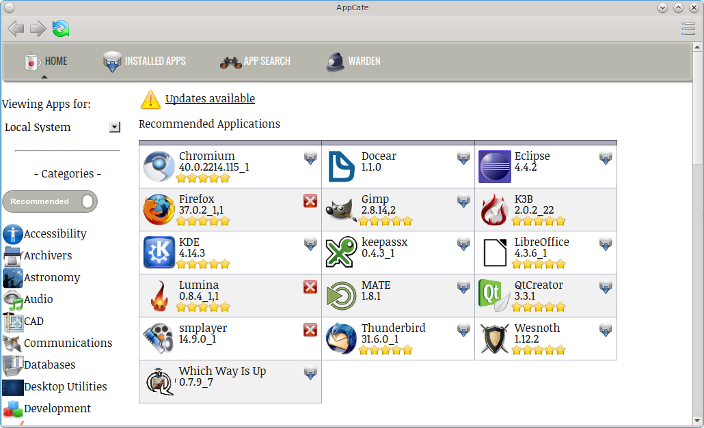
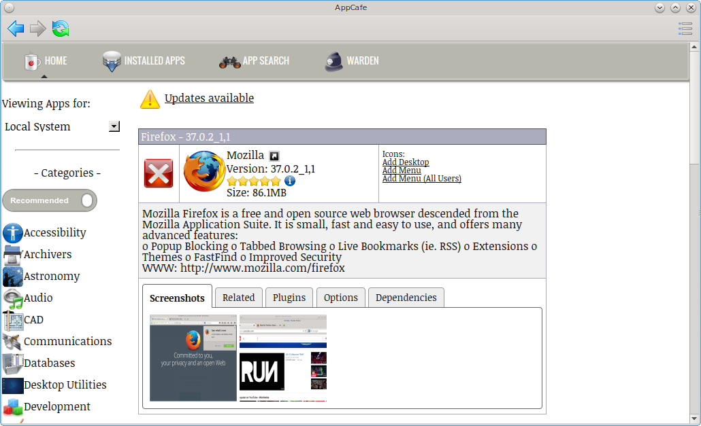
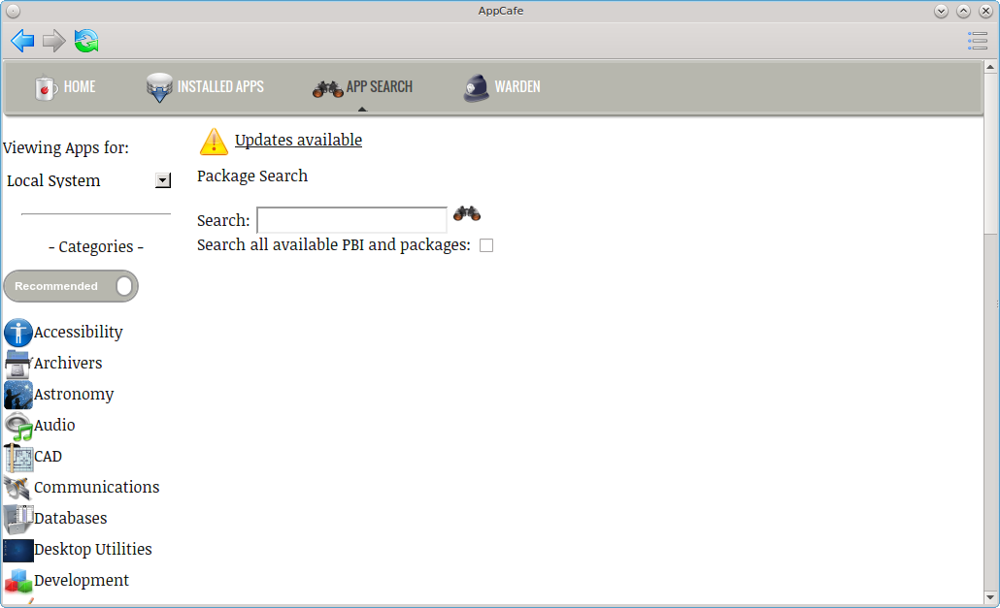
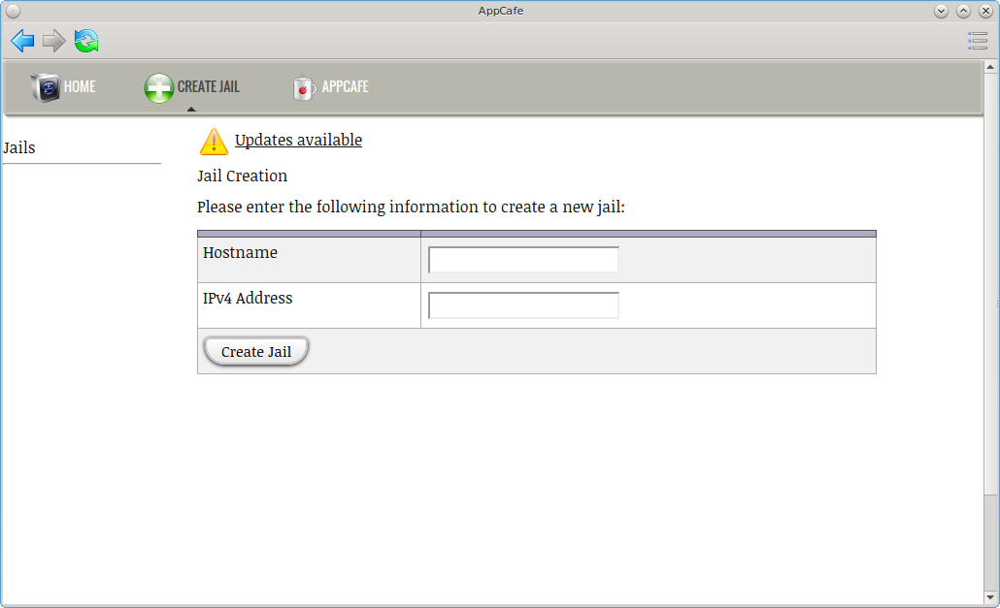
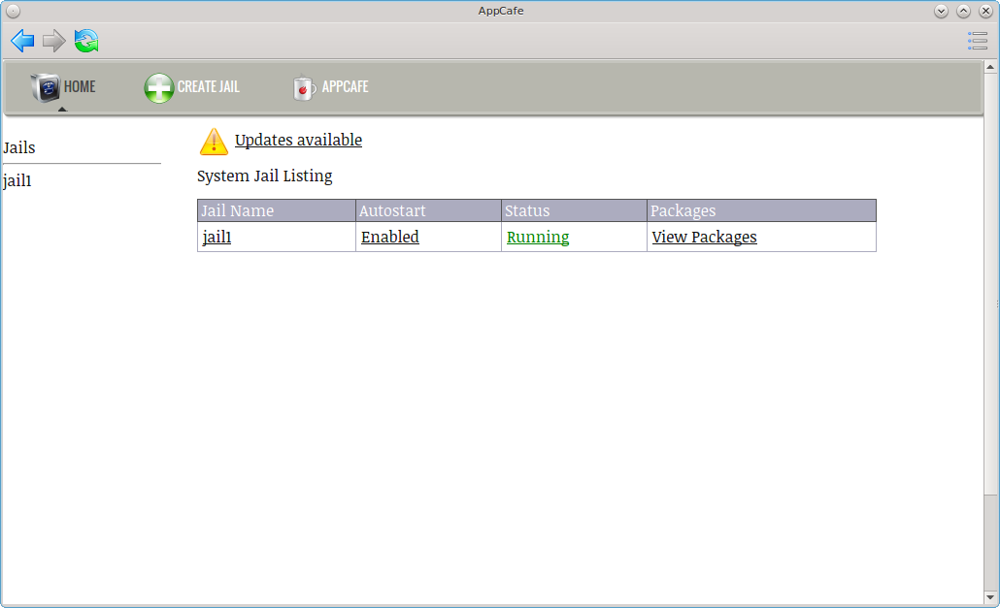
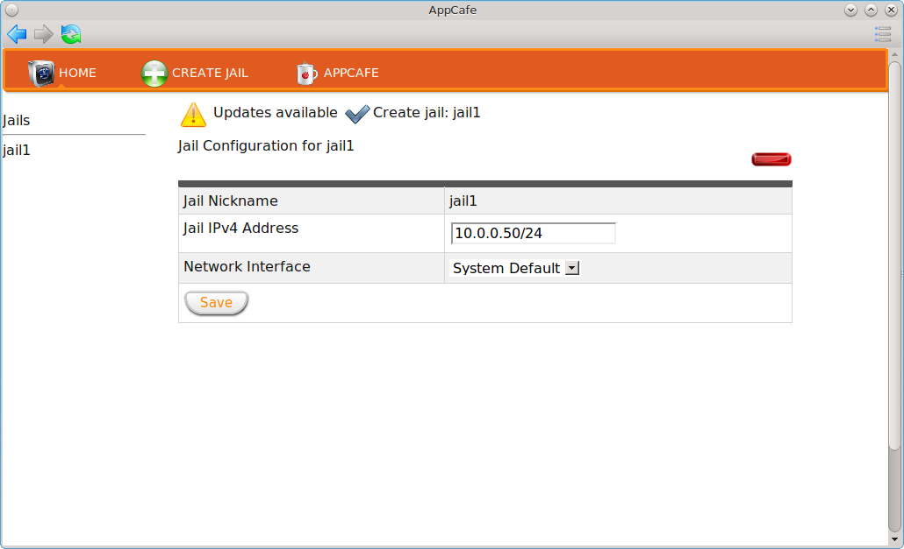
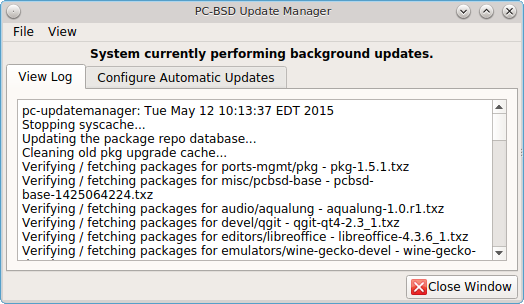
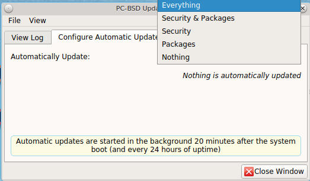
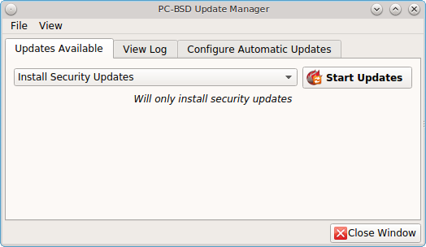

.. index:: software
.. _Installing Applications and Keeping PC-BSD® Updated:

Installing Applications and Keeping PC-BSD® Updated
****************************************************

Both PC-BSD® and TrueOS® provide tools to make it easy to manage software and to keep both the operating system and installed software up-to-date. PC-BSD®
provides the graphical :ref:`AppCafe®` and :ref:`Update Manager` utilities for managing and upgrading software from the local system or from a web browser or
mobile device. Since TrueOS® is a command-line only install and some users prefer to use command-line utilities, both PC-BSD® and TrueOS® provide the
:ref:`PBI Manager` suite of command line utilities and :command:`pkg` to manage software, as well as :command:`pc-updatemanager` to manage updates. If you install
software using any of the tools described in this chapter, you will automatically be notified whenever a newer version of software is available.

The rest of this chapter demonstrates how to use the built-in graphical and command-line tools for managing software and upgrades. It also describes how to
:ref:`Create Your Own PBI Repository` and :ref:`Create a Local Package Mirror`.

.. index:: software
.. _AppCafe®:

AppCafe®
=========

AppCafe® provides an intuitive, graphical method for installing and managing PBIs and packages. PBIs are packages that contain extra meta-data which
is displayed in AppCafe®, such as screenshots and lists of similar applications.

AppCafe® does not require the *root* password to install software. This means that you do not have to give out the root password on multi-user systems.
However, it will prompt for the user's password and will fail if that user is not a member of the *wheel* group. This allows you to control which users are
able to manage software. 

If you prefer to manage PBIs from the command line, see the section on using the :ref:`PBI Manager` suite of command line utilities. Refer to
:ref:`Using the CLI pkg Utilities` for instructions on managing packages from the command line.

.. index:: software
.. _Configuring AppCafe®:

Configuring AppCafe®
---------------------

AppCafe® includes the ability to remotely manage software and jails from another system or mobile device. During the installation
of a TrueOS® server, the installer provides the ability to configure the user, password, and port number for accessing AppCafe® from any device with
a web browser. On a desktop installation, AppCafe® can be run as a local application and optionally configured for remote access. To launch the
AppCafe® application on a PC-BSD® desktop, double-click its icon on the Desktop, go to :menuselection:`Control Panel --> AppCafe®`, or type 
:command:`appcafe` from a command prompt. When prompted, input your password. Figure 7.1a shows the initial AppCafe® screen when it is started from
a desktop.

**Figure 7.1a: Running AppCafe® from a Desktop**

The top bar contains navigational arrows and a refresh icon. Click the icon at the far right of this bar to configure or close AppCafe® or to search for text. Figure
7.1b shows the menu that appears if you click "Configure". 

**Figure 7.1b: Configuring the AppCafe® Repository**

.. image:: images/remote2.png

The "Repository Configuration" tab is used to determine which package set to use. "Production" is the default and recommended setting for most users. Software
updates are provided every three months, which gives sufficient time for new software versions to be tested. "Edge" is meant for users who wish to assist with
software testing or who can tolerate the occasional breakage caused by installing new software versions. Software updates are provided approximately every two
weeks. "Custom" assumes that you have followed the instructions to :ref:`Create Your Own PBI Repository` and are ready to click the "+" button to browse to the
location of the custom :file:`.rpo` file. To allow switching between custom repositories, multiple custom repositories can be listed, but only the one marked
as active will be used.

To configure remote access, use the "Remote Access" tab shown in Figure 7.1c. 

**Figure 7.1c: Configuring Remote Access**

.. image:: images/remote3.png

Check the box to "Enable AppCafe Remote". Then, input a username and password to use for remote access and select a port number. If the system has a public IP
address, be sure to use a hard-to-guess username and password. If you change the port number, make sure it does not conflict with another application running
on the system. Click "Apply" to complete the configuration. You will be prompted to input your password to save the configuration.

When using AppCafe® to access a system from a public network, it is highly recommended to configure the local firewall to only allow connections over
the specified port number and from allowed IP address(es).

AppCafe® uses SSL by default and will automatically create a certificate for this purpose. Once remote access is configured, use :file:`https://` and
specify the IP address of the system and configured port number in a web browser. You will then be prompted to input the configured username and password. The
AppCafe® interface will load in the web browser. It will be similar to the one shown in Figure 7.1a, except the top navigational buttons and configure
button will not be displayed and a "Logout" option will be added to the dark grey bar. Note that AppCafe® will automatically log you out after 60
minutes of inactivity.

The :file:`/usr/local/etc/appcafe.conf` file stores the configuration used by AppCafe® and can be edited in a text editor. By default, the "remote",
"port", and "ssl" options are set using the information you provided either during a server installation or using the screen shown in Figure 7.1c.
The "mode" option is not set by default, but can be configured by removing the comment symbol (";") from that option and setting its value to either
"desktop", "server", or "appliance". Here are the descriptions of the available modes as listed in that file::

 tail -5 /usr/local/etc/appcafe.conf
 ; Set the mode to run AppCafe in (default will pick between server/desktop if X is installed)
 ; desktop = Full access to local system packages and jails
 ; server = Full access to local system packages and jails, no Xorg packages listed
 ; appliance = Restricted mode to only allow operations on jails
 ; mode = desktop

Since "appliance" mode restricts the application to jails only, the first time AppCafe® is run in appliance mode, it will go straight to a welcome
page offering to create a jail if no jails yet exist on the system.

The rest of this section describes how manage software using AppCafe®.

.. index:: AppCafe®
.. _Using AppCafe®:

Using AppCafe®
---------------

The "Home" tab, seen in Figure 7.1a, is used to browse for available PBIs. Applications which are already installed have a red "X". If you click that "X", a pop-up message will
ask if you would like to uninstall that application. Applications which are not installed have a grey download icon. Click the icon to install that
application. Applications which are required by other applications will not display an icon. If you click on that application, a yellow "Required" triangle will be
displayed and a "Related" tab will indicate the name of the application(s) which require it.

The "Recommended Applications" section displays applications which are recommended by other PC-BSD® users. Whether or not an application is installed is from the perspective of
the value of the "Viewing Apps for:" drop-down menu. If you have created any jails, click the drop-down menu and change "Local System" to the name of the jail that you would
like to manage.

The "Categories" pane lists the available software categories. By default, only the recommended applications for each category are shown. To instead view all of
the PBIs for each category, click the "Recommended" button which will change to a grey "All Apps". Click the name of a category to view the available
PBIs within that category.

To view all of the applications installed on the system or jail you are "Viewing Apps for:", click the "Installed Apps" tab. The applications will be
listed in alphabetical order. Click the name of an application to view more information about the application.

In the example shown in Figure 7.1d, the user has clicked "Firefox" on a system that has Firefox installed.

**Figure 7.1d: Viewing the Details of an Installed Application**

The information for an application includes the following: 

* An icon indicating whether or not the application is already installed, can be installed, or is required by another application.

* Name, version, and icon of the application.

* A hyperlink to the application's website. In this example, clicking "Mozilla" will open the application's website in the user's default web browser.

* A hyperlink to the application's information at `freshports.org <freshports.org>`_. Click the arrow icon next to "Mozilla" to open the FreshPorts website in the user's
  default web browser.

* A rating of up to five stars. Click the stars to open the PC-BSD® wiki page for the application. If you login to the wiki and hover the mouse over the
  number of stars to select, it will add your ranking and increment the vote number. If you make a mistake in your vote, refresh the browser, click the
  "remove" button, and re-select the desired number of stars. 

* User contributed tips and how-tos for the application. Click the blue circle icon to open this wiki page. If you login to the wiki, you can add
  your own usage tips for the application.

* The download size.

* Hyperlinks to add an icon for the application to the desktop (on window managers that support desktop icons), to add an entry for the application to the
  desktop menu for the logged on user only (on window managers that provide desktop menus), or to add an entry to the desktop menu of all users.

* A description of the application.

The following tabs may also be displayed. If a tab is not displayed, it means that that information is not currently available for this particular application.

- **Screenshots:** click the "View Full Size" button under the screenshot to view the full screen version of the screenshot.

- **Related:** provides an installable list of applications that provide similar functionality.

- **Plugins:** provides an installable list of associated plugins. For an example, search for "firefox" and open its "Plugins" tab.

- **Options:** shows the values of the make options that the PBI or package was built with.

- **Dependencies:** lists the packages that are dependencies of this application.

.. note:: if updates are available for any of the installed applications, an "Updates available" link with a yellow triangle icon will appear.
   If you click this link it will provide another link that you can click to get details about the update. Note that :ref:`Update Manager` is used to
   perform the actual update and that you won't be able to add or delete any software while an update is in progress.

The "App Search" tab is shown in Figure 7.1e. 

**Figure 7.1e: Searching for Applications**

To find an application, enter its name and click the "binoculars" icon. Alternately, enter a description. For example, a search for "browser" will display
software with "browser" in the name as well as applications which provide browser functionality, such as Firefox. 

By default, only PBIs are searched. To search for all available software, including packages, check the "Search all available PBI and packages" box.

.. index:: AppCafe®
.. _Managing Software in Jails:

Managing Software in Jails
--------------------------

To create, delete, and manage jails, click the "Warden" tab. If you have not yet created any jails on the system, a message will appear. Click the "create a new jail"
link in the message, or the "Create Jail" tab, to open the screen shown in Figure 7.1f.

**Figure 7.1f: Adding a New Jail**

Input a name for the jail and an IP address that won't conflict with any other systems on the network. Click the "Create Jail" button which will queue the
jail creation so that you can continue to use AppCafe® while the jail template is downloaded and installed. Once the jail is complete, it will be
listed, as seen in the example in Figure 7.1g. 

**Figure 7.1g: Managing Installed Jails**

The jail can then be managed by clicking on the hyperlinks for the jail under the following columns: 

- **Jail Name:** click the jail's name, in this example *jail1*, to open the screen shown in Figure 7.1h. This screen can be used to change the jail's IP
  address or subnet mask and to specify the network interface to use for the jail. If you change a setting, click the "Save" button to save the changes. If
  you click the red bar in the upper right corner, a pop-up message will ask you to confirm whether or not you want to delete the jail. Alternately, click the
  "Home" button to return to the screen shown in Figure 7.1g. 

- **Autostart:** indicates whether or not the jail is set to start automatically when the system boots. Click the link to toggle between *Disabled* and
  *Enabled*.

- **Status:** indicates whether or not the jail is currently running, and thus available. Click the link to toggle between *Stopped* and *Running*.

- **Packages:** if the jail is not running, a message will indicate that you need to first *Start jail to view*. Click the *Stopped* link so that it changes
  to *Running*. This will change the message to *View Packages*. Click this link to view which packages are currently installed in the jail. This will also
  display the application categories so that you can install packages into the specified jail. A hyperlink is also included to "Export PBI list". If the jail
  already has PBIs installed, you can click this link to create a file named :file:`exportfile.pbilist` which can then be imported into another jail or
  PC-BSD ®system.

**Figure 7.1h: Editing the Specified Jail**

.. note:: if any updates are available for the software installed within any of the jails, an "Updates available" link with a yellow triangle icon will appear.
   Clicking this link will display a hyperlink for each jail that has updates. For example, click the link "Update packages for jail1" to see the update details for "jail1". 

.. index:: pkg
.. _Using the CLI pkg Utilities:

Using the CLI pkg Utilities
===========================

PC-BSD® uses :command:`pkg` to manage packages from the command line. To manage PBIs from the command line, instead refer to :ref:`PBI Manager`.

The `FreeBSD Handbook <http://www.freebsd.org/handbook/pkgng-intro.html>`_ provides an introduction to using :command:`pkg`. Section 5.4.1 is not
needed on a PC-BSD® or TrueOS® system as the operating system installation does this for you. The various :command:`pkg` commands have associated man pages.
Type :command:`man pkg` for an overview of general usage; the names of the associated man pages will be found towards the bottom of this man page. Once you
know the name of a command, you can also use the built-in help system to get more information about that command. For example, to learn more about
:command:`pkg install`, type :command:`pkg help install`.

.. index:: updates
.. _Update Manager:

Update Manager
==============

Update Manager provides a graphical interface for keeping the PC-BSD® operating system and its installed applications up-to-date. Update Manager will automatically track
updates to software installed using either the graphical or command line equivalents of :ref:`AppCafe®` and :ref:`Warden®`.

This utility can be started from :ref:`Control Panel` or by typing :command:`pc-updategui`. It can also be accessed from its icon in the system tray, if you are logged into a desktop
that provides a system tray.

The status of the icon lets you determine at a glance if any of your installed applications are out-of-date, if a system update is available, or if a new
version of the operating system is available. The possible statuses are as follows:

.. image:: images/update1.png 

Your system is up-to-date.

.. image:: images/update2.png 

The system is currently checking for updates and patches.

.. image:: images/update3.png 

Your operating system is out-of-date and system update(s) or patch(es) are available.

.. image:: images/update4.png 

Newer versions of installed applications are available.

.. image:: images/update5.png 

The system was unable to check for updates, meaning you should check your Internet connection.

.. image:: images/update6.png

The system is currently updating.

.. image:: images/update7.png 

The system needs to restart in order for the newly installed update to take effect.

If you right-click the icon, you will see the menu shown in Figure 7.3a. 

**Figure 7.3a: Right-click Menu for Update Manager** 

.. image:: images/update8.png

This menu contains the following options:

* **Start the Update Manager:** launches the Update Manager GUI which can be used as described in :ref:`Manual Updates (GUI Method)`.

* **Start the AppCafe:** launches AppCafe® which can be used to manage installed software as described in :ref:`AppCafe®`.

* **Start the Warden:** launches Warden® which can be used to manage jails as described in :ref:`Warden®`.

* **Check for Updates:** by default, updates are checked every 24 hours or 20 minutes after booting the system. However, the system won't check for updates more than once per day
  should you reboot multiple times within a day. You can check for updates now by clicking this option.

* **Run at Startup:** to disable the automatic update check after the system boots, uncheck this box.

* **Display Notifications:** to disable the pop-up message over the icon when an update becomes available, uncheck this box.

* **Check Jails:** to also be notified when updates are available to running jails, check this box.

* **Routing through Tor:** check this box to start browsing the Internet anonymously as described in :ref:`Tor Mode`.

* **Check Tor connection:** click this to determine if the system is currently routing all Internet traffic through the Tor network.

* **Quit:** to remove Update Manager from the system tray, click this entry. You can put the icon back into the tray by typing :command:`pc-systemupdatertray &`.

.. index:: updates
.. _How PC-BSD® Updating Works:

How PC-BSD® Updating Works
---------------------------

The PC-BSD® update mechanism provides several safeguards to ensure that updating the operating system or its software is a low-risk operation. Beginning with
version 10.1.1, the following steps occur automatically during an update: 

* The update automatically creates a copy of the current operating system, known as a snapshot or boot environment (BE), and mounts that snapshot in the
  background. All of the updates then occur in the snapshot. This means that you can safely continue to use your system while it is updating as no changes are
  being made to the operating system or any of the applications currently in use. Instead, all changes are being made to the mounted copy.

.. note:: if the system is getting low on disk space and there is not enough space to create a new BE, the update will fail with a message indicating that there is
   not enough space to perform the update.

* While the update is occurring, and until you reboot after the update, you won't be able to use AppCafe® to manage software. This is a safety measure to prevent
  package conflicts. Also, the system shutdown and restart buttons will be greyed out until the update is complete and the system is ready for reboot. Should a power
  failure occur in the middle of an update, the system will reboot into the current boot environment, returning the system to the point before the upgrade started.
  Simply restart the update to continue the update process.

* Once the update is complete, the new boot environment, or updated snapshot, is added as the first entry in the boot menu and activated so that the system
  will boot into it, unless you pause the boot menu and specify otherwise. A pop-up message, shown in Figure 7.3b, will indicate that a reboot is required.
  You can either finish what you are doing and reboot now into the upgraded snapshot, or ask the system to remind you again at a later time. To configure the
  time of the next warning, click the "Next Reminder" drop-down menu where you can select 1, 5, 12, or 24 hours, 30 minutes, or never (for this login
  session). Note that the system will not apply any more updates or allow you to start another manual update or install additional software using AppCafe®
  until you reboot.

* As the update is running, a log is written to :file:`/var/log/pc-updatemanager.log` and this log is displayed in the "View Log" tab of the graphical Update
  Manager utility, shown in Figure 7.3c. This way you can see which software is being updated and if there are any updating errors. The next time an update occurs,
  the previous log is written to :file:`/var/log/pc-updatemanager.log.prev`, so that you also have a copy of the previous update's log.

* You no longer need to initiate updates manually. PC-BSD® now uses an automated updater that automatically checks for updates, no more than once per day, 20
  minutes after a reboot and then every 24 hours. You can configure what gets updated using the "Configure Automatic Updates" tab of Update Manager, shown in
  Figure 7.3d. Choices are "Security & Packages" (all updates), "Security" (only security patches and operating system updates), "Packages" (only installed
  software), or "Nothing" (disables automatic updating).

**Figure 7.3b: Managing the Reboot After Update**

.. image:: images/update9.png

**Figure 7.3c: Viewing the Update Log**

**Figure 7.3d: Configuring What to Update**

The "View" menu of Update Manager provides the following information:

* **Vulnerabilities:** click this entry to determine if any of the installed software has a known, unpatched vulnerability. In the example shown in Figure 7.3e,
  two installed packages have known vulnerabilities. If you highlight an entry and click the "More info..." button, the default web browser will open to a page that
  provides more details about the vulnerability.

* **Base updates history:** the "Version" field in :ref:`About` usually includes a patch number which indicates the level to which the operating system has been patched
  against known vulnerabilities. If you click this entry, it will provide an overview of which vulnerabilities were addressed at each patch level. In the example shown
  in Figure 7.3f, the system is running "10.1-RELEASE-p20, or patch level 20. Most patch levels have an associated Security Advisory (SA). More information about each
  advisory is available from the `FreeBSD Security Advisories page <https://www.freebsd.org/security/advisories.html>`_.

**Figure 7.3e: Viewing Installed Software Vulnerability Information**

.. image:: images/update14.png

**Figure 7.3f: Viewing Operating System Patches**

.. image:: images/update15.png

Updates can still be initiated manually using either a GUI or a command-line application. The rest of this section demonstrates how to manually update using
either the GUI or the command-line method.

.. index:: updates
.. _Manual Updates (GUI Method):

Manual Updates (GUI Method)
---------------------------

Beginning in version 10.1.1, the automatic updater will automatically keep your system up-to-date. You will know that an update has completed when the pop-up
menu, shown in Figure 7.3b, indicates that a reboot is needed to complete the update process. The automatic updater will only update what it has been
configured to update. If you would like to double-check or change what gets updated, start Update Manager, enter your password, and use the drop-down menu in
the "Configure Automatic Updates" screen shown in Figure 7.3d. 

Due to its schedule, the automatic updater will never check for new updates more than once in a 24 hour period. To manually check for updates, right-click the
Update Manager in system tray and click "Check for Updates". Alternatively, start Update Manager. If any updates are available, an "Updates Available" tab
will appear, as seen in the example in Figure 7.3g. If no updates are available, of if the system is currently updating, this tab will not appear.

**Figure 7.3g: Updates are Available**

In this example, a security update is available. Click the "Start Updates" button to manually start the update. When prompted, reboot so that the system can
boot into the newly patched operating system.

When package updates are available a "View Package Updates" box can be clicked to see which packages will be upgraded.

.. note:: how often package updates are available depends upon the "Repository Settings" set in :menuselection:`AppCafe® --> Configure`. The default setting
   of "Production" will only provide package updates every 3 months whereas a setting of "Edge" will provide package updates as soon as a new version is
   available. If you need application stability, stay on "Production". If you can handle some application breakage in favor of having the latest software,
   change to "Edge". Also, if you select "Security" or "Nothing" in the "Configure Automatic Updates" tab of Update Manager, packages will only get updated
   with the next software release which happens every 3 months.

.. warning:: updates will update **all** installed software. If you have placed a lock on a package using :command:`pkg` or an older version of
   AppCafe®, Update Manager will fail and will generate a message in the log indicating that the failure is due to a locked package. If you prefer to lock certain applications
   against being updated, select "Security" or "Nothing" in the "Configure Automatic Updates" tab of Update Manager and manually update software as needed using
   :command:`pkg`.

.. index:: updates
.. _Manual Updates (CLI Method):

Manual Updates (CLI Method)
---------------------------

TrueOS® users, or those who prefer to use a command-line utility, can use :command:`pc-updatemanager` to manually apply updates. If you type
:command:`pc-updatemanager`, it will show its available options::

 pc-updatemanager
 /usr/local/bin/pc-updatemanager - Usage
 ----
 branches             - List available system branches
 chbranch <tag>       - Change to new system branch
 check                - Check for system updates
 install <tag>,<tag2> - Install system updates
 pkgcheck             - Check for updates to packages
 pkgupdate [-f]       - Install packages updates 
 fbsdupdate           - Install freebsd-update patches
 fbsdupdatepkgs       - Install freebsd-update patches and any package updates
 syncconf             - Update PC-BSD pkgng configuration 
 confcheck            - Check PC-BSD pkgng configuration
 cron                 - Perform delayed check for system and pkgng updates.

To determine if any system updates are available, type the following command::

 sudo pc-updatemanager check
 Checking for FreeBSD updates... 
 The following updates are available: 
 ------------------------------------
 NAME: FreeBSD security updates 
 TYPE: SECURITYUPDATE 

 To install: "pc-updatemanager fbsdupdate" 
 
 End of Life Notice
 ------------------------------------
 This version of PC-BSD / TrueOS has an EOL date of:
 Sat Dec 31 18:59:59 EST 2016
 ------------------------------------

If any updates are available, follow the instructions to install the update::

 sudo pc-updatemanager fbsdupdate
 Stopping syscache...
 Creating stage BE...
 Pruning old boot-environments...
 Mounting the stage BE...
 Mounted successfully on '/.updateStage'
 Fetching freebsd-update files...
 Installing freebsd-update files...
 Unmounting stage BE...
 Unmounted successfully
 GRUB configuration updated successfully
 Renamed successfully
 GRUB configuration updated successfully
 Renamed successfully
 GRUB configuration updated successfully
 Activated successfully
 Generating grub configuration file ...
 Found theme: /boot/grub/themes/pcbsd/theme.txt
 done
 Installing GRUB to ada0
 Starting syscache...
 Your update is finished! Please reboot to load into the new boot-environment

If no updates are available, the **check** command will indicate "Your system is up to date!". 

To determine if package updates are available, use this command::

 sudo pc-updatemanager pkgcheck
 Updating repository catalogue
 pcbsd-major repository is up-to-date.
 All repositories are up-to-date.
 Updating pcbsd-major repository catalogue...
 pcbsd-major repository is up-to-date.
 All repositories are up-to-date.
 Checking for upgrades (1471 candidates)... done
 Processing candidates (1471 candidates)... done
 The following 8 package(s) will be affected (of 0 checked):
     
  Installed packages to be UPGRADED:
          pcbsd-utils-qt5: 1430339597 -> 1430509574
          pcbsd-utils: 1430412291 -> 1430489128
          pcbsd-syscache: 1430342138 -> 1430496237
          pcbsd-i18n-qt5: 1430413188 -> 1430610765
          lumina: 0.8.4_1 -> 0.8.4_1,1
          life-preserver: 1430338357 -> 1430521060
          git: 2.3.6 -> 2.3.7
          curl: 7.42.0 -> 7.42.1
     
  The process will require 923 KiB more space.
  112 MiB to be downloaded.
  The following updates are available:
  ------------------------------------
  NAME: System package updates
  TYPE: PKGUPDATE
     
  To install: "pc-updatemanager pkgupdate"

In this example, newer versions are available. If no updates were available, the output would have instead said "All packages are up to date!". 

If updates are available, you can install them with this command::

 sudo pc-updatemanager pkgupdate
 Stopping syscache...
 Updating the package repo database...
 Cleaning old pkg upgrade cache...
 Verifying / fetching packages for ports-mgmt/pkg - pkg-1.5.1.txz
 The following packages will be fetched:
     
  New packages to be FETCHED:
         pkg-1.5.1 (100.00% of 2 MiB: 2 MiB)
     
  The process will require 2 MiB more space.
  2 MiB to be downloaded.
  Fetching pkg-1.5.1.txz... done
  Verifying / fetching packages for misc/pcbsd-base - pcbsd-base-1425064224.txz
  The following packages will be fetched:
     
  New packages to be FETCHED:
  <SNIP>
  The process will require 733 MiB more space.
  733 MiB to be downloaded.
  <SNIP>
  Creating stage BE...
  Pruning old boot-environments...
  Mounting the stage BE...
  Mounted successfully on '/.updateStage'
  Preparing the new boot-environment... (This may take a while)
  <SNIP>
  Deinstallation has been requested for the following 1590 packages (of 0 packages in the universe):
  <SNIP>
  The operation will free 11 GiB.
  [1/1590] Deinstalling pcbsd-meta-kde-1429798531...
  <SNIP>
  Extracting ports overlay...
  Pruning: /usr/local/share/applications/cups.desktop
  Pruning: /usr/local/share/kde4/services/kdm.desktop
  Pruning: /usr/local/share/applications/kde4/kuser.desktop
  Pruning: /usr/local/share/xsessions/[0-9a-zA-Z]*.desktop
  Extracting ports overlay data...DONE
  compat.linux.osrelease: 2.6.18 -> 2.6.18
  Updating pkgng config...
  Unmounting stage BE...
  Unmounted successfully
  GRUB configuration updated successfully
  Renamed successfully
  GRUB configuration updated successfully
  Renamed successfully
  GRUB configuration updated successfully
  Activated successfully
  Generating grub configuration file ...
  Found theme: /boot/grub/themes/pcbsd/theme.txt
  done
  Installing GRUB to ada0
  Starting syscache...
  Your update is finished! Please reboot to load into the new boot-environment

While the package output has been snipped from this example due to the amount of packages to be upgraded, the update process will download the latest versions
of the packages which need updating, displaying the download progress for each file. Once the downloads are complete, it will create a new boot environment and
display the installation process for each file within the boot environment. The last step of the update process is to extract the desktop (or server) overlay and
upgrade GRUB and then to return the prompt. Once the update is complete, reboot to boot into the updated version of the system.

.. index:: updates
.. _Upgrading from 9.x to 10.x:

Upgrading from 9.x to 10.x
--------------------------

PC-BSD® 10.x has switched to 64-bit and ZFS-only. This means that you can **not** upgrade a system that is either 32-bit or formatted with UFS. If the hardware supports
64-bit, you will need to backup your important data to another system or external drive and then perform a new installation. The new installation will perform
a format of the selected disk(s) with ZFS.

The boot loader and default ZFS layout has changed to support :ref:`Boot Manager` and ZFS snapshot management with :ref:`Life Preserver`. For this reason, 9.x
users should backup their important data to another system or external drive and then perform a new installation which will create the required ZFS layout.

.. index:: updates
.. _Upgrading from 10.x to |version|:

Upgrading from 10.x to |version|
--------------------------------

Upgrading from any 10.x version to |version| is the same as applying any package update. This means that the update to |version| will either appear in Update
Manager as a package update, for both "Edge" and "Production" users, or in the listing of :command:`pc-updatemanager pkgcheck`.

.. note:: a fresh install, rather than an update, is only required if you wish to take advantage of any of the following features: UEFI boot (on a current non-UEFI
   installation), full disk encryption, or the
   `improved encryption key generation provided by GELIv7 <https://github.com/freebsd/freebsd/commit/38de8ef1dd0e468ff1e3ec1c431f465e270beba3>`_. This means
   that you will have to backup your data to an external drive or another system, perform the new install, then restore your data from the backup.

.. index:: software
.. _PBI Manager:

PBI Manager
===========

PBI Manager is a suite of command line utilities which can be used to install, remove, and manage PBIs.

This chapter provides an overview of the commands that are installed by PBI Manager. When using these commands, note that single character options can not be
stacked. As an example, you must type :command:`pbi_add -i -v` as :command:`pbi_add -iv` will fail with a syntax error.

.. index:: PBI Manager
.. _pbi:

pbi
---

The :command:`pbi` meta-command can be used to install, uninstall, and get information about PBIs. Unlike the other :command:`pbi_` commands, it uses a space
instead of an underscore. For example, :command:`pbi add` is equivalent to :command:`pbi_add` and either command can be used to install a PBI.

This meta-command expects to be given a sub-command, and then a suitable option for that sub-command. To see the available options for a sub-command, use the
built-in help system. For example, to see the available options for the **add** sub-command, type :command:`pkg help add`.
Table 7.4a summarizes the available sub-commands.

**Table 7.4a: pbi Sub-Commands**

+------------------+--------------------------------------------------------------------------------+
| Sub-Command      | Description                                                                    |
+==================+================================================================================+
| **add**          | installs the specified PBI                                                     |
+------------------+--------------------------------------------------------------------------------+
| **delete**       | uninstalls the specified PBI                                                   |
+------------------+--------------------------------------------------------------------------------+
| **help**         | shows the options for the specified sub-command                                |
+------------------+--------------------------------------------------------------------------------+
| **icon**         | adds or deletes the PBI's desktop icon, menu icon, or MIME registration        |
+------------------+--------------------------------------------------------------------------------+
| **info**         | shows all available PBIs or lists the packages installed into a specified jail |
+------------------+--------------------------------------------------------------------------------+
| **install**      | equivalent to **add**                                                          |
+------------------+--------------------------------------------------------------------------------+

The :command:`pbi_` commands support several environment variables which can be stored in the ASCII text configuration file, :file:`/usr/local/etc/pbi.conf`.
These proxy variables are only needed if the system uses a proxy server to access the Internet. Table 7.4b lists the supported variables.

**Table 7.4b: pbi.conf Variables**

+----------------+--------------------------------------------------+
| Variable       | Description                                      |
+================+==================================================+
| PBI_PROXYURL   | proxy server IP address                          |
+----------------+--------------------------------------------------+
| PBI_PROXYPORT  | proxy server port number                         |
+----------------+--------------------------------------------------+
| PBI_PROXYTYPE  | can be HTTP or SOCKS5                            |
+----------------+--------------------------------------------------+
| PBI_PROXYUSER  | username used to authenticate with proxy server  |
+----------------+--------------------------------------------------+
| PBI_PROXYPASS  | password used to authenticate with proxy server  |
+----------------+--------------------------------------------------+

.. index:: PBI Manager
.. _pbi add:

pbi_add
-------

The :command:`pbi_add` command is used to install a specified PBI. Table 7.4c summarizes the available options.

**Table 7.4c: pbi_add Options**

+------------------------+-----------------------------------------------------------------------------------------------------------------------------------+
| Switch                 | Description                                                                                                                       |
+========================+===================================================================================================================================+
| **-f**                 | force installation, overwriting an already installed copy of the application                                                      |
+------------------------+-----------------------------------------------------------------------------------------------------------------------------------+
| **-i**                 | display information about specified PBI; if combined with **-v**, will display all of the files that will be installed with the   |
|                        | PBI                                                                                                                               |
+------------------------+-----------------------------------------------------------------------------------------------------------------------------------+
| **-j <jailname>**      | installs the PBI into the specified jail                                                                                          |
+------------------------+-----------------------------------------------------------------------------------------------------------------------------------+
| **-J**                 | used to create a new jail and install specified PBI into it                                                                       |
+------------------------+-----------------------------------------------------------------------------------------------------------------------------------+
| **-l**                 | display :file:`LICENSE` text for specified PBI                                                                                    |
+------------------------+-----------------------------------------------------------------------------------------------------------------------------------+
| **-v**                 | enable verbose output                                                                                                             |
+------------------------+-----------------------------------------------------------------------------------------------------------------------------------+
| **--licagree**         | if the PBI has a license, agree to it                                                                                             |
+------------------------+-----------------------------------------------------------------------------------------------------------------------------------+

The following example installs the alpine PBI. When prompted, input your password::

 sudo pbi_add alpine
 Password:
 Updating pcbsd-major repository catalogue...
 pcbsd-major repository is up-to-date.
 All repositories are up-to-date.
 Installing: alpine
 Updating pcbsd-major repository catalogue...
 pcbsd-major repository is up-to-date.
 All repositories are up-to-date.
 The following 2 package(s) will be affected (of 0 checked):
 New packages to be INSTALLED:
        alpine: 2.20
        pico-alpine: 2.20_1
 The process will require 9 MiB more space.
 2 MiB to be downloaded.
 Fetching alpine-2.20.txz: 100%    2 MiB   1.8MB/s    00:01    
 Fetching pico-alpine-2.20_1.txz: 100%  319 KiB 326.9kB/s    00:01    
 Checking integrity... done (0 conflicting)
 [1/2] Installing pico-alpine-2.20_1...
 [1/2] Extracting pico-alpine-2.20_1: 100%
 [2/2] Installing alpine-2.20...
 [2/2] Extracting alpine-2.20: 100%
 Message for alpine-2.20:
 *******************************************************************************
 *** To use GnuPG with Alpine, take a look at the mail/pine-pgp-filters port ***
 *******************************************************************************
 Pruning: /usr/local/share/xsessions/[0-9a-zA-Z]*.desktop
 Extracting ports overlay data...DONE
 compat.linux.osrelease: 2.6.18 -> 2.6.18

.. index:: PBI Manager
.. _pbi delete:

pbi_delete 
-----------

The :command:`pbi_delete` command removes an installed PBI from the system. Table 7.4d summarizes its available options.

**Table 7.4d: pbi_delete Options**

+---------------+---------------------------------------------------------------------------------+
| Switch        | Description                                                                     |
+===============+=================================================================================+
| **-f**        | force the removal of the application, even if other applications depend upon it |
+---------------+---------------------------------------------------------------------------------+
| **-j <jail>** | deletes the application from the specified jail                                 |
+---------------+---------------------------------------------------------------------------------+
| **-v**        | enable verbose output                                                           |
+---------------+---------------------------------------------------------------------------------+

The following example uninstalls the previously installed alpine PBI::

 sudo pbi_delete alpine
 Password: 
 Updating pcbsd-major repository catalogue...
 All repositories are up-to-date.
 Checking integrity... done (0 conflicting)
 Deinstallation has been requested for the following 1 package (of 0 packages in the universe): 
 Installed packages to be REMOVED:
 alpine-2.20
 The operation will free 8 MiB 
 [1/1] Deinstalling alpine-2.20...
 [1/1] Deleting files for alpine-2.20: 100%

.. index:: PBI Manager
.. _pbi icon:

pbi_icon
--------

The :command:`pbi_icon` command provides a number of options for adding desktop icons, menu entries, and MIME data for an installed PBI. Not all PBIs will
contain desktop/menu/MIME data. Additionally, the window manager must be `XDG <http://en.wikipedia.org/wiki/Xdg>`_-compliant to understand a PBI's icon and
MIME settings. Table 7.4e summarizes this command's options: 

**Table 7.4e: pbi_icon Options**

+-------------------+-------------------------------------------------------+
| Switch            | Description                                           |
+===================+=======================================================+
| **add-desktop**   | installs desktop icon; should be run as regular user  |
+-------------------+-------------------------------------------------------+
| **add-mime**      | installs mime information; should be run as root      |
+-------------------+-------------------------------------------------------+
| **add-menu**      | installs menu icons; should be run as root            |
+-------------------+-------------------------------------------------------+
| **del-desktop**   | removes desktop icon; should be run as regular user   |
+-------------------+-------------------------------------------------------+
| **del-menu**      | removes menu icons; should be run as root             |
+-------------------+-------------------------------------------------------+
| **del-mime**      | removes mime information; should be run as root       |
+-------------------+-------------------------------------------------------+

.. index:: PBI Manager
.. _pbi info:

pbi_info 
---------

The :command:`pbi_info` command is used to determine which PBIs are currently installed. Table 7.4f summarizes the available options.

**Table 7.4f: pbi_info Options**

+------------------------+------------------------------------------------------------------------------------------+
| Switch                 | Description                                                                              |
+========================+==========================================================================================+
| **-a**                 | list all PBIs installed on the system; same as running **pbi_info** without an argument  |
+------------------------+------------------------------------------------------------------------------------------+
| **-j <jailname>**      | list PBIs installed in the specified jail                                                |
+------------------------+------------------------------------------------------------------------------------------+
| **-v**                 | includes verbose information about each PBI                                              |
+------------------------+------------------------------------------------------------------------------------------+

.. index:: PBI Manager
.. _pbi install:

pbi install
-----------

The :command:`pbi install` command provides an alternative to :command:`pbi_add` and is also used to install PBIs. Table 7.4g summarizes its available options.

**Table 7.4g: pbi install Options**

+------------------------+-----------------------------------------------------------------------------------------------------------------------------------+
| Switch                 | Description                                                                                                                       |
+========================+===================================================================================================================================+
| **-f**                 | force installation, overwriting an already installed copy of the application                                                      |
+------------------------+-----------------------------------------------------------------------------------------------------------------------------------+
| **-i**                 | display information about specified PBI; if combined with **-v**, will display all of the files that will be installed with the   |
|                        | PBI                                                                                                                               |
+------------------------+-----------------------------------------------------------------------------------------------------------------------------------+
| **-j <jailname>**      | installs the PBI into the specified jail                                                                                          |
+------------------------+-----------------------------------------------------------------------------------------------------------------------------------+
| **-J**                 | used to create a new jail and install specified PBI into it                                                                       |
+------------------------+-----------------------------------------------------------------------------------------------------------------------------------+
| **-l**                 | display :file:`LICENSE` text for specified PBI                                                                                    |
+------------------------+-----------------------------------------------------------------------------------------------------------------------------------+
| **-v**                 | enable verbose output                                                                                                             |
+------------------------+-----------------------------------------------------------------------------------------------------------------------------------+
| **--licagree**         | if the PBI has a license, agree to it                                                                                             |
+------------------------+-----------------------------------------------------------------------------------------------------------------------------------+

.. index:: PBI Manager
.. _pbi_makeindex:

pbi_makeindex
-------------

This command is used to make the INDEX for a custom PBI repository which can then be used in :ref:`AppCafe®`. Refer to
:ref:`Create Your Own PBI Repository` for instructions on how to create a custom repository.

.. index:: PBI Manager
.. _pbi updateindex:

pbi_updateindex
---------------

To check for a newer version of the PC-BSD® :file:`PBI-INDEX.txz` file, type :command:`sudo pbi_updateindex` and input your password when prompted. If a
newer version is available, this command fetches and extracts it so that the system has the most recent list of available PBIs.

.. index:: software
.. _Create Your Own PBI Repository:

Create Your Own PBI Repository
==============================

By default, AppCafe® displays the PBIs which are available from the official PC-BSD® repository. It also supports custom repositories. This section describes the steps to
create a custom repository.

The :file:`INDEX` of a PBI repository should be digitally signed for security and identification purposes. In order to sign the :file:`INDEX`, first create an
OpenSSL key pair using the following commands::

 openssl genrsa -out privkey.pem 4096
 Generating RSA private key, 4096 bit long modulus
 ..................++
 .............................................................................++
 e is 65537 (0x10001)

 openssl rsa -in privkey.pem -pubout > pub.key
 writing RSA key

These commands will create the files :file:`privkey.pem` and :file:`pub.key`.

To create the customized PBI modules, follow the instructions in :ref:`Bulk Module Creator`. For example, if the repository directory is :file:`~/myrepo/`, make sure that
all of the custom modules are listed as subdirectories of that directory.

Next, configure a FTP, HTTP, or HTTPS server to host the directory containing the custom PBI modules. The server can be a public URL on the Internet or a
private LAN server, as long as it is accessible to your target audience. Ensure that this directory is browsable by an FTP client or web browser from a client
system **before** moving on to the next step.

To generate the signed :file:`INDEX`, :command:`cd` to the directory containing the PBI modules and run :command:`pbi_makeindex`, specifying the path to the
private key. In this example, the PBI modules are located in :file:`~/myrepo` and the key is located in the user's home directory (:file:`~`). Be patient as
it will take a few minutes to generate the :file:`INDEX` and return the command prompt.
::

 cd ~/myrepo

 fetch https://github.com/pcbsd/pcbsd/raw/master/pbi-modules/PBI-categories

 pbi_makeindex ../privkey.pem
 Building PBI-INDEX... This may take a few moments...
 Fetching PBI ratings file...
 /tmp/.PBI.19956/.ratings 100% of 71 kB 134 kBps 00m00s
 Adding additional package information to PBI-INDEX...
 Compressing PBI-INDEX...

This will create the files :file:`PBI-INDEX.txz` and :file:`PBI-INDEX.txz.sha1`.

.. index:: software
.. _Import the Repository:

Finally, on each client, configure :ref:`Appcafe®` to use the custom repository. Go to :menuselection:`Configure --> Repository Settings`. Click "Custom" in the screen
shown in Figure 7.5a, then the "+" button. Input the URL to the repository and click "OK". 

**Figure 7.5a: Add the Custom Repository to AppCafe®**

.. image:: images/repo1.png

It will take a few minutes for AppCafe® to read in the :file:`INDEX` for the custom repository.

.. index:: software
.. _Create a Local Package Mirror:

Create a Local Package Mirror
=============================

The official PC-BSD® package repository is hosted as a `ScaleEngine <http://www.scaleengine.com/>`_ CDN (Content Delivery Network). It is possible to
:command:`rsync` a copy of the package repository, which means you can have a locally hosted, complete package repository available for your own clients.

To create a local package mirror, first setup a directory which is served over HTTP. The web server can be a public URL on the Internet or a
private web server, as long as it is accessible to your target audience. Ensure that this directory is browsable by a web browser from a client
system **before** moving on to the next step.

Once you have the HTTP directory ready for serving, use the following commands to sync with the official package repository::

 rsync -van --delete-delay --delay-updates pcbsd-rsync.scaleengine.net::pkg /my/path/to/httpd/directory/pkg

The complete package repository may be well over 200GB in size. If you do not need the entire repository, you can instead sync the specific version of PC-BSD®
packages to pull as shown in these examples::

 rsync -van --delete-delay --delay-updates pcbsd-rsync.scaleengine.net::pkg/10.0-RELEASE /my/path/to/httpd/directory/pkg

 rsync -van --delete-delay --delay-updates pcbsd-rsync.scaleengine.net::pkg/11.0-CURRENTMAR2015 /my/path/to/httpd/directory/pkg

Note that for major RELEASES, you will pull the *.0* version for the entire branch. In other words, both the 10.1 and 10.2 minor releases use the
*10.0-RELEASE* package directory.

Once the repository is downloaded, configure each client by editing their :file:`/usr/local/etc/pcbsd.conf` file with the following. Replace *<myhost>*
with the URL to the local repository::

 PACKAGE_SET: CUSTOM
 PACKAGE_URL: http://<myhost>/pkg/%VERSION%/edge/%ARCH%

After editing each client's file, run :command:`pc-updatemanager syncconf` on the client to apply the
changes. Configured clients will now use your local mirror whenever they use :command:`pkg` or AppCafe®.
