.. index:: software
.. _Installing Applications and Keeping PC-BSD® Updated:

Installing Applications and Keeping PC-BSD® Updated
****************************************************

Both PC-BSD® and TrueOS® provide tools to make it easy to manage software and to keep both the operating system and installed software up-to-date. PC-BSD®
provides the graphical :ref:`AppCafe®` and :ref:`Update Manager` utilities for managing and upgrading software from the local system or from a web browser or
mobile device. Since TrueOS® is a command-line only install and some users prefer to use command-line utilities, both PC-BSD® and TrueOS® provide the
:command:`pkg` command line utility to manage software, as well as :command:`pc-updatemanager` to manage updates. If you install
software using any of the tools described in this chapter, you will automatically be notified whenever a newer version of software is available.

The rest of this chapter demonstrates how to use the built-in graphical and command-line tools for managing software and upgrades. It also describes how to
:ref:`Create a Local Package Mirror`.

.. index:: software
.. _AppCafe®:

AppCafe®
=========

AppCafe® provides an intuitive, graphical method for installing and managing software. It provides a graphical front-end to FreeBSD packages, which are
pre-built applications that have been tested for FreeBSD. It also provides a front-end to PBIs, which are packages that contain extra meta-data which
is displayed in AppCafe®, such as screenshots and lists of similar applications. It also provides graphical jail management, which allows you to
run applications which are isolated from the rest of the operating system.

AppCafe® does not require the *root* password to install software. This means that you do not have to give out the root password on multi-user systems.
However, it will prompt for the user's password and will fail if that user is not a member of the *wheel* group. This allows you to control which users are
able to manage software. 

If you prefer to manage software from the command line, refer to the section on :ref:`Using the CLI pkg Utilities` . Refer to :ref:`Managing Jails from the CLI` for instructions
on how to manage jails from the command line.

.. index:: software
.. _Configuring AppCafe®:

Configuring AppCafe®
---------------------

AppCafe® includes the ability to remotely manage software and jails from another system or mobile device. During the installation
of a TrueOS® server, the installer provides the ability to configure the user, password, and port number for accessing AppCafe® from any device with
a web browser. On a desktop installation, AppCafe® can be run as a local application and optionally configured for remote access. To launch the
AppCafe® application on a PC-BSD® desktop, double-click its icon on the Desktop, go to :menuselection:`Control Panel --> AppCafe®`, or type 
:command:`appcafe` from a command prompt. When prompted, input your password. Figure 7.1a shows the initial AppCafe® screen when it is started from
a desktop.

**Figure 7.1a: Running AppCafe® from a Desktop**

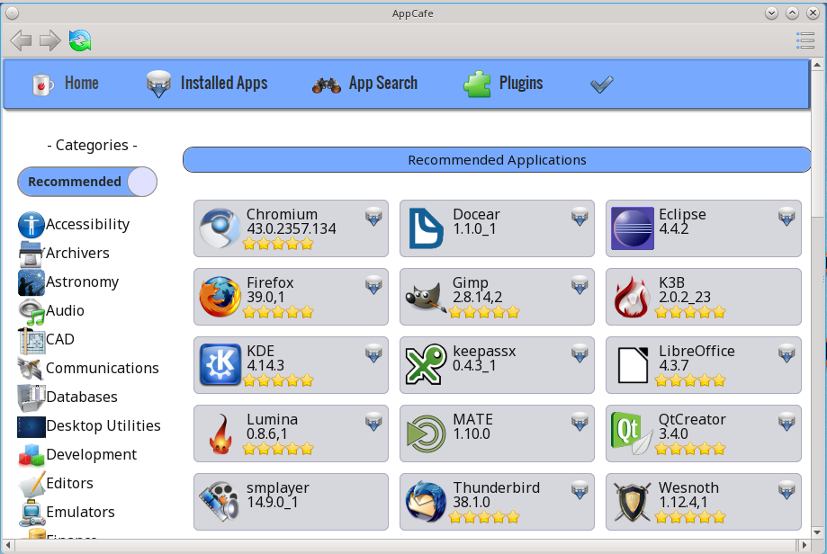

.. note:: if updates are available for any of the installed applications, an "Updates available" link with a yellow triangle icon will appear.
   If you click this link it will provide another link that you can click to get details about the update. Note that :ref:`Update Manager` is used to
   perform the actual update and that you won't be able to add or delete any software while an update is in progress.

The top bar contains navigational arrows and a refresh icon. Click the icon at the far right of this bar to access the following options:

* **Configure:** used to configure the package repository and remote access to AppCafe®. 

* **Save Pkg List:** click this option to generate a list of the installed PBIs. A pop-up message will indicate the path to the file containing the list.

* **Search for Text:** opens a search bar where you can input the name of an application. This is useful for quickly navigating to an application listed on the current screen.

* **Close AppCafe:** used to exit this application.

Figure 7.1b shows the menu that appears if you click the "Configure" option. 

**Figure 7.1b: Configuring the AppCafe® Repository**

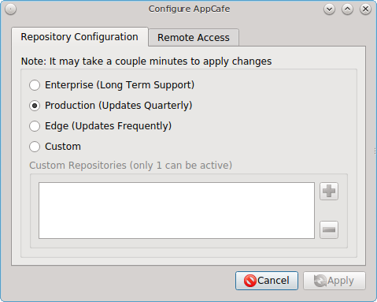

The "Repository Configuration" tab is used to determine which package set to use, where:

* **Enterprise:** this package set is meant for enterprise users that wish to only receive software updates which fix known security vulnerabilities. 

* **Production:** is the default and recommended setting for most users. Software updates are provided every three months, which gives sufficient time for new software versions to be tested.

* **Edge:** is meant for users who wish to assist with software testing or who can tolerate the occasional breakage caused by installing new software versions. Software updates are provided
  approximately every two weeks. 
  
* **Custom:** assumes that you have followed the instructions to :ref:`Create a Local Package Mirror` and are ready to click the "+" button to browse to the location of the custom
  :file:`.rpo` file. To allow switching between custom repositories, multiple custom repositories can be listed, but only the one marked as active will be used.

To configure remote access, use the "Remote Access" tab shown in Figure 7.1c. 

**Figure 7.1c: Configuring Remote Access**

.. image:: images/remote3.png

Check the box to "Enable AppCafe Remote". Then, input a username and password to use for remote access and select a port number. If the system has a public IP
address, be sure to use a hard-to-guess username and password. If you change the port number, make sure it does not conflict with another application running
on the system. Click "Apply" to complete the configuration. You will be prompted to input your password to save the configuration.

When using AppCafe® to access a system from a public network, it is highly recommended to configure the local firewall to only allow connections over
the specified port number and from allowed IP address(es).

AppCafe® uses SSL by default and will automatically create a certificate for this purpose. Once remote access is configured, use :file:`https://` and
specify the IP address of the system and configured port number in a web browser. You will then be prompted to input the configured username and password. The
AppCafe® interface will load in the web browser. It will be similar to the one shown in Figure 7.1a, except the top navigational buttons and configure
button will not be displayed and a "Logout" option will be added to the dark grey bar. Note that AppCafe® will automatically log you out after 60
minutes of inactivity.

The :file:`/usr/local/etc/appcafe.conf` file stores the configuration used by AppCafe® and can be edited in a text editor. By default, the "remote",
"port", and "ssl" options are set using the information you provided either during a server installation or using the screen shown in Figure 7.1c.
The "mode" option is not set by default, but can be configured by removing the comment symbol (";") from that option and setting its value to either
"desktop", "server", or "appliance". Here are the descriptions of the available modes as listed in that file::

 tail -5 /usr/local/etc/appcafe.conf
 ; Set the mode to run AppCafe in (default will pick between server/desktop if X is installed)
 ; desktop = Full access to local system packages and jails
 ; server = Full access to local system packages and jails, no Xorg packages listed
 ; appliance = Restricted mode to only allow operations on jails
 ; mode = desktop

Since "appliance" mode restricts the application to jails only, the first time AppCafe® is run in appliance mode, it will go straight to a welcome
page offering to create a jail if no jails yet exist on the system.

The rest of this section describes how to manage software using AppCafe®.

.. index:: AppCafe®
.. _Software Management:

Software Management
-------------------

The "Home" tab, seen in Figure 7.1a, is used to browse for available PBIs. Applications which are already installed and which are not required by other applications have a red "X".
If you click a red "X", a pop-up message will ask if you would like to uninstall that application. Applications which are not installed have a grey download icon. Click the icon to
install that application. Applications which are required by other applications will not display an icon. If you click on that application, a yellow "Required" triangle will be
displayed and a "Related" tab will indicate the name of the application(s) which require it.

The "Recommended Applications" section displays applications which are recommended by other PC-BSD® users.

The "Categories" pane lists the available software categories. By default, only the recommended applications for each category are shown. To instead view all of
the PBIs for each category, click the "Recommended" button which will change to an "All Apps" button. Click the name of a category to view the available
PBIs within that category.

To view all of the applications installed on the system, click the "Installed Apps" tab. The applications will be
listed in alphabetical order. Click the name of an application to view more information about the application.

In the example shown in Figure 7.1d, the user has clicked "Firefox" on a system that has Firefox installed.

**Figure 7.1d: Viewing the Details of an Installed Application**

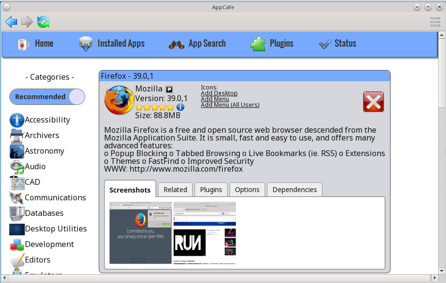

The information for an application includes the following: 

* Name, version, and icon of the application.

* A hyperlink to the application's website. In this example, clicking "Mozilla" will open the application's website in the user's default web browser.

* A hyperlink to the application's information at `freshports.org <http://www.freshports.org/>`_. Click the arrow icon next to "Mozilla" to open the FreshPorts website in the user's
  default web browser.

* A rating of up to five stars. Click the stars to open the PC-BSD® wiki page for the application. If you login to the wiki and hover the mouse over the
  number of stars to select, it will add your ranking and increment the vote number. If you make a mistake in your vote, refresh the browser, click the
  "remove" button, and re-select the desired number of stars. 

* User contributed tips and how-tos for the application. Click the blue circle icon to open this wiki page. If you login to the wiki, you can add
  your own usage tips for the application.

* The download size.

* Hyperlinks to add an icon for the application to the desktop (on window managers that support desktop icons), to add an entry for the application to the
  desktop menu for the logged on user only (on window managers that provide desktop menus), or to add an entry to the desktop menu of all users.

* An icon indicating whether or not the application is already installed, can be installed, or is required by another application.
  
* A description of the application.

The following tabs may also be displayed. If a tab is not displayed, it means that that information is not currently available for this particular application.

- **Screenshots:** click a screenshot to view a larger version of the screenshot.

- **Related:** provides an installable list of applications that provide similar functionality.

- **Plugins:** provides an installable list of associated plugins. For an example, search for "firefox" and open its "Plugins" tab.

- **Options:** shows the values of the make options that the PBI or package was built with.

- **Dependencies:** lists the packages that are dependencies of this application.

The "App Search" tab is shown in Figure 7.1e. 

**Figure 7.1e: Searching for Applications**

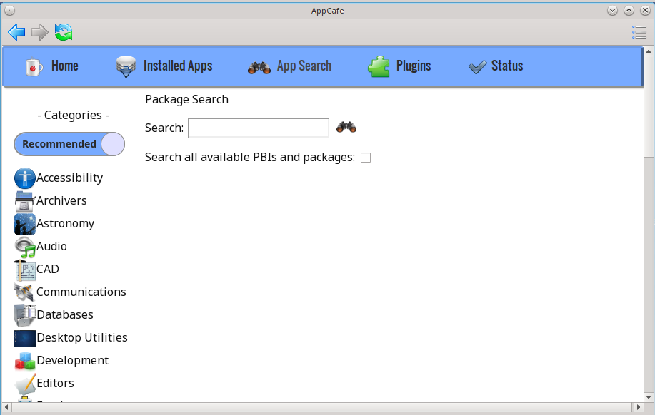

To find an application, enter its name and click the "binoculars" icon. Alternately, enter a description. For example, a search for "browser" will display
software with "browser" in the name as well as applications which provide browser functionality, such as Firefox. 

By default, only PBIs are searched. To search for all available software, including packages, check the "Search all available PBIs and packages" box.

If you install or uninstall any software, a "Status" tab will be added. In the example shown in Figure 7.1f, the firefox application was installed. Click the hyperlink under
the "Result" column to review the installation log.

**Figure 7.1f: Example Status Tab**

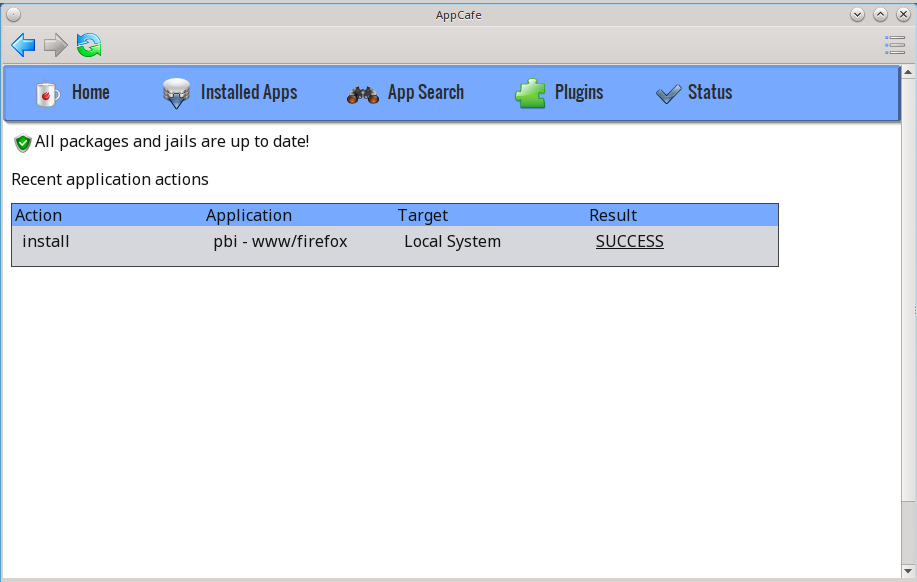

.. index:: AppCafe®
.. _Jail Management:

Plugins
-------

Beginning with PC-BSD® 10.2, plugins can be used to install a pre-configured, isolated application into its own jail. A `jail <https://en.wikipedia.org/wiki/FreeBSD_jail>`_ provides a very
light-weight, operating system-level virtualization. A jail is similar to running an independent instance of FreeBSD on the same hardware, without all of the overhead usually associated
with virtualization. Jails are usually created for running applications or services. For example, you could host your own media server on your desktop system without affecting other
installed applications or your data. Each jail has its own IP address, running processes, and users. Whatever happens in that jail does not affect your operating system or other jails
running on the PC-BSD® system.

Plugins use `iocage <https://github.com/iocage/iocage>`_ for managing jails using either the AppCafe® GUI or :command:`iocage` command line utility. iocage was specifically
designed for jail management on systems formatted with the ZFS filesystem. It stores its configuration as a ZFS property rather than using a configuration file. 

To create, delete, and manage plugins within AppCafe®, click the "Plugins" tab. This will change the entries in the top blue menu bar to the following:

* **Home:** used to return to the Plugins home page.

* **Installed Plugins:** lists the available plugins. The "download" and red "x" icons indicate which plugins are already installed.

* **Configuration:** used to configure the range of IP addresses available for use by plugins.

* **System Apps:** used to return to the main AppCafe® page so that you can manage packages and PBIs.

* **Status:** this tab appears if you have installed or uninstalled any software and contains the logs for each action.

The first time you use plugins, the "Configuration" tab shown in Figure 7.1g will prompt you to configure the range of IP addresses on your network that you will reserve for plugins.

**Figure 7.1g: Initial Plugins Configuration**

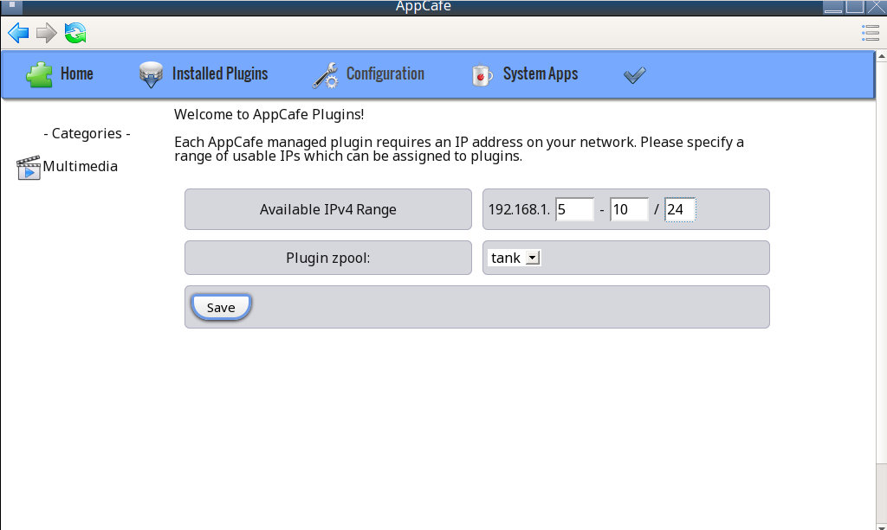

In this example, AppCafe® has detected that the PC-BSD® system is on the *192.168.1.x* network and the user has input a range of available addresses from
*192.168.1.5* to
*192.168.1.10* and the subnet mask to use. When inputting your own address range and mask, make sure that no other hosts on your network are, or will be, using those reserved addresses. If
you have control over the DHCP server in your network, make a reservation for those addresses so that the DHCP server does not assign them to other hosts on your network.

In this example, AppCafe® has also detected that the name of the ZFS pool is *tank*. If you have multiple ZFS pools and would like to specify which one is used for plugins, use the
"Plugin zpool" drop-down menu to select the desired pool.

When finished, click "Save". This will open the "Installed Plugins" tab, showing the listing of available plugins. In the example shown in Figure 7.1h, the
`Plex Media Server <https://plex.tv/>`_ plugin is available for installation.

**Figure 7.1h: List of Available Plugins**

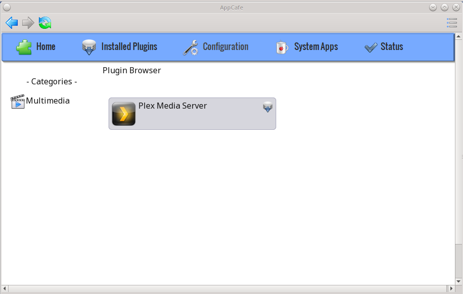

.. note:: at this time, only the Plex Media Server is available as a plugin. More plugins will be added in future updates to PC-BSD®. If you would like to install other, isolated
   applications, refer to the section on :ref:`Managing Jails from the CLI`.

Click the plugin's install icon to begin the installation. Installation will take a few minutes as a new jail will be created, the jail will be assigned the next available reserved IP
address, and the application will be installed into the jail. Once installed, a screen similar to Figure 7.1i will indicate that the plugin is installed.

**Figure 7.1i: Plugin is Installed**

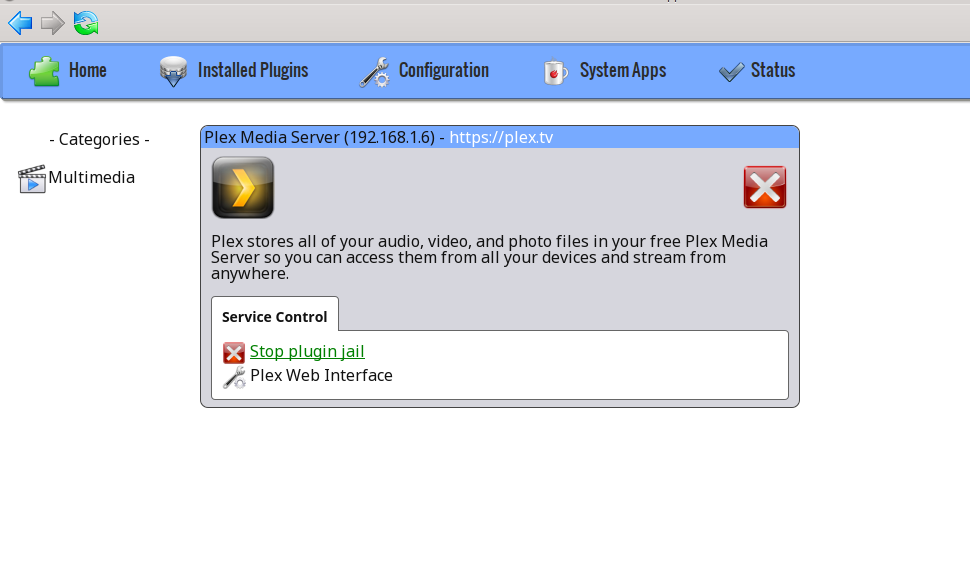

The title bar will indicate the name of the application that was installed and the IP address assigned to the jail where the application was installed. To configure the application,
click the hyperlink for the "Plex Web Interface" configuration icon. This will open the configuration screen shown in Figure 7.1j.

.. note:: depending upon the window manager's default web browser, the configuration link may or may not display properly. For example, the default web browser for the KDE window manager is
   Konqueror, which does not render the configuration page. To change the default web browser within KDE, click
   :menuselection:`Kickoff --> System Settings --> Default Applications -->Web Browser --> in the following browser` and use the browse button to select another web browser, such as Firefox.

**Figure 7.1j: Plugin Configuration**

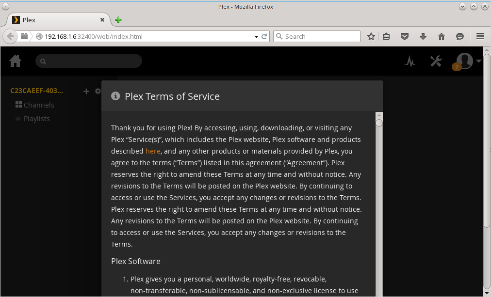

Click the "Agree" button to accept the application's license. You can now configure your channels and playlists. If you are new to Plex, refer to the
`Plex Getting Started Guide <https://support.plex.tv/hc/en-us/categories/200007268-Getting-Started>`_.

.. index:: AppCafe®
.. _Managing Jails from the CLI:

Managing Jails from the CLI
^^^^^^^^^^^^^^^^^^^^^^^^^^^

Beginning with PC-BSD® 10.2, :command:`iocage` has been added for jail management and this utility will replace the :command:`warden` utility in a future version of PC-BSD®. Note that
:command:`warden` is still available in this version of PC-BSD® to provide time for users to transition to using  :command:`iocage`. Documentation for using the command line version of
:command:`warden` can be found in
`this section of the 10.1.2 User Guide <http://download.pcbsd.org/iso/10.1-RELEASE/amd64/docs/html/controlpanel.html#using-the-command-line-version-of-warden>`_.

The :command:`iocage` command line utility is a Bourne shell script. This script can be manually run from the command line on a PC-BSD® server or by users who prefer to manage jails using
the command line. Advanced users can also refer to the command line version in their own jail management scripts.

If you type :command:`iocage` at the command line, you will receive a summary of its usage::

 usage:
  iocage activate ZPOOL
  iocage fetch [release=RELEASE | ftphost=ftp.hostname.org | ftpdir=/dir/ |
                ftpfiles="base.txz doc.txz lib32.txz src.txz"]
  iocage init-host IP zpool
  iocage create [-b|-c|-e] [release=RELEASE] [pkglist=file] [property=value]
  iocage clone UUID|TAG [UUID|TAG@snapshot] [property=value]
  iocage destroy [-f] UUID|TAG|ALL
  iocage reset UUID|TAG|ALL
  iocage list [-t|-r]
  iocage start UUID|TAG
  iocage stop UUID|TAG
  iocage restart UUID|TAG
  iocage rcboot
  iocage rcshutdown
  iocage console UUID|TAG
  iocage exec [-u username | -U username] UUID|TAG|ALL command [arg ...]
  iocage chroot UUID|TAG [command]
  iocage df
  iocage show property
  iocage get property|all UUID|TAG
  iocage set property=value UUID|TAG
  iocage cap UUID|TAG
  iocage limits [UUID|TAG]
  iocage uncap UUID|TAG
  iocage inuse [UUID|TAG]
  iocage snapshot UUID|TAG [UUID|TAG@snapshotname]
  iocage snaplist UUID|TAG
  iocage snapremove UUID|TAG@snapshotname|ALL
  iocage rollback UUID|TAG@snapshotname
  iocage promote UUID|TAG
  iocage runtime UUID|TAG
  iocage update UUID|TAG
  iocage upgrade UUID|TAG [release=RELEASE]
  iocage record start|stop UUID|TAG
  iocage package UUID|TAG
  iocage export UUID|TAG
  iocage import UUID [property=value]
  iocage defaults
  iocage version | --version
  iocage help

  Hint:  you can use shortened UUIDs or TAGs interchangeably!

  e.g. for  adae47cb-01a8-11e4-aa78-3c970ea3222f
       use  adae47cb or just adae

Before creating a jail for the first time, specify the version of FreeBSD to install. To see which versions are available::

 iocage fetch
  INFO: Creating tank/iocage
  INFO: Creating tank/iocage/jails
  INFO: Creating tank/iocage/.defaults
  INFO: Creating tank/iocage/download
  INFO: Creating tank/iocage/releases
 Supported releases are: 
   10.1-RELEASE
    9.3-RELEASE
 Please select a release [-]: 10.1-RELEASE
 base.txz                                      100% of   63 MB 1908 kBps 00m34s
 doc.txz                                       100% of 1395 kB 1301 kBps 00m01s
 lib32.txz                                     100% of   15 MB 1762 kBps 00m10s
 src.txz                                       100% of  109 MB 2116 kBps 00m53s
 Extracting: base.txz
 Extracting: doc.txz
 Extracting: lib32.txz
 Extracting: src.txz
 * Updating base jail..
 src component not installed, skipped
 Looking up update.FreeBSD.org mirrors... none found.
 Fetching public key from update.FreeBSD.org... done.
 Fetching metadata signature for 10.1-RELEASE from update.FreeBSD.org... done.
 Fetching metadata index... done.
 Fetching 2 metadata files... done.
 Inspecting system... done.
 Preparing to download files... done.
 Fetching 672 patches.....10....20....30....40....50....60....70....80....90....100....110....120....130....140....150....160....170....180....190....200....210....220....230....240....250....260....270....280....290....300....310....320....330....340....350....360....370....380....390....400....410....420....430....440....450....460....470....480....490....500....510....520....530....540....550....560....570....580....590....600....610....620....630....640....650....660....670. done.
 Applying patches... done.
 Fetching 988 files... done.
 <snip output>
 Installing updates... done.
 Creating basejail ZFS datasets... please wait.

In this example, FreeBSD 10.1 and 9.3 are available as jail templates and the user has specified to install the 10.1-RELEASE template. Once the template has been installed, you can create
a jail. In this example, the template to use, the jail's hostname, network interface, and IP address are specified::

 iocage create release=10.1-RELEASE tag=jail1 ip4_addr="em0|192.168.1.7/24"
 <snip output>
 
The output of this command will list the properties of the new jail. You can list those properties with this command::

 iocage get all jail1
 
To start the jail and check its status::

 iocage start jail1
 * Starting fdba67ce-40eb-11e5-81f2-0800277f9a55 (jail1)
  + Started (shared IP mode) OK
  + Starting services        OK

 iocage list
 JID   UUID                                  BOOT  STATE  TAG
 1     fdba67ce-40eb-11e5-81f2-0800277f9a55  off   up     jail1

To access the jail::

 iocage console jail1
 FreeBSD 10.2-RELEASE-p1 (GENERIC) #0: Mon Aug 10 15:54:50 UTC 2015

 Welcome to FreeBSD!

 Release Notes, Errata: https://www.FreeBSD.org/releases/
 Security Advisories:   https://www.FreeBSD.org/security/
 FreeBSD Handbook:      https://www.FreeBSD.org/handbook/
 FreeBSD FAQ:           https://www.FreeBSD.org/faq/
 Questions List: https://lists.FreeBSD.org/mailman/listinfo/freebsd-questions/
 FreeBSD Forums:        https://forums.FreeBSD.org/

 Documents installed with the system are in the /usr/local/share/doc/freebsd/
 directory, or can be installed later with:  pkg install en-freebsd-doc
 For other languages, replace "en" with a language code like de or fr.

 Show the version of FreeBSD installed:  freebsd-version ; uname -a
 Please include that output and any error messages when posting questions.
 Introduction to manual pages:  man man
 FreeBSD directory layout:      man hier

 Edit /etc/motd to change this login announcement.
 root@fdba67ce-40eb-11e5-81f2-0800277f9a55:~ # 

Once inside the jail, you can manage it just like any other FreeBSD system and install software using :command:`pkg`. To leave the jail, type :command:`exit`.

.. index:: pkg
.. _Using the CLI pkg Utilities:

Using the CLI pkg Utilities
===========================

PC-BSD® uses :command:`pkg` to manage packages from the command line.

The `FreeBSD Handbook <http://www.freebsd.org/doc/en_US.ISO8859-1/books/handbook/pkgng-intro.html>`_ provides an introduction to using :command:`pkg`. Section 5.4.1 is not
needed on a PC-BSD® or TrueOS® system as the operating system installation does this for you. The various :command:`pkg` commands have associated man pages.
Type :command:`man pkg` for an overview of general usage; the names of the associated man pages will be found towards the bottom of this man page. Once you
know the name of a command, you can also use the built-in help system to get more information about that command. For example, to learn more about
:command:`pkg install`, type :command:`pkg help install`.

.. index:: updates
.. _Update Manager:

Update Manager
==============

Update Manager provides a graphical interface for keeping the PC-BSD® operating system and its installed applications up-to-date. Update Manager will automatically track
updates to software installed using either the graphical or command line equivalents of :ref:`AppCafe®`.

This utility can be started from :ref:`Control Panel` or by typing :command:`pc-updategui`. It can also be accessed from its icon in the system tray, if you are logged into a desktop
that provides a system tray.

The status of the icon lets you determine at a glance if any of your installed applications are out-of-date, if a system update is available, or if a new
version of the operating system is available. The possible statuses are as follows:

.. image:: images/update1.png 

Your system is up-to-date.

.. image:: images/update2.png 

The system is currently checking for updates and patches.

Your operating system is out-of-date and system update(s) or patch(es) are available.

.. image:: images/update4.png 

Newer versions of installed applications are available.

.. image:: images/update5.png 

The system was unable to check for updates, meaning you should check your Internet connection.

The system is currently updating.

.. image:: images/update7.png 

The system needs to restart in order for the newly installed update to take effect.

If you right-click the icon, you will see the menu shown in Figure 7.3a. 

**Figure 7.3a: Right-click Menu for Update Manager** 

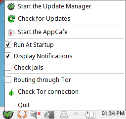

This menu contains the following options:

* **Start the Update Manager:** launches the Update Manager GUI which can be used as described in :ref:`Manual Updates (GUI Method)`.

* **Check for Updates:** by default, updates are checked every 24 hours or 20 minutes after booting the system. However, the system won't check for updates more than once per day
  should you reboot multiple times within a day. You can check for updates now by clicking this option.

* **Start the AppCafe:** launches AppCafe® which can be used to manage installed software as described in :ref:`AppCafe®`.

* **Run at Startup:** to disable the automatic update check after the system boots, uncheck this box.

* **Display Notifications:** to disable the pop-up message over the icon when an update becomes available, uncheck this box.

* **Check Jails:** to also be notified when updates are available to running jails, check this box.

* **Routing through Tor:** check this box to start browsing the Internet anonymously as described in :ref:`Tor Mode`.

* **Check Tor connection:** click this to determine if the system is currently routing all Internet traffic through the Tor network.

* **Quit:** to remove Update Manager from the system tray, click this entry. You can put the icon back into the tray by typing :command:`pc-systemupdatertray &`.

.. index:: updates
.. _How PC-BSD® Updating Works:

How PC-BSD® Updating Works
---------------------------

The PC-BSD® update mechanism provides several safeguards to ensure that updating the operating system or its software is a low-risk operation. Beginning with
version 10.1.1, the following steps occur automatically during an update: 

* The update automatically creates a copy of the current operating system, known as a snapshot or boot environment (BE), and mounts that snapshot in the
  background. All of the updates then occur in the snapshot. This means that you can safely continue to use your system while it is updating as no changes are
  being made to the operating system or any of the applications currently in use. Instead, all changes are being made to the mounted copy.

.. note:: if the system is getting low on disk space and there is not enough space to create a new BE, the update will fail with a message indicating that there is
   not enough space to perform the update.

* While the update is occurring, and until you reboot after the update, you won't be able to use AppCafe® to manage software. This is a safety measure to prevent
  package conflicts. Also, the system shutdown and restart buttons will be greyed out until the update is complete and the system is ready for reboot. Should a power
  failure occur in the middle of an update, the system will reboot into the current boot environment, returning the system to the point before the upgrade started.
  Simply restart the update to continue the update process.

* Once the update is complete, the new boot environment, or updated snapshot, is added as the first entry in the boot menu and activated so that the system
  will boot into it, unless you pause the boot menu and specify otherwise. A pop-up message, shown in Figure 7.3b, will indicate that a reboot is required.
  You can either finish what you are doing and reboot now into the upgraded snapshot, or ask the system to remind you again at a later time. To configure the
  time of the next warning, click the "Next Reminder" drop-down menu where you can select 1, 5, 12, or 24 hours, 30 minutes, or never (for this login
  session). Note that the system will not apply any more updates or allow you to start another manual update or install additional software using AppCafe®
  until you reboot.

* As the update is running, a log is written to :file:`/var/log/pc-updatemanager.log` and this log is displayed in the "View Log" tab of the graphical Update
  Manager utility, shown in Figure 7.3c. This way you can see which software is being updated and if there are any updating errors. The next time an update occurs,
  the previous log is written to :file:`/var/log/pc-updatemanager.log.prev`, so that you also have a copy of the previous update's log.

* You no longer need to initiate updates manually. PC-BSD® now uses an automated updater that automatically checks for updates, no more than once per day, 20
  minutes after a reboot and then every 24 hours. You can configure what gets updated using the "Configure Automatic Updates" tab of Update Manager, shown in
  Figure 7.3d. Choices are "Security & Packages" (all updates), "Security" (only security patches and operating system updates), "Packages" (only installed
  software), or "Nothing" (disables automatic updating).

**Figure 7.3b: Managing the Reboot After Update**

.. image:: images/update9.png

**Figure 7.3c: Viewing the Update Log**

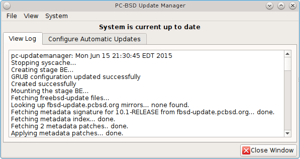

**Figure 7.3d: Configuring What to Update**

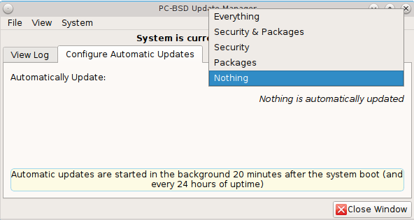

The "View" menu of Update Manager provides the following information:

* **Vulnerabilities:** click this entry to determine if any of the installed software has a known, unpatched vulnerability. In the example shown in Figure 7.3e,
  two installed packages have known vulnerabilities. If you highlight an entry and click the "More info..." button, the default web browser will open to a page that
  provides more details about the vulnerability.

* **Base updates history:** the "Version" field in :ref:`About` usually includes a patch number which indicates the level to which the operating system has been patched
  against known vulnerabilities. If you click this entry, it will provide an overview of which vulnerabilities were addressed at each patch level. In the example shown
  in Figure 7.3f, the system is running "10.1-RELEASE-p20, or patch level 20. Most patch levels have an associated Security Advisory (SA). More information about each
  advisory is available from the `FreeBSD Security Advisories page <https://www.freebsd.org/security/advisories.html>`_.

**Figure 7.3e: Viewing Installed Software Vulnerability Information**

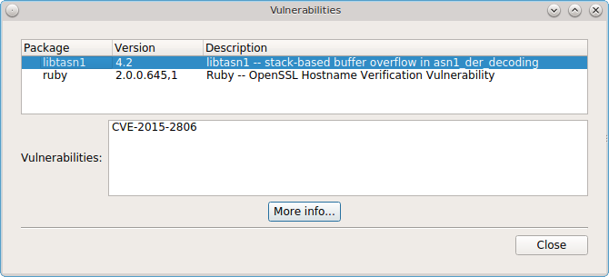

**Figure 7.3f: Viewing Operating System Patches**

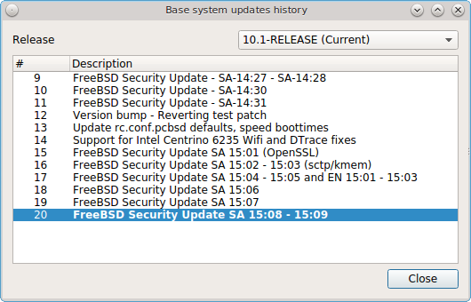

The "System" menu of Update Manager provides one option:

* **Branches:** users who wish to test upcoming versions can switch software branches and update to that software branch. In the example shown in Figure 7.3g, this
  system is currently running the 10.1* branch and the upcoming 11.0 branch is available for selection.

**Figure 7.3g: Switching Branches**

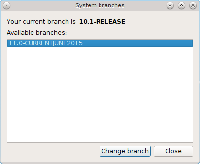

Updates can still be initiated manually using either a GUI or a command-line application. The rest of this section demonstrates how to manually update using
either the GUI or the command-line method.

.. index:: updates
.. _Manual Updates (GUI Method):

Manual Updates (GUI Method)
---------------------------

Beginning in version 10.1.1, the automatic updater will automatically keep your system up-to-date. You will know that an update has completed when the pop-up
menu, shown in Figure 7.3b, indicates that a reboot is needed to complete the update process. The automatic updater will only update what it has been
configured to update. If you would like to double-check or change what gets updated, start Update Manager, enter your password, and use the drop-down menu in
the "Configure Automatic Updates" screen shown in Figure 7.3d. 

Due to its schedule, the automatic updater will never check for new updates more than once in a 24 hour period. To manually check for updates, right-click the
Update Manager in system tray and click "Check for Updates". Alternatively, start Update Manager. If any updates are available, an "Updates Available" tab
will appear, as seen in the example in Figure 7.3h. If no updates are available, of if the system is currently updating, this tab will not appear.

**Figure 7.3h: Updates are Available**

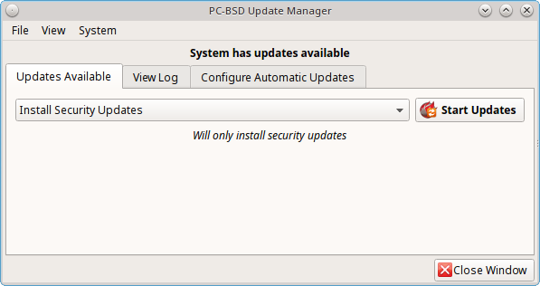

In this example, a security update is available. Click the "Start Updates" button to manually start the update. When prompted, reboot so that the system can
boot into the newly patched operating system.

When package updates are available a "View Package Updates" box can be clicked to see which packages will be upgraded.

.. note:: how often package updates are available depends upon the "Repository Settings" set in :menuselection:`AppCafe® --> Configure`. The default setting
   of "Production" will only provide package updates every 3 months whereas a setting of "Edge" will provide package updates as soon as a new version is
   available. If you need application stability, stay on "Production". If you can handle some application breakage in favor of having the latest software,
   change to "Edge". Also, if you select "Security" or "Nothing" in the "Configure Automatic Updates" tab of Update Manager, packages will only get updated
   with the next software release which happens every 3 months.

.. warning:: updates will update **all** installed software. If you have placed a lock on a package using :command:`pkg` or an older version of
   AppCafe®, Update Manager will fail and will generate a message in the log indicating that the failure is due to a locked package. If you prefer to lock certain applications
   against being updated, select "Security" or "Nothing" in the "Configure Automatic Updates" tab of Update Manager and manually update software as needed using
   :command:`pkg`.

.. index:: updates
.. _Manual Updates (CLI Method):

Manual Updates (CLI Method)
---------------------------

TrueOS® users, or those who prefer to use a command-line utility, can use :command:`pc-updatemanager` to manually apply updates. If you type
:command:`pc-updatemanager`, it will show its available options::

 pc-updatemanager
 /usr/local/bin/pc-updatemanager - Usage
 ----
 branches             - List available system branches
 chbranch <tag>       - Change to new system branch
 check                - Check for system updates
 showeol	      - Show end of life (support) date for this release
 install <tag>,<tag2> - Install system updates
 pkgcheck             - Check for updates to packages
 pkgupdate [-f]       - Install packages updates 
 fbsdupdate           - Install freebsd-update patches
 fbsdupdatepkgs       - Install freebsd-update patches and any package updates
 syncconf             - Update PC-BSD pkgng configuration 
 confcheck            - Check PC-BSD pkgng configuration
 cron                 - Perform delayed check for system and pkgng updates.

To determine if any system updates are available, type the following command::

 sudo pc-updatemanager check
 Checking for FreeBSD updates... 
 The following updates are available: 
 ------------------------------------
 NAME: FreeBSD security updates 
 TYPE: SECURITYUPDATE 

 To install: "pc-updatemanager fbsdupdate" 
 
 End of Life Notice
 ------------------------------------
 This version of PC-BSD / TrueOS has an EOL date of:
 Sat Dec 31 18:59:59 EST 2016
 ------------------------------------

If any updates are available, follow the instructions to install the update::

 sudo pc-updatemanager fbsdupdate
 Stopping syscache...
 Creating stage BE...
 Pruning old boot-environments...
 Mounting the stage BE...
 Mounted successfully on '/.updateStage'
 Fetching freebsd-update files...
 Installing freebsd-update files...
 Unmounting stage BE...
 Unmounted successfully
 GRUB configuration updated successfully
 Renamed successfully
 GRUB configuration updated successfully
 Renamed successfully
 GRUB configuration updated successfully
 Activated successfully
 Generating grub configuration file ...
 Found theme: /boot/grub/themes/pcbsd/theme.txt
 done
 Installing GRUB to ada0
 Starting syscache...
 Your update is finished! Please reboot to load into the new boot-environment

If no updates are available, the **check** command will indicate "Your system is up to date!". 

To determine if package updates are available, use this command::

 sudo pc-updatemanager pkgcheck
 Updating repository catalogue
 pcbsd-major repository is up-to-date.
 All repositories are up-to-date.
 Updating pcbsd-major repository catalogue...
 pcbsd-major repository is up-to-date.
 All repositories are up-to-date.
 Checking for upgrades (1471 candidates)... done
 Processing candidates (1471 candidates)... done
 The following 8 package(s) will be affected (of 0 checked):
     
  Installed packages to be UPGRADED:
          pcbsd-utils-qt5: 1430339597 -> 1430509574
          pcbsd-utils: 1430412291 -> 1430489128
          pcbsd-syscache: 1430342138 -> 1430496237
          pcbsd-i18n-qt5: 1430413188 -> 1430610765
          lumina: 0.8.4_1 -> 0.8.4_1,1
          life-preserver: 1430338357 -> 1430521060
          git: 2.3.6 -> 2.3.7
          curl: 7.42.0 -> 7.42.1
     
  The process will require 923 KiB more space.
  112 MiB to be downloaded.
  The following updates are available:
  ------------------------------------
  NAME: System package updates
  TYPE: PKGUPDATE
     
  To install: "pc-updatemanager pkgupdate"

In this example, newer versions are available. If no updates were available, the output would have instead said "All packages are up to date!". 

If updates are available, you can install them with this command::

 sudo pc-updatemanager pkgupdate
 Stopping syscache...
 Updating the package repo database...
 Cleaning old pkg upgrade cache...
 Verifying / fetching packages for ports-mgmt/pkg - pkg-1.5.1.txz
 The following packages will be fetched:
     
  New packages to be FETCHED:
         pkg-1.5.1 (100.00% of 2 MiB: 2 MiB)
     
  The process will require 2 MiB more space.
  2 MiB to be downloaded.
  Fetching pkg-1.5.1.txz... done
  Verifying / fetching packages for misc/pcbsd-base - pcbsd-base-1425064224.txz
  The following packages will be fetched:
     
  New packages to be FETCHED:
  <SNIP>
  The process will require 733 MiB more space.
  733 MiB to be downloaded.
  <SNIP>
  Creating stage BE...
  Pruning old boot-environments...
  Mounting the stage BE...
  Mounted successfully on '/.updateStage'
  Preparing the new boot-environment... (This may take a while)
  <SNIP>
  Deinstallation has been requested for the following 1590 packages (of 0 packages in the universe):
  <SNIP>
  The operation will free 11 GiB.
  [1/1590] Deinstalling pcbsd-meta-kde-1429798531...
  <SNIP>
  Extracting ports overlay...
  Pruning: /usr/local/share/applications/cups.desktop
  Pruning: /usr/local/share/kde4/services/kdm.desktop
  Pruning: /usr/local/share/applications/kde4/kuser.desktop
  Pruning: /usr/local/share/xsessions/[0-9a-zA-Z]*.desktop
  Extracting ports overlay data...DONE
  Updating pkgng config...
  Unmounting stage BE...
  Unmounted successfully
  GRUB configuration updated successfully
  Renamed successfully
  GRUB configuration updated successfully
  Renamed successfully
  GRUB configuration updated successfully
  Activated successfully
  Generating grub configuration file ...
  Found theme: /boot/grub/themes/pcbsd/theme.txt
  done
  Installing GRUB to ada0
  Starting syscache...
  Your update is finished! Please reboot to load into the new boot-environment

While the package output has been snipped from this example due to the amount of packages to be upgraded, the update process will download the latest versions
of the packages which need updating, displaying the download progress for each file. Once the downloads are complete, it will create a new boot environment and
display the installation process for each file within the boot environment. The last step of the update process is to extract the desktop (or server) overlay and
upgrade GRUB and then to return the prompt. Once the update is complete, reboot to boot into the updated version of the system.

.. index:: updates
.. _Upgrading from 9.x to 10.x:

Upgrading from 9.x to 10.x
--------------------------

PC-BSD® 10.x has switched to 64-bit and ZFS-only. This means that you can **not** upgrade a system that is either 32-bit or formatted with UFS. If the hardware supports
64-bit, you will need to backup your important data to another system or external drive and then perform a new installation. The new installation will perform
a format of the selected disk(s) with ZFS.

The boot loader and default ZFS layout has changed to support :ref:`Boot Manager` and ZFS snapshot management with :ref:`Life Preserver`. For this reason, 9.x
users should backup their important data to another system or external drive and then perform a new installation which will create the required ZFS layout.

.. index:: updates
.. _Upgrading from 10.x to |version|:

Upgrading from 10.x to |version|
--------------------------------

Upgrading from any 10.x version to |version| is the same as applying any package update. This means that the update to |version| will either appear in Update
Manager as a package update, for both "Edge" and "Production" users, or in the listing of :command:`pc-updatemanager pkgcheck`.

.. note:: a fresh install, rather than an update, is only required if you wish to take advantage of any of the following features: UEFI boot (on a current non-UEFI
   installation), full disk encryption, or the
   `improved encryption key generation provided by GELIv7 <https://github.com/freebsd/freebsd/commit/38de8ef1dd0e468ff1e3ec1c431f465e270beba3>`_. This means
   that you will have to backup your data to an external drive or another system, perform the new install, then restore your data from the backup.

.. index:: software
.. _Create a Local Package Mirror:

Create a Local Package Mirror
=============================

The official PC-BSD® package repository is hosted as a `ScaleEngine <http://www.scaleengine.com/>`_ CDN (Content Delivery Network). It is possible to
:command:`rsync` a copy of the package repository, which means you can have a locally hosted, complete package repository available for your own clients.

To create a local package mirror, first setup a directory which is served over HTTP. The web server can be a public URL on the Internet or a
private web server, as long as it is accessible to your target audience. Ensure that this directory is browsable by a web browser from a client
system **before** moving on to the next step.

Once you have the HTTP directory ready for serving, use the following commands to sync with the official package repository::

 rsync -van --delete-delay --delay-updates pcbsd-rsync.scaleengine.net::pkg /my/path/to/httpd/directory/pkg

The complete package repository may be well over 200GB in size. If you do not need the entire repository, you can instead sync the specific version of PC-BSD®
packages to pull as shown in these examples::

 rsync -van --delete-delay --delay-updates pcbsd-rsync.scaleengine.net::pkg/10.0-RELEASE /my/path/to/httpd/directory/pkg

 rsync -van --delete-delay --delay-updates pcbsd-rsync.scaleengine.net::pkg/11.0-CURRENTMAR2015 /my/path/to/httpd/directory/pkg

Note that for major RELEASES, you will pull the *.0* version for the entire branch. In other words, both the 10.1 and 10.2 minor releases use the
*10.0-RELEASE* package directory.

Once the repository is downloaded, configure each client by editing their :file:`/usr/local/etc/pcbsd.conf` file with the following. Replace *<myhost>*
with the URL to the local repository::

 PACKAGE_SET: CUSTOM
 PACKAGE_URL: http://<myhost>/pkg/%VERSION%/edge/%ARCH%

After editing each client's file, run :command:`pc-updatemanager syncconf` on the client to apply the
changes. 

Alternately, on each client, configure :ref:`Appcafe®` to use the custom repository. Go to :menuselection:`Configure --> Repository Settings`. Click "Custom" in the screen
shown in Figure 7.4a, then the "+" button. Input the URL to the repository and click "OK". 

**Figure 7.4a: Add the Custom Repository to AppCafe®**

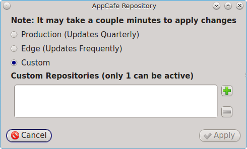

It will take a few minutes for AppCafe® to read in the :file:`INDEX` for the custom repository.

Configured clients will now use your local mirror whenever they use :command:`pkg` or AppCafe®.