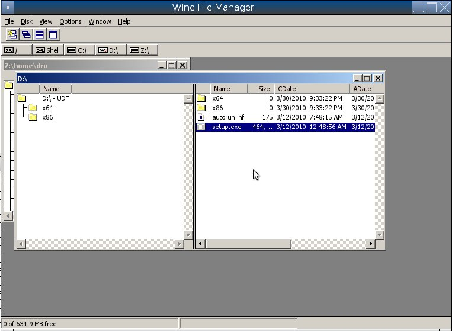
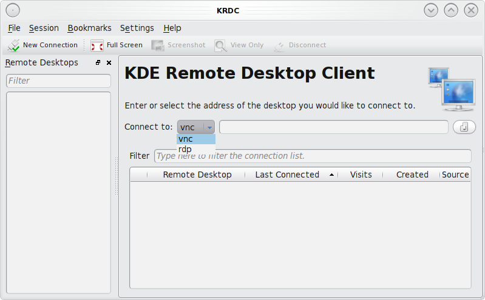
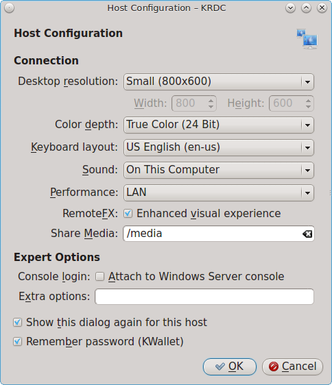
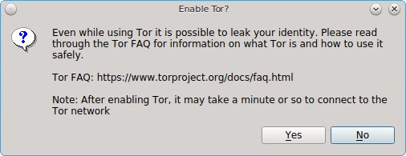
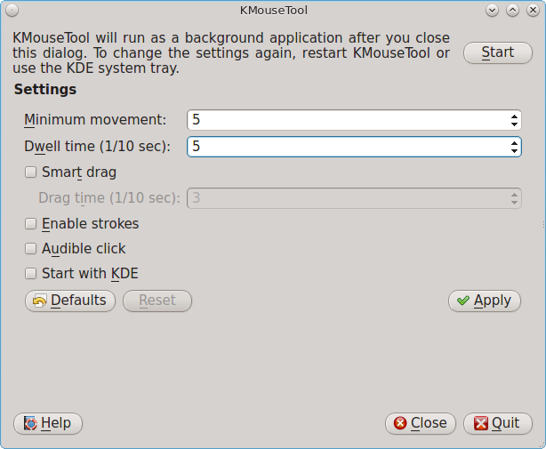

.. _Using PC-BSD®:

Using PC-BSD®
**************

This section discusses how to perform common tasks that were not discussed in the :ref:`Control Panel` section.

.. index:: configuration
.. _Java and Flash:

Java and Flash
==============

The IcedTea-Web PBI provides an open source Java browser plugin which automatically works with the FireFox, Chromium, and Opera web browsers without any
additional configuration. To install this PBI, search for "icedtea" within :ref:`AppCafe®`. 

PC-BSD® installs and configures the Adobe Flash player (version 11) plugin for you. This means that flash should "just work" when browsing the web. You will
find several web browsers in the Web Browsers category of :ref:`AppCafe®`, including Firefox, Opera, and Chromium.

If Adobe Flash does not seem to be working, running the following command as your regular user account should fix the problem::

 flashpluginctl on

The Adobe Flash Player preferences icon in :ref:`Control Panel` can be used to modify how websites interact with your browser using Adobe Flash. Many of the
same configurations can be done via right-click within an active flash object in a web browser.

To access the utility shown in Figure 9.1a, use :menuselection:`Control Panel --> Adobe Flash Player preferences` or type :command:`flash-player-properties`.

**Figure 9.1a: Flash Player Configuration Utility** 

.. image:: images/flash.png

The options available in each tab and when to use them are described at the Adobe website: 

* `Storage <http://help.adobe.com/en_US/FlashPlayer/LSM/WS6aa5ec234ff3f285139dc56112e3786b68c-7fff.html>`_ describes private browsing support and the privacy issues associated with
  local storage of flash information.

* `Camera and Mic <http://help.adobe.com/en_US/FlashPlayer/LSM/WS6aa5ec234ff3f285139dc56112e3786b68c-7ff8.html>`_ controls how websites can use your computer's camera and microphone.

* `Playback <http://help.adobe.com/en_US/FlashPlayer/LSM/WS6aa5ec234ff3f285139dc56112e3786b68c-7ff5.html>`_ describes how to configure peer-assisted networking to improve bandwidth.

* `Advanced <http://help.adobe.com/en_US/FlashPlayer/LSM/WS6aa5ec234ff3f285139dc56112e3786b68c-7ff0.html>`_ controls how Flash Player handles browsing data, updates, trusted locations,
  and protected content.

.. index:: configuration
.. _Installing Custom Fonts:

Installing Custom Fonts 
=======================

PC-BSD® installs Microsoft TrueType fonts which include the Times New Roman, Courier New, Georgia, Trebuchet MS, Comic Sans MS Arial, Arial Black, Verdana,
Andale Mono, and Impact fonts.

If you have a collection of fonts that you have downloaded or purchased, you can configure your PC-BSD® system to also use these fonts. Which utility you use
depends upon which window manager you have logged into.

.. note:: many fonts are available from :ref:`AppCafe®`. Check the "Search all available PBI and packages" box in the "App Search" tab to search for fonts. Any font installed using
   AppCafe® should not require any additional configuration to "just work". 

To install custom fonts within KDE, go to :menuselection:`System Settings --> Font Management`. In Figure 9.2a, "All Fonts" is currently selected under the
"Group" column, showing all of the fonts installed on this system.

**Figure 9.2a: Using KDE's Font Installer to Install Custom Fonts** 

.. image:: images/font1.png

To install your fonts, highlight "Personal Fonts" under the "Group" column, then click the "+Add" button. This will allow you to browse to the font you wish
to add. You can add multiple fonts in the same directory by holding down the :kbd:`Ctrl` key while making your selection. Click the "Open" button, which will
install the font for you. When it is finished, a pop-up message will indicate that you will need to restart any open applications for the font change to take
affect. Your newly installed font(s) should now show up in the "Personal Fonts" section in the "Group" column and be available to the applications you use.

To install custom fonts within GNOME, go to :menuselection:`Activities --> Files`. Navigate to the location of the font that you would like to install and
either double-click the font name or select "Font Viewer" from the icon's right-click menu. This will open the font in Font Viewer, allowing you to view it.
If you like the font, click the "Install Font" button to make it available to your applications. In the example shown in Figure 9.2b, the user is installing
the BlackFlag font.

**Figure 9.2b: Using Files to Install a Custom Font** 

.. image:: images/font2.png

To install custom fonts within XFCE, use :menuselection:`Applications --> System --> Thunar File Manager`. Once you browse to the location of the font and
double- or right-click it, you will see the same Font Viewer used by GNOME.

If you prefer to install fonts from the command line, become the superuser and copy the downloaded font to the :file:`/usr/local/share/fonts/` directory.
Then, refresh the fonts cache::

 fc-cache -f -v /usr/local/share/fonts/name_of_font

.. index:: multimedia
.. _Multimedia:

Multimedia
==========

PC-BSD® has been pre-configured to support most multimedia formats and makes it easy to install most open source media applications using :ref:`AppCafe®`.
PC-BSD® supports both `PulseAudio <http://www.freedesktop.org/wiki/Software/PulseAudio/>`_ and `OSS <http://opensound.com/>`_ so that applications using
either sound server should work.

If you install your web browser using AppCafe®, you should be able to play most media formats, including YouTube videos, Internet radio, and many trailer and
movie sites.

If people are blue in YouTube videos, this is due to a known issue in flash which Adobe hasn't fixed for open source players. To resolve this issue,
right-click an area in the video, select "Settings", then uncheck the box "Enable hardware acceleration". Alternately, use the Minitube PBI to watch YouTube.

.. note:: if you happen to come across a file that you can not play in a web browser or media player, it is probably because it is in a proprietary format
   that requires a licensing fee or restricts distribution of the codec that is required to play that media format.

AppCafe® contains several dozen applications for playing and editing multimedia. It includes these popular applications (click the links to view screenshots): 

* `aTunes <http://www.atunes.org/?page_id=5>`_: full-featured audio player and manager that can play mp3, ogg, wma, wav, flac, mp4 and radio streaming,
  allowing users to easily edit tags, organize music and rip audio CDs.

* `Audacity <http://sourceforge.net/projects/audacity/?lang=en>`_: multilingual audio editor and recorder.

* `DeaDBeeF <http://deadbeef.sourceforge.net/screenshots.html>`_: music player that supports most audio formats.

* `Decibel <http://decibel.silent-blade.org/index.php?n=Main.Screenshots>`_: audio player built around a highly modular structure that lets the user disable
  completely the features he does not need. Able to play CDs directly.

* `gtkpod <http://www.gtkpod.org/index.php?title=Screenshots>`_: graphical user interface for the Apple iPod.

* `Miro <http://www.getmiro.com/download/screenshots/>`_: HD video player that can play almost any video file and offers over 6,000 free Internet TV shows and
  video podcasts.

* `SMPlayer <http://smplayer.sourceforge.net/>`_: universal media player that can handle any media format and play audio CDs, DVDs, (S)VCDs, TV/radio cards,
  YouTube™ and SHOUTcast™ streams. This is the default player used by :ref:`Mount Tray`.

.. index:: multimedia
.. _Kodi:

Kodi
----

`Kodi, formerly known as XBMC, <http://kodi.tv/>`_ is a GPL-licensed software media player and entertainment hub for digital media. It can play most audio and video
formats. It can play CDs and DVDs from a disk or image file and even files inside ZIP and RAR archives. It can scan all of your media and automatically create a
personalized library with album covers, descriptions, and fan art. 

During the installation of PC-BSD®, the installer provided an option to install Kodi. If you wish to install Kodi afterwards, use AppCafe®. Click the box "Search all
available PBI and packages" and search for "pcbsd-meta-kodi". Once installed, an entry for "Media Center" should be added to the "Multimedia" section of the application menu
of your desktop. You can also start Kodi by typing :command:`kodi` from a command prompt. 

If you have never used Kodi before, take some time to skim through the `Kodi Wiki Manual <http://kodi.wiki/>`_.
The `Turn PC-BSD into a home theater forum post <https://forums.pcbsd.org/thread-19799.html>`_ contains a quick how-to for configuring Kodi.

.. index:: multimedia
.. _PlexHome Theater:

PlexHome Theater
----------------

`Plex Home Theater <https://plex.tv/>`_ is a centralized media playback system. The central Plex Media Server streams media to many Plex player Apps which are used to view
your media library and watch shows. 

During the installation of PC-BSD®, the installer provided an option to install PlexHome Theater. If you wish to install it afterwards, use AppCafe®. Click the box "Search all
available PBI and packages" and search for "plexhometheater". Once installed, an entry should be added to the "Multimedia" section of the application menu
of your desktop. You can also start this application by typing :command:`plexhometheater` from a command prompt. 

Once installed, an entry for "Plex Home Theater" will also be added to the login manager so that you can login directly to the home theater instead of a desktop.

The first time you run or log into Plex Home Theater, a wizard will check your audio settings and sign into your Plex account. If you do not have a Plex account yet,
create one at `plex.tv <https://plex.tv/>`_. The wizard will give you a PIN code and an URL to enter the code. Once you enter the PIN, the wizard will connect and sign you in.
You can now search for and watch media. To exit Plex, click the "<" then "Quit".

.. index:: files
.. _Files and File Sharing:

Files and File Sharing
======================

Depending upon which :ref:`Desktops` you have installed, different graphical file manager utilities may already be installed for you. You do not need to be
logged into a specific window manager to use an installed file manager. For example, if KDE is installed, you can run its file manager from any window manager
by typing :command:`dolphin`. KDE, GNOME, LXDE, and XFCE install their own file managers while most of the other desktops assume that you will install your
favorite file manager. Table 9.4a summarizes the available file managers and indicates which desktop they are installed with. Some file managers can be
installed independent of a desktop using :ref:`AppCafe®`  to install the PBI. Once a file manager is installed, type its name if you wish to run it from
another desktop.

**Table 9.4a: Available File Managers**

+---------------+--------------+--------------------------------------------------------------------+
| File Manager  | Desktop/PBI  | Screenshots                                                        |
+===============+==============+====================================================================+
| dolphin       | KDE          | `<https://userbase.kde.org/Dolphin>`_                              |
+---------------+--------------+--------------------------------------------------------------------+
| emelfm2       | PBI          | `<http://emelfm2.net/wiki/ScreenShots>`_                           |
+---------------+--------------+--------------------------------------------------------------------+
| caja          | MATE         | `<http://mate-desktop.org/gallery/1.6/>`_                          |
+---------------+--------------+--------------------------------------------------------------------+
| mucommander   | PBI          | `<http://www.mucommander.com/screenshots.php>`_                    |
+---------------+--------------+--------------------------------------------------------------------+
| nautilus      | GNOME, PBI   | `<https://projects.gnome.org/nautilus/screenshots.html>`_          |
+---------------+--------------+--------------------------------------------------------------------+
| pcmanfm       | LXDE, PBI    | `<http://lxde.org/easy_fast_file_management_pcmanfm>`_             |
+---------------+--------------+--------------------------------------------------------------------+
| thunar        | XFCE, PBI    | `<http://docs.xfce.org/xfce/thunar/start>`_                        |
+---------------+--------------+--------------------------------------------------------------------+
| xfe           | PBI          | `<http://roland65.free.fr/xfe/index.php?page=screenshots>`_        |
+---------------+--------------+--------------------------------------------------------------------+

When working with files on your PC-BSD® system, save your own files to your home directory. Since most of the files outside of your home directory are used
by the operating system and applications, you should not delete or modify any files outside of your home directory, unless you know what you are doing.

Table 9.4b summarizes the directory structure found on a PC-BSD® system. :command:`man hier` explains this directory structure in more detail.

**Table 9.4b: PC-BSD Directory Structure**

+--------------------------+---------------------------------------------------------------------------------------------------------------------------------+
| Directory                | Contents                                                                                                                        |
+==========================+=================================================================================================================================+
| /                        | pronounced as "root" and represents the beginning of the directory structure                                                    |
+--------------------------+---------------------------------------------------------------------------------------------------------------------------------+
| /bin/                    | applications (binaries) that were installed with the operating system                                                           |
+--------------------------+---------------------------------------------------------------------------------------------------------------------------------+
| /boot/                   | stores the startup code, including kernel modules (such as hardware drivers)                                                    |
+--------------------------+---------------------------------------------------------------------------------------------------------------------------------+
| /compat/linux/           | Linux software compatibility files                                                                                              |
+--------------------------+---------------------------------------------------------------------------------------------------------------------------------+
| /dev/                    | files which are used by the operating system to access devices                                                                  |
+--------------------------+---------------------------------------------------------------------------------------------------------------------------------+
| /etc/                    | operating system configuration files                                                                                            |
+--------------------------+---------------------------------------------------------------------------------------------------------------------------------+
| /etc/X11/                | the :file:`xorg.conf` configuration file                                                                                        |
+--------------------------+---------------------------------------------------------------------------------------------------------------------------------+
| /etc/rc.d/               | operating system startup scripts                                                                                                |
+--------------------------+---------------------------------------------------------------------------------------------------------------------------------+
| /home/                   | subdirectories for each user account; each user should store their files in their own home directory                            |
+--------------------------+---------------------------------------------------------------------------------------------------------------------------------+
| /lib/                    | operating system libraries needed for applications                                                                              |
+--------------------------+---------------------------------------------------------------------------------------------------------------------------------+
| /libexec/                | operating system libraries and binaries                                                                                         |
+--------------------------+---------------------------------------------------------------------------------------------------------------------------------+
| /media/                  | mount point for storage media such as DVDs and USB drives                                                                       |
+--------------------------+---------------------------------------------------------------------------------------------------------------------------------+
| /mnt/                    | another mount point                                                                                                             |
+--------------------------+---------------------------------------------------------------------------------------------------------------------------------+
| /proc/                   | the proc filesystem required by some Linux applications                                                                         |
+--------------------------+---------------------------------------------------------------------------------------------------------------------------------+
| /rescue/                 | necessary programs for emergency recovery                                                                                       |
+--------------------------+---------------------------------------------------------------------------------------------------------------------------------+
| /root/                   | administrative account's home directory                                                                                         |
+--------------------------+---------------------------------------------------------------------------------------------------------------------------------+
| /sbin/                   | operating system applications; typically only the superuser can run these applications                                          |
+--------------------------+---------------------------------------------------------------------------------------------------------------------------------+
| /tmp/                    | temporary file storage; files stored here may disappear when the system reboots                                                 |
+--------------------------+---------------------------------------------------------------------------------------------------------------------------------+
| /usr/bin/                | contains most of the command line programs available to users                                                                   |
+--------------------------+---------------------------------------------------------------------------------------------------------------------------------+
| /usr/local/              | contains the binaries, libraries, startup scripts, documentation, and configuration files used by applications installed from   |
|                          | ports or packages                                                                                                               |
+--------------------------+---------------------------------------------------------------------------------------------------------------------------------+
| /usr/local/share/fonts/  | system wide fonts for graphical applications                                                                                    |
+--------------------------+---------------------------------------------------------------------------------------------------------------------------------+
| /usr/local/share/icons/  | system wide icons                                                                                                               |
+--------------------------+---------------------------------------------------------------------------------------------------------------------------------+
| /usr/ports/              | location of system ports tree (if installed)                                                                                    |
+--------------------------+---------------------------------------------------------------------------------------------------------------------------------+
| /usr/share/              | system documentation and man pages                                                                                              |
+--------------------------+---------------------------------------------------------------------------------------------------------------------------------+
| /usr/sbin/               | command line programs for the superuser                                                                                         |
+--------------------------+---------------------------------------------------------------------------------------------------------------------------------+
| /usr/src/                | location of system source code (if installed)                                                                                   |
+--------------------------+---------------------------------------------------------------------------------------------------------------------------------+
| /var/                    | files that change (vary), such as log files and print jobs                                                                      |
+--------------------------+---------------------------------------------------------------------------------------------------------------------------------+

PC-BSD® provides built-in support for accessing Windows shares, meaning you only have to decide which utility you prefer to access existing Windows shares on
your network. If a desktop is installed, you do not have to be logged into that desktop in order to use that utility.

Table 9.4c summarizes the available utilities (type a utility's name to launch it in any desktop), which desktop it installs with and whether or not a
separate PBI is available, and a short description of how to access the available shares using that utility.

**Table 9.4c: Utilities that Support Windows Shares**

+--------------+------------------+--------------------------------------------------------------------------------------------------------------------------+
| **Utility**  | **Desktop/PBI**  | **How to Access Existing Shares**                                                                                        |
+==============+==================+==========================================================================================================================+
| dolphin      | KDE              | in the left frame, click on :menuselection:`Network --> Samba Shares`, then the Workgroup name; if the network requires  |
|              |                  | a username and password to browse for shares, set this in :menuselection:`Control Panel --> System Settings --> Sharing` |
|              |                  | while in KDE or type :command:`systemsettings` and click "Sharing" while in another desktop                              |
+--------------+------------------+--------------------------------------------------------------------------------------------------------------------------+
| konqueror    | KDE              | in the location bar, type *smb:/*                                                                                        |
+--------------+------------------+--------------------------------------------------------------------------------------------------------------------------+
| mucommander  | PBI              | click on :menuselection:`Go --> Connect to server --> SMB`; input the NETBIOS name of server, name of share, name of     |
|              |                  | domain (or workgroup), and the share's username and password                                                             |
+--------------+------------------+--------------------------------------------------------------------------------------------------------------------------+
| nautilus     | GNOME, PBI       | click on :menuselection:`Browse Network --> Windows Network`                                                             |
+--------------+------------------+--------------------------------------------------------------------------------------------------------------------------+
| thunar       | XFCE, PBI        | in the left frame, click on :menuselection:`Network --> Windows Network`                                                 |
+--------------+------------------+--------------------------------------------------------------------------------------------------------------------------+

.. index:: windows
.. _Windows Emulation:

Windows Emulation
=================

`Wine <https://www.winehq.org/>`_ is an application that allows you to create a Windows environment for installing Windows software. This can be useful if your
favorite Windows game or productivity application has not been ported to Linux or BSD.

Wine is not guaranteed to work with every Windows application. If you are unsure if the application that you require is supported, search for it in the
"Browse Apps" section of the `Wine application database <https://appdb.winehq.org/>`_. The  `Wine wiki <http://wiki.winehq.org/>`_ contains many resources to
get you started and to refer to if you encounter problems with your Windows application.

Wine can be installed during installation or from :ref:`AppCafe®`. Once installed, it can be started by clicking the entry for "Wine Configuration" from the
desktop's application menu or by typing :command:`winecfg` at the command line. The initial Wine configuration menu shown in Figure 9.5a.

**Figure 9.5a: Wine Configuration Menu** 

.. image:: images/wine1.jpg

Click the "Add application" button to browse to the application's installer file. By default, the contents of your hard drive will be listed under "drive_c".
If the installer is on a CD/DVD, use the drop-down menu to browse to your :menuselection:`home directory --> *.wine --> dosdevices` folder. The contents of
the CD/DVD should be listed under *d:*. If they are not, the most likely reason is that your CD/DVD was not automatically mounted by the desktop. To mount the
media, type the following as the superuser::

 mount -t cd9660 /dev/cd0 /cdrom

You should hear the media spin and be able to select the installer file. Once selected, press "Apply" then "OK" to exit the configuration utility.

To install the application, click the Winefile desktop icon or type :command:`winefile` to see the screen shown in Figure 9.5b.

**Figure 9.5b: Installing the Application Using winefile** 

Click the button representing the drive containing the installer and double-click on the installation file (e.g. :file:`setup.exe`).
The installer should launch and you can proceed to install the application as you would on a Windows system.

.. note:: if you had to manually mount the CD/DVD, you will need to unmount it before it will eject. As the superuser, use the command :command:`umount /mnt`.

Once the installation is complete, browse to the application's location. Figure 9.5c shows an example of running Internet Explorer within :command:`winefile`.

**Figure 9.5c: Running the Installed Application** 

.. image:: images/wine3.jpg

.. index:: games
.. _Running Steam:

Running Steam
-------------

Wine can be configured to install and run `Steam games <http://store.steampowered.com/about/>`_. The necessary configuration and a list of tested games can be found
on the `PC-BSD® Wine Tips and Tricks page <http://wiki.pcbsd.org/index.php/AppCafe/emulators/i386-wine-devel#Tips_and_Tricks>`_. Video instructions can be found
at `Steam on PC-BSD - How to Get Wine Running 3D Games <https://www.youtube.com/watch?v=B04EuZ9hpAI>`_ and at
`Steam on PCBSD 2 - Using Wine as a Streaming Client <http://blog.pcbsd.org/2014/12/steam-on-pcbsd-2-using-wine-as-a-streaming-client/>`_.

.. index:: sharing
.. _Remote Desktop:

Remote Desktop
==============

Occasionally it is useful to allow connections between desktop sessions running on different computers. This can be handy when troubleshooting a problem since
both users will be able to see the error on the problematic system and either user can take control of the mouse and keyboard in order to fix the problem.
Typically this is a temporary situation as providing access to one's computer allows a remote user the ability to both view and modify its settings.

The `remote desktop protocol (RDP) <https://en.wikipedia.org/wiki/Remote_Desktop_Protocol>`_ can be used to make a connection to another computer. 
Depending upon the operating system, you may have to first install or enable RDP software on the remote computer:

* Not every edition of Windows provides a fully functional version of RDP; for example, it may not be fully supported in a Home Edition of Windows. Even if
  the full version of RDP is included, remote access may or may not be enabled by default. If you have trouble connecting using RDP, do a web search for
  "remote desktop" and the name of the version of Windows you are using to find out how to configure its remote desktop settings. If you still can not
  connect, you can instead download, install, and configure `VNC <https://en.wikipedia.org/wiki/Virtual_Network_Computing>`_ server software on the system.

* If the other computer you are connecting to is a Mac, Linux, or BSD system, you will have to first install either `xrdp <http://www.xrdp.org/>`_ or a VNC
  server on the other system. Depending upon the operating system, either software may or may not already be installed. If it is not, check the software
  repository for the operating system or use a web search to find out how to install and configure one of these applications on that operating system. If you
  are connecting to another PC-BSD® system, use :ref:`AppCafe®`, check the box "Search all available PBI and packages", and search for "rdp" or "vnc".

If there is a firewall on either system or a network firewall between the two systems, check that it allows connections to the TCP port required by the type
of connection that you will be using: 

- **RDP:** uses port 3389 

- **VNC:** uses port 5900 (for the first connection, 5901 for the second connection, etc.) 

If you need to manually add a firewall rule, it is best to only allow the IP address of the computer that will be connecting. You should immediately remove or
disable this firewall rule after the connection is finished so that other computers do not try to connect to the computer. Since your PC-BSD® system is
considered to be the client and will be initiating the connection, you do not have to modify the firewall on the PC-BSD® system.

.. index:: KRDC
.. _Connecting with KRDC:

Connecting with KRDC 
--------------------

KRDC can be used to initiate a connection request. This application can be installed using :ref:`AppCafe®` Check the "Search all available PBI and packages" box within the
"App Search" tab to install this package.

To launch this application, go to :menuselection:`Applications --> Internet --> Remote Desktop Client` within KDE or type :command:`krdc` at the command line
within any desktop. If you click :kbd:`F1` while in KRDC you can access the
`Remote Connection Desktop Handbook <https://docs.kde.org/stable4/en/kdenetwork/krdc/index.html>`_ to learn more about how to use this application.

Figure 9.6a shows the initial KRDC screen which allows you to specify which system you wish to connect to.

**Figure 9.6a: Creating a Connection Using KRDC** 

Use the drop-down menu to indicate whether the remote system is using RDP or VNC for the connection. Then type in the IP address of the system you wish to
connect to. If you are connecting to a VNC system, the IP address needs to be followed by a colon and a number indicating the number of the session.
Typically, the number will be 1 unless the VNC server is hosting multiple simultaneous connections. Once you press enter, the connection will be initiated
and, if it is an RDP connection, you will see the screen shown in Figure 9.6b.

**Figure 9.6b: Settings for the RDP Connection** 

Here is a quick overview of the settings: 

**Desktop resolution:** since the contents of the screen are sent over the network, select the lowest resolution that still allows you to see what is
happening on the other system. If you have a very fast network connection, you can choose a higher resolution; if you find that the other system is very slow
to refresh its screen, try choosing a lower resolution.

**Color depth:** choose the lowest color depth that allows you to see the other system; you can choose a higher color depth if the network connection is fast.

**Keyboard layout:** this drop-down menu allows you to select the desired keyboard layout.

**Sound:** this drop-down menu allows you to choose whether any sounds heard during the connection are produced on this system, the remote system, or to
disable sound during the connection.

**Performance:** select the option that best matches the network speed to the remote host. Choices are "Modem", "Broadband", or "LAN".

**RemoteFX:** check this box if the remote system supports RemoteFX and hardware acceleration is desired.

**Share Media:** specifies a mount point for data to be shared between the systems.

**Console login:** if you are connecting to a Unix-like system, you can check this box if you wish to have access to the other system's command line console.

**Extra options:** allows you to specify `rdesktop switches <http://linux.die.net/man/1/rdesktop>`_ that are not covered by the other options in this screen.

**Show this dialog again for this host:** if you plan on using the same settings every time you connect to this computer, you can uncheck this box. If you
need to change the settings at a later time, you can right-click the connection (which will appear in a list as a past connection) and choose "Settings" from
the right-click menu.

**Remember password:** `KWallet < https://utils.kde.org/projects/kwalletmanager/>`_ is KDE's password storage system. If this box stays checked, you will only
need to input the password the first time you make this connection as it will be saved for you. If this is the first time you have stored a password using
KWallet, it will prompt you for some information to set up your wallet.

If it is a VNC connection, you will be able to choose your connection type (speed), screen resolution, and have the option to remember the password.

Once you press "OK", the connection should be initiated and you will receive pop-up messages asking for a username then a password; the details you provide
must match a user account on the system you are connecting to. Once your authentication details are confirmed, you should see the desktop of the other system.
If you move your mouse, it will move on the other desktop as well. Click the "View Only" button in the top toolbar whenever you wish to disable this mouse
behavior. When you are finished your session, you can click the "Disconnect" button in the top toolbar.

.. note:: if the connection fails, check on the remote computer that either the RDP software is enabled or that the VNC server is listening for connections.
   Also double-check that a firewall is not preventing the connection.

.. index:: VNC
.. _Connecting with VNC:

Connecting with VNC 
-------------------

If you prefer to use VNC for the connection, use :ref:`AppCafe®` to install a VNC client such as TightVNC. Before using the VNC client, ensure that the VNC
server is installed and running on the remote desktop.

Once TightVNC is installed, type :command:`vncviewer` to start the VNC client. A small window will appear, allowing you to type in the IP address of the
remote system in the format *IP_ADDRESS:5801*. Change the *5801* if the VNC server is listening on a different port.

.. index:: sharing
.. _Using Desktop Sharing:

Using Desktop Sharing 
---------------------

If you wish another user to connect to your computer, the KDE Desktop Sharing application can be used to generate a connection invitation The :command:`krfb`
application can be installed using :ref:`AppCafe®`. Check the "Search all available PBI and packages" box within "App Search" to search for this application.

To launch this application within KDE, go to :menuselection:`Applications --> Internet --> Desktop Sharing` or type :command:`krfb` from the command prompt of
any desktop. If you press :kbd:`F1` while in this application, it will open the
`Desktop Sharing Handbook <https://docs.kde.org/stable4/en/kdenetwork/krfb/index.html>`_ where you can learn more about using this utility.
Figure 9.6c shows the initial screen for this application.

**Figure 9.6c: Initiating a Connection Request Using krfb** 

.. image:: images/krfb1.png

To share your desktop, check the box "Enable Desktop Sharing". This will activate the "Connection Details" portion of this screen. If you click the blue icon
next to the "Address", a pop-up menu will indicate that this is just a hint and that the remote user should use the IP address for your computer. If you wish,
you can click the icon next to the "Password". This will activate that field so that you can change the generated password to the one you want to use for the
session. Be sure to reclick the icon to save the new password.

.. warning:: while you can check the "Enable Unattended Access" checkbox, it is **not recommended** to do so. If you give another user the unattended password
   (which is set by clicking the "Change Unattended Password"), they can connect to your system without your knowledge. The default, which occurs when the
   "Enable Unattended Access" is **un** checked, is for a pop-up message to appear on your screen whenever a remote user attempts to connect and for the
   desktop to remain inaccessible until you accept the remote connection.

Once you have checked the box to "Enable Desktop Sharing", contact the other person to let them know the password and IP address so that they can connect. The
most secure way to convey the invitation information is through an alternate communications channel such as a phone call. Ideally, you are speaking to the
other person as they connect so that you can walk them through the problem you are experiencing and they can let you know what they are doing to your system
as you watch them do it.

The other person should input the IP address and password into their VNC client in order to start the connection. You will know when they try to connect as a
pop-up message will appear on your screen similar to Figure 9.6d. 

**Figure 9.6d: The Other User is Trying to Connect Using the Invitation** 

.. image:: images/krfb2.png

In this example, a computer with an IP address of 192.168.1.111 is trying to connect. Buttons are provided to either accept or refuse the connection. You can
also check or uncheck the box to "allow remote user to control keyboard and mouse". If you accept the connection, the other user will be prompted to input the
invitation password. Once the password is accepted, they will see your desktop.

.. warning:: your desktop will continue to be shared as long as the "Enable Desktop Sharing" checkbox is checked, even if you close this utility.
   **Always remember** to uncheck this box when your session is finished in order to prevent unwanted connections.

.. index:: PXE
.. _Thin Client:

Thin Client
===========

PC-BSD® provides a Thin Client script which can be used to easily create a PXE Boot Desktop Server, to support thin clients, and a PXE Boot Install Server,
for creating a central server which systems can connect to in order to be installed with PC-BSD®. 

This section demonstrates how to configure and use both the PXE Boot Desktop Server and the PXE Boot Install Server.

.. index:: PXE
.. _PXE Boot Desktop Server:

PXE Boot Desktop Server
-----------------------

A PC-BSD® PXE Boot Desktop Server allows you to automatically configure a network of `diskless computers <https://en.wikipedia.org/wiki/Diskless_node>`_ where
each computer has a network interface card capable of `PXE <https://en.wikipedia.org/wiki/Preboot_Execution_Environment>`_ booting. When a client boots from
their network interface instead of their hard disk, they automatically connect to the PXE Boot Desktop Server and receive a login window. Once authenticated,
they can use PC-BSD®, even if PC-BSD® is not installed on their own computer and even if their computer does not have a hard drive.

To prepare your PC-BSD® system for a PXE Boot Desktop Server configuration, perform these tasks first: 

1. If the diskless clients will require Internet access, install two network cards where one NIC is connected to the Internet and the other is connected to a
   private LAN from which the thin clients can PXE boot from.

2. The PC-BSD® system should have lots of RAM installed, especially if multiple clients will be connecting. 

To configure the PC-BSD® system as a PXE Boot Desktop Server, run the following script as the superuser::

 pc-thinclient
 /usr/local/bin/pc-thinclient will install the components to convert this system into a thin-client server.
 Continue? (Y/N) y
 Do you wish to install the dhcpd server port or use an external server?
 If you wish to use an external server please make sure it supports adding next server and bootfile name options.
 (d/e)

If you wish to have the PC-BSD® system act as the DHCP server, type **d**. If the network already has a configured DHCP server, type **e**. The following
example will install the DHCP server on the PC-BSD® system. After making your selection, press enter to continue::

 Do you wish to make this a remote X desktop server or install server?
 (r/i) r

If your intent is to install a PXE Boot Desktop Server, input **r** and press enter. If you previously typed **d** and a DHCP server is not already installed,
it will be installed for you. Once the DHCP server is installed, the tools needed in the PXE environment will be installed and messages will indicate the
progress. Once everything is installed, you will see this message::

 Setting up system for PXE booting...
 What NIC do you wish DHCPD to listen on? (I.E. re0) 
 nic) em0

Input the FreeBSD device name of the interface that is attached to the local network containing the diskless workstations. This interface will run the DHCP
server and should not be connected to a network with another DHCP server running. In the example shown here, the user has input the *em0* interface. If you
are unsure of the device name, type :command:`ifconfig` from another terminal.

The script will now configure the specified interface and start the required services::

 Starting /etc/rc.d/nfsd...OK
 Starting /etc/rc.d/inetd...OK
 Starting /usr/local/etc/rc.d/isc-dhcpd...OK
 You will need to reboot the system for the login manager changes to take effect.
 Your system is now setup to do PXE booting! 

Before rebooting, you may wish to customize the installation.

The installation creates a chroot directory that contains a small PXE image that is used by clients to launch Xorg and connect to the PXE Boot Desktop Server.
You can access this chroot by typing this command as the superuser::

 chroot /usr/home/thinclient

Running :command:`pkg info` within the chroot will show which X components and drivers are available. Should you need to install additional video drivers, use
:command:`pkg install` within the chroot. When you are finished using the chroot, type :command:`exit` to leave it.

The thin client script installs and configures the following services: 

**NFS:** the Network File System is a protocol for sharing files on a network. It has been configured to allow clients on the network attached to the
interface that you specified to connect to the thin client server. Its configuration file is located in :file:`/etc/exports`.

**TFTP:** the Trivial File Transfer Protocol is a light-weight version of FTP used to transfer configuration or boot files between machines. The PXE network
cards on the diskless computers will use TFTP to receive their configuration information. This service was enabled in :file:`/etc/inetd.conf` with a home
directory of :file:`/usr/home/thinclient`.

**DHCP:** the Dynamic Host Configuration Protocol is used to configure IP addressing info on the diskless workstations. If you selected to install a DHCP
server, it will be configured to assign addresses for the network attached to the interface that you specified. Its configuration file is located in
:file:`/usr/local/etc/dhcpd.conf`.

The thin client script also creates the *pxeboot* user with the default password *thinclient*. This username and password is used to save the working Xorg
configuration files for each of the diskless computers. It is highly recommended that you change this password right away by running this command as the
superuser::

 passwd pxeboot

You will also need to create the users that will connect to the system. You can do so using  or by typing :command:`adduser` at the command line and following
the prompts.

After a successful installation and reboot of the PXE Boot Desktop Server, the DHCP service will be running on the NIC you specified. Make sure that this NIC
and a PXE capable client are connected to the same hub or switch. When you boot up the client, PXE should automatically obtain an IP address and begin to load
PC-BSD®. If it does not, review the boot order settings in the BIOS on the client to make sure that PXE is listed first.

After the boot process has finished, the client will be brought to this prompt::

 No saved xorg-config for this MAC: <MAC_Address>
 Do you wish to setup a custom xorg.conf for this system? (Y/N)

If you wait 10 seconds, this message will timeout, and the client will bring up X in 1024x768 mode. If this is not the resolution that you wish to use, type
"Y" at the prompt and hit enter to bring up the Xorg Configuration screen. In this menu, you will be able to setup your own custom :file:`xorg.conf` file,
auto-detect settings, and test the new configuration. When finished, choose "Save working config" to send this configuration to the PXE Boot Desktop Server.
This will prompt for the password of the pxeboot user. Once authenticated, the file will be saved by the client's MAC address in
:file:`/home/pxeboot/mnt/xorg-config/<mac>.conf`. The next time you boot the client, it will automatically use the saved :file:`xorg.conf` file and bring the
system to the PC-BSD® login screen.

.. note:: in order for the login to succeed, the user account must already exist on the PXE Boot Desktop Server.

The client's boot environment is located in :file:`/home/pxeboot`. This is mounted read-only during the PXE boot process to allow the client to bootup and
create an XDCMP connection to the server.

Once logged in to the PXE Boot Desktop Server, using PC-BSD® will be the same as if you had installed PC-BSD® on the client system. You will be able to use
to install software and to save and use the files in your home directory.

Use the **-remove** option if you wish to uninstall the PXE Boot Desktop Server::

 pc-thinclient -remove
 Removing /usr/home/thinclient

This will remove the PXE environment from the system. If you are finished using the PXE boot services, you can stop them using these commands::

 service nfsd stop

 service inetd stop

 service isc-dhcpd stop

and prevent them from restarting by removing these lines from :file:`/etc/rc.conf`::

 # pc-thinclient configuration
 dhcpd_enable="YES"
 dhcpd_ifaces="em0"
 portmap_enable="YES"
 nfs_server_enable="YES"
 inetd_enable="YES"
 ifconfig_em0="192.168.2.2"

Your interface name and IP address may differ from those in the example. The *dhcpd* and *portmap* lines will not exist if you did not install a DHCP server.

.. index:: PXE
.. _PXE Boot Install Server:

PXE Boot Install Server
-----------------------

A PC-BSD® PXE Boot Install Server can be used to install PC-BSD®, FreeBSD, or TrueOS® onto computers who connect to the server using PXE. The installations
can be interactive or fully automated. The PXE Boot Install Server supports multiple, concurrent installations with the only limiting factor being the
server's disk I/O and the network's bandwidth.

The installation of the PXE Boot Install Server starts the same way, except this time you select **i** when prompted::

 pc-thinclient
 /usr/local/bin/pc-thinclient will install the components to convert this system into a thin-client server.
 Continue? (Y/N) y
 Do you wish to install the dhcpd server port or use an external server?
 If you wish to use an external server please make sure it supports adding next server and bootfile name options.
 (d/e) d
 Do you wish to make this a remote X desktop server or install server?
 (r/i) i

Once the environment is downloaded and configured, you will be asked if you would like to install the web interface::

 PC-ThinClient includes a web-interface for client management.
 Would you like to install the Apache / PHP packages required?
 default: (y)

You will then be prompted to input the interface to be used by the server and then the services will be started::

 All the webui files are located in /usr/local/share/pcbsd/pc-thinclient/resources/webui
 You will need to configure your web-server to serve this directory.
 Please edit the file /usr/local/share/pcbsd/pc-thinclient/resources/webui/config.php to set the user passwords / auth tokens for the site.
 Setting up system for PXE booting...
 What NIC do you wish DHCPD to listen on? (I.E. re0) 
 nic) em0
 Starting /etc/rc.d/nfsd...OK
 Starting /etc/rc.d/inetd...OK
 Starting /usr/local/etc/rc.d/isc-dhcpd...OK
 To perform system installations, place your custom pc-sysinstall scripts in:
 /usr/home/thinclient/installscripts
 An example script is provided in the above directory
 For unattended installations, save your pc-sysinstall script as:
 /usr/home/thinclient/installscripts/unattended.cfg
 Your system is now setup to do PXE booting! 

Once the PXE Boot Install Server is installed, try to PXE boot a client which is connected to the same network. If the client boots successfully, you will see
the installation screen shown in Figure 9.7a. 

**Figure 9.7a: PXE Boot Installation Menu** 

.. image:: images/pxe.png

By default, selecting "install" from the boot menu will use the :file:`/usr/home/thinclient/installscripts/pc-sysinstall.example` script which installs a
basic FreeBSD system. In addition to starting an installation, this menu provides an emergency shell prompt. This can be useful if you have a system which can
no longer boot and you wish to either access the disk's contents or attempt to repair the installation.

Any scripts that you create and place in the :file:`/usr/home/thinclient/installscripts/` directory will be selectable as an installation option within the
PXE client boot menu. Tables 5.5a and 5.5b in  summarize the available configuration options when creating an installation script. Alternately, every time you
install PC-BSD, the installation script is automatically saved to :file:`/root/pc-sysinstall.cfg`. This means that if you wish to repeat an installation, you
simply need to copy that file to the :file:`/usr/home/thinclient/installscripts/` directory on the PXE Boot Install Server.

The PXE Boot Install Server also supports completely unattended installations. To perform fully-automated installations over the PXE interface, create a
configuration script named :file:`/usr/home/thinclient/installscripts/unattended.cfg`. When a PXE client first boots, it checks for the existence of the
:file:`unattended.cfg` file, and if found, it will automatically use it for installation. Some caution should be taken when using this method since simply
plugging a PXE boot client into the wrong LAN cable could cause it to be re-installed.

.. index:: security
.. _Security:

Security
========

Your PC-BSD® system is secure by default. This section provides an overview of the built-in security features and additional resources should you like to
learn more about increasing the security of your system beyond its current level.

The security features built into PC-BSD® include: 

* **Naturally immune to viruses and other malware:** most viruses are written to exploit Windows systems and do not understand the binaries or paths found on
  a PC-BSD® system. Antivirus software is still available in the Security section of :ref:`AppCafe®` as this can be useful if you send or forward email
  attachments to users running other operating systems.

* **Potential for serious damage is limited:** file and directory ownership and permissions along with separate user and group functions mean that as an
  ordinary user any program executed will only be granted the abilities and access of that user. A user that is not a member of the *wheel* group can not
  switch to administrative access and can not enter or list the contents of a directory that has not been set for universal access.

* **Built-in firewall:** the default firewall ruleset allows you to access the Internet and the shares available on your network but does not allow
  any inbound connections to your computer. In addition, `Fail2ban <http://www.fail2ban.org/wiki/index.php/Main_Page>`_ is installed. This service can be
  configured to identify possible break-in attempts and to respond with an action such as creating a firewall rule to ban the intruder. Instructions for
  configuring fail2ban can be found on the `fail2ban wiki <http://www.fail2ban.org/wiki/index.php/MANUAL_0_8#Usage>`_. 

* **Very few services are enabled by default:** you can easily view which services are started at boot time using :ref:`Service Manager` or by reading through
  :file:`/etc/rc.conf`. You can disable the services that you do not use by disabling that service in :ref:`Service Manager` or by commenting out that
  line with a *#* in :file:`/etc/rc.conf`.

* **SSH is disabled by default:** and can only be enabled by the superuser. This setting prevents bots and other users from trying to access your system. If
  you do need to use SSH, add the line *sshd_enable=YES* to :file:`/etc/rc.conf`. You can then start the service by typing
  :command:`service sshd start`. You will need to add a firewall rule using :ref:`Firewall Manager` to allow SSH connections over TCP port 22.

* **SSH root logins are disabled by default:** if you enable SSH, you must login as a regular user and use :command:`su` or :command:`sudo` when you need
  to perform administrative actions. You should not change this default as this prevents an unwanted user from having complete access to your system.

* **sudo is installed:** and configured to allow users in the *wheel* group permission to run an administrative command after typing their password. By
  default, the first user you create during installation is added to the *wheel* group. You can use :ref:`User Manager` to add other users to this group. You
  can change the default :command:`sudo` configuration using the :command:`visudo` command as the superuser.

* `AESNI <https://en.wikipedia.org/wiki/AES_instruction_set>`_ support is loaded by default for the Intel Core i5/i7 processors that support this
  encryption set. This support speeds up AES encryption and decryption.

* **Automatic notification of security advisories:** :ref:`Update Manager` will automatically notify you if an update is available as the result of a
  `security advisory <http://www.freebsd.org/security/advisories.html>`_ that affects PC-BSD®. This allows you to keep your operating system fully patched
  with just the click of a mouse.

* PC-BSD® packages are built with `LibreSSL <http://www.libressl.org/>`_ which has fewer vulnerabilities than OpenSSL.

* :ref:`PersonaCrypt` allows a user to use a removable, encrypted device as their home directory.

* Logging into a stealth session creates an encrypted zvol as a temporary home directory for that login session.
  When the user logs out of a stealth session, the zvol is destroyed, along with the contents of the temporary home directory. 

* :ref:`Tor Mode` can be used to anonymously access Internet sites as this mode automatically forwards all Internet traffic through the
  `Tor Project's <https://www.torproject.org/>`_ transparent proxy service.

If you would like to learn more about security on FreeBSD/PC-BSD® systems, :command:`man security` is a good place to start. These resources provide more
information about security on FreeBSD-based operating systems: 

* `FreeBSD Security Information <http://www.freebsd.org/security/>`_

* `Security Section of FreeBSD Handbook <http://www.freebsd.org/doc/en_US.ISO8859-1/books/handbook/security.html>`_

* `Hardening FreeBSD <http://www.bsdguides.org/2005/hardening-freebsd/>`_

.. index:: security
.. _Tor Mode:

Tor Mode
--------

Tor mode uses `Tor <https://www.torproject.org/>`_, `socat <http://www.dest-unreach.org/socat/>`_, and a built-in script which automatically creates the necessary firewall
rules to enable and disable tor mode at the user's request. While in tor mode, the firewall will redirect all outgoing port 80 (HTTP), 443 (HTTPS), and DNS traffic through the
Tor transparent proxy network.

To start tor mode, right-click Update Manager and check the "Routing through Tor" box. The pop-up message shown in Figure 9.8a will appear.

**Figure 9.8a: Enabling Tor Mode**

If you have never used the Tor network before, it is recommended to read the link for the Tor FAQ. Click "Yes" to enable tor mode and enter your password when prompted
so that the firewall rules can be updated for you.

While in tor mode, a small onion will be added to the Update Manager icon and, if you hover over the icon, it will say "(Routing through Tor)". You can also verify that
you are connected to the Tor network by right-clicking Update Manager and clicking "Check Tor connection". It will take a moment or so, but a pop-up message should
indicate that the connection to `<https://check.torproject.org/>`_ succeeded.

.. note:: the system will remain in tor mode, even after a reboot, until you disable it. To disable tor mode, right-click Update Manager and uncheck the "Routing through Tor"
   box. Now when you "Check Tor connection", it should indicate that you are not using Tor.

To enable and disable tor mode from the command line or on a desktop that does not provide a system tray, use the following commands:

* :command:`sudo enable-tor-mode` enables tor mode.

* :command:`sudo disable-tor-mode` disables tor mode.

.. index:: accessibility
.. _Accessibility:

Accessibility
=============

The GNOME and KDE desktop environments provide accessibility features to assist users with vision and mobility impairments. In PC-BSD®, these desktops can be
installed either during installation or afterwards using :ref:`AppCafe®`.

This section provides an overview of the features provided by each desktop and additional references to these features.

.. index:: accessibility
.. _GNOME Universal Access:

GNOME Universal Access
----------------------

GNOME3 provides a "Universal Access" utility for configuring the desktop for accessibility. To open this utility, open "Activities" and search for "Universal
Access". This will open the screen shown in Figure 9.9a. 

**Figure 9.9a: Universal Access Screen**

.. image:: images/access1.png

The "Seeing" section of this screen has options for assisting users with low vision.

Click "Off" in the "Hearing" section to open a pop-up screen used to enable visual alerts, either to the window title of the current window or the entire
screen. The pop-up screen provides a "Test flash" button for testing the settings.

If you click "Off" next to "Typing Assist (AccessX)" in the "Typing" section, it will open the screen shown in Figure 9.9b. "Sticky Keys", "Slow Keys", and
"Bounce Keys" can be enabled in this screen to assist users with mobility impairments.

**Figure 9.9b: Keyboard and Key Options**

.. image:: images/access2.png

If you click the "Off" next to "Click Assist" in the "Pointing and Clicking" section, you can configure a simulated secondary click and a hover click.

More information about the options provided by Universal Access can be found at the `GNOME Universal page <https://help.gnome.org/users/gnome-help/3.16/a11y.html.en>`_. 

.. index:: accessibility
.. _KDE Accessibility Tools:

KDE Accessibility Tools
-----------------------

To install the KDE accessibility tools, use :ref:`AppCafe®`. Check the "Search all available PBI and packages" in "App Search" and search for the "kdeaccessibility" package.

The KDE-Accessibility component installs the following software: 

* `KMag <https://docs.kde.org/stable4/en/kdeaccessibility/kmag/index.html>`_: a screen magnifier. In KDE, this application is in
  :menuselection:`Applications --> Utilities --> Screen Magnifier` or you can type :command:`kmag` from the command line. Drag the magnifier window over the
  text you wish to magnify or click its "Settings" button to view the shortcuts for its various modes. Click :kbd:`F1` while the application is open to access
  the Kmagnifier Handbook.

* `KMouseTool <https://docs.kde.org/stable4/en/kdeaccessibility/kmousetool/>`_: clicks the mouse whenever the mouse cursor pauses briefly. It can also drag the
  mouse, although this takes a bit more practice. To start this utility in KDE, click :menuselection:`Applications --> Utilities --> Automatic Mouse Click` or
  type :command:`kmousetool` from the command line. In the screen shown in Figure 9.9c, check the settings you wish to use, click the "Apply" button, then click
  the "Start" button. If you quit this screen, it will be added to the system tray and will continue to run until you launch its icon and click the "Stop" button.

**Figure 9.9c: Configuring KMouseTool** 

* `KMouth <https://docs.kde.org/stable4/en/kdeaccessibility/kmouth/index.html>`_: enables persons that cannot speak to speak through their computer. It keeps a
  history of spoken sentences from which the user can select to be re-spoken. To start this program, click
  :menuselection:`Applications --> Utilities --> Speech Synthesizer Frontend` or type :command:`kmouth` from the command line. The first time you run
  this application, a configuration wizard will prompt you to set the command to use for speaking texts (such as :file:`/usr/local/bin/espeak`) and the
  character encoding.